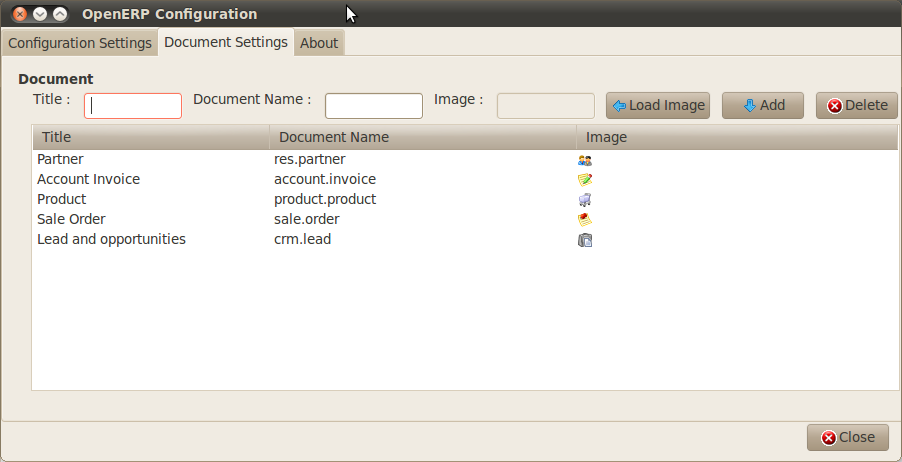

.. i18n: .. _part2-crm-communicate:
.. i18n: 
.. i18n: .. index::
.. i18n:    single: module; outlook, thunderbird
.. i18n:    single: module; fetchmail
.. i18n:    single: gateway
..

.. _part2-crm-communicate:

.. index::
   single: module; outlook, thunderbird
   single: module; fetchmail
   single: gateway

.. i18n: Connecting with your Email and Accessing from your Mobile Device
.. i18n: ================================================================
..

Connecting with your Email and Accessing from your Mobile Device
================================================================

.. i18n:  *OpenERP provides all the information you need to pursue your company's business opportunities
.. i18n:  effectively. But to stay productive with all the information you have to handle, it is essential 
.. i18n:  that you can keep using your normal communication tools by interfacing them with OpenERP, 
.. i18n:  and that you are not limited just to OpenERP's interface.*
..

 *OpenERP provides all the information you need to pursue your company's business opportunities
 effectively. But to stay productive with all the information you have to handle, it is essential 
 that you can keep using your normal communication tools by interfacing them with OpenERP, 
 and that you are not limited just to OpenERP's interface.*

.. i18n: Often your sales persons are already used to working with standard email clients to manage their business. OpenERP allows you to perfectly integrate their knowledge with the use of OpenERP. 
..

Often your sales persons are already used to working with standard email clients to manage their business. OpenERP allows you to perfectly integrate their knowledge with the use of OpenERP. 

.. i18n: OpenERP offers this flexibility to those who need to continue using their traditional email programs to maintain their
.. i18n: efficiency: OpenERP can be connected to Outlook and Thunderbird. Your users can participate in many OpenERP-maintained processes without ever leaving their familiar environment, and can avoid double data entry, yet easily link information to OpenERP's database automatically.
..

OpenERP offers this flexibility to those who need to continue using their traditional email programs to maintain their
efficiency: OpenERP can be connected to Outlook and Thunderbird. Your users can participate in many OpenERP-maintained processes without ever leaving their familiar environment, and can avoid double data entry, yet easily link information to OpenERP's database automatically.

.. i18n: With the Outlook and Thunderbird plug-ins, you can create and/or open contacts directly from your email client in OpenERP without effort.
.. i18n: You can also link emails (with attachments) to OpenERP, to avoid information getting lost.
.. i18n: Both plug-ins enable you for instance to create leads based on exchanges you have with the customer.
..

With the Outlook and Thunderbird plug-ins, you can create and/or open contacts directly from your email client in OpenERP without effort.
You can also link emails (with attachments) to OpenERP, to avoid information getting lost.
Both plug-ins enable you for instance to create leads based on exchanges you have with the customer.

.. i18n: The email gateway functionality enables you to use OpenERP’s CRM without necessarily using the OpenERP interface. Up-to-date leads can automatically be stored in OpenERP just by sending and receiving emails through a specific email address. You can even answer such mails from your own mailbox.
..

The email gateway functionality enables you to use OpenERP’s CRM without necessarily using the OpenERP interface. Up-to-date leads can automatically be stored in OpenERP just by sending and receiving emails through a specific email address. You can even answer such mails from your own mailbox.

.. i18n: And of course, you can link the OpenERP meeting calendar to your mobile device.
..

And of course, you can link the OpenERP meeting calendar to your mobile device.

.. i18n: .. _ch-crm-fetchmail:
.. i18n: 
.. i18n: Communication Tools
.. i18n: -------------------
..

.. _ch-crm-fetchmail:

Communication Tools
-------------------

.. i18n: .. index:: fetchmail
..

.. index:: fetchmail

.. i18n: The *Fetchmail / Mailgateway* functionality lets you interface the CRM with incoming and outgoing emails. So you can receive mails in OpenERP and answer them directly from OpenERP.
.. i18n: You can install it when you configure the CRM, through the `Reconfigure` wizard, `Fetch Emails`, or by installing the :mod:`fetchmail` module from the list of modules.
.. i18n: Thanks to this feature, each email you receive on the specified email address may automatically create a lead, a contact or an other object in OpenERP, while keeping track of email attachments. This is an easy way to ensure that no crucial sales information gets lost.
..

The *Fetchmail / Mailgateway* functionality lets you interface the CRM with incoming and outgoing emails. So you can receive mails in OpenERP and answer them directly from OpenERP.
You can install it when you configure the CRM, through the `Reconfigure` wizard, `Fetch Emails`, or by installing the :mod:`fetchmail` module from the list of modules.
Thanks to this feature, each email you receive on the specified email address may automatically create a lead, a contact or an other object in OpenERP, while keeping track of email attachments. This is an easy way to ensure that no crucial sales information gets lost.

.. i18n: You set the generic email address you want to use, such as sales@mycompany.com, and then you tell OpenERP that every incoming email for this address should automatically be created as a lead.
..

You set the generic email address you want to use, such as sales@mycompany.com, and then you tell OpenERP that every incoming email for this address should automatically be created as a lead.

.. i18n: .. tip:: Objects
.. i18n: 
.. i18n:        You can use this feature for any object in OpenERP, so for instance also to keep track of your helpdesk or job applications.
..

.. tip:: Objects

       You can use this feature for any object in OpenERP, so for instance also to keep track of your helpdesk or job applications.

.. i18n: To use the email gateway, you should install the `Fetchmail` module. You might need a system administrator to carry out this work.
..

To use the email gateway, you should install the `Fetchmail` module. You might need a system administrator to carry out this work.

.. i18n: If you followed the steps in the previous chapters, you should have the `Fetchmail` module installed. If not, you can install the `Fetchmail` module from the Configuration Wizard (CRM Configuration Wizard, Synchronization, Fetch Emails), or from the modules list.
..

If you followed the steps in the previous chapters, you should have the `Fetchmail` module installed. If not, you can install the `Fetchmail` module from the Configuration Wizard (CRM Configuration Wizard, Synchronization, Fetch Emails), or from the modules list.

.. i18n: .. note:: Scheduled Action
.. i18n: 
.. i18n:        Click the ``Fetch email`` button to get the emails directly. OpenERP also automatically creates a **Scheduled Action** to fetch the mails every 5 minutes.
..

.. note:: Scheduled Action

       Click the ``Fetch email`` button to get the emails directly. OpenERP also automatically creates a **Scheduled Action** to fetch the mails every 5 minutes.

.. i18n: *Step 1*
..

*Step 1*

.. i18n: You can configure your incoming mail account(s) from the :menuselection:`Sales --> Configuration --> Emails --> Email Servers`.
..

You can configure your incoming mail account(s) from the :menuselection:`Sales --> Configuration --> Emails --> Email Servers`.

.. i18n: .. figure::  images/email_server_config.jpeg
.. i18n:    :scale: 80
.. i18n:    :align: center
.. i18n: 
.. i18n:    *How to Configure your Email Server for Incoming Mails?*
..

.. figure::  images/email_server_config.jpeg
   :scale: 80
   :align: center

   *How to Configure your Email Server for Incoming Mails?*

.. i18n: Go to :menuselection:`Tools --> Configuration --> Email Template --> Email Accounts` to define the email smtp settings.
..

Go to :menuselection:`Tools --> Configuration --> Email Template --> Email Accounts` to define the email smtp settings.

.. i18n: In the ``Description`` field, type the visible name you would like to use for the account.
..

In the ``Description`` field, type the visible name you would like to use for the account.

.. i18n: In ``Server``, type the mail server, i.e. smtp.googlemail.com.
..

In ``Server``, type the mail server, i.e. smtp.googlemail.com.

.. i18n: Type the SMTP port (e.g. 587), configure the other settings according to the specifications of your server.
..

Type the SMTP port (e.g. 587), configure the other settings according to the specifications of your server.

.. i18n: Add the User Information, such as email address for which the mails will enter OpenERP, i.e. support@mycompany.com, the user name and the password. Configure the other settings to your needs.
..

Add the User Information, such as email address for which the mails will enter OpenERP, i.e. support@mycompany.com, the user name and the password. Configure the other settings to your needs.

.. i18n: Save and click the ``Test Outgoing Connection`` button to check whether the settings are correct.
..

Save and click the ``Test Outgoing Connection`` button to check whether the settings are correct.

.. i18n: When everything is correctly configured, `Approve` the account. OpenERP will automatically create a Scheduler for the mails. You can also send/receive mails manually by clicking the ``Send/Receive`` button.
..

When everything is correctly configured, `Approve` the account. OpenERP will automatically create a Scheduler for the mails. You can also send/receive mails manually by clicking the ``Send/Receive`` button.

.. i18n: *Step 2*
..

*Step 2*

.. i18n: You can configure your outgoing mail account(s) from the :menuselection:`Tools --> Configuration --> Email Template --> Email Accounts`.
..

You can configure your outgoing mail account(s) from the :menuselection:`Tools --> Configuration --> Email Template --> Email Accounts`.

.. i18n: .. figure::  images/outgoing_server_config.jpeg
.. i18n:    :scale: 80
.. i18n:    :align: center
.. i18n: 
.. i18n:    *How to Configure your Email Server for Outgoing Mails?*
..

.. figure::  images/outgoing_server_config.jpeg
   :scale: 80
   :align: center

   *How to Configure your Email Server for Outgoing Mails?*

.. i18n: Go to Sales > Configuration > Emails > Email Servers to define the email server settings.
..

Go to Sales > Configuration > Emails > Email Servers to define the email server settings.

.. i18n: Assign a ``Name`` and select the ``Server Type``, i.e. IMAP Server.
..

Assign a ``Name`` and select the ``Server Type``, i.e. IMAP Server.

.. i18n: Click ``Add Attachments`` if you want to include attachments for the mails received / sent.
..

Click ``Add Attachments`` if you want to include attachments for the mails received / sent.

.. i18n: Enter the Server Information, check SSL if necessary, i.e. imap.googlemail.com and the Login Information.
..

Enter the Server Information, check SSL if necessary, i.e. imap.googlemail.com and the Login Information.

.. i18n: You can also choose to send an automatic reply on receipt of the mail. You can configure the mail here from the ``Email Server Action`` field.
..

You can also choose to send an automatic reply on receipt of the mail. You can configure the mail here from the ``Email Server Action`` field.

.. i18n: Assign the ``Model`` to use when a new email arrives, i.e. choose Lead (crm.leads) if you want every new email that arrives to be created as a lead. 
..

Assign the ``Model`` to use when a new email arrives, i.e. choose Lead (crm.leads) if you want every new email that arrives to be created as a lead. 

.. i18n: Click `Confirm` to confirm the account settings.
..

Click `Confirm` to confirm the account settings.

.. i18n: .. note:: Server Configuration
.. i18n: 
.. i18n:        You will also need your administrator to configure your server settings to allow for an email gateway. This will not be explained
.. i18n:        in this book.
..

.. note:: Server Configuration

       You will also need your administrator to configure your server settings to allow for an email gateway. This will not be explained
       in this book.

.. i18n: .. index:: Outlook (Microsoft)
..

.. index:: Outlook (Microsoft)

.. i18n: .. _outl:
.. i18n: 
.. i18n: Managing your CRM from Microsoft Outlook
.. i18n: ----------------------------------------
..

.. _outl:

Managing your CRM from Microsoft Outlook
----------------------------------------

.. i18n: The Microsoft Outlook plug-in enables you to carry out a series of OpenERP operations quickly and directly
.. i18n: from the Outlook email client:
..

The Microsoft Outlook plug-in enables you to carry out a series of OpenERP operations quickly and directly
from the Outlook email client:

.. i18n: * create a contact or partner from an email,
.. i18n: 
.. i18n: * open a partner from an email,
.. i18n: 
.. i18n: * save an email and its attachments in OpenERP from your mailbox,
.. i18n: 
.. i18n: * send any attachment to an OpenERP document (such as opportunities, customers).
..

* create a contact or partner from an email,

* open a partner from an email,

* save an email and its attachments in OpenERP from your mailbox,

* send any attachment to an OpenERP document (such as opportunities, customers).

.. i18n: Thanks to the plug-in, you can effortlessly link emails and attachments to the corresponding opportunity in OpenERP, or link an attached product folder to a customer, for instance.
..

Thanks to the plug-in, you can effortlessly link emails and attachments to the corresponding opportunity in OpenERP, or link an attached product folder to a customer, for instance.

.. i18n: .. tip:: Outlook Versions
.. i18n: 
.. i18n: 	The Microsoft Outlook plug-in works with Microsoft Outlook 2003 and 2007, but not with Outlook Express.
..

.. tip:: Outlook Versions

	The Microsoft Outlook plug-in works with Microsoft Outlook 2003 and 2007, but not with Outlook Express.

.. i18n: In this chapter, only the actual possibilities of the plug-in will be discussed. For more information about how to install and configure the Outlook plug-in, please refer to the chapter :ref:`outlook`.
..

In this chapter, only the actual possibilities of the plug-in will be discussed. For more information about how to install and configure the Outlook plug-in, please refer to the chapter :ref:`outlook`.

.. i18n: From the Outlook toolbar, have a look at the :menuselection:`Tools` menu.
..

From the Outlook toolbar, have a look at the :menuselection:`Tools` menu.

.. i18n: The `Push` option allows you to archive emails to OpenERP, either to new document types or to existing ones (such as Leads). It also allows you to create a new contact.
..

The `Push` option allows you to archive emails to OpenERP, either to new document types or to existing ones (such as Leads). It also allows you to create a new contact.

.. i18n: The `Partner` option allows you to open the Partner in OpenERP according to the email (i.e. contact email address) selected. 
..

The `Partner` option allows you to open the Partner in OpenERP according to the email (i.e. contact email address) selected. 

.. i18n: With `Document`, you can open the document (i.e. a customer, an opportunity) concerned in OpenERP. Make sure your web server is running to use this functionality. 
..

With `Document`, you can open the document (i.e. a customer, an opportunity) concerned in OpenERP. Make sure your web server is running to use this functionality. 

.. i18n: .. figure::  images/outlook_config2.png
.. i18n:    :scale: 100
.. i18n:    :align: center
.. i18n: 
.. i18n:    *How to Access OpenERP from Outlook?*
..

.. figure::  images/outlook_config2.png
   :scale: 100
   :align: center

   *How to Access OpenERP from Outlook?*

.. i18n: * Link an email to an existing document in OpenERP
..

* Link an email to an existing document in OpenERP

.. i18n: To archive an email in OpenERP from Outlook, select the email and click the `Push` button. Alternatively you can open the menu :menuselection:`Tools --> Push`: the ``Push to OpenERP`` screen will open.
..

To archive an email in OpenERP from Outlook, select the email and click the `Push` button. Alternatively you can open the menu :menuselection:`Tools --> Push`: the ``Push to OpenERP`` screen will open.

.. i18n: In the ``Link to an Existing Document`` section, check *Partner*. Then select the customer you want to attach the selected mail to.
.. i18n: The plug-in also allows you to select several customers at once, simply by selecting a customer and pressing the ``ctrl`` button while selecting the next one.
..

In the ``Link to an Existing Document`` section, check *Partner*. Then select the customer you want to attach the selected mail to.
The plug-in also allows you to select several customers at once, simply by selecting a customer and pressing the ``ctrl`` button while selecting the next one.

.. i18n: Suppose you decide to no longer link the selected email to a customer, but instead to an opportunity. Then you have to click the ``Search`` button to refresh the `Documents` list to display your opportunities.    
..

Suppose you decide to no longer link the selected email to a customer, but instead to an opportunity. Then you have to click the ``Search`` button to refresh the `Documents` list to display your opportunities.    

.. i18n: From the list of available documents, you can select any document type you defined in the ``Document Settings`` section. 
..

From the list of available documents, you can select any document type you defined in the ``Document Settings`` section. 

.. i18n: * Create a New Document
..

* Create a New Document

.. i18n: This feature can be used to create any of the configured document types in the ``Document Settings`` tab.
.. i18n: Suppose you would like to create a new lead from an email. In the ``Create a New Document`` section, select ``CRM Lead``, then click the ``Create`` button. A new lead will be created in OpenERP from the selected email.
..

This feature can be used to create any of the configured document types in the ``Document Settings`` tab.
Suppose you would like to create a new lead from an email. In the ``Create a New Document`` section, select ``CRM Lead``, then click the ``Create`` button. A new lead will be created in OpenERP from the selected email.

.. i18n: * Create a New Contact / Partner
..

* Create a New Contact / Partner

.. i18n: If the partner or contact from your email does not exist in OpenERP yet, the Outlook plug-in allows you to
.. i18n: create one on the fly simply by using the information contained in the email.
..

If the partner or contact from your email does not exist in OpenERP yet, the Outlook plug-in allows you to
create one on the fly simply by using the information contained in the email.

.. i18n: Select the email from which you want to create a new contact, then click the ``Push`` button.
.. i18n: In the ``Create a New Contact`` section, click the ``New Contact`` button. This option offers two possibilities:
.. i18n: either you just create a contact (address), or you create a partner with the contact linked to it.
..

Select the email from which you want to create a new contact, then click the ``Push`` button.
In the ``Create a New Contact`` section, click the ``New Contact`` button. This option offers two possibilities:
either you just create a contact (address), or you create a partner with the contact linked to it.

.. i18n: 	- When you just want to create a new contact, complete the address data in the dialog box and click the ``Save`` button.
.. i18n: 	  The contact will then be created in OpenERP.
.. i18n: 
.. i18n: 	- When you also want to create a new partner, complete the contact data.
.. i18n: 	  Then click the ``Create Partner`` button, add the partner's name and click the ``Save`` button.
.. i18n: 
.. i18n: 	- You can also add a new contact to an existing partner. Click the ``Search`` button next to the Partner field
.. i18n: 	  and select the corresponding partner from the list. Then complete the contact data and click the ``Save`` button.
..

	- When you just want to create a new contact, complete the address data in the dialog box and click the ``Save`` button.
	  The contact will then be created in OpenERP.

	- When you also want to create a new partner, complete the contact data.
	  Then click the ``Create Partner`` button, add the partner's name and click the ``Save`` button.

	- You can also add a new contact to an existing partner. Click the ``Search`` button next to the Partner field
	  and select the corresponding partner from the list. Then complete the contact data and click the ``Save`` button.

.. i18n: .. figure::  images/outlook_creation.png
.. i18n:    :scale: 100
.. i18n:    :align: center
.. i18n: 
.. i18n:    *Creating a Contact on the Fly from Outlook*
..

.. figure::  images/outlook_creation.png
   :scale: 100
   :align: center

   *Creating a Contact on the Fly from Outlook*

.. i18n: * Open the Document created in OpenERP
..

* Open the Document created in OpenERP

.. i18n: From your mailbox, simply by clicking an email, you can directly access the corresponding data in OpenERP. Go to the menu :menuselection:`Tools --> Document` which will open the corresponding document (e.g. a lead) in OpenERP, directly from the email you selected.
..

From your mailbox, simply by clicking an email, you can directly access the corresponding data in OpenERP. Go to the menu :menuselection:`Tools --> Document` which will open the corresponding document (e.g. a lead) in OpenERP, directly from the email you selected.

.. i18n: .. tip:: Knowledge Management
.. i18n: 
.. i18n: 	The Outlook plug-in is compatible with OpenERP's Knowledge (i.e. Document) Management. If you install the
.. i18n: 	Knowledge application you will be able to:
.. i18n: 
.. i18n: 	* search through the content of your company's documents (those that have the type .doc, .pdf, .sxw
.. i18n: 	  and .odt) and also in archived emails,
.. i18n: 
.. i18n: 	* have a shared file system that is connected to various OpenERP documents to share information and
.. i18n: 	  access it with your favorite browser,
.. i18n: 
.. i18n: 	* organize and structure your documents (such as projects, partners and users) in OpenERP's
.. i18n: 	  system.
..

.. tip:: Knowledge Management

	The Outlook plug-in is compatible with OpenERP's Knowledge (i.e. Document) Management. If you install the
	Knowledge application you will be able to:

	* search through the content of your company's documents (those that have the type .doc, .pdf, .sxw
	  and .odt) and also in archived emails,

	* have a shared file system that is connected to various OpenERP documents to share information and
	  access it with your favorite browser,

	* organize and structure your documents (such as projects, partners and users) in OpenERP's
	  system.

.. i18n: * Step 1: Install the Outlook plugin in OpenERP
..

* Step 1: Install the Outlook plugin in OpenERP

.. i18n: Use the OpenERP Configuration Wizard and install the ``Customer Relationship Management`` application. In the *CRM Application Configuration* dialog under Plug-In, select `MS-Outlook`.
.. i18n: Then the *Outlook Plug-In* wizard appears. Next to the ``Outlook Plug-in`` field, click the ``Save As`` button to save the plugin to your desktop (or any other location on your computer).
..

Use the OpenERP Configuration Wizard and install the ``Customer Relationship Management`` application. In the *CRM Application Configuration* dialog under Plug-In, select `MS-Outlook`.
Then the *Outlook Plug-In* wizard appears. Next to the ``Outlook Plug-in`` field, click the ``Save As`` button to save the plugin to your desktop (or any other location on your computer).

.. i18n: You can also download the installation manual by clicking the green arrow next to ``Installation Manual``.  
..

You can also download the installation manual by clicking the green arrow next to ``Installation Manual``.  

.. i18n: Another way to use the Outlook plugin, is by installing the OpenERP module \
.. i18n: ``outlook``\. When you install this module, the same Configuration Wizard as explained before will be displayed. Follow the same instructions.
..

Another way to use the Outlook plugin, is by installing the OpenERP module \
``outlook``\. When you install this module, the same Configuration Wizard as explained before will be displayed. Follow the same instructions.

.. i18n: * Step 2: Prerequisites (for more details, please refer to the online documentation)
.. i18n: 
.. i18n:   1. Install Python 2.6+
.. i18n: 
.. i18n:   2. Python for Windows extensions - PyWin32, this module for python must be installed for the appropriate version of Python.
.. i18n: 
.. i18n:   3. Specify the python folder in the system path (typically with this installer C:\Python26)
..

* Step 2: Prerequisites (for more details, please refer to the online documentation)

  1. Install Python 2.6+

  2. Python for Windows extensions - PyWin32, this module for python must be installed for the appropriate version of Python.

  3. Specify the python folder in the system path (typically with this installer C:\Python26)

.. i18n:   *How to set the path in Windows XP*
.. i18n:   For Windows XP: http://www.computerhope.com/issues/ch000549.htm
.. i18n:     
.. i18n:   *How to set the path in Windows 7*
.. i18n:   To change the system environment variables, follow the steps below. 
..

  *How to set the path in Windows XP*
  For Windows XP: http://www.computerhope.com/issues/ch000549.htm
    
  *How to set the path in Windows 7*
  To change the system environment variables, follow the steps below. 

.. i18n:    - From the Windows button, select ``Control Panel``, then click ``System``. 
.. i18n:    - Click ``Remote Settings`` to open the System Properties window.
.. i18n:    - In the System Properties window, click the Advanced tab. 
.. i18n:    - In the Advanced section, click the ``Environment Variables`` button. 
.. i18n:    - Finally, in the Environment Variables window (as shown below) under System Variables, highlight the Path directory,
.. i18n:      click Edit and add ;C:\Python26.
.. i18n: 
.. i18n:   4. If you are using MS Outlook 2007 then you are required to install "Microsoft Exchange Server MAPI Client and Collaboration
.. i18n:   Data Objects 1.2.1 (CDO 1.21)"
.. i18n:   Double-click Exchange CDO to install it.
.. i18n: 
.. i18n:   5. If you are using MS Outlook 2003, be sure to install the built-in CDO component.
.. i18n: 
.. i18n: * Step 3: Install the OpenERP extension in Outlook.
.. i18n: 
.. i18n: 	#. Double-click the file \``OpenERP-Outlook-addin.exe``\ that you saved on your desktop. Confirm the default settings.
.. i18n: 
.. i18n: 	#. Double-click the file \``Register plugin``\ in the OpenERP Outlook Addin folder (typically in C:\Program Files).
.. i18n: 
.. i18n: 	#. Start Outlook.
..

   - From the Windows button, select ``Control Panel``, then click ``System``. 
   - Click ``Remote Settings`` to open the System Properties window.
   - In the System Properties window, click the Advanced tab. 
   - In the Advanced section, click the ``Environment Variables`` button. 
   - Finally, in the Environment Variables window (as shown below) under System Variables, highlight the Path directory,
     click Edit and add ;C:\Python26.

  4. If you are using MS Outlook 2007 then you are required to install "Microsoft Exchange Server MAPI Client and Collaboration
  Data Objects 1.2.1 (CDO 1.21)"
  Double-click Exchange CDO to install it.

  5. If you are using MS Outlook 2003, be sure to install the built-in CDO component.

* Step 3: Install the OpenERP extension in Outlook.

	#. Double-click the file \``OpenERP-Outlook-addin.exe``\ that you saved on your desktop. Confirm the default settings.

	#. Double-click the file \``Register plugin``\ in the OpenERP Outlook Addin folder (typically in C:\Program Files).

	#. Start Outlook.

.. i18n: When you have executed Installation Step 1, Step 2 and Step 3, the first thing to do is connect Outlook to OpenERP.
.. i18n: A little configuration needs to be done.
..

When you have executed Installation Step 1, Step 2 and Step 3, the first thing to do is connect Outlook to OpenERP.
A little configuration needs to be done.

.. i18n: .. tip:: Toolbars 
.. i18n: 
.. i18n:       If you want the OpenERP connection to be shown as a separate toolbar, go to the menu :menuselection:`View --> Toolbars`. Select ``OpenERP``.
..

.. tip:: Toolbars 

      If you want the OpenERP connection to be shown as a separate toolbar, go to the menu :menuselection:`View --> Toolbars`. Select ``OpenERP``.

.. i18n: * Go to the menu :menuselection:`Tools` and select `Configuration`. If this raises an error, make sure to check the access rights to that particular folder.
..

* Go to the menu :menuselection:`Tools` and select `Configuration`. If this raises an error, make sure to check the access rights to that particular folder.

.. i18n: A configuration window appears enabling you to enter configuration data about your OpenERP server.
..

A configuration window appears enabling you to enter configuration data about your OpenERP server.

.. i18n: .. figure::  images/outlook_menu2.png
.. i18n:    :scale: 75
.. i18n:    :align: center
.. i18n: 
.. i18n:    *How to Connect to the Server*
.. i18n: 
.. i18n: 	#. On the ``Configuration Settings`` tab, under *Connection Parameters* click the `Change` button
.. i18n: 	   and type your server settings and XML-RPC port, e.g. ``http://127.0.0.1:8069``,
.. i18n: 
.. i18n: 	#. Select the database you want to connect to, and type the user and the password required to log in to the database,
.. i18n: 
.. i18n: 	#. Click the `Connect` button,
.. i18n: 
.. i18n: 	#. On the ``Configuration Settings`` tab, under *Webserver Parameters* click the `Change` button
.. i18n: 	   and type your web server settings, e.g. ``http://localhost:8080``,
.. i18n: 
.. i18n: 	#. Click the `Open` button to test the connection.
..

.. figure::  images/outlook_menu2.png
   :scale: 75
   :align: center

   *How to Connect to the Server*

	#. On the ``Configuration Settings`` tab, under *Connection Parameters* click the `Change` button
	   and type your server settings and XML-RPC port, e.g. ``http://127.0.0.1:8069``,

	#. Select the database you want to connect to, and type the user and the password required to log in to the database,

	#. Click the `Connect` button,

	#. On the ``Configuration Settings`` tab, under *Webserver Parameters* click the `Change` button
	   and type your web server settings, e.g. ``http://localhost:8080``,

	#. Click the `Open` button to test the connection.

.. i18n: When your connection has succeeded, you would typically want to configure Outlook to fit your needs.
..

When your connection has succeeded, you would typically want to configure Outlook to fit your needs.

.. i18n: To define extra document types, go to the `Document Settings` tab. This is the place where you can add objects from OpenERP that you wish to link mails to. The default installation comes with a number of predefined documents, such as Partners, Leads and Sales Orders.
..

To define extra document types, go to the `Document Settings` tab. This is the place where you can add objects from OpenERP that you wish to link mails to. The default installation comes with a number of predefined documents, such as Partners, Leads and Sales Orders.

.. i18n: Here is an example of how to configure extra document types. Suppose you would like to link mails to a meeting:
..

Here is an example of how to configure extra document types. Suppose you would like to link mails to a meeting:

.. i18n: 	#. In the `Title`, type ``Meeting``,
.. i18n: 
.. i18n: 	#. In the `Document`, type the object from OpenERP, in this example ``crm.meeting``,
.. i18n: 
.. i18n: 	#. In the `Image`, select an icon you would like to use,
.. i18n: 
.. i18n: 	#. Click the `Add` button to actually create the document type.
..

	#. In the `Title`, type ``Meeting``,

	#. In the `Document`, type the object from OpenERP, in this example ``crm.meeting``,

	#. In the `Image`, select an icon you would like to use,

	#. Click the `Add` button to actually create the document type.

.. i18n: .. note:: A Word about Objects
.. i18n: 
.. i18n:        To find the object you need in OpenERP, go to the menu :menuselection:`Administration --> Customization --> Database Structure -->
.. i18n:        Objects`. OpenERP will only show objects for which the corresponding Business Applications / Modules have been installed.
.. i18n:        You can only add objects to Outlook that are available in the selected database.
..

.. note:: A Word about Objects

       To find the object you need in OpenERP, go to the menu :menuselection:`Administration --> Customization --> Database Structure -->
       Objects`. OpenERP will only show objects for which the corresponding Business Applications / Modules have been installed.
       You can only add objects to Outlook that are available in the selected database.

.. i18n: .. index::
.. i18n:    single: Thunderbird (Mozilla)
..

.. index::
   single: Thunderbird (Mozilla)

.. i18n: .. _thunder:
.. i18n: 
.. i18n: Managing your CRM from Mozilla Thunderbird
.. i18n: ------------------------------------------
..

.. _thunder:

Managing your CRM from Mozilla Thunderbird
------------------------------------------

.. i18n: With the Mozilla Thunderbird plug-in you can carry out a series of OpenERP operations directly from Thunderbird, such as:
..

With the Mozilla Thunderbird plug-in you can carry out a series of OpenERP operations directly from Thunderbird, such as:

.. i18n: * create a contact or partner from an email,
.. i18n: 
.. i18n: * open a partner from an email,
.. i18n: 
.. i18n: * save an email and its attachments in OpenERP,
.. i18n: 
.. i18n: * send any attachment to an OpenERP document (such as opportunities, customers).
..

* create a contact or partner from an email,

* open a partner from an email,

* save an email and its attachments in OpenERP,

* send any attachment to an OpenERP document (such as opportunities, customers).

.. i18n: Thanks to the plug-in, you can effortlessly link emails and attachments to the corresponding opportunity in OpenERP, or link an attached product folder to a customer, for instance.
..

Thanks to the plug-in, you can effortlessly link emails and attachments to the corresponding opportunity in OpenERP, or link an attached product folder to a customer, for instance.

.. i18n: In this chapter, only the actual possibilities of the plug-in will be discussed. For more information about how to install and configure the Thunderbird plug-in, please refer to the chapter :ref:`thunderbird`.
..

In this chapter, only the actual possibilities of the plug-in will be discussed. For more information about how to install and configure the Thunderbird plug-in, please refer to the chapter :ref:`thunderbird`.

.. i18n: From the Thunderbird toolbar, have a look at the :menuselection:`OpenERP` menu.
..

From the Thunderbird toolbar, have a look at the :menuselection:`OpenERP` menu.

.. i18n: The `Push` option allows you to archive emails to OpenERP, either to new document types or to existing ones. It also allows you to create a new contact.
..

The `Push` option allows you to archive emails to OpenERP, either to new document types or to existing ones. It also allows you to create a new contact.

.. i18n: The `Partner` allows you to open the Partner in OpenERP according to the email (i.e. contact email address) selected. 
..

The `Partner` allows you to open the Partner in OpenERP according to the email (i.e. contact email address) selected. 

.. i18n: With `Document`, you can open the document (i.e. a customer, an opportunity) concerned in OpenERP. Make sure your web server is running to use this functionality. You have to open the mail to use this feature. 
..

With `Document`, you can open the document (i.e. a customer, an opportunity) concerned in OpenERP. Make sure your web server is running to use this functionality. You have to open the mail to use this feature. 

.. i18n: * Link an email to an existing document in OpenERP
..

* Link an email to an existing document in OpenERP

.. i18n: .. figure::  images/thunderbird_selection.png
.. i18n:    :scale: 100
.. i18n:    :align: center
.. i18n: 
.. i18n:    *How to Access OpenERP from Thunderbird?*
..

.. figure::  images/thunderbird_selection.png
   :scale: 100
   :align: center

   *How to Access OpenERP from Thunderbird?*

.. i18n: To archive an email in OpenERP from Thunderbird, select the email and click the `Push` button. Alternatively you can open the menu :menuselection:`OpenERP --> Push`: the ``Push to OpenERP`` screen will open.
..

To archive an email in OpenERP from Thunderbird, select the email and click the `Push` button. Alternatively you can open the menu :menuselection:`OpenERP --> Push`: the ``Push to OpenERP`` screen will open.

.. i18n: In the ``Link to an Existing Document`` section, check *Partner*. Then select the customer you want to attach the selected mail to.
.. i18n: The plug-in also allows you to select several customers at once, simply by selecting a customer and pressing the ``ctrl`` button while selecting the next one.
..

In the ``Link to an Existing Document`` section, check *Partner*. Then select the customer you want to attach the selected mail to.
The plug-in also allows you to select several customers at once, simply by selecting a customer and pressing the ``ctrl`` button while selecting the next one.

.. i18n: Suppose you decide to no longer link the selected email to a customer, but instead to an opportunity. Then you have to click the ``Search`` button to refresh the `Documents` list to display your opportunities.    
..

Suppose you decide to no longer link the selected email to a customer, but instead to an opportunity. Then you have to click the ``Search`` button to refresh the `Documents` list to display your opportunities.    

.. i18n: From the list of available documents, you can select any document type you defined in the ``Document Settings`` section. 
..

From the list of available documents, you can select any document type you defined in the ``Document Settings`` section. 

.. i18n: * Create a New Document
..

* Create a New Document

.. i18n: This feature can be used to create any of the configured document types in the ``Document Settings`` tab.
.. i18n: Suppose you would like to create a new lead from an email. In the ``Create a New Document`` section, select ``CRM Lead``, then click the ``Create`` button. A new lead will be created in OpenERP from the selected email.
..

This feature can be used to create any of the configured document types in the ``Document Settings`` tab.
Suppose you would like to create a new lead from an email. In the ``Create a New Document`` section, select ``CRM Lead``, then click the ``Create`` button. A new lead will be created in OpenERP from the selected email.

.. i18n: * Create a New Contact / Partner
..

* Create a New Contact / Partner

.. i18n: If the partner or contact from your email does not exist in OpenERP yet, the Thunderbird plug-in allows you to
.. i18n: create one on the fly simply by using the information contained in the email.
..

If the partner or contact from your email does not exist in OpenERP yet, the Thunderbird plug-in allows you to
create one on the fly simply by using the information contained in the email.

.. i18n: Select the email from which you want to create a new contact, then click the ``Push`` button.
.. i18n: In the ``Create a New Contact`` section, click the ``New Contact`` button. This option offers two possibilities:
.. i18n: either you just create a contact (address), or you create a partner with the contact linked to it.
..

Select the email from which you want to create a new contact, then click the ``Push`` button.
In the ``Create a New Contact`` section, click the ``New Contact`` button. This option offers two possibilities:
either you just create a contact (address), or you create a partner with the contact linked to it.

.. i18n: 	- When you just want to create a new contact, complete the address data in the dialog box and click the ``Save`` button.
.. i18n: 	  The contact will then be created in OpenERP.
.. i18n: 
.. i18n: 	- When you also want to create a new partner, complete the contact data.
.. i18n: 	  Then click the ``Create Partner`` button, add the partner's name and click the ``Save`` button.
.. i18n: 
.. i18n: 	- You can also add a new contact to an existing partner. Click the ``Search`` button next to the Partner field
.. i18n: 	  and select the corresponding partner from the list. Then complete the contact data and click the ``Save`` button.
..

	- When you just want to create a new contact, complete the address data in the dialog box and click the ``Save`` button.
	  The contact will then be created in OpenERP.

	- When you also want to create a new partner, complete the contact data.
	  Then click the ``Create Partner`` button, add the partner's name and click the ``Save`` button.

	- You can also add a new contact to an existing partner. Click the ``Search`` button next to the Partner field
	  and select the corresponding partner from the list. Then complete the contact data and click the ``Save`` button.

.. i18n: .. figure::  images/thunderbird_creation.png
.. i18n:    :scale: 75
.. i18n:    :align: center
.. i18n: 
.. i18n:    *Creating a Contact on the Fly from Thunderbird*
..

.. figure::  images/thunderbird_creation.png
   :scale: 75
   :align: center

   *Creating a Contact on the Fly from Thunderbird*

.. i18n: * Open the Document created in OpenERP
..

* Open the Document created in OpenERP

.. i18n: From your mailbox, simply by clicking an email, you can directly access the corresponding data in OpenERP. Go to the menu :menuselection:`Tools --> Document` which will open the corresponding document (e.g. a lead) in OpenERP, directly from the email you selected.
..

From your mailbox, simply by clicking an email, you can directly access the corresponding data in OpenERP. Go to the menu :menuselection:`Tools --> Document` which will open the corresponding document (e.g. a lead) in OpenERP, directly from the email you selected.

.. i18n: .. tip:: Knowledge Management
.. i18n: 
.. i18n: 	The Thunderbird plug-in is compatible with OpenERP's Knowledge (i.e. Document) Management. If you install the
.. i18n: 	Knowledge application you will be able to:
.. i18n: 
.. i18n: 	* search through the content of your company's documents (those that have the type .doc, .pdf, .sxw
.. i18n: 	  and .odt) and also in archived emails,
.. i18n: 
.. i18n: 	* have a shared file system that is connected to various OpenERP documents to share information and
.. i18n: 	  access it with your favorite browser,
..

.. tip:: Knowledge Management

	The Thunderbird plug-in is compatible with OpenERP's Knowledge (i.e. Document) Management. If you install the
	Knowledge application you will be able to:

	* search through the content of your company's documents (those that have the type .doc, .pdf, .sxw
	  and .odt) and also in archived emails,

	* have a shared file system that is connected to various OpenERP documents to share information and
	  access it with your favorite browser,

.. i18n: * Step 1: Install the Thunderbird plugin in OpenERP
..

* Step 1: Install the Thunderbird plugin in OpenERP

.. i18n: Use the OpenERP Configuration Wizard and install the ``Customer Relationship Management`` application. In the *CRM Application Configuration* dialog under Plug-In, select `Thunderbird`.
.. i18n: Then the *Thunderbird Plug-In* wizard appears. Next to the ``Thunderbird Plug-in`` field, click the ``Save As`` button to save the plugin to your desktop (or any other location on your computer).
..

Use the OpenERP Configuration Wizard and install the ``Customer Relationship Management`` application. In the *CRM Application Configuration* dialog under Plug-In, select `Thunderbird`.
Then the *Thunderbird Plug-In* wizard appears. Next to the ``Thunderbird Plug-in`` field, click the ``Save As`` button to save the plugin to your desktop (or any other location on your computer).

.. i18n: You can also download the installation manual by clicking the orange arrow next to ``Installation Manual``.  
..

You can also download the installation manual by clicking the orange arrow next to ``Installation Manual``.  

.. i18n: Another way to use the Thunderbird plugin, is by installing the OpenERP module \
.. i18n: ``thunderbird``\. When you install this module, the same Configuration Wizard as explained before will be displayed. Follow the same instructions.
..

Another way to use the Thunderbird plugin, is by installing the OpenERP module \
``thunderbird``\. When you install this module, the same Configuration Wizard as explained before will be displayed. Follow the same instructions.

.. i18n: * Step 2: Install the OpenERP extension in Thunderbird.
..

* Step 2: Install the OpenERP extension in Thunderbird.

.. i18n: To do that, use the file \``openerp_plugin.xpi``\ that you saved on your desktop. 
..

To do that, use the file \``openerp_plugin.xpi``\ that you saved on your desktop. 

.. i18n: Then proceed as follows:
..

Then proceed as follows:

.. i18n: 	#. From Thunderbird, open the menu :menuselection:`Tools --> Add-ons`.
.. i18n: 
.. i18n: 	#. Click Extensions, then click the `Install` button.
.. i18n: 
.. i18n: 	#. Go to your desktop and select the file \ ``openerp_plugin.xpi``\. Click Open.
.. i18n: 
.. i18n: 	#. Click `Install Now` then restart Thunderbird.
..

	#. From Thunderbird, open the menu :menuselection:`Tools --> Add-ons`.

	#. Click Extensions, then click the `Install` button.

	#. Go to your desktop and select the file \ ``openerp_plugin.xpi``\. Click Open.

	#. Click `Install Now` then restart Thunderbird.

.. i18n: Once the extension has been installed, a new ``OpenERP`` menu item is added to your Thunderbird menubar. 
..

Once the extension has been installed, a new ``OpenERP`` menu item is added to your Thunderbird menubar. 

.. i18n: .. tip::  Thunderbird Version
.. i18n: 
.. i18n: 	The OpenERP plugin for Thunderbird works as from Thunderbird version 2.0.
.. i18n: 
.. i18n: 	So check your Thunderbird version before installing, and download the latest version that you need
.. i18n: 	from the following address: http://www.mozilla.org/products/thunderbird/
..

.. tip::  Thunderbird Version

	The OpenERP plugin for Thunderbird works as from Thunderbird version 2.0.

	So check your Thunderbird version before installing, and download the latest version that you need
	from the following address: http://www.mozilla.org/products/thunderbird/

.. i18n: When you have executed Installation Step 1 and Step 2, the first thing to do is connect Thunderbird to OpenERP.
.. i18n: A little configuration needs to be done.
..

When you have executed Installation Step 1 and Step 2, the first thing to do is connect Thunderbird to OpenERP.
A little configuration needs to be done.

.. i18n: .. note:: Before starting the configuration, make sure your GTK server and web server are running (XML-RPC should be allowed).
..

.. note:: Before starting the configuration, make sure your GTK server and web server are running (XML-RPC should be allowed).

.. i18n: Go to the ``OpenERP`` menubar and select ` Configuration`.
..

Go to the ``OpenERP`` menubar and select ` Configuration`.

.. i18n: A configuration window appears enabling you to enter configuration data about your OpenERP server.
..

A configuration window appears enabling you to enter configuration data about your OpenERP server.

.. i18n: .. figure::  images/thunderbird_config.png
.. i18n:    :scale: 75
.. i18n:    :align: center
.. i18n: 
.. i18n:    *How to Connect to the Server*
.. i18n: 
.. i18n: 	#. On the ``Configuration Settings`` tab, under *Connection Parameters* click the `Change` button
.. i18n: 	   and type your server settings and XML-RPC port, e.g. ``http://127.0.0.1:8069``,
.. i18n: 
.. i18n: 	#. Select the database you want to connect to, and type the user and the password required to log in to the database,
.. i18n: 
.. i18n: 	#. Click the `Connect` button,
.. i18n: 
.. i18n: 	#. On the ``Configuration Settings`` tab, under *Webserver Parameters* click the `Change` button
.. i18n: 	   and type your web server settings, e.g. ``http://localhost:8080``,
.. i18n: 
.. i18n: 	#. Click the `Open` button to test the connection.
..

.. figure::  images/thunderbird_config.png
   :scale: 75
   :align: center

   *How to Connect to the Server*

	#. On the ``Configuration Settings`` tab, under *Connection Parameters* click the `Change` button
	   and type your server settings and XML-RPC port, e.g. ``http://127.0.0.1:8069``,

	#. Select the database you want to connect to, and type the user and the password required to log in to the database,

	#. Click the `Connect` button,

	#. On the ``Configuration Settings`` tab, under *Webserver Parameters* click the `Change` button
	   and type your web server settings, e.g. ``http://localhost:8080``,

	#. Click the `Open` button to test the connection.

.. i18n: When your connection has succeeded, you would typically want to configure Thunderbird to fit your needs.
..

When your connection has succeeded, you would typically want to configure Thunderbird to fit your needs.

.. i18n: To define extra document types, go to the `Document Settings` tab. This is the place where you can add objects from OpenERP that you wish to link mails to. The default installation comes with a number of predefined documents, such as Partners, Leads and Sales Orders.
..

To define extra document types, go to the `Document Settings` tab. This is the place where you can add objects from OpenERP that you wish to link mails to. The default installation comes with a number of predefined documents, such as Partners, Leads and Sales Orders.

.. i18n: Here is an example of how to configure extra document types. Suppose you would like to link mails to a purchase order.
..

Here is an example of how to configure extra document types. Suppose you would like to link mails to a purchase order.

.. i18n: 	#. In the `Title`, type ``Purchase Order``,
.. i18n: 
.. i18n: 	#. In the `Document`, type the object from OpenERP, in this example ``purchase.order``,
.. i18n: 
.. i18n: 	#. In the `Image`, select an icon you would like to use,
.. i18n: 
.. i18n: 	#. Click the `Add` button to actually create the document type.
..

	#. In the `Title`, type ``Purchase Order``,

	#. In the `Document`, type the object from OpenERP, in this example ``purchase.order``,

	#. In the `Image`, select an icon you would like to use,

	#. Click the `Add` button to actually create the document type.

.. i18n: .. note:: A Word about Objects 
.. i18n: 
.. i18n:        To find the object you need in OpenERP, go to the menu :menuselection:`Administration --> Customization --> Database Structure -->
.. i18n:        Objects`. OpenERP will only show objects for which the corresponding Business Applications / Modules have been installed.
.. i18n:        You can only add objects to Thunderbird that are available in the selected database.
..

.. note:: A Word about Objects 

       To find the object you need in OpenERP, go to the menu :menuselection:`Administration --> Customization --> Database Structure -->
       Objects`. OpenERP will only show objects for which the corresponding Business Applications / Modules have been installed.
       You can only add objects to Thunderbird that are available in the selected database.

.. i18n: .. figure::  images/thunderbird_document.png
.. i18n:    :scale: 75
.. i18n:    :align: center
.. i18n: 
.. i18n:    *How to Add Extra OpenERP Document Types to Thunderbird?*
.. i18n:    * organize and structure your documents (such as projects, partners and users) in OpenERP's system.
..

   *How to Add Extra OpenERP Document Types to Thunderbird?*
   * organize and structure your documents (such as projects, partners and users) in OpenERP's system.

.. i18n: .. _ch-sync1:
.. i18n: 
.. i18n: Synchronizing your CRM with Mobile Devices
.. i18n: ------------------------------------------
..

.. _ch-sync1:

Synchronizing your CRM with Mobile Devices
------------------------------------------

.. i18n: Synchronize your OpenERP calendars with your mobile device and know which meeting to go to from wherever you are!
..

Synchronize your OpenERP calendars with your mobile device and know which meeting to go to from wherever you are!

.. i18n: Make your OpenERP even more efficient and let your sales synchronize their meetings with their mobile devices.
.. i18n: Anywhere your sales people are, they can easily check their planning and confirm new meetings with customers on the spot.
..

Make your OpenERP even more efficient and let your sales synchronize their meetings with their mobile devices.
Anywhere your sales people are, they can easily check their planning and confirm new meetings with customers on the spot.

.. i18n: You can synchronize your calendars with iPhone and Android phones, and also with tools such as Evolution and Sunbird/Lightning.
..

You can synchronize your calendars with iPhone and Android phones, and also with tools such as Evolution and Sunbird/Lightning.

.. i18n: .. note:: Installation and Configuration
.. i18n: 
.. i18n:        Please note that setting this up requires some technical knowledge, and probably the assistance of IT staff.
..

.. note:: Installation and Configuration

       Please note that setting this up requires some technical knowledge, and probably the assistance of IT staff.

.. i18n: .. index::
.. i18n:    single: mobile; caldav; Android; iPhone; Sunbird; Evolution; Lightning
..

.. index::
   single: mobile; caldav; Android; iPhone; Sunbird; Evolution; Lightning

.. i18n: .. _mobile:
.. i18n: 
.. i18n: OpenERP Server and SSL Setup
.. i18n: ++++++++++++++++++++++++++++
.. i18n: Some modules need to be installed on the OpenERP server (or may already be installed). These are:
..

.. _mobile:

OpenERP Server and SSL Setup
++++++++++++++++++++++++++++
Some modules need to be installed on the OpenERP server (or may already be installed). These are:

.. i18n:     - :mod:`caldav`: Required, has the reference setup and the necessary
.. i18n:             underlying code. Will also cause document & document_webdav
.. i18n:             to be installed.
.. i18n:     - :mod:`crm_caldav`: Optional, will export the CRM Meetings as a calendar.
.. i18n:     - :mod:`project_caldav`: Optional, will export project tasks as a calendar.
.. i18n:     - :mod:`http_well_known`: Optional, experimental. Will ease bootstrapping,
.. i18n:             but only when a DNS srv record is also used.
..

    - :mod:`caldav`: Required, has the reference setup and the necessary
            underlying code. Will also cause document & document_webdav
            to be installed.
    - :mod:`crm_caldav`: Optional, will export the CRM Meetings as a calendar.
    - :mod:`project_caldav`: Optional, will export project tasks as a calendar.
    - :mod:`http_well_known`: Optional, experimental. Will ease bootstrapping,
            but only when a DNS srv record is also used.

.. i18n: When you install the above module(s), a ready-to-go reference setup of the folders is provided.
.. i18n: The OpenERP administrator can add more calendars and (re)structure if needed.
..

When you install the above module(s), a ready-to-go reference setup of the folders is provided.
The OpenERP administrator can add more calendars and (re)structure if needed.

.. i18n: It is highly advisable that you also set up SSL to work for the OpenERP server. HTTPS is a server-wide feature in OpenERP, which means a 
.. i18n: certificate will be set at the openerp-server.conf which will be the same for XML-RPC, HTTP, WebDAV and CalDAV.
.. i18n: The iPhone also supports secure connections with SSL, although it does not expect a self-signed certificate (or one that is not verified by
.. i18n: one of the "big" certificate authorities).
..

It is highly advisable that you also set up SSL to work for the OpenERP server. HTTPS is a server-wide feature in OpenERP, which means a 
certificate will be set at the openerp-server.conf which will be the same for XML-RPC, HTTP, WebDAV and CalDAV.
The iPhone also supports secure connections with SSL, although it does not expect a self-signed certificate (or one that is not verified by
one of the "big" certificate authorities).

.. i18n: Calendars on iPhone
.. i18n: +++++++++++++++++++
..

Calendars on iPhone
+++++++++++++++++++

.. i18n: To set up the calendars, proceed as follows:
..

To set up the calendars, proceed as follows:

.. i18n: 1. Click ``Settings`` and go to the ``Mail, Contacts, Calendars`` page.
.. i18n: 
.. i18n: 2. Go to ``Add account...``
.. i18n: 
.. i18n: 3. Click ``Other``.
.. i18n: 
.. i18n: 4. From the ``Calendars`` group, select ``Add CalDAV Account``.
.. i18n: 
.. i18n: 5. Enter the host name.
.. i18n:    (e.g. if the URL is http://openerp.com:8069/webdav/db_1/calendars/ , openerp.com is the host)
..

1. Click ``Settings`` and go to the ``Mail, Contacts, Calendars`` page.

2. Go to ``Add account...``

3. Click ``Other``.

4. From the ``Calendars`` group, select ``Add CalDAV Account``.

5. Enter the host name.
   (e.g. if the URL is http://openerp.com:8069/webdav/db_1/calendars/ , openerp.com is the host)

.. i18n: .. tip:: Synchronize this Calendar 
.. i18n: 
.. i18n:       Go to :menuselection:`Sales --> Meetings --> Synchronize this Calendar` and select ``Iphone``. Then the Caldav server will be shown.
..

.. tip:: Synchronize this Calendar 

      Go to :menuselection:`Sales --> Meetings --> Synchronize this Calendar` and select ``Iphone``. Then the Caldav server will be shown.

.. i18n: 6. In ``Username`` and ``Password``, type your OpenERP login and password.
.. i18n: 
.. i18n: 7. As a description, you can either leave the server's name or
.. i18n:    something like "OpenERP calendars".
.. i18n: 
.. i18n: 8. If you are not using a SSL server, you will get an error, do not worry and push "Continue"
.. i18n: 
.. i18n: 9. Then click "Advanced Settings" to specify the correct ports and paths. 
.. i18n:     
.. i18n: 10. Specify the port for the OpenERP server: 8071 for SSL, 8069 without SSL.
.. i18n: 
.. i18n: 11. Set the ``Account URL`` to the right path of the OpenERP webdav:
.. i18n:     the URL given by the wizard (e.g. http://my.server.ip:8069/webdav/dbname/calendars/ )
.. i18n: 
.. i18n: 12. Click ``Done``. The phone will connect to the OpenERP server
.. i18n:     and verify whether the account can be used.
.. i18n: 
.. i18n: 13. Go to the main menu of the iPhone and open the Calendar application.
.. i18n:     Your OpenERP calendars will be visible inside the selection of the
.. i18n:     "Calendars" button.
.. i18n:     Note that when creating a new calendar entry, you will have to specify
.. i18n:     which calendar it should be saved to.
..

6. In ``Username`` and ``Password``, type your OpenERP login and password.

7. As a description, you can either leave the server's name or
   something like "OpenERP calendars".

8. If you are not using a SSL server, you will get an error, do not worry and push "Continue"

9. Then click "Advanced Settings" to specify the correct ports and paths. 
    
10. Specify the port for the OpenERP server: 8071 for SSL, 8069 without SSL.

11. Set the ``Account URL`` to the right path of the OpenERP webdav:
    the URL given by the wizard (e.g. http://my.server.ip:8069/webdav/dbname/calendars/ )

12. Click ``Done``. The phone will connect to the OpenERP server
    and verify whether the account can be used.

13. Go to the main menu of the iPhone and open the Calendar application.
    Your OpenERP calendars will be visible inside the selection of the
    "Calendars" button.
    Note that when creating a new calendar entry, you will have to specify
    which calendar it should be saved to.

.. i18n: If you need *SSL* (and your certificate is not a verified one),
.. i18n: you will first need to let the iPhone trust the certificate. Follow these steps:
..

If you need *SSL* (and your certificate is not a verified one),
you will first need to let the iPhone trust the certificate. Follow these steps:

.. i18n: 1. Open Safari and enter the HTTPS location of the OpenERP server:
.. i18n:    https://my.server.ip:8071/
.. i18n:    (assuming you have the server at "my.server.ip" and the HTTPS port is the default 8071)
.. i18n: 
.. i18n: 2. Safari will try to connect and issue a warning about the certificate used. Inspect the certificate
.. i18n:    and click "Accept" so that iPhone now trusts it.
..

1. Open Safari and enter the HTTPS location of the OpenERP server:
   https://my.server.ip:8071/
   (assuming you have the server at "my.server.ip" and the HTTPS port is the default 8071)

2. Safari will try to connect and issue a warning about the certificate used. Inspect the certificate
   and click "Accept" so that iPhone now trusts it.

.. i18n: Calendars on Android
.. i18n: ++++++++++++++++++++
..

Calendars on Android
++++++++++++++++++++

.. i18n: Prerequisites
.. i18n: *************
.. i18n: There is no built-in way to synchronize calendars with CalDAV.
.. i18n: So you need to install a third party software: Calendar (CalDav) Sync BETA 
.. i18n: from Hypermatix Software (for now, it is the only one).
..

Prerequisites
*************
There is no built-in way to synchronize calendars with CalDAV.
So you need to install a third party software: Calendar (CalDav) Sync BETA 
from Hypermatix Software (for now, it is the only one).

.. i18n: How to Configure?
.. i18n: *****************
..

How to Configure?
*****************

.. i18n: 1. Open the ``Calendar Sync`` application.
.. i18n:    You get an interface with 2 tabs.
.. i18n:    
.. i18n: 2. On the `Connection` tab, in CalDAV Calendar URL, type a URL such as http://my.server.ip:8069/webdav/dbname/calendars/users/demo/c/Meetings.
..

1. Open the ``Calendar Sync`` application.
   You get an interface with 2 tabs.
   
2. On the `Connection` tab, in CalDAV Calendar URL, type a URL such as http://my.server.ip:8069/webdav/dbname/calendars/users/demo/c/Meetings.

.. i18n: .. tip:: Synchronize this Calendar
.. i18n: 
.. i18n:       Go to :menuselection:`Sales --> Meetings --> Synchronize this Calendar` and select ``Android``. Then the Caldav server link will be shown. Make sure to use the correct XML-RPC port, it may differ from 8069.
..

.. tip:: Synchronize this Calendar

      Go to :menuselection:`Sales --> Meetings --> Synchronize this Calendar` and select ``Android``. Then the Caldav server link will be shown. Make sure to use the correct XML-RPC port, it may differ from 8069.

.. i18n: 3. Type your OpenERP username and password.
.. i18n: 
.. i18n: 4. If your server does not use SSL, you will get a warning. Answer ``Yes``.
.. i18n: 
.. i18n: 5. Then you can synchronize manually or customize the settings (`Sync` tab) to synchronize every X minutes.
..

3. Type your OpenERP username and password.

4. If your server does not use SSL, you will get a warning. Answer ``Yes``.

5. Then you can synchronize manually or customize the settings (`Sync` tab) to synchronize every X minutes.

.. i18n: Calendars in Evolution
.. i18n: ++++++++++++++++++++++
..

Calendars in Evolution
++++++++++++++++++++++

.. i18n: 1. Go to Calendar View.
.. i18n: 
.. i18n: 2. :menuselection:`File --> New --> Calendar`.
.. i18n: 
.. i18n: 3. Enter the data in the form:
.. i18n:  
.. i18n:     - Type : CalDav
.. i18n:     - Name : Whatever you want (e.g. Meeting)
.. i18n:     - URL : http://HOST:PORT/webdav/DB_NAME/calendars/users/USER/c/Meetings (e.g.
.. i18n:       http://localhost:8069/webdav/db_1/calendars/users/demo/c/Meetings) 
.. i18n:       the one given on top of this window
.. i18n:     - Uncheck "User SSL"
.. i18n:     - Username : Your username (e.g. Demo)
.. i18n:     - Refresh : every time you want Evolution to synchronize the data with the server
..

1. Go to Calendar View.

2. :menuselection:`File --> New --> Calendar`.

3. Enter the data in the form:
 
    - Type : CalDav
    - Name : Whatever you want (e.g. Meeting)
    - URL : http://HOST:PORT/webdav/DB_NAME/calendars/users/USER/c/Meetings (e.g.
      http://localhost:8069/webdav/db_1/calendars/users/demo/c/Meetings) 
      the one given on top of this window
    - Uncheck "User SSL"
    - Username : Your username (e.g. Demo)
    - Refresh : every time you want Evolution to synchronize the data with the server

.. i18n: .. tip:: Synchronize this Calendar
.. i18n: 
.. i18n:        Go to :menuselection:`Sales --> Meetings --> Synchronize this Calendar` and select ``Evolution``. Then the Caldav server will be shown.
..

.. tip:: Synchronize this Calendar

       Go to :menuselection:`Sales --> Meetings --> Synchronize this Calendar` and select ``Evolution``. Then the Caldav server will be shown.

.. i18n: 4. Click OK and enter your OpenERP password.
.. i18n: 
.. i18n: 5. A new calendar with the name you entered should appear on the left side.
..

4. Click OK and enter your OpenERP password.

5. A new calendar with the name you entered should appear on the left side.

.. i18n: Calendars in Sunbird/Lightning
.. i18n: ++++++++++++++++++++++++++++++
..

Calendars in Sunbird/Lightning
++++++++++++++++++++++++++++++

.. i18n: Prerequisites
.. i18n: *************
.. i18n: If you are using Thunderbird, first install the Lightning module
.. i18n: http://www.mozilla.org/projects/calendar/lightning/
..

Prerequisites
*************
If you are using Thunderbird, first install the Lightning module
http://www.mozilla.org/projects/calendar/lightning/

.. i18n: Configuration
.. i18n: *************
..

Configuration
*************

.. i18n: 1. Go to Calendar View.
.. i18n: 
.. i18n: 2. :menuselection:`File --> New Calendar`.
.. i18n: 
.. i18n: 3. Choose ``On the Network``.
.. i18n: 
.. i18n: 4. As a format, select CalDav
.. i18n:    and as a location type the URL (e.g. http://host.com:8069/webdav/db/calendars/users/demo/c/Meetings).
..

1. Go to Calendar View.

2. :menuselection:`File --> New Calendar`.

3. Choose ``On the Network``.

4. As a format, select CalDav
   and as a location type the URL (e.g. http://host.com:8069/webdav/db/calendars/users/demo/c/Meetings).

.. i18n: .. tip:: Synchronize this Calendar
.. i18n: 
.. i18n:       Go to :menuselection:`Sales --> Meetings --> Synchronize this Calendar` and select ``Sunbird/Lightning``. Then the Caldav server will be shown.
.. i18n:   
.. i18n: 5. Choose a name and a colour for the Calendar, and we advice you to uncheck "alarm".
..

.. tip:: Synchronize this Calendar

      Go to :menuselection:`Sales --> Meetings --> Synchronize this Calendar` and select ``Sunbird/Lightning``. Then the Caldav server will be shown.
  
5. Choose a name and a colour for the Calendar, and we advice you to uncheck "alarm".

.. i18n: 6. Enter your OpenERP login and password (to give the password only once, check the box ``Use Password Manager to remember this password``).
.. i18n: 
.. i18n: 7. Then click Finish; your meetings should now appear in your Calendar view.
..

6. Enter your OpenERP login and password (to give the password only once, check the box ``Use Password Manager to remember this password``).

7. Then click Finish; your meetings should now appear in your Calendar view.

.. i18n: .. Copyright © Open Object Press. All rights reserved.
..

.. Copyright © Open Object Press. All rights reserved.

.. i18n: .. You may take electronic copy of this publication and distribute it if you don't
.. i18n: .. change the content. You can also print a copy to be read by yourself only.
..

.. You may take electronic copy of this publication and distribute it if you don't
.. change the content. You can also print a copy to be read by yourself only.

.. i18n: .. We have contracts with different publishers in different countries to sell and
.. i18n: .. distribute paper or electronic based versions of this book (translated or not)
.. i18n: .. in bookstores. This helps to distribute and promote the OpenERP product. It
.. i18n: .. also helps us to create incentives to pay contributors and authors using author
.. i18n: .. rights of these sales.
..

.. We have contracts with different publishers in different countries to sell and
.. distribute paper or electronic based versions of this book (translated or not)
.. in bookstores. This helps to distribute and promote the OpenERP product. It
.. also helps us to create incentives to pay contributors and authors using author
.. rights of these sales.

.. i18n: .. Due to this, grants to translate, modify or sell this book are strictly
.. i18n: .. forbidden, unless Tiny SPRL (representing Open Object Press) gives you a
.. i18n: .. written authorisation for this.
..

.. Due to this, grants to translate, modify or sell this book are strictly
.. forbidden, unless Tiny SPRL (representing Open Object Press) gives you a
.. written authorisation for this.

.. i18n: .. Many of the designations used by manufacturers and suppliers to distinguish their
.. i18n: .. products are claimed as trademarks. Where those designations appear in this book,
.. i18n: .. and Open Object Press was aware of a trademark claim, the designations have been
.. i18n: .. printed in initial capitals.
..

.. Many of the designations used by manufacturers and suppliers to distinguish their
.. products are claimed as trademarks. Where those designations appear in this book,
.. and Open Object Press was aware of a trademark claim, the designations have been
.. printed in initial capitals.

.. i18n: .. While every precaution has been taken in the preparation of this book, the publisher
.. i18n: .. and the authors assume no responsibility for errors or omissions, or for damages
.. i18n: .. resulting from the use of the information contained herein.
..

.. While every precaution has been taken in the preparation of this book, the publisher
.. and the authors assume no responsibility for errors or omissions, or for damages
.. resulting from the use of the information contained herein.

.. i18n: .. Published by Open Object Press, Grand Rosière, Belgium
..

.. Published by Open Object Press, Grand Rosière, Belgium
