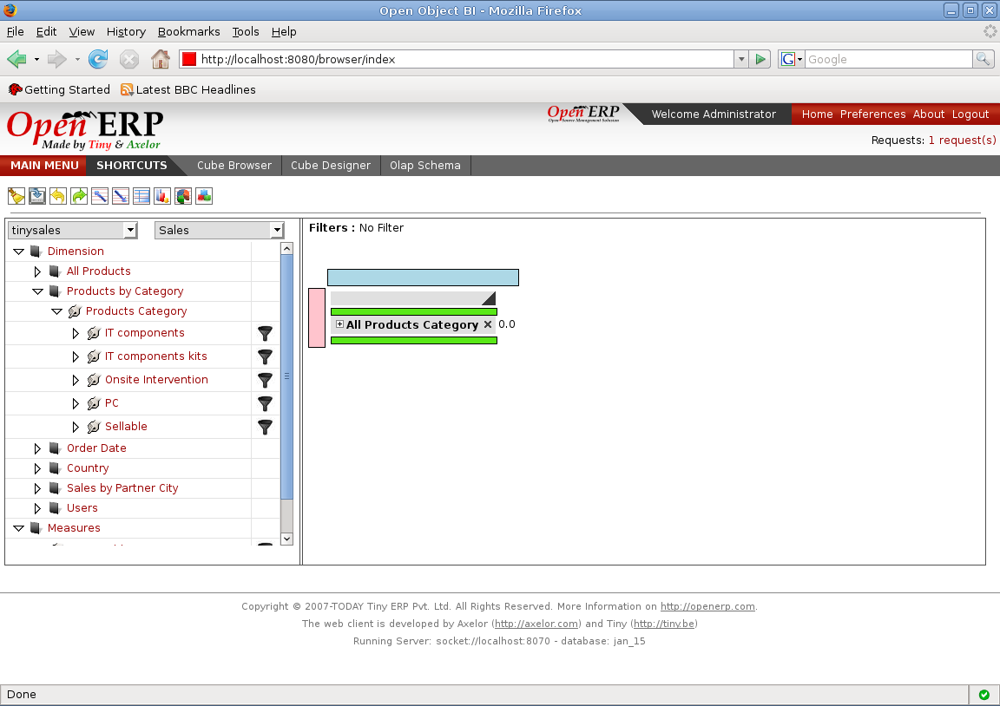
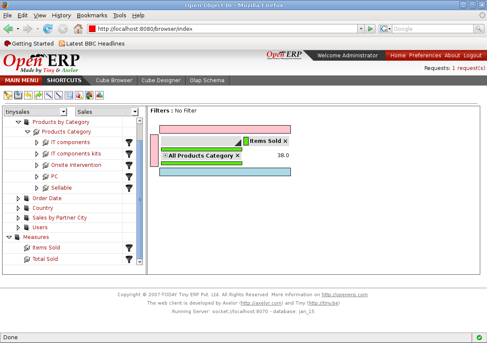
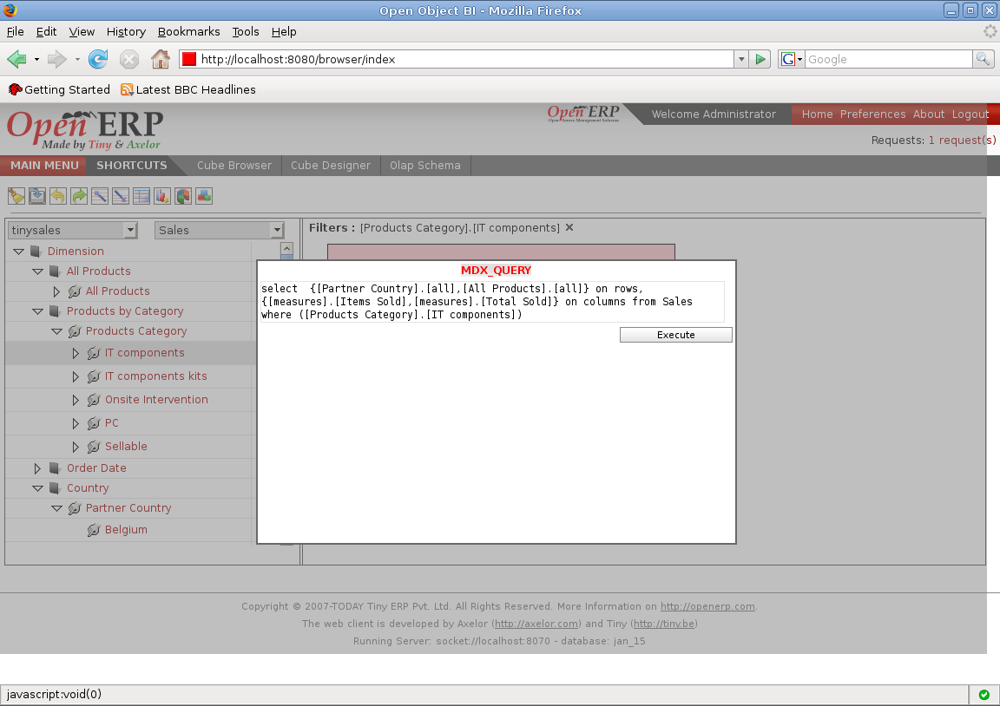

.. i18n: Creating your report with drag and drop
.. i18n: =======================================
..

拖放方式创建你的报表
=======================================

.. i18n: Cube Browser uses basic drag-and-drop operations to add data to a report.
.. i18n: Measures represent categories of stored values; Dimensions represent categories of OLAP information
..

Cube Browser 使用基本的拖放操作添加数据到一个报表.
Measures 代表储存类别的值; Dimensions 代表OLAP类别的信息

.. i18n: All UI controls update their contents automatically, and the resulting query is displayed on the OLAP Grid.
..

所有的UI控件自动更新其内容,查询结果显示在OLAP表格里.

.. i18n: Queries can be created by Dragging a member on the on the Droppable Area marked with the box for the drop zone.
..

Queries can be created by Dragging a member on the on the Droppable Area marked with the box for the drop zone.

.. i18n: Lets drop the All Product Category on the drop zone referred as grid afterward.
.. i18n: As soon as the member is dropped the resultant query is formed and can be viewed using the toolbar.
.. i18n: Query is then executed giving the first output on the grid. The first drop is always on the rows. 
..

Lets drop the All Product Category on the drop zone referred as grid afterward.
As soon as the member is dropped the resultant query is formed and can be viewed using the toolbar.
Query is then executed giving the first output on the grid. The first drop is always on the rows. 

.. i18n: .. image::  images/d_browsr4.png
.. i18n:    :scale: 65
..

.. i18n: The second axis can be added by dropping a member on blue zone. The output can be seen immediately. Each user action changes and executes the query and then shows the result. The cross or delete button beside each item in grid deletes the elements from the query and the resultant grid. On top we can see if any filters are applied on the query or not.
..

The second axis can be added by dropping a member on blue zone. The output can be seen immediately. Each user action changes and executes the query and then shows the result. The cross or delete button beside each item in grid deletes the elements from the query and the resultant grid. On top we can see if any filters are applied on the query or not.

.. i18n: .. image::  images/d_browsr5.png
.. i18n:    :scale: 65
..

.. i18n: We can see the query by selecting the MDX button on the toolbar. This will open the pop up to show the mdx query for the current grid.
..

We can see the query by selecting the MDX button on the toolbar. This will open the pop up to show the mdx query for the current grid.

.. i18n: .. image::  images/data_browser11.png
.. i18n:    :scale: 65
..

