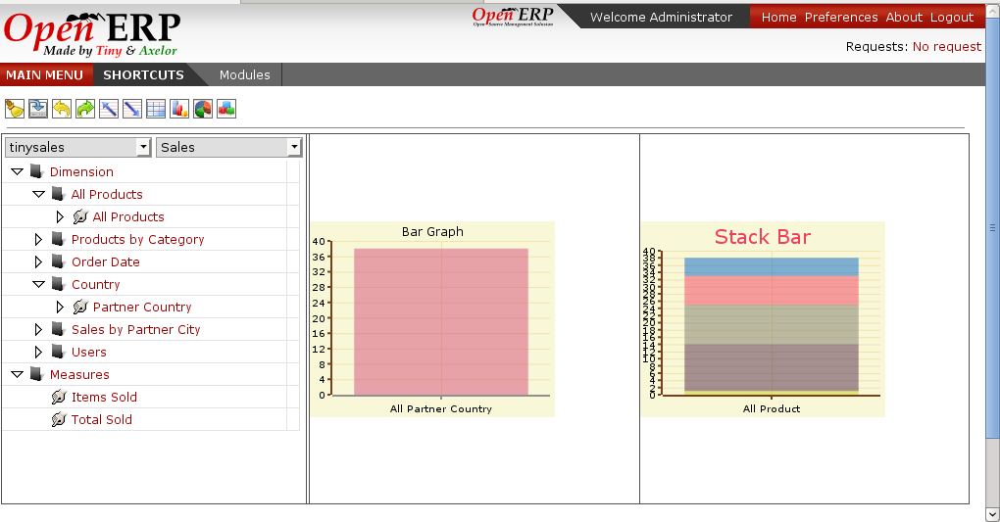

.. i18n: Graphs
.. i18n: ======
..

图表
======

.. i18n: Graphs presents the grid output on the graphs or graphical way by plotting on the axis. 
..

图表就把所呈现的表格结果以图形化的方式显示到绘制的轴线上。

.. i18n: Lets take the case:
..

让我们举一个例子：

.. i18n: .. image::  images/data_browser10.png
.. i18n:    :scale: 65
..

.. image::  images/data_browser10.png
   :scale: 65

.. i18n: For the above grid when we will generate graph it will be:
..

针对上面的表格我们如果以图形化显示就变成如下效果：

.. i18n: .. image::  images/data_browser12.png
.. i18n:    :scale: 65
..

.. image::  images/data_browser12.png
   :scale: 65

.. i18n: When we have children expanded for the one element on the axis and the other is not drilled. There will be two graph to show the same
..

When we have children expanded for the one element on the axis and the other is not drilled. There will be two graph to show the same

.. i18n: .. image::  images/data_browser17.png
.. i18n:    :scale: 65
..

