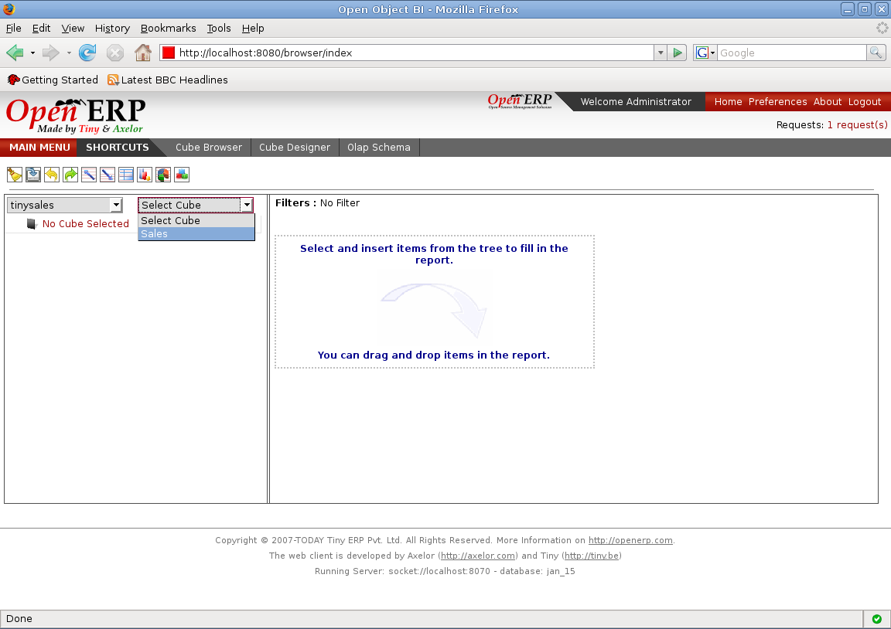

.. i18n: Loading the Cube
.. i18n: ================
..

Loading the Cube
================

.. i18n: Cube Browser will provide the selection of the schema and cube. It comes with a toolbar that allows some common operations with one click.
..

Cube 浏览器提供了多维架构的选项，通过自带的工具栏一次点击就可以完成大部分常见的操作。

.. i18n: .. image::  images/data_browser1.png
.. i18n:    :scale: 65
..

.. image::  images/data_browser1.png
   :scale: 65

.. i18n: With the help of toolbar we can undo redo the queries, we can switch between the graph and grid view, we can expand all or collapse all elements.
..
在工具栏的帮助下我们可以撤销重建查询，我们可以在图形示图和表格示图中来回切换，也可以展开全部内容或者分解各个元素。

.. i18n: Schema combo box will show all the schema made.
..

架构组合框中可以显示所以的架构类型。

.. i18n: .. image::  images/d_browser1.png
.. i18n:    :scale: 65
..

.. image::  images/d_browser1.png
   :scale: 65

.. i18n: Once we select the schema the next combo box will show all cubes that belong to that schema.
..

如果我们选择一个架构，架构组合框马上就会显示出属于这个架构的所有的多维数组。

.. i18n: .. image::  images/d_browser2.png
.. i18n:    :scale: 65
..

.. i18n: Once we select the cube, the cube is loaded in the tree form in the space below. We can expand each node and it will display to the depth of the level configured.
..

当我们选择多维模式后，马上就会在下面空白处载入列表示图，我们也可以分解每个节点，然后依配置的级别显示出不同深度的内容。
.. i18n: .. image::  images/d_browser3.png
.. i18n:    :scale: 65
..

.. image::  images/d_browser3.png
   :scale: 65
