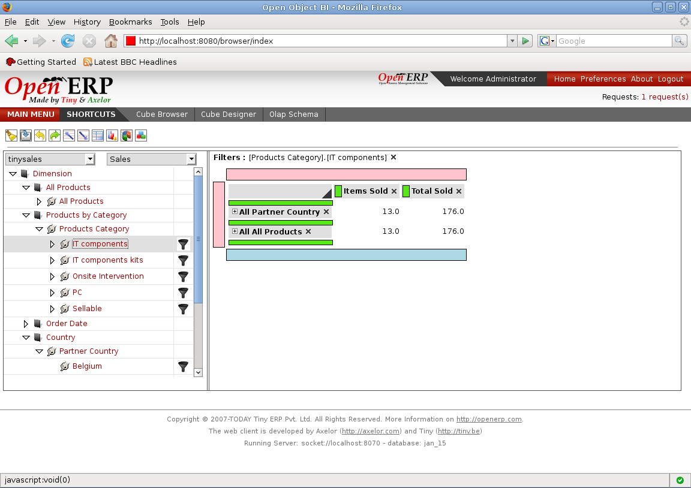

.. i18n: Adding Slicer
.. i18n: =============
..

Adding Slicer
=============

.. i18n: A Slicer is filtering on the data fetched by a MDX Query.
..

A Slicer is filtering on the data fetched by a MDX Query.

.. i18n: It can be added by clicking on filter images on right side on the members.
..

It can be added by clicking on filter images on right side on the members.

.. i18n: Filtering gives users a powerful tool for slicing the multidimensional data for organizing and analyzing in more detail.
..

Filtering gives users a powerful tool for slicing the multidimensional data for organizing and analyzing in more detail.

.. i18n: This filtering of the data allows user to get the required information to the lowest level and analyse it to get the best use from their cube's multidimensional data.
..

This filtering of the data allows user to get the required information to the lowest level and analyse it to get the best use from their cube's multidimensional data.

.. i18n: .. image::  images/data_browser10.png
.. i18n:     :scale: 65
..

