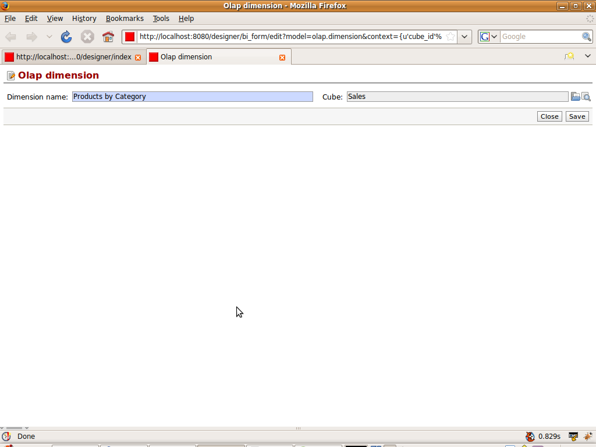

.. i18n: Defining Dimension
.. i18n: ==================
..

Defining Dimension
==================

.. i18n: :ref:`Dimension <dimension-link>` need to name to be identified. Cube will be filled by default according to the schema opened.
..

:ref:`Dimension <dimension-link>` need to name to be identified. Cube will be filled by default according to the schema opened.

.. i18n: .. image::  images/dimension.png
.. i18n:    :scale: 65
..

