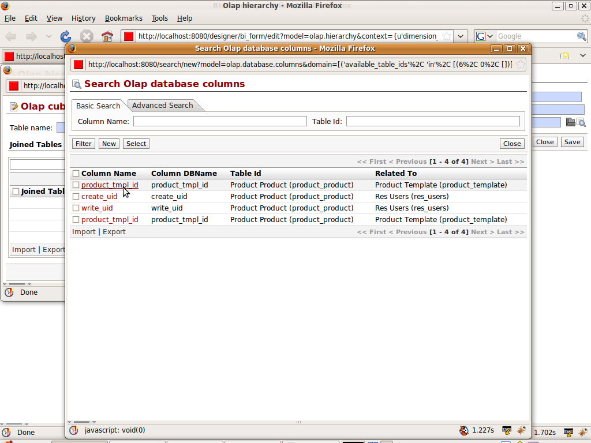

.. i18n: Defining Hierarchy
.. i18n: ==================
..

Defining Hierarchy
==================

.. i18n: :ref:`Hierarchy <hierarchy-link>` is the arrangements of objects, peoples etc .. in a ranked or some series. The hierarchy are the way of arranging the dimensions. 
..

:ref:`Hierarchy <hierarchy-link>` is the arrangements of objects, peoples etc .. in a ranked or some series. The hierarchy are the way of arranging the dimensions. 

.. i18n: It need the fact table. 
..

It need the fact table. 

.. i18n: Lets take the Example of Products. 
..

Lets take the Example of Products. 

.. i18n: We want our sales cube to work on the products - we want to see the products sold. We have divided the products into categories. So we will make the Product Hierarchy display products by category.
..

We want our sales cube to work on the products - we want to see the products sold. We have divided the products into categories. So we will make the Product Hierarchy display products by category.

.. i18n: Lets see the new hierarchy. Some values, such as hierarchy name and dimension, may be set by default.
..

Lets see the new hierarchy. Some values, such as hierarchy name and dimension, may be set by default.

.. i18n: .. image::  images/hier1.png
.. i18n:    :scale: 65
..

.. image::  images/hier1.png
   :scale: 65

.. i18n: We now define the fact table for the hierarchy. Relational column will show the all fields of the sale_order_line and sale_order as these are the fact tables for the cube. We select product_id from sale_order_line which is related to product_product
..

We now define the fact table for the hierarchy. Relational column will show the all fields of the sale_order_line and sale_order as these are the fact tables for the cube. We select product_id from sale_order_line which is related to product_product

.. i18n: .. image::  images/hier2.png
.. i18n:    :scale: 65
..

.. image::  images/hier2.png
   :scale: 65

.. i18n: We want to get both product name and category. We know the product_category will give category and product_template will give the name. 
.. i18n: Now the list is filtered accordingly for adding the join tables
..

We want to get both product name and category. We know the product_category will give category and product_template will give the name. 
Now the list is filtered accordingly for adding the join tables

.. i18n: .. image::  images/hier3.png
.. i18n:    :scale: 65
..

.. i18n: After selecting the product_tmpl_id we select the category table.
..

After selecting the product_tmpl_id we select the category table.

.. i18n: .. image::  images/hier4.png
.. i18n:    :scale: 65
..

.. image::  images/hier4.png
   :scale: 65

.. i18n: So final fact table for the Product Category will be
.. i18n:  
.. i18n: .. image::  images/hier5.png
.. i18n:    :scale: 65
..

So final fact table for the Product Category will be
 
.. image::  images/hier5.png
   :scale: 65
