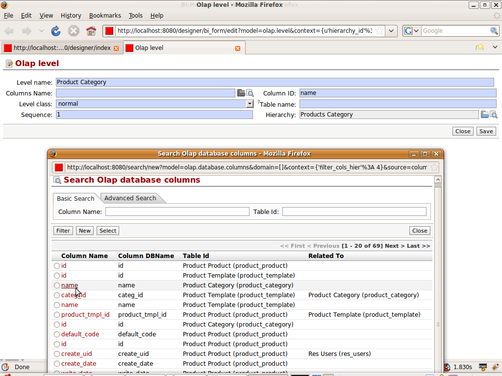

.. i18n: Defining Level
.. i18n: ==============
..

Defining Level
==============

.. i18n: :ref:`Level <level-link>` It specifies the actual data to be displayed. It
.. i18n: specifies the depth for the hierarchy. Now taking the same example for the
.. i18n: Products. We need it to be two level depth.
..

:ref:`Level <level-link>` It specifies the actual data to be displayed. It
specifies the depth for the hierarchy. Now taking the same example for the
Products. We need it to be two level depth.

.. i18n:   #. Product Category
.. i18n:   #. Product Name
..

  #. Product Category
  #. Product Name

.. i18n: Lets start with making the levels. Details like hierarchy name, level name
.. i18n: filled by default according the schema we are in. We need to specify the column
.. i18n: to be used for filling the level. We open the column name and it will show all
.. i18n: the fields from tables defined in the hierarchy.  We select name from the
.. i18n: product category
..

Lets start with making the levels. Details like hierarchy name, level name
filled by default according the schema we are in. We need to specify the column
to be used for filling the level. We open the column name and it will show all
the fields from tables defined in the hierarchy.  We select name from the
product category

.. i18n: .. image::  images/level1.png
.. i18n:    :scale: 65
..

.. i18n: We want more level for displaying the name of the products. In the column name
.. i18n: we will select the column name from the product_template. The main thing is to
.. i18n: change the sequence to 2. This will show the products category wise on the
.. i18n: browser.
..

We want more level for displaying the name of the products. In the column name
we will select the column name from the product_template. The main thing is to
change the sequence to 2. This will show the products category wise on the
browser.

.. i18n: .. image::  images/level1.png
.. i18n:    :scale: 65
..

