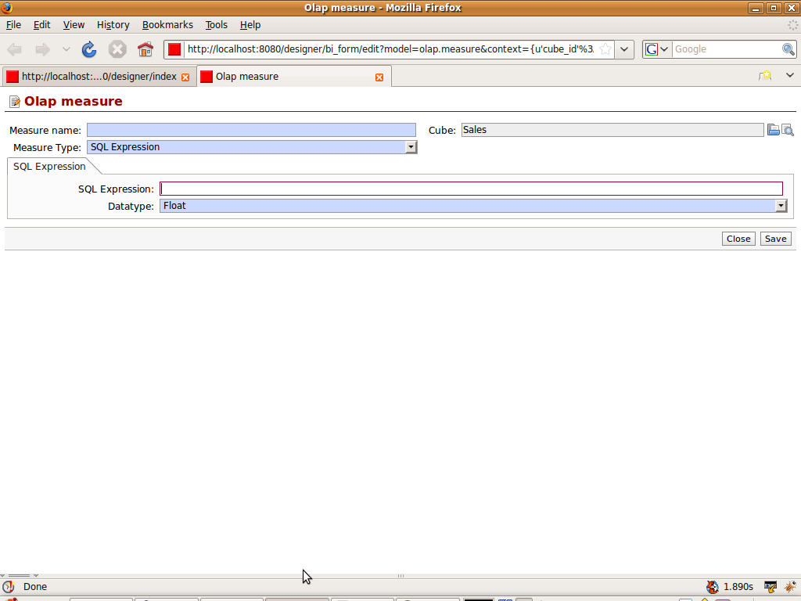
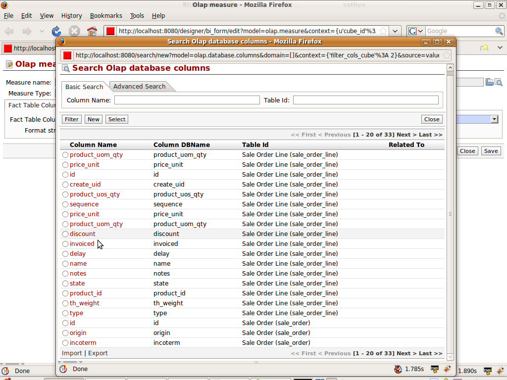
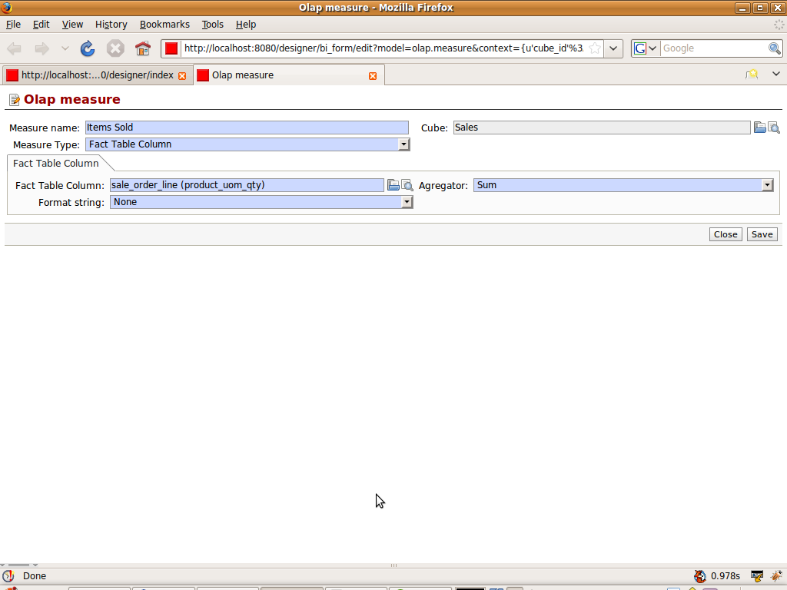

.. i18n: Defining Measure
.. i18n: ================
..

Defining Measure
================

.. i18n: :ref:`Measure <measure-link>` are the fact or quantitative values. It comes from the fact table configured in the cube.
..

:ref:`Measure <measure-link>` are the fact or quantitative values. It comes from the fact table configured in the cube.

.. i18n: We will make the measure for the same example. Measure type specifies whether it will be column base or sql expression based.
..

We will make the measure for the same example. Measure type specifies whether it will be column base or sql expression based.

.. i18n: Column Based: 
..

Column Based: 

.. i18n: .. image::  images/measure1.png
.. i18n:    :scale: 65
..

.. image::  images/measure1.png
   :scale: 65

.. i18n: SQL Expression Based: 
..

SQL Expression Based: 

.. i18n: .. image::  images/measure2.png
.. i18n:    :scale: 65
..

.. i18n: In the column based measure we will see select the fact table column from the columns of the fact table define in the cube i.e. sale_order and sale_order_line.
..

In the column based measure we will see select the fact table column from the columns of the fact table define in the cube i.e. sale_order and sale_order_line.

.. i18n: .. image::  images/measure3.png
.. i18n:    :scale: 65
..

.. i18n: So finally measure will look like:
..

So finally measure will look like:

.. i18n: .. image::  images/measure4.png
.. i18n:    :scale: 65
..

