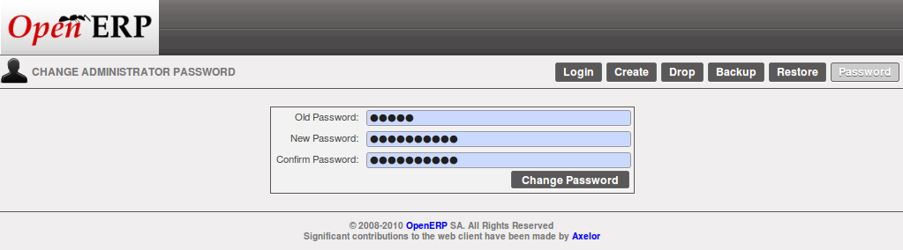
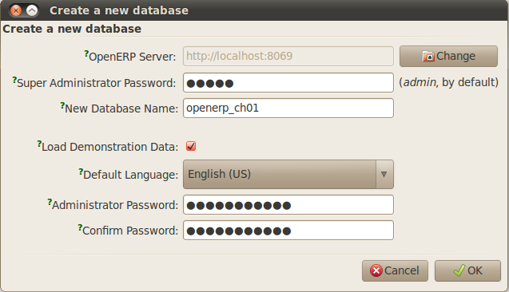
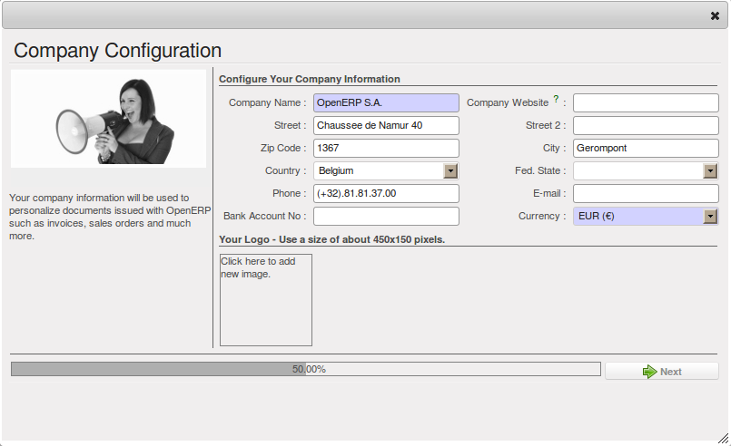

.. i18n: .. index::
.. i18n:    single: database; create
.. i18n:    single: database
..

.. index::
   single: database; create
   single: database

.. i18n: .. _sect-dbcreate:
.. i18n: 
.. i18n: Database Creation
.. i18n: =================
..

.. _sect-dbcreate:

数据库创建
==========

.. i18n: Use the technique outlined in this section to create a new database, \ ``openerp_ch01`` \. This
.. i18n: database will contain the demonstration data provided with OpenERP and a large proportion of the
.. i18n: core OpenERP functionality. You will need to know your super administrator password for this – or
.. i18n: you will have to find somebody who does have it to create this database.
..

使用这个章节里概述的技巧来创建一个新的数据库， \ ``openerp_ch01`` \. 这个数据库将包含 OpenERP 提供的示范数据以及
大部分的 OpenERP 核心功能。你需要知道超级管理员的密码才能使用这个数据库，或者你可以请具有超级管理员权限的人创建这个数据库。

.. i18n: .. index::
.. i18n:    single: password; super-administrator
.. i18n:    single: password; superadmin
..

.. index::
   single: password; super-administrator
   single: password; superadmin

.. i18n: .. note:: The Super-administrator Password
.. i18n: 
.. i18n:    Anyone who knows the super-administrator password has complete access to the data on the server
.. i18n:    – able to read, change and delete any of the data in any of the databases there.
.. i18n: 
.. i18n:    After first installation, the password is ``admin``. This is the hard-coded default, and
.. i18n:    is used if there is no accessible server configuration file. If your system has been 
.. i18n:    set up so that the server configuration file can be written to by the server, then
.. i18n:    you can change the password through the client. Or you could deliberately make the 
.. i18n:    configuration file read-only so that there is no prospect of changing it from the client.
.. i18n:    Either way, a server systems administrator can change it if you forget it.
.. i18n:    
.. i18n:    So if your system is set to allow it, you can change the superadmin password through the GTK client
.. i18n:    from the menu :menuselection:`File --> Databases --> Administrator Password`, or through the
.. i18n:    web client by logging out (click the :guilabel:`Logout` link), clicking :guilabel:`Databases` on the
.. i18n:    login screen, and then clicking the :guilabel:`Password` button on the Management screen. 
.. i18n:    
.. i18n:    The location of the server configuration file is typically defined by starting the server with 
.. i18n:    the ``--config`` command line option.
..

.. note:: 超级管理员密码

   任何人只要知道超级管理员的密码，都对服务器上的数据有完整的存取权力 – 可读取，修改或删除任何服务器上任何数据库的任何数据。
   在第一次安装完成后，密码是 ``admin`` 。 这是写在程序里的缺省值，如果找不到可以存取的服务器组态文件，就会使用这个缺省值。
   如果你的系统有配置服务器可写入的组态文件，你就可以透过客户端修改密码；或者，你可以刻意把组态文件设置成只读，这样以后就没有
   人可以从客户端修改密码。不论是这两种方式的哪一种，如果你忘记密码，服务器的系统管理员都可以修改密码。
      
   所以你的系统设置是可以从客户端修改密码，你可以从 GTK 客户端的菜单里进行修改:` 文件 --> 数据库 --> 管理员密码` ，或是从
   网页客户端登出 (单击 :使用界面标签:` 登出 ` 连结), 在登入画面单击 :使用界面标签:` 数据库 ` ，然后在管理画面中单击
    :使用界面标签:` 密码 ` 。 
   
   服务器上的配置文件位置，通常是在启动服务器时用 ``--config`` 命令的选项来指定。

.. i18n: .. figure:: images/change_superadmin_pwd.png
.. i18n:    :scale: 65
.. i18n:    :align: center
.. i18n: 
.. i18n:    *Changing the super-administrator password through the web client*
..

   *用网页客户端来修改超级管理员密码*

.. i18n: .. _sect-creatingdb:
.. i18n: 
.. i18n: Creating the Database
.. i18n: ---------------------
..

.. _sect-creatingdb:

创建数据库
----------

.. i18n: If you are using the GTK client, choose :menuselection:`File --> Databases --> New database`  in
.. i18n: the menu at the top left. Enter the super-administrator password, then the name of the new database
.. i18n: you are creating.
..

如果你是使用 GTK 客户端， 在菜单的左上方选择 :menuselection:`文件 --> 数据库 --> 新数据库` 。
输入超级管理员密码以及要创建的新数据库名称。

.. i18n: .. figure:: images/create_new_db_GTK.png
.. i18n:    :scale: 75
.. i18n:    :align: center
.. i18n: 
.. i18n:    *Creating a new database through the GTK client*  
..

   *使用 GTK 客户端创建新资料库*  

.. i18n: If you are using the web client, click :guilabel:`Databases` on the login screen, then
.. i18n: :guilabel:`Create` on the database management page. Enter the super-administrator password, and the
.. i18n: name of the new database you are creating.
.. i18n:   
.. i18n: In both cases, you will see a checkbox that determines whether you load demonstration data or not.
.. i18n: The consequences of checking this box or not affect the **whole use** of this database.
..

如果你是是用网页客户端，在登入画面单击 :guilabel:`数据库` ，然后在数据库管理页面 :guilabel:`创建` 。
输入超级管理员密码，以及你要创建的数据库名称。
  
在两种方法里你都会看到核取方块；核取方块是用来确认是否要载入演示数据。不论是否有选取核取方块，结果都不会影响数据库的 **整体应用** 。

.. i18n: In both cases, you will also see that you can choose the Administrator password. This makes your 
.. i18n: database quite secure because you can ensure that it is unique from the outset.
.. i18n: (In fact many people find it hard to resist ``admin`` as their password!)
..

在两种方法里你也都会看到，你可以选择管理员密码。管理员密码可以相当程度确保数据库的安全性，因为从一开始就可以确保数据库的密码是唯一的。
(实际上许多人会难以抗拒使用 ``admin`` 作为密码!)

.. i18n: Database openerp_ch01
.. i18n: ---------------------
..

数据库 openerp_ch01
-------------------

.. i18n: .. index::
.. i18n:    pair: account; user
..

.. index::
   pair: account; user

.. i18n: Wait for the message showing that the database has been successfully created, along with the user
.. i18n: accounts and passwords (\ ``admin/XXXX``\   and \ ``demo/demo``\  ). Now that you have created this
.. i18n: database, you can extend it without having to know the super-administrator password.
..

等到信息显示数据库及用户账号及密码 (\ ``admin/XXXX``\   和 \ ``demo/demo``\  ) 已经成功创建，你就已经创建了这个数据库，而且你可以不需要知道超级管理员密码，就可以扩充这个数据库。

.. i18n: .. index::
.. i18n:    single: access; LDAP
.. i18n:    single: LDAP
.. i18n:    pair: password; username
.. i18n:    single: access; user
..

.. index::
   single: access; LDAP
   single: LDAP
   pair: password; username
   single: access; user

.. i18n: .. tip::   User Access
.. i18n: 
.. i18n: 	The combination of username/password is specific to a single database. If you have administrative
.. i18n: 	rights to a database you can modify all users.
.. i18n: 
.. i18n:  	.. index::
.. i18n: 	   single: module; users_ldap
.. i18n: 
.. i18n: 	Alternatively, you can install the :mod:`users_ldap` module, which manages the authentication of users
.. i18n: 	in LDAP (the Lightweight Directory Access Protocol, a standard system), and connect it to several
.. i18n: 	OpenERP databases. Using this, many databases can share the same user account details.
..

.. tip::   用户存取

	对每一个数据库来说，用户名称/密码 都是唯一的组合；如果你有管理员的权限，你可以修改全部的用户。

 	.. index::
	   single: module; users_ldap

	另外，你可以安装 :mod:`users_ldap` 模块，用于管理用户在 LDAP (轻量级目录访问协议， Lightweight Directory Access Protocol， 一个标准系统)，
        以及连接到数个 OpenERP 数据库。透过 LDAP 许多数据库可以共享相同的用户账号资讯。

.. i18n: .. note::  Failure to Create a Database
.. i18n: 
.. i18n: 	How do you know if you have successfully created your new database?
.. i18n: 	You are told if the database creation has been unsuccessful.
.. i18n: 	If you have entered a database name using prohibited characters (or no name, or too short a name),
.. i18n: 	you will be alerted by the dialog box :guilabel:`Bad database name!` explaining how to correct the error.
.. i18n: 	If you have entered the wrong super-administrator password or a name already in use
.. i18n: 	(some names can be reserved without your knowledge), you will be alerted by the dialog box
.. i18n: 	:guilabel:`Error during database creation!`.
..

.. note::  创建数据库失败

	如何知道是否已经成功创建你的新数据库？
	如果创建数据库不成功，系统会通知你。
	如果你用了禁止使用的字符当做数据库的名称 (或数据库没有名称，或名称太短)，系统会用对话框提出警告 :guilabel:`不合格的数据库名称!` ，
        同时会说明如何修正错误。如果你输入了错误的超级管理员密码或是某个已经在使用中的名称 (有些名称是在你不知道的情形下保留的)，系统会用以下对话
        框提出警告 :guilabel:`数据库创建过程中错误!` 。

.. i18n: Since this is the first time you have connected to this database, you will be asked a series of questions to
.. i18n: define the database parameters. You may choose to :guilabel:`Skip Configuration Wizards` or
.. i18n: :guilabel:`Start Configuration`. If you choose to configure your application, you may proceed with the
.. i18n: following steps:
..

既然这是你第一次连结到这个数据库，系统会问你一系列的问题来确认数据库的参数。你可以选择 :使用界面标签: `略过组态精灵` 或
:使用界面标签: `开始设定组态` 。如果你选择设定应用程序的组态，可以依照以下步奏进行:

.. i18n: 	#.  :guilabel:`Configure Your Interface` : select \ ``Simplified`` \ and click :guilabel:`Next`.
.. i18n: 
.. i18n: 	#.  :guilabel:`Configure Your Company Information` : replace the proposed default of \ ``OpenERP S.A.`` \
.. i18n: 	    by your own company name, complete as much of your address as you like. You can set the currency that
.. i18n: 	    your company uses or leave the default setting. You may also add your company logo which will
.. i18n: 	    be visible on reports and other documents. Click :guilabel:`Next`.
.. i18n: 
.. i18n: 	#.  :guilabel:`Install Applications` : check the applications you need and then click :guilabel:`Install`.
.. i18n: 	    For now, do not install any application.
..

	#.  :guilabel:`配置你的界面` : 选择 \ ``简单化界面`` \ 然后单击 :guilabel:`下一步` 。

	#.  :guilabel:`配置你的公司讯息` : 把系统建议的默默认值 \ ``OpenERP S.A.`` \ 改成你自己公司的名称以你的喜好尽量把地址填完整。 
	    你可以设置你公司使用的币别，或是直接使用默认值。你也可以加上你公司的商标；商标可以显示在报表或其他文件上。单击 :guilabel:`下一步` 。

	#.  :guilabel:`安装应用程序` : 选取你需要的应用程序然后单击 :guilabel:`安装` 。现在，不要安装任何应用程序。

.. i18n: Once configuration is complete, you are connected to your OpenERP system. Its functionality is very
.. i18n: limited because you have selected a :guilabel:`Simplified` interface with no application installed,
.. i18n: but this is sufficient to demonstrate that your installation is working.
..

一旦配置完成，你就已经连接到你的 OpenERP 系统。 现在的系统功能非常有限，因为你选择了 :guilabel:`简单化界面` ，
而且没有安装任何应用程序；但是现在这个演示已经足够告诉你安装完成了。

.. i18n: .. figure:: images/define_main_co_dlg.png
.. i18n:    :align: center
.. i18n:    :scale: 80
.. i18n: 
.. i18n:    *Defining your company during initial database configuration*
..

   *在初始数据库配置中定义你的公司*

.. i18n: .. index::
.. i18n:    single: database; manage
..

.. index::
   single: database; manage

.. i18n: .. _sect-dbmanage:
.. i18n: 
.. i18n: Managing Databases
.. i18n: ------------------
..

.. _sect-dbmanage:

管理数据库
----------

.. i18n: As a super-administrator, you do not only have rights to create new databases, but also to:
..

As a super-administrator, you do not only have rights to create new databases, but also to:

.. i18n: * backup databases,
.. i18n: 
.. i18n: * delete databases,
.. i18n: 
.. i18n: * restore databases.
..

* backup databases,

* delete databases,

* restore databases.

.. i18n: All of these operations can be carried out from the menu :menuselection:`File --> Databases...`
.. i18n: in the GTK client, or from the :guilabel:`Databases` button in the web client's 
.. i18n: :guilabel:`Login` screen.
..

All of these operations can be carried out from the menu :menuselection:`File --> Databases...`
in the GTK client, or from the :guilabel:`Databases` button in the web client's 
:guilabel:`Login` screen.

.. i18n: .. index::
.. i18n:    single: database; backup
..

.. index::
   single: database; backup

.. i18n: .. tip:: Backup (copy) a Database
.. i18n: 
.. i18n:         To make a copy of a database, go to the web :guilabel:`Login` screen and click the :guilabel:`Databases` button.
.. i18n:         Then click the :guilabel:`Backup` button, select the database you want to copy and enter the super-administrator
.. i18n: 	password. Click the :guilabel:`Backup` button to confirm that you want to copy the database.
..

.. tip:: Backup (copy) a Database

        To make a copy of a database, go to the web :guilabel:`Login` screen and click the :guilabel:`Databases` button.
        Then click the :guilabel:`Backup` button, select the database you want to copy and enter the super-administrator
	password. Click the :guilabel:`Backup` button to confirm that you want to copy the database.

.. i18n: .. index::
.. i18n:    single: database; drop
..

.. index::
   single: database; drop

.. i18n: .. tip:: Drop (delete) a Database
.. i18n: 
.. i18n:         To delete a database, go to the web :guilabel:`Login` screen and click the :guilabel:`Databases` button.
.. i18n:         Then click the :guilabel:`Drop` button, select the database you want to delete and enter the super-administrator
.. i18n: 	password. Click the :guilabel:`Drop` button to confirm that you want to delete the database.
..

.. tip:: Drop (delete) a Database

        To delete a database, go to the web :guilabel:`Login` screen and click the :guilabel:`Databases` button.
        Then click the :guilabel:`Drop` button, select the database you want to delete and enter the super-administrator
	password. Click the :guilabel:`Drop` button to confirm that you want to delete the database.

.. i18n: .. index::
.. i18n:    single: database; restore
..

.. index::
   single: database; restore

.. i18n: .. tip:: Restore a Database
.. i18n: 
.. i18n:         To restore a database, go to the web :guilabel:`Login` screen and click the :guilabel:`Databases` button.
.. i18n:         Then click the :guilabel:`Restore` button, click the :guilabel:`Choose File` button to select the database
.. i18n:         you want to restore. Give the database a name and enter the super-administrator	password.
.. i18n: 	Click the :guilabel:`Restore` button to confirm that you want to install a new copy of the selected database.
.. i18n: 	To restore a database, you need to have an existing copy, of course.
..

.. tip:: Restore a Database

        To restore a database, go to the web :guilabel:`Login` screen and click the :guilabel:`Databases` button.
        Then click the :guilabel:`Restore` button, click the :guilabel:`Choose File` button to select the database
        you want to restore. Give the database a name and enter the super-administrator	password.
	Click the :guilabel:`Restore` button to confirm that you want to install a new copy of the selected database.
	To restore a database, you need to have an existing copy, of course.

.. i18n: .. index::
.. i18n:    single: database; duplicate
..

.. index::
   single: database; duplicate

.. i18n: .. tip::   Duplicating a Database
.. i18n: 
.. i18n: 	To duplicate a database, you can:
.. i18n: 
.. i18n:         #. make a backup file on your PC from this database.
.. i18n: 
.. i18n:         #. restore this database from the backup file on your PC, and give it a new name.
.. i18n: 
.. i18n: 	This can be a useful way of making a test database from a production database. You can try out the
.. i18n: 	operation of a new configuration, new modules, or just the import of new data.
..

.. tip::   Duplicating a Database

	To duplicate a database, you can:

        #. make a backup file on your PC from this database.

        #. restore this database from the backup file on your PC, and give it a new name.

	This can be a useful way of making a test database from a production database. You can try out the
	operation of a new configuration, new modules, or just the import of new data.

.. i18n: .. index::
.. i18n:    single: access
..

.. index::
   single: access

.. i18n: A system administrator can configure OpenERP to restrict access to some of these database functions
.. i18n: so that your security is enhanced in normal production use.
..

A system administrator can configure OpenERP to restrict access to some of these database functions
so that your security is enhanced in normal production use.

.. i18n: You are now ready to use databases from your installation to familiarize yourself with the
.. i18n: administration and use of OpenERP.
..

You are now ready to use databases from your installation to familiarize yourself with the
administration and use of OpenERP.

.. i18n: New OpenERP Functionality
.. i18n: =========================
..

进一步 OpenERP 功能
===================

.. i18n: The database you have created and managed so far is based on the core OpenERP functionality that you
.. i18n: installed. The core system is installed in the file system of your OpenERP application server, but
.. i18n: only installed into an OpenERP database as you require it, as is described in the next chapter, :ref:`ch-guided`.
..

The database you have created and managed so far is based on the core OpenERP functionality that you
installed. The core system is installed in the file system of your OpenERP application server, but
only installed into an OpenERP database as you require it, as is described in the next chapter, :ref:`ch-guided`.

.. i18n: What if you want to update what is there, or extend what is there with additional modules?
..

What if you want to update what is there, or extend what is there with additional modules?

.. i18n: * To update what you have, you would install a new instance of OpenERP using the same techniques as
.. i18n:   described earlier in this section, :ref:`sect-dbcreate`.
.. i18n: 
.. i18n: * To extend what you have, you would install new modules in the ``addons`` directory of your current
.. i18n:   OpenERP installation. There are several ways of doing that.
..

* To update what you have, you would install a new instance of OpenERP using the same techniques as
  described earlier in this section, :ref:`sect-dbcreate`.

* To extend what you have, you would install new modules in the ``addons`` directory of your current
  OpenERP installation. There are several ways of doing that.

.. i18n: .. index::
.. i18n:    pair:  system; administrator
..

.. index::
   pair:  system; administrator

.. i18n: In both cases you will need to be a \ ``root`` \ user or \ ``Administrator`` \ of your
.. i18n: OpenERP application server.
..

In both cases you will need to be a \ ``root`` \ user or \ ``Administrator`` \ of your
OpenERP application server.

.. i18n: Extending OpenERP
.. i18n: -----------------
..

扩展 OpenERP 功能
-------------------

.. i18n: To extend OpenERP you will need to copy modules into the \ ``addons`` \ directory. That is in
.. i18n: your server's \ ``openerp-server`` \ directory (which differs between Windows, Mac and some of the
.. i18n: various Linux distributions and not available at all in the Windows all-in-one installer).
..

To extend OpenERP you will need to copy modules into the \ ``addons`` \ directory. That is in
your server's \ ``openerp-server`` \ directory (which differs between Windows, Mac and some of the
various Linux distributions and not available at all in the Windows all-in-one installer).

.. i18n: .. index::
.. i18n:    single: module; product
.. i18n:    single: module; purchase
..

.. index::
   single: module; product
   single: module; purchase

.. i18n: If you look there you will see existing modules such as :mod:`product` and :mod:`purchase`. A
.. i18n: module can be provided in the form of files within a directory or a a zip-format file containing
.. i18n: that same directory structure.
..

If you look there you will see existing modules such as :mod:`product` and :mod:`purchase`. A
module can be provided in the form of files within a directory or a a zip-format file containing
that same directory structure.

.. i18n: You can add modules in two main ways – through the server, or through the client.
..

You can add modules in two main ways – through the server, or through the client.

.. i18n: .. index::
.. i18n:    pair:  system; administration
..

.. index::
   pair:  system; administration

.. i18n: To add new modules through the server is a conventional system administration task. As \ ``root`` \
.. i18n: user or another suitable user, you would put the module in the \ ``addons`` \ directory and change its
.. i18n: permissions to match those of the other modules.
..

To add new modules through the server is a conventional system administration task. As \ ``root`` \
user or another suitable user, you would put the module in the \ ``addons`` \ directory and change its
permissions to match those of the other modules.

.. i18n: To add new modules through the client you must first change the permissions of the \ ``addons`` \
.. i18n: directory of the server, so that it is writeable by the server. That will enable you to install
.. i18n: OpenERP modules using the OpenERP client (a task ultimately carried out on the application
.. i18n: server by the server software).
..

To add new modules through the client you must first change the permissions of the \ ``addons`` \
directory of the server, so that it is writeable by the server. That will enable you to install
OpenERP modules using the OpenERP client (a task ultimately carried out on the application
server by the server software).

.. i18n: .. index::
.. i18n:    pair:  filesystem; permissions
..

.. index::
   pair:  filesystem; permissions

.. i18n: .. tip:: Changing Permissions
.. i18n: 
.. i18n: 	A very simple way of changing permissions on the Linux system you are using to develop an OpenERP
.. i18n: 	application is to execute the command sudo chmod 777 <path_to_addons> (where <path_to_addons> is
.. i18n: 	the full path to the addons directory, a location like /usr/lib/python2.5/site-packages/openerp-
.. i18n: 	server/addons).
..

.. tip:: Changing Permissions

	A very simple way of changing permissions on the Linux system you are using to develop an OpenERP
	application is to execute the command sudo chmod 777 <path_to_addons> (where <path_to_addons> is
	the full path to the addons directory, a location like /usr/lib/python2.5/site-packages/openerp-
	server/addons).

.. i18n: Any user of OpenERP who has access to the relevant administration menus can then upload any new
.. i18n: functionality, so you would certainly disable this capability for production use. You will see examples of
.. i18n: this uploading as you make your way through this book.
..

Any user of OpenERP who has access to the relevant administration menus can then upload any new
functionality, so you would certainly disable this capability for production use. You will see examples of
this uploading as you make your way through this book.

.. i18n: .. Copyright © Open Object Press. All rights reserved.
..

.. Copyright © Open Object Press. All rights reserved.

.. i18n: .. You may take electronic copy of this publication and distribute it if you don't
.. i18n: .. change the content. You can also print a copy to be read by yourself only.
..

.. You may take electronic copy of this publication and distribute it if you don't
.. change the content. You can also print a copy to be read by yourself only.

.. i18n: .. We have contracts with different publishers in different countries to sell and
.. i18n: .. distribute paper or electronic based versions of this book (translated or not)
.. i18n: .. in bookstores. This helps to distribute and promote the OpenERP product. It
.. i18n: .. also helps us to create incentives to pay contributors and authors using author
.. i18n: .. rights of these sales.
..

.. We have contracts with different publishers in different countries to sell and
.. distribute paper or electronic based versions of this book (translated or not)
.. in bookstores. This helps to distribute and promote the OpenERP product. It
.. also helps us to create incentives to pay contributors and authors using author
.. rights of these sales.

.. i18n: .. Due to this, grants to translate, modify or sell this book are strictly
.. i18n: .. forbidden, unless Tiny SPRL (representing Open Object Press) gives you a
.. i18n: .. written authorisation for this.
..

.. Due to this, grants to translate, modify or sell this book are strictly
.. forbidden, unless Tiny SPRL (representing Open Object Press) gives you a
.. written authorisation for this.

.. i18n: .. Many of the designations used by manufacturers and suppliers to distinguish their
.. i18n: .. products are claimed as trademarks. Where those designations appear in this book,
.. i18n: .. and Open Object Press was aware of a trademark claim, the designations have been
.. i18n: .. printed in initial capitals.
..

.. Many of the designations used by manufacturers and suppliers to distinguish their
.. products are claimed as trademarks. Where those designations appear in this book,
.. and Open Object Press was aware of a trademark claim, the designations have been
.. printed in initial capitals.

.. i18n: .. While every precaution has been taken in the preparation of this book, the publisher
.. i18n: .. and the authors assume no responsibility for errors or omissions, or for damages
.. i18n: .. resulting from the use of the information contained herein.
..

.. While every precaution has been taken in the preparation of this book, the publisher
.. and the authors assume no responsibility for errors or omissions, or for damages
.. resulting from the use of the information contained herein.

.. i18n: .. Published by Open Object Press, Grand Rosière, Belgium
..

.. Published by Open Object Press, Grand Rosière, Belgium
