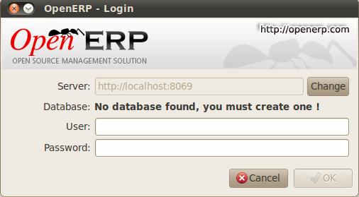
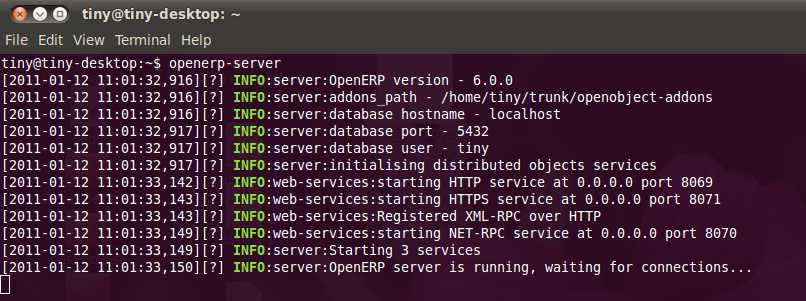
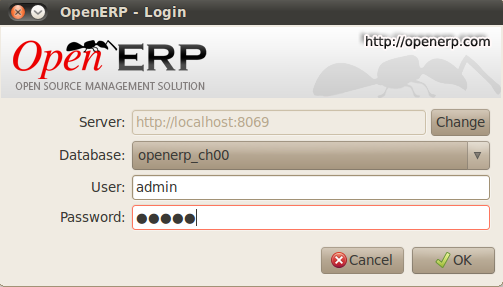

.. i18n: The Installation of OpenERP
.. i18n: ===========================
..

OpenERP的安装
===========================

.. i18n: Whether you are from a small company investigating how OpenERP works, or you are part of the IT staff of a
.. i18n: larger organization and have been asked to assess OpenERP's capabilities, your first requirement
.. i18n: is to install it or to find a working installation.
..

也许您是来自一个小型公司，想要看看OpenERP能否有效帮助公司成长，或是来自大型机构的IT职员，想要评估OpenERP的综合功能和性能，
您的第一步就是要安装上她或者找到一个已经安装好的实例来进行测试。

.. i18n: The table below summarizes the various installation methods that will be described in the following
.. i18n: sections.
..

下表中简要列出了各种安装方法，之后会做详细描述。

.. i18n: .. csv-table:: Comparison of the different methods of installation on Windows or Linux
.. i18n:    :header: "Method","Average Time","Level of Complexity","Notes"
.. i18n:    :widths: 20,15,15,30
.. i18n: 
.. i18n:    "OpenERP Demo","No installation","Simple","Very useful for quick evaluations because no need to install anything."
.. i18n:    "All-in-one Windows Installer","A few minutes","Simple","Very useful for quick evaluations because it installs all of the components pre-configured on one computer (using the GTK client)."
.. i18n:    "Independent installation on Windows","Half an hour","Medium","Enables you to install the components on different computers. Can be put into production use."
.. i18n:    "Ubuntu Linux packages","A few minutes","Simple","Simple and quick but the Ubuntu packages are not always up to date."
.. i18n:    "From source, for all Linux systems","More than half an hour","Medium to slightly difficult","This is the method recommended for production environments because it is easy to keep it up to date."
..

.. csv-table:: Windows或Linux上各种安装方法对比
   :header: "方法","平均所需时间","复杂程度","说明"
   :widths: 20,15,15,30

   "OpenERP Demo","无需安装","简单","对于快速评估非常有用，无需安装。"
   "All-in-one Windows Installer","约几分钟","简单","对于快速评估非常有用，会在一台电脑上安装所有的预先配置好的组件（使用GTK客户端）。"
   "Independent installation on Windows","约半小时","中级难度","可是你在不同电脑上安装各部分组件。可投入生产环境使用。"
   "Ubuntu Linux packages","约几分钟","简单","简单而快捷，但Ubuntu包不是一直都是最新的。"
   "From source, for all Linux systems","超过1小时","中级~高级难度","此方法建议在生产环境中使用，容易保持最新。"

.. i18n: Each time a new release of OpenERP is made, OpenERP supplies a complete Windows auto-installer for
.. i18n: it. This contains all of the components you need – the PostgreSQL database server, the OpenERP
.. i18n: application server and the GTK application client.
..

每当OpenERP发布新版本时，也会提供完整的Windows自动安装包下载。它包含所有必需的组件包括PostgreSQL数据库服务器、OpenERP应用服务器以及GTK应用客户端。

.. i18n: This auto-installer enables you to install the whole system in just a few mouse clicks. The initial
.. i18n: configuration is set up during installation, making it possible to start using it very quickly as
.. i18n: long as you do not want to change the underlying code. It is aimed at the installation of everything
.. i18n: on a single PC, but you can later connect GTK clients from other PCs, Macs and Linux boxes to it as
.. i18n: well.
..

只需点击几次鼠标，此安装包就能帮你安装好整个系统。初始配置已经在安装过程中设置好，如果你不想改变源代码，
就可以立即投入使用。此方法在一台电脑上安装所有的组件，但你可以通过GTK客户端从其它电脑上，包括PC、Mac和Linux，
进行连接访问。 

.. i18n: The first step is to download the OpenERP installer. At this stage you must choose which version
.. i18n: to install – the stable version or the development version. If you are planning to put it straight
.. i18n: into production we strongly advise you to choose the stable version.
..

第一步是下载OpenERP安装文件。在这个阶段你需要确定选择哪个版本——稳定版还是开发板。如果你打算直接把它用在生产
环境中，我们强烈建议你选择稳定版。

.. i18n: .. index::
.. i18n:    single: stable versions
..

.. index::
   single: stable versions

.. i18n: .. note::  Stable Versions and Development Versions
.. i18n: 
.. i18n: 	OpenERP development proceeds in two parallel tracks: stable versions and development versions.
.. i18n: 
.. i18n: 	New functionality is integrated into the development branch. This branch is more advanced than the
.. i18n: 	stable branch, but it can contain undiscovered and unfixed faults. A new development release is
.. i18n: 	made every month or so, and OpenERP has made the code repository available so you can download the
.. i18n: 	very latest revisions if you want.
.. i18n: 
.. i18n: 	The stable branch is designed for production environments. Releases of new functionality there are
.. i18n: 	made only about once a year after a long period of testing and validation. Only bug fixes are
.. i18n: 	released through the year on the stable branch.
..

.. note::  稳定版和开发版

	OpenERP的发展采取两个平行的轨道，稳定的版本和开发版本。

	新功能被集成到开发分支中。这个分支比稳定版更加先进，但是它里面包含了一些未被发现的和没有修复的错误。
	几乎每个月都会发布一个新的开发版本，OpenERP建立了一个代码仓库，如果需要你可以下载很老的版本。

	稳定分支是为生产环境设计的。基本上每年发布一次新版本，新版本中的功能都是经过长期测试和确认正确的。
	但是稳定分支中的错误修复仍然会在第一时间发布，不用等到第二年的发布版本。

.. i18n: .. index::
.. i18n:    single: installation; Windows (all-in-one)
..

.. index::
   single: 安装; Windows (all-in-one)

.. i18n: To download the version of OpenERP for Windows, follow these steps:
..

通过以下步骤下载OpenERP Windows版：

.. i18n: #. Navigate to the site http://openerp.com.
.. i18n: 
.. i18n: #. Click the :menuselection:`Downloads` button at the right, then, under :guilabel:`Windows Auto-Installer`, select
.. i18n:    :menuselection:`All-in-One`.
.. i18n: 
.. i18n: #. This brings up the demonstration version Windows installer, 
.. i18n:    currently :program:`openerp-allinone-setup-6.0.0`.
.. i18n: 
.. i18n: #. Save the file on your PC - it is quite a substantial size because it downloads everything including
.. i18n:    the PostgreSQL database system, so it will take some time.
..

#. 打开以下网址 http://openerp.com.

#. 点击右边的 :menuselection:`Downloads` 按钮，然后在 :guilabel:`Windows Auto-Installer` 下选择 :menuselection:`All-in-One`。

#. 你会看到Windows安装版的示范样例，当前版本为 :program:`openerp-allinone-setup-6.0.0`.

#. 将这个文件保存到你的电脑上 —— 文件可能比较大，因为它里面包含了PostgreSQL数据库系统，所以下载所需的时间可能会比较长。

.. i18n: .. index::
.. i18n:    single:  installation; administrator
..

.. index::
   single:  installation; administrator

.. i18n: To install OpenERP and its database, you must be signed in as an Administrator on your PC. Double-
.. i18n: click the installer file to install it and accept the default parameters on each dialog box as you go. 
..

安装OpenERP和它的数据库，你必须以管理员用户登录到你的电脑。双击安装文件后，一路默认安装即可。

.. i18n: If you had previously tried to install the all-in-one version of OpenERP, you will have to uninstall
.. i18n: that first, because various elements of a previous installation could interfere with your new installation.
.. i18n: Make sure that all Tiny ERP, OpenERP and PostgreSQL applications are removed:
.. i18n: you are likely to have to restart your PC to finish removing all traces of them.
..

如果你以前曾经尝试安装过OpenERP的all-in-one版本，你必选首先卸载它，因为之前的安装可能会影响到你新的安装。
确认所有的Tiny ERP，OpenERP和PostgreSQL程序都卸载掉，这个过程可能需你要重启电脑。

.. i18n: The OpenERP client can be opened, ready to use the OpenERP system, once you have completed 
.. i18n: the all-in-one installation. The next step consists
.. i18n: of setting up the database, and is covered in the final section of this chapter :ref:`sect-creatingdb`.
..

OpenERP客户端可以保持打开状态，一旦你完成了 all-in-one的安装，就可以连接并使用OpenERP系统了。下一步是安装数据库，
将会在本章的最后部分 :ref:`sect-creatingdb` 中介绍。

.. i18n: .. index::
.. i18n:    single: installation; Windows (independent)
..

.. index::
   single: installation; Windows (independent)

.. i18n: Independent Installation on Windows
.. i18n: -----------------------------------
..

Windows 独立安装
-----------------------------------

.. i18n: System administrators can have very good reasons for wanting to install the various components of a
.. i18n: Windows installation separately. For example, your company may not support the version of PostgreSQL
.. i18n: or Python that is installed automatically, or you may already have PostgreSQL installed on the server
.. i18n: you are using, or you may want to install the database server and application server on
.. i18n: separate hardware units.
..

系统管理员非常有理由想要单独安装某个组件。比如，你的公司可能不支持自动安装的PostgreSQL或者Python，
或者你可能已经在服务器上安装了PostgreSQL，或者你想将数据库服务器和应用服务器分开安装到不同的硬件设备上。

.. i18n: For this situation, you can get a separate installer for the OpenERP server from the same
.. i18n: location as the all-in-one auto-installer. You will also have to download and install a suitable
.. i18n: version of PostgreSQL independently.
..

这种情况下，你可以从相同的地址下载一个 all-in-one 自动安装程序，它里面只包含了OpenERP服务器的内容。你还需要单独
下载安装一个合适版本的PostgreSQL数据库。

.. i18n: You must install PostgreSQL before the OpenERP server, and you must also set it up with a user
.. i18n: and password so that the OpenERP server can connect to it. OpenERP's web-based documentation gives
.. i18n: full and current details.
..

你必须在安装OpenERP服务器之前安装PostgreSQL，必须设置好用户和密码，这样OpenERP服务器才能连接它。OpenERP的网络文档给出了详细说明。

.. i18n: Connecting Users on Other PCs to the OpenERP Server
.. i18n: ^^^^^^^^^^^^^^^^^^^^^^^^^^^^^^^^^^^^^^^^^^^^^^^^^^^
..

从其它计算机访问 OpenERP Server
^^^^^^^^^^^^^^^^^^^^^^^^^^^^^^^^^^^^^^^^^^^^^^^^^^^

.. i18n: To connect other computers to the OpenERP server, you must set the server up so that it is
.. i18n: visible to the other PCs, and install a GTK client on each of those PCs:
..

要让其他电脑连接到OpenERP服务器，你必须安装好服务，以便其他电脑可以发现它，可以再每个电脑上安装一个GTK客户端：

.. i18n: #. Make your OpenERP server visible to other PCs by opening the Windows Firewall in the Control
.. i18n:    Panel, then ask the firewall to make an exception of the OpenERP server. In the
.. i18n:    :guilabel:`Exceptions` tab of Windows Firewall click :guilabel:`Add a program...` and choose
.. i18n:    :guilabel:`OpenERP Server` in the list provided. This step enables other computers to see the
.. i18n:    OpenERP application on this server.
.. i18n: 
.. i18n: #. Install the OpenERP client (:program:`openerp-client-6.X.exe`), which you can download in the
.. i18n:    same way as you downloaded the other OpenERP software, onto the other PCs.
..

#. 打开OpenERP所在服务器的Windows防火墙，可以在控制面板中找到它，然后设置一条例外，以允许别的电脑访问此服务器上的OpernERP服务。在Windows防火墙
的 :guilabel:`Exceptions` 页中点击  click :guilabel:`Add a program...` 然后在列表中选择 :guilabel:`OpenERP Server` 即可。

#. 安装OpenERP客户端(:program:`openerp-client-6.X.exe`), 你可以和下载其它OpenERP软件一样下载这个程序，然后在所有需要使用
OpenERP的电脑上安装

.. i18n: .. tip:: Version Matching
.. i18n: 
.. i18n: 	You must make sure that the version of the client matches that of the server. The version number is
.. i18n: 	given as part of the name of the downloaded file. Although it is possible that some different
.. i18n: 	revisions of client and server will function together, there is no certainty about that.
..

.. tip:: 版本匹配
	你必须保证客户端的版本与服务器匹配。版本号在下载的文件名中有所体现。虽然不同版本的客户端和服务器可能可以
	配合工作，但是这个并不是必然的，如果出现这种情况，请更新客户端版本，使之与服务器匹配。

.. i18n: .. index::
.. i18n:    single:  administrator
..

.. index::
   single:  administrator

.. i18n: To run the client installer on every other PC you will need to have administrator rights there. The
.. i18n: installation is automated, so you just need follow the different installation steps.
..

你需要管理员权限才能在PC上安装客户端。安装过程是自动的，你只需要关注各个安装步骤即可。

.. i18n: To test your installation, start by connecting through the OpenERP client on the server machine
.. i18n: while you are still logged in as administrator.
..

在服务器上打开OpenERP的客户端测试安装是否成功，需要注意的是这个时候你仍然以管理员身份在运行。

.. i18n: .. note:: Why sign in as a PC Administrator?
.. i18n: 
.. i18n: 	You would not usually be signed in as a PC administrator when you are just running the OpenERP client,
.. i18n: 	but if there have been problems in the installation it is easier to remain as an administrator after
.. i18n: 	the installation so that you can make any necessary fixes than to switch users as you alternate
.. i18n: 	between roles as a tester and a software installer.
..

.. note:: 为什么需要以管理员身份登录?

	平时使用OpenERP客户端时无需使用管理员身份，但是在安装过程中如果有任何问题，使用管理员来进行必要的修改比
	切换到测试用户或者软件安装用户要容易和方便的多。

.. i18n: Start the GTK client on the server through the Windows Start menu there. The main client window
.. i18n: appears, identifying the server you are connected to (which is \ ``localhost``\   – your own server
.. i18n: PC – by default). If the message :guilabel:`No database found, you must create one` appears then
.. i18n: you have **successfully connected** to an OpenERP server containing, as yet, no databases.
..

在服务器上点击Windows开始菜单，选择GTK客户端后出现客户端的主界面，确定你要连接的服务器（默认情况下它是 \ ``localhost``\  ——你自己的电脑）
。如果出现 :guilabel:`No database found, you must create one` 消息和你已经 **成功连接** 到OpenERP服务器，说明没有数据库。

.. i18n: .. figure:: images/new_login_dlg.png
.. i18n:    :align: center
.. i18n:    :scale: 75
.. i18n: 
.. i18n:    *Dialog box on connecting a GTK client to a new OpenERP server*
..

   *Dialog box on connecting a GTK client to a new OpenERP server*

.. i18n: .. index::
.. i18n:    single: protocol; XML-RPC
.. i18n:    single: protocol; NET-RPC
.. i18n:    single: XML-RPC
.. i18n:    single: NET-RPC
..

.. index::
   single: protocol; XML-RPC
   single: protocol; NET-RPC
   single: XML-RPC
   single: NET-RPC

.. i18n: .. note:: Connection Modes
.. i18n: 
.. i18n: 	In its default configuration at the time of writing, 
.. i18n: 	the OpenERP client connects to port 8069 on the server using the
.. i18n: 	XML-RPC protocol (from Linux) or port 8070 using the NET-RPC protocol instead (from Windows).
.. i18n: 	You can use any protocol from either operating system.
.. i18n: 	NET-RPC is quite a bit quicker, although you may not notice that on the GTK client in normal use.
.. i18n: 	OpenERP can run XML-RPC, but not NET-RPC, as a secure connection.
.. i18n: 	
.. i18n: Resolving Errors with a Windows Installation
.. i18n: ^^^^^^^^^^^^^^^^^^^^^^^^^^^^^^^^^^^^^^^^^^^^
..

.. note:: 连接方式

	在默认情况下，Linux下的当前版本（写作时）的OpenERP客户端会使用XML-RPC协议连接服务器的8069端口而Windows下的则
	使用NET-RPC协议连接8070端口。无论从哪个操作系统你都可以使用任何协议。虽然在使用GTK客户端时你可能没有注意到，但是
	使用NET-RPC会快一些。OpenERP可以使用XML-RPC，而不是NET-RPC，作为安全连接。

	
解决 Windows 安装中的错误
^^^^^^^^^^^^^^^^^^^^^^^^^^^^^^^^^^^^^^^^^^^^

.. i18n: If you cannot get OpenERP to work after installing your Windows system you will find some ideas for
.. i18n: resolving this below:
..

如果你在Windows上安装完OpenERP，它却不能工作，下面的内容对你会有帮助：

.. i18n: #. Is the OpenERP Server working? Signed in to the server as an administrator, stop and
.. i18n:    restart the service using :guilabel:`Stop Service` and :guilabel:`Start Service` from the menu
.. i18n:    :menuselection:`Start --> Programs --> OpenERP Server` .
.. i18n: 
.. i18n: #. Is the OpenERP Server set up correctly? Signed in to the server as
.. i18n:    Administrator, open the file \ ``openerp-server.conf``\  in \
.. i18n:    ``C:\Program Files\OpenERP AllInOne``\  and check its content. This file is generated during
.. i18n:    installation with information derived from the database. If you see something strange it is best to
.. i18n:    entirely reinstall the server from the demonstration installer rather than try to work out what is
.. i18n:    happening.
..

#. OpenERP服务器是否工作？以管理员身份登录到服务器，在菜单 :menuselection:`Start --> Programs --> OpenERP Server` 中
使用 :guilabel:`Stop Service` 停止服务，然后 :guilabel:`Start Service` 重新启动服务。

#.OpenERP安装是否正确？以管理员身份登录到服务器，打开 \ ``C:\Program Files\OpenERP AllInOne``\ 下的文件\ ``openerp-server.conf``\ 
检查它的内容。这个文件实在安装时产生的，它里面包含了数据库相关的信息。如果你看到比较奇怪的内容，最好重新安装服务而不是尝试去修改。

.. i18n: 	.. figure:: images/terp_server_conf.png
.. i18n: 	   :align: center
.. i18n: 	   :scale: 80
.. i18n: 	          
.. i18n: 	   *Typical OpenERP configuration file*
..

	.. figure:: images/terp_server_conf.png
	   :align: center
	   :scale: 80
	          
	   *Typical OpenERP configuration file*

.. i18n: #. Is your PostgreSQL running? Signed in as administrator, select :guilabel:`Stop Service`
.. i18n:    from the menu :menuselection:`Start --> Programs --> PostgreSQL`.  If after a couple of seconds,
.. i18n:    you read :guilabel:`The PostgreSQL4OpenERP service has stopped` then you can be reasonably sure
.. i18n:    that the database server was working. Restart PostgreSQL.
.. i18n: 	   
.. i18n: #. Is the database accessible? Still in the PostgreSQL menu, start
.. i18n:    the pgAdmin III application which you can use to explore the database. Double-click the \
.. i18n:    ``PostgreSQL4OpenERP``\  connection. 
.. i18n:    You can find the password in the OpenERP server configuration file.
.. i18n:    If the database server is accessible
.. i18n:    you will be able to see some information about the empty database. If it is not, an error message
.. i18n:    will appear.
.. i18n: 
.. i18n: #. Are your client programs correctly installed? If your OpenERP GTK clients have not started,
.. i18n:    the swiftest approach is to reinstall them.
.. i18n: 
.. i18n: #. Can remote client computers see the server computer at all? Check this by opening a command prompt
.. i18n:    window (enter \ ``cmd``\  in the window :menuselection:`Start --> Run...` ) and enter \ ``ping
.. i18n:    <address of server>``\  there (where \ ``<address of server>``\  represents the IP address of the
.. i18n:    server). The server should respond with a reply. 
.. i18n: 
.. i18n: #. Have you changed any of the server's parameters? At this point in the installation the port
.. i18n:    number of the server must be 8069 using the protocol XML-RPC.
.. i18n: 
.. i18n: #. Is there anything else in the server's history that can help you identify the problem? Open the file
.. i18n:    \ ``openerp-server.log``\  in \ ``C:\Program Files\OpenERP AllInOne``\  
.. i18n:    (which you can only do when the server is stopped) and scan through the
.. i18n:    history for ideas. If something looks strange there, contributors to the OpenERP forums can often
.. i18n:    help identify the reason.
..

#. PostgreSQL在运行吗？以管理员用户登录，通过开始菜单 :menuselection:`Start --> Programs --> PostgreSQL` 选择 :guilabel:`Stop Service`。
   如果几秒钟后你读到 :guilabel:`The PostgreSQL4OpenERP service has stopped` 则你可以确定数据库服务器在工作。请重启PostgreSQL。

#. 数据库可以访问吗？还是在PostgreSQL菜单中，启动pgAdmin III 程序，你可以用这个程序查看数据库。双击 \
   ``PostgreSQL4OpenERP``\  连接。你可以看到OpenERP服务器配置文件中记录的密码。如果可以访问数据库，你就可以看到这个空数据库
   中的一些信息。如果不能，系统会显示一个错误信息。

#. 你的客户端程序安装是否正确？如果你的GTK客户端没有启动，最简单的方法就是重新安装它。

#. Can remote client computers see the server computer at all? Check this by opening a command prompt
   window (enter \ ``cmd``\  in the window :menuselection:`Start --> Run...` ) and enter \ ``ping
   <address of server>``\  there (where \ ``<address of server>``\  represents the IP address of the
   server). The server should respond with a reply. 

#. Have you changed any of the server's parameters? At this point in the installation the port
   number of the server must be 8069 using the protocol XML-RPC.

#. Is there anything else in the server's history that can help you identify the problem? Open the file
   \ ``openerp-server.log``\  in \ ``C:\Program Files\OpenERP AllInOne``\  
   (which you can only do when the server is stopped) and scan through the
   history for ideas. If something looks strange there, contributors to the OpenERP forums can often
   help identify the reason.

.. i18n: .. index::
.. i18n:    single: installation; Linux (Ubuntu)
..

.. index::
   single: installation; Linux (Ubuntu)

.. i18n: Installation on Linux (Ubuntu)
.. i18n: ------------------------------
..

Linux (Ubuntu) 安装
------------------------------

.. i18n: This section guides you through installing the OpenERP server and client on Ubuntu, one of the
.. i18n: most popular Linux distributions. It assumes that you are using a recent release of Desktop Ubuntu
.. i18n: with its graphical user interface on a desktop or laptop PC.
..

这一部分知道你如何在Ubuntu上安装OpenERP服务器和客户端，Ubuntu是Linux最流行的版本之一。后面的操作均建立在假设你已经在
台式机或笔记本上安装了较新的带有图形界面的Ubuntu桌面版

.. i18n: .. note:: Other Linux Distributions
.. i18n: 
.. i18n: 	Installation on other distributions of Linux is fairly similar to installation on Ubuntu. Read this
.. i18n: 	section of the book so that you understand the principles, then use the online documentation and
.. i18n: 	the forums for your specific needs on another distribution.
..

.. note:: 其它Linux发行版

	在其它Linux发行版上安装和在Ubuntu上类似。阅读本部分并理解相关原则，使用在线文档和论坛来了解在其它发行版上安装的相关事项。

.. i18n: For information about installation on other distributions, visit the documentation section by
.. i18n: following :menuselection:`Services --> Documentation` on http://www.openerp.com. Detailed instructions
.. i18n: are given there for different distributions and releases, and you should also check if there are
.. i18n: more up to date instructions for the Ubuntu distribution as well.
..

要了解在其它发行版上安装的相关信息，访问OpenERP网站http://www.openerp.com的以下文档 :menuselection:`Services --> Documentation` 。
这里有针对不同发行版的具体指导，你最好也检查一下是否有关于Ubuntu版本的最新指导。

.. i18n: .. To Check
..

.. To Check

.. i18n: .. _installation-ubuntu-9.04:
..

.. _installation-ubuntu-9.04:

.. i18n: Technical Procedure: Initial Installation and Configuration
.. i18n: ^^^^^^^^^^^^^^^^^^^^^^^^^^^^^^^^^^^^^^^^^^^^^^^^^^^^^^^^^^^
..

技术过程: 初始化安装和配置
^^^^^^^^^^^^^^^^^^^^^^^^^^^^^^^^^^^^^^^^^^^^^^^^^^^^^^^^^^^

.. i18n: Upgrade of Ubuntu packages and installation of OpenERP and pgadmin::
.. i18n: 
.. i18n:     $ sudo apt-get update
.. i18n: 
.. i18n:     $ sudo apt-get upgrade
.. i18n: 
.. i18n:     $ sudo apt-get install openerp-server openerp-client pgadmin3
..

升级Ubuntu包与OpenERP和pgadmin的安装::

    $ sudo apt-get update

    $ sudo apt-get upgrade

    $ sudo apt-get install openerp-server openerp-client pgadmin3

.. i18n: To avoid having some of the labels untranslated in the GTK client, install the language-pack-gnome-YOURLANG-base package. The following command installs the Spanish language pack::
.. i18n: 
.. i18n:     $ sudo apt-get install language-pack-gnome-es-base
..

安装language-pack-gnome-YOURLANG-base包可以避免GTK客户端里出现翻译的标签。

    $ sudo apt-get install language-pack-gnome-es-base

.. i18n: PostgreSQL version 8.4 has been used at the time of writing. You may have to replace the version number in the
.. i18n: commands below with your own PostgreSQL version number if it differs. Postgres Database configuration::
.. i18n: 
.. i18n:     $ sudo vi /etc/postgresql/8.4/main/pg_hba.conf
..

写作本书时PostgreSQL采用的是8.4版。如果你使用不同的版本，可能需要替换命令中的版本号以适合你使用的PosttreSQL版本。Postgres数据库配置::

    $ sudo vi /etc/postgresql/8.4/main/pg_hba.conf

.. i18n: Replace the following line::
.. i18n: 
.. i18n:     # “local” is for Unix domain socket connections only
.. i18n:     local all all ident
..

替换下面的行::

    # “local” is for Unix domain socket connections only
    local all all ident

.. i18n: with::
.. i18n: 
.. i18n:     #”local” is for Unix domain socket connections only
.. i18n:     local all all md5
..

为::

    #”local” is for Unix domain socket connections only
    local all all md5

.. i18n: Restart Postgres::
.. i18n: 
.. i18n:     $ sudo /etc/init.d/postgresql-8.4 restart
.. i18n: 
.. i18n:     * Restarting PostgreSQL 8.4 database server [ OK ]
..

重启 Postgres::

    $ sudo /etc/init.d/postgresql-8.4 restart

    * Restarting PostgreSQL 8.4 database server [ OK ]

.. i18n: The following two commands will avoid problems with /etc/init.d/openerp-web INIT script::
.. i18n: 
.. i18n:     $ sudo mkdir /home/openerp
.. i18n: 
.. i18n:     $ sudo chown openerp.nogroup /home/openerp
..

下面的两个命令可以避免/etc/init.d/openerp-web 初始化脚本中的问题::

    $ sudo mkdir /home/openerp

    $ sudo chown openerp.nogroup /home/openerp

.. i18n: Create a user account called openerp with password “openerp” and with privileges to create Postgres databases::
.. i18n: 
.. i18n:     $ sudo su postgres
.. i18n: 
.. i18n:     $ createuser openerp -P
.. i18n: 
.. i18n:     Enter password for new role: (openerp)
.. i18n: 
.. i18n:     Enter it again:
.. i18n: 
.. i18n:     Shall the new role be a superuser? (y/n) n
.. i18n: 
.. i18n:     Shall the new role be allowed to create databases? (y/n) y
.. i18n: 
.. i18n:     Shall the new role be allowed to create more new roles? (y/n) n
..

建立一个用户账户叫做“openerp”，密码设置为“openerp”,让它有权利创建Postgres数据库::

    $ sudo su postgres

    $ createuser openerp -P

    Enter password for new role: (openerp)

    Enter it again:

    Shall the new role be a superuser? (y/n) n

    Shall the new role be allowed to create databases? (y/n) y

    Shall the new role be allowed to create more new roles? (y/n) n

.. i18n: Quit from user postgres::
.. i18n: 
.. i18n:     $ exit
.. i18n: 
.. i18n:     exit
..

从postgres用户退出::

    $ exit

    exit

.. i18n: Edit OpenERP configuration file::
.. i18n: 
.. i18n:     $ sudo vi /etc/openerp-server.conf
..

编辑OpenERP配置文件::

    $ sudo vi /etc/openerp-server.conf

.. i18n: Replace the following two lines (we don’t force to use a specific database and we add the required password to gain access to postgres)::
.. i18n: 
.. i18n:     db_name =
.. i18n: 
.. i18n:     db_user = openerp
.. i18n: 
.. i18n:     db_password = openerp
..

替换掉下面的两行(我们不必设定特定的数据库，但是需要输入登录postgres的用户和密码)::

    db_name =

    db_user = openerp

    db_password = openerp

.. i18n: We can now restart openerp-server::
.. i18n: 
.. i18n:     $ sudo /etc/init.d/openerp-server restart
.. i18n: 
.. i18n:     Restarting openerp-server: openerp-server.
..

现在我们可以重启openerp-server::

    $ sudo /etc/init.d/openerp-server restart

    Restarting openerp-server: openerp-server.

.. i18n: Check out the logs::
.. i18n: 
.. i18n:     $ sudo cat /var/log/openerp.log
.. i18n: 
.. i18n:     [2009-06-14 21:06:39,314] INFO:server:version – 6.0.0
.. i18n: 
.. i18n:     [2009-06-14 21:06:39,314] INFO:server:addons_path – /usr/lib/openerp-server/addons
.. i18n: 
.. i18n:     [2009-06-14 21:06:39,314] INFO:server:database hostname – localhost
.. i18n: 
.. i18n:     [2009-06-14 21:06:39,315] INFO:server:database port – 5432
.. i18n: 
.. i18n:     [2009-06-14 21:06:39,315] INFO:server:database user – openerp
.. i18n: 
.. i18n:     [2009-06-14 21:06:39,315] INFO:objects:initialising distributed objects services
.. i18n: 
.. i18n:     [2009-06-14 21:06:39,502] INFO:web-services:starting XML-RPC services, port 8069
.. i18n: 
.. i18n:     [2009-06-14 21:06:39,502] INFO:web-services:starting NET-RPC service, port 8070
.. i18n: 
.. i18n:     [2009-06-14 21:06:39,502] INFO:web-services:the server is running, waiting for connections…
..

检查log文件::

    $ sudo cat /var/log/openerp.log

    [2009-06-14 21:06:39,314] INFO:server:version – 6.0.0

    [2009-06-14 21:06:39,314] INFO:server:addons_path – /usr/lib/openerp-server/addons

    [2009-06-14 21:06:39,314] INFO:server:database hostname – localhost

    [2009-06-14 21:06:39,315] INFO:server:database port – 5432

    [2009-06-14 21:06:39,315] INFO:server:database user – openerp

    [2009-06-14 21:06:39,315] INFO:objects:initialising distributed objects services

    [2009-06-14 21:06:39,502] INFO:web-services:starting XML-RPC services, port 8069

    [2009-06-14 21:06:39,502] INFO:web-services:starting NET-RPC service, port 8070

    [2009-06-14 21:06:39,502] INFO:web-services:the server is running, waiting for connections…

.. i18n: OpenERP is now up and running, connected to Postgres database on port 5432 and listening on ports 8069 and 8070
..

现在OpenERP已经启动并运行，连接到Postgres数据库的5432端口，监听8069和8070端口

.. i18n: ::
.. i18n: 
.. i18n:     $ ps uaxww | grep -i openerp
.. i18n: 
.. i18n:     openerp      5686  0.0  1.2  84688 26584 pts/7    Sl+  12:36   0:03 /usr/bin/python ./openerp-server.py
..

::

    $ ps uaxww | grep -i openerp

    openerp      5686  0.0  1.2  84688 26584 pts/7    Sl+  12:36   0:03 /usr/bin/python ./openerp-server.py

.. i18n: ::
.. i18n: 
.. i18n:     $ sudo lsof -i :8069
.. i18n: 
.. i18n:     COMMAND  PID USER    FD   TYPE DEVICE SIZE/OFF NODE NAME
.. i18n:     
.. i18n:     python  5686 openerp 3u  IPv4 116555      0t0  TCP *:8069 (LISTEN)
..

::

    $ sudo lsof -i :8069

    COMMAND  PID USER    FD   TYPE DEVICE SIZE/OFF NODE NAME
    
    python  5686 openerp 3u  IPv4 116555      0t0  TCP *:8069 (LISTEN)

.. i18n: ::
.. i18n: 
.. i18n:     $ sudo lsof -i :8070
.. i18n: 
.. i18n:     COMMAND  PID USER    FD   TYPE DEVICE SIZE/OFF NODE NAME
.. i18n:     
.. i18n:     python  5686 openerp 5u  IPv4 116563      0t0  TCP *:8070 (LISTEN)
..

::

    $ sudo lsof -i :8070

    COMMAND  PID USER    FD   TYPE DEVICE SIZE/OFF NODE NAME
    
    python  5686 openerp 5u  IPv4 116563      0t0  TCP *:8070 (LISTEN)

.. i18n: Start the OpenERP GTK client by clicking its icon in the :menuselection:`Applications --> Internet
.. i18n: --> OpenERP Client`  menu,
.. i18n: or by opening a terminal window and typing \ ``openerp-client``\  . The OpenERP login dialog box
.. i18n: should open and show the message :guilabel:`No database found you must create one!`.
..

Start the OpenERP GTK client by clicking its icon in the :menuselection:`Applications --> Internet
--> OpenERP Client`  menu,
or by opening a terminal window and typing \ ``openerp-client``\  . The OpenERP login dialog box
should open and show the message :guilabel:`No database found you must create one!`.

.. i18n: Although this installation method is simple and therefore an attractive option, it is better to
.. i18n: install OpenERP using a version downloaded from http://openerp.com. The downloaded revision is
.. i18n: likely to be far more up to date than that available from a Linux distribution.
..

Although this installation method is simple and therefore an attractive option, it is better to
install OpenERP using a version downloaded from http://openerp.com. The downloaded revision is
likely to be far more up to date than that available from a Linux distribution.

.. i18n: .. note:: Package Versions
.. i18n: 
.. i18n: 	Maintaining packages is a process of development, testing and publication that takes time. The
.. i18n: 	releases in OpenERP packages are therefore not always the latest available. Check
.. i18n: 	the version number from the information on the website before installing a package. If only the
.. i18n: 	third digit group differs (for example 6.0.1 instead of 6.0.2) then you may decide to install it because
.. i18n: 	the differences may be minor – bug fixes rather than functionality changes between the package
.. i18n: 	and the latest version.
.. i18n: 	
.. i18n: 	
.. i18n: Manual Installation of the OpenERP Server
.. i18n: ^^^^^^^^^^^^^^^^^^^^^^^^^^^^^^^^^^^^^^^^^
..

.. note:: Package Versions

	Maintaining packages is a process of development, testing and publication that takes time. The
	releases in OpenERP packages are therefore not always the latest available. Check
	the version number from the information on the website before installing a package. If only the
	third digit group differs (for example 6.0.1 instead of 6.0.2) then you may decide to install it because
	the differences may be minor – bug fixes rather than functionality changes between the package
	and the latest version.
	
	
手动安装 OpenERP Server
^^^^^^^^^^^^^^^^^^^^^^^^^^^^^^^^^^^^^^^^^

.. i18n: In this section you will see how to install OpenERP by downloading it from the site
.. i18n: http://openerp.com, and how to install the libraries and packages that OpenERP depends on, onto a
.. i18n: desktop version of Ubuntu. Here is a summary of the procedure:
..

In this section you will see how to install OpenERP by downloading it from the site
http://openerp.com, and how to install the libraries and packages that OpenERP depends on, onto a
desktop version of Ubuntu. Here is a summary of the procedure:

.. i18n: #. Navigate to the page http://openerp.com with your web browser,
.. i18n: 
.. i18n: #. Click the :menuselection:`Download` button on the right side,
.. i18n: 
.. i18n: #. Download the client and server files from the *Sources* section into your home directory
.. i18n:    (or some other location if you have defined a different download area).
..

#. Navigate to the page http://openerp.com with your web browser,

#. Click the :menuselection:`Download` button on the right side,

#. Download the client and server files from the *Sources* section into your home directory
   (or some other location if you have defined a different download area).

.. i18n: To download the PostgreSQL database and all of the other dependencies for OpenERP from packages:
..

To download the PostgreSQL database and all of the other dependencies for OpenERP from packages:

.. i18n: #. Start Synaptic Package Manager, and enter the root password as required.
.. i18n: 
.. i18n: #. Check that the repositories \ ``main`` \, \ ``universe`` \ and \ ``restricted`` \  are enabled.
.. i18n: 
.. i18n: #. Search for a recent version of PostgreSQL (such as \ ``postgresql-8.4``\   then select it for
.. i18n:    installation along with its dependencies.
.. i18n: 
.. i18n: #. Select all of OpenERP's dependencies, an up-to-date list of which should be
.. i18n:    found in the installation documents on OpenERP's website,
.. i18n:    then click :guilabel:`Apply` to install them.
..

#. Start Synaptic Package Manager, and enter the root password as required.

#. Check that the repositories \ ``main`` \, \ ``universe`` \ and \ ``restricted`` \  are enabled.

#. Search for a recent version of PostgreSQL (such as \ ``postgresql-8.4``\   then select it for
   installation along with its dependencies.

#. Select all of OpenERP's dependencies, an up-to-date list of which should be
   found in the installation documents on OpenERP's website,
   then click :guilabel:`Apply` to install them.

.. i18n: .. index::
.. i18n:    single: Python
..

.. index::
   single: Python

.. i18n: .. note::  Python Programming Language
.. i18n: 
.. i18n: 	Python is the programming language that has been used to develop OpenERP. It is a dynamic, non-typed
.. i18n: 	language that is object-oriented, procedural and functional. It comes with numerous libraries that
.. i18n: 	provide interfaces to other languages and has the great advantage that it can be learnt in only a
.. i18n: 	few days. It is the language of choice for large parts of NASA's, Google's and many other
.. i18n: 	enterprises' code.
.. i18n: 
.. i18n: 	For more information on Python, explore http://www.python.org.
..

.. note::  Python Programming Language

	Python is the programming language that has been used to develop OpenERP. It is a dynamic, non-typed
	language that is object-oriented, procedural and functional. It comes with numerous libraries that
	provide interfaces to other languages and has the great advantage that it can be learnt in only a
	few days. It is the language of choice for large parts of NASA's, Google's and many other
	enterprises' code.

	For more information on Python, explore http://www.python.org.

.. i18n: Once all these dependencies and the database are installed, install the server itself using the
.. i18n: instructions on the website.
..

Once all these dependencies and the database are installed, install the server itself using the
instructions on the website.

.. i18n: Open a terminal window to start the server with the command :command:`openerp-server`, which
.. i18n: should result in a series of log messages as the server starts up. If the server
.. i18n: is correctly installed, the message :guilabel:`[...] waiting for connections...` should show within 30
.. i18n: seconds or so, which indicates that the server is waiting for a client to connect to it.
..

Open a terminal window to start the server with the command :command:`openerp-server`, which
should result in a series of log messages as the server starts up. If the server
is correctly installed, the message :guilabel:`[...] waiting for connections...` should show within 30
seconds or so, which indicates that the server is waiting for a client to connect to it.

.. i18n: .. figure:: images/terps_startup_log.png
.. i18n:    :align: center
.. i18n:    :scale: 75
.. i18n:    
.. i18n:    *OpenERP startup log in the console*
..

   
   *OpenERP startup log in the console*

.. i18n: .. index::
.. i18n:    single: client; GTK
.. i18n:    single: installation; GTK client
..

.. index::
   single: client; GTK
   single: installation; GTK client

.. i18n: Manual Installation of OpenERP GTK Clients
.. i18n: ^^^^^^^^^^^^^^^^^^^^^^^^^^^^^^^^^^^^^^^^^^
..

手动安装 OpenERP GTK 客户端
^^^^^^^^^^^^^^^^^^^^^^^^^^^^^^^^^^^^^^^^^^

.. i18n: To install an OpenERP GTK client, follow the steps outlined in the website installation document for
.. i18n: your particular operating system.
..

To install an OpenERP GTK client, follow the steps outlined in the website installation document for
your particular operating system.

.. i18n: .. figure:: images/terp_client_startup.png
.. i18n:    :align: center
.. i18n:    :scale: 75
.. i18n:    
.. i18n:    *OpenERP client at startup*
..

   
   *OpenERP client at startup*

.. i18n: Open a terminal window to start the client using the command :command:`openerp-client`. When you start the
.. i18n: client on the same Linux PC as the server you will find that the default connection parameters will
.. i18n: just work without needing any change. The message :guilabel:`No database found, you must create
.. i18n: one!`  shows you that the connection to the server has been successful and you need to create a
.. i18n: database on the server.
..

Open a terminal window to start the client using the command :command:`openerp-client`. When you start the
client on the same Linux PC as the server you will find that the default connection parameters will
just work without needing any change. The message :guilabel:`No database found, you must create
one!`  shows you that the connection to the server has been successful and you need to create a
database on the server.

.. i18n: Creating the Database
.. i18n: ^^^^^^^^^^^^^^^^^^^^^
..

创建数据库
^^^^^^^^^^^^^^^^^^^^^

.. i18n: You can connect other GTK clients over the network to your Linux server. Before you leave your
.. i18n: server, make sure you know its network address – either by its name (such as \
.. i18n: ``mycomputer.mycompany.net``\  ) or its IP address (such as \ ``192.168.0.123``\  ).
..

You can connect other GTK clients over the network to your Linux server. Before you leave your
server, make sure you know its network address – either by its name (such as \
``mycomputer.mycompany.net``\  ) or its IP address (such as \ ``192.168.0.123``\  ).

.. i18n: .. index::
.. i18n:    single: port (network)
..

.. index::
   single: port (network)

.. i18n: .. note:: Different Networks
.. i18n: 
.. i18n: 	Communications between an OpenERP client and server are based on standard protocols. You can
.. i18n: 	connect Windows clients to a Linux server, or vice versa, without problems. It is the same for Mac
.. i18n: 	versions of OpenERP – you can connect Windows and Linux clients and servers to them.
..

.. note:: Different Networks

	Communications between an OpenERP client and server are based on standard protocols. You can
	connect Windows clients to a Linux server, or vice versa, without problems. It is the same for Mac
	versions of OpenERP – you can connect Windows and Linux clients and servers to them.

.. i18n: To install an OpenERP client on a computer under Linux, repeat the procedure shown earlier in this
.. i18n: section. You can connect different clients to the OpenERP server by modifying the connection
.. i18n: parameters on each client. To do that, click the :guilabel:`Change` button in the connection dialog
.. i18n: and set the following fields as needed:
..

To install an OpenERP client on a computer under Linux, repeat the procedure shown earlier in this
section. You can connect different clients to the OpenERP server by modifying the connection
parameters on each client. To do that, click the :guilabel:`Change` button in the connection dialog
and set the following fields as needed:

.. i18n: *  :guilabel:`Server` : \ ``name``\   or  \ ``IP address``\   of the server over the network,
.. i18n: 
.. i18n: *  :guilabel:`Port` : the port, whose default is \ ``8069``\   or  \ ``8070``\ ,
.. i18n: 
.. i18n: *  :guilabel:`Connection protocol` : \ ``XML-RPC``\   or  \ ``NET-RPC``\  .
..

*  :guilabel:`Server` : \ ``name``\   or  \ ``IP address``\   of the server over the network,

*  :guilabel:`Port` : the port, whose default is \ ``8069``\   or  \ ``8070``\ ,

*  :guilabel:`Connection protocol` : \ ``XML-RPC``\   or  \ ``NET-RPC``\  .

.. i18n: .. figure:: images/terp_client_server.png
.. i18n:    :align: center
.. i18n:    :scale: 75
.. i18n: 
.. i18n:    *Dialog box for defining connection parameters to the server*
..

.. figure:: images/terp_client_server.png
   :align: center
   :scale: 75

   *Dialog box for defining connection parameters to the server*

.. i18n: It is possible to connect the server to the client using a secure protocol to prevent other network
.. i18n: users from listening in, but the installation described here is for direct unencrypted connection.
..

It is possible to connect the server to the client using a secure protocol to prevent other network
users from listening in, but the installation described here is for direct unencrypted connection.

.. i18n: If your Linux server is protected by a firewall you will have to provide access to port 
.. i18n:  \ ``8069`` \ or \ ``8070`` \ for users on other computers with OpenERP GTK clients.
..

If your Linux server is protected by a firewall you will have to provide access to port 
 \ ``8069`` \ or \ ``8070`` \ for users on other computers with OpenERP GTK clients.

.. i18n: .. _fig-webwel:
.. i18n: 
.. i18n: .. figure:: images/web_welcome.png
.. i18n:    :scale: 70
.. i18n:    :align: center
.. i18n: 
.. i18n:    *OpenERP web client at startup*
..

.. _fig-webwel:

.. figure:: images/web_welcome.png
   :scale: 70
   :align: center

   *OpenERP web client at startup*

.. i18n: You can verify the installation by opening a web browser on the server and navigating to
.. i18n: http://localhost:8069 to connect to the OpenERP web version as shown in the figure :ref:`fig-webwel`. 
.. i18n: You can also test this from
.. i18n: another computer connected to the same network if you know the name or IP address of the server over
.. i18n: the network – your browser should be set to http://<server_address>:8069 for this.
..

You can verify the installation by opening a web browser on the server and navigating to
http://localhost:8069 to connect to the OpenERP web version as shown in the figure :ref:`fig-webwel`. 
You can also test this from
another computer connected to the same network if you know the name or IP address of the server over
the network – your browser should be set to http://<server_address>:8069 for this.

.. i18n: Verifying your Linux Installation
.. i18n: ^^^^^^^^^^^^^^^^^^^^^^^^^^^^^^^^^
..

检查您的 Linux 安装
^^^^^^^^^^^^^^^^^^^^^^^^^^^^^^^^^

.. i18n: .. index::
.. i18n:    single: pgAdmin III
..

.. index::
   single: pgAdmin III

.. i18n: You have used default parameters so far during the installation of the various components.
.. i18n: If you have had problems, or you just want to set this up differently,
.. i18n: the following points provide some indicators about how you can set up your installation.
..

You have used default parameters so far during the installation of the various components.
If you have had problems, or you just want to set this up differently,
the following points provide some indicators about how you can set up your installation.

.. i18n: .. tip:: **psql** and **pgAdmin** tools
.. i18n: 
.. i18n: 	psql is a simple client, executed from the command line, that is delivered with PostgreSQL. It
.. i18n: 	enables you to execute SQL commands on your OpenERP database.
.. i18n: 
.. i18n: 	If you prefer a graphical utility to manipulate your database directly you can install pgAdmin III
.. i18n: 	(it is commonly installed automatically with PostgreSQL on a windowing system, but can also be
.. i18n: 	found at \ ``http://www.pgadmin.org/`` \ ).
..

.. tip:: **psql** and **pgAdmin** tools

	psql is a simple client, executed from the command line, that is delivered with PostgreSQL. It
	enables you to execute SQL commands on your OpenERP database.

	If you prefer a graphical utility to manipulate your database directly you can install pgAdmin III
	(it is commonly installed automatically with PostgreSQL on a windowing system, but can also be
	found at \ ``http://www.pgadmin.org/`` \ ).

.. i18n: .. To check pts 4 and 7
..

.. To check pts 4 and 7

.. i18n: #.	The PostgreSQL database starts automatically and listens locally on port 5432 as standard: check
.. i18n: 	this by entering \ ``sudo netstat -anpt``\  at a terminal to see if port 5432 is visible there.
.. i18n: 
.. i18n: #.	The database system has a default role of \ ``postgres``\   accessible by running under the Linux
.. i18n: 	postgres user: check this by entering \ ``sudo su postgres -c psql``\  at a terminal to see the psql
.. i18n: 	startup message – then type \ ``\q``\  to quit the program.
.. i18n: 
.. i18n: #.	If you try to start the OpenERP server from a terminal but get the message ``socket.error: (98,
.. i18n: 	'Address already in use')`` then you might be trying to start OpenERP while an instance of
.. i18n: 	OpenERP is already running and using the sockets that you have defined (by default 8069 and 8070).
.. i18n: 	If that is a surprise to you then you may be coming up against a previous installation of OpenERP
.. i18n: 	or Tiny ERP, or something else using one or both of those ports. 
.. i18n: 	
.. i18n: 	Type \ ``sudo netstat -anpt``\  to
.. i18n: 	discover what is running there, and record the PID. You can check that the PID corresponds to a
.. i18n: 	program you can dispense with by typing \ ``ps aux | grep <PID>``\   and you can then stop the
.. i18n: 	program from running by typing \ ``sudo kill <PID>``\ .  You need additional measures to stop it from
.. i18n: 	restarting when you restart the server.
.. i18n: 
.. i18n: #.	The OpenERP server has a large number of configuration options. You can see what they are by
.. i18n: 	starting the server with the argument \ ``–help``\ .   By default the server configuration is stored
.. i18n: 	in the file \ ``.terp_serverrc``\  in the user's home directory (and for the postgres user that
.. i18n: 	directory is \ ``/var/lib/postgresql``\  .
.. i18n: 
.. i18n: #.	You can delete the configuration file to be quite sure that the OpenERP server is starting with
.. i18n: 	just the default options. It is quite common for an upgraded system to behave badly because a new
.. i18n: 	version server cannot work with options from a previous version. When the server starts without a
.. i18n: 	configuration file it will write a new one once there is something non-default to write to it – it
.. i18n: 	will operate using defaults until then.
.. i18n: 
.. i18n: #.	To verify that the system works, without becoming entangled in firewall problems, you can start
.. i18n: 	the OpenERP client from a second terminal window on the server computer (which does not pass
.. i18n: 	through the firewall). Connect using the XML-RPC protocol on port 8069 or NET-RPC on port 8070. The
.. i18n: 	server can use both ports simultaneously. The window displays the log file when the client is
.. i18n: 	started this way.
.. i18n: 
.. i18n: #.	The client setup is stored in the file \ ``.terprc``\  in the user's home directory.
.. i18n: 	Since a GTK client can be started by any user, each user would have their setup defined in a
.. i18n: 	configuration file in their own home directory.
.. i18n: 
.. i18n: #.	You can delete the configuration file to be quite sure that the OpenERP client is starting with
.. i18n: 	just the default options. When the client starts without a configuration file it will write a new
.. i18n: 	one for itself.
.. i18n: 
.. i18n: #.	The web server uses the NET-RPC protocol. If a GTK client works but the web server does not, then the
.. i18n: 	problem is either with the NET-RPC port or with the web server itself, and not with the OpenERP server.
..

#.	The PostgreSQL database starts automatically and listens locally on port 5432 as standard: check
	this by entering \ ``sudo netstat -anpt``\  at a terminal to see if port 5432 is visible there.

#.	The database system has a default role of \ ``postgres``\   accessible by running under the Linux
	postgres user: check this by entering \ ``sudo su postgres -c psql``\  at a terminal to see the psql
	startup message – then type \ ``\q``\  to quit the program.

#.	If you try to start the OpenERP server from a terminal but get the message ``socket.error: (98,
	'Address already in use')`` then you might be trying to start OpenERP while an instance of
	OpenERP is already running and using the sockets that you have defined (by default 8069 and 8070).
	If that is a surprise to you then you may be coming up against a previous installation of OpenERP
	or Tiny ERP, or something else using one or both of those ports. 
	
	Type \ ``sudo netstat -anpt``\  to
	discover what is running there, and record the PID. You can check that the PID corresponds to a
	program you can dispense with by typing \ ``ps aux | grep <PID>``\   and you can then stop the
	program from running by typing \ ``sudo kill <PID>``\ .  You need additional measures to stop it from
	restarting when you restart the server.

#.	The OpenERP server has a large number of configuration options. You can see what they are by
	starting the server with the argument \ ``–help``\ .   By default the server configuration is stored
	in the file \ ``.terp_serverrc``\  in the user's home directory (and for the postgres user that
	directory is \ ``/var/lib/postgresql``\  .

#.	You can delete the configuration file to be quite sure that the OpenERP server is starting with
	just the default options. It is quite common for an upgraded system to behave badly because a new
	version server cannot work with options from a previous version. When the server starts without a
	configuration file it will write a new one once there is something non-default to write to it – it
	will operate using defaults until then.

#.	To verify that the system works, without becoming entangled in firewall problems, you can start
	the OpenERP client from a second terminal window on the server computer (which does not pass
	through the firewall). Connect using the XML-RPC protocol on port 8069 or NET-RPC on port 8070. The
	server can use both ports simultaneously. The window displays the log file when the client is
	started this way.

#.	The client setup is stored in the file \ ``.terprc``\  in the user's home directory.
	Since a GTK client can be started by any user, each user would have their setup defined in a
	configuration file in their own home directory.

#.	You can delete the configuration file to be quite sure that the OpenERP client is starting with
	just the default options. When the client starts without a configuration file it will write a new
	one for itself.

#.	The web server uses the NET-RPC protocol. If a GTK client works but the web server does not, then the
	problem is either with the NET-RPC port or with the web server itself, and not with the OpenERP server.

.. i18n: .. 	hint:: One Server for Several Companies
.. i18n: 
.. i18n: 	You can start several OpenERP application servers on one physical computer server by using
.. i18n: 	different ports. If you have defined multiple database roles in PostgreSQL, each connected through
.. i18n: 	an OpenERP instance to a different port, you can simultaneously serve many companies from one
.. i18n: 	physical server at one time.
..

.. 	hint:: One Server for Several Companies

	You can start several OpenERP application servers on one physical computer server by using
	different ports. If you have defined multiple database roles in PostgreSQL, each connected through
	an OpenERP instance to a different port, you can simultaneously serve many companies from one
	physical server at one time.

.. i18n: .. Copyright © Open Object Press. All rights reserved.
..

.. Copyright © Open Object Press. All rights reserved.

.. i18n: .. You may take electronic copy of this publication and distribute it if you don't
.. i18n: .. change the content. You can also print a copy to be read by yourself only.
..

.. You may take electronic copy of this publication and distribute it if you don't
.. change the content. You can also print a copy to be read by yourself only.

.. i18n: .. We have contracts with different publishers in different countries to sell and
.. i18n: .. distribute paper or electronic based versions of this book (translated or not)
.. i18n: .. in bookstores. This helps to distribute and promote the OpenERP product. It
.. i18n: .. also helps us to create incentives to pay contributors and authors using author
.. i18n: .. rights of these sales.
..

.. We have contracts with different publishers in different countries to sell and
.. distribute paper or electronic based versions of this book (translated or not)
.. in bookstores. This helps to distribute and promote the OpenERP product. It
.. also helps us to create incentives to pay contributors and authors using author
.. rights of these sales.

.. i18n: .. Due to this, grants to translate, modify or sell this book are strictly
.. i18n: .. forbidden, unless Tiny SPRL (representing Open Object Press) gives you a
.. i18n: .. written authorisation for this.
..

.. Due to this, grants to translate, modify or sell this book are strictly
.. forbidden, unless Tiny SPRL (representing Open Object Press) gives you a
.. written authorisation for this.

.. i18n: .. Many of the designations used by manufacturers and suppliers to distinguish their
.. i18n: .. products are claimed as trademarks. Where those designations appear in this book,
.. i18n: .. and Open Object Press was aware of a trademark claim, the designations have been
.. i18n: .. printed in initial capitals.
..

.. Many of the designations used by manufacturers and suppliers to distinguish their
.. products are claimed as trademarks. Where those designations appear in this book,
.. and Open Object Press was aware of a trademark claim, the designations have been
.. printed in initial capitals.

.. i18n: .. While every precaution has been taken in the preparation of this book, the publisher
.. i18n: .. and the authors assume no responsibility for errors or omissions, or for damages
.. i18n: .. resulting from the use of the information contained herein.
..

.. While every precaution has been taken in the preparation of this book, the publisher
.. and the authors assume no responsibility for errors or omissions, or for damages
.. resulting from the use of the information contained herein.

.. i18n: .. Published by Open Object Press, Grand Rosière, Belgium
..

.. Published by Open Object Press, Grand Rosière, Belgium
