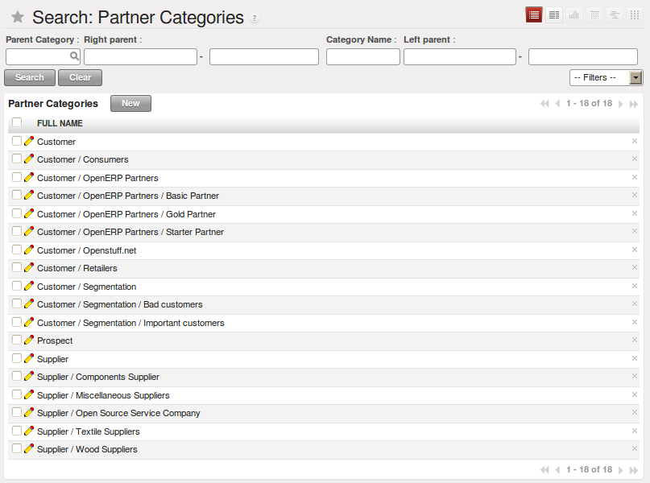
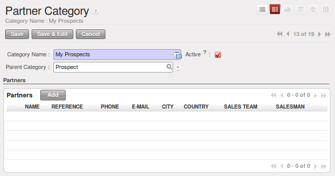

.. i18n: To Connect to OpenERP
.. i18n: =====================
..

连接到 OpenERP
=====================

.. i18n: Since this is the first time you have connected to OpenERP, you will be given the opportunity
.. i18n: to configure the system. You may choose to either :guilabel:`Skip Configuration Wizards`
.. i18n: or :guilabel:`Start Configuration`. We shall proceed with system configuration by clicking
.. i18n: :guilabel:`Start Configuration`.
..

由于这是您第一次连接到 OpenERP, 你将有机会来配置系统.
你可以选择其中一种 :guilabel:`Skip Configuration Wizards`
或 :guilabel:`Start Configuration`. 我们将继续通过点击系统配置
:guilabel:`Start Configuration`.

.. i18n: Configuration consists of a set of wizards that help you through options for the installed modules.
.. i18n: Hardly anything is installed, so this is a very simple process at the moment.
.. i18n:    
.. i18n:     #.  :guilabel:`Configure Your Interface` : select ``Simplified`` and click :guilabel:`Next`.
..

配置包括一组向导，它可以帮助你通过选项来安装模块。
安装过程在这块是一个非常简单的.
   
    #.  :guilabel:`Configure Your Interface` : 选择 ``Simplified`` 并点击 :guilabel:`Next`.

.. i18n:     #.  At the :guilabel:`Company Configuration` step, you should select your own :guilabel:`Company Name` and 
.. i18n: 	:guilabel:`Currency`. You may add your company address, contact and other details and a logo,
.. i18n: 	if you have one, that appears on reports. Then, click :guilabel:`Next`.
.. i18n: 
.. i18n:     #.  The :guilabel:`Install Applications` section would enable you to add applications to
.. i18n: 	your system. For now, click :guilabel:`Skip` to proceed without installing any applications.
.. i18n: 	You are now connected to OpenERP and can start using the system as an Administrator.
..

    #.  在 :guilabel:`Company Configuration` 步骤, 输入你自己的 :guilabel:`Company Name` 和 
	:guilabel:`Currency`. 这里可以加公司地址, 联系方式等其他详细信息和公司 Logo,
	如果你有的话, Logo将在报表上展示. 然后, 点击 :guilabel:`Next`.

    #.  在 :guilabel:`Install Applications` 部分将允许你添加应用到你的
	系统中. 眼下, 点击 :guilabel:`Skip` 不安装任何应用.
	你现在连接到 OpenERP 可以开始以管理员用户来使用系统.

.. i18n: .. index::
.. i18n:    single:  administrator
..

.. index::
   single:  administrator

.. i18n: Once you are displaying the main menu, you are able to see the following screen items, 
.. i18n: as shown in screenshot :ref:`fig-oech2-main`:
..

第一屏显示的是下图所示的主菜单 :ref:`fig-oech2-main`:

.. i18n: * the name of the database you are logged into and, just below it, the current user name,
.. i18n: 
.. i18n: * the :guilabel:`ONLINE SUPPORT` button, which gives you an overview of the support services provided by OpenERP
.. i18n:   which is available for subscription,
.. i18n: 
.. i18n: * the :guilabel:`Preferences` toolbar to the top right, showing the links to the :guilabel:`HOME` page,
.. i18n:   :guilabel:`EDIT PREFERENCES` page, :guilabel:`ABOUT`, :guilabel:`HELP`
.. i18n:   and :guilabel:`LOGOUT` button,
.. i18n: 
.. i18n: * just below, you will find shortcuts (which the user can customize) and links to the menu items of installed applications,
.. i18n: 
.. i18n: * a collection of interesting and useful widgets are available on the right of the home page beside the main menu.
..

* 在登陆的帐套名提示下面是你当前的登陆用户.

*  :guilabel:`ONLINE SUPPORT` 按钮， 给你一个OpenERP提供的支持服务的总览，他对会员开放，

* 右上角的 :guilabel:`Preferences` 工具栏，用来显示 :guilabel:`HOME` 页的链接，
  :guilabel:`EDIT PREFERENCES` 页, :guilabel:`ABOUT`, :guilabel:`HELP`
  和 :guilabel:`LOGOUT` 按钮,

* 下面就是所安装程序的菜单条目的链接图标（用户可以自定义），

* 在主页的右侧，主菜单的旁边是一组小工具（widgets）的快捷菜单。

.. i18n: .. _fig-oech2-main:
.. i18n: 
.. i18n: .. figure:: images/main_window_openerp_ch02.png
.. i18n:    :scale: 65
.. i18n:    :align: center
.. i18n: 
.. i18n:    *The Main Menu of the openerp_ch02 database*
..

.. _fig-oech2-main:

.. figure:: images/main_window_openerp_ch02.png
   :scale: 65
   :align: center

   *The Main Menu of the openerp_ch02 database*

.. i18n: Two menus are available at the moment:
..

当前有两个可用菜单:

.. i18n: * :menuselection:`Sales`
.. i18n: 
.. i18n: * :menuselection:`Administration`
..

* :menuselection:`Sales`

* :menuselection:`Administration`

.. i18n: .. index::
.. i18n:    single: Preferences
..

.. index::
   single: Preferences

.. i18n: Preferences Toolbar
.. i18n: -------------------
..

工具栏首选项
-------------------

.. i18n: When you are connected to OpenERP, the topmost toolbar indicates which user you are connected as.
.. i18n: So it should currently be showing :guilabel:`Administrator` (unless you logged in as another
.. i18n: user and it is reflecting the name of that user instead).
..

当你连接到OpenERP，最上面的工具栏指出你是使用哪一个用户进行的连接。所以当前它显示 :guilabel:`Administrator` 
（如果你使用另一个用户登录，它会相应的显示另一个用户名）。

.. i18n: You will find the Preferences toolbar to its right containing a set of useful links.
.. i18n: First, you will find a link to the :guilabel:`HOME` page. This takes you to either the
.. i18n: Home page containing links to the available menus or to another window or dashboard, depending on the
.. i18n: user configuration. In the case of the \ ``openerp_ch02`` \ database, so far the Home page
.. i18n: is the Main Menu. But in general each user of the
.. i18n: system is presented with a dashboard that is designed to show performance indicators and urgent
.. i18n: documents that are most useful to someone of the user's position in the company. You will see how to
.. i18n: assign dashboards to different users in a later chapter, :ref:`ch-config`.
..

You will find the Preferences toolbar to its right containing a set of useful links.
First, you will find a link to the :guilabel:`HOME` page. This takes you to either the
Home page containing links to the available menus or to another window or dashboard, depending on the
user configuration. In the case of the \ ``openerp_ch02`` \ database, so far the Home page
is the Main Menu. But in general each user of the
system is presented with a dashboard that is designed to show performance indicators and urgent
documents that are most useful to someone of the user's position in the company. You will see how to
assign dashboards to different users in a later chapter, :ref:`ch-config`.

.. i18n: .. index::
.. i18n:    single: timezone
..

.. index::
   single: timezone

.. i18n: .. tip::  Multi-nationals and Time Zones
.. i18n: 
.. i18n: 	If you have users in different countries, they can configure their own timezone. Timestamp displays
.. i18n: 	are then adjusted by reference to the user's own localization setting.
.. i18n: 
.. i18n: 	So if you have a team in India and a team in England, the times will automatically be converted. If
.. i18n: 	an Indian employee sets her working hours from 9 to 6, that will be converted and saved in the
.. i18n: 	server's timezone. When the English users want to set up a meeting with an Indian user, the Indian
.. i18n: 	user's available time will be converted to English time.
..

.. tip::  Multi-nationals and Time Zones

	If you have users in different countries, they can configure their own timezone. Timestamp displays
	are then adjusted by reference to the user's own localization setting.

	So if you have a team in India and a team in England, the times will automatically be converted. If
	an Indian employee sets her working hours from 9 to 6, that will be converted and saved in the
	server's timezone. When the English users want to set up a meeting with an Indian user, the Indian
	user's available time will be converted to English time.

.. i18n: The next element in the toolbar is a link to :guilabel:`EDIT PREFERENCES`. By clicking that link, you
.. i18n: get a dialog box where the current user can set his interface in the :guilabel:`Current Activity` tab;
.. i18n: and in the :guilabel:`Preferences` tab, set his password, a timezone, a working language,
.. i18n: e-mail and a signature:
..

The next element in the toolbar is a link to :guilabel:`EDIT PREFERENCES`. By clicking that link, you
get a dialog box where the current user can set his interface in the :guilabel:`Current Activity` tab;
and in the :guilabel:`Preferences` tab, set his password, a timezone, a working language,
e-mail and a signature:

.. i18n: * The :guilabel:`Interface` field in the :guilabel:`Current Activity` tab allows the user to switch
.. i18n:   between the \ ``Simplified`` \ and \ ``Extended`` \ interfaces.
.. i18n: 
.. i18n: * The :guilabel:`Language` field enables the user's working language to be changed. But first, the
.. i18n:   system must be loaded with other languages for the user to be able to choose an alternative, which
.. i18n:   is described in the next subsection of this chapter. This is a mandatory field.
.. i18n: 
.. i18n: * The :guilabel:`Timezone` setting indicates the user's location to OpenERP. This can be different
.. i18n:   from that of the server. All of the dates in the system are converted to the user's timezone
.. i18n:   automatically.
.. i18n: 
.. i18n: * The :guilabel:`Menu Tips` checkbox gives the user the choice to have tips displayed on each menu action.
.. i18n: 
.. i18n: * The :guilabel:`Change Password` button gives users the opportunity to change their own password.
.. i18n:   It opens a new dialog box where users may change the password and must logout and login again after the change.
.. i18n:   You should take steps (perhaps written policies) to prevent users making these too trivial.
.. i18n: 
.. i18n: * The :guilabel:`Email` field is for storing the current user's default e-mail address.
.. i18n: 
.. i18n: * The :guilabel:`Signature` field gives the user a place for the signature attached to messages sent
.. i18n:   from within OpenERP. 
..

* The :guilabel:`Interface` field in the :guilabel:`Current Activity` tab allows the user to switch
  between the \ ``Simplified`` \ and \ ``Extended`` \ interfaces.

* The :guilabel:`Language` field enables the user's working language to be changed. But first, the
  system must be loaded with other languages for the user to be able to choose an alternative, which
  is described in the next subsection of this chapter. This is a mandatory field.

* The :guilabel:`Timezone` setting indicates the user's location to OpenERP. This can be different
  from that of the server. All of the dates in the system are converted to the user's timezone
  automatically.

* The :guilabel:`Menu Tips` checkbox gives the user the choice to have tips displayed on each menu action.

* The :guilabel:`Change Password` button gives users the opportunity to change their own password.
  It opens a new dialog box where users may change the password and must logout and login again after the change.
  You should take steps (perhaps written policies) to prevent users making these too trivial.

* The :guilabel:`Email` field is for storing the current user's default e-mail address.

* The :guilabel:`Signature` field gives the user a place for the signature attached to messages sent
  from within OpenERP. 

.. i18n: The :guilabel:`ABOUT` link gives information about the development of the OpenERP software and 
.. i18n: various links to other information.
..

The :guilabel:`ABOUT` link gives information about the development of the OpenERP software and 
various links to other information.

.. i18n: The :guilabel:`HELP` link directs the user to the online documentation of OpenERP, where extensive help is available on a host of topics.
..

The :guilabel:`HELP` link directs the user to the online documentation of OpenERP, where extensive help is available on a host of topics.

.. i18n: The :guilabel:`LOGOUT` link enables you to logout and return to the original login page. You can
.. i18n: then login to another database, or to the same database as another user. This page also gives you
.. i18n: access to the super-administrator functions for managing databases on this server.
..

The :guilabel:`LOGOUT` link enables you to logout and return to the original login page. You can
then login to another database, or to the same database as another user. This page also gives you
access to the super-administrator functions for managing databases on this server.

.. i18n: .. index::
.. i18n:    single: installation; language
..

.. index::
   single: installation; language

.. i18n: Installing a New Language
.. i18n: ^^^^^^^^^^^^^^^^^^^^^^^^^
..

安装新的语言
^^^^^^^^^^^^^^^^^^^^^^^^^

.. i18n: Each user of the system can work in his or her own language. More than twenty languages are
.. i18n: currently available besides English. Users select their working language using the Preferences link.
.. i18n: You can also assign a language to a partner (customer or supplier), in which case all the documents
.. i18n: sent to that partner will be automatically translated into that language.
..

Each user of the system can work in his or her own language. More than twenty languages are
currently available besides English. Users select their working language using the Preferences link.
You can also assign a language to a partner (customer or supplier), in which case all the documents
sent to that partner will be automatically translated into that language.

.. i18n: .. attention:: More about Languages
.. i18n: 
.. i18n: 	The base version of OpenERP is translated into the following languages: English, German, Chinese,
.. i18n: 	Spanish, Italian, Hungarian, Dutch, Portuguese, Romanian, Swedish and Czech.
.. i18n: 
.. i18n: 	But other languages are also available: Arabic, Afghan,
.. i18n: 	Austrian, Bulgarian, Indonesian, Finnish, Thai, Turkish and Vietnamese..
..

.. attention:: More about Languages

	The base version of OpenERP is translated into the following languages: English, German, Chinese,
	Spanish, Italian, Hungarian, Dutch, Portuguese, Romanian, Swedish and Czech.

	But other languages are also available: Arabic, Afghan,
	Austrian, Bulgarian, Indonesian, Finnish, Thai, Turkish and Vietnamese..

.. i18n: As administrator, you can install a new main working language into the system.
..

As administrator, you can install a new main working language into the system.

.. i18n: 	#. Select :menuselection:`Administration` in the Menu Toolbar and click
.. i18n: 	   :menuselection:`Translations --> Load an Official Translation` in the main menu window,
.. i18n: 
.. i18n: 	#. Select the language to install, \ ``French``\  for example, and click :guilabel:`Load`,
.. i18n: 
.. i18n: 	#. The system will intimate you when the selected language has been successfully installed.
.. i18n: 	   Click :guilabel:`Close` to return to the menu.
..

	#. Select :menuselection:`Administration` in the Menu Toolbar and click
	   :menuselection:`Translations --> Load an Official Translation` in the main menu window,

	#. Select the language to install, \ ``French``\  for example, and click :guilabel:`Load`,

	#. The system will intimate you when the selected language has been successfully installed.
	   Click :guilabel:`Close` to return to the menu.

.. i18n: To see the effects of this installation, change the preferences of your user to change the working
.. i18n: language (you may first need to ensure that you have explicitly selected English as your language,
.. i18n: rather than keep the default, before you are given the French option). 
.. i18n: You may have to reload the page to see the effects. The main menu is immediately translated in
.. i18n: the selected language. If you are using the GTK
.. i18n: client, you will first have to close the menu then open a new main menu to start seeing things in the
.. i18n: new language.
..

To see the effects of this installation, change the preferences of your user to change the working
language (you may first need to ensure that you have explicitly selected English as your language,
rather than keep the default, before you are given the French option). 
You may have to reload the page to see the effects. The main menu is immediately translated in
the selected language. If you are using the GTK
client, you will first have to close the menu then open a new main menu to start seeing things in the
new language.

.. i18n: .. note:: Navigating the Menu
.. i18n: 
.. i18n:    From this point in the book navigation from the main menu is written as a series of menu entries
.. i18n:    connected by the :menuselection:`-->` character. Instead of seeing “Select Administration in
.. i18n:    the Menu toolbar then click Translations > Load an Official Translation” you will just get “use menu
.. i18n:    :menuselection:`Administration --> Translations --> Load an Official Translation`”.
..

.. note:: Navigating the Menu

   From this point in the book navigation from the main menu is written as a series of menu entries
   connected by the :menuselection:`-->` character. Instead of seeing “Select Administration in
   the Menu toolbar then click Translations > Load an Official Translation” you will just get “use menu
   :menuselection:`Administration --> Translations --> Load an Official Translation`”.

.. i18n: .. index:: requests
..

.. index:: requests

.. i18n: Requests
.. i18n: ^^^^^^^^
..

站内信
^^^^^^^^

.. i18n: Requests have been removed in OpenERP 6.1 - a new internal communication system will be added in 7.0.
..

Requests have been removed in OpenERP 6.1 - a new internal communication system will be added in 7.0.

.. i18n: .. index::
.. i18n:    single: user; configuration
..

.. index::
   single: user; configuration

.. i18n: Configuring Users
.. i18n: -----------------
..

配置用户
-----------------

.. i18n: The database you created contains minimal functionality but can be extended to include all of the
.. i18n: potential functionality available to OpenERP. About the only functions actually available in this
.. i18n: minimal database are Customers and Currencies – and these only because the definition of your main
.. i18n: company required this. And because you chose to include demonstration data, both Customers and
.. i18n: Currencies were installed with some samples.
..

The database you created contains minimal functionality but can be extended to include all of the
potential functionality available to OpenERP. About the only functions actually available in this
minimal database are Customers and Currencies – and these only because the definition of your main
company required this. And because you chose to include demonstration data, both Customers and
Currencies were installed with some samples.

.. i18n: .. index::
.. i18n:    single: administrator
..

.. index::
   single: administrator

.. i18n: Because you logged in as Administrator, you have all the access you need to configure users. Click
.. i18n: :menuselection:`Administration --> Users --> Users` to display the list of users defined in the
.. i18n: system. A second user, \ ``Demo User`` \, is also present in the system as part of the
.. i18n: demonstration data. Click the \ ``Demo User`` \ name to open a non-editable form on that user.
..

Because you logged in as Administrator, you have all the access you need to configure users. Click
:menuselection:`Administration --> Users --> Users` to display the list of users defined in the
system. A second user, \ ``Demo User`` \, is also present in the system as part of the
demonstration data. Click the \ ``Demo User`` \ name to open a non-editable form on that user.

.. i18n: Click the :guilabel:`Groups`  tab to see that the demo user is a member of only the ``Employee`` group,
.. i18n: and is subject to no specialized rules.
.. i18n: The user \ ``Administrator`` \ is different, as you can see if you
.. i18n: follow the same sequence to review its definition. It is a member of the \ ``Administration / Configuration`` \
.. i18n: and the \ ``Administration / Access Rights`` \ groups,
.. i18n: which gives it more advanced rights to configure new users.
..

Click the :guilabel:`Groups`  tab to see that the demo user is a member of only the ``Employee`` group,
and is subject to no specialized rules.
The user \ ``Administrator`` \ is different, as you can see if you
follow the same sequence to review its definition. It is a member of the \ ``Administration / Configuration`` \
and the \ ``Administration / Access Rights`` \ groups,
which gives it more advanced rights to configure new users.

.. i18n: .. index:: 
.. i18n:    single: user; access
.. i18n:    single: user; role
.. i18n:    single: user; group
..

.. index:: 
   single: user; access
   single: user; role
   single: user; group

.. i18n: .. tip::  Groups and Users
.. i18n: 
.. i18n: 	Users and groups provide the structure for specifying access rights to different documents. Their
.. i18n: 	setup answers the question “Who has access to what?”
..

.. tip::  Groups and Users

	Users and groups provide the structure for specifying access rights to different documents. Their
	setup answers the question “Who has access to what?”

.. i18n: Click :menuselection:`Administration --> Users --> Groups` to open the list of
.. i18n: groups defined in the system. If you open the form view of the \ ``Administration / Configuration`` \
.. i18n: group by clicking its name in the list, the first tab :guilabel:`Users` gives you the list of
.. i18n: all the users who belong to this group.
..

Click :menuselection:`Administration --> Users --> Groups` to open the list of
groups defined in the system. If you open the form view of the \ ``Administration / Configuration`` \
group by clicking its name in the list, the first tab :guilabel:`Users` gives you the list of
all the users who belong to this group.

.. i18n: You can also see in the :guilabel:`Menus` tab, the list of menus reserved for this group. By convention,
.. i18n: the \ ``Administration / Configuration`` \ in OpenERP has rights of access to
.. i18n: the :menuselection:`Configuration` menu in each section. So \ ``Sales / Configuration`` \ is
.. i18n: found in the list of access rights but \ ``Sales`` \ is not found there because it is accessible
.. i18n: to all users. Click the :guilabel:`Access Rights` tab and it gives you details of the access rights
.. i18n: for that group. These are detailed later in :ref:`ch-config`. 
..

You can also see in the :guilabel:`Menus` tab, the list of menus reserved for this group. By convention,
the \ ``Administration / Configuration`` \ in OpenERP has rights of access to
the :menuselection:`Configuration` menu in each section. So \ ``Sales / Configuration`` \ is
found in the list of access rights but \ ``Sales`` \ is not found there because it is accessible
to all users. Click the :guilabel:`Access Rights` tab and it gives you details of the access rights
for that group. These are detailed later in :ref:`ch-config`. 

.. i18n: You can create some new users to integrate them into the system. Assign them to predefined groups to
.. i18n: grant them certain access rights. Then try their access rights when you login as these users.
.. i18n: Management defines these access rights as described in :ref:`ch-config`.
..

You can create some new users to integrate them into the system. Assign them to predefined groups to
grant them certain access rights. Then try their access rights when you login as these users.
Management defines these access rights as described in :ref:`ch-config`.

.. i18n: .. note::  Changes to Default Access Rights
.. i18n: 
.. i18n: 	New versions of OpenERP differ from earlier versions of OpenERP and Tiny ERP in this area:
.. i18n: 	many groups have been predefined and access to many of the menus and objects are keyed to these
.. i18n: 	groups by default.
.. i18n: 	This is quite a contrast to the rather liberal approach in 4.2.2 and before, where access rights
.. i18n: 	could be defined but were not activated by default.
..

.. note::  Changes to Default Access Rights

	New versions of OpenERP differ from earlier versions of OpenERP and Tiny ERP in this area:
	many groups have been predefined and access to many of the menus and objects are keyed to these
	groups by default.
	This is quite a contrast to the rather liberal approach in 4.2.2 and before, where access rights
	could be defined but were not activated by default.

.. i18n: .. index::
.. i18n:    single: partner; managing
..

.. index::
   single: partner; managing

.. i18n: Managing Partners
.. i18n: -----------------
..

管理业务伙伴
-----------------

.. i18n: In OpenERP, a partner represents an entity that you do business with. That can be a prospect, a
.. i18n: customer, a supplier, or even an employee of your company.
..

In OpenERP, a partner represents an entity that you do business with. That can be a prospect, a
customer, a supplier, or even an employee of your company.

.. i18n: List of Partners
.. i18n: ^^^^^^^^^^^^^^^^
..

业务伙伴列表
^^^^^^^^^^^^^^^^

.. i18n: Click :menuselection:`Sales --> Address Book --> Customers` in the main menu to open the list of partners who are customers. Then click the name of the first partner to get hold of the details – a form appears with 
.. i18n: information about the company, such as its corporate name, its primary language, its reference and whether it is a
.. i18n: \ ``Customer`` \ and/or a \ ``Supplier`` \. You will also find several other tabs on it:
..

Click :menuselection:`Sales --> Address Book --> Customers` in the main menu to open the list of partners who are customers. Then click the name of the first partner to get hold of the details – a form appears with 
information about the company, such as its corporate name, its primary language, its reference and whether it is a
\ ``Customer`` \ and/or a \ ``Supplier`` \. You will also find several other tabs on it:

.. i18n: * the :guilabel:`General` tab contains information about different contacts at that partner, postal information,
.. i18n:   communication information and the categories it belongs to.
.. i18n: 
.. i18n: * the :guilabel:`Sales & Purchases` tab contains information that is slightly less immediate.
.. i18n: 
.. i18n: * the :menuselection:`History` tab (visible if you install other modules like :mod:`crm`)
.. i18n:   contains the history of all the events that the partner has
.. i18n:   been involved in. These events are created automatically by different system documents: invoices,
.. i18n:   orders, support requests and so on, from a list that can be configured in the system. 
.. i18n:   These give you a rapid view of the partner's history on a single
.. i18n:   screen.
.. i18n: 
.. i18n: * the :menuselection:`Notes` tab is an area for free text notes.
..

* the :guilabel:`General` tab contains information about different contacts at that partner, postal information,
  communication information and the categories it belongs to.

* the :guilabel:`Sales & Purchases` tab contains information that is slightly less immediate.

* the :menuselection:`History` tab (visible if you install other modules like :mod:`crm`)
  contains the history of all the events that the partner has
  been involved in. These events are created automatically by different system documents: invoices,
  orders, support requests and so on, from a list that can be configured in the system. 
  These give you a rapid view of the partner's history on a single
  screen.

* the :menuselection:`Notes` tab is an area for free text notes.

.. i18n: To the right of the form is a list of Reports, Actions, Links and Attachments related to a partner. Click some of 
.. i18n: them to get a feel for their use.
..

To the right of the form is a list of Reports, Actions, Links and Attachments related to a partner. Click some of 
them to get a feel for their use.

.. i18n: .. figure:: images/partner.png
.. i18n:    :align: center
.. i18n:    :scale: 80
.. i18n: 
.. i18n:    *Partner form*
..

.. figure:: images/partner.png
   :align: center
   :scale: 80

   *Partner form*

.. i18n: .. index::
.. i18n:    single: partner; category
..

.. index::
   single: partner; category

.. i18n: .. tip::  Partner Categories
.. i18n: 
.. i18n: 	Partner Categories enable you to segment different partners according to their relation with you
.. i18n: 	(client, prospect, supplier, and so on). A partner can belong to several categories – for example
.. i18n: 	it may be both a customer and supplier at the same time.
.. i18n: 	
.. i18n: 	But there are also Customer and Supplier checkboxes on the partner form, which are different.
.. i18n: 	These checkboxes are designed to enable OpenERP to quickly select what should appear on some of the
.. i18n: 	system drop-down selection boxes. They, too, need to be set correctly.
..

.. tip::  Partner Categories

	Partner Categories enable you to segment different partners according to their relation with you
	(client, prospect, supplier, and so on). A partner can belong to several categories – for example
	it may be both a customer and supplier at the same time.
	
	But there are also Customer and Supplier checkboxes on the partner form, which are different.
	These checkboxes are designed to enable OpenERP to quickly select what should appear on some of the
	system drop-down selection boxes. They, too, need to be set correctly.

.. i18n: Partner Categories
.. i18n: ^^^^^^^^^^^^^^^^^^
..

业务伙伴分类
^^^^^^^^^^^^^^^^^^

.. i18n: You can list your partners by category using the menu :menuselection:`Sales --> Configuration -->
.. i18n: Address Book --> Partners Categories`. Click a category to obtain a list of partners in that category.
..

You can list your partners by category using the menu :menuselection:`Sales --> Configuration -->
Address Book --> Partners Categories`. Click a category to obtain a list of partners in that category.

.. i18n: .. figure:: images/main_window_partner_menu_config.png
.. i18n:    :scale: 75
.. i18n:    :align: center
.. i18n: 
.. i18n:    *Categories of partner*
..

   *Categories of partner*

.. i18n: The administrator can define new categories. So you will create a new category and link it to a
.. i18n: partner:
..

The administrator can define new categories. So you will create a new category and link it to a
partner:

.. i18n: 	#. Use :menuselection:`Sales --> Configuration --> Address Book --> Partners Categories`
.. i18n: 	   to reach the list of categories in a list view.
.. i18n: 
.. i18n: 	#. Click :guilabel:`New` to open an empty form for creating a new category
.. i18n: 
.. i18n: 	#. Enter \ ``My Prospects``\  in the field :guilabel:`Category Name`. Then click on the
.. i18n: 	   :guilabel:`Search` icon to the right of the :guilabel:`Parent Category` field and select 
.. i18n: 	   \ ``Prospect``\  in the list that appears.
.. i18n: 
.. i18n: 	#. Then save your new category using the :guilabel:`Save` button.
..

	#. Use :menuselection:`Sales --> Configuration --> Address Book --> Partners Categories`
	   to reach the list of categories in a list view.

	#. Click :guilabel:`New` to open an empty form for creating a new category

	#. Enter \ ``My Prospects``\  in the field :guilabel:`Category Name`. Then click on the
	   :guilabel:`Search` icon to the right of the :guilabel:`Parent Category` field and select 
	   \ ``Prospect``\  in the list that appears.

	#. Then save your new category using the :guilabel:`Save` button.

.. i18n: You may add exiting partners to this new category using the :guilabel:`Add` button in the
.. i18n: :guilabel:`Partners` section.
..

You may add exiting partners to this new category using the :guilabel:`Add` button in the
:guilabel:`Partners` section.

.. i18n: .. tip:: Required Fields
.. i18n: 
.. i18n: 	Fields colored blue are required. If you try to save the form while any of these fields are empty,
.. i18n: 	the field turns red to indicate that there is a problem. It is impossible to save the form until
.. i18n: 	you have completed every required field.
..

.. tip:: Required Fields

	Fields colored blue are required. If you try to save the form while any of these fields are empty,
	the field turns red to indicate that there is a problem. It is impossible to save the form until
	you have completed every required field.

.. i18n: You can review your new category structure using the list view. 
.. i18n: You should see the new structure of \ ``Prospects / My Prospects``\   there.
..

You can review your new category structure using the list view. 
You should see the new structure of \ ``Prospects / My Prospects``\   there.

.. i18n: .. figure:: images/main_window_partner_tab.png
.. i18n:    :scale: 75
.. i18n:    :align: center
.. i18n: 
.. i18n:    *Creating a new partner category*
..

   *Creating a new partner category*

.. i18n: To create a new partner and link it to this new category, open a new partner form to modify it.
..

To create a new partner and link it to this new category, open a new partner form to modify it.

.. i18n: 	#. Type \ ``New Partner``\  into the :guilabel:`Name` field.
.. i18n: 
.. i18n: 	#. In the :guilabel:`General` tab, click the :guilabel:`Add` button under the
.. i18n: 	   :guilabel:`Categories` section and select your
.. i18n: 	   new category from the list that appears: \ ``Prospect / My Prospects`` \.
.. i18n: 
.. i18n: 	#. Then save your partner by clicking :guilabel:`Save`. The partner now belongs in the category 
.. i18n: 	   \ ``Prospect / My Prospects`` \.
.. i18n: 
.. i18n: 	#. Monitor your modification in the menu :menuselection:`Sales --> Configuration --> Address Book -->
.. i18n: 	   Partners Categories`. Select the category :guilabel:`Prospect / My Prospects`. The list of partners opens
.. i18n: 	   and you will find your new partner there in that list.
..

	#. Type \ ``New Partner``\  into the :guilabel:`Name` field.

	#. In the :guilabel:`General` tab, click the :guilabel:`Add` button under the
	   :guilabel:`Categories` section and select your
	   new category from the list that appears: \ ``Prospect / My Prospects`` \.

	#. Then save your partner by clicking :guilabel:`Save`. The partner now belongs in the category 
	   \ ``Prospect / My Prospects`` \.

	#. Monitor your modification in the menu :menuselection:`Sales --> Configuration --> Address Book -->
	   Partners Categories`. Select the category :guilabel:`Prospect / My Prospects`. The list of partners opens
	   and you will find your new partner there in that list.

.. i18n: .. tip:: Searching for Documents
.. i18n: 
.. i18n: 	If you need to search through a long list of partners, it is best to use the available search
.. i18n: 	criteria rather than scroll through the whole partner list. It is a habit that will save you a lot of
.. i18n: 	time in the long run as you search for all kinds of documents.
..

.. tip:: Searching for Documents

	If you need to search through a long list of partners, it is best to use the available search
	criteria rather than scroll through the whole partner list. It is a habit that will save you a lot of
	time in the long run as you search for all kinds of documents.

.. i18n: .. note::  Example Categories of Partners
.. i18n: 
.. i18n: 	A partner can be assigned to several categories. These enable you to create alternative
.. i18n: 	classifications as necessary, usually in a hierarchical form.
.. i18n: 
.. i18n: 	Here are some structures that are often used:
.. i18n: 
.. i18n: 	* geographical locations,
.. i18n: 
.. i18n: 	* interest in certain product lines,
.. i18n: 
.. i18n: 	* subscriptions to newsletters,
.. i18n: 
.. i18n: 	* type of industry.
..

.. note::  Example Categories of Partners

	A partner can be assigned to several categories. These enable you to create alternative
	classifications as necessary, usually in a hierarchical form.

	Here are some structures that are often used:

	* geographical locations,

	* interest in certain product lines,

	* subscriptions to newsletters,

	* type of industry.

.. i18n: .. Copyright © Open Object Press. All rights reserved.
..

.. Copyright © Open Object Press. All rights reserved.

.. i18n: .. You may take electronic copy of this publication and distribute it if you don't
.. i18n: .. change the content. You can also print a copy to be read by yourself only.
..

.. You may take electronic copy of this publication and distribute it if you don't
.. change the content. You can also print a copy to be read by yourself only.

.. i18n: .. We have contracts with different publishers in different countries to sell and
.. i18n: .. distribute paper or electronic based versions of this book (translated or not)
.. i18n: .. in bookstores. This helps to distribute and promote the OpenERP product. It
.. i18n: .. also helps us to create incentives to pay contributors and authors using author
.. i18n: .. rights of these sales.
..

.. We have contracts with different publishers in different countries to sell and
.. distribute paper or electronic based versions of this book (translated or not)
.. in bookstores. This helps to distribute and promote the OpenERP product. It
.. also helps us to create incentives to pay contributors and authors using author
.. rights of these sales.

.. i18n: .. Due to this, grants to translate, modify or sell this book are strictly
.. i18n: .. forbidden, unless Tiny SPRL (representing Open Object Press) gives you a
.. i18n: .. written authorisation for this.
..

.. Due to this, grants to translate, modify or sell this book are strictly
.. forbidden, unless Tiny SPRL (representing Open Object Press) gives you a
.. written authorisation for this.

.. i18n: .. Many of the designations used by manufacturers and suppliers to distinguish their
.. i18n: .. products are claimed as trademarks. Where those designations appear in this book,
.. i18n: .. and Open Object Press was aware of a trademark claim, the designations have been
.. i18n: .. printed in initial capitals.
..

.. Many of the designations used by manufacturers and suppliers to distinguish their
.. products are claimed as trademarks. Where those designations appear in this book,
.. and Open Object Press was aware of a trademark claim, the designations have been
.. printed in initial capitals.

.. i18n: .. While every precaution has been taken in the preparation of this book, the publisher
.. i18n: .. and the authors assume no responsibility for errors or omissions, or for damages
.. i18n: .. resulting from the use of the information contained herein.
..

.. While every precaution has been taken in the preparation of this book, the publisher
.. and the authors assume no responsibility for errors or omissions, or for damages
.. resulting from the use of the information contained herein.

.. i18n: .. Published by Open Object Press, Grand Rosière, Belgium
..

.. Published by Open Object Press, Grand Rosière, Belgium
