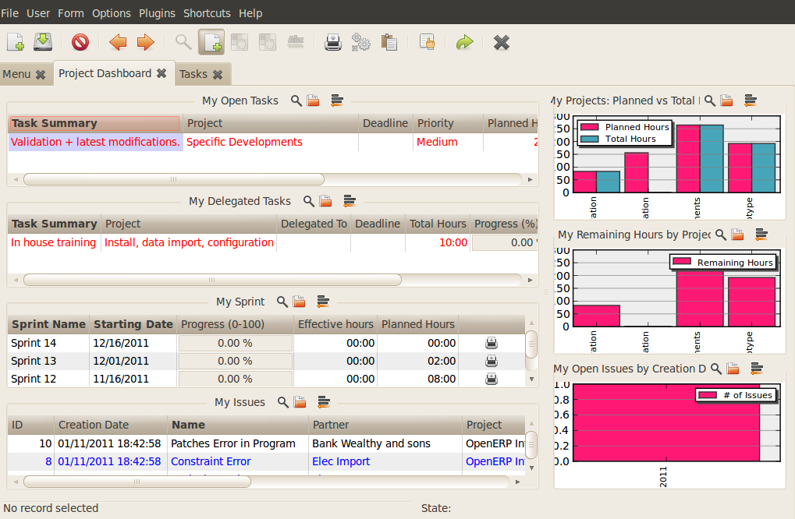
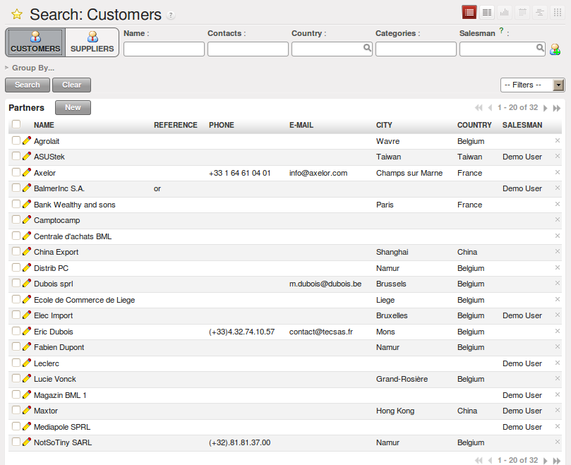
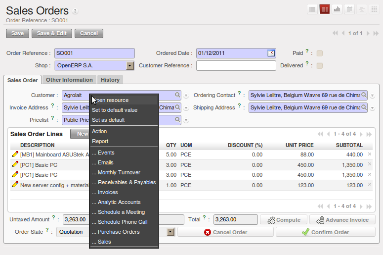
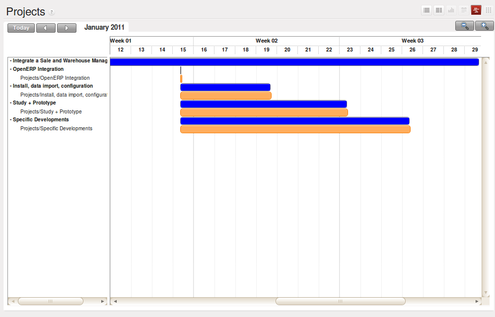

.. i18n: ****************************
.. i18n: Getting Started with OpenERP
.. i18n: ****************************
..

****************************
开始使用OpenERP
****************************

.. i18n: You will now explore the database \ ``openerp_ch02``\   with these profile modules installed to give
.. i18n: you an insight into the coverage of the core OpenERP software.
..

You will now explore the database \ ``openerp_ch02``\   with these profile modules installed to give
you an insight into the coverage of the core OpenERP software.

.. i18n: .. tip:: Translating New Modules
.. i18n: 
.. i18n: 	When you have installed a new module and are using additional languages to English, you have to reload
.. i18n: 	the translation file. New terms introduced in these modules are not translated by default. To do
.. i18n: 	this use :menuselection:`Administration --> Translations --> Load an Official Translation`.
..

.. tip:: 翻译新模块

	When you have installed a new module and are using additional languages to English, you have to reload
	the translation file. New terms introduced in these modules are not translated by default. To do
	this use :menuselection:`Administration --> Translations --> Load an Official Translation`.

.. i18n: Depending on the user you are connected as, the page appears differently.
.. i18n: Using the installation sequence above, certain dashboards may be assigned as various
.. i18n: users' home pages. They show a summary of the information required to start the day effectively. A
.. i18n: project dashboard might contain:
..

Depending on the user you are connected as, the page appears differently.
Using the installation sequence above, certain dashboards may be assigned as various
users' home pages. They show a summary of the information required to start the day effectively. A
project dashboard might contain:

.. i18n: * a list of the tasks to carry out,
.. i18n: 
.. i18n: * a list of the tasks which is assigned to current user,
.. i18n: 
.. i18n: * a list of sprints,
.. i18n: 
.. i18n: * a list of issues assigned to current user,
.. i18n: 
.. i18n: * a graph of Planned vs Total hours,
.. i18n: 
.. i18n: * a graph of Remaining hours by Project,
.. i18n: 
.. i18n: * a graph of Open Issues by Creation Date.
..

* a list of the tasks to carry out,

* a list of the tasks which is assigned to current user,

* a list of sprints,

* a list of issues assigned to current user,

* a graph of Planned vs Total hours,

* a graph of Remaining hours by Project,

* a graph of Open Issues by Creation Date.

.. i18n: Each of the lists can be reordered simply by clicking the heading of a column – first in ascending, then in descending order as you click repeatedly. To get more information about any particular entry, click on the name in the first column, or if you want to show a particular panel, click :guilabel:`Zoom` above it.
..

Each of the lists can be reordered simply by clicking the heading of a column – first in ascending, then in descending order as you click repeatedly. To get more information about any particular entry, click on the name in the first column, or if you want to show a particular panel, click :guilabel:`Zoom` above it.

.. i18n: .. figure:: images/admin_project_dashboard.png
.. i18n:    :align: center
.. i18n:    :scale: 65
.. i18n: 
.. i18n:    *Project Dashboard*
..

   *Project Dashboard*

.. i18n: A user's home page is automatically reassigned during the creation or upgrading of a database. It is
.. i18n: customary to assign a dashboard to someone's home page, but any OpenERP screen can be assigned to the
.. i18n: home page of any user.
..

A user's home page is automatically reassigned during the creation or upgrading of a database. It is
customary to assign a dashboard to someone's home page, but any OpenERP screen can be assigned to the
home page of any user.

.. i18n: .. index::
.. i18n:    single: shortcut
..

.. index::
   single: shortcut

.. i18n: .. tip:: Creating Shortcuts
.. i18n: 
.. i18n: 	Each user has access to many menu items from the menu. But in
.. i18n: 	general, an employee uses only a small part of the system's functions.
.. i18n: 
.. i18n: 	So you can define shortcuts for the most-used menus. These shortcuts are personal for each user. To
.. i18n: 	create a new shortcut, just click the '*' of the header of the view in web client.
.. i18n: 
.. i18n: 	To remove a shortcut just click the link and again click '*' of the header of the view.
..

.. tip:: Creating Shortcuts

	Each user has access to many menu items from the menu. But in
	general, an employee uses only a small part of the system's functions.

	So you can define shortcuts for the most-used menus. These shortcuts are personal for each user. To
	create a new shortcut, just click the '*' of the header of the view in web client.

	To remove a shortcut just click the link and again click '*' of the header of the view.

.. i18n: The following sections present an overview of the main functions of OpenERP. Some areas are
.. i18n: covered in more detail in the following chapters of this book and you will find many other functions
.. i18n: available in the optional modules. Functions are presented in the order that they appear on the main
.. i18n: menu.
..

The following sections present an overview of the main functions of OpenERP. Some areas are
covered in more detail in the following chapters of this book and you will find many other functions
available in the optional modules. Functions are presented in the order that they appear on the main
menu.

.. i18n: Basic Concepts
.. i18n: ==============
..

基本概念
==============

.. i18n: .. index::
.. i18n:    single: Partners
..

.. index::
   single: Partners

.. i18n: Partners & Contacts
.. i18n: ^^^^^^^^^^^^^^^^^^^
..

业务伙伴及其联系人
^^^^^^^^^^^^^^^^^^^

.. i18n: To get familiar with the OpenERP user interface, you will start working with information about
.. i18n: partners. Clicking :menuselection:`Sales --> Address Book --> Customers` brings up a list of partners that were
.. i18n: automatically loaded when you created the database with :guilabel:`Load Demonstration Data` checked.
..

To get familiar with the OpenERP user interface, you will start working with information about
partners. Clicking :menuselection:`Sales --> Address Book --> Customers` brings up a list of partners that were
automatically loaded when you created the database with :guilabel:`Load Demonstration Data` checked.

.. i18n: .. index::
.. i18n:    single: partner; search
..

.. index::
   single: partner; search

.. i18n: Search for a Partner
.. i18n: ^^^^^^^^^^^^^^^^^^^^
..

快速定位业务伙伴
^^^^^^^^^^^^^^^^^^^^

.. i18n: Above the partner list you will see a search form that enables you to quickly filter the partners.
..

Above the partner list you will see a search form that enables you to quickly filter the partners.

.. i18n: The \ ``Customers`` \ filter is enabled by default showing partners who are customers. If you have applied no filter, the list shows every partner in the system. For space reasons, this list shows only the first few partners. If you want to display other records, you can search for them or navigate through the whole list using the :guilabel:`First`, :guilabel:`Previous`, :guilabel:`Next`, :guilabel:`Last` arrows.
..

The \ ``Customers`` \ filter is enabled by default showing partners who are customers. If you have applied no filter, the list shows every partner in the system. For space reasons, this list shows only the first few partners. If you want to display other records, you can search for them or navigate through the whole list using the :guilabel:`First`, :guilabel:`Previous`, :guilabel:`Next`, :guilabel:`Last` arrows.

.. i18n: .. figure:: images/partner_search_tab.png
.. i18n:    :scale: 75
.. i18n:    :align: center
.. i18n: 
.. i18n:    *Standard partner search*
..

   *Standard partner search*

.. i18n: .. note:: List Limits
.. i18n: 
.. i18n: 	By default, the list in the GTK client shows only the first 80 records, to avoid overloading the
.. i18n: 	network and the server.
.. i18n: 
.. i18n: 	But you can change that limit by clicking the selection widget (showing 80 by default) to the
.. i18n: 	right of the search criteria.
.. i18n: 
.. i18n: 	Similarly, the list in the web client shows only the first 20, 50, 100, 500 or unlimited records.
.. i18n: 
.. i18n: 	The actual number can be switched by clicking the link between the PREVIOUS and NEXT buttons
.. i18n: 	and selecting one of the other limits.
..

.. note:: List Limits

	By default, the list in the GTK client shows only the first 80 records, to avoid overloading the
	network and the server.

	But you can change that limit by clicking the selection widget (showing 80 by default) to the
	right of the search criteria.

	Similarly, the list in the web client shows only the first 20, 50, 100, 500 or unlimited records.

	The actual number can be switched by clicking the link between the PREVIOUS and NEXT buttons
	and selecting one of the other limits.

.. i18n: In the web version, if you click the name of a partner, the form view corresponding to that partner opens in Read-Only
.. i18n: mode. In the list you could alternatively click the pencil icon to open the same form in Edit mode.
.. i18n: Once you have a form, you can toggle between the two modes by clicking :guilabel:`Save` or :guilabel:`Cancel` when in
.. i18n: Edit mode and :guilabel:`Edit` when in Read-Only mode.
..

In the web version, if you click the name of a partner, the form view corresponding to that partner opens in Read-Only
mode. In the list you could alternatively click the pencil icon to open the same form in Edit mode.
Once you have a form, you can toggle between the two modes by clicking :guilabel:`Save` or :guilabel:`Cancel` when in
Edit mode and :guilabel:`Edit` when in Read-Only mode.

.. i18n: .. index::
.. i18n:    single: partner; view form
..

.. index::
   single: partner; view form

.. i18n: Partner Form
.. i18n: ^^^^^^^^^^^^
..

业务伙伴信息窗口
^^^^^^^^^^^^^^^^

.. i18n: The partner form contains several tabs, all referring to the current record:
..

The partner form contains several tabs, all referring to the current record:

.. i18n: *  :guilabel:`General`,
.. i18n: 
.. i18n: *  :guilabel:`Sales & Purchases`,
.. i18n: 
.. i18n: *  :guilabel:`Accounting`,
.. i18n: 
.. i18n: *  :guilabel:`History`,
.. i18n: 
.. i18n: *  :guilabel:`Notes`.
..

*  :guilabel:`General`,

*  :guilabel:`Sales & Purchases`,

*  :guilabel:`Accounting`,

*  :guilabel:`History`,

*  :guilabel:`Notes`.

.. i18n: The fields in a tab are not all of the same type – some (such as :guilabel:`Name`) contain free
.. i18n: text, some (such as the :guilabel:`Language`) enable you to select a value from a list of options,
.. i18n: others give you a view of another object (such as :guilabel:`Partner Contacts` – because a partner
.. i18n: can have several contacts) or a list of links to another object (such as :guilabel:`Partner Categories`).
.. i18n: There are checkboxes (such as the :guilabel:`Active` field in the :guilabel:`Sales & Purchases` tab),
.. i18n: numeric fields (such as :guilabel:`Credit Limit` in the :guilabel:`Accounting` tab) and date fields (such as :guilabel:`Date`).
..

The fields in a tab are not all of the same type – some (such as :guilabel:`Name`) contain free
text, some (such as the :guilabel:`Language`) enable you to select a value from a list of options,
others give you a view of another object (such as :guilabel:`Partner Contacts` – because a partner
can have several contacts) or a list of links to another object (such as :guilabel:`Partner Categories`).
There are checkboxes (such as the :guilabel:`Active` field in the :guilabel:`Sales & Purchases` tab),
numeric fields (such as :guilabel:`Credit Limit` in the :guilabel:`Accounting` tab) and date fields (such as :guilabel:`Date`).

.. i18n: The :guilabel:`History` tab gives a quick overview of partner activities – an overview of useful information such as Leads and Opportunities, Meetings, Phone Calls, Emails and Tasks. Events are generated automatically by OpenERP from changes in other documents that refer to this partner.
..

The :guilabel:`History` tab gives a quick overview of partner activities – an overview of useful information such as Leads and Opportunities, Meetings, Phone Calls, Emails and Tasks. Events are generated automatically by OpenERP from changes in other documents that refer to this partner.

.. i18n: It is possible to add events manually which directly relate to the corresponding form, such as a note recording a phone call. To add a new event click :guilabel:`New` in the :guilabel:`Phone Calls` section. That opens a new :guilabel:`Phone Call` pop-up form enabling a phone-call event to be created and added to the current partner.
..

It is possible to add events manually which directly relate to the corresponding form, such as a note recording a phone call. To add a new event click :guilabel:`New` in the :guilabel:`Phone Calls` section. That opens a new :guilabel:`Phone Call` pop-up form enabling a phone-call event to be created and added to the current partner.

.. i18n: Possible Partner Actions
.. i18n: ^^^^^^^^^^^^^^^^^^^^^^^^
..

与业务伙伴操作交互
^^^^^^^^^^^^^^^^^^^^^^^^

.. i18n: To the right of the partner form is a toolbar containing a list of possible :guilabel:`Reports` ,
.. i18n: :guilabel:`Actions` and quick :guilabel:`Links` about the partner displayed in the form.
..

To the right of the partner form is a toolbar containing a list of possible :guilabel:`Reports` ,
:guilabel:`Actions` and quick :guilabel:`Links` about the partner displayed in the form.

.. i18n: You can generate PDF documents for the selected object (or, in list view, about one or more
.. i18n: selected objects) using certain buttons in the :guilabel:`Reports` section of the toolbar:
..

You can generate PDF documents for the selected object (or, in list view, about one or more
selected objects) using certain buttons in the :guilabel:`Reports` section of the toolbar:

.. i18n: *  :guilabel:`Labels` : print address labels for the selected partners,
.. i18n: 
.. i18n: *  :guilabel:`Overdue Payments` : print a letter to notify the selected partners of overdue payments,
..

*  :guilabel:`Labels` : print address labels for the selected partners,

*  :guilabel:`Overdue Payments` : print a letter to notify the selected partners of overdue payments,

.. i18n: Certain actions can be started by the following buttons in the :guilabel:`Actions` section of the
.. i18n: toolbar:
..

Certain actions can be started by the following buttons in the :guilabel:`Actions` section of the
toolbar:

.. i18n: *  :guilabel:`SMS Send`: enables you to send an SMS to selected partners. This system uses the bulk
.. i18n:    SMS facilities of the Clickatell® company http://clickatell.com,
.. i18n: 
.. i18n: *  :guilabel:`Mass Mailing`: enables you to send an email to a selection of partners,
.. i18n: 
.. i18n: *  :guilabel:`Create Opportunity`: opens a window to create an opportunity for the partner.
..

*  :guilabel:`SMS Send`: enables you to send an SMS to selected partners. This system uses the bulk
   SMS facilities of the Clickatell® company http://clickatell.com,

*  :guilabel:`Mass Mailing`: enables you to send an email to a selection of partners,

*  :guilabel:`Create Opportunity`: opens a window to create an opportunity for the partner.

.. i18n: .. index::
.. i18n:    single: buttons; reports, actions, links
..

.. index::
   single: buttons; reports, actions, links

.. i18n: .. tip:: Reports, Actions and Links in the GTK Client
.. i18n: 
.. i18n: 	When you are viewing a form in the GTK client, the buttons to the right of the form are shortcuts to
.. i18n: 	the same Reports, Actions and Links as described in the text. When you are viewing a list (such as
.. i18n: 	the partner list), those buttons are not available to you. Instead, you can reach Reports and Actions
.. i18n: 	through two of the buttons in the toolbar at the top of the list – Print and Action.
..

.. tip:: Reports, Actions and Links in the GTK Client

	When you are viewing a form in the GTK client, the buttons to the right of the form are shortcuts to
	the same Reports, Actions and Links as described in the text. When you are viewing a list (such as
	the partner list), those buttons are not available to you. Instead, you can reach Reports and Actions
	through two of the buttons in the toolbar at the top of the list – Print and Action.

.. i18n: Partners are used throughout the OpenERP system in other documents. For example, the menu
.. i18n: :menuselection:`Sales --> Sales Orders` brings up all the Sales Orders in list view. Open an order in form view and click the name of a partner, even when the form is read-only. The Partner form will open.
..

Partners are used throughout the OpenERP system in other documents. For example, the menu
:menuselection:`Sales --> Sales Orders` brings up all the Sales Orders in list view. Open an order in form view and click the name of a partner, even when the form is read-only. The Partner form will open.

.. i18n: .. tip:: Right-clicks and Shortcuts
.. i18n: 
.. i18n: 	In the GTK client you do not get hyperlinks to other document types. Instead, you can right-click in
.. i18n: 	a list view to show the linked fields (that is fields having a link to other forms) on that line.
.. i18n: 
.. i18n: 	In the web client you will see hyperlink shortcuts on several of the fields on a form in Read-
.. i18n: 	Only mode, allowing you to be taken directly to the corresponding form. When the web form is in Edit mode,
.. i18n: 	you can instead right-click the mouse button
.. i18n: 	in the field, to get all of the linked fields in a pop-up menu just as you would with the GTK
.. i18n: 	client.
.. i18n: 
.. i18n: 	You can quickly give this a try by going to any one of the sales orders in :menuselection:`Sales
.. i18n: 	--> Sales Orders`. See where you can go from the
.. i18n: 	:guilabel:`Customer` field using either the web client with the form in
.. i18n: 	both read-only and in edit mode, or with the GTK client.
..

.. tip:: Right-clicks and Shortcuts

	In the GTK client you do not get hyperlinks to other document types. Instead, you can right-click in
	a list view to show the linked fields (that is fields having a link to other forms) on that line.

	In the web client you will see hyperlink shortcuts on several of the fields on a form in Read-
	Only mode, allowing you to be taken directly to the corresponding form. When the web form is in Edit mode,
	you can instead right-click the mouse button
	in the field, to get all of the linked fields in a pop-up menu just as you would with the GTK
	client.

	You can quickly give this a try by going to any one of the sales orders in :menuselection:`Sales
	--> Sales Orders`. See where you can go from the
	:guilabel:`Customer` field using either the web client with the form in
	both read-only and in edit mode, or with the GTK client.

.. i18n: .. figure:: images/familiarization_sale_partner.png
.. i18n:    :scale: 85
.. i18n:    :align: center
.. i18n: 
.. i18n:    *Links for a partner appear in an order form*
..

   *Links for a partner appear in an order form*

.. i18n: Before moving on to the next topic, take a quick look at the :menuselection:`Sales -->
.. i18n: Configuration --> Address Book`  menu, particularly :menuselection:`Partner Categories`  and  :menuselection:`Localisation` menus.
.. i18n: They contain some of the demonstration data that you installed when you created the database.
..

Before moving on to the next topic, take a quick look at the :menuselection:`Sales -->
Configuration --> Address Book`  menu, particularly :menuselection:`Partner Categories`  and  :menuselection:`Localisation` menus.
They contain some of the demonstration data that you installed when you created the database.

.. i18n: Products
.. i18n: --------
..

产品
--------

.. i18n: In OpenERP, `product` is used to define a raw material, a stockable product, a consumable or a service. You can
.. i18n: work with whole products or with templates that separate the definition of products and variants (*extra module*).
..

In OpenERP, `product` is used to define a raw material, a stockable product, a consumable or a service. You can
work with whole products or with templates that separate the definition of products and variants (*extra module*).

.. i18n: For example, if you sell t-shirts in different sizes and colors:
..

For example, if you sell t-shirts in different sizes and colors:

.. i18n: * the product template is the “T-shirt” which contains information common to all sizes and all
.. i18n:   colors,
.. i18n: 
.. i18n: * the variants are “Size:S” and “Color:Red”, which define the parameters for that size and
.. i18n:   color,
.. i18n: 
.. i18n: * the final product is thus the combination of the two – T-shirt in size S and color Red.
..

* the product template is the “T-shirt” which contains information common to all sizes and all
  colors,

* the variants are “Size:S” and “Color:Red”, which define the parameters for that size and
  color,

* the final product is thus the combination of the two – T-shirt in size S and color Red.

.. i18n: The value of this approach, for some sectors, is that you can just define a template in detail and all
.. i18n: of its available variants briefly, rather than every item as an entire product.
..

The value of this approach, for some sectors, is that you can just define a template in detail and all
of its available variants briefly, rather than every item as an entire product.

.. i18n: 	.. note::  *Example Product Templates and Variants*
.. i18n: 
.. i18n: 			A product can be defined as a whole or as a product template and several variants. The variants
.. i18n: 			can be in one or several dimensions, depending on the installed modules.
.. i18n: 
.. i18n: 			For example, if you work in textiles, the variants on the product template for “T-shirt” are:
.. i18n: 
.. i18n: 			* Size (S, M, L, XL, XXL),
.. i18n: 
.. i18n: 			* Colour (white, grey, black, red),
.. i18n: 
.. i18n: 			* Quality of Cloth (125g/m2, 150g/m2, 160g/m2, 180g/m2),
.. i18n: 
.. i18n: 			* Collar (V, Round).
.. i18n: 
.. i18n: 			.. index::
.. i18n: 			   single: module; product_variant_multi
.. i18n: 
.. i18n: 			This separation of variant types requires the optional module :mod:`product_variant_multi`.
.. i18n: 			Using it
.. i18n: 			means that you can avoid an explosion in the number of products to manage in the database. If you
.. i18n: 			take the example above, it is easier to manage a template with 15 variants in four different types
.. i18n: 			than 160 completely different products. This module is available in ``extra-addons``.
..

	.. note::  *Example Product Templates and Variants*

			A product can be defined as a whole or as a product template and several variants. The variants
			can be in one or several dimensions, depending on the installed modules.

			For example, if you work in textiles, the variants on the product template for “T-shirt” are:

			* Size (S, M, L, XL, XXL),

			* Colour (white, grey, black, red),

			* Quality of Cloth (125g/m2, 150g/m2, 160g/m2, 180g/m2),

			* Collar (V, Round).

			.. index::
			   single: module; product_variant_multi

			This separation of variant types requires the optional module :mod:`product_variant_multi`.
			Using it
			means that you can avoid an explosion in the number of products to manage in the database. If you
			take the example above, it is easier to manage a template with 15 variants in four different types
			than 160 completely different products. This module is available in ``extra-addons``.

.. i18n: The :menuselection:`Sales --> Products` menu gives you access to the definition of products and their templates and variants.
..

The :menuselection:`Sales --> Products` menu gives you access to the definition of products and their templates and variants.

.. i18n: .. index::
.. i18n:    single: Product; Consumable
..

.. index::
   single: Product; Consumable

.. i18n: .. tip::  Consumables
.. i18n: 
.. i18n: 	In OpenERP, a consumable is a physical product which is treated like a stockable product, with the exception
.. i18n: 	that stock management is not taken into account by the system. You could buy it, deliver it or
.. i18n: 	produce it but OpenERP will always assume that there is enough of it in stock. It never triggers a
.. i18n: 	procurement exception.
..

.. tip::  Consumables

	In OpenERP, a consumable is a physical product which is treated like a stockable product, with the exception
	that stock management is not taken into account by the system. You could buy it, deliver it or
	produce it but OpenERP will always assume that there is enough of it in stock. It never triggers a
	procurement exception.

.. i18n: Open a product form to see the information that describes it. The demonstration data show several types of products, which gives quite a good overview of the options.
..

Open a product form to see the information that describes it. The demonstration data show several types of products, which gives quite a good overview of the options.

.. i18n: Price lists (:menuselection:`Sales --> Configuration --> Pricelists`) determine the purchase and selling prices and
.. i18n: adjustments derived from the use of different currencies. The :menuselection:`Default Purchase
.. i18n: Pricelist` uses the product's :guilabel:`Cost Price` field for the Purchase price to be calculated. The
.. i18n: :menuselection:`Public Pricelist` uses the product's :guilabel:`Sale Price` field to calculate the Sales price in quotations.
..

Price lists (:menuselection:`Sales --> Configuration --> Pricelists`) determine the purchase and selling prices and
adjustments derived from the use of different currencies. The :menuselection:`Default Purchase
Pricelist` uses the product's :guilabel:`Cost Price` field for the Purchase price to be calculated. The
:menuselection:`Public Pricelist` uses the product's :guilabel:`Sale Price` field to calculate the Sales price in quotations.

.. i18n: Price lists are extremely flexible and enable you to put a complete price management policy in place.
.. i18n: They are composed of simple rules that enable you to build up a rule set for most complex situations:
.. i18n: multiple discounts, selling prices based on purchase prices, price reductions, promotions on product ranges and so on.
..

Price lists are extremely flexible and enable you to put a complete price management policy in place.
They are composed of simple rules that enable you to build up a rule set for most complex situations:
multiple discounts, selling prices based on purchase prices, price reductions, promotions on product ranges and so on.

.. i18n: You can find many optional modules to extend product functionality, such as:
..

You can find many optional modules to extend product functionality, such as:

.. i18n: .. index::
.. i18n:    single: module; membership
..

.. index::
   single: module; membership

.. i18n: * :mod:`membership` : for managing the subscriptions of members of a company,
..

* :mod:`membership` : for managing the subscriptions of members of a company,

.. i18n:   .. index::
.. i18n:      single: module; product_electronic
..

  .. index::
     single: module; product_electronic

.. i18n: * :mod:`product_electronic` : for managing electronic products,
..

* :mod:`product_electronic` : for managing electronic products,

.. i18n:   .. index::
.. i18n:      single: module; product_extended
..

  .. index::
     single: module; product_extended

.. i18n: * :mod:`product_extended` : for managing production costs,
..

* :mod:`product_extended` : for managing production costs,

.. i18n:   .. index::
.. i18n:      single: module; product_expiry
..

  .. index::
     single: module; product_expiry

.. i18n: * :mod:`product_expiry` : for agro-food products where items must be retired after a certain
.. i18n:   period,
..

* :mod:`product_expiry` : for agro-food products where items must be retired after a certain
  period,

.. i18n:   .. index::
.. i18n:      single: module; product_lot_foundry
..

  .. index::
     single: module; product_lot_foundry

.. i18n: * :mod:`product_lot_foundry` : for managing forged metal products.
..

* :mod:`product_lot_foundry` : for managing forged metal products.

.. i18n: All of the above modules are found in ``extra-addons``, except for the :mod:`membership` and the :mod:`product_expiry` module.
..

All of the above modules are found in ``extra-addons``, except for the :mod:`membership` and the :mod:`product_expiry` module.

.. i18n: .. index::
.. i18n:    single: CRM
.. i18n:    single: Customer Relationship Management
.. i18n:    single: SRM
.. i18n:    single: Supplier Relationship Management
.. i18n: ..
..

.. index::
   single: CRM
   single: Customer Relationship Management
   single: SRM
   single: Supplier Relationship Management
..

.. i18n: Boost your Sales
.. i18n: ================
..

提升销售能力
================

.. i18n: OpenERP provides many tools for managing relationships with partners. These are available through
.. i18n: the :menuselection:`Sales` menu.
..

OpenERP provides many tools for managing relationships with partners. These are available through
the :menuselection:`Sales` menu.

.. i18n: .. tip::  CRM & SRM
.. i18n: 
.. i18n: 	``CRM`` stands for Customer Relationship Management, a standard term for systems that manage client and
.. i18n: 	customer relations. ``SRM`` stands for Supplier Relationship Management, and is commonly used for
.. i18n: 	functions that manage your communications with your suppliers.
..

.. tip::  CRM & SRM

	``CRM`` stands for Customer Relationship Management, a standard term for systems that manage client and
	customer relations. ``SRM`` stands for Supplier Relationship Management, and is commonly used for
	functions that manage your communications with your suppliers.

.. i18n: Through Customer Relationship Management, OpenERP allows you to keep track of:
..

Through Customer Relationship Management, OpenERP allows you to keep track of:

.. i18n: * Leads
.. i18n: * Opportunities
.. i18n: * Meetings
.. i18n: * Phone Calls
.. i18n: * Claims
.. i18n: * Helpdesk and Support
.. i18n: * Fund Raising
..

* Leads
* Opportunities
* Meetings
* Phone Calls
* Claims
* Helpdesk and Support
* Fund Raising

.. i18n: OpenERP ensures that each case is handled effectively by the system's users, customers and
.. i18n: suppliers. It can automatically reassign a case, track it for the new owner, send reminders by email
.. i18n: and raise other OpenERP documentation and processes.
..

OpenERP ensures that each case is handled effectively by the system's users, customers and
suppliers. It can automatically reassign a case, track it for the new owner, send reminders by email
and raise other OpenERP documentation and processes.

.. i18n: All operations are archived, and an email gateway lets you update a case automatically from emails
.. i18n: sent and received. A system of rules enables you to set up actions that can automatically improve
.. i18n: your process quality by ensuring that open cases never escape attention.
..

All operations are archived, and an email gateway lets you update a case automatically from emails
sent and received. A system of rules enables you to set up actions that can automatically improve
your process quality by ensuring that open cases never escape attention.

.. i18n: As well as those functions, you have got tools to improve the productivity of all staff in their daily
.. i18n: work:
..

As well as those functions, you have got tools to improve the productivity of all staff in their daily
work:

.. i18n: * an email client plugin for Outlook and Thunderbird enabling you to automatically store your emails and their attachments in the
.. i18n:   Knowledge Management (previously Document Management System) integrated with OpenERP,
.. i18n: 
.. i18n: * interfaces to synchronize your Contacts and Calendars with OpenERP,
.. i18n: 
.. i18n: * sync your meetings on your mobile phone,
.. i18n: 
.. i18n: * build a 360° view on your Customer,
.. i18n: 
.. i18n: * integration with Google applications.
..

* an email client plugin for Outlook and Thunderbird enabling you to automatically store your emails and their attachments in the
  Knowledge Management (previously Document Management System) integrated with OpenERP,

* interfaces to synchronize your Contacts and Calendars with OpenERP,

* sync your meetings on your mobile phone,

* build a 360° view on your Customer,

* integration with Google applications.

.. i18n: You can implement a continuous improvement policy for all of your services, by using some of the
.. i18n: statistical tools in OpenERP to analyze the different communications with your partners. With
.. i18n: these, you can execute a real improvement policy to manage your service quality.
..

You can implement a continuous improvement policy for all of your services, by using some of the
statistical tools in OpenERP to analyze the different communications with your partners. With
these, you can execute a real improvement policy to manage your service quality.

.. i18n: The management of customer relationships is detailed in the second section of this book (see
.. i18n: :ref:`part2-crm`).
..

The management of customer relationships is detailed in the second section of this book (see
:ref:`part2-crm`).

.. i18n: .. index::
.. i18n:    single: Sales Management
..

.. index::
   single: Sales Management

.. i18n: .. index::
.. i18n:    single: Accounting and Finance
.. i18n:    single: Financial Management
..

.. index::
   single: Accounting and Finance
   single: Financial Management

.. i18n: Manage your Books
.. i18n: =================
..

管理各种账本
=================

.. i18n: The chapters in :ref:`part-genacct` in this book are dedicated to general and analytic accounting.
.. i18n: Following is a  brief overview of the functions to introduce you to this Business Application.
..

The chapters in :ref:`part-genacct` in this book are dedicated to general and analytic accounting.
Following is a  brief overview of the functions to introduce you to this Business Application.

.. i18n: Accounting is totally integrated into all of the company's functions, whether it is general,
.. i18n: analytic, budgetary or auxiliary accounting. OpenERP's accounting function is double-entry and
.. i18n: supports multiple company divisions and multiple companies, as well as multiple currencies and
.. i18n: languages.
..

Accounting is totally integrated into all of the company's functions, whether it is general,
analytic, budgetary or auxiliary accounting. OpenERP's accounting function is double-entry and
supports multiple company divisions and multiple companies, as well as multiple currencies and
languages.

.. i18n: Accounting that is integrated throughout all of the company's processes greatly simplifies the work
.. i18n: of entering accounting data, because most of the entries are generated automatically while other
.. i18n: documents are being processed. You can avoid entering data twice in OpenERP, which is commonly a
.. i18n: source of errors and delays.
..

Accounting that is integrated throughout all of the company's processes greatly simplifies the work
of entering accounting data, because most of the entries are generated automatically while other
documents are being processed. You can avoid entering data twice in OpenERP, which is commonly a
source of errors and delays.

.. i18n: So OpenERP's accounting is not just for financial reporting – it is also the anchor-point for many
.. i18n: of the company's management processes. For example, if one of your accountants puts a customer on
.. i18n: credit hold, then that will immediately block any other action related to that company's credit (such
.. i18n: as sales or delivery).
..

So OpenERP's accounting is not just for financial reporting – it is also the anchor-point for many
of the company's management processes. For example, if one of your accountants puts a customer on
credit hold, then that will immediately block any other action related to that company's credit (such
as sales or delivery).

.. i18n: OpenERP also provides integrated analytical accounting, which enables management by business
.. i18n: activity or project and provides very detailed levels of analysis. You can control your operations
.. i18n: based on business management needs, rather than on the charts of accounts that generally meet only
.. i18n: statutory requirements.
..

OpenERP also provides integrated analytical accounting, which enables management by business
activity or project and provides very detailed levels of analysis. You can control your operations
based on business management needs, rather than on the charts of accounts that generally meet only
statutory requirements.

.. i18n: OpenERP has added a flexible, easy **Invoicing** module allowing you to keep track of your documents and payments, even when you are not an accountant. This will allow smaller businesses to keep track of their payments without having to implement a complete accounting system.
..

OpenERP has added a flexible, easy **Invoicing** module allowing you to keep track of your documents and payments, even when you are not an accountant. This will allow smaller businesses to keep track of their payments without having to implement a complete accounting system.

.. i18n: Keep track of your Cash Moves by using the new OpenERP Cash Box.
..

Keep track of your Cash Moves by using the new OpenERP Cash Box.

.. i18n: .. index::
.. i18n:      single: Human Resources
.. i18n:      single: HR
..

.. index::
     single: Human Resources
     single: HR

.. i18n: Lead & Inspire your People
.. i18n: ==========================
..

管理提升员工士气
==========================

.. i18n: OpenERP's Human Resources Management Business Application provides functionality such as:
..

OpenERP's Human Resources Management Business Application provides functionality such as:

.. i18n: * Manage your Employees, Contracts & Staff Performance,
.. i18n: 
.. i18n: * Talent Acquisition,
.. i18n: 
.. i18n: * Keep track of Holidays and Sickness Leaves,
.. i18n: 
.. i18n: * Manage the Evaluation Process,
.. i18n: 
.. i18n: * Keep track of Attendances & Timesheets,
.. i18n: 
.. i18n: * Track Expenses.
..

* Manage your Employees, Contracts & Staff Performance,

* Talent Acquisition,

* Keep track of Holidays and Sickness Leaves,

* Manage the Evaluation Process,

* Keep track of Attendances & Timesheets,

* Track Expenses.

.. i18n: .. index::
.. i18n:    single: modules; hr_
.. i18n:    single: module; hr
..

.. index::
   single: modules; hr_
   single: module; hr

.. i18n: Most of these functions are provided from optional modules whose name starts with \ ``hr_`` \
.. i18n: rather than the core :mod:`hr` module, but they are all loaded into the main :menuselection:`Human
.. i18n: Resources` menu.
..

Most of these functions are provided from optional modules whose name starts with \ ``hr_`` \
rather than the core :mod:`hr` module, but they are all loaded into the main :menuselection:`Human
Resources` menu.

.. i18n: The different issues are handled in detail in the fourth part of this book :ref:`part-ops`, dedicated to internal
.. i18n: organization and to the management of a services business.
..

The different issues are handled in detail in the fourth part of this book :ref:`part-ops`, dedicated to internal
organization and to the management of a services business.

.. i18n: .. index::
.. i18n:    single: project management
.. i18n:    single: project
..

.. index::
   single: project management
   single: project

.. i18n: Drive your Projects
.. i18n: ===================
..

掌控项目管理
===================

.. i18n: OpenERP's project management tools enable you to define tasks and specify requirements for those tasks, efficient allocation of resources to the requirements, project planning, scheduling and automatic communication with partners.
..

OpenERP's project management tools enable you to define tasks and specify requirements for those tasks, efficient allocation of resources to the requirements, project planning, scheduling and automatic communication with partners.

.. i18n: All projects are hierarchically structured. You can review all of the projects from the menu :menuselection:`Project --> Projects`. Then select :guilabel:`Gantt view` to obtain a graphical representation of the project.
..

All projects are hierarchically structured. You can review all of the projects from the menu :menuselection:`Project --> Projects`. Then select :guilabel:`Gantt view` to obtain a graphical representation of the project.

.. i18n: .. figure:: images/project_gantt.png
.. i18n:    :scale: 65
.. i18n:    :align: center
.. i18n: 
.. i18n:    *Project Planning*
..

   *Project Planning*

.. i18n: You can run projects related to Services or Support, Production or Development – it is a universal
.. i18n: module for all enterprise needs.
..

You can run projects related to Services or Support, Production or Development – it is a universal
module for all enterprise needs.

.. i18n: Project management is described in :ref:`ch-projects`.
..

Project management is described in :ref:`ch-projects`.

.. i18n: .. index::
.. i18n:    single: sales
..

.. index::
   single: sales

.. i18n: Driving your Sales
.. i18n: ==================
..

掌控销售管理
==================

.. i18n: The :menuselection:`Sales` menu gives you roughly the same functionality as the
.. i18n: :menuselection:`Purchases` menu – the ability to create new orders and to review the
.. i18n: existing orders in their various states – but there are important differences in the workflows.
..

The :menuselection:`Sales` menu gives you roughly the same functionality as the
:menuselection:`Purchases` menu – the ability to create new orders and to review the
existing orders in their various states – but there are important differences in the workflows.

.. i18n: Confirmation of an order triggers the delivery of goods, and invoicing timing is defined by a
.. i18n: setting in each individual order.
..

Confirmation of an order triggers the delivery of goods, and invoicing timing is defined by a
setting in each individual order.

.. i18n: Delivery charges can be managed using a grid of tariffs for different carriers.
..

Delivery charges can be managed using a grid of tariffs for different carriers.

.. i18n: .. index::
.. i18n:    single: purchase
.. i18n:    single: purchase management
..

.. index::
   single: purchase
   single: purchase management

.. i18n: Driving your Purchases
.. i18n: ======================
..

掌控采购管理
======================

.. i18n: :menuselection:`Purchases` enables you to track your suppliers' price quotations and convert them into
.. i18n: Purchase Orders as you require. OpenERP has several methods of monitoring invoices and tracking
.. i18n: the receipt of ordered goods.
..

:menuselection:`Purchases` enables you to track your suppliers' price quotations and convert them into
Purchase Orders as you require. OpenERP has several methods of monitoring invoices and tracking
the receipt of ordered goods.

.. i18n: You can handle partial deliveries in OpenERP, so you can keep track of items that are still to be
.. i18n: delivered on your orders, and you can issue reminders automatically.
..

You can handle partial deliveries in OpenERP, so you can keep track of items that are still to be
delivered on your orders, and you can issue reminders automatically.

.. i18n: OpenERP's replenishment management rules enable the system to generate draft purchase orders
.. i18n: automatically, or you can configure it to run a lean process, driven entirely by current production
.. i18n: needs.
..

OpenERP's replenishment management rules enable the system to generate draft purchase orders
automatically, or you can configure it to run a lean process, driven entirely by current production
needs.

.. i18n: You can also manage purchase requisitions to keep track of quotations sent to a multitude of suppliers.
..

You can also manage purchase requisitions to keep track of quotations sent to a multitude of suppliers.

.. i18n: .. index::
.. i18n:    single: stock
.. i18n:    single: warehouse management
..

.. index::
   single: stock
   single: warehouse management

.. i18n: Organise your Warehouse
.. i18n: =======================
..

优化仓库管理
=======================

.. i18n: The various sub-menus under :menuselection:`Warehouse` together provide operations you need to manage stock.
.. i18n: You can:
..

The various sub-menus under :menuselection:`Warehouse` together provide operations you need to manage stock.
You can:

.. i18n: * define your warehouses and structure them around locations you choose,
.. i18n: 
.. i18n: * manage inventory rotation and stock levels,
.. i18n: 
.. i18n: * execute packing orders generated by the system,
.. i18n: 
.. i18n: * execute deliveries with delivery notes and calculate delivery charges,
.. i18n: 
.. i18n: * manage lots and serial numbers for traceability,
.. i18n: 
.. i18n: * calculate theoretical stock levels and automate stock valuation,
.. i18n: 
.. i18n: * create rules for automatic stock replenishment.
..

* define your warehouses and structure them around locations you choose,

* manage inventory rotation and stock levels,

* execute packing orders generated by the system,

* execute deliveries with delivery notes and calculate delivery charges,

* manage lots and serial numbers for traceability,

* calculate theoretical stock levels and automate stock valuation,

* create rules for automatic stock replenishment.

.. i18n: Packing orders and deliveries are usually defined automatically by calculating requirements based on
.. i18n: sales. Stores staff use picking lists generated by OpenERP, produced automatically in order of
.. i18n: priority.
..

Packing orders and deliveries are usually defined automatically by calculating requirements based on
sales. Stores staff use picking lists generated by OpenERP, produced automatically in order of
priority.

.. i18n: Stock management is, like accounting, double-entry. So stocks do not appear and vanish magically
.. i18n: within a warehouse, they just get moved from place to place. And, just like accounting, such a
.. i18n: double-entry system gives you big advantages when you come to audit stock because each missing item
.. i18n: has a counterpart somewhere.
..

Stock management is, like accounting, double-entry. So stocks do not appear and vanish magically
within a warehouse, they just get moved from place to place. And, just like accounting, such a
double-entry system gives you big advantages when you come to audit stock because each missing item
has a counterpart somewhere.

.. i18n: Most stock management software is limited to generating lists of products in warehouses. Because of
.. i18n: its double-entry system, OpenERP automatically manages customer and suppliers stocks as well, which
.. i18n: has many advantages: complete traceability from supplier to customer, management of consigned stock,
.. i18n: and analysis of counterpart stock moves.
..

Most stock management software is limited to generating lists of products in warehouses. Because of
its double-entry system, OpenERP automatically manages customer and suppliers stocks as well, which
has many advantages: complete traceability from supplier to customer, management of consigned stock,
and analysis of counterpart stock moves.

.. i18n: Furthermore, just like accounts, stock locations are hierarchical, so you can carry out analyses at
.. i18n: various levels of detail.
..

Furthermore, just like accounts, stock locations are hierarchical, so you can carry out analyses at
various levels of detail.

.. i18n: .. index::
.. i18n:    single: Production Management
.. i18n:    single: Manufacturing
..

.. index::
   single: Production Management
   single: Manufacturing

.. i18n: Get Manufacturing Done
.. i18n: ======================
..

提升生产能力
======================

.. i18n: OpenERP's production management capabilities enable companies to plan, automate and track manufacturing and product assembly. OpenERP supports multi-level bills of materials and lets you substitute sub-assemblies dynamically, at the time of sales ordering. You can create virtual sub-assemblies for re-use on several products with phantom bills of materials.
..

OpenERP's production management capabilities enable companies to plan, automate and track manufacturing and product assembly. OpenERP supports multi-level bills of materials and lets you substitute sub-assemblies dynamically, at the time of sales ordering. You can create virtual sub-assemblies for re-use on several products with phantom bills of materials.

.. i18n: .. index::
.. i18n:    single: bill of materials
.. i18n:    single: BOM
..

.. index::
   single: bill of materials
   single: BOM

.. i18n: .. note:: BOMs, Routing, Workcenters
.. i18n: 
.. i18n: 	These documents describe the materials that make up a larger assembly. They are commonly called
.. i18n: 	Bills of Materials or BOMs.
.. i18n: 
.. i18n: 	They are linked to routings which list the operations needed to carry out the manufacturing or
.. i18n: 	assembly of the product.
.. i18n: 
.. i18n: 	Each operation is carried out at a workcenter, which can be a machine or a person.
..

.. note:: BOMs, Routing, Workcenters

	These documents describe the materials that make up a larger assembly. They are commonly called
	Bills of Materials or BOMs.

	They are linked to routings which list the operations needed to carry out the manufacturing or
	assembly of the product.

	Each operation is carried out at a workcenter, which can be a machine or a person.

.. i18n: Production orders based on your company's requirements are scheduled automatically by the system,
.. i18n: but you can also run the schedulers manually whenever you want. Orders are worked out by calculating
.. i18n: the requirements from sales, through bills of materials, taking current inventory into account. The
.. i18n: production schedule is also generated from the various lead times defined throughout the system, using the same
.. i18n: route.
..

Production orders based on your company's requirements are scheduled automatically by the system,
but you can also run the schedulers manually whenever you want. Orders are worked out by calculating
the requirements from sales, through bills of materials, taking current inventory into account. The
production schedule is also generated from the various lead times defined throughout the system, using the same
route.

.. i18n: The demonstration data contain a list of products and raw materials with various classifications
.. i18n: and ranges. You can test the system using this data.
..

The demonstration data contain a list of products and raw materials with various classifications
and ranges. You can test the system using this data.

.. i18n: .. index::
.. i18n:    single: knowledge
.. i18n:    single: document
.. i18n:    single: FTP
.. i18n:    single: Document Management
.. i18n:    single: calendar
.. i18n:    single: CalDAV
..

.. index::
   single: knowledge
   single: document
   single: FTP
   single: Document Management
   single: calendar
   single: CalDAV

.. i18n: Share your Knowledge through Efficient Document Management and Being Mobile
.. i18n: ===========================================================================
..

随时随时分享各种管理文档
===========================================================================

.. i18n: OpenERP integrates a complete document management system that not only
.. i18n: carries out the functions of a standard DMS, but also integrates with all
.. i18n: of its system-generated documents such as Invoices and Quotations. Moreover, it
.. i18n: it keeps all of this synchronized. You can define your own directory structure and tell OpenERP to automatically store documents such as Invoices in the DMS.
..

OpenERP integrates a complete document management system that not only
carries out the functions of a standard DMS, but also integrates with all
of its system-generated documents such as Invoices and Quotations. Moreover, it
it keeps all of this synchronized. You can define your own directory structure and tell OpenERP to automatically store documents such as Invoices in the DMS.

.. i18n: OpenERP provides an FTP Interface for the Document Management System. You will not only be able to access documents from OpenERP, but you can also use a regular file system with the FTP client.
.. i18n: FTP is just a way of getting access to files without needing to use an OpenERP client, to allow you to access files from anywhere.
.. i18n: You can also add documents to be stored in OpenERP directly through the FTP system in the corresponding OpenERP directory. These documents will automatically be accessible from the form concerned in OpenERP.
..

OpenERP provides an FTP Interface for the Document Management System. You will not only be able to access documents from OpenERP, but you can also use a regular file system with the FTP client.
FTP is just a way of getting access to files without needing to use an OpenERP client, to allow you to access files from anywhere.
You can also add documents to be stored in OpenERP directly through the FTP system in the corresponding OpenERP directory. These documents will automatically be accessible from the form concerned in OpenERP.

.. i18n: The Knowledge system is also well-integrated with e-mail clients such as Thunderbird and Outlook. It also allows you to sync your calendars (CalDAV).
..

The Knowledge system is also well-integrated with e-mail clients such as Thunderbird and Outlook. It also allows you to sync your calendars (CalDAV).

.. i18n: .. index::
.. i18n:    single: Dashboards
..

.. index::
   single: Dashboards

.. i18n: Measure your Business Performance
.. i18n: =================================
..

衡量您的业务性能
=================================

.. i18n: To measure your business performance OpenERP, provides two interesting features:
..

To measure your business performance OpenERP, provides two interesting features:

.. i18n: * Dashboards
.. i18n: * Statistical Reports
..

* Dashboards
* Statistical Reports

.. i18n: On a single page, Dashboards give you an overview of all the information that is important to you.
.. i18n: In OpenERP, each application has its own dashboard which opens by default when you select the specific application.
.. i18n: For example, `Administration Dashboard` will open when you click the :menuselection:`Administration` menu.
..

On a single page, Dashboards give you an overview of all the information that is important to you.
In OpenERP, each application has its own dashboard which opens by default when you select the specific application.
For example, `Administration Dashboard` will open when you click the :menuselection:`Administration` menu.

.. i18n: .. note:: Dashboards
.. i18n: 
.. i18n: 	Unlike most other ERP systems and classic statistic-based systems,
.. i18n: 	OpenERP can provide dashboards for all system users, and not just managers and accountants.
.. i18n: 
.. i18n: 	Each user can have his own dashboard, adapted to his needs,
.. i18n: 	enabling him to manage his own work effectively.
.. i18n: 	For example, a developer using the :guilabel:`Project Dashboard` can see information such
.. i18n: 	as a list of open tasks, tasks delegated to him and an analysis of the progress of
.. i18n: 	the relevant projects.
..

.. note:: Dashboards

	Unlike most other ERP systems and classic statistic-based systems,
	OpenERP can provide dashboards for all system users, and not just managers and accountants.

	Each user can have his own dashboard, adapted to his needs,
	enabling him to manage his own work effectively.
	For example, a developer using the :guilabel:`Project Dashboard` can see information such
	as a list of open tasks, tasks delegated to him and an analysis of the progress of
	the relevant projects.

.. i18n: Dashboards are dynamic, letting you navigate easily around the entire information base.
.. i18n: Using the icons above a graph, for example, you can filter the data or zoom into the graph. You can
.. i18n: click any element of the list to get detailed statistics on the selected element.
..

Dashboards are dynamic, letting you navigate easily around the entire information base.
Using the icons above a graph, for example, you can filter the data or zoom into the graph. You can
click any element of the list to get detailed statistics on the selected element.

.. i18n: Dashboards can be customized to fit the needs of each user and each company.
..

Dashboards can be customized to fit the needs of each user and each company.

.. i18n: .. note:: Creating or Customizing Dashboards
.. i18n: 
.. i18n: 	OpenERP contains a Dashboard Editor. Create your own dashboard to fit your
.. i18n: 	specific needs in only a few clicks. Go to the :menuselection:`Administration --> Customization --> Reporting --> Dashboard Definition` menu to define your own dashboard.
..

.. note:: Creating or Customizing Dashboards

	OpenERP contains a Dashboard Editor. Create your own dashboard to fit your
	specific needs in only a few clicks. Go to the :menuselection:`Administration --> Customization --> Reporting --> Dashboard Definition` menu to define your own dashboard.

.. i18n: The `Statistical Analysis` is one of the crucial thing for decision making process in any business. OpenERP provides
.. i18n: Statistical Reports for each application. For example, you can access the statistical analysis of Sales-related information
.. i18n: from the menu :menuselection:`Sales --> Reporting --> Sales Analysis`. You can search and group the data using this
.. i18n: `Statistical Report`.
..

The `Statistical Analysis` is one of the crucial thing for decision making process in any business. OpenERP provides
Statistical Reports for each application. For example, you can access the statistical analysis of Sales-related information
from the menu :menuselection:`Sales --> Reporting --> Sales Analysis`. You can search and group the data using this
`Statistical Report`.

.. i18n: Track your Process Flows
.. i18n: ========================
..

工艺流程跟踪
========================

.. i18n: Many documents have a workflow of their own, and also take part in cross-functional processes.
.. i18n: Take a document that could be expected to have a workflow, such as a Sales Order, and
.. i18n: then click the :guilabel:`?` button above its form to see the full process.
..

Many documents have a workflow of their own, and also take part in cross-functional processes.
Take a document that could be expected to have a workflow, such as a Sales Order, and
then click the :guilabel:`?` button above its form to see the full process.

.. i18n: .. figure:: images/guided_tour_process.png
.. i18n:    :scale: 55
.. i18n:    :align: center
.. i18n: 
.. i18n:    *Process for a Sales Order*
..

.. figure:: images/guided_tour_process.png
   :scale: 55
   :align: center

   *Process for a Sales Order*

.. i18n: You can see where a particular document is in its process, if you have selected
.. i18n: a single document, by the solid bar on one of the process nodes. You also link
.. i18n: to documents and menus for each of the stages.
..

You can see where a particular document is in its process, if you have selected
a single document, by the solid bar on one of the process nodes. You also link
to documents and menus for each of the stages.

.. i18n: There is a clear distinction between a cross-functional process (that is currently only
.. i18n: shown in the web client) and the detailed document workflow (that is shown in both the
.. i18n: web client from a process node, and the GTK client from the
.. i18n: :menuselection:`Plugins > Execute a Plugin...` menu and clicking either
.. i18n: the :guilabel:`Print Workflow` or the :guilabel:`Print Workflow (Complex)` option.
..

There is a clear distinction between a cross-functional process (that is currently only
shown in the web client) and the detailed document workflow (that is shown in both the
web client from a process node, and the GTK client from the
:menuselection:`Plugins > Execute a Plugin...` menu and clicking either
the :guilabel:`Print Workflow` or the :guilabel:`Print Workflow (Complex)` option.

.. i18n: .. figure:: images/purchase_workflow.png
.. i18n:    :scale: 65
.. i18n:    :align: center
.. i18n: 
.. i18n:    *Workflow for a Purchase Order*
..

.. figure:: images/purchase_workflow.png
   :scale: 65
   :align: center

   *Workflow for a Purchase Order*

.. i18n: Alongside the document management system, the process visualization features make OpenERP
.. i18n: far better for documentation than similar systems.
..

Alongside the document management system, the process visualization features make OpenERP
far better for documentation than similar systems.

.. i18n: Need More?
.. i18n: ==========
..

还不满足？
==========

.. i18n: You have been guided through a brisk, brief overview of many of the main functional areas of OpenERP.
.. i18n: Some of these – a large proportion of the core modules – are treated in more detail
.. i18n: in the following chapters.
..

You have been guided through a brisk, brief overview of many of the main functional areas of OpenERP.
Some of these – a large proportion of the core modules – are treated in more detail
in the following chapters.

.. i18n: You can use the menu :menuselection:`Administration --> Modules --> Modules`
.. i18n: to find the remaining modules that have been loaded into your installation but
.. i18n: not yet installed in your database. Some modules have only minor side-effects to OpenERP (such as
.. i18n: :mod:`google_maps`), some have quite extensive effects (such as the various charts of accounts), and
.. i18n: some make fundamental additions.
..

You can use the menu :menuselection:`Administration --> Modules --> Modules`
to find the remaining modules that have been loaded into your installation but
not yet installed in your database. Some modules have only minor side-effects to OpenERP (such as
:mod:`google_maps`), some have quite extensive effects (such as the various charts of accounts), and
some make fundamental additions.

.. i18n: But there are now more than hundred modules available. You can install them according to your needs.
..

But there are now more than hundred modules available. You can install them according to your needs.

.. i18n: A brief description is available for each module, but the most thorough way of understanding their
.. i18n: functionality is to install one and try it. So, pausing only to prepare another test database to try
.. i18n: it out on, just download and install the modules that appear interesting.
..

A brief description is available for each module, but the most thorough way of understanding their
functionality is to install one and try it. So, pausing only to prepare another test database to try
it out on, just download and install the modules that appear interesting.

.. i18n: Tips & Tricks
.. i18n: =============
..

提示与技巧
=============

.. i18n: Overview of Shortcut Keys
.. i18n: ^^^^^^^^^^^^^^^^^^^^^^^^^
..

快捷键概述
^^^^^^^^^^^^^^^^^^^^^^^^^

.. i18n: * Shortcuts for OpenERP
..

* OpenERP 的快捷键

.. i18n: .. table::
.. i18n: 
.. i18n:    ============  ===============================
.. i18n:    Shortcut Key  What does it do?
.. i18n:    ============  ===============================
.. i18n:    Ctrl+H        Contextual Help
.. i18n:    Ctrl+O        Connect
.. i18n:    Ctrl+Q        Quit
.. i18n:    ============  ===============================
..

.. table::

   ============  ===============================
   Shortcut Key  What does it do?
   ============  ===============================
   Ctrl+H        Contextual Help
   Ctrl+O        Connect
   Ctrl+Q        Quit
   ============  ===============================

.. i18n: * Shortcuts for OpenERP Form
..

* OpenERP 表单的快捷键

.. i18n: .. table::
.. i18n: 
.. i18n:    ==============  ===============================
.. i18n:    Shortcut Key    What does it do?
.. i18n:    ==============  ===============================
.. i18n:    Ctrl+D          Delete
.. i18n:    Ctrl+F          Find
.. i18n:    Ctrl+G          Go To Resource ID
.. i18n:    Ctrl+L          Switch to List/Form
.. i18n:    Ctrl+N          New
.. i18n:    Ctrl+P          Preview in PDF
.. i18n:    Ctrl+Page Down  Next Tab
.. i18n:    Ctrl+Page Up    Previous Tab
.. i18n:    Ctrl+R          Reload/Undo
.. i18n:    Ctrl+S          Save
.. i18n:    Ctrl+T          Menu
.. i18n:    Ctrl+W          Close Tab
.. i18n:    Page Down       Next
.. i18n:    Page Up         Previous
.. i18n:    Shift+Ctrl+D    Duplicate
.. i18n:    Shift+Ctrl+H    New Home Tab
.. i18n:    Shift+Ctrl+Y    Repeat latest action
.. i18n:    ==============  ===============================
..

.. table::

   ==============  ===============================
   Shortcut Key    What does it do?
   ==============  ===============================
   Ctrl+D          Delete
   Ctrl+F          Find
   Ctrl+G          Go To Resource ID
   Ctrl+L          Switch to List/Form
   Ctrl+N          New
   Ctrl+P          Preview in PDF
   Ctrl+Page Down  Next Tab
   Ctrl+Page Up    Previous Tab
   Ctrl+R          Reload/Undo
   Ctrl+S          Save
   Ctrl+T          Menu
   Ctrl+W          Close Tab
   Page Down       Next
   Page Up         Previous
   Shift+Ctrl+D    Duplicate
   Shift+Ctrl+H    New Home Tab
   Shift+Ctrl+Y    Repeat latest action
   ==============  ===============================

.. i18n: * Shortcuts for OpenERP when editing a resource in a popup window
..

* Shortcuts for OpenERP when editing a resource in a popup window

.. i18n: .. table::
.. i18n: 
.. i18n:    ============  ===============================
.. i18n:    Shortcut Key  What does it do?
.. i18n:    ============  ===============================
.. i18n:    Ctrl+Enter    Save and Close window
.. i18n:    Ctrl+Esc      Close window without Saving
.. i18n:    ============  ===============================
..

.. table::

   ============  ===============================
   Shortcut Key  What does it do?
   ============  ===============================
   Ctrl+Enter    Save and Close window
   Ctrl+Esc      Close window without Saving
   ============  ===============================

.. i18n: * Shortcuts in a relation field
..

* Shortcuts in a relation field

.. i18n: .. table::
.. i18n: 
.. i18n:    ============  ===============================
.. i18n:    Shortcut Key  What does it do?
.. i18n:    ============  ===============================
.. i18n:    F1            Add new Field/Line on the fly
.. i18n:    F2            Look up information
.. i18n:    F3            Zoom on current field
.. i18n:    ============  ===============================
..

.. table::

   ============  ===============================
   Shortcut Key  What does it do?
   ============  ===============================
   F1            Add new Field/Line on the fly
   F2            Look up information
   F3            Zoom on current field
   ============  ===============================

.. i18n: * Shortcuts in text entries
..

* Shortcuts in text entries

.. i18n: .. table::
.. i18n: 
.. i18n:    ============  ===============================
.. i18n:    Shortcut Key  What does it do?
.. i18n:    ============  ===============================
.. i18n:    Ctrl+C        Copy selected text
.. i18n:    Ctrl+V        Paste selected text
.. i18n:    Ctrl+X        Cut selected text
.. i18n:    Enter         Auto-complete text field
.. i18n:    Shift+Tab     Previous editable widget
.. i18n:    Tab           Next editable widget
.. i18n:    ============  ===============================
..

.. table::

   ============  ===============================
   Shortcut Key  What does it do?
   ============  ===============================
   Ctrl+C        Copy selected text
   Ctrl+V        Paste selected text
   Ctrl+X        Cut selected text
   Enter         Auto-complete text field
   Shift+Tab     Previous editable widget
   Tab           Next editable widget
   ============  ===============================

.. i18n: Filters
.. i18n: ^^^^^^^
..

过滤器
^^^^^^^

.. i18n: The `Advanced Search View` is a new feature of OpenERP v6 which provides a very user-friendly filtering mechanism
.. i18n: for the end user to easily look up desired records from the list.
..

The `Advanced Search View` is a new feature of OpenERP v6 which provides a very user-friendly filtering mechanism
for the end user to easily look up desired records from the list.

.. i18n: The perfect example of an advanced search view is the `Statistical Report` of OpenERP.
.. i18n: Such a report shows the statistical summary with filtered results to the end user.
..

The perfect example of an advanced search view is the `Statistical Report` of OpenERP.
Such a report shows the statistical summary with filtered results to the end user.

.. i18n: Usually an Advanced Search is composed of three elements, the Filter buttons at the top, the Extended Filters, and the Group by option.
.. i18n: These filters are dynamic, so according to filters you apply, extra columns may be added to the view.
..

Usually an Advanced Search is composed of three elements, the Filter buttons at the top, the Extended Filters, and the Group by option.
These filters are dynamic, so according to filters you apply, extra columns may be added to the view.

.. i18n: You can also easily combine filters; an arrow will be displayed and you will get a structure according to the order in which you clicked the Filter buttons.
..

You can also easily combine filters; an arrow will be displayed and you will get a structure according to the order in which you clicked the Filter buttons.

.. i18n: Let's show an example.
.. i18n: The statistical report for project tasks is `Task Analysis` which can be displayed using the
.. i18n: menu :menuselection:`Project --> Reporting --> Tasks Analysis` when you have installed the `Project Management` module.
..

Let's show an example.
The statistical report for project tasks is `Task Analysis` which can be displayed using the
menu :menuselection:`Project --> Reporting --> Tasks Analysis` when you have installed the `Project Management` module.

.. i18n: .. figure:: images/filter_task_analysis.png
.. i18n:    :scale: 75
.. i18n:    :align: center
.. i18n: 
.. i18n:    *Task Analysis*
..

.. figure:: images/filter_task_analysis.png
   :scale: 75
   :align: center

   *Task Analysis*

.. i18n: You can see the `Advanced Search View` in the light green shaded area.
..

You can see the `Advanced Search View` in the light green shaded area.

.. i18n: You can filter the information of a task according to the Group by features.
..

You can filter the information of a task according to the Group by features.

.. i18n: Click, for instance, the `Stage` button in Group by, and then click `Task` to analyse your tasks by stage and then by task.
..

Click, for instance, the `Stage` button in Group by, and then click `Task` to analyse your tasks by stage and then by task.

.. i18n: This `Advanced Search View` can also be attached to any `List View` of an object and hence increase the
.. i18n: search facility when a user looks up the record in list view.
..

This `Advanced Search View` can also be attached to any `List View` of an object and hence increase the
search facility when a user looks up the record in list view.

.. i18n: .. figure:: images/filter_task_list_view.png
.. i18n:    :scale: 75
.. i18n:    :align: center
.. i18n: 
.. i18n:    *Search the Tasks which are `In Progress` with Group by Project and State*
..

.. figure:: images/filter_task_list_view.png
   :scale: 75
   :align: center

   *Search the Tasks which are `In Progress` with Group by Project and State*

.. i18n: .. Copyright © Open Object Press. All rights reserved.
..

.. Copyright © Open Object Press. All rights reserved.

.. i18n: .. You may take electronic copy of this publication and distribute it if you don't
.. i18n: .. change the content. You can also print a copy to be read by yourself only.
..

.. You may take electronic copy of this publication and distribute it if you don't
.. change the content. You can also print a copy to be read by yourself only.

.. i18n: .. We have contracts with different publishers in different countries to sell and
.. i18n: .. distribute paper or electronic based versions of this book (translated or not)
.. i18n: .. in bookstores. This helps to distribute and promote the OpenERP product. It
.. i18n: .. also helps us to create incentives to pay contributors and authors using author
.. i18n: .. rights of these sales.
..

.. We have contracts with different publishers in different countries to sell and
.. distribute paper or electronic based versions of this book (translated or not)
.. in bookstores. This helps to distribute and promote the OpenERP product. It
.. also helps us to create incentives to pay contributors and authors using author
.. rights of these sales.

.. i18n: .. Due to this, grants to translate, modify or sell this book are strictly
.. i18n: .. forbidden, unless Tiny SPRL (representing Open Object Press) gives you a
.. i18n: .. written authorisation for this.
..

.. Due to this, grants to translate, modify or sell this book are strictly
.. forbidden, unless Tiny SPRL (representing Open Object Press) gives you a
.. written authorisation for this.

.. i18n: .. Many of the designations used by manufacturers and suppliers to distinguish their
.. i18n: .. products are claimed as trademarks. Where those designations appear in this book,
.. i18n: .. and Open Object Press was aware of a trademark claim, the designations have been
.. i18n: .. printed in initial capitals.
..

.. Many of the designations used by manufacturers and suppliers to distinguish their
.. products are claimed as trademarks. Where those designations appear in this book,
.. and Open Object Press was aware of a trademark claim, the designations have been
.. printed in initial capitals.

.. i18n: .. While every precaution has been taken in the preparation of this book, the publisher
.. i18n: .. and the authors assume no responsibility for errors or omissions, or for damages
.. i18n: .. resulting from the use of the information contained herein.
..

.. While every precaution has been taken in the preparation of this book, the publisher
.. and the authors assume no responsibility for errors or omissions, or for damages
.. resulting from the use of the information contained herein.

.. i18n: .. Published by Open Object Press, Grand Rosière, Belgium
..

.. Published by Open Object Press, Grand Rosière, Belgium
