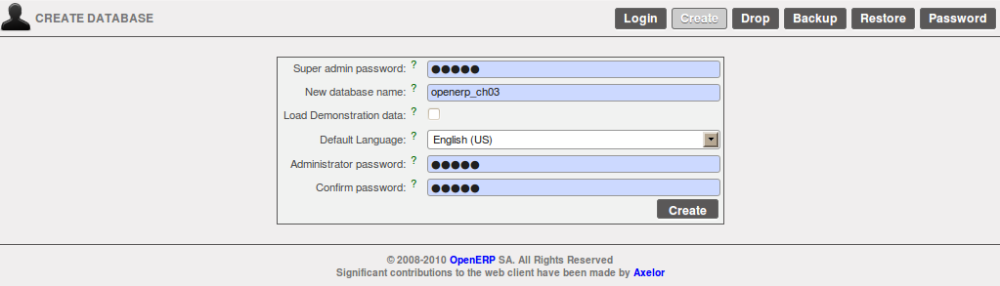
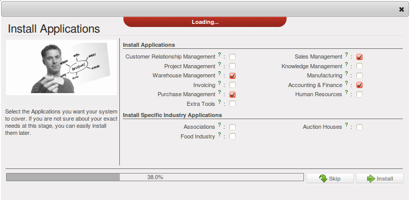
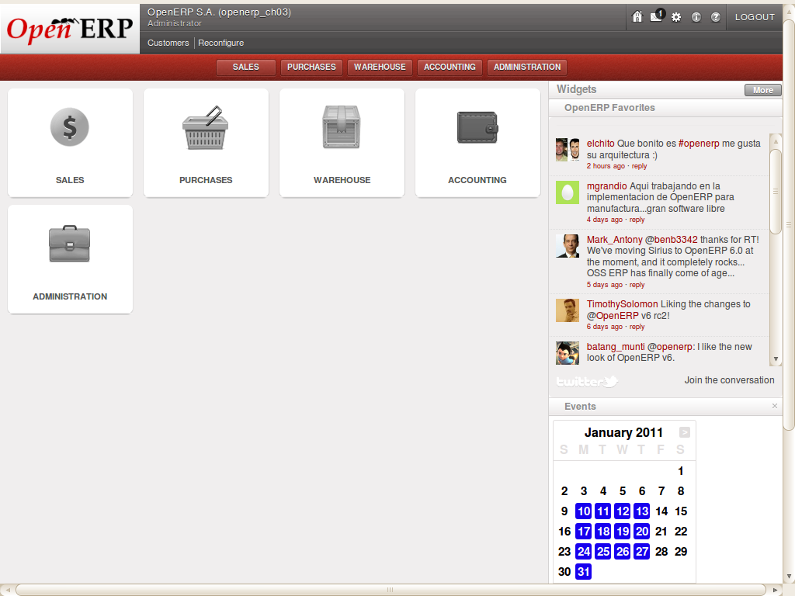

.. i18n: Business Example
.. i18n: ================
..

业务案例
================

.. i18n: In this example, you will configure a system that enables you to:
..

在本案例中,你要配置系统以达成以下目的:

.. i18n: * buy products from a supplier,
.. i18n: 
.. i18n: * stock the products in a warehouse,
.. i18n: 
.. i18n: * sell these products to a customer.
..

* 从供应商处购买产品,

* 在仓库中暂存产品,

* 将产品出售给客户.

.. i18n: The system should support all aspects of invoicing, payments to suppliers and receipts from
.. i18n: customers.
..

系统将完成发票到支付的各个业务.

.. i18n: Basic Settings
.. i18n: ==============
..

基本设置
==============

.. i18n: For this business case, you will have to model:
..

在本案例中, 你需要定义下面的这些数据:

.. i18n: * the suppliers and a supplier category,
.. i18n: 
.. i18n: * the customers and a customer category,
.. i18n: 
.. i18n: * some products and a product category,
.. i18n: 
.. i18n: * an inventory,
.. i18n: 
.. i18n: * a purchase order,
.. i18n: 
.. i18n: * a sales order,
.. i18n: 
.. i18n: * invoices,
.. i18n: 
.. i18n: * payments.
..

* 供应商以及该供应商的分类,

* 客户以及该客户的分类,

* 几个产品以及这些产品的分类定义,

* 一次盘点,

* 一张采购单,

* 一张销售单,

* 各种发票,

* 各种支付单.

.. i18n: To test the system, you will need at least one supplier, one customer, one product, a warehouse, a
.. i18n: minimal chart of accounts and a bank account.
..

要完成本次测试, 你需要创建至少一个 `供应商`, `客户`, `产品`, `仓库`, `财务科目表` 和 `银行帐号` .

.. i18n: Get your Database Up and Running without Demo Data
.. i18n: ==================================================
..

让你的数据库在没有演示数据的情况下运行起来
==========================================

.. i18n: Use the technique outlined in :ref:`sect-dbcreate` to create a new database, \ ``openerp_ch03``\  . This
.. i18n: database will be free of data and contain the least possible amount of functionality as a starting
.. i18n: point. You will need to know your super administrator password for this – or you will have to find
.. i18n: somebody who does have it to create this seed database. You will not be able to use the \
.. i18n: ``openerp_ch01``\   or \ ``openerp_ch02``\   databases that you might have created so far in this book
.. i18n: because they both contain demonstration data.
..

Use the technique outlined in :ref:`sect-dbcreate` to create a new database, \ ``openerp_ch03``\  . This
database will be free of data and contain the least possible amount of functionality as a starting
point. You will need to know your super administrator password for this – or you will have to find
somebody who does have it to create this seed database. You will not be able to use the \
``openerp_ch01``\   or \ ``openerp_ch02``\   databases that you might have created so far in this book
because they both contain demonstration data.

.. i18n: Start the database creation process from the :guilabel:`Welcome` page by clicking
.. i18n: :guilabel:`Databases` and then completing the following fields on the :guilabel:`Create Database` form, as shown in :ref:`fig-oech03`:
..

在新 :guilabel:`启动` 页面, 点击下面的 :guilabel:`管理帐套` 并在新窗体中点击 :guilabel:`创建帐套` 完成财套的新建操作. :ref:`fig-oech03` :

.. i18n: *  :guilabel:`Super admin password` : by default it is \ ``admin`` \, if you or your system
.. i18n:    administrator have not changed it,
.. i18n: 
.. i18n: *  :guilabel:`New database name` : \ ``openerp_ch03``\  ,
.. i18n: 
.. i18n: *  :guilabel:`Load Demonstration data` checkbox: \ ``not checked``\  (**this step is very important, but catches out many people**),
.. i18n: 
.. i18n: *  :guilabel:`Default Language` : \ ``English (US)``\  ,
.. i18n: 
.. i18n: *  :guilabel:`Administrator password` : \ ``admin``\  (because it is the easiest to remember at this stage, but obviously completely insecure),
.. i18n: 
.. i18n: *  :guilabel:`Confirm password` : \ ``admin``\  .
..

*  :guilabel:`超级管理员密码` : 默认密码为 \ ``admin`` \

*  :guilabel:`新帐套名称` : \ ``openerp_ch03``\  ,

*  :guilabel:`载入演示数据` 勾选框: \ ``不勾选``\  (**不勾选很重要, 很多人豆是这步搞错老.**),

*  :guilabel:`默认语言` : \ ``English (US)``\  ,

*  :guilabel:`管理员密码` : \ ``admin``\  (这个密码就是你后面登陆OpenERP的管理员密码,请牢记,并设置复杂一些),

*  :guilabel:`重复密码` : \ ``admin``\  .

.. i18n: .. _fig-oech03:
.. i18n: 
.. i18n: .. figure::  images/openerp_ch03.png
.. i18n:    :scale: 65
.. i18n:    :align: center
.. i18n: 
.. i18n:    *Creating a blank database*
..

.. _fig-oech03:

   *创建一个干净的帐套*

.. i18n: Then click :guilabel:`Create` to create the database and move to the setup screen :ref:`fig-oech03s1`.
..

在 :ref:`fig-oech03s1` 界面点击 :guilabel:`新建` 按钮.

.. i18n: .. _fig-oech03s1:
.. i18n: 
.. i18n: .. figure::  images/openerp_ch03_s1.png
.. i18n:    :scale: 75
.. i18n:    :align: center
.. i18n: 
.. i18n:    *Setting up a blank database - first screen*
..

.. _fig-oech03s1:

.. figure::  images/openerp_ch03_s1.png
   :scale: 75
   :align: center

   *新帐套配置从头开始 - 第一步*

.. i18n: After a short delay you are connected to the new \ ``openerp_ch03``\   database as user \ ``admin`` \
.. i18n: with the password you gave it. You will have to go through the Setup wizard in steps. You have two options:
..

After a short delay you are connected to the new \ ``openerp_ch03``\   database as user \ ``admin`` \
with the password you gave it. You will have to go through the Setup wizard in steps. You have two options:

.. i18n: 1. If you click the `Start Configuration` button, OpenERP guides you through a series of steps to: :guilabel:`Configure Your Interface` - proceed with the default ``Simplified`` (the other option is ``Extended``); and :guilabel:`Configure Your Company Information` - enter a :guilabel:`Company Name` and select a :guilabel:`Currency` for your company.
.. i18n: Then OpenERP helps you to install various applications with different functionalities through the following wizard as shown in figure :ref:`fig-oech03cfg` :
..

1. If you click the `Start Configuration` button, OpenERP guides you through a series of steps to: :guilabel:`Configure Your Interface` - proceed with the default ``Simplified`` (the other option is ``Extended``); and :guilabel:`Configure Your Company Information` - enter a :guilabel:`Company Name` and select a :guilabel:`Currency` for your company.
Then OpenERP helps you to install various applications with different functionalities through the following wizard as shown in figure :ref:`fig-oech03cfg` :

.. i18n: .. _fig-oech03cfg:
.. i18n: 
.. i18n: .. figure::  images/openerp_ch03_config.png
.. i18n:    :scale: 75
.. i18n:    :align: center
.. i18n: 
.. i18n:    *Configuring a database with other applications and functionality when you select Extended view option*
..

.. _fig-oech03cfg:

.. figure::  images/openerp_ch03_config.png
   :scale: 75
   :align: center

   *Configuring a database with other applications and functionality when you select Extended view option*

.. i18n: - OR -
.. i18n: 
.. i18n: 2. When you click the button `Skip Configuration Wizards`, you can have the screen as shown in screenshot :ref:`fig-oech03st`. Then you
.. i18n: can start working with this minimal database (we will not use this option here).
..

- 或者 -

2. 点击 `跳过向导` 进入页面 :ref:`fig-oech03st` , 你就可以开始使用这个最小化安装的帐套了.

.. i18n: .. _fig-oech03st:
.. i18n: 
.. i18n: .. figure::  images/openerp_ch03_start.png
.. i18n:    :scale: 65
.. i18n:    :align: center
.. i18n: 
.. i18n:    *Starting the minimal database*
..

.. _fig-oech03st:

.. figure::  images/openerp_ch03_start.png
   :scale: 65
   :align: center

   *Starting the minimal database*

.. i18n: Fit your Needs
.. i18n: ==============
..

满足你的需求
==============

.. i18n: Functional needs can be provided by core modules from OpenERP. You just have to decide which functionality
.. i18n: you want in your system. Click the `Check Box` of the corresponding application in the :ref:`fig-oech03cfsimp`.
..

Functional needs can be provided by core modules from OpenERP. You just have to decide which functionality
you want in your system. Click the `Check Box` of the corresponding application in the :ref:`fig-oech03cfsimp`.

.. i18n: .. index::
.. i18n:    single: module; product
.. i18n:    single: module; stock
.. i18n:    single: module; account
.. i18n:    single: module; purchase
.. i18n:    single: module; sale
..

.. index::
   single: module; product
   single: module; stock
   single: module; account
   single: module; purchase
   single: module; sale

.. i18n: For this instance, we need the following applications:
..

For this instance, we need the following applications:

.. i18n: * Warehouse Management (the :mod:`stock` module),
.. i18n: 
.. i18n: * Accounting & Finance (the :mod:`account` module),
.. i18n: 
.. i18n: * Purchase Management (the :mod:`purchase` module),
.. i18n: 
.. i18n: * Sales Management (the :mod:`sale` module).
..

* 仓库管理 ( :mod:`stock` 模块),

* 财务与会计 ( :mod:`account` 模块),

* 采购管理 ( :mod:`purchase` 模块),

* 销售管理 ( :mod:`sale` 模块).

.. i18n: To get OpenERP to install these business applications, the Configuration Wizard should look as follows:
..

To get OpenERP to install these business applications, the Configuration Wizard should look as follows:

.. i18n: .. _fig-oech03cfsimp:
.. i18n: 
.. i18n: .. figure:: images/openerp_feature.png
.. i18n:    :scale: 75
.. i18n:    :align: center
.. i18n: 
.. i18n:    *Configuration Wizard with the Simplified view option*
..

.. _fig-oech03cfsimp:

   *Configuration Wizard with the Simplified view option*

.. i18n: :guilabel:`Skip` the step that asks you to configure your Accounting Chart. OpenERP will now display the opening screen with all selected business applications installed.
..

在弹出配置会计一览表的时候, 点击 :guilabel:`跳过` 按钮. OpenERP 就进入默认已安装模块图标列表页面.

.. i18n: .. _fig-oech03cfgexample:
.. i18n: 
.. i18n: .. figure:: images/openerp_ch03_main.png
.. i18n:    :scale: 65
.. i18n:    :align: center
.. i18n: 
.. i18n:    *Database with all required functionality for this example*
..

.. _fig-oech03cfgexample:

   *Database with all required functionality for this example*

.. i18n: If you want to reconfigure your system, then click the `Reconfigure` link that appears in the header of :ref:`fig-oech03cfgexample`.
..

If you want to reconfigure your system, then click the `Reconfigure` link that appears in the header of :ref:`fig-oech03cfgexample`.

.. i18n: .. Copyright © Open Object Press. All rights reserved.
..

.. Copyright © Open Object Press. All rights reserved.

.. i18n: .. You may take electronic copy of this publication and distribute it if you don't
.. i18n: .. change the content. You can also print a copy to be read by yourself only.
..

.. You may take electronic copy of this publication and distribute it if you don't
.. change the content. You can also print a copy to be read by yourself only.

.. i18n: .. We have contracts with different publishers in different countries to sell and
.. i18n: .. distribute paper or electronic based versions of this book (translated or not)
.. i18n: .. in bookstores. This helps to distribute and promote the OpenERP product. It
.. i18n: .. also helps us to create incentives to pay contributors and authors using author
.. i18n: .. rights of these sales.
..

.. We have contracts with different publishers in different countries to sell and
.. distribute paper or electronic based versions of this book (translated or not)
.. in bookstores. This helps to distribute and promote the OpenERP product. It
.. also helps us to create incentives to pay contributors and authors using author
.. rights of these sales.

.. i18n: .. Due to this, grants to translate, modify or sell this book are strictly
.. i18n: .. forbidden, unless Tiny SPRL (representing Open Object Press) gives you a
.. i18n: .. written authorisation for this.
..

.. Due to this, grants to translate, modify or sell this book are strictly
.. forbidden, unless Tiny SPRL (representing Open Object Press) gives you a
.. written authorisation for this.

.. i18n: .. Many of the designations used by manufacturers and suppliers to distinguish their
.. i18n: .. products are claimed as trademarks. Where those designations appear in this book,
.. i18n: .. and Open Object Press was aware of a trademark claim, the designations have been
.. i18n: .. printed in initial capitals.
..

.. Many of the designations used by manufacturers and suppliers to distinguish their
.. products are claimed as trademarks. Where those designations appear in this book,
.. and Open Object Press was aware of a trademark claim, the designations have been
.. printed in initial capitals.

.. i18n: .. While every precaution has been taken in the preparation of this book, the publisher
.. i18n: .. and the authors assume no responsibility for errors or omissions, or for damages
.. i18n: .. resulting from the use of the information contained herein.
..

.. While every precaution has been taken in the preparation of this book, the publisher
.. and the authors assume no responsibility for errors or omissions, or for damages
.. resulting from the use of the information contained herein.

.. i18n: .. Published by Open Object Press, Grand Rosière, Belgium
..

.. Published by Open Object Press, Grand Rosière, Belgium
