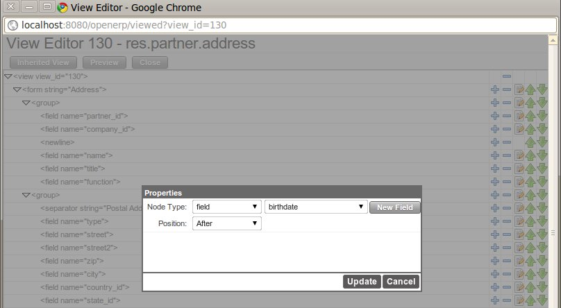
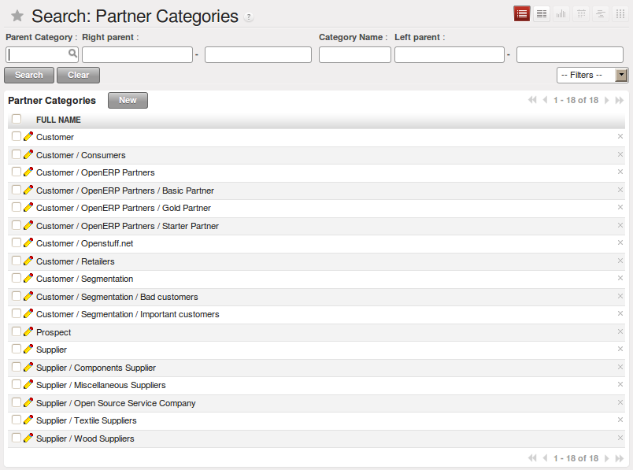
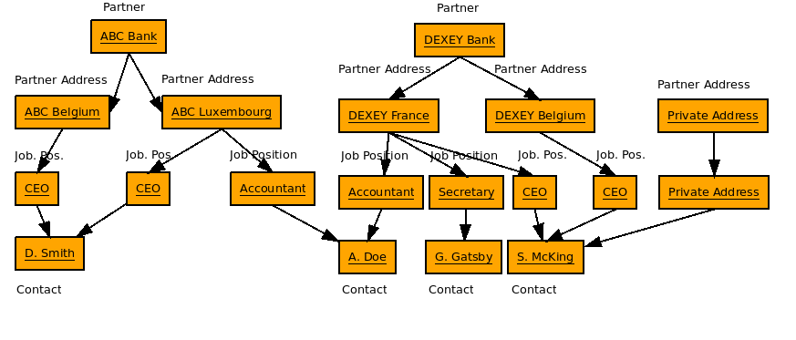
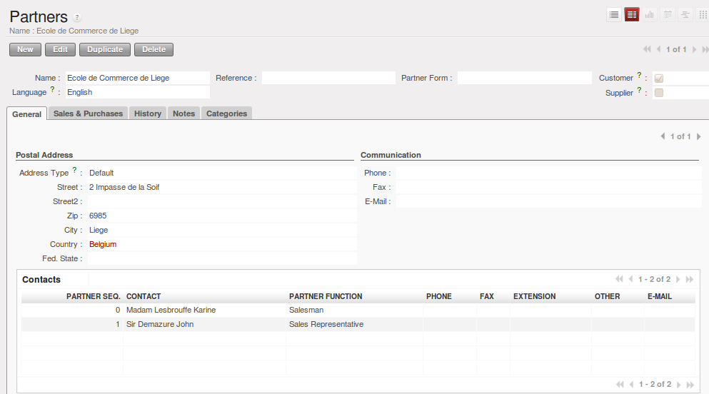
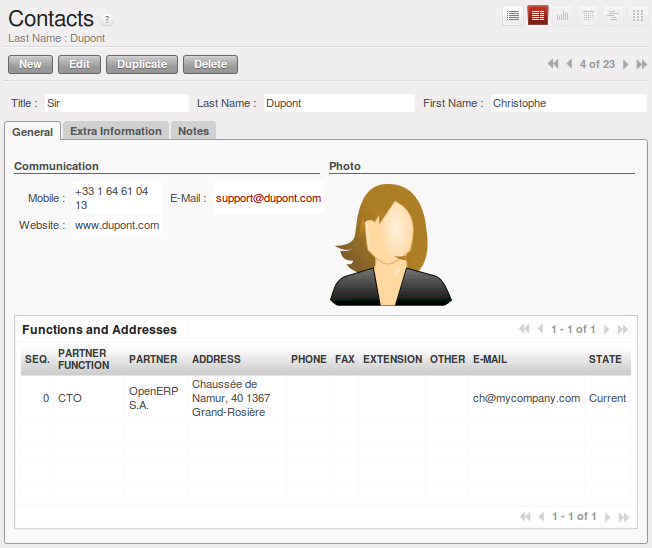

.. i18n: .. _part2-crm-cont:
.. i18n: 
.. i18n: Managing your Address Book
.. i18n: ==========================
..

.. _part2-crm-cont:

管理地址簿
==========================

.. i18n: .. index::
.. i18n:    single: Partner
.. i18n:    single: Customer
.. i18n:    single: Prospect
.. i18n:    single: Address
.. i18n:    single: Contact
..

.. index::
   single: Partner
   single: Customer
   single: Prospect
   single: Address
   single: Contact

.. i18n: What is the difference between a partner and a contact in OpenERP? A ``Partner`` represents an entity that you do business with - a customer, a prospect, or even an employee of your company. In other CRM applications, a partner is also referred to as an Account.
.. i18n: A ``Contact`` represents a person who works for a partner.
..

在OPENERP中，合作伙伴和联系人之间有什么区别呢？ ``合作伙伴`` 代表一个与你有业务来往的个体 - 客户, 潜在客户, 甚至你公司的
员工.在其他CRM软件中, 合作伙伴也称为一个账户.
``联系人`` 则代表合作伙伴中的个人.

.. i18n: Each partner can have an unlimited number of contacts. OpenERP also allows you to have several contacts with the same address type for one partner. You can easily link several Invoice addresses to a customer, for instance. 
..

每个合作伙伴可以有无数个联系人. Openerp同样允许一个合作伙伴有多个相同地址类型的联系人.比如，你可以轻松地链接多个开票地址
给一个客户. 

.. i18n: .. note:: Address Types
.. i18n: 
.. i18n: 	If you have recorded several contacts for the same partner, you can tell OpenERP which contact will be used in
.. i18n: 	various documents (e.g. a quotation) by specifying the ``Address Type``.
.. i18n: 
.. i18n: 	For example, a partner (*company*) can have a delivery address that differs from the company's invoice address.
.. i18n: 	If the Address Types are correctly assigned, OpenERP can automatically select the appropriate address
.. i18n: 	during the creation of the document – an invoice is addressed to the contact that has been assigned
.. i18n: 	the Address Type of Invoice, otherwise to the Default address.
..

.. note::  地址类型

	如果你已经为相同的合作伙伴登记了多个联系人, 你能够通过指定 ``地址类型`` 告诉 OpenERP 用于哪种文档用哪个联系人（例如报价单）。
	

	例如：, 合作伙伴(*公司*) 可以有一个发运地址以区别于公司的开票地址.
	如果地址类型被正确指定, OpenERP 在创建单据的时候，能自动选择合适的地址 ---- 发票地址被指派为 地址类型为 `发票` ，
	否则是默认地址。

.. i18n: The concept of a partner in OpenERP is much more flexible than in many other management applications. Why is that? Because a partner can be your supplier and your customer at the same time.
.. i18n: As a consequence, any data you update for that partner will apply to both customer and supplier! Thanks to this, you no longer need to update your address book several times (or even in several places) for the same partner.
..

OpenERP中合作伙伴的概念要比许多其他管理应用程序灵活得多. 为什么呢？? 因为合作伙伴可以同时是你的供应商和客户。
因此，你更新的任何数据将同时应用于客户和供应商! 多亏了这个,你不再需要为同样的合作伙伴更新您的地址簿几次(甚至在几个地方)。

.. i18n: The partner form contains information about the company, such as its corporate name, its primary language, and whether the company is a
.. i18n: \ ``Customer`` \ and/or a \ ``Supplier`` \. The partner form is composed of several tabs.
..

合作伙伴表单包括了关于公司的信息, 比如公司名称，主要语言，公司是 ``客户`` \ 和/或 \ ``供应商`` \. 
合作伙伴的表单由几个标签组成.

.. i18n: * the :guilabel:`General` tab contains information about different contacts of that partner, postal information,
.. i18n:   communication information and the categories the partner belongs to,
.. i18n: 
.. i18n: * the :guilabel:`Sales & Purchases` tab contains information such as the default salesman and sales team, and the website,
.. i18n: 
.. i18n: * the :menuselection:`History` tab gives visibility on the complete ``Communication History`` (meetings, marketing campaign activities,
.. i18n:   leads and opportunities, phone calls, emails) with the partner. The events the partner has been involved in are created automatically by
.. i18n:   different documents like phone calls, leads, meetings,
.. i18n: 
.. i18n: * the :menuselection:`Notes` tab is an area for free text notes.
..

* :guilabel:`一般` 标签包括了合作伙伴不同联系人的信息, 邮政，通信和合作伙伴属于的分类,

* :guilabel:`销售和采购` 标签包括了诸如默认销售员、销售团队等信息，以及网站,

* :menuselection:`日志` 标签提供了该合作伙伴相关的完整 ``通信日志`` (会议, 营销活动,
  线索和商机, 电话访问, emails) . The events the partner has been involved in are created automatically by
  different documents like phone calls, leads, meetings,

* the :menuselection:`Notes` tab is an area for free text notes.

.. i18n: .. figure::  images/crm_partner_hist.jpeg
.. i18n:    :scale: 100
.. i18n:    :align: center
.. i18n: 
.. i18n:    *The History Tab of a Customer*
..

.. figure::  images/crm_partner_hist.jpeg
   :scale: 100
   :align: center

   *The History Tab of a Customer*

.. i18n: Creating and Updating Partners
.. i18n: ------------------------------
..

创建和更新合作伙伴
------------------------------

.. i18n: Before explaining you how to create a partner, just a quick word on the different ways of representing partners in OpenERP.
.. i18n: `List` view shows a list of customers (the default representation when you click the Customers menu). In this view, you can see several customers at a time.
.. i18n: `Form` view is displayed when you click a specific customer to start editing or when you create a new customer.
..

在讲解如何创建合作伙伴之前，仅说两句OPENERP中合作伙伴不同的显示方式。
`列表` 视图显示客户列表(你点击客户菜单时的默认显示)。这种视图下，你可以同一时间查看到多个客户信息。
当你选择特定客户开始编辑，或者创建一个新客户时，则显示为 `表单` 视图。

.. i18n: To create a new partner (a company, customer, supplier, ...) or to display the list of existing customers, use the menu :menuselection:`Sales --> Address Book --> Customers`. This menu does not only allow you to create a new partner, but also to search for partners.
..

创建一个新的合作伙伴(公司，客户，供应商 ...) 或者打开已存在的客户列表, 使用菜单 :菜单选项:`销售 -->地址簿--> 客户`.这个菜单不仅可以创建新的合作伙伴，也可以用来查找合作伙伴.

.. i18n: .. figure::  images/crm_partner_default.jpeg
.. i18n:    :scale: 100
.. i18n:    :align: center
.. i18n: 
.. i18n:    *A Customer Form*
..

.. figure::  images/crm_partner_default.jpeg
   :scale: 100
   :align: center

   *客户表单*

.. i18n: .. note:: Mandatory 
.. i18n: 
.. i18n:         Blue fields are always mandatory, meaning that you have to enter a value there. It is impossible to save changes as long as a blue field is not completed.
..

.. note:: 必填项

        蓝色区域是必填项, 意思就是必须在这里输入一个值。只要蓝色区域没有填写完成，就不能保存这次修改。

.. i18n: You should at least enter the company's ``Name`` in the partner form. Some fields are text fields, other fields may be linked to existing data that have been entered elsewhere, such as ``Countries``. 
..

在合作伙伴表单上你至少要输入这个公司的 ``名字`` 。有些字段是文本字段，其他字段可能链接到别的地方已经填写过的数据, 比如 ``国家``。

.. i18n: Create a customer with the following data:
..

根据以下资料创建一个新的客户：

.. i18n: * :guilabel:`Name` : \ ``Smith and Offspring``\ ,
.. i18n: 
.. i18n: * :guilabel:`Customer` checkbox : \ ``checked``\ ,
.. i18n: 
.. i18n: * :guilabel:`Supplier` checkbox : \ ``unchecked``\ ,
.. i18n: 
.. i18n: * :guilabel:`Contact Name` : \ ``Stephen Smith``\ ,
.. i18n: 
.. i18n: * :guilabel:`Type` : \ ``Default``\, in the Postal Address section,
.. i18n: 
.. i18n: * :guilabel:`Save` the form.
..

* :guilabel:`名称` : \ ``Smith and Offspring``\ ,

* :guilabel:`客户` 选择框 : \ ``勾选``\ ,

* :guilabel:`供应商` 选择框 : \ ``不勾选``\ ,

* :guilabel:`联系人名称` : \ ``Stephen Smith``\ ,

* :guilabel:`类型` : \ ``默认``\, 在邮政地址部分，

* :guilabel:`保存` 这个表单。

.. i18n: .. tip:: Email
.. i18n: 
.. i18n:       If you use the email gateway, the Outlook or the Thunderbird plugin, do not forget to register an email addresses to each contact, so that the gateway will automatically attach incoming emails to the right partner.
..

.. tip:: 电子邮件

      如果你要使用Email网关，OUTLOOK或者迅雷插件, 请不要忘记给每一个联系人登记Email地址， 那么这个网关就会把自动地接收到的邮件附给对应的合作伙伴.

.. i18n: To update a partner, open the corresponding form, select `Edit` and change the required fields. As explained before, when a company is both one of your customers and a supplier, you just have to edit the partner form once to have changes applied to both customer and supplier.
..

更新合作伙伴信息， 打开对应的表单，选择`编辑`然后修改需要更新的字段。正如之前解释过的，当一个公司既是供应商又是客户时，你只需要编辑一次这个合作伙伴表单，就会自动应用到供应商和客户上。

.. i18n: .. note:: Checkboxes
.. i18n: 
.. i18n:        Why is it important for you to correctly set the Customer and Supplier checkboxes in the partner form? These checkboxes are designed to enable OpenERP to quickly select the partners who should be displayed in some drop-down boxes. An example: when you select a partner in a Sales Quotation, OpenERP will only allow you to select from the list of Customers. And that is precisely what the Customer checkbox is used for. 
..

.. note:: 选择框

      为什么说在合作伙伴表单中正确地设置客户和供应商的选择框是很重要的呢? 这些选择框的设计是为了能让Openerp快速的选择那些下拉框显示的合作伙伴。比如：当在一张销售报价单中你要选择一个合作伙伴时， Openerp只允许你在客户列表中选择.这正是客户选择框的用处。 

.. i18n: .. index:: Contact; Address
..

.. index:: Contact; Address

.. i18n: Managing your Contacts & Addresses
.. i18n: ----------------------------------
..

管理你的联系人和地址
----------------------------------

.. i18n: You can have several contacts for one partner. Contacts represent company employees that you are in
.. i18n: touch with, along with their address details. For each address you can indicate the type (\ ``Default``\, \ ``Invoice``\, \ ``Delivery``\, \ ``Contact``\   or \ ``Other``\).
..

You can have several contacts for one partner. Contacts represent company employees that you are in
touch with, along with their address details. For each address you can indicate the type (\ ``Default``\, \ ``Invoice``\, \ ``Delivery``\, \ ``Contact``\   or \ ``Other``\).

.. i18n: Contacts can be entered into the :guilabel:`General` tab of the **Customer** form, or from the list of addresses in the :menuselection:`Sales --> Address Book --> Addresses` menu.
..

Contacts can be entered into the :guilabel:`General` tab of the **Customer** form, or from the list of addresses in the :menuselection:`Sales --> Address Book --> Addresses` menu.

.. i18n: .. tip:: Same Contact, Different Partners 
.. i18n: 
.. i18n:       Do you have contacts who work for several companies, and need to be linked to several partners? Check out the :ref:`ch-contact` chapter.
..

.. tip:: Same Contact, Different Partners 

      Do you have contacts who work for several companies, and need to be linked to several partners? Check out the :ref:`ch-contact` chapter.

.. i18n: Customizing Partner Fields
.. i18n: --------------------------
..

定制合作伙伴字段
--------------------------

.. i18n: OpenERP also allows you to customize the ``Partner`` view to your needs. Click the `Manage Views` option if you want to add fields, delete fields or change the order of fields in a view.
..

OpenERP also allows you to customize the ``Partner`` view to your needs. Click the `Manage Views` option if you want to add fields, delete fields or change the order of fields in a view.

.. i18n: Let us add the ``Birthday`` field to a contact, in the `Addresses` form view. To do so, go to the :menuselection:`Sales -->
.. i18n: Address Book --> Addresses` menu and open any address in Form view. In the right menu bar, click `Manage Views`, then `Edit` because the corresponding view will already be preselected.
..

Let us add the ``Birthday`` field to a contact, in the `Addresses` form view. To do so, go to the :menuselection:`Sales -->
Address Book --> Addresses` menu and open any address in Form view. In the right menu bar, click `Manage Views`, then `Edit` because the corresponding view will already be preselected.

.. i18n: Go to the last line of the view and click the blue plus (+) sign to add a field to the `Communication` group. Proceed as in the figure below, then click the `Update` button.
..

Go to the last line of the view and click the blue plus (+) sign to add a field to the `Communication` group. Proceed as in the figure below, then click the `Update` button.

.. i18n: .. figure::  images/manage_views_addfield_small.jpeg
.. i18n:    :scale: 75
.. i18n:    :align: center
.. i18n: 
.. i18n:    *Add the Birthday Field for a Contact*
..

   *Add the Birthday Field for a Contact*

.. i18n: In the `Properties` screen that appears, you can change the label to ``Birthday`` in the ``String`` field. To indicate that a new field can be used in the corresponding search view, make sure to select ``Always Searchable``. Click the `Update` button to confirm your changes. Click `Preview` to see your result. The ``Birthday`` field will now appear in your `Address` form view, ready to be used.
..

In the `Properties` screen that appears, you can change the label to ``Birthday`` in the ``String`` field. To indicate that a new field can be used in the corresponding search view, make sure to select ``Always Searchable``. Click the `Update` button to confirm your changes. Click `Preview` to see your result. The ``Birthday`` field will now appear in your `Address` form view, ready to be used.

.. i18n: Performing Actions on Customers
.. i18n: -------------------------------
..

根据客户执行动作
-------------------------------

.. i18n: .. index::
.. i18n:    single: send SMS
.. i18n:    single: opportunity
.. i18n:    single: reminder
..

.. index::
   single: send SMS
   single: opportunity
   single: reminder

.. i18n: At the right side of the `Customers` list or form view, you will find a list of all of the reports, actions and links available for the selected partner(s). You can perform actions and print reports both from List and from Form view, List view allowing you to do actions for several partners at the same time.
..

At the right side of the `Customers` list or form view, you will find a list of all of the reports, actions and links available for the selected partner(s). You can perform actions and print reports both from List and from Form view, List view allowing you to do actions for several partners at the same time.

.. i18n: .. tip:: Actions
.. i18n: 
.. i18n:        To display the list of possible actions, just select one or more customers or click the arrow at the top of the right side bar. 
..

.. tip:: Actions

       To display the list of possible actions, just select one or more customers or click the arrow at the top of the right side bar. 

.. i18n: You can create a new opportunity for a customer, or start a mass mailing. Mass mailings will usually be started from list view, because you will select several partners at a time.
..

You can create a new opportunity for a customer, or start a mass mailing. Mass mailings will usually be started from list view, because you will select several partners at a time.

.. i18n: .. note:: Campaigns
.. i18n: 
.. i18n:         For mass mailings, you might prefer to use the Direct Marketing application, which offers great functionalities (please refer to chapter :ref:`part3-crm-market`).
..

.. note:: Campaigns

        For mass mailings, you might prefer to use the Direct Marketing application, which offers great functionalities (please refer to chapter :ref:`part3-crm-market`).

.. i18n: Another action enables you to quickly send an SMS message. 
..

Another action enables you to quickly send an SMS message. 

.. i18n: .. tip::  Send an SMS message
.. i18n: 
.. i18n: 	To send an SMS message from standard Open ERP you will have to place an order with the bulk SMS
.. i18n: 	gateway operator Clickatell™ http://clickatell.com.
.. i18n: 
.. i18n: 	To send an SMS message to a partner or a selection of several partners, first select the partners
.. i18n: 	in list view, then click the :guilabel:`SMS Send` Action icon.
..

.. tip::  Send an SMS message

	To send an SMS message from standard Open ERP you will have to place an order with the bulk SMS
	gateway operator Clickatell™ http://clickatell.com.

	To send an SMS message to a partner or a selection of several partners, first select the partners
	in list view, then click the :guilabel:`SMS Send` Action icon.

.. i18n: .. index:: Filter
..

.. index:: Filter

.. i18n: Finding your Partners using Filters
.. i18n: -----------------------------------
..

用过滤器查找合作伙伴
-----------------------------------

.. i18n: Open the `Customers` list view to discover the search options allowing you to easily filter your partners. You can group by ``Salesman`` to see which customers have already been assigned a salesman or not. Click the button at the right (the icon of the person) to see the customers you are responsible for.
..

Open the `Customers` list view to discover the search options allowing you to easily filter your partners. You can group by ``Salesman`` to see which customers have already been assigned a salesman or not. Click the button at the right (the icon of the person) to see the customers you are responsible for.

.. i18n: .. tip:: Limit
.. i18n: 
.. i18n:        If you want to display more than the 20 partners displayed by default, click the ``1 to 20 of - XX`` option at the bottom of the screen to be able to change the limit.
..

.. tip:: Limit

       If you want to display more than the 20 partners displayed by default, click the ``1 to 20 of - XX`` option at the bottom of the screen to be able to change the limit.

.. i18n: Filters also allow you to quickly set lists of customers for which you want to do specific actions. Through the ``New Filter`` option, you can also add your own filters for any field related to the ``Customer`` form.
..

Filters also allow you to quickly set lists of customers for which you want to do specific actions. Through the ``New Filter`` option, you can also add your own filters for any field related to the ``Customer`` form.

.. i18n: .. note:: Filters
.. i18n:         
.. i18n:        You can easily create your own frequently used filters by prefiltering the data the way you want and then using the Save Filter option.
..

.. note:: Filters
        
       You can easily create your own frequently used filters by prefiltering the data the way you want and then using the Save Filter option.

.. i18n: .. _partner-categ:
.. i18n: 
.. i18n: Categorizing your Partners
.. i18n: --------------------------
..

.. _partner-categ:

为合作伙伴分组
--------------------------

.. i18n: .. index::
.. i18n:    pair: partner; category
..

.. index::
   pair: partner; category

.. i18n: OpenERP uses categories to organize all of its partners according to their relationship with your company (customer, prospect, supplier, and so on). Each partner may be attached to several categories. To open the list of available partner categories, use the menu :menuselection:`Sales --> Configuration --> Address Book --> Partner Categories`.
..

OpenERP uses categories to organize all of its partners according to their relationship with your company (customer, prospect, supplier, and so on). Each partner may be attached to several categories. To open the list of available partner categories, use the menu :menuselection:`Sales --> Configuration --> Address Book --> Partner Categories`.

.. i18n: .. figure::  images/crm_partner_category_big.png
.. i18n:    :scale: 100
.. i18n:    :align: center
.. i18n: 
.. i18n:    *List of Partner Categories*
..

   *List of Partner Categories*

.. i18n: Click one of the categories in the partner category structure to get a list of the partners
.. i18n: in that category. If you click a category that has subcategories, you will get a list of all of the
.. i18n: partners in the main category and in all of its subcategories.
..

Click one of the categories in the partner category structure to get a list of the partners
in that category. If you click a category that has subcategories, you will get a list of all of the
partners in the main category and in all of its subcategories.

.. i18n: .. note:: Categories
.. i18n: 
.. i18n:         To create a new category, go to the menu :menuselection:`Sales --> Configuration --> Address Book --> Partner Categories` and click the `New` button.
..

.. note:: Categories

        To create a new category, go to the menu :menuselection:`Sales --> Configuration --> Address Book --> Partner Categories` and click the `New` button.

.. i18n: Because categories can be organized according to a tree structure, you can apply an action at any level of
.. i18n: the structure: a marketing promotion activity, for example, can be applied either to all customers,
.. i18n: or selectively only to customers in one category and its subcategories.
..

Because categories can be organized according to a tree structure, you can apply an action at any level of
the structure: a marketing promotion activity, for example, can be applied either to all customers,
or selectively only to customers in one category and its subcategories.

.. i18n: You can create your own categories and assign them to your partner from the `Customer` form. Another way of assigning the corresponding partner to a category is to open the category from the `Partner Categories`.
..

You can create your own categories and assign them to your partner from the `Customer` form. Another way of assigning the corresponding partner to a category is to open the category from the `Partner Categories`.

.. i18n: In the :ref:`profiling` chapter, you will see how to assign partners to categories automatically using segmentation rules.
..

In the :ref:`profiling` chapter, you will see how to assign partners to categories automatically using segmentation rules.

.. i18n: .. _ch-contact:
.. i18n: 
.. i18n: An Alternative to Manage your Contacts
.. i18n: --------------------------------------
..

.. _ch-contact:

一个管理联系人的替代方案
--------------------------------------

.. i18n: According to your kind of business, the standard way of linking several contacts to one partner may not be flexible enough for you. You could perfectly well have the same employees working for several of your companies. Or maybe you work with representatives ensuring follow up of several of your customers. So you would want to have the same contact linked to different partners.
..

According to your kind of business, the standard way of linking several contacts to one partner may not be flexible enough for you. You could perfectly well have the same employees working for several of your companies. Or maybe you work with representatives ensuring follow up of several of your customers. So you would want to have the same contact linked to different partners.

.. i18n: Of course, OpenERP provides an alternative, the :mod:`base_contact` module, which gives you even more flexibility in managing your contacts.
..

Of course, OpenERP provides an alternative, the :mod:`base_contact` module, which gives you even more flexibility in managing your contacts.

.. i18n: Easily share the same contact (an employee, for instance), who may perfectly have different jobs, with several partners. You only need to enter (or *create*) the contact once and link it to the partners concerned, while specifying the position the contact holds for each company in particular. Any changes to contact information only need to be made once for them to be applied to all partners the contact is related to!
..

Easily share the same contact (an employee, for instance), who may perfectly have different jobs, with several partners. You only need to enter (or *create*) the contact once and link it to the partners concerned, while specifying the position the contact holds for each company in particular. Any changes to contact information only need to be made once for them to be applied to all partners the contact is related to!

.. i18n: We illustrate the concept of multiple relationships between contacts and partners (companies) through an example. The figure :ref:`fig-crmconw` shows two companies having several addresses (places of business) and several contacts attached to these addresses.
..

We illustrate the concept of multiple relationships between contacts and partners (companies) through an example. The figure :ref:`fig-crmconw` shows two companies having several addresses (places of business) and several contacts attached to these addresses.

.. i18n: In this example you will find the following elements:
..

In this example you will find the following elements:

.. i18n: * The ABC bank has two places of business, represented by the addresses of ABC Belgium and ABC
.. i18n:   Luxembourg,
.. i18n: 
.. i18n: * The addresses of Dexey France and Dexey Belgium belong to the Dexey company,
.. i18n: 
.. i18n: * At the office of ABC Luxembourg, you have the contacts of the director (D. Smith) and the
.. i18n:   accountant (A. Doe),
.. i18n: 
.. i18n: * Mr Doe holds the post of accountant for ABC Luxembourg and Dexey France,
.. i18n: 
.. i18n: * Mr D. Smith is director of Dexey France and Dexey Belgium and we also have his private address
.. i18n:   which is not attached to a partner.
..

* The ABC bank has two places of business, represented by the addresses of ABC Belgium and ABC
  Luxembourg,

* The addresses of Dexey France and Dexey Belgium belong to the Dexey company,

* At the office of ABC Luxembourg, you have the contacts of the director (D. Smith) and the
  accountant (A. Doe),

* Mr Doe holds the post of accountant for ABC Luxembourg and Dexey France,

* Mr D. Smith is director of Dexey France and Dexey Belgium and we also have his private address
  which is not attached to a partner.

.. i18n: An extra menu option will be added, allowing you to display the list of contacts, through :menuselection:`Sales --> Address Book --> Contacts`.
..

An extra menu option will be added, allowing you to display the list of contacts, through :menuselection:`Sales --> Address Book --> Contacts`.

.. i18n: The screenshot below illustrates how contacts are handled with the advanced Contacts configuration.
..

The screenshot below illustrates how contacts are handled with the advanced Contacts configuration.

.. i18n: .. _fig-crmconw:
.. i18n: 
.. i18n: .. figure:: images/crm_contact_with_latest.png
.. i18n:    :scale: 100
.. i18n: 
.. i18n:    *Advanced Contact Management*
..

.. _fig-crmconw:

   *Advanced Contact Management*

.. i18n: This is a clear way to illustrate the complexities that may be accomplished in OpenERP.
..

This is a clear way to illustrate the complexities that may be accomplished in OpenERP.

.. i18n: If you correct or change a contact name in the contact form, the changes will be applied to all the posts occupied in the different companies.
..

If you correct or change a contact name in the contact form, the changes will be applied to all the posts occupied in the different companies.

.. i18n: The screen below represents a partner form. You can add several addresses, such as Invoice & Delivery, and a list of
.. i18n: contacts per address. Each contact has its own data, such as name, function, phone number and email.
..

The screen below represents a partner form. You can add several addresses, such as Invoice & Delivery, and a list of
contacts per address. Each contact has its own data, such as name, function, phone number and email.

.. i18n: .. figure:: images/crm_base_contacts.png
.. i18n:    :scale: 80
.. i18n:    :align: center
.. i18n: 
.. i18n:    *Partner Form with the Advanced Contacts Management*
..

   *Partner Form with the Advanced Contacts Management*

.. i18n: Go to :menuselection:`Sales --> Address Book --> Contacts` to open a contact form.
.. i18n: You enter data in the contact form, containing information such as mobile phone, different functions occupied, and personal blog. You can also add a photo of your contact.
.. i18n: If you click the `Functions and Addresses` line, you will get more details about the job (such as start date, end date and fax).
..

Go to :menuselection:`Sales --> Address Book --> Contacts` to open a contact form.
You enter data in the contact form, containing information such as mobile phone, different functions occupied, and personal blog. You can also add a photo of your contact.
If you click the `Functions and Addresses` line, you will get more details about the job (such as start date, end date and fax).

.. i18n: .. figure:: images/crm_partner_poste.png
.. i18n:    :scale: 100
.. i18n:    :align: center
.. i18n: 
.. i18n:    *Detail of a Position occupied by a Contact at a Partner*
..

   *Detail of a Position occupied by a Contact at a Partner*

.. i18n: .. Copyright © Open Object Press. All rights reserved.
..

.. Copyright © Open Object Press. All rights reserved.

.. i18n: .. You may take electronic copy of this publication and distribute it if you don't
.. i18n: .. change the content. You can also print a copy to be read by yourself only.
..

.. You may take electronic copy of this publication and distribute it if you don't
.. change the content. You can also print a copy to be read by yourself only.

.. i18n: .. We have contracts with different publishers in different countries to sell and
.. i18n: .. distribute paper or electronic based versions of this book (translated or not)
.. i18n: .. in bookstores. This helps to distribute and promote the OpenERP product. It
.. i18n: .. also helps us to create incentives to pay contributors and authors using author
.. i18n: .. rights of these sales.
..

.. We have contracts with different publishers in different countries to sell and
.. distribute paper or electronic based versions of this book (translated or not)
.. in bookstores. This helps to distribute and promote the OpenERP product. It
.. also helps us to create incentives to pay contributors and authors using author
.. rights of these sales.

.. i18n: .. Due to this, grants to translate, modify or sell this book are strictly
.. i18n: .. forbidden, unless Tiny SPRL (representing Open Object Press) gives you a
.. i18n: .. written authorisation for this.
..

.. Due to this, grants to translate, modify or sell this book are strictly
.. forbidden, unless Tiny SPRL (representing Open Object Press) gives you a
.. written authorisation for this.

.. i18n: .. Many of the designations used by manufacturers and suppliers to distinguish their
.. i18n: .. products are claimed as trademarks. Where those designations appear in this book,
.. i18n: .. and Open Object Press was aware of a trademark claim, the designations have been
.. i18n: .. printed in initial capitals.
..

.. Many of the designations used by manufacturers and suppliers to distinguish their
.. products are claimed as trademarks. Where those designations appear in this book,
.. and Open Object Press was aware of a trademark claim, the designations have been
.. printed in initial capitals.

.. i18n: .. While every precaution has been taken in the preparation of this book, the publisher
.. i18n: .. and the authors assume no responsibility for errors or omissions, or for damages
.. i18n: .. resulting from the use of the information contained herein.
..

.. While every precaution has been taken in the preparation of this book, the publisher
.. and the authors assume no responsibility for errors or omissions, or for damages
.. resulting from the use of the information contained herein.

.. i18n: .. Published by Open Object Press, Grand Rosière, Belgium
..

.. Published by Open Object Press, Grand Rosière, Belgium
