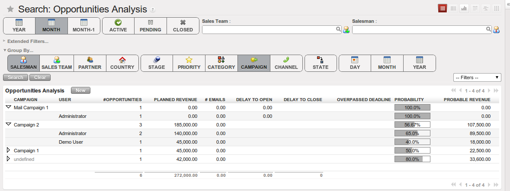
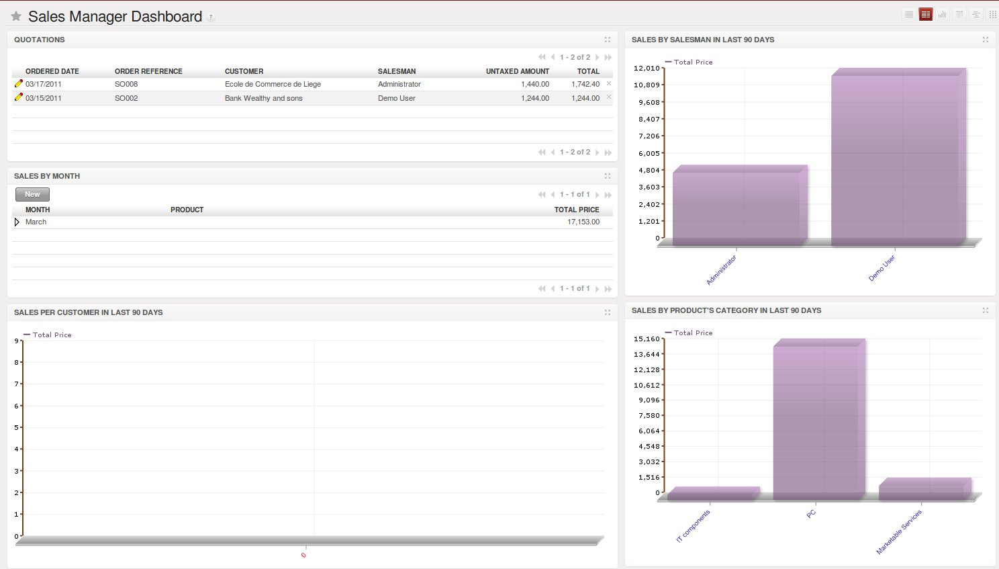
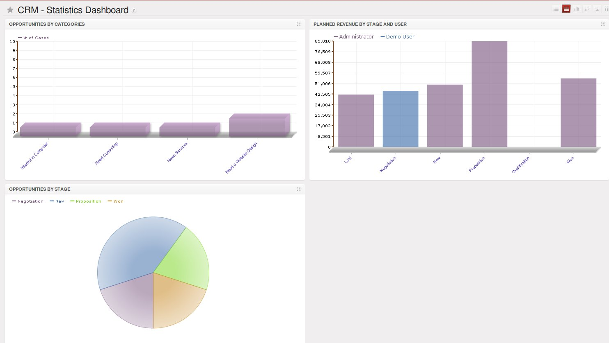

.. i18n: .. _part2-crm-reporting:
.. i18n: 
.. i18n: Analysing your Sales Performance
.. i18n: ================================
..

.. _part2-crm-reporting:

Analysing your Sales Performance
================================

.. i18n: Organizing Sales Funnel Reviews
.. i18n: -------------------------------
..

Organizing Sales Funnel Reviews
-------------------------------

.. i18n: Through the **Opportunities Analysis**, :menuselection:`Sales --> Reporting`, you can keep track of your sales funnel. The analysis report gives you instant access to your opportunities displaying information such as expected revenue, planned cost, missed deadlines or the number of interactions per opportunity. This report is perfect for the Sales Manager to periodically review the sales pipeline with the salesteams concerned.
..

Through the **Opportunities Analysis**, :menuselection:`Sales --> Reporting`, you can keep track of your sales funnel. The analysis report gives you instant access to your opportunities displaying information such as expected revenue, planned cost, missed deadlines or the number of interactions per opportunity. This report is perfect for the Sales Manager to periodically review the sales pipeline with the salesteams concerned.

.. i18n: .. figure::  images/opport_analysis.jpeg
.. i18n:    :scale: 80
.. i18n:    :align: center
.. i18n: 
.. i18n:    *Sales Funnel Review*
..

.. figure::  images/opport_analysis.jpeg
   :scale: 80
   :align: center

   *Sales Funnel Review*

.. i18n: The powerful `Advanced Search View` allows you to customize your analysis reports by using Extended Filters and Group by features.
..

The powerful `Advanced Search View` allows you to customize your analysis reports by using Extended Filters and Group by features.

.. i18n: With Extended filters, you can select specific options to filter your opportunities. For example, when you select a partner here, only opportunities related to that specific partner will be displayed.
..

With Extended filters, you can select specific options to filter your opportunities. For example, when you select a partner here, only opportunities related to that specific partner will be displayed.

.. i18n: You can also filter the information of an opportunity according to the `Group by` features. 
.. i18n: Suppose you want to analyse your opportunities by campaign and by salesman. When you open the **Opportunities Analysis** screen, you will notice that the opportunities are by default grouped by salesman (see `Salesman` button in the Group by area).
..

You can also filter the information of an opportunity according to the `Group by` features. 
Suppose you want to analyse your opportunities by campaign and by salesman. When you open the **Opportunities Analysis** screen, you will notice that the opportunities are by default grouped by salesman (see `Salesman` button in the Group by area).

.. i18n: Since you want to group by `Campaign` first, click the `Salesman` button to unselect it. Just click the `Campaign` button, then click `Salesman` to get the report you want.
..

Since you want to group by `Campaign` first, click the `Salesman` button to unselect it. Just click the `Campaign` button, then click `Salesman` to get the report you want.

.. i18n: .. figure:: images/filter_opport_analysis.png
.. i18n:    :scale: 100
.. i18n:    :align: center
.. i18n: 
.. i18n:    *Opportunities Analysis*
..

   *Opportunities Analysis*

.. i18n: Some examples of how you could use the **Opportunities Analysis** report to analyse your opportunities in various ways.
..

Some examples of how you could use the **Opportunities Analysis** report to analyse your opportunities in various ways.

.. i18n: * 1. Customers with Open Opportunities:
..

* 1. Customers with Open Opportunities:

.. i18n:         Group by Partner, click the Active button to provide a list with the customer names and the number of draft / open opportunities.
..

        Group by Partner, click the Active button to provide a list with the customer names and the number of draft / open opportunities.

.. i18n: * 2. Closed Opportunities:
..

* 2. Closed Opportunities:

.. i18n:         Click the `Closed` button, then group by `State`, then by `Stage` to display a list of closed opportunities divided by stage (lost and won).
..

        Click the `Closed` button, then group by `State`, then by `Stage` to display a list of closed opportunities divided by stage (lost and won).

.. i18n: * 3. Opportunity Sources:
..

* 3. Opportunity Sources:

.. i18n:         The number of opportunities can be displayed by closing date and sales stage, including expected revenue. Select only the Closed opportunities, group by Date button, then by Stage to obtain this view. 
..

        The number of opportunities can be displayed by closing date and sales stage, including expected revenue. Select only the Closed opportunities, group by Date button, then by Stage to obtain this view. 

.. i18n: * 4. Opportunity Pipeline:
..

* 4. Opportunity Pipeline:

.. i18n:         To get an idea of what your salesman's pipeline is like (or sales team), including the expected sales volume, click the Active button and group by Salesman (or Sales Team).
..

        To get an idea of what your salesman's pipeline is like (or sales team), including the expected sales volume, click the Active button and group by Salesman (or Sales Team).

.. i18n: * 5. Opportunities by Category:
..

* 5. Opportunities by Category:

.. i18n:         Click the `Graph` button in the Opportunities screen to display the report as a Graph.
..

        Click the `Graph` button in the Opportunities screen to display the report as a Graph.

.. i18n: .. tip:: Graph
.. i18n: 
.. i18n:       You can also display the **Opportunities Analysis** screen as a graph.   
..

.. tip:: Graph

      You can also display the **Opportunities Analysis** screen as a graph.   

.. i18n: Sales Forecast & Sales Dashboards
.. i18n: ---------------------------------
..

Sales Forecast & Sales Dashboards
---------------------------------

.. i18n: OpenERP dashboards are dynamic and allow you to edit or drill-down. Dashboards may be composed of several view types, such as List, Form, Graph view.
..

OpenERP dashboards are dynamic and allow you to edit or drill-down. Dashboards may be composed of several view types, such as List, Form, Graph view.

.. i18n: When you click the `Sales` button in the web version (to open the business application, so in the top bar), automatically the `Sales Dashboard` will appear. You can also access this dashboard from the :menuselection:`Sales --> Reporting --> Dashboard`. This dashboard gives you more information about your own sales activities, such as your Open Opportunities and your Quotations. This dashboard is prefiltered according to the OpenERP user who opens it. 
.. i18n: Each user can also choose a dashboard that will be opened when he starts OpenERP.
..

When you click the `Sales` button in the web version (to open the business application, so in the top bar), automatically the `Sales Dashboard` will appear. You can also access this dashboard from the :menuselection:`Sales --> Reporting --> Dashboard`. This dashboard gives you more information about your own sales activities, such as your Open Opportunities and your Quotations. This dashboard is prefiltered according to the OpenERP user who opens it. 
Each user can also choose a dashboard that will be opened when he starts OpenERP.

.. i18n: .. figure::  images/sales_board.jpeg
.. i18n:    :scale: 80
.. i18n:    :align: center
.. i18n: 
.. i18n:    *Sales Dashboard*
..

.. figure::  images/sales_board.jpeg
   :scale: 80
   :align: center

   *Sales Dashboard*

.. i18n: The `Sales Manager Dashboard` is a powerful tool to have an overview of quotations, sales by month, sales per customer, per salesman or per product in the last 90 days.
..

The `Sales Manager Dashboard` is a powerful tool to have an overview of quotations, sales by month, sales per customer, per salesman or per product in the last 90 days.

.. i18n: .. figure::  images/sales_mgr_board.jpeg
.. i18n:    :scale: 80
.. i18n:    :align: center
.. i18n: 
.. i18n:    *Sales Manager Dashboard*
..

   *Sales Manager Dashboard*

.. i18n: The `Statistics Dashboard` shows the Opportunities by Category and by Stage, as well as the planned revenue per stage and user. Clicking one of the stages in the graph will allow you to drill down to the details of such an opportunity. So no need to go through several screens to find what you need.
..

The `Statistics Dashboard` shows the Opportunities by Category and by Stage, as well as the planned revenue per stage and user. Clicking one of the stages in the graph will allow you to drill down to the details of such an opportunity. So no need to go through several screens to find what you need.

.. i18n: .. figure::  images/sales_stat_board.jpeg
.. i18n:    :scale: 80
.. i18n:    :align: center
.. i18n: 
.. i18n:    *Statistics Dashboard*
..

   *Statistics Dashboard*

.. i18n: .. Copyright © Open Object Press. All rights reserved.
..

.. Copyright © Open Object Press. All rights reserved.

.. i18n: .. You may take electronic copy of this publication and distribute it if you don't
.. i18n: .. change the content. You can also print a copy to be read by yourself only.
..

.. You may take electronic copy of this publication and distribute it if you don't
.. change the content. You can also print a copy to be read by yourself only.

.. i18n: .. We have contracts with different publishers in different countries to sell and
.. i18n: .. distribute paper or electronic based versions of this book (translated or not)
.. i18n: .. in bookstores. This helps to distribute and promote the OpenERP product. It
.. i18n: .. also helps us to create incentives to pay contributors and authors using author
.. i18n: .. rights of these sales.
..

.. We have contracts with different publishers in different countries to sell and
.. distribute paper or electronic based versions of this book (translated or not)
.. in bookstores. This helps to distribute and promote the OpenERP product. It
.. also helps us to create incentives to pay contributors and authors using author
.. rights of these sales.

.. i18n: .. Due to this, grants to translate, modify or sell this book are strictly
.. i18n: .. forbidden, unless Tiny SPRL (representing Open Object Press) gives you a
.. i18n: .. written authorisation for this.
..

.. Due to this, grants to translate, modify or sell this book are strictly
.. forbidden, unless Tiny SPRL (representing Open Object Press) gives you a
.. written authorisation for this.

.. i18n: .. Many of the designations used by manufacturers and suppliers to distinguish their
.. i18n: .. products are claimed as trademarks. Where those designations appear in this book,
.. i18n: .. and Open Object Press was aware of a trademark claim, the designations have been
.. i18n: .. printed in initial capitals.
..

.. Many of the designations used by manufacturers and suppliers to distinguish their
.. products are claimed as trademarks. Where those designations appear in this book,
.. and Open Object Press was aware of a trademark claim, the designations have been
.. printed in initial capitals.

.. i18n: .. While every precaution has been taken in the preparation of this book, the publisher
.. i18n: .. and the authors assume no responsibility for errors or omissions, or for damages
.. i18n: .. resulting from the use of the information contained herein.
..

.. While every precaution has been taken in the preparation of this book, the publisher
.. and the authors assume no responsibility for errors or omissions, or for damages
.. resulting from the use of the information contained herein.

.. i18n: .. Published by Open Object Press, Grand Rosière, Belgium
..

.. Published by Open Object Press, Grand Rosière, Belgium
