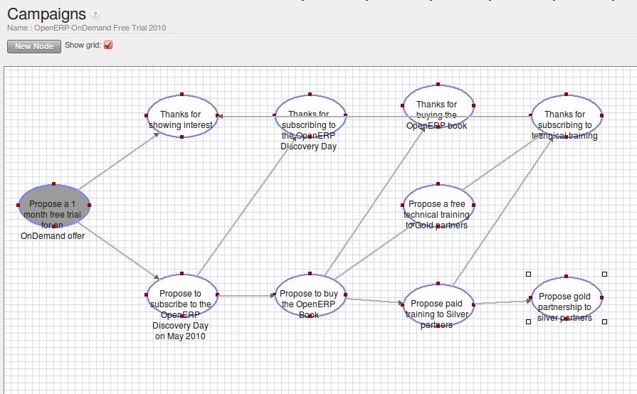
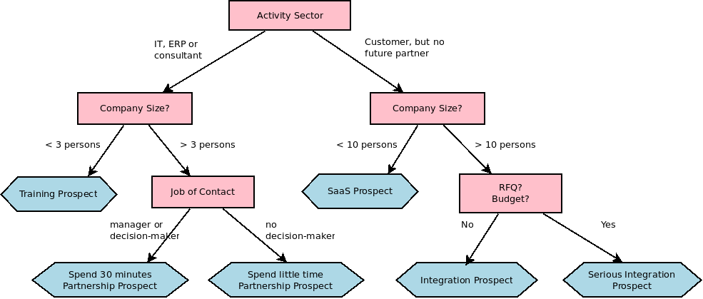

.. i18n: .. _part3-crm-market:
.. i18n: 
.. i18n: ################################
.. i18n: Driving your Marketing Campaigns
.. i18n: ################################
..

.. _part3-crm-market:

################################
开展营销活动
################################

.. i18n: .. index::
.. i18n:    single: Actions
.. i18n:    single: Activity
.. i18n:    single: Workflow
.. i18n:    single: Object
.. i18n:    single: Criteria
.. i18n:    single: Conditions
.. i18n:    single: Workitem
.. i18n:    single: Startflag
.. i18n:    single: Boolean
.. i18n:    single: Dot Notation
.. i18n:    single: Attributes
.. i18n:    single: Marketing
.. i18n:    single: Campaigns
..

.. index::
   single: Actions
   single: Activity
   single: Workflow
   single: Object
   single: Criteria
   single: Conditions
   single: Workitem
   single: Startflag
   single: Boolean
   single: Dot Notation
   single: Attributes
   single: Marketing
   single: Campaigns

.. i18n: .. _ch-market:
.. i18n: 
.. i18n: Lead Automation with Marketing Campaigns
.. i18n: ========================================
..

.. _ch-market:

利用营销活动实现线索自动化
========================================

.. i18n: OpenERP offers a set of modules allowing you to easily create and track your Marketing Campaigns.
.. i18n: With the **Marketing** application, you define your direct marketing campaigns, allowing you to automate your lead communication. You can install the module through the Reconfigure wizard, then select Marketing.
..

OpenERP offers a set of modules allowing you to easily create and track your Marketing Campaigns.
With the **Marketing** application, you define your direct marketing campaigns, allowing you to automate your lead communication. You can install the module through the Reconfigure wizard, then select Marketing.

.. i18n: Campaigns can be displayed in List or Diagram view. The Diagram view allows you to clearly see the marketing actions (represented by a node) and the applied conditions (represented by an arrow).
..

Campaigns can be displayed in List or Diagram view. The Diagram view allows you to clearly see the marketing actions (represented by a node) and the applied conditions (represented by an arrow).

.. i18n: .. figure::  images/market_diagram.jpeg
.. i18n:    :scale: 100
.. i18n:    :align: center
.. i18n: 
.. i18n:    *Diagram View of a Campaign*
..

   *Diagram View of a Campaign*

.. i18n: A marketing campaign is an event or an activity that will help you manage and reach your partners with specific messages. A campaign can have many activities that will be triggered from a specific situation, for instance a response from a contact to an email you sent. The result of such a response (action) could be the sending of an email, for which a template has previously been created in OpenERP.
..

A marketing campaign is an event or an activity that will help you manage and reach your partners with specific messages. A campaign can have many activities that will be triggered from a specific situation, for instance a response from a contact to an email you sent. The result of such a response (action) could be the sending of an email, for which a template has previously been created in OpenERP.

.. i18n: To use the email functionality, you have to configure your email account. This is explained in the chapter :ref:`ch-crm-fetchmail-install`.
..

To use the email functionality, you have to configure your email account. This is explained in the chapter :ref:`ch-crm-fetchmail-install`.

.. i18n: Example of a Complete Marketing Campaign
.. i18n: ----------------------------------------
..

一个完整的市场营销活动例子
----------------------------------------

.. i18n: Suppose we are an insurance company that wants to launch a marketing campaign to generate new leads. The company launches a campaign on its website and proposes potential customers to get a free offer for their car insurance.
..

Suppose we are an insurance company that wants to launch a marketing campaign to generate new leads. The company launches a campaign on its website and proposes potential customers to get a free offer for their car insurance.

.. i18n: Each time a customer registers himself through the contact form, a lead is created in OpenERP. For further information about web contact forms, please refer to the chapter :ref:`contform`.
..

Each time a customer registers himself through the contact form, a lead is created in OpenERP. For further information about web contact forms, please refer to the chapter :ref:`contform`.

.. i18n: The salesperson responsible for Car Insurances triggers the marketing campaign by sending an introductory email of all the insurance services we offer and thanking for subscribing for the free Car Insurance Offer.
..

The salesperson responsible for Car Insurances triggers the marketing campaign by sending an introductory email of all the insurance services we offer and thanking for subscribing for the free Car Insurance Offer.

.. i18n: Based on the response, the insurance company plots whether the lead is interested in:
..

Based on the response, the insurance company plots whether the lead is interested in:

.. i18n: * Buying a Car Insurance,
.. i18n: 
.. i18n: * Information about other Insurance policies,
.. i18n: 
.. i18n: * Buying the book about Keeping your Children Safe.
..

* Buying a Car Insurance,

* Information about other Insurance policies,

* Buying the book about Keeping your Children Safe.

.. i18n: According to the replies we receive from the leads, we send an email catering their respective needs.
..

According to the replies we receive from the leads, we send an email catering their respective needs.

.. i18n: * If they respond back to such an email, the lead is converted into an opportunity. When the lead buys a car insurance, the lead becomes our partner and is created as a customer in OpenERP.
.. i18n: 
.. i18n: * If we do not receive an answer, they get a reminder regarding the offer a week later. If they still do not answer, our salesperson gives a voluntary call to ask about their needs. 
..

* If they respond back to such an email, the lead is converted into an opportunity. When the lead buys a car insurance, the lead becomes our partner and is created as a customer in OpenERP.

* If we do not receive an answer, they get a reminder regarding the offer a week later. If they still do not answer, our salesperson gives a voluntary call to ask about their needs. 

.. i18n: See it as a flowchart allowing us to trigger a respective activity for every possible cue. The chances of leads going unattended become very low, and for every lead, we have a predefined method of handling it.
..

See it as a flowchart allowing us to trigger a respective activity for every possible cue. The chances of leads going unattended become very low, and for every lead, we have a predefined method of handling it.

.. i18n: Moreover, we can measure the method according to our goals. Based on the goals we can evaluate the effectiveness of our campaign and analyze whether there is room for improvement.
..

Moreover, we can measure the method according to our goals. Based on the goals we can evaluate the effectiveness of our campaign and analyze whether there is room for improvement.

.. i18n: .. tip:: Campaign Example
.. i18n: 
.. i18n:         To a get an example of a complete campaign in OpenERP, you can install the :mod:`marketing_campaign_crm_demo` module.
..

.. tip:: Campaign Example

        To a get an example of a complete campaign in OpenERP, you can install the :mod:`marketing_campaign_crm_demo` module.

.. i18n: Designing your Campaigns
.. i18n: ------------------------
..

定义营销活动
------------------------

.. i18n: Designing a marketing campaign is mostly a long term process and the success of any campaign depends on the research and the effectiveness in selecting your target audience for the campaign. There are certain questions that every marketeer always asks while designing a campaign.
..

Designing a marketing campaign is mostly a long term process and the success of any campaign depends on the research and the effectiveness in selecting your target audience for the campaign. There are certain questions that every marketeer always asks while designing a campaign.

.. i18n: * What would be our marketing campaign?
.. i18n: 
.. i18n: * Who would be the target audience?
.. i18n: 
.. i18n: * How would we measure the effectiveness of our campaign?
.. i18n:  
.. i18n: The OpenERP campaign is based on the principle of *lead automation*. A lead is created according to a specific response by a customer towards a stimulus. An example: filling the car insurance calculator on your website may create a lead in OpenERP.
..

* What would be our marketing campaign?

* Who would be the target audience?

* How would we measure the effectiveness of our campaign?
 
The OpenERP campaign is based on the principle of *lead automation*. A lead is created according to a specific response by a customer towards a stimulus. An example: filling the car insurance calculator on your website may create a lead in OpenERP.

.. i18n: The first step is to define the campaign, i.e. the sequence of steps to be performed. By defining the campaign, we trigger a set of activities in the **Marketing Campaign** application of OpenERP.
..

The first step is to define the campaign, i.e. the sequence of steps to be performed. By defining the campaign, we trigger a set of activities in the **Marketing Campaign** application of OpenERP.

.. i18n: From the lead automation, we define the sequence of steps we ought to follow, the modes of creating and processing these activities and the cost involved in this campaign. After each activity and based on its respective stimuli, we can trigger the next event of the campaign concerned.
.. i18n:  
.. i18n: Segmenting your Campaigns
.. i18n: -------------------------
..

From the lead automation, we define the sequence of steps we ought to follow, the modes of creating and processing these activities and the cost involved in this campaign. After each activity and based on its respective stimuli, we can trigger the next event of the campaign concerned.
 
划分营销活动
-------------------------

.. i18n: The two most important points for any successful campaign are the adoption of a concrete methodology of execution and choosing the right segment: a target loop of customers to whom our campaign would be directed (i.e. your target audience). Inappropriate focus on the wrong segment would result in the campaign being misfired and our efforts would reach deaf ears.
..

The two most important points for any successful campaign are the adoption of a concrete methodology of execution and choosing the right segment: a target loop of customers to whom our campaign would be directed (i.e. your target audience). Inappropriate focus on the wrong segment would result in the campaign being misfired and our efforts would reach deaf ears.

.. i18n: Through the `Segment` tab in the **Campaign** module, we can define our segment for each Campaign activity. Indeed, it is perfectly well possible that with every step downwards, the segment gets narrowed in terms of number. You can also synchronize the entire campaign steps according to the defined segments.
..

Through the `Segment` tab in the **Campaign** module, we can define our segment for each Campaign activity. Indeed, it is perfectly well possible that with every step downwards, the segment gets narrowed in terms of number. You can also synchronize the entire campaign steps according to the defined segments.

.. i18n: Our insurance company wants to attack the Spanish market, and will define a segment called Spanish Leads. Of course you would want your segment to be valid for leads coming from Spain only. To achieve this, go to the **Leads** list view. Filter all the leads for Spain (type *Spain* in the `Country` field), make sure to clear the salesteam, so that all leads coming from Spain will be selected. Then click `Save Filter` and call it for instance *Spanish Leads*. Now return to the **Campaigns** menu and open the `Segment`, then click the ``Filter`` field to select *Spanish Leads*. The segment will now only apply to Spanish leads.
..

Our insurance company wants to attack the Spanish market, and will define a segment called Spanish Leads. Of course you would want your segment to be valid for leads coming from Spain only. To achieve this, go to the **Leads** list view. Filter all the leads for Spain (type *Spain* in the `Country` field), make sure to clear the salesteam, so that all leads coming from Spain will be selected. Then click `Save Filter` and call it for instance *Spanish Leads*. Now return to the **Campaigns** menu and open the `Segment`, then click the ``Filter`` field to select *Spanish Leads*. The segment will now only apply to Spanish leads.

.. i18n: As you can see, the **Marketing Campaign** module is closely synchronized with the **Customer Relationship Management** Business Application. Let us consider the segment we cater in the campaign as Leads in OpenERP. Goals are set for each campaign, which would be considered as a desired state. Once a lead meets our objective criteria of goals, we change the lead status by converting it into an **Opportunity**, meaning that we should give focused attention. 
..

As you can see, the **Marketing Campaign** module is closely synchronized with the **Customer Relationship Management** Business Application. Let us consider the segment we cater in the campaign as Leads in OpenERP. Goals are set for each campaign, which would be considered as a desired state. Once a lead meets our objective criteria of goals, we change the lead status by converting it into an **Opportunity**, meaning that we should give focused attention. 

.. i18n: Once the lead satisfies our final objective, we would consider it as a partner/customer and close that lead.
..

Once the lead satisfies our final objective, we would consider it as a partner/customer and close that lead.

.. i18n: Email Templates
.. i18n: ---------------
..

电子邮件模板
---------------

.. i18n: OpenERP allows you to create your own email templates. You can use the Expression Builder to have the variables created for you. Suppose you would like to add the Contact Name in the email, but of course, this will be a different name for each email.
..

OpenERP allows you to create your own email templates. You can use the Expression Builder to have the variables created for you. Suppose you would like to add the Contact Name in the email, but of course, this will be a different name for each email.

.. i18n: In the Expression Builder, in ``Field``, select Contact Name. Automatically, the ``Expression`` will be filled. Copy the value from the expression and paste it in your email, e.g. Dear ${object.contact_name}. So your email will start with Dear followed by the name of the contact. This way you automatically create personalized emails.
..

In the Expression Builder, in ``Field``, select Contact Name. Automatically, the ``Expression`` will be filled. Copy the value from the expression and paste it in your email, e.g. Dear ${object.contact_name}. So your email will start with Dear followed by the name of the contact. This way you automatically create personalized emails.

.. i18n: For each email template, you can have OpenERP generate a Wizard Action / Button that will be related to the object. So if you choose to do marketing campaigns for leads, the action will be added to the right side panel of the **Lead** form.
..

For each email template, you can have OpenERP generate a Wizard Action / Button that will be related to the object. So if you choose to do marketing campaigns for leads, the action will be added to the right side panel of the **Lead** form.

.. i18n: .. tip:: Configuring Marketing Campaigns
.. i18n: 
.. i18n:       Please notice that it requires some technical knowledge to configure Marketing Campaigns.
.. i18n:       To be able to see, create, edit campaign, users need to be in the `Marketing / User` group.
..

.. tip:: Configuring Marketing Campaigns

      Please notice that it requires some technical knowledge to configure Marketing Campaigns.
      To be able to see, create, edit campaign, users need to be in the `Marketing / User` group.

.. i18n: Setting up your Marketing Campaigns
.. i18n: -----------------------------------
..

设置营销活动
-----------------------------------

.. i18n: .. figure::  images/crm_market_campaign.png
.. i18n:    :scale: 75
.. i18n:    :align: center
.. i18n: 
.. i18n:    *Marketing Campaign*
..

.. figure::  images/crm_market_campaign.png
   :scale: 75
   :align: center

   *Marketing Campaign*

.. i18n: 0. Introduction
..

0. 简介

.. i18n: A campaign defines a workflow of activities that items/objects entering the campaign will go through. Items are selected by segments. Segments are automatically processed every few hours and inject new items into the campaign, according to a given set of criteria.
.. i18n: It is possible to watch the campaign as it is running, by following the campaign "workitems". A workitem represents a given object/item passing through a given campaign activity. See it as a step that still can go either way. Workitems are left behind when the item proceeds to the next activities. This allows an easy analysis and reporting on the running campaign.
.. i18n: Each activity may execute an action upon activation depending on a dynamic condition. When the condition is not met, the workitem is cancelled/deleted; if the condition is met, the action is executed, the workitem is marked as Done, and propagated to the next activities.
..

A campaign defines a workflow of activities that items/objects entering the campaign will go through. Items are selected by segments. Segments are automatically processed every few hours and inject new items into the campaign, according to a given set of criteria.
It is possible to watch the campaign as it is running, by following the campaign "workitems". A workitem represents a given object/item passing through a given campaign activity. See it as a step that still can go either way. Workitems are left behind when the item proceeds to the next activities. This allows an easy analysis and reporting on the running campaign.
Each activity may execute an action upon activation depending on a dynamic condition. When the condition is not met, the workitem is cancelled/deleted; if the condition is met, the action is executed, the workitem is marked as Done, and propagated to the next activities.

.. i18n: 1. Campaigns (:menuselection:`Marketing --> Campaigns --> Campaigns`)
..

1. 营销活动 (:menuselection:`Marketing --> Campaigns --> Campaigns`)

.. i18n: Campaign
.. i18n:   Each campaign is made of activities and transitions, and must be defined on any specific object the system knows about
.. i18n:   (e.g. Leads, Opportunities, Employees, Partners).
..

营销活动
  Each campaign is made of activities and transitions, and must be defined on any specific object the system knows about
  (e.g. Leads, Opportunities, Employees, Partners).

.. i18n: Mode
.. i18n:   A campaign can be in one of 4 modes:
..

模式
  A campaign can be in one of 4 modes:

.. i18n:  * `Test Directly`: processes the whole campaign in one go, ignoring any delay put on transitions, and does not actually execute the actions, so the result is simply the set of corresponding campaign workitems (see below). Any time a segment adds new items in the campaign they will be processed in the same manner.
.. i18n: 
.. i18n:  * `Test in Real time`: processes the campaign but does not actually execute the actions, so the result is simply the set of corresponding campaign workitems. Any time a segment adds new items in the campaign they will be processed in the same manner.
.. i18n: 
.. i18n:  * `Manual confirmation`: No action will be executed automatically, a human intervention is needed to let workitems proceed into the flow. It is like a step-by-step manual process using the Campaign Followup menu. You can ignore the time delays and force any step of the campaign, implementing the campaign at your pace i.e. (you have a test email and want to see if the steps and templates do exactly what you want them to do). You will see that the actions set are defined as To Do and Done and the page has to be refreshed to see the next activities defined by the campaign node: the campaign sends real messages to the actual targets, be warned.
.. i18n: 
.. i18n:  * `Normal`: the campaign is processed normally, all actions are executed automatically at the scheduled date. Pay attention that in this status, the campaign sends real messages to the actual target audience.
..

 * `Test Directly`: processes the whole campaign in one go, ignoring any delay put on transitions, and does not actually execute the actions, so the result is simply the set of corresponding campaign workitems (see below). Any time a segment adds new items in the campaign they will be processed in the same manner.

 * `Test in Real time`: processes the campaign but does not actually execute the actions, so the result is simply the set of corresponding campaign workitems. Any time a segment adds new items in the campaign they will be processed in the same manner.

 * `Manual confirmation`: No action will be executed automatically, a human intervention is needed to let workitems proceed into the flow. It is like a step-by-step manual process using the Campaign Followup menu. You can ignore the time delays and force any step of the campaign, implementing the campaign at your pace i.e. (you have a test email and want to see if the steps and templates do exactly what you want them to do). You will see that the actions set are defined as To Do and Done and the page has to be refreshed to see the next activities defined by the campaign node: the campaign sends real messages to the actual targets, be warned.

 * `Normal`: the campaign is processed normally, all actions are executed automatically at the scheduled date. Pay attention that in this status, the campaign sends real messages to the actual target audience.

.. i18n: Regardless of the current mode of the campaign, any workitem can be manually executed or cancelled at any time (even if it is scheduled in the future) through *Campaign Followup*.
..

Regardless of the current mode of the campaign, any workitem can be manually executed or cancelled at any time (even if it is scheduled in the future) through *Campaign Followup*.

.. i18n: Resource
.. i18n:   Specifies where the campaign will get the information from, i.e. the OpenERP object linked (e.g. Leads, Opportunities,
.. i18n:   Employees, Partners).
..

Resource
  Specifies where the campaign will get the information from, i.e. the OpenERP object linked (e.g. Leads, Opportunities,
  Employees, Partners).

.. i18n: Activities
.. i18n:   Activities are steps in the campaign. Each activity is optionally linked to previous and next activities through transitions.
..

Activities
  Activities are steps in the campaign. Each activity is optionally linked to previous and next activities through transitions.

.. i18n: Each activity has:
..

Each activity has:

.. i18n:    * one optional condition that stops the campaign,
.. i18n: 
.. i18n:    * one action to be executed when the activity is activated and the condition is True (could be a 'do nothing' action),
.. i18n: 
.. i18n:    * one optional signal (ignore it),
.. i18n: 
.. i18n:    * a start flag.
..

   * one optional condition that stops the campaign,

   * one action to be executed when the activity is activated and the condition is True (could be a 'do nothing' action),

   * one optional signal (ignore it),

   * a start flag.

.. i18n: *Start Activity*
..

*Start Activity*

.. i18n: Activities that have the Start checkbox set, will receive a new workitem corresponding to each new resource/object entering the campaign. It is possible to have more than one Start Activity, but not less than one.
..

Activities that have the Start checkbox set, will receive a new workitem corresponding to each new resource/object entering the campaign. It is possible to have more than one Start Activity, but not less than one.

.. i18n: *Activity Conditions*
..

*Activity Conditions*

.. i18n: [a Boolean expression, made of clauses combined using boolean operators: AND, OR, NOT]
.. i18n: Each condition is the criterion that decides whether the activity is going to be activated for a given workitem, or just cancelled.
.. i18n: It is an arbitrary expression composed of simple tests on attributes of the object, possibly combined using *or*, *and* & *not* operators.
..

[a Boolean expression, made of clauses combined using boolean operators: AND, OR, NOT]
Each condition is the criterion that decides whether the activity is going to be activated for a given workitem, or just cancelled.
It is an arbitrary expression composed of simple tests on attributes of the object, possibly combined using *or*, *and* & *not* operators.

.. i18n: See section 6.1 for more information on Comparators.
..

See section 6.1 for more information on Comparators.

.. i18n: The individual tests can use the "object" name to refer to the object/resource it originates from (e.g the lead), using a "dot notation" to refer to its attributes. Some examples on a CRM Lead resource:
..

The individual tests can use the "object" name to refer to the object/resource it originates from (e.g the lead), using a "dot notation" to refer to its attributes. Some examples on a CRM Lead resource:

.. i18n:    * object.name == 'Insurance Offer Lead' would select only leads whose title is exactly "Insurance Offer Lead",
.. i18n: 
.. i18n:    * object.state == 'pending' would select Pending leads only,
.. i18n: 
.. i18n:    * object.country_id.code == 'be' would select leads whose country field is set to Belgium,
.. i18n: 
.. i18n:    * object.country_id.name == 'Belgium' would select leads whose country field is set to Belgium.
..

   * object.name == 'Insurance Offer Lead' would select only leads whose title is exactly "Insurance Offer Lead",

   * object.state == 'pending' would select Pending leads only,

   * object.country_id.code == 'be' would select leads whose country field is set to Belgium,

   * object.country_id.name == 'Belgium' would select leads whose country field is set to Belgium.

.. i18n: Tests can also use a 'workitem' name to refer to the actual item denoting the position of the object in the campaign. This can be useful to access some specific attributes, such as the segment that selected this item. Some examples:
..

Tests can also use a 'workitem' name to refer to the actual item denoting the position of the object in the campaign. This can be useful to access some specific attributes, such as the segment that selected this item. Some examples:

.. i18n:    * workitem.segment_id.name == 'Insurance Offer EU Zone1 - Industry Consulting/Technology'  would select leads that entered this campaign through the "Insurance Offer Lead EU Zone1 - Industry Consulting/Technology" segment,
.. i18n: 
.. i18n:    * 'EU Zone1' in workitem.segment_id.name would select only leads that entered the campaign through a segment that has "EU Zone1" in its name.
..

   * workitem.segment_id.name == 'Insurance Offer EU Zone1 - Industry Consulting/Technology'  would select leads that entered this campaign through the "Insurance Offer Lead EU Zone1 - Industry Consulting/Technology" segment,

   * 'EU Zone1' in workitem.segment_id.name would select only leads that entered the campaign through a segment that has "EU Zone1" in its name.

.. i18n: .. tip:: Help
.. i18n: 
.. i18n:        In the GTK client you can use "Help > Enable Debug mode tooltips" to see the attribute name of every field in a form. These are the same that you can use during import/export with CSV files.
..

.. tip:: Help

       In the GTK client you can use "Help > Enable Debug mode tooltips" to see the attribute name of every field in a form. These are the same that you can use during import/export with CSV files.

.. i18n: You can also use the special formula re.search(PATTERN_TO_SEARCH, ATTRIBUTE_TO_SEARCH) where PATTERN_TO_SEARCH is a character string delimited with quotes, and ATTRIBUTE_TO_SEARCH uses the dot notation above to refer to a field of the object.
.. i18n: An example for CRM leads:
..

You can also use the special formula re.search(PATTERN_TO_SEARCH, ATTRIBUTE_TO_SEARCH) where PATTERN_TO_SEARCH is a character string delimited with quotes, and ATTRIBUTE_TO_SEARCH uses the dot notation above to refer to a field of the object.
An example for CRM leads:

.. i18n:    * re.search('Plan to buy: True', object.description) would be true if the Notes on a Lead contain this text: "Plan to buy: True". Be careful that all spaces etc. do matter, so you may use the special pattern characters as detailed at the bottom to account for small variations,
.. i18n: 
.. i18n:    * re.search('Plan to.*True', object.description) would be true if the Notes on a Lead contain this text: "Plan to" followed later on by "True".
..

   * re.search('Plan to buy: True', object.description) would be true if the Notes on a Lead contain this text: "Plan to buy: True". Be careful that all spaces etc. do matter, so you may use the special pattern characters as detailed at the bottom to account for small variations,

   * re.search('Plan to.*True', object.description) would be true if the Notes on a Lead contain this text: "Plan to" followed later on by "True".

.. i18n: You can combine individual tests using boolean operators and parentheses.
.. i18n: Some examples on a CRM Lead resource:
..

You can combine individual tests using boolean operators and parentheses.
Some examples on a CRM Lead resource:

.. i18n:    * object.state != 'pending' and ( re.search('Plan to by:.*True',object.description)  and not re.search('Plan to use:.*True',object.description)   )  would be true if the lead is NOT in Pending state and it contains "Plan to buy", but not "Plan to use".
..

   * object.state != 'pending' and ( re.search('Plan to by:.*True',object.description)  and not re.search('Plan to use:.*True',object.description)   )  would be true if the lead is NOT in Pending state and it contains "Plan to buy", but not "Plan to use".

.. i18n: Guidelines for Creating a Campaign
.. i18n: ++++++++++++++++++++++++++++++++++
..

Guidelines for Creating a Campaign
++++++++++++++++++++++++++++++++++

.. i18n:  * It is a good idea to have an initial activity that will change some fields on the objects entering the campaign to mark them as such, to avoid mixing them in other processes (e.g. set a specific state and Sales Team on a CRM lead being processed by a campaign). You can also define a time delay so that the campaign seems more human (note if the answer comes in a matter of seconds or minutes it is computer generated).
.. i18n: 
.. i18n:  * Put a stop condition on each subsequent activity in the campaign to get items out of the campaign as soon as the goal is achieved (e.g. every activity has a partial condition on the state of the item, if CRM Leads stops being Pending, the campaign ends for that case).
.. i18n: 
.. i18n: 2. Email Templates (:menuselection:`Marketing --> Configuration --> Email Template --> Templates`)
..

 * It is a good idea to have an initial activity that will change some fields on the objects entering the campaign to mark them as such, to avoid mixing them in other processes (e.g. set a specific state and Sales Team on a CRM lead being processed by a campaign). You can also define a time delay so that the campaign seems more human (note if the answer comes in a matter of seconds or minutes it is computer generated).

 * Put a stop condition on each subsequent activity in the campaign to get items out of the campaign as soon as the goal is achieved (e.g. every activity has a partial condition on the state of the item, if CRM Leads stops being Pending, the campaign ends for that case).

2. Email Templates (:menuselection:`Marketing --> Configuration --> Email Template --> Templates`)

.. i18n: Email templates are composed of the following information:
..

Email templates are composed of the following information:

.. i18n:  * The Email headers: to, from, cc, bcc, subject
.. i18n: 
.. i18n:  * The raw HTML body, with the low-level markup and formatting
.. i18n: 
.. i18n:  * The plaintext body
..

 * The Email headers: to, from, cc, bcc, subject

 * The raw HTML body, with the low-level markup and formatting

 * The plaintext body

.. i18n: Headers and bodies can contain placeholders for dynamic contents that will be replaced in the final email with the actual content.
..

Headers and bodies can contain placeholders for dynamic contents that will be replaced in the final email with the actual content.

.. i18n: 3. Campaign Segments
..

3. Campaign Segments

.. i18n: Segments are processed automatically according to a predefined schedule set in the menu :menuselection:`Administration --> Configuration --> Scheduled Actions`. It could be set to process every 4 hours or every minute for example.
.. i18n: This is the only entry point in a campaign at the moment.
..

Segments are processed automatically according to a predefined schedule set in the menu :menuselection:`Administration --> Configuration --> Scheduled Actions`. It could be set to process every 4 hours or every minute for example.
This is the only entry point in a campaign at the moment.

.. i18n: *Segment filters*
..

*Segment filters*

.. i18n: Segments select resources via filters, exactly the same kind of filter that can be used in advanced search views on any list in OpenERP. You can actually create them easily from any OpenERP screen allowing you to save filters. Save your advanced search criteria as a new filters and add them to the segment in the ``Filter`` field.
.. i18n: Filters mainly consist in a domain expressing the criteria of selection on a model (the resource).
.. i18n: See section 10.3 for more information on the syntax for these filters.
..

Segments select resources via filters, exactly the same kind of filter that can be used in advanced search views on any list in OpenERP. You can actually create them easily from any OpenERP screen allowing you to save filters. Save your advanced search criteria as a new filters and add them to the segment in the ``Filter`` field.
Filters mainly consist in a domain expressing the criteria of selection on a model (the resource).
See section 10.3 for more information on the syntax for these filters.

.. i18n: For Leads, the following filter would select draft Leads from any European country with "Plan for use: True" or "Plan for buy: False" specified in the body:
.. i18n:     [  ('type','=','lead'), 
.. i18n:        ('state', '=', 'draft'),
.. i18n:        ('country_id.name', 'in', ['Belgium',
.. i18n:        'Netherlands',
.. i18n:        'Luxembourg',
.. i18n:        'United Kingdom',
.. i18n:        'France',
.. i18n:        'Germany',
.. i18n:        'Finland',
.. i18n:        'Denmark',
.. i18n:        'Norway',
.. i18n:        'Austria',
.. i18n:        'Switzerland',
.. i18n:        'Italy',
.. i18n:        'Spain',
.. i18n:        'Portugal',
.. i18n:        'Ireland',
.. i18n:        ]),
.. i18n:        '|', 
.. i18n:        ('description', 'ilike', 'Plan for use: True'), 
.. i18n:        ('description', 'ilike', 'Plan for buy: False')
.. i18n:        ]
..

For Leads, the following filter would select draft Leads from any European country with "Plan for use: True" or "Plan for buy: False" specified in the body:
    [  ('type','=','lead'), 
       ('state', '=', 'draft'),
       ('country_id.name', 'in', ['Belgium',
       'Netherlands',
       'Luxembourg',
       'United Kingdom',
       'France',
       'Germany',
       'Finland',
       'Denmark',
       'Norway',
       'Austria',
       'Switzerland',
       'Italy',
       'Spain',
       'Portugal',
       'Ireland',
       ]),
       '|', 
       ('description', 'ilike', 'Plan for use: True'), 
       ('description', 'ilike', 'Plan for buy: False')
       ]

.. i18n: 6. Miscellaneous References, Examples
..

6. Miscellaneous References, Examples

.. i18n: 6.1 Reference of Comparison Operators:
..

6.1 Reference of Comparison Operators:

.. i18n:  * ==: Equal
.. i18n: 
.. i18n:  * !=: Not Equal
.. i18n: 
.. i18n:  * <: Bigger than
.. i18n: 
.. i18n:  * >: Smaller Than
.. i18n: 
.. i18n:  * <=: Bigger than or equal to
.. i18n: 
.. i18n:  * >=: Smaller than or equal to
.. i18n: 
.. i18n:  * in: to check that a given text is included somewhere in another text. e.g "a" in "dabc" is True
..

 * ==: Equal

 * !=: Not Equal

 * <: Bigger than

 * >: Smaller Than

 * <=: Bigger than or equal to

 * >=: Smaller than or equal to

 * in: to check that a given text is included somewhere in another text. e.g "a" in "dabc" is True

.. i18n: 6.2 Reference of Pattern/Wildcard characters
..

6.2 Reference of Pattern/Wildcard characters

.. i18n:  * `.` (dot) represents any character (but just one)
.. i18n: 
.. i18n:  * `*` means that the previous pattern can be repeated 0 or more times
.. i18n: 
.. i18n:  * `+` means that the previous pattern can be repeated 1 or more times 
.. i18n: 
.. i18n:  * `?` means that the previous pattern is optional (0 or 1 times)
.. i18n: 
.. i18n:  * `.*` would represent any character, repeated 0 or more times 
.. i18n: 
.. i18n:  * `.+` would represent at least 1 character (but any)
.. i18n: 
.. i18n:  * `5?` would represent an optional 5 character
..

 * `.` (dot) represents any character (but just one)

 * `*` means that the previous pattern can be repeated 0 or more times

 * `+` means that the previous pattern can be repeated 1 or more times 

 * `?` means that the previous pattern is optional (0 or 1 times)

 * `.*` would represent any character, repeated 0 or more times 

 * `.+` would represent at least 1 character (but any)

 * `5?` would represent an optional 5 character

.. i18n: 6.3 Reference of filter domains
..

6.3 Reference of filter domains

.. i18n: Generic format is:  [ (criterion_1), (criterion_2) ] to filter for resources matching both criterions.
.. i18n: It is possible to combine criterions differently with the following operators:
..

Generic format is:  [ (criterion_1), (criterion_2) ] to filter for resources matching both criterions.
It is possible to combine criterions differently with the following operators:

.. i18n:    * '&' is the boolean AND operator and will make a new criterion by combining the next 2 criterions (always 2). This is also the implicit operator when no operator is specified.
.. i18n: 
.. i18n:      * for example:  [ (criterion_1), '&', (criterion_2), (criterion_3) ] means criterion_1 AND (criterion_2 AND criterion_3)
.. i18n: 
.. i18n:    * '|' is the boolean OR operator and will make a new criterion by combining the next 2 criterions (always 2)
.. i18n: 
.. i18n:      * for example:  [ (criterion_1), '|', (criterion_2), (criterion_3) ] means criterion_1 AND (criterion_2 OR criterion_3)
.. i18n: 
.. i18n:    * '!' is the boolean NOT operator and will make a new criterion by reversing the value of the next criterion (always only 1)
.. i18n: 
.. i18n:      * for example:  [ (criterion_1), '!', (criterion_2), (criterion_3) ] means criterion_1 AND (NOT criterion_2) AND criterion_3
..

   * '&' is the boolean AND operator and will make a new criterion by combining the next 2 criterions (always 2). This is also the implicit operator when no operator is specified.

     * for example:  [ (criterion_1), '&', (criterion_2), (criterion_3) ] means criterion_1 AND (criterion_2 AND criterion_3)

   * '|' is the boolean OR operator and will make a new criterion by combining the next 2 criterions (always 2)

     * for example:  [ (criterion_1), '|', (criterion_2), (criterion_3) ] means criterion_1 AND (criterion_2 OR criterion_3)

   * '!' is the boolean NOT operator and will make a new criterion by reversing the value of the next criterion (always only 1)

     * for example:  [ (criterion_1), '!', (criterion_2), (criterion_3) ] means criterion_1 AND (NOT criterion_2) AND criterion_3

.. i18n: Criterion format is:  ( 'field_path_operand', 'operator', value )
..

Criterion format is:  ( 'field_path_operand', 'operator', value )

.. i18n: Where:
..

Where:

.. i18n:    * field_path_operand specifies the name of an attribute or a path starting with an attribute to reach the value we want to compare
.. i18n: 
.. i18n:    * operator is one of the possible operator: 
.. i18n: 
.. i18n:      * '=' , '!=' : equal and different
.. i18n: 
.. i18n:      * '<', '>', '>=', '<=' :  greater or lower than or equal
.. i18n: 
.. i18n:      * 'in', 'not in' : present or absent in a list of value. Values must be specified as [ value1, value2 ], e.g. [ 'Belgium', 'Croatia' ]
.. i18n: 
.. i18n:      * 'ilike' : search for string value in the operand
.. i18n: 
.. i18n:    * value is the text or number or list value to compare with field_path_operand using comparator
..

   * field_path_operand specifies the name of an attribute or a path starting with an attribute to reach the value we want to compare

   * operator is one of the possible operator: 

     * '=' , '!=' : equal and different

     * '<', '>', '>=', '<=' :  greater or lower than or equal

     * 'in', 'not in' : present or absent in a list of value. Values must be specified as [ value1, value2 ], e.g. [ 'Belgium', 'Croatia' ]

     * 'ilike' : search for string value in the operand

   * value is the text or number or list value to compare with field_path_operand using comparator

.. i18n: Pushing your Campaign Results further
.. i18n: -------------------------------------
..

Pushing your Campaign Results further
-------------------------------------

.. i18n: Of course, Marketing Campaigns can only be effective when you also do something with the results. OpenERP offers analysis features to help you better manage future campaigns based on the outcome of past campaigns. Learning from your results, that is.
..

Of course, Marketing Campaigns can only be effective when you also do something with the results. OpenERP offers analysis features to help you better manage future campaigns based on the outcome of past campaigns. Learning from your results, that is.

.. i18n: The :menuselection:`Marketing --> Reporting --> Campaign Analysis` report allows you to analyse your campaigns in detail, both ongoing and completed campaigns. 
..

The :menuselection:`Marketing --> Reporting --> Campaign Analysis` report allows you to analyse your campaigns in detail, both ongoing and completed campaigns. 

.. i18n: Segments allow you to keep good track of the results of a marketing campaign. You can see from which segment you have most demands, for instance. 
..

Segments allow you to keep good track of the results of a marketing campaign. You can see from which segment you have most demands, for instance. 

.. i18n: Thanks to good insights in the way your respondents answer to your campaign, you can continuously improve your marketing results!
..

Thanks to good insights in the way your respondents answer to your campaign, you can continuously improve your marketing results!

.. i18n: .. figure::  images/camp_analysis.png
.. i18n:    :scale: 75
.. i18n:    :align: center
.. i18n: 
.. i18n:    *Campaign Analysis*
..

.. figure::  images/camp_analysis.png
   :scale: 75
   :align: center

   *Campaign Analysis*

.. i18n: .. _contform:
.. i18n: 
.. i18n: Automating your Lead Acquisition
.. i18n: ================================
..

.. _contform:

自动获取线索
================================

.. i18n: Through your website, your company wants to get as much information as possible about the people who visit the website. But how can you make sure that every person who wants to know more about your company is actually registered somewhere?
..

Through your website, your company wants to get as much information as possible about the people who visit the website. But how can you make sure that every person who wants to know more about your company is actually registered somewhere?

.. i18n: Well, you could use a Contact form for this. And precisely such a form allows you to register contacts automatically in OpenERP.
.. i18n: By creating a link from your website's Contact form to OpenERP, your contact data will automatically be created in the CRM (or any other application of your choice, such as HR).
..

Well, you could use a Contact form for this. And precisely such a form allows you to register contacts automatically in OpenERP.
By creating a link from your website's Contact form to OpenERP, your contact data will automatically be created in the CRM (or any other application of your choice, such as HR).

.. i18n: Let us show you an example of how this can be achieved. The figure below shows a Contact form on a website.
..

Let us show you an example of how this can be achieved. The figure below shows a Contact form on a website.

.. i18n: .. _fig-crmconfo:
.. i18n: 
.. i18n: .. figure:: images/crm_contact_form.png
.. i18n:    :scale: 80
.. i18n:    :align: center
.. i18n: 
.. i18n:    *Contact Form on your Website*
..

.. _fig-crmconfo:

.. figure:: images/crm_contact_form.png
   :scale: 80
   :align: center

   *来自网站的咨询*

.. i18n: All data entered in this form are linked to the **Lead** form in the CRM. Each time someone enters this contact form, a new lead is automatically created in OpenERP.
..

All data entered in this form are linked to the **Lead** form in the CRM. Each time someone enters this contact form, a new lead is automatically created in OpenERP.

.. i18n: Such a system is a very easy yet flexible way of keeping track of your leads and automatically launch your marketing campaigns. 
..

Such a system is a very easy yet flexible way of keeping track of your leads and automatically launch your marketing campaigns. 

.. i18n: How to Link a Web Contact Form to OpenERP?
.. i18n: ------------------------------------------
..

如何将网站联系页面转化为OpenERP线索?
------------------------------------------

.. i18n: OpenERP is accessible through XML-RPC interfaces, for which libraries exist in many languages.
..

OpenERP is accessible through XML-RPC interfaces, for which libraries exist in many languages.

.. i18n: *Python example*
..

*Python 代码示例*

.. i18n:         import xmlrpclib
.. i18n:         # ... define HOST, PORT, DB, USER, PASS
.. i18n:         url = 'http://%s:%d/xmlrpc/common' % (HOST,PORT)
.. i18n:         sock = xmlrpclib.ServerProxy(url)
.. i18n:         uid = sock.login(DB,USER,PASS)
.. i18n:         print "Logged in as %s (uid:%d)" % (USER,uid)
.. i18n:         # Create a new lead
.. i18n:         url = 'http://%s:%d/xmlrpc/object' % (HOST,PORT)
.. i18n:         sock = xmlrpclib.ServerProxy(url)
.. i18n:         args = {
.. i18n:         'name' : 'A New Lead',
.. i18n:         'description' : 'This is a new lead from the web contact form',
.. i18n:         'inventor_id': uid,
.. i18n:         }
.. i18n:         lead_id = sock.execute(DB,uid,PASS,'crm.lead','create',args)
..

        import xmlrpclib
        # ... define HOST, PORT, DB, USER, PASS
        url = 'http://%s:%d/xmlrpc/common' % (HOST,PORT)
        sock = xmlrpclib.ServerProxy(url)
        uid = sock.login(DB,USER,PASS)
        print "Logged in as %s (uid:%d)" % (USER,uid)
        # Create a new lead
        url = 'http://%s:%d/xmlrpc/object' % (HOST,PORT)
        sock = xmlrpclib.ServerProxy(url)
        args = {
        'name' : 'A New Lead',
        'description' : 'This is a new lead from the web contact form',
        'inventor_id': uid,
        }
        lead_id = sock.execute(DB,uid,PASS,'crm.lead','create',args)

.. i18n: *PHP Example*
..

*PHP 代码示例*

.. i18n:         <?
.. i18n:         include('xmlrpc.inc'); // Use phpxmlrpc library, available on sourceforge
.. i18n:         // ... define $HOST, $PORT, $DB, $USER, $PASS
.. i18n:         $client = new xmlrpc_client("http://$HOST:$PORT/xmlrpc/common");
.. i18n:         $msg = new xmlrpcmsg("login");
.. i18n:         $msg->addParam(new xmlrpcval($DB, "string"));
.. i18n:         $msg->addParam(new xmlrpcval($USER, "string"));
.. i18n:         $msg->addParam(new xmlrpcval($PASS, "string"));
.. i18n:         resp = $client->send($msg);
.. i18n:         uid = $resp->value()->scalarval()
.. i18n:         echo "Logged in as $USER (uid:$uid)"
..

        <?
        include('xmlrpc.inc'); // Use phpxmlrpc library, available on sourceforge
        // ... define $HOST, $PORT, $DB, $USER, $PASS
        $client = new xmlrpc_client("http://$HOST:$PORT/xmlrpc/common");
        $msg = new xmlrpcmsg("login");
        $msg->addParam(new xmlrpcval($DB, "string"));
        $msg->addParam(new xmlrpcval($USER, "string"));
        $msg->addParam(new xmlrpcval($PASS, "string"));
        resp = $client->send($msg);
        uid = $resp->value()->scalarval()
        echo "Logged in as $USER (uid:$uid)"

.. i18n:         // Create a new lead
.. i18n:         $arrayVal = array(
.. i18n:         'name'=>new xmlrpcval("A New Lead", "string") ,
.. i18n:         'description'=>new xmlrpcval("This is a new lead from the web contact form" , "string"),
.. i18n:         'inventor_id'=>new xmlrpcval($uid, "int"),
.. i18n:         );
..

        // Create a new lead
        $arrayVal = array(
        'name'=>new xmlrpcval("A New Lead", "string") ,
        'description'=>new xmlrpcval("This is a new lead from the web contact form" , "string"),
        'inventor_id'=>new xmlrpcval($uid, "int"),
        );

.. i18n:         $msg = new xmlrpcmsg('execute');
.. i18n:         $msg->addParam(new xmlrpcval($DB, "string"));
.. i18n:         $msg->addParam(new xmlrpcval($uid, "int"));
.. i18n:         $msg->addParam(new xmlrpcval($PASS, "string"));
.. i18n:         $msg->addParam(new xmlrpcval("crm.lead", "string"));
.. i18n:         $msg->addParam(new xmlrpcval("create", "string"));
.. i18n:         $msg->addParam(new xmlrpcval($arrayVal, "struct"));
.. i18n:         $resp = $client->send($msg);
.. i18n:         ?>
..

        $msg = new xmlrpcmsg('execute');
        $msg->addParam(new xmlrpcval($DB, "string"));
        $msg->addParam(new xmlrpcval($uid, "int"));
        $msg->addParam(new xmlrpcval($PASS, "string"));
        $msg->addParam(new xmlrpcval("crm.lead", "string"));
        $msg->addParam(new xmlrpcval("create", "string"));
        $msg->addParam(new xmlrpcval($arrayVal, "struct"));
        $resp = $client->send($msg);
        ?>

.. i18n: .. tip:: How to Link a Web Contact Form to OpenERP?
.. i18n: 
.. i18n:        For technical information about how to link a web contact form to OpenERP, please also refer to the Technical Memento that you can download from http://www.openerp.com/community, the chapter about WebServices – XML-RPC. 
..

.. tip:: How to Link a Web Contact Form to OpenERP?

       For technical information about how to link a web contact form to OpenERP, please also refer to the Technical Memento that you can download from http://www.openerp.com/community, the chapter about WebServices – XML-RPC. 

.. i18n: .. index::
.. i18n:    single: Profiling
.. i18n: ..
..

.. index::
   single: Profiling
..

.. i18n: .. index::
.. i18n:    single: module; crm_profiling
.. i18n:    single: prospect
..

.. index::
   single: module; crm_profiling
   single: prospect

.. i18n: .. _profiling:
.. i18n: 
.. i18n: Profiling your Customers
.. i18n: ========================
..

.. _profiling:

客户分析挖掘
========================

.. i18n: The segmentation tools let you create partner groups (or categories) and act on each segment differently according to questionnaires.
.. i18n: For example, you could create pricelists for each of the segments, or start phone marketing campaigns
.. i18n: by segment. To allow you to work with segments in OpenERP, you should install the :mod:`crm_profiling` module, which can also be achieved from the Configuration Wizard (Marketing - Profiling).
..

The segmentation tools let you create partner groups (or categories) and act on each segment differently according to questionnaires.
For example, you could create pricelists for each of the segments, or start phone marketing campaigns
by segment. To allow you to work with segments in OpenERP, you should install the :mod:`crm_profiling` module, which can also be achieved from the Configuration Wizard (Marketing - Profiling).

.. i18n: Profiling can be used to qualify your customers according to a questionnaire you define. When you establish a good customer profile, this will surely help you to close your deals. Customer profiles might even help you beat your competitors! 
..

Profiling can be used to qualify your customers according to a questionnaire you define. When you establish a good customer profile, this will surely help you to close your deals. Customer profiles might even help you beat your competitors! 

.. i18n: Establishing the Profiles of Prospects
.. i18n: --------------------------------------
..

Establishing the Profiles of Prospects
--------------------------------------

.. i18n: During presales activities it is useful to qualify your prospects quickly. You can ask a series of
.. i18n: questions to find out what product / service to offer to the customer, or how quickly you should handle the
.. i18n: request.
..

During presales activities it is useful to qualify your prospects quickly. You can ask a series of
questions to find out what product / service to offer to the customer, or how quickly you should handle the
request.

.. i18n: .. tip:: Profiling
.. i18n: 
.. i18n: 	This method of rapidly qualifying prospects is often used by companies who carry out presales by
.. i18n: 	phone.
.. i18n: 	A prospect list is imported into the OpenERP system as a set of partners and the operators then
.. i18n: 	ask a series of questions to each prospect by phone.
.. i18n: 
.. i18n: 	Responses to these questions enable each prospect to be qualified automatically which leads to
.. i18n: 	a specific service being offered based on their responses.
..

.. tip:: Profiling

	This method of rapidly qualifying prospects is often used by companies who carry out presales by
	phone.
	A prospect list is imported into the OpenERP system as a set of partners and the operators then
	ask a series of questions to each prospect by phone.

	Responses to these questions enable each prospect to be qualified automatically which leads to
	a specific service being offered based on their responses.

.. i18n: As an illustration, take the case of a software company which offers a service based on the OpenERP
.. i18n: software. The company goes to several exhibitions and encounters dozens of prospects over a few
.. i18n: days. It is important to handle each request quickly and efficiently.
..

As an illustration, take the case of a software company which offers a service based on the OpenERP
software. The company goes to several exhibitions and encounters dozens of prospects over a few
days. It is important to handle each request quickly and efficiently.

.. i18n: The products offered at these exhibitions are:
..

The products offered at these exhibitions are:

.. i18n: * training on OpenERP – for independent people or small companies,
.. i18n: 
.. i18n: * partner contract – for IT companies that intend to offer an OpenERP service,
.. i18n: 
.. i18n: * OpenERP as SaaS – for small companies,
.. i18n: 
.. i18n: * a meeting in conjunction with a partner to provide a demonstration aimed at providing a software
.. i18n:   integration – for companies that are slightly larger.
..

* training on OpenERP – for independent people or small companies,

* partner contract – for IT companies that intend to offer an OpenERP service,

* OpenERP as SaaS – for small companies,

* a meeting in conjunction with a partner to provide a demonstration aimed at providing a software
  integration – for companies that are slightly larger.

.. i18n: The IT company has therefore put a decision tree in place based on the answers to several
.. i18n: questions to prospects. These are given in the following figure :ref:`fig-crmprof`:
..

The IT company has therefore put a decision tree in place based on the answers to several
questions to prospects. These are given in the following figure :ref:`fig-crmprof`:

.. i18n: .. todo:: 
..

.. todo:: 

.. i18n: .. _fig-crmprof:
.. i18n: 
.. i18n: .. figure::  images/crm_profile_tree_eng.png
.. i18n:    :scale: 100
.. i18n:    :align: center
.. i18n: 
.. i18n:    *Example of Profiling Customer Prospects by the OpenERP Company*
..

.. _fig-crmprof:

   *Example of Profiling Customer Prospects by the OpenERP Company*

.. i18n: The sales person starts by asking the questions mentioned above and then after only a couple of minutes of
.. i18n: work, he can decide what to propose to the prospective customer simply by analysing the prospect's answers.
..

The sales person starts by asking the questions mentioned above and then after only a couple of minutes of
work, he can decide what to propose to the prospective customer simply by analysing the prospect's answers.

.. i18n: At the end of the exhibition, prospects' details and their responses to the questionnaire are entered
.. i18n: into OpenERP. The profiling system automatically classifies the prospects into appropriate partner
.. i18n: categories.
..

At the end of the exhibition, prospects' details and their responses to the questionnaire are entered
into OpenERP. The profiling system automatically classifies the prospects into appropriate partner
categories.

.. i18n: This enables your sales people to efficiently follow up prospects and adapt their approach according to
.. i18n: each prospect's profile. For example, they can send a letter based on a template developed for a
.. i18n: specific partner category. They would use OpenERP's report editor and generator for their sales
.. i18n: proposition, such as an invitation to a training session a week after the show.
..

This enables your sales people to efficiently follow up prospects and adapt their approach according to
each prospect's profile. For example, they can send a letter based on a template developed for a
specific partner category. They would use OpenERP's report editor and generator for their sales
proposition, such as an invitation to a training session a week after the show.

.. i18n: Using Profiles effectively
.. i18n: --------------------------
..

Using Profiles effectively
--------------------------

.. i18n: .. index::
.. i18n:    single: module; crm_profiling
..

.. index::
   single: module; crm_profiling

.. i18n: To use the profiling system, you have to install OpenERP's :mod:`crm_profiling` module. You can also use the Reconfigure Wizard and add Marketing / Profiling.
.. i18n:  
.. i18n: Once the module is installed, you can create several questionnaires through the menu :menuselection:`Sales --> Configuration --> Leads & Opportunities --> Questionnaires`.  For each questionnaire, OpenERP allows you to create a list of questions and the possible responses through the menu :menuselection:`Sales --> Configuration --> Leads & Opportunities --> Questions`. 
..

To use the profiling system, you have to install OpenERP's :mod:`crm_profiling` module. You can also use the Reconfigure Wizard and add Marketing / Profiling.
 
Once the module is installed, you can create several questionnaires through the menu :menuselection:`Sales --> Configuration --> Leads & Opportunities --> Questionnaires`.  For each questionnaire, OpenERP allows you to create a list of questions and the possible responses through the menu :menuselection:`Sales --> Configuration --> Leads & Opportunities --> Questions`. 

.. i18n: To obtain the scheme presented earlier you can create the following questions and responses:
..

To obtain the scheme presented earlier you can create the following questions and responses:

.. i18n: .. csv-table::  Questionnaire for Defining Profiles
.. i18n:    :header: "Questions","Possible Responses"
.. i18n:    :widths: 20, 30
.. i18n: 
.. i18n:    "Journalist ?","Yes / No"
.. i18n:    "Industry Sector ?","IT / ERP Consultant / Services / Industry / Others"
.. i18n:    "Number of Staff ?","1 / 2-20 / 21-50 / 51-100 / 101-500 / 500+"
.. i18n:    "Contact's job function ?","Decision-maker / Not decision-maker"
.. i18n:    "Already created a specification for the work ?","Yes / Soon / No"
.. i18n:    "Implementation budget ?","Unknown  / <100k / 101-300k / >300k"
..

.. csv-table::  Questionnaire for Defining Profiles
   :header: "Questions","Possible Responses"
   :widths: 20, 30

   "Journalist ?","Yes / No"
   "Industry Sector ?","IT / ERP Consultant / Services / Industry / Others"
   "Number of Staff ?","1 / 2-20 / 21-50 / 51-100 / 101-500 / 500+"
   "Contact's job function ?","Decision-maker / Not decision-maker"
   "Already created a specification for the work ?","Yes / Soon / No"
   "Implementation budget ?","Unknown  / <100k / 101-300k / >300k"

.. i18n: For instance, a sales person specializing in large accounts for the service sector could have a
.. i18n: profile defined like this:
..

For instance, a sales person specializing in large accounts for the service sector could have a
profile defined like this:

.. i18n: * Budget for integration: \ ``Unknown``\  , \ ``100k-300k``\   or \ ``>300k``\  ,
.. i18n: 
.. i18n: * Already created a specification for the work? \ ``Yes``\  , \ ``No``\
.. i18n: 
.. i18n: * Industry Sector? \ ``Services``\  .
..

* Budget for integration: \ ``Unknown``\  , \ ``100k-300k``\   or \ ``>300k``\  ,

* Already created a specification for the work? \ ``Yes``\  , \ ``No``\

* Industry Sector? \ ``Services``\  .

.. i18n: When entering the details of a specific prospect, the prospect's answers to various questions can be
.. i18n: entered in the `Profiling` tab of the **Partner** form. All you have to do is click the `Use a Questionnaire` button on the `Profiling` tab of the **Partner** form.
..

When entering the details of a specific prospect, the prospect's answers to various questions can be
entered in the `Profiling` tab of the **Partner** form. All you have to do is click the `Use a Questionnaire` button on the `Profiling` tab of the **Partner** form.

.. i18n: OpenERP will automatically assign prospects to the appropriate partner category based on these answers.
..

OpenERP will automatically assign prospects to the appropriate partner category based on these answers.

.. i18n: Customers corresponding to a specific search profile can be treated as a priority. The sales person
.. i18n: can access the profile of the large active accounts easily.
..

Customers corresponding to a specific search profile can be treated as a priority. The sales person
can access the profile of the large active accounts easily.

.. i18n: .. Copyright © Open Object Press. All rights reserved.
..

.. Copyright © Open Object Press. All rights reserved.

.. i18n: .. You may take electronic copy of this publication and distribute it if you don't
.. i18n: .. change the content. You can also print a copy to be read by yourself only.
..

.. You may take electronic copy of this publication and distribute it if you don't
.. change the content. You can also print a copy to be read by yourself only.

.. i18n: .. We have contracts with different publishers in different countries to sell and
.. i18n: .. distribute paper or electronic based versions of this book (translated or not)
.. i18n: .. in bookstores. This helps to distribute and promote the OpenERP product. It
.. i18n: .. also helps us to create incentives to pay contributors and authors using author
.. i18n: .. rights of these sales.
..

.. We have contracts with different publishers in different countries to sell and
.. distribute paper or electronic based versions of this book (translated or not)
.. in bookstores. This helps to distribute and promote the OpenERP product. It
.. also helps us to create incentives to pay contributors and authors using author
.. rights of these sales.

.. i18n: .. Due to this, grants to translate, modify or sell this book are strictly
.. i18n: .. forbidden, unless Tiny SPRL (representing Open Object Press) gives you a
.. i18n: .. written authorisation for this.
..

.. Due to this, grants to translate, modify or sell this book are strictly
.. forbidden, unless Tiny SPRL (representing Open Object Press) gives you a
.. written authorisation for this.

.. i18n: .. Many of the designations used by manufacturers and suppliers to distinguish their
.. i18n: .. products are claimed as trademarks. Where those designations appear in this book,
.. i18n: .. and Open Object Press was aware of a trademark claim, the designations have been
.. i18n: .. printed in initial capitals.
..

.. Many of the designations used by manufacturers and suppliers to distinguish their
.. products are claimed as trademarks. Where those designations appear in this book,
.. and Open Object Press was aware of a trademark claim, the designations have been
.. printed in initial capitals.

.. i18n: .. While every precaution has been taken in the preparation of this book, the publisher
.. i18n: .. and the authors assume no responsibility for errors or omissions, or for damages
.. i18n: .. resulting from the use of the information contained herein.
..

.. While every precaution has been taken in the preparation of this book, the publisher
.. and the authors assume no responsibility for errors or omissions, or for damages
.. resulting from the use of the information contained herein.

.. i18n: .. Published by Open Object Press, Grand Rosière, Belgium
..

.. Published by Open Object Press, Grand Rosière, Belgium