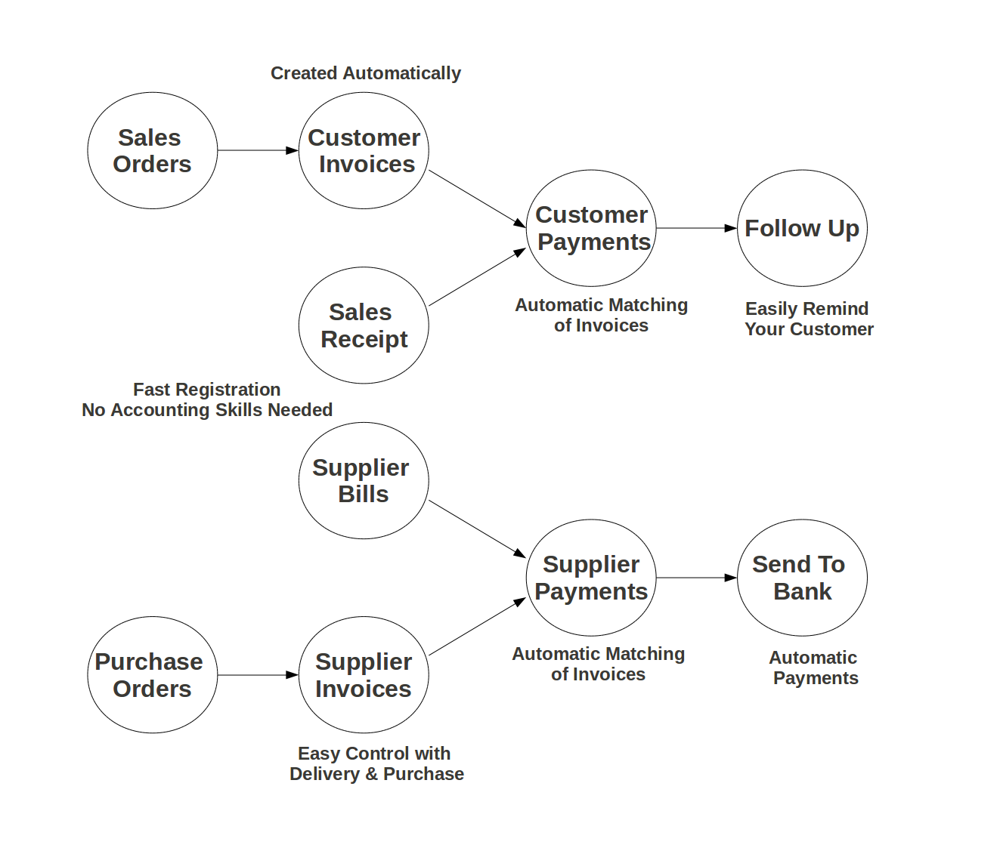
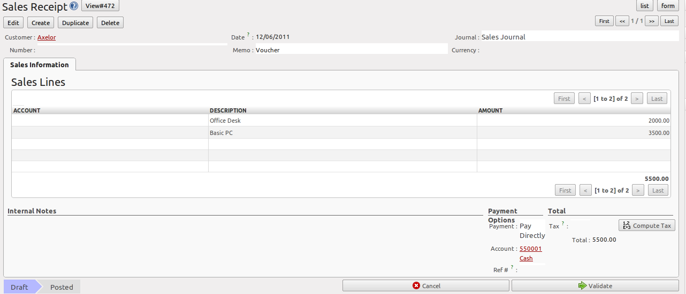
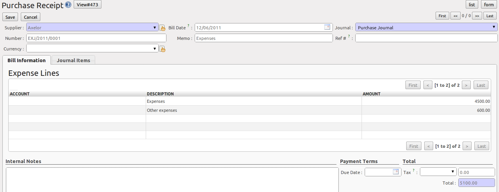
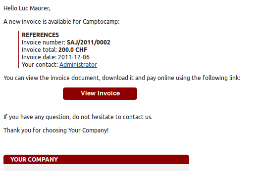
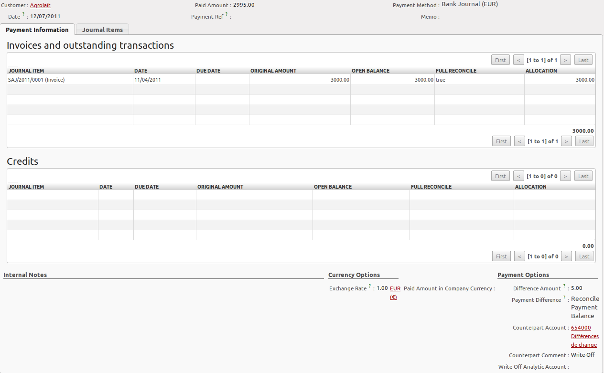
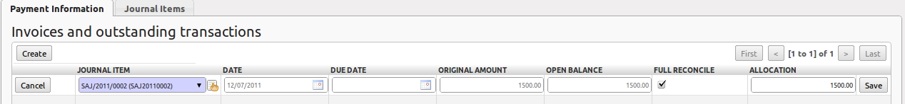
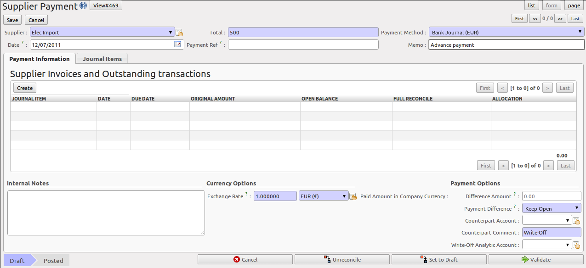

.. i18n: .. raw:: latex
.. i18n: 
.. i18n:     \afterpage{\clearpage}
..

.. raw:: latex

    \afterpage{\clearpage}

.. i18n: In OpenERP, the invoicing workflow is very simple. You can see it in the following figure:
..

OpenERP 的开票流程也很简单,参见下面的工作流程图:

.. i18n: .. figure::  images/account_invoice_workflow.png
.. i18n:    :width: 100%
.. i18n:    :align: center
.. i18n: 
.. i18n:    *Invoicing Workflow*
..

   *开票流程*

.. i18n: An invoice can be generated from various documents, such as a `Sales Order` and a `Purchase Order`, or at the time of confirming a shipment. These methods will be proposed when you use OpenERP as a truely integrated system.
..

发票可根据其他各种文件生成，如销售订单，采购订单，或在确认发货时间时生成。 These methods will be proposed when you use OpenERP as a truely integrated system.

.. i18n: Of course, companies often work together with an external accountant who keeps their books. In that case, you would like to know which invoices exist and have been paid.
..

Of course, companies often work together with an external accountant who keeps their books. In that case, you would like to know which invoices exist and have been paid.

.. i18n: The specific and easy-to-use `Invoicing` system in OpenERP allows you to keep track of your accounting, even when you are not an accountant.
.. i18n: It provides an easy way to follow up your suppliers and customers. You could use this simplified accounting in case you work with an (external) account to keep your books, and you still want to keep track of payments. The ``Invoicing`` system includes receipts and vouchers (an easy way to keep track of sales and purchases). It also offers you an easy method to register payments, without you having to encode complete abstracts of account.
..

Openerp中明确并易用的 `开票` 系统使你能跟踪你的账务，甚至当你不是一个财务人员，
它提供了一个简单的方法来跟踪你的供应商和客户。
You could use this simplified accounting in case you work with an (external) account to keep your books, 
and you still want to keep track of payments. 
``开票`` 系统包括了收款和付款 (简单方法来跟踪销售和采购). 
试图用一个简单的方法来登记付款，不需要你的编写完整科目摘要

.. i18n: Simple Customer Receipts
.. i18n: ------------------------
..

简单的客户收据
------------------------

.. i18n: When you sell products to a customer, you can give him a true invoice or a `Sales Receipt`, which is also called `Customer Receipt`.
.. i18n: Sales Receipts are merely a kind of sales ticket and not a real invoice.
..

您你卖产品给客户时，您可以给他一个真正的发票或销售收据，这也被称为客户收据。销售收据仅仅是一种销售小票，而不是一个真正的发票。

.. i18n: When the sales receipt is confirmed, OpenERP creates journal items automatically and you can record the customer payment related to this sales receipt. The easy invoicing system does not require extensive accounting setup, so you will be up and running quickly!
..

当销售收据确认后，OpenERP的自动创建销售记录，并记录客户有关这张收据的付款情况。 简单的发票系统并不需要做大量的会计配置，因此您能很快上线并快速使用!

.. i18n: You can create and modify a sales receipt from the menu :menuselection:`Accounting --> Customers --> Sales Receipt`.
..

您可以通过以下菜单创建和修改销售收据 :menuselection:`Accounting --> Customers --> Sales Receipt`.

.. i18n: .. figure::  images/account_customer_receipt2.png
.. i18n:    :scale: 75
.. i18n:    :align: center
.. i18n: 
.. i18n:    *Defining a Customer Receipt*
..

   *创建客户收据*

.. i18n: .. note:: Extended View
.. i18n: 
.. i18n:     To display Sales and Purchase Receipts in the Customers / Suppliers menu, you need to use the ``Extended`` view. The view can be changed with the user ``Preferences`` button next to the ``Home`` button in the main toolbar.
..

.. 注释:: 扩展试图

    To display Sales and Purchase Receipts in the Customers / Suppliers menu, you need to use the ``Extended`` view. The view can be changed with the user ``Preferences`` button next to the ``Home`` button in the main toolbar.

.. i18n: When you create a new `Sales Receipt`, you have to enter the `Customer` for whom you want to create a voucher. You can also define `Sales Lines` in the `Sales Information` tab. Here you have to define `Account`, `Amount` and `Description`.
.. i18n: At the bottom of the form, you will have two options for `Payment`: one is `Pay Directly` and another is `Pay Later or Group Funds`.
.. i18n: When you select the `Pay Directly` option, you have to enter the bank `Account`. The `Total` amount displays automatically with calculation of tax (if you select VAT to be added) when you click the `Compute Tax` button.
..

When you create a new `Sales Receipt`, you have to enter the `Customer` for whom you want to create a voucher. You can also define `Sales Lines` in the `Sales Information` tab. Here you have to define `Account`, `Amount` and `Description`.
At the bottom of the form, you will have two options for `Payment`: one is `Pay Directly` and another is `Pay Later or Group Funds`.
When you select the `Pay Directly` option, you have to enter the bank `Account`. The `Total` amount displays automatically with calculation of tax (if you select VAT to be added) when you click the `Compute Tax` button.

.. i18n: When you purchase products from a supplier, you will receive a `Purchase Receipt` (a ticket),  which is also called `Notes Payable`
.. i18n: in accounting terminology. When a purchase receipt is confirmed, it creates journal items automatically and you can record
.. i18n: the supplier payment related to this purchase receipt, just like for the sales receipts.
..

When you purchase products from a supplier, you will receive a `Purchase Receipt` (a ticket),  which is also called `Notes Payable`
in accounting terminology. When a purchase receipt is confirmed, it creates journal items automatically and you can record
the supplier payment related to this purchase receipt, just like for the sales receipts.

.. i18n: You can create and modify the purchase receipt through the menu :menuselection:`Accounting --> Suppliers --> Purchase Receipt`.
..

You can create and modify the purchase receipt through the menu :menuselection:`Accounting --> Suppliers --> Purchase Receipt`.

.. i18n: .. figure::  images/account_supplier_voucher2.png
.. i18n:    :scale: 75
.. i18n:    :align: center
.. i18n: 
.. i18n:    *Purchase Receipt*
..

   *Purchase Receipt*

.. i18n: The `Purchase Receipt` form looks like the `Sales Receipt` form. In this form, carefully select the journal.
..

The `Purchase Receipt` form looks like the `Sales Receipt` form. In this form, carefully select the journal.

.. i18n: .. raw:: latex
.. i18n: 
.. i18n:     \clearpage
..

.. raw:: latex

    \clearpage

.. i18n: Invoice your Customers
.. i18n: ----------------------
..

开票给你的客户
----------------------

.. i18n: It is surprising to see that in the 21st century, most companies still process quotations & invoices manually, mostly by post or email. The trend is clearly for personal communication to disregard these legacy media, and replace them with instant messaging, social networks, etc. The *Electronic Data Interchange* (EDI) platform is here to try and open OpenERP to more modern communication systems, where electronic documents are exchanged and synchronised between business partners in real-time.
..

It is surprising to see that in the 21st century, most companies still process quotations & invoices manually, mostly by post or email. The trend is clearly for personal communication to disregard these legacy media, and replace them with instant messaging, social networks, etc. The *Electronic Data Interchange* (EDI) platform is here to try and open OpenERP to more modern communication systems, where electronic documents are exchanged and synchronised between business partners in real-time.

.. i18n: Initially, OpenERP will support a simple EDI mechanism for certain OpenERP documents, such as Sales Orders, Purchase Orders and Invoices.
..

Initially, OpenERP will support a simple EDI mechanism for certain OpenERP documents, such as Sales Orders, Purchase Orders and Invoices.

.. i18n: Indeed, the integrated email and invoicing system in OpenERP allows you to create an invoice and automatically send an email with the invoice link to the customer.
..

Indeed, the integrated email and invoicing system in OpenERP allows you to create an invoice and automatically send an email with the invoice link to the customer.

.. i18n: The customer then has several options. If your customer also has an OpenERP instance, he can easily import the invoice you have sent him, simply by clicking the link.
..

The customer then has several options. If your customer also has an OpenERP instance, he can easily import the invoice you have sent him, simply by clicking the link.

.. i18n: Below, you find an example of such an EDI flow:
..

Below, you find an example of such an EDI flow:

.. i18n: 1. Your company issues a Sales Order, a Purchase Order or an Invoice for a specific partner, let's say Camptocamp.
.. i18n: 
.. i18n: 2. Partner Camptocamp receives an email with a link to an online preview of the document.
.. i18n: 
.. i18n: 3. In the online preview of the document, Camptocamp can read the document, download or print the PDF version, and then choose between a couple of options:
..

1. Your company issues a Sales Order, a Purchase Order or an Invoice for a specific partner, let's say Camptocamp.

2. Partner Camptocamp receives an email with a link to an online preview of the document.

3. In the online preview of the document, Camptocamp can read the document, download or print the PDF version, and then choose between a couple of options:

.. i18n:   a. import this document in his own OpenERP instance, simply by providing the instance address;
..

  a. import this document in his own OpenERP instance, simply by providing the instance address;

.. i18n:   b. ask to create a new OpenERP online instance, where the document will be pre-imported;
..

  b. ask to create a new OpenERP online instance, where the document will be pre-imported;

.. i18n:   c. ask for the raw EDI document, which the partner can then import in his own third-party software through a corresponding EDI import system.
..

  c. ask for the raw EDI document, which the partner can then import in his own third-party software through a corresponding EDI import system.

.. i18n: 4. Partner Camptocamp can also choose to directly pay online through Paypal or any other mechanism provided by your company.
..

4. Partner Camptocamp can also choose to directly pay online through Paypal or any other mechanism provided by your company.

.. i18n: The email notification is freely customisable as an Email Template from the :menuselection:`Settings --> Configuration --> Email --> Templates`.
..

The email notification is freely customisable as an Email Template from the :menuselection:`Settings --> Configuration --> Email --> Templates`.

.. i18n: To get the EDI and automatic emailing of orders and invoices to work, you need the :mod:`EDI` module, which is installed by default.
.. i18n: You need to add an email adress to the partner and make sure the "Opt-out" checkbox is not selected. Ask your system administrator to configure an Outgoing Mail Server. Note that email notifications will be added to a mail queue and processed once in a while, but you can force emails to be send directly from the :menuselection:`Settings --> Email --> Messages`.
..

To get the EDI and automatic emailing of orders and invoices to work, you need the :mod:`EDI` module, which is installed by default.
You need to add an email adress to the partner and make sure the "Opt-out" checkbox is not selected. Ask your system administrator to configure an Outgoing Mail Server. Note that email notifications will be added to a mail queue and processed once in a while, but you can force emails to be send directly from the :menuselection:`Settings --> Email --> Messages`.

.. i18n: The email your customer will receive, will look like the image displayed.
..

The email your customer will receive, will look like the image displayed.

.. i18n: .. figure::  images/account_edi_mail.png
.. i18n:    :scale: 75
.. i18n:    :align: center
.. i18n: 
.. i18n:    *Mail to Your Customer*
.. i18n:  
..

   *Mail to Your Customer*
 

.. i18n: Keep Track of your Customer's Payments
.. i18n: --------------------------------------
..

跟踪客户的支付进程
--------------------------------------

.. i18n: It is important to efficiently keep track of payments of your customers and suppliers. People who have no accounting knowledge and just want to use OpenERP to keep an eye on their payments, can set the ``Invoicing & Payments`` access rights from the ``User`` form.
..

It is important to efficiently keep track of payments of your customers and suppliers. People who have no accounting knowledge and just want to use OpenERP to keep an eye on their payments, can set the ``Invoicing & Payments`` access rights from the ``User`` form.

.. i18n: :guilabel:`Customer Payment` allows you to register the payments you receive from your customers.
.. i18n: In order to record a payment, you have to enter the customer, the payment method (= the journal) and the payment amount. OpenERP will automatically propose the reconciliation of this payment with any open invoices or sales receipts, credit notes and (advance) payments.
..

:guilabel:`Customer Payment` allows you to register the payments you receive from your customers.
In order to record a payment, you have to enter the customer, the payment method (= the journal) and the payment amount. OpenERP will automatically propose the reconciliation of this payment with any open invoices or sales receipts, credit notes and (advance) payments.

.. i18n: You can register Customer payments in OpenERP from the menu :menuselection:`Accounting --> Customers --> Customer Payment`; click `New` to register a payment.
..

You can register Customer payments in OpenERP from the menu :menuselection:`Accounting --> Customers --> Customer Payment`; click `New` to register a payment.

.. i18n: .. figure::  images/account_cust_payment.png
.. i18n:    :scale: 75
.. i18n:    :align: center
.. i18n: 
.. i18n:    *Customer Payment*
..

   *Customer Payment*

.. i18n: Suppose you have an invoice of 3000 EUR; the amount you actually receive from the customer is 2995 EUR. You would consider the invoice as entirely paid. How would you proceed?
..

Suppose you have an invoice of 3000 EUR; the amount you actually receive from the customer is 2995 EUR. You would consider the invoice as entirely paid. How would you proceed?

.. i18n: To create a new `Customer Payment`, select the customer, key in the `Paid Amount`, e.g. 2995 and select the `Payment Method`, i.e. your bank journal. Any open invoices, credit notes or advances for this partner will be displayed on the ``Payment Information`` tab.
.. i18n: In this example, the 3000 EUR invoice will be proposed.
..

To create a new `Customer Payment`, select the customer, key in the `Paid Amount`, e.g. 2995 and select the `Payment Method`, i.e. your bank journal. Any open invoices, credit notes or advances for this partner will be displayed on the ``Payment Information`` tab.
In this example, the 3000 EUR invoice will be proposed.

.. i18n: Now you have to tell OpenERP that you want to consider the invoice as fully paid. Simply click the invoice line on the ``Payment Information`` tab to make it editable. Now select the :guilabel:`Full Reconcile` checkbox, and notice that the amount changes to the full amount of the invoice.
..

Now you have to tell OpenERP that you want to consider the invoice as fully paid. Simply click the invoice line on the ``Payment Information`` tab to make it editable. Now select the :guilabel:`Full Reconcile` checkbox, and notice that the amount changes to the full amount of the invoice.

.. i18n: .. figure::  images/account_cust_reconcile.png
.. i18n:    :scale: 75
.. i18n:    :align: center
.. i18n: 
.. i18n:    *Fully Pay*
..

   *Fully Pay*

.. i18n: Select the proper option in the ``Payment Difference`` field, i.e. `Reconcile Payment` (you would use the `Keep Open` option if you want to claim the 5 EUR from the customer). The write-off amount is already proposed automatically, but you have to enter the `Counterpart Account` so that write-off entries can be generated by OpenERP. You can also enter a comment about the reconciliation (by default, Write-Off will be proposed). Then post your payment.
..

Select the proper option in the ``Payment Difference`` field, i.e. `Reconcile Payment` (you would use the `Keep Open` option if you want to claim the 5 EUR from the customer). The write-off amount is already proposed automatically, but you have to enter the `Counterpart Account` so that write-off entries can be generated by OpenERP. You can also enter a comment about the reconciliation (by default, Write-Off will be proposed). Then post your payment.

.. i18n: .. note:: Analytic Accounts
.. i18n: 
.. i18n:     When you do analytic bookkeeping as well, you can enter an analytic account for the write-off too.
..

.. note:: Analytic Accounts

    When you do analytic bookkeeping as well, you can enter an analytic account for the write-off too.

.. i18n: This easy payment system also allows you to post a payment that you cannot directly attribute to a customer as an advance.
..

This easy payment system also allows you to post a payment that you cannot directly attribute to a customer as an advance.

.. i18n: Let us take the following example. A customer has two open invoices, one of 2000, one of 1500. He pays 1000, but you cannot assign this to any of the two invoices directly. You can just enter this payment as an advance. How do you proceed?
..

Let us take the following example. A customer has two open invoices, one of 2000, one of 1500. He pays 1000, but you cannot assign this to any of the two invoices directly. You can just enter this payment as an advance. How do you proceed?

.. i18n: When you key in an ``Amount paid`` of 1000 in your `Customer Payment`, the amount will be attributed to the oldest invoice. You do not want this, because you have no idea yet of what invoice the amount should be linked to. Click the amount in the first line and set it to 0.
.. i18n: Validate the payment. The system will now create an advance payment of 1000 for the customer concerned.
..

When you key in an ``Amount paid`` of 1000 in your `Customer Payment`, the amount will be attributed to the oldest invoice. You do not want this, because you have no idea yet of what invoice the amount should be linked to. Click the amount in the first line and set it to 0.
Validate the payment. The system will now create an advance payment of 1000 for the customer concerned.

.. i18n: .. index::
.. i18n:    single: Supplier Payment
..

.. index::
   single: Supplier Payment

.. i18n: .. tip:: Supplier Payment
.. i18n: 
.. i18n:     The ``Supplier Payment`` form allows you to track the payment to your suppliers in the same way as a customer payment.
..

.. tip:: Supplier Payment

    The ``Supplier Payment`` form allows you to track the payment to your suppliers in the same way as a customer payment.

.. i18n: From the menu :menuselection:`Accounting --> Suppliers --> Supplier Payment`, click the `New` button to create a new `Supplier Payment`.
..

From the menu :menuselection:`Accounting --> Suppliers --> Supplier Payment`, click the `New` button to create a new `Supplier Payment`.

.. i18n: .. figure::  images/account_supplier_payment2.png
.. i18n:    :scale: 75
.. i18n:    :align: center
.. i18n: 
.. i18n:    *Supplier Payment Form*
..

   *Supplier Payment Form*

.. i18n: Another way of keeping track of your payments is the way accountants will do it, by encoding ``Bank Statements``. For more information about this, please refer to the chapter on :ref:`invoicemanagement`.
..

Another way of keeping track of your payments is the way accountants will do it, by encoding ``Bank Statements``. For more information about this, please refer to the chapter on :ref:`invoicemanagement`.

.. i18n: You can also push your accounting further by importing your payments electronically through a CODA file you receive from the bank. To do this install the :mod:`account_coda` module.
..

You can also push your accounting further by importing your payments electronically through a CODA file you receive from the bank. To do this install the :mod:`account_coda` module.

.. i18n: How should you proceed?
..

How should you proceed?

.. i18n: You have to enter your company's bank account(s) for which you want to accept CODA files. Go to the menu :menuselection:`Accounting --> Configuration --> Financial Accounting --> Accounts --> Setup your Bank Accounts`. Choose the bank account type you want to use (IBAN or normal bank account). For electronic payments, you should use IBAN; do not forget to also enter your bank's BIC code.
..

You have to enter your company's bank account(s) for which you want to accept CODA files. Go to the menu :menuselection:`Accounting --> Configuration --> Financial Accounting --> Accounts --> Setup your Bank Accounts`. Choose the bank account type you want to use (IBAN or normal bank account). For electronic payments, you should use IBAN; do not forget to also enter your bank's BIC code.

.. i18n: .. tip:: Bank Journal
.. i18n: 
.. i18n:     When you save the bank account through the Setup your Bank Accounts wizard, a bank journal will be automatically created for that account.
..

.. tip:: Bank Journal

    When you save the bank account through the Setup your Bank Accounts wizard, a bank journal will be automatically created for that account.

.. i18n: Then add the bank account details for each partner that will pay you through a bank. You can do this in the Partner form, on the ``Accounting`` tab.
..

Then add the bank account details for each partner that will pay you through a bank. You can do this in the Partner form, on the ``Accounting`` tab.

.. i18n: Download the CODA file from your bank to any directory. Import the electronic bank statement through the menu :menuselection:`Accounting --> Periodical Processing --> Statements --> Import Coda Statements`.
..

Download the CODA file from your bank to any directory. Import the electronic bank statement through the menu :menuselection:`Accounting --> Periodical Processing --> Statements --> Import Coda Statements`.

.. i18n: Enter the data required in the wizard (receivable and payable account, bank journal and a default account to post to when no corresponding partner is found). Then select the CODA file in your directory and click the ``Import`` button to start processing the CODA file.
..

Enter the data required in the wizard (receivable and payable account, bank journal and a default account to post to when no corresponding partner is found). Then select the CODA file in your directory and click the ``Import`` button to start processing the CODA file.

.. i18n: OpenERP will then import a draft bank statement in the selected journal and will match all corresponding customer / supplier payments when possible. You can change the draft statement if necessary from the menu :menuselection:`Accounting --> Bank and Cash --> Bank Statements`. You can check any issues during file loading from the menu :menuselection:`Accounting --> Bank and Cash --> Coda Import Logs`.
..

OpenERP will then import a draft bank statement in the selected journal and will match all corresponding customer / supplier payments when possible. You can change the draft statement if necessary from the menu :menuselection:`Accounting --> Bank and Cash --> Bank Statements`. You can check any issues during file loading from the menu :menuselection:`Accounting --> Bank and Cash --> Coda Import Logs`.

.. i18n: .. Copyright © Open Object Press. All rights reserved.
..

.. Copyright © Open Object Press. All rights reserved.

.. i18n: .. You may take electronic copy of this publication and distribute it if you don't
.. i18n: .. change the content. You can also print a copy to be read by yourself only.
..

.. You may take electronic copy of this publication and distribute it if you don't
.. change the content. You can also print a copy to be read by yourself only.

.. i18n: .. We have contracts with different publishers in different countries to sell and
.. i18n: .. distribute paper or electronic based versions of this book (translated or not)
.. i18n: .. in bookstores. This helps to distribute and promote the OpenERP product. It
.. i18n: .. also helps us to create incentives to pay contributors and authors using author
.. i18n: .. rights of these sales.
..

.. We have contracts with different publishers in different countries to sell and
.. distribute paper or electronic based versions of this book (translated or not)
.. in bookstores. This helps to distribute and promote the OpenERP product. It
.. also helps us to create incentives to pay contributors and authors using author
.. rights of these sales.

.. i18n: .. Due to this, grants to translate, modify or sell this book are strictly
.. i18n: .. forbidden, unless Tiny SPRL (representing Open Object Press) gives you a
.. i18n: .. written authorisation for this.
..

.. Due to this, grants to translate, modify or sell this book are strictly
.. forbidden, unless Tiny SPRL (representing Open Object Press) gives you a
.. written authorisation for this.

.. i18n: .. Many of the designations used by manufacturers and suppliers to distinguish their
.. i18n: .. products are claimed as trademarks. Where those designations appear in this book,
.. i18n: .. and Open Object Press was aware of a trademark claim, the designations have been
.. i18n: .. printed in initial capitals.
..

.. Many of the designations used by manufacturers and suppliers to distinguish their
.. products are claimed as trademarks. Where those designations appear in this book,
.. and Open Object Press was aware of a trademark claim, the designations have been
.. printed in initial capitals.

.. i18n: .. While every precaution has been taken in the preparation of this book, the publisher
.. i18n: .. and the authors assume no responsibility for errors or omissions, or for damages
.. i18n: .. resulting from the use of the information contained herein.
..

.. While every precaution has been taken in the preparation of this book, the publisher
.. and the authors assume no responsibility for errors or omissions, or for damages
.. resulting from the use of the information contained herein.

.. i18n: .. Published by Open Object Press, Grand Rosière, Belgium
..

.. Published by Open Object Press, Grand Rosière, Belgium
