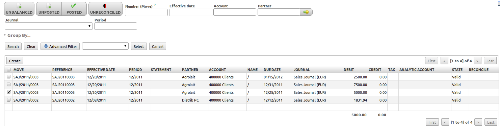
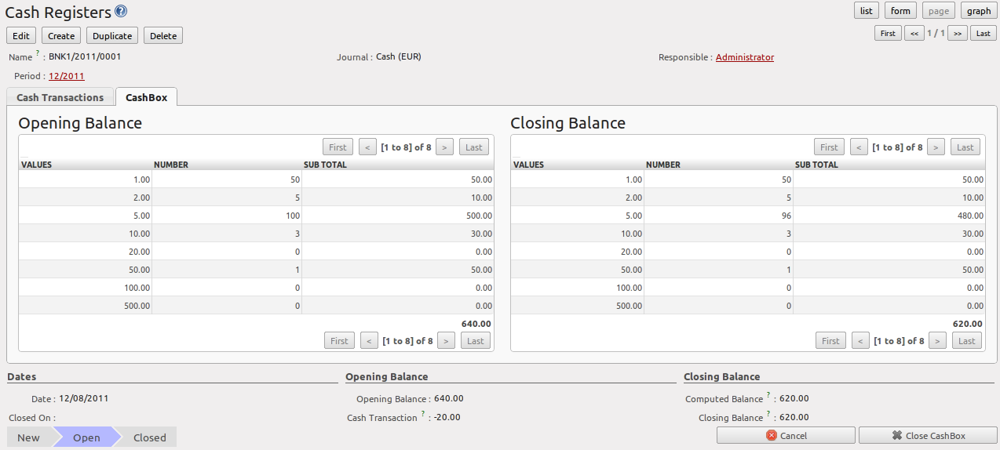
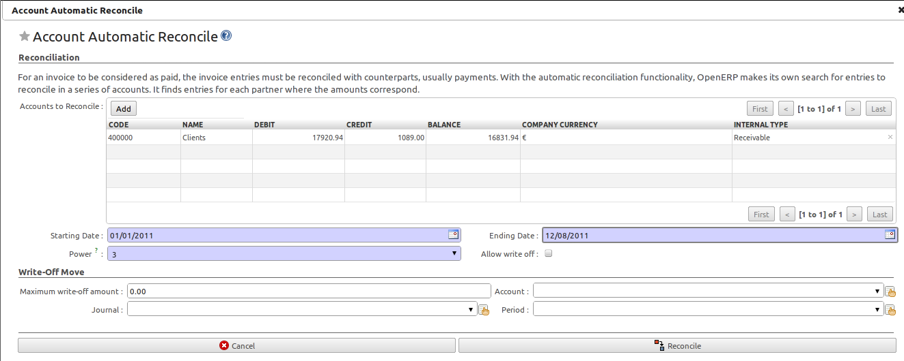
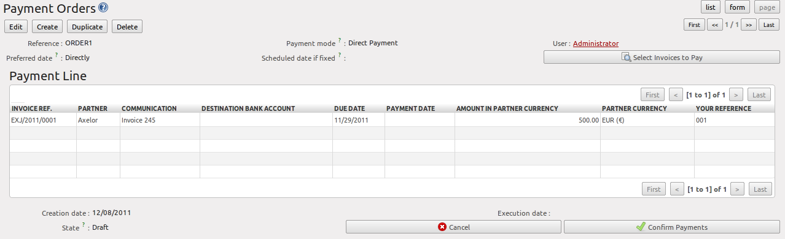

.. i18n: .. index::
.. i18n:    pair: accounting; entry
..

.. index::
   pair: accounting; entry

.. i18n: Accounting Entries
.. i18n: ==================
..

会计分录 
==================

.. i18n: Various methods can be used to create accounting entries. You have already seen how an invoice
.. i18n: creates its own entries, for example.
..

创建会计分录有多种方法。 比如，你已经清楚的发票怎么来创建它的分录。

.. i18n: This section deals with
..

本节讨论

.. i18n: * managing bank statements,
.. i18n: 
.. i18n: * managing cash,
.. i18n: 
.. i18n: * manual journal entries.
..

* 银行对账单的管理，

* 现金管理，

* 账簿分录管理。

.. i18n: Here we will show you how to enter financial transactions. In OpenERP, you can handle bank statements and also a cash register. Use different journals for these two kinds of transaction. According to the journal type selected, you will have a different screen.
..

这里我们给你展示如何进入财务交易。在OPENERP中，你可以处理银行对账单和现金记录。 对这两种交易使用不同的账簿。根据选择的账簿类型，you will have a different screen.

.. i18n: .. index::
.. i18n:    pair: bank; statement
.. i18n:    single: accounting; bank statement
..

.. index::
   pair: bank; statement
   single: accounting; bank statement

.. i18n: Managing Bank Statements
.. i18n: ------------------------
..

管理银行对账单
------------------------

.. i18n: OpenERP provides a visual tool for managing bank statements that simplifies data entry into
.. i18n: accounts. As soon as a statement is validated, the corresponding accounting entries are
.. i18n: automatically generated by OpenERP. So non-accounting people can enter financial
.. i18n: transactions without having to worry about things such as credit, debit and counterparts.
..

OpenERP提供了一个可视化的工具来管理银行对账单，简化了账户数据的录入。
当对账单被确认时，OPENERP就会自动生成相应的会计分录。 所以，非会计人员无需担心贷方，借方和counterparts这些事，也可以记录财务事项。

.. i18n: To enter a bank statement, go to the menu :menuselection:`Accounting --> Bank and Cash --> Bank Statements`.
.. i18n: A data entry form for bank statements then opens as shown in figure :ref:`fig-accstate`.
..

记录一张银行对账单， 转到菜单 :menuselection:`Accounting --> Bank and Cash --> Bank Statements` :menuselection:`会计 -->银行和现金 --> 银行对账单`。
输入数据到银行对账单的表单然后打开如图所示 :ref:`fig-accstate`.

.. i18n: .. _fig-accstate:
.. i18n: 
.. i18n: .. figure::  images/account_statement.png
.. i18n:    :scale: 75
.. i18n:    :align: center
.. i18n: 
.. i18n:    *Data Entry Form for a Bank Statement*
..

.. _fig-accstate:

.. figure::  images/account_statement.png
   :scale: 75
   :align: center

   *Data Entry Form for a Bank Statement*

.. i18n: The statement reference :guilabel:`Name` and the :guilabel:`Date` are automatically suggested by OpenERP. The :guilabel:`Name` will be filled with the statement number at confirmation of the bank statement. You can configure your own reference by managing sequences in the :menuselection:`Administration --> Configuration --> Sequences` menu.
..

单据引用的 :guilabel:`名称` 和 :guilabel:`日期` 是由OPENERP自动推荐的。这个 :guilabel:`名称` 在银行对账单确认的时候将被单据编号补充。 你可以通过管理序列号来配置你自己的引用，在 :menuselection:`Administration --> Configuration --> Sequences` :menuselection:`系统管理员 --> 设置 --> 序列` 菜单。

.. i18n: Then select the correct :guilabel:`Journal`. Ideally, when you are configuring your company, you would create at
.. i18n: least one journal for each bank account and one journal for petty cash in your company. So select
.. i18n: the journal corresponding to the bank account whose statement you are handling.
..

接着选择 :guilabel:`账簿(Journal)`. 一般来讲,在期初建立账套的时候,最好为公司的每一个银行账户及现金户各建立一个对应的
:guilabel:`账簿(Journal)`. 然后在这里,你选择与本次银行对账相应的账簿即可.

.. i18n: The currency that you are using for the statement line is that of the selected journal. If you are
.. i18n: entering statement lines for an account in American Dollars (USD), the amounts must be entered in
.. i18n: \ ``USD`` \. The currency is automatically converted into the company's main currency when you confirm
.. i18n: the entry, using the rates in effect at the date of entry. (This means that you would need valid
.. i18n: currency conversion rates to be created first. Go to :menuselection:`Accounting --> Configuration --> Miscellaneous --> Currencies` menu.)
..

The currency that you are using for the statement line is that of the selected journal. If you are
entering statement lines for an account in American Dollars (USD), the amounts must be entered in
\ ``USD`` \. The currency is automatically converted into the company's main currency when you confirm
the entry, using the rates in effect at the date of entry. (This means that you would need valid
currency conversion rates to be created first. Go to :menuselection:`Accounting --> Configuration --> Miscellaneous --> Currencies` menu.)

.. i18n: OpenERP automatically completes the initial balance based on the closing balance of the
.. i18n: preceding statement. You can modify this value and force another value. This lets you enter
.. i18n: statements in the order of your choice. Also if you have lost a page of your statement, you can enter
.. i18n: the following ones immediately and you are not forced to wait for a duplicate from the bank.
..

OpenERP automatically completes the initial balance based on the closing balance of the
preceding statement. You can modify this value and force another value. This lets you enter
statements in the order of your choice. Also if you have lost a page of your statement, you can enter
the following ones immediately and you are not forced to wait for a duplicate from the bank.

.. i18n: So, complete the closing balance which corresponds to the new value in the account displayed on your
.. i18n: bank statement. This amount will be used to control the operations before approving the statement.
..

So, complete the closing balance which corresponds to the new value in the account displayed on your
bank statement. This amount will be used to control the operations before approving the statement.

.. i18n: Then you must enter all the lines on the statement. Each line corresponds to a banking transaction.
..

接着就是按银行的回单逐行输入进银行对帐单明细中.

.. i18n: Enter the transaction line.
.. i18n: You have two ways of entering financial transactions: manually or through the :guilabel:`Import Invoices` button.
..

Enter the transaction line.
You have two ways of entering financial transactions: manually or through the :guilabel:`Import Invoices` button.

.. i18n: Manual Entry
.. i18n: ------------
.. i18n: When you type the Partner name, OpenERP automatically proposes the corresponding centralisation account. The total amount due for the customer or supplier is pre-completed (:guilabel:`Amount`). This gives you a simple indication of the effective payment. You
.. i18n: must then enter the amount that appears on your statement line: a negative sign for a withdrawal and
.. i18n: a positive sign for a cash payment or deposit.
..

手工分录
------------
当你输入一个合作者的名字, OpenERP 自动调用相应的中央集权的帐户. The total amount due for the customer or supplier is pre-completed (:guilabel:`Amount`). This gives you a simple indication of the effective payment. You
must then enter the amount that appears on your statement line: a negative sign for a withdrawal and
a positive sign for a cash payment or deposit.

.. i18n: In the :guilabel:`Payment` press :kbd:`F1` to reconcile your payment directly with the corresponding accounting
.. i18n: entry or entries to be paid.
..

In the :guilabel:`Payment` press :kbd:`F1` to reconcile your payment directly with the corresponding accounting
entry or entries to be paid.

.. i18n: Import Invoices
.. i18n: ---------------
.. i18n: Click the `Import Invoices` button, then click Add to select the invoices for
.. i18n: which your payment will have to be reconciled. Click OK to confirm your selection; the statement line will automatically be added with the corresponding reconciliation.
..

导入发票
---------------
点击 `导入发票(Import Invoices)` 按钮, 选择你要与付款相核销的发票行,并点击 `添加(Add)` 按钮. 点击OK确认选择; the statement line will automatically be added with the corresponding reconciliation.

.. i18n: .. figure::  images/account_statement_reconcile.png
.. i18n:    :scale: 75
.. i18n:    :align: center
.. i18n: 
.. i18n:    *Reconciliation from Data Entry of the Bank Statement*
..

   *与银行帐单间的核销*

.. i18n: .. note::  Reconciliation
.. i18n: 
.. i18n:         Other methods of reconciliation are possible: from accounting entries, when saving the payment
.. i18n:         directly on an invoice, or using the automatic reconciliation tool.
.. i18n: 
.. i18n:         You can carry out either a full or a partial reconciliation.
..

.. note::  核销

        Other methods of reconciliation are possible: from accounting entries, when saving the payment
        directly on an invoice, or using the automatic reconciliation tool.

        You can carry out either a full or a partial reconciliation.

.. i18n: .. index::
.. i18n:    single: adjustment
..

.. index::
   single: adjustment

.. i18n: If you see a difference between the payment and the invoices to reconcile,
.. i18n: you can enter the difference in the second part of the form :guilabel:`Write-off`.
.. i18n: You have to set an account for the adjustment. The main reasons explaining the difference are usually:
..

If you see a difference between the payment and the invoices to reconcile,
you can enter the difference in the second part of the form :guilabel:`Write-off`.
You have to set an account for the adjustment. The main reasons explaining the difference are usually:

.. i18n: * profit or loss,
.. i18n: 
.. i18n: * exchange differences,
.. i18n: 
.. i18n: * discounts given for fast payment.
..

* profit or loss,

* exchange differences,

* discounts given for fast payment.

.. i18n: When the reconciliation is complete - that is, the payment is equal to the sum of the due
.. i18n: payments and the adjustments - you can close the reconciliation form.
..

When the reconciliation is complete - that is, the payment is equal to the sum of the due
payments and the adjustments - you can close the reconciliation form.

.. i18n: The reconciliation operation is optional – you could very well do it later or not do it at all.
.. i18n: However, reconciliation has got two significant effects:
..

The reconciliation operation is optional – you could very well do it later or not do it at all.
However, reconciliation has got two significant effects:

.. i18n: * marking that the invoices have been paid,
.. i18n: 
.. i18n: * preventing the payment and invoice amounts from appearing on customer reminder letters. Unless
.. i18n:   you have reconciled them, a customer will see the invoice and payment amounts on his reminder letter
.. i18n:   (which will not alter the balance due since they will just cancel each other out).
..

* marking that the invoices have been paid,

* preventing the payment and invoice amounts from appearing on customer reminder letters. Unless
  you have reconciled them, a customer will see the invoice and payment amounts on his reminder letter
  (which will not alter the balance due since they will just cancel each other out).

.. i18n: Finally, once you have entered the complete bank statement, you can validate it.
.. i18n: OpenERP then automatically generates the corresponding accounting entries if the calculated balance equals the final balance, indicated in the Closing Balance field. The reconciled invoices are marked as paid at that point.
..

Finally, once you have entered the complete bank statement, you can validate it.
OpenERP then automatically generates the corresponding accounting entries if the calculated balance equals the final balance, indicated in the Closing Balance field. The reconciled invoices are marked as paid at that point.

.. i18n: You can also enter general accounting entries, for example, banking costs. In such cases, you can enter the amounts directly in the corresponding general accounts.
..

You can also enter general accounting entries, for example, banking costs. In such cases, you can enter the amounts directly in the corresponding general accounts.

.. i18n: A user with advanced accounting skills can enter accounting entries directly into the bank journal from :menuselection:`Accounting --> Journal Entries -> Journal Items`. The result is the same, but the operation is more complex because you must know the
.. i18n: accounts to use and must have mastered the ideas of credit and debit.
..

A user with advanced accounting skills can enter accounting entries directly into the bank journal from :menuselection:`Accounting --> Journal Entries -> Journal Items`. The result is the same, but the operation is more complex because you must know the
accounts to use and must have mastered the ideas of credit and debit.

.. i18n: .. index::
.. i18n:    single: cash management
..

.. index::
   single: cash management

.. i18n: Cash Management
.. i18n: ---------------
..

现金管理
---------------

.. i18n: To manage cash, you can use the menu :menuselection:`Accounting -->
.. i18n: Bank and Cash --> Cash Registers`. At the start of the day you set the opening amount of cash in the entry (:guilabel:`Opening Balance`). Then open the cashbox to start making entries from the :guilabel:`Cash Transactions` tab.
..

要进入现金管理, 请点击菜单 :menuselection:`会计 -->
银行和现金 --> 现金记录` :menuselection:`Accounting -->
Bank and Cash --> Cash Registers`. At the start of the day you set the opening amount of cash in the entry (:guilabel:`Opening Balance`). Then open the cashbox to start making entries from the :guilabel:`Cash Transactions` tab.

.. i18n: .. figure::  images/account_cash_registers.png
.. i18n:    :scale: 75
.. i18n:    :align: center
.. i18n: 
.. i18n:    *Defining the Cash Register*
..

   *Defining the Cash Register*

.. i18n: All the transactions throughout the day are then entered in this statement. When you close the cashbox, generally at the end of the day, enter the amounts on the :guilabel:`CashBox` tab, in the
.. i18n: :guilabel:`Closing Balance` section. Then confirm the statement to close the day's cash statement and automatically
.. i18n: generate the corresponding accounting entries. Note that the :guilabel:`Calculated Balance` and the :guilabel:`CashBox Balance` need to be equal before you can close the cashbox.
..

All the transactions throughout the day are then entered in this statement. When you close the cashbox, generally at the end of the day, enter the amounts on the :guilabel:`CashBox` tab, in the
:guilabel:`Closing Balance` section. Then confirm the statement to close the day's cash statement and automatically
generate the corresponding accounting entries. Note that the :guilabel:`Calculated Balance` and the :guilabel:`CashBox Balance` need to be equal before you can close the cashbox.

.. i18n: .. tip::  Confirming the Statement
.. i18n: 
.. i18n:         Accounting entries are only generated when the cash statement is confirmed.
.. i18n:         So if the total statement has not been approved (that is to say during the day, in the case of petty
.. i18n:         cash), partner payments will not have been deducted from their corresponding account.
..

.. tip::  Confirming the Statement

        Accounting entries are only generated when the cash statement is confirmed.
        So if the total statement has not been approved (that is to say during the day, in the case of petty
        cash), partner payments will not have been deducted from their corresponding account.

.. i18n: Manual Entry in a Journal
.. i18n: -------------------------
..

管理账簿中的分录
-------------------------

.. i18n: Invoices and statements produce accounting entries in different journals. But you could also
.. i18n: create entries directly in a journal (line by line) without using the dedicated journal views. This functionality is
.. i18n: often used for miscellaneous entries.
..

Invoices and statements produce accounting entries in different journals. But you could also
create entries directly in a journal (line by line) without using the dedicated journal views. This functionality is
often used for miscellaneous entries.

.. i18n: To make manual entries, go to the following menu :menuselection:`Accounting --> Journal Entries -->
.. i18n: Journal Items`. In the :guilabel:`Journal` field from the filter, select the journal in which you want to post, then click :guilabel:`Find`. When you select a journal in this filter, you do not have to fill in the journal when posting new entries.
..

To make manual entries, go to the following menu :menuselection:`Accounting --> Journal Entries -->
Journal Items`. In the :guilabel:`Journal` field from the filter, select the journal in which you want to post, then click :guilabel:`Find`. When you select a journal in this filter, you do not have to fill in the journal when posting new entries.

.. i18n: Let us give the example of a purchase invoice. Note, however, that these entries are usually generated automatically by OpenERP.
..

Let us give the example of a purchase invoice. Note, however, that these entries are usually generated automatically by OpenERP.

.. i18n: Click the :guilabel:`New` button. Fill these fields manually in the following order:
..

Click the :guilabel:`New` button. Fill these fields manually in the following order:

.. i18n: *  :guilabel:`Reference`: reference from the invoice or entry,
.. i18n: 
.. i18n: *  :guilabel:`Effective date`: effective date of the entry, will be preset with today's date
.. i18n: 
.. i18n: *  :guilabel:`Period`: financial period, will be preset with the current period
.. i18n: 
.. i18n: *  :guilabel:`Partner`: partner concerned,
.. i18n: 
.. i18n: *  :guilabel:`Account`: general account (e.g. purchase account \ ``Products Purchase``\  ),
.. i18n: 
.. i18n: *  :guilabel:`Name`: description of the invoice line (e.g. ``PC2`` ),
.. i18n: 
.. i18n: *  :guilabel:`Debit`: here you type the debit amount.
.. i18n: 
.. i18n: *  :guilabel:`Journal`: here you select the journal in which you want to post.
.. i18n: 
.. i18n: *  :guilabel:`Credit`: here you type the credit amount, e.g. \ ``1196``\  .
..

*  :guilabel:`Reference`: reference from the invoice or entry,

*  :guilabel:`Effective date`: effective date of the entry, will be preset with today's date

*  :guilabel:`Period`: financial period, will be preset with the current period

*  :guilabel:`Partner`: partner concerned,

*  :guilabel:`Account`: general account (e.g. purchase account \ ``Products Purchase``\  ),

*  :guilabel:`Name`: description of the invoice line (e.g. ``PC2`` ),

*  :guilabel:`Debit`: here you type the debit amount.

*  :guilabel:`Journal`: here you select the journal in which you want to post.

*  :guilabel:`Credit`: here you type the credit amount, e.g. \ ``1196``\  .

.. i18n: Press the :guilabel:`Enter` key on your keyboard to validate the first line. The next draft move number is
.. i18n: assigned to your accounting entry. Your line is then colored red and takes the \ ``Unbalanced``\   state.
.. i18n: When a line is in the draft state, it is not yet reflected in the accounts. OpenERP will not
.. i18n: validate that line until the balancing entry is made (so the credit amounts must balance the debit
.. i18n: amounts for that set of entries).
..

Press the :guilabel:`Enter` key on your keyboard to validate the first line. The next draft move number is
assigned to your accounting entry. Your line is then colored red and takes the \ ``Unbalanced``\   state.
When a line is in the draft state, it is not yet reflected in the accounts. OpenERP will not
validate that line until the balancing entry is made (so the credit amounts must balance the debit
amounts for that set of entries).

.. i18n: OpenERP now proposes the balancing accounting line to be filled in. If the account used (in this
.. i18n: case account \ ``600000``\  ) includes taxes by default OpenERP automatically
.. i18n: proposes taxes associated with the amount entered. At this stage you can modify and validate this
.. i18n: second line of the account, or replace it with other information such as a second purchase line.
..

OpenERP now proposes the balancing accounting line to be filled in. If the account used (in this
case account \ ``600000``\  ) includes taxes by default OpenERP automatically
proposes taxes associated with the amount entered. At this stage you can modify and validate this
second line of the account, or replace it with other information such as a second purchase line.

.. i18n: When you have entered all of the data from your lines, OpenERP automatically proposes counterpart
.. i18n: entries to you, based on the credit entries.
..

When you have entered all of the data from your lines, OpenERP automatically proposes counterpart
entries to you, based on the credit entries.

.. i18n: .. tip:: Completing a Balancing Entry
.. i18n: 
.. i18n:         When an accounting entry is matched, OpenERP moves it to the ``Valid`` state automatically and
.. i18n:         prepares to enter the next data. Do not forget to definitely post the valid entries by clicking the Action
.. i18n:         button and selecting `Post Journal Entries`.
.. i18n: 
.. i18n:         If you want to add some other balancing lines you can enter the number of the entry on the new line
.. i18n:         that you are entering.
.. i18n:         In such a case the whole line stays Draft until the whole set balances to zero.
..

.. tip:: Completing a Balancing Entry

        When an accounting entry is matched, OpenERP moves it to the ``Valid`` state automatically and
        prepares to enter the next data. Do not forget to definitely post the valid entries by clicking the Action
        button and selecting `Post Journal Entries`.

        If you want to add some other balancing lines you can enter the number of the entry on the new line
        that you are entering.
        In such a case the whole line stays Draft until the whole set balances to zero.

.. i18n: Reconciliation Process
.. i18n: ----------------------
..

核销过程
----------------------

.. i18n: The reconciliation operation consists of matching entries in different accounts to indicate that
.. i18n: they are related. Generally reconciliation is used for:
..

The reconciliation operation consists of matching entries in different accounts to indicate that
they are related. Generally reconciliation is used for:

.. i18n: * matching invoice entries to payments, so that invoices are marked as paid and customers do not get
.. i18n:   payment reminder letters for those entries (reconciliation in a customer account),
.. i18n: 
.. i18n: * matching deposits and cheque withdrawals with their respective payments,
.. i18n: 
.. i18n: * matching invoices and credit notes to cancel them out.
..

* matching invoice entries to payments, so that invoices are marked as paid and customers do not get
  payment reminder letters for those entries (reconciliation in a customer account),

* matching deposits and cheque withdrawals with their respective payments,

* matching invoices and credit notes to cancel them out.

.. i18n: A reconciliation must be carried out on a list of accounting entries by an accountant, so that the
.. i18n: sum of credits equals the sum of the debits for the matched entries.
..

A reconciliation must be carried out on a list of accounting entries by an accountant, so that the
sum of credits equals the sum of the debits for the matched entries.

.. i18n: Reconciliation in OpenERP can only be carried out in accounts that have been configured as
.. i18n: reconcilable (the :guilabel:`Reconcile` field).
..

Reconciliation in OpenERP can only be carried out in accounts that have been configured as
reconcilable (the :guilabel:`Reconcile` field).

.. i18n: .. todo::
.. i18n: .. tip:: Do not confuse **account** reconciliation and **bank statement** reconciliation
.. i18n: 
.. i18n:         It is important not to confuse the reconciliation of accounting entries with bank statement
.. i18n:         reconciliation.
.. i18n:         Account reconciliation consists of linking account entries with each other, while statement reconciliation consists of
.. i18n:         verifying that your bank statement corresponds to the entries of that account in your accounting system.
.. i18n:         You can perform statement reconciliation using the menu :menuselection:`Accounting --> Periodical Processing --> Statements --> Statements Reconciliation`.
..

.. todo::
.. tip:: Do not confuse **account** reconciliation and **bank statement** reconciliation

        It is important not to confuse the reconciliation of accounting entries with bank statement
        reconciliation.
        Account reconciliation consists of linking account entries with each other, while statement reconciliation consists of
        verifying that your bank statement corresponds to the entries of that account in your accounting system.
        You can perform statement reconciliation using the menu :menuselection:`Accounting --> Periodical Processing --> Statements --> Statements Reconciliation`.

.. i18n: There are different methods of reconciling entries. You have already seen the reconciliation of
.. i18n: entries while doing data entry in an account. Automatic and manual reconciliations are described
.. i18n: here.
..

There are different methods of reconciling entries. You have already seen the reconciliation of
entries while doing data entry in an account. Automatic and manual reconciliations are described
here.

.. i18n: .. index::
.. i18n:    single: reconciliation; automatic
..

.. index::
   single: reconciliation; automatic

.. i18n: Automatic Reconciliation
.. i18n: ^^^^^^^^^^^^^^^^^^^^^^^^
..

自动核销
^^^^^^^^^^^^^^^^^^^^^^^^

.. i18n: For automatic reconciliation, you will be asking OpenERP to search for entries to
.. i18n: reconcile in a series of accounts. OpenERP tries to find entries for each partner where the amounts
.. i18n: correspond.
..

For automatic reconciliation, you will be asking OpenERP to search for entries to
reconcile in a series of accounts. OpenERP tries to find entries for each partner where the amounts
correspond.

.. i18n: Depending on the level of complexity that you choose (= power) when you start running the tool, the software
.. i18n: could reconcile from two to nine entries at the same time. For example, if you select level 5,
.. i18n: OpenERP will reconcile, for instance, three invoices and two payments if the total amounts correspond.
.. i18n: Note that you can also choose a maximum write-off amount, if you allow payment differences to be posted.
..

Depending on the level of complexity that you choose (= power) when you start running the tool, the software
could reconcile from two to nine entries at the same time. For example, if you select level 5,
OpenERP will reconcile, for instance, three invoices and two payments if the total amounts correspond.
Note that you can also choose a maximum write-off amount, if you allow payment differences to be posted.

.. i18n: .. figure::  images/account_reconcile_auto.png
.. i18n:    :scale: 75
.. i18n:    :align: center
.. i18n: 
.. i18n:    *Form for Automatic Reconciliation*
..

   *Form for Automatic Reconciliation*

.. i18n: To start the reconciliation tool, click :menuselection:`Accounting --> Periodical Processing --> Reconciliation --> Automatic Reconciliation`.
..

To start the reconciliation tool, click :menuselection:`Accounting --> Periodical Processing --> Reconciliation --> Automatic Reconciliation`.

.. i18n: A form opens, asking you for the following information:
..

A form opens, asking you for the following information:

.. i18n: * :guilabel:`Accounts to Reconcile` : you can select one, several or all reconcilable accounts,
.. i18n: 
.. i18n: * the dates to take into consideration (:guilabel:`Starting Date` / :guilabel:`Ending Date`),
.. i18n: 
.. i18n: * the Reconciliation :guilabel:`Power`  (from \ ``2``\   to \ ``9``\  ),
.. i18n: 
.. i18n: * checkbox :guilabel:`Allow write off` to determine whether you will allow for payment differences.
.. i18n: 
.. i18n: * information needed for the adjustment (details for the :guilabel:`Write-Off Move`).
..

* :guilabel:`Accounts to Reconcile` : you can select one, several or all reconcilable accounts,

* the dates to take into consideration (:guilabel:`Starting Date` / :guilabel:`Ending Date`),

* the Reconciliation :guilabel:`Power`  (from \ ``2``\   to \ ``9``\  ),

* checkbox :guilabel:`Allow write off` to determine whether you will allow for payment differences.

* information needed for the adjustment (details for the :guilabel:`Write-Off Move`).

.. i18n: .. note:: Reconciling
.. i18n: 
.. i18n:         You can reconcile any account, but the most common accounts are:
.. i18n: 
.. i18n:         * all the Accounts Receivable – your customer accounts of type Debtor,
.. i18n: 
.. i18n:         * all the Accounts Payable – your supplier accounts of type Creditor.
..

.. note:: Reconciling

        You can reconcile any account, but the most common accounts are:

        * all the Accounts Receivable – your customer accounts of type Debtor,

        * all the Accounts Payable – your supplier accounts of type Creditor.

.. i18n: The write-off option enables you to reconcile entries even if their amounts are not exactly
.. i18n: equivalent. For example, OpenERP permits foreign customers whose accounts are in different
.. i18n: currencies to have a difference of up to, say, 0.50 units of currency and put the difference in a write-
.. i18n: off account.
..

The write-off option enables you to reconcile entries even if their amounts are not exactly
equivalent. For example, OpenERP permits foreign customers whose accounts are in different
currencies to have a difference of up to, say, 0.50 units of currency and put the difference in a write-
off account.

.. i18n: .. index::
.. i18n:    single: adjustment; limit
..

.. index::
   single: adjustment; limit

.. i18n: .. tip:: Limit Write-off Adjustments
.. i18n: 
.. i18n:         You should not make the adjustment limits too large. Companies that introduced substantial automatic
.. i18n:         write-off adjustments have found that all employee expense reimbursements below the limit were
.. i18n:         written off automatically!
..

.. tip:: Limit Write-off Adjustments

        You should not make the adjustment limits too large. Companies that introduced substantial automatic
        write-off adjustments have found that all employee expense reimbursements below the limit were
        written off automatically!

.. i18n: .. note:: Default Values
.. i18n: 
.. i18n:         If you run the automatic reconciliation tool regularly, you should set default values for each
.. i18n:         field by using the right-click mouse button in the web client (in edit mode) or the GTK client.
.. i18n:         The resulting context menu enables you to set default values.
.. i18n:         This means that you will not have to retype all the fields each time.
..

.. note:: Default Values

        If you run the automatic reconciliation tool regularly, you should set default values for each
        field by using the right-click mouse button in the web client (in edit mode) or the GTK client.
        The resulting context menu enables you to set default values.
        This means that you will not have to retype all the fields each time.

.. i18n: .. index::
.. i18n:    single: reconciliation; manual
..

.. index::
   single: reconciliation; manual

.. i18n: Manual Reconciliation
.. i18n: ^^^^^^^^^^^^^^^^^^^^^
..

手工核销
^^^^^^^^^^^^^^^^^^^^^

.. i18n: For manual reconciliation, open the entries for reconciling an account through the menu :menuselection:`Accounting --> Periodical Processing --> Reconciliation --> Manual Reconciliation`.
..

For manual reconciliation, open the entries for reconciling an account through the menu :menuselection:`Accounting --> Periodical Processing --> Reconciliation --> Manual Reconciliation`.

.. i18n: You can also call up manual reconciliation from any screen that shows accounting entries.
..

You can also call up manual reconciliation from any screen that shows accounting entries.

.. i18n: .. todo:: is that right?
..

.. todo:: is that right?

.. i18n: Select entries that you want to reconcile. OpenERP indicates the sum of debits
.. i18n: and credits for the selected entries. When these are equal you can click the :guilabel:`Reconcile Entries`
.. i18n: button to reconcile the entries.
..

Select entries that you want to reconcile. OpenERP indicates the sum of debits
and credits for the selected entries. When these are equal you can click the :guilabel:`Reconcile Entries`
button to reconcile the entries.

.. i18n:         .. note::  *Example Real Case of Using Reconciliation*
.. i18n: 
.. i18n:                         Suppose that you are entering customer order details. You wonder what is outstanding on the
.. i18n:                         customer account (that is the list of unpaid invoices and unreconciled payments). To review
.. i18n:                         it from the order form, navigate to the :guilabel:`Partner` record and select
.. i18n:                         the view :guilabel:`Receivables and Payables`. OpenERP opens a history of unreconciled accounting entries
.. i18n:                         on screen.
.. i18n: 
.. i18n:                     .. figure::  images/account_sample2_entries.png
.. i18n:                        :align: center
.. i18n:                        :scale: 65
.. i18n: 
.. i18n:                        *Unreconciled Accounting Entries*
.. i18n: 
.. i18n:                         After running the `Reconcile Entries` wizard, these lines can no longer be selected and will not appear when the                                entries are listed again. If there is a difference between the two entries, OpenERP suggests you to make
.. i18n:                         an adjustment. This "write-off" is a compensating entry that enables a complete reconciliation. You must
.. i18n:                         therefore specify the journal and the account to be used for the write-off.
..

        .. note::  *Example Real Case of Using Reconciliation*

                        Suppose that you are entering customer order details. You wonder what is outstanding on the
                        customer account (that is the list of unpaid invoices and unreconciled payments). To review
                        it from the order form, navigate to the :guilabel:`Partner` record and select
                        the view :guilabel:`Receivables and Payables`. OpenERP opens a history of unreconciled accounting entries
                        on screen.

                    .. figure::  images/account_sample2_entries.png
                       :align: center
                       :scale: 65

                       *Unreconciled Accounting Entries*

                        After running the `Reconcile Entries` wizard, these lines can no longer be selected and will not appear when the                                entries are listed again. If there is a difference between the two entries, OpenERP suggests you to make
                        an adjustment. This "write-off" is a compensating entry that enables a complete reconciliation. You must
                        therefore specify the journal and the account to be used for the write-off.

.. i18n: For example, if you want to reconcile the following entries:
..

For example, if you want to reconcile the following entries:

.. i18n: .. csv-table:: Entries for reconciliation
.. i18n:    :header: "Date","Ref.","Description","Account","Debit","Credit"
.. i18n:    :widths: 12, 5, 15, 5,5,5
.. i18n: 
.. i18n:    "12 May 11","INV23","Car hire","4010","544.50",""
.. i18n:    "25 May 11","INV44","Car insurance","4010","100.00",""
.. i18n:    "31 May 11","PAY01","Invoices n° 23, 44","4010","","644.00"
..

.. csv-table:: Entries for reconciliation
   :header: "Date","Ref.","Description","Account","Debit","Credit"
   :widths: 12, 5, 15, 5,5,5

   "12 May 11","INV23","Car hire","4010","544.50",""
   "25 May 11","INV44","Car insurance","4010","100.00",""
   "31 May 11","PAY01","Invoices n° 23, 44","4010","","644.00"

.. i18n: On reconciliation, OpenERP shows a difference of 0.50. At this stage you have two possibilities:
..

On reconciliation, OpenERP shows a difference of 0.50. At this stage you have two possibilities:

.. i18n: * do not reconcile, and the customer receives a request for 0.50,
.. i18n: 
.. i18n: * reconcile and accept an adjustment of 0.50 that you will take from the P&L account.
..

* do not reconcile, and the customer receives a request for 0.50,

* reconcile and accept an adjustment of 0.50 that you will take from the P&L account.

.. i18n: OpenERP generates the following entry automatically:
..

OpenERP generates the following entry automatically:

.. i18n: .. csv-table:: Write-off account
.. i18n:    :header: "Date","Ref.","Description","Account","Debit","Credit"
.. i18n:    :widths: 12, 5, 15, 5,5,5
.. i18n: 
.. i18n:    "Date","Ref.","Description","Account","Debit","Credit"
.. i18n:    "03 Jun 11","AJ001","Adjustment: profits and losses","4010","","0.50"
.. i18n:    "03 Jun 11","AJ001","Adjustment: profits and losses","XXX","0.50",""
..

.. csv-table:: Write-off account
   :header: "Date","Ref.","Description","Account","Debit","Credit"
   :widths: 12, 5, 15, 5,5,5

   "Date","Ref.","Description","Account","Debit","Credit"
   "03 Jun 11","AJ001","Adjustment: profits and losses","4010","","0.50"
   "03 Jun 11","AJ001","Adjustment: profits and losses","XXX","0.50",""

.. i18n: The two invoices and the payment will be reconciled in the first adjustment line. The two invoices
.. i18n: will then be automatically marked as paid.
..

The two invoices and the payment will be reconciled in the first adjustment line. The two invoices
will then be automatically marked as paid.

.. i18n: .. index::
.. i18n:    single: payments
.. i18n: ..
..

.. index::
   single: payments
..

.. i18n: Payment Management
.. i18n: ==================
..

支付管理
==================

.. i18n: OpenERP gives you forms to prepare, validate and execute payment orders. This enables you
.. i18n: to manage issues such as:
..

OpenERP gives you forms to prepare, validate and execute payment orders. This enables you
to manage issues such as:

.. i18n:         #.      Payment provided on several due dates.
.. i18n: 
.. i18n:         #.      Automatic payment dates.
.. i18n: 
.. i18n:         #.      Separating payment preparation and payment approval in your company.
.. i18n: 
.. i18n:         #.      Preparing an order during the week containing several payments, then creating a payment file at
.. i18n:                 the end of the week.
.. i18n: 
.. i18n:         #.      Creating a file for electronic payment which can be sent to a bank for execution.
.. i18n: 
.. i18n:         #.      Splitting payments depending on the balances available in your various bank accounts.
..

        #.      Payment provided on several due dates.

        #.      Automatic payment dates.

        #.      Separating payment preparation and payment approval in your company.

        #.      Preparing an order during the week containing several payments, then creating a payment file at
                the end of the week.

        #.      Creating a file for electronic payment which can be sent to a bank for execution.

        #.      Splitting payments depending on the balances available in your various bank accounts.

.. i18n: How to Manage your Payment Orders?
.. i18n: ----------------------------------
..

如何管理你的付款单
----------------------------------

.. i18n: .. index::
.. i18n:    single: module; account_payment
..

.. index::
   single: module; account_payment

.. i18n: To use the tool for managing payments you must first install the module :mod:`account_payment`, or install ``Supplier Payments`` from the Configuration Wizard.
.. i18n: It is part of the core OpenERP system.
..

To use the tool for managing payments you must first install the module :mod:`account_payment`, or install ``Supplier Payments`` from the Configuration Wizard.
It is part of the core OpenERP system.

.. i18n: The system lets you enter a series of payments to be carried out from your various bank
.. i18n: accounts. Once the different payments have been registered, you can validate the payment orders.
.. i18n: During validation you can modify and approve the payment orders, sending the order to the bank
.. i18n: for electronic funds transfer.
..

The system lets you enter a series of payments to be carried out from your various bank
accounts. Once the different payments have been registered, you can validate the payment orders.
During validation you can modify and approve the payment orders, sending the order to the bank
for electronic funds transfer.

.. i18n: For example, if you have to pay a supplier's invoice for a large amount you can split the payments
.. i18n: amongst several bank accounts according to their available balance. To do this, you can prepare
.. i18n: several draft orders and validate them once you are satisfied that the split is correct.
..

For example, if you have to pay a supplier's invoice for a large amount you can split the payments
amongst several bank accounts according to their available balance. To do this, you can prepare
several draft orders and validate them once you are satisfied that the split is correct.

.. i18n: This process can also be regularly scheduled. In some companies, a payment order is kept in ``Draft``
.. i18n: state and payments are added to the draft list each day. At the end of the week, the accountant
.. i18n: reviews and confirms all the waiting payment orders.
..

This process can also be regularly scheduled. In some companies, a payment order is kept in ``Draft``
state and payments are added to the draft list each day. At the end of the week, the accountant
reviews and confirms all the waiting payment orders.

.. i18n: Once the payment order is confirmed, there is still a validation step for an accountant to carry out.
.. i18n: You could imagine that these orders would be prepared by an accounts clerk, and then approved by a
.. i18n: manager to go ahead with payment.
..

Once the payment order is confirmed, there is still a validation step for an accountant to carry out.
You could imagine that these orders would be prepared by an accounts clerk, and then approved by a
manager to go ahead with payment.

.. i18n: .. todo:: Can you get to the workflow in the web client?
.. i18n: .. todo:: There doesn't seem to be a process associated with a payment order.
..

.. todo:: Can you get to the workflow in the web client?
.. todo:: There doesn't seem to be a process associated with a payment order.

.. i18n: .. tip:: Payment Workflow
.. i18n: 
.. i18n:         An OpenERP workflow is associated with each payment order. Select a payment order, and
.. i18n:         if you are in the GTK client
.. i18n:         click :menuselection:`Plugins --> Print workflow` from the top menu.
.. i18n: 
.. i18n:         You can integrate more complex workflow rules to manage payment orders by adapting the workflow.
.. i18n:         For example, in some companies payments must be approved by a manager under certain cash flow or
.. i18n:         value limit conditions.
..

.. tip:: Payment Workflow

        An OpenERP workflow is associated with each payment order. Select a payment order, and
        if you are in the GTK client
        click :menuselection:`Plugins --> Print workflow` from the top menu.

        You can integrate more complex workflow rules to manage payment orders by adapting the workflow.
        For example, in some companies payments must be approved by a manager under certain cash flow or
        value limit conditions.

.. i18n: .. figure::  images/account_payment_workflow.png
.. i18n:    :scale: 75
.. i18n:    :align: center
.. i18n: 
.. i18n:    *Payments Workflow*
..

.. figure::  images/account_payment_workflow.png
   :scale: 75
   :align: center

   *Payments Workflow*

.. i18n: .. When the accounting manager validates the document, OpenERP generates a banking file with all the
.. i18n: .. payment orders. You can then just send the file over your electronic connection with your bank to
.. i18n: .. execute all your payments.
..

.. When the accounting manager validates the document, OpenERP generates a banking file with all the
.. payment orders. You can then just send the file over your electronic connection with your bank to
.. execute all your payments.

.. i18n: In small businesses it is usually the same person who enters the payment orders and who validates
.. i18n: them. In this case you should just click the two buttons, one after the other, to confirm the
.. i18n: payment.
..

In small businesses it is usually the same person who enters the payment orders and who validates
them. In this case you should just click the two buttons, one after the other, to confirm the
payment.

.. i18n: Prepare and Transfer Orders
.. i18n: ---------------------------
..

准备和传输付款单
---------------------------

.. i18n: To enter a payment order, use the menu :menuselection:`Accounting --> Payment --> Payment Orders`.
..

To enter a payment order, use the menu :menuselection:`Accounting --> Payment --> Payment Orders`.

.. i18n: .. figure::  images/account_payment_order.png
.. i18n:    :align: center
.. i18n:    :scale: 80
.. i18n: 
.. i18n:    *Entering a Payment Order*
..

   *Entering a Payment Order*

.. i18n: OpenERP then proposes a reference number for your payment order.
..

OpenERP then proposes a reference number for your payment order.

.. i18n: You then have to choose a payment mode from the various methods available to your company. These
.. i18n: have to be configured when you set up the accounting system using the menu :menuselection:`Accounting -->
.. i18n: Configuration --> Miscellaneous --> Payment Mode`. Some examples are:
..

You then have to choose a payment mode from the various methods available to your company. These
have to be configured when you set up the accounting system using the menu :menuselection:`Accounting -->
Configuration --> Miscellaneous --> Payment Mode`. Some examples are:

.. i18n: * Cheques
.. i18n: 
.. i18n: * Bank transfer,
.. i18n: 
.. i18n: * Visa card on a bank account,
.. i18n: 
.. i18n: * Petty cash.
..

* Cheques

* Bank transfer,

* Visa card on a bank account,

* Petty cash.

.. i18n: Then, you set the :guilabel:`Preferred date` for payment:
..

Then, you set the :guilabel:`Preferred date` for payment:

.. i18n: * ``Due date`` : each operation will be effected at the invoice deadline date,
.. i18n: 
.. i18n: * ``Directly`` : the operations will be effected when the orders are validated,
.. i18n: 
.. i18n: * ``Fixed date`` : you must specify an effective payment date in the :guilabel:`Scheduled date
.. i18n:   if fixed` field that follows.
..

* ``Due date`` : each operation will be effected at the invoice deadline date,

* ``Directly`` : the operations will be effected when the orders are validated,

* ``Fixed date`` : you must specify an effective payment date in the :guilabel:`Scheduled date
  if fixed` field that follows.

.. i18n: The date is particularly important for the preparation of electronic transfers, because banking
.. i18n: interfaces enable you to select a future execution date for each operation. So to configure your
.. i18n: OpenERP, most simply you can choose to pay all invoices automatically by their deadline.
..

The date is particularly important for the preparation of electronic transfers, because banking
interfaces enable you to select a future execution date for each operation. So to configure your
OpenERP, most simply you can choose to pay all invoices automatically by their deadline.

.. i18n: You must then select the invoices to pay. They can be entered manually in the field
.. i18n: :guilabel:`Payment Line`, but it is easier to add them automatically. For that, click :guilabel:`Select Invoices to Pay`
.. i18n: and OpenERP will then propose lines with payment deadlines. For each deadline you
.. i18n: can see:
..

You must then select the invoices to pay. They can be entered manually in the field
:guilabel:`Payment Line`, but it is easier to add them automatically. For that, click :guilabel:`Select Invoices to Pay`
and OpenERP will then propose lines with payment deadlines. For each deadline you
can see:

.. i18n: * the invoice :guilabel:`Payment Date`,
.. i18n: 
.. i18n: * the reference :guilabel:`Invoice Ref.`,
.. i18n: 
.. i18n: * the deadline for the invoice,
.. i18n: 
.. i18n: * the amount to be paid in the partner's default currency.
..

* the invoice :guilabel:`Payment Date`,

* the reference :guilabel:`Invoice Ref.`,

* the deadline for the invoice,

* the amount to be paid in the partner's default currency.

.. i18n: You can then accept the payment proposed by OpenERP, or select the entries that you will pay or not
.. i18n: pay on that order. OpenERP gives you all the necessary information to make a payment decision for
.. i18n: each line item:
..

You can then accept the payment proposed by OpenERP, or select the entries that you will pay or not
pay on that order. OpenERP gives you all the necessary information to make a payment decision for
each line item:

.. i18n: * account,
.. i18n: 
.. i18n: * supplier's bank account,
.. i18n: 
.. i18n: * amount that will be paid,
.. i18n: 
.. i18n: * amount to pay,
.. i18n: 
.. i18n: * the supplier,
.. i18n: 
.. i18n: * total amount owed to the supplier,
.. i18n: 
.. i18n: * due date,
.. i18n: 
.. i18n: * date of creation.
..

* account,

* supplier's bank account,

* amount that will be paid,

* amount to pay,

* the supplier,

* total amount owed to the supplier,

* due date,

* date of creation.

.. i18n: You can modify the first three fields on each line: the account, the supplier's bank account and the
.. i18n: amount that will be paid. This arrangement is very practical because it gives you complete
.. i18n: visibility of all the company's trade payables. You can pay only a part of an invoice, for example,
.. i18n: and in preparing your next payment order OpenERP automatically suggests payment of the remainder
.. i18n: owed.
..

You can modify the first three fields on each line: the account, the supplier's bank account and the
amount that will be paid. This arrangement is very practical because it gives you complete
visibility of all the company's trade payables. You can pay only a part of an invoice, for example,
and in preparing your next payment order OpenERP automatically suggests payment of the remainder
owed.

.. i18n: When the payment has been prepared correctly, click :guilabel:`Confirm Payments`. The payment then changes to
.. i18n: the \ ``Confirmed``\   state and a new button appears that can be used to start the payment process.
..

When the payment has been prepared correctly, click :guilabel:`Confirm Payments`. The payment then changes to
the \ ``Confirmed``\   state and a new button appears that can be used to start the payment process.

.. i18n: .. Depending on the chosen payment method, OpenERP provides a file containing all of the payment
.. i18n: .. orders. You can send this to the bank to make the payment transfers.
..

.. Depending on the chosen payment method, OpenERP provides a file containing all of the payment
.. orders. You can send this to the bank to make the payment transfers.

.. i18n: In future versions of OpenERP, it is expected that the system will be able to prepare and print
.. i18n: cheques.
..

In future versions of OpenERP, it is expected that the system will be able to prepare and print
cheques.

.. i18n: As usual, you can change the
.. i18n: start point for the payment workflow from the
.. i18n: :menuselection:`Administration --> Customization --> Workflow` menus.
..

As usual, you can change the
start point for the payment workflow from the
:menuselection:`Administration --> Customization --> Workflow` menus.

.. i18n: .. Copyright © Open Object Press. All rights reserved.
..

.. Copyright © Open Object Press. All rights reserved.

.. i18n: .. You may take electronic copy of this publication and distribute it if you don't
.. i18n: .. change the content. You can also print a copy to be read by yourself only.
..

.. You may take electronic copy of this publication and distribute it if you don't
.. change the content. You can also print a copy to be read by yourself only.

.. i18n: .. We have contracts with different publishers in different countries to sell and
.. i18n: .. distribute paper or electronic based versions of this book (translated or not)
.. i18n: .. in bookstores. This helps to distribute and promote the OpenERP product. It
.. i18n: .. also helps us to create incentives to pay contributors and authors using author
.. i18n: .. rights of these sales.
..

.. We have contracts with different publishers in different countries to sell and
.. distribute paper or electronic based versions of this book (translated or not)
.. in bookstores. This helps to distribute and promote the OpenERP product. It
.. also helps us to create incentives to pay contributors and authors using author
.. rights of these sales.

.. i18n: .. Due to this, grants to translate, modify or sell this book are strictly
.. i18n: .. forbidden, unless Tiny SPRL (representing Open Object Press) gives you a
.. i18n: .. written authorisation for this.
..

.. Due to this, grants to translate, modify or sell this book are strictly
.. forbidden, unless Tiny SPRL (representing Open Object Press) gives you a
.. written authorisation for this.

.. i18n: .. Many of the designations used by manufacturers and suppliers to distinguish their
.. i18n: .. products are claimed as trademarks. Where those designations appear in this book,
.. i18n: .. and Open Object Press was aware of a trademark claim, the designations have been
.. i18n: .. printed in initial capitals.
..

.. Many of the designations used by manufacturers and suppliers to distinguish their
.. products are claimed as trademarks. Where those designations appear in this book,
.. and Open Object Press was aware of a trademark claim, the designations have been
.. printed in initial capitals.

.. i18n: .. While every precaution has been taken in the preparation of this book, the publisher
.. i18n: .. and the authors assume no responsibility for errors or omissions, or for damages
.. i18n: .. resulting from the use of the information contained herein.
..

.. While every precaution has been taken in the preparation of this book, the publisher
.. and the authors assume no responsibility for errors or omissions, or for damages
.. resulting from the use of the information contained herein.

.. i18n: .. Published by Open Object Press, Grand Rosière, Belgium
..

.. Published by Open Object Press, Grand Rosière, Belgium
