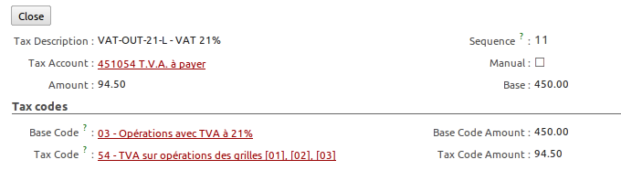

.. i18n: Invoices
.. i18n: ========
..

发票 
========

.. i18n: In OpenERP, the concept of “invoice” includes the following documents:
..

OpenERP中, 发票管理包含以下部分:

.. i18n: * The Customer Invoice
.. i18n: 
.. i18n: * The Supplier Invoice
.. i18n: 
.. i18n: * A Customer Credit Note or Customer Refund
.. i18n: 
.. i18n: * A Supplier Credit Note or Supplier Refund
..

* 客户发票

* 供应商发票

* 客户红字发票

* 供应商红字发票

.. i18n: Only the invoice type and the representation mode differ for each of the four documents. But they are
.. i18n: all stored in the same object type in the system.
..

这四类发票在系统是中同一对象, 仅仅只是发票类型与界面展现方式不一样.

.. i18n: You get the correct form for each of the four types of invoice from the menu you use to open it. The
.. i18n: name of the tab enables you to tell the invoice types apart when you are working on them.
..

OpenERP 为这四种类型的发票对应设置了四个菜单项,不同的菜单项会打开对应的发票表单, 从表单名就可以区分开.

.. i18n: .. index::
.. i18n:    single: invoices; types
..

.. index::
   single: invoices; types

.. i18n: .. note::  Types of Invoice
.. i18n: 
.. i18n:         There are many advantages in deriving the different types of invoice from the same object. Two of the
.. i18n:         most important are:
.. i18n: 
.. i18n:         * In a multi-company environment with inter-company invoicing, a customer invoice in one company
.. i18n:           becomes a supplier invoice for the other,
.. i18n: 
.. i18n:         * This enables you to work and search for all invoices from the same menu. If you are looking for an
.. i18n:           invoicing history, OpenERP provides both supplier and customer invoices in the same list, as well
.. i18n:           as credit notes.
..

.. note::  发票类型

        多类型发票使用同一对象有很多方便之处,典型的优势如以下两点:

        * 多公司环境时公司间的发票,一个公司的客户发票则转为另一个公司的供应商发票.

        * 在同一个界面下, 你可以检索和处理各种类型的发票.在处理合作伙伴的应收/付帐时,你可以很清楚在这个列表中列出.

.. i18n: .. index::
.. i18n:    single: credit note
..

.. index::
   single: credit note

.. i18n: .. note:: Credit Note
.. i18n: 
.. i18n:    A credit note is a document that enables you to cancel an invoice or part of an invoice.
..

.. note:: Credit Note

   A credit note is a document that enables you to cancel an invoice or part of an invoice.

.. i18n: To access customer invoices in OpenERP, use the menu :menuselection:`Accounting -->
.. i18n: Customers --> Customer Invoices`, and for supplier invoices, use the menu :menuselection:`Accounting -->
.. i18n: Suppliers --> Supplier Invoices`.
..

点击菜单 :menuselection:`会计(Accounting) --> 客户(Customers) --> 客户发票(Customer Invoices)` 进入客户发票列表.
点击菜单 :menuselection:`会计(Accounting) --> 供应商(Suppliers) --> 供应商发票(Supplier Invoices)` 进入供应商发票列表.

.. i18n: Most of the time, invoices are generated automatically by OpenERP as they are generated from other
.. i18n: processes in the system. So it is not usually necessary to create them manually, but simply approve
.. i18n: or validate them. OpenERP uses the following different ways of generating invoices:
..

通常情况,OpenERP中的发票都是由业务系统自动生成出来的.所以,一般不需要手工创建发票,只需要轻轻一点确认或审核即可.
OpenERP中一般有下面的几种途径去生成发票:

.. i18n: * from Supplier or Customer Orders,
.. i18n: 
.. i18n: * from receipt or dispatch of goods,
.. i18n: 
.. i18n: * from work carried out (timesheets, see :ref:`ch-hr`),
.. i18n: 
.. i18n: * from closed tasks (see :ref:`ch-projects`),
.. i18n: 
.. i18n: * from fee charges or other rechargeable expenses (see :ref:`ch-services`).
..

* 来自供应商与客户的订单,

* from receipt or dispatch of goods,

* 来自员工工单(timesheets, 参阅 :ref:`ch-hr`),

* 来自完成的项目工作 (参阅 :ref:`ch-projects`),

* from fee charges or other rechargeable expenses (see :ref:`ch-services`).

.. i18n: The different processes generate \ ``Draft``\   invoices. These must then be approved by a suitable
.. i18n: system user and sent to the customer. The different invoicing methods are detailed in the following
.. i18n: sections and chapters.
..

The different processes generate \ ``Draft``\   invoices. These must then be approved by a suitable
system user and sent to the customer. The different invoicing methods are detailed in the following
sections and chapters.

.. i18n: It is also possible to enter invoices manually. This is usually done for invoices that are not
.. i18n: associated with an order (usually purchase orders) or Credit Notes. Also, if the system has not been
.. i18n: configured correctly you might need to edit the invoice before sending it to the customer.
..

It is also possible to enter invoices manually. This is usually done for invoices that are not
associated with an order (usually purchase orders) or Credit Notes. Also, if the system has not been
configured correctly you might need to edit the invoice before sending it to the customer.

.. i18n: For example, if you have not realized that the customer is tax-exempt, the invoice you generate from an
.. i18n: order will contain tax at the normal rates. It is then possible to edit this out of the invoice
.. i18n: before validating it.
..

For example, if you have not realized that the customer is tax-exempt, the invoice you generate from an
order will contain tax at the normal rates. It is then possible to edit this out of the invoice
before validating it.

.. i18n: Entering a Customer Invoice
.. i18n: ---------------------------
..

录入客户发票
---------------------------

.. i18n: The principle of entering data for invoices in OpenERP is very simple, as it enables non-
.. i18n: accountant users to create their own invoices. This means that your accounting information can be
.. i18n: kept up-to-date all the time as orders are placed and received, and their taxes are calculated.
..

OpenERP 的发票录入相当方便,而且支持非财务人员录入相应的发票信息.这意味着发票在生成到收款期间,随时可以保证
发票数据及相应税额计算的更新.

.. i18n: At the same time, it allows people who have more accounting knowledge to keep full control over the
.. i18n: accounting entries that are being generated. Each value proposed by OpenERP can be modified later
.. i18n: if needed.
..

同时,具有会计权限的员工可以完成后续的凭证分录的处理.并且分录中的数据还可以继续修改确认.

.. i18n: Start by manually entering a customer invoice. Use :menuselection:`Accounting -->
.. i18n: Customers --> Customer Invoices` and click on `New` button for this.
..

点击菜单 :menuselection:`会计(Accounting) --> 客户(Customers) --> 客户发票(Customer Invoices)` 进入客户发票列表, 再点击 `新建(New)` 按钮
即可创建一张新的客户发票.

.. i18n: A new invoice form opens for entering information.
..

在新打开的发票窗体中,输入下面的信息.

.. i18n: .. figure::  images/account_invoice_new.png
.. i18n:    :scale: 75
.. i18n:    :align: center
.. i18n: 
.. i18n:    *Entering a New Invoice*
..

.. figure::  images/account_invoice_new.png
   :scale: 75
   :align: center

   *输入新发票*

.. i18n: The document is composed of three parts:
..

发票包含以下三部分:

.. i18n: * the top of the invoice, with customer information,
.. i18n: 
.. i18n: * the main body of the invoice, with detailed invoice lines,
.. i18n: 
.. i18n: * the bottom of the page, with detail about the taxes, and the totals.
..

* 发票的抬头,是客户相关信息,

* 发票主体部分,则是发票的明细行,

* 发票的下面部分,则是关于所缴税行明细以及发票的汇总.

.. i18n: To enter a document in OpenERP, you should always fill in fields in the order they appear on
.. i18n: screen. Doing it this way means that some of the later fields are filled in automatically from the
.. i18n: selections made in earlier fields. So select the `Customer`, and the following fields are
.. i18n: completed automatically:
..

在填写发票信息的时候,你最好按OpenERP表单上的顺序填定数据.这样的目的是为了让你在录入一些数据后,能自动带出
其他字段的值.如,你选择一个客户后,下面的这些字段会被自动带出来:

.. i18n: * the invoice address corresponds to the customer contact that was given the address type of
.. i18n:   `Invoice` in the partner form (or otherwise the address type of `Default`),
.. i18n: 
.. i18n: * the partner account corresponds to the account given in the `Accounting` which is found in a
.. i18n:   tab of the partner form,
.. i18n: 
.. i18n: * a specific or a default payment condition can be defined for this partner in the
.. i18n:   `Accounting` tab of the partner form. Payment conditions are generated by rules for the payment of
.. i18n:   the invoice. For example: 50% in 21 days and 50% in 60 days from the end of the month.
..

* 发票地址 默认使用了该客户联系人的发票地址,如果没有发票地址,则使用该客户联系人的默认地址,

* 客户应收账款科目 默认使用了该客户窗体中 `会计` 页签中的 `应收账款` 科目,

* 付款条件 也默认使用了该客户窗体中 `会计` 页签中的 `付款条件`, 如: "21天内付50%并在60天内付清余款".

.. i18n: .. index::
.. i18n:    pair: properties; field
..

.. index::
   pair: properties; field

.. i18n: .. note:: Properties Fields
.. i18n: 
.. i18n:         The Properties fields on the Partner form or the Product form are multi-company fields. The value
.. i18n:         that the user sees in these fields depends on the company that the user works for.
.. i18n: 
.. i18n:         If you work in a multi-company environment that is using one database, you have several charts of
.. i18n:         accounts. Asset and liability accounts for a partner depend on the company that the user works for.
..

.. note:: Properties 字段

        ``合作伙伴`` 或者 ``产品`` 上的 `Property` 字段是多公司类型的. 该字段的值取决于当前用户所属公司.

        在一个账套上使用多公司配置,你可能需要为每个公司配置财务报表. 而且合作伙伴的 `资产` 与 `负债` 科目是也按公司分开的.

.. i18n: .. index::
.. i18n:    single: navigating relationships
.. i18n:    single: right-click
..

.. index::
   single: navigating relationships
   single: right-click

.. i18n: .. tip:: Seeing Partner Relationships
.. i18n: 
.. i18n:    You can reach more information from certain relation fields in OpenERP.
.. i18n: 
.. i18n:    * In the web client in read-only mode, a relation is commonly a hyperlink
.. i18n:      - it takes you to the main form for that entity, with all of the actions and links.
.. i18n: 
.. i18n:    * In the web client in edit mode you can right-click in the field to get a
.. i18n:      context menu with links and other options.
.. i18n: 
.. i18n:    * And in the GTK client you can right-click the field to get that same
.. i18n:      context menu.
.. i18n: 
.. i18n:    So one way or another you can rapidly reach the partner's:
.. i18n: 
.. i18n:    * current sales and purchases,
.. i18n: 
.. i18n:    * CRM requests,
.. i18n: 
.. i18n:    * open invoices,
.. i18n: 
.. i18n:    * accounts records,
.. i18n: 
.. i18n:    * payable and receivable accounts.
..

.. tip:: Seeing Partner Relationships

   在OpenERP中, 你很多数据是相互关联的. 从某一个字段,可以引出相关的很多其他数据信息.

   * In the web client in read-only mode, a relation is commonly a hyperlink
     - it takes you to the main form for that entity, with all of the actions and links.

   * 使用浏览器访问时,在编辑模式下,你可以在字段上使用鼠标右键得到相关的功能菜单.

   * 在GTK客户端里,右键点击字段,可以得到一样的结果.

   So one way or another you can rapidly reach the partner's:

   * current sales and purchases,

   * CRM requests,

   * 草稿状态发票,

   * accounts records,

   * 应收/应付科目.

.. i18n: You can add more detailed additional information to the invoice and select the currency that you want to invoice in.
..

录入发票其他相关内容并选择适当的发票币种.

.. i18n: Once the invoice heading is saved, you must enter the different invoice lines. You could use either
.. i18n: of the two techniques:
..

发票表头输入完成后, 输入表体部分时, 你可以用下面两种方式来输入:

.. i18n: * enter the whole field manually,
.. i18n: 
.. i18n: * use a product to complete the different fields automatically.
..

* 表体各字段手工输入,

* 选择一个产品, 让产品相关数据自动完成相关字段的输入.

.. i18n: .. tip:: Invoice Line Description
.. i18n: 
.. i18n:         The invoice line description is more of a title than a comment. If you want to add more detailed
.. i18n:         comments you can use the field in the second tab `Notes`.
..

.. tip:: 发票明细备注

        发票明细备注是对于明细摘要的补充.如果你对于发票明细添加更多的说明时,你只需要在明细窗体中的 `备注(notes)` 
        字段中输入即可.

.. i18n: So select the product \ ``Basic PC`` \ in the product field in an invoice line. The
.. i18n: following fields are then completed automatically:
..

接下去, 发票行选择 \ ``电脑兼容主机`` \ 产品, 下面的字段会自动带出:

.. i18n: *  `Description` : this comes from the product, in the language of the partner,
.. i18n: 
.. i18n: *  `Account` : determined by the purchase or sales account defined in the
.. i18n:    product properties. If no account is specified in the product form, OpenERP uses the properties of
.. i18n:    the category that the product is associated with.
.. i18n: 
.. i18n: *  `Unit of Measure` : this is defined by default in the product form,
.. i18n: 
.. i18n: *  `Unit Price` : this is given by the sales price in the product form and is expressed
.. i18n:    without taxes,
.. i18n: 
.. i18n: *  `Taxes` : provided by the product form and the partner form.
..

*  `摘要(Description)` : 默认由合作伙伴的产品名称带出,

*  `Account` : determined by the purchase or sales account defined in the
   product properties. If no account is specified in the product form, OpenERP uses the properties of
   the category that the product is associated with.

*  `计量单位(Unit of Measure)` : 默认由选择的产品的计量单位带出,

*  `Unit Price` : this is given by the sales price in the product form and is expressed
   without taxes,

*  `Taxes` : provided by the product form and the partner form.

.. i18n: .. index::
.. i18n:    single: module; account_tax_include
..

.. index::
   single: module; account_tax_include

.. i18n: .. tip::  Managing the Price with Tax Included
.. i18n: 
.. i18n:         By default, OpenERP invoices and processes the price without taxes – they are managed as a
.. i18n:         separate amount.
.. i18n:         OpenERP can manage tax inclusive prices when you check the `Tax Included in Price` field true when configuring
.. i18n:         the tax.
..

.. tip::  Managing the Price with Tax Included

        By default, OpenERP invoices and processes the price without taxes – they are managed as a
        separate amount.
        OpenERP can manage tax inclusive prices when you check the `Tax Included in Price` field true when configuring
        the tax.

.. i18n: .. note:: Information about the Product
.. i18n: 
.. i18n:         When you are entering invoice data, it can sometimes be useful to get hold of more information about
.. i18n:         the product you are invoicing.
.. i18n:         Since you are already in edit mode, you would use a right mouse-click
.. i18n:         on the `Product` field
.. i18n:         (in both the web and the GTK clients).
.. i18n:         Then select the available reports. OpenERP provides three standard reports about the product:
.. i18n: 
.. i18n:         * forecasts of future stock,
.. i18n: 
.. i18n:         * product cost structure,
.. i18n: 
.. i18n:         * location of the product in your warehouses.
..

.. note:: 产品相关信息

        When you are entering invoice data, it can sometimes be useful to get hold of more information about
        the product you are invoicing.
        Since you are already in edit mode, you would use a right mouse-click
        on the `Product` field
        (in both the web and the GTK clients).
        Then select the available reports. OpenERP provides three standard reports about the product:

        * 库存预测,

        * 产品成本结构,

        * 仓库产品库位.

.. i18n: You can enter several invoice lines and modify the values that are automatically completed
.. i18n: by OpenERP.
..

You can enter several invoice lines and modify the values that are automatically completed
by OpenERP.

.. i18n: Once the invoice lines have been entered, you can click `Compute Taxes` on the invoice to get
.. i18n: the following information:
..

Once the invoice lines have been entered, you can click `Compute Taxes` on the invoice to get
the following information:

.. i18n: * details of tax calculated,
.. i18n: 
.. i18n: * tax rate,
.. i18n: 
.. i18n: * total taxes,
.. i18n: 
.. i18n: * total price.
..

* details of tax calculated,

* tax rate,

* total taxes,

* total price.

.. i18n: In the `Taxes` area at the bottom left of the invoice you will find the details of the totals
.. i18n: calculated for different tax rates used in the invoice.
..

In the `Taxes` area at the bottom left of the invoice you will find the details of the totals
calculated for different tax rates used in the invoice.

.. i18n: .. tip::  Tax Calculations
.. i18n: 
.. i18n:         You can double-click one of the lines in the tax summary areas in the invoice.
.. i18n: 
.. i18n:         OpenERP then shows you the detail of the tax charges which will form your tax
.. i18n:         declaration at the end of the period.
.. i18n: 
.. i18n:         It shows you the total that will be computed in the different parts of the legal declaration. This
.. i18n:         enables you to manage the declaration in OpenERP automatically.
..

.. tip::  Tax Calculations

        You can double-click one of the lines in the tax summary areas in the invoice.

        OpenERP then shows you the detail of the tax charges which will form your tax
        declaration at the end of the period.

        It shows you the total that will be computed in the different parts of the legal declaration. This
        enables you to manage the declaration in OpenERP automatically.

.. i18n: .. figure::  images/account_invoice_tva.png
.. i18n:    :scale: 75
.. i18n:    :align: center
.. i18n: 
.. i18n:    *Detail of tax charges on an invoice*
..

   *Detail of tax charges on an invoice*

.. i18n: Before approving the invoice you can modify the date and the accounting period, which are entered by
.. i18n: default as today's date. These fields are found on the second tab `Other Info`.
..

Before approving the invoice you can modify the date and the accounting period, which are entered by
default as today's date. These fields are found on the second tab `Other Info`.

.. i18n: .. index::
.. i18n:    single: invoice layout
.. i18n:    single: module; account_invoice_layout
..

.. index::
   single: invoice layout
   single: module; account_invoice_layout

.. i18n: .. note:: Invoice Layout
.. i18n: 
.. i18n:         If you want to make your invoice layout more elaborate you can install the module
.. i18n:         :mod:`account_invoice_layout`. This enables you to add various elements between the lines such as
.. i18n:         subtotals, sections, separators and notes.
..

.. note:: Invoice Layout

        If you want to make your invoice layout more elaborate you can install the module
        :mod:`account_invoice_layout`. This enables you to add various elements between the lines such as
        subtotals, sections, separators and notes.

.. i18n: Click `Validate` when you want to approve the invoice. It moves from the \ ``Draft`` \
.. i18n: state to the \ ``Open``\   state.
..

Click `Validate` when you want to approve the invoice. It moves from the \ ``Draft`` \
state to the \ ``Open``\   state.

.. i18n: When you have validated an invoice, OpenERP gives it a unique number from a defined sequence. By
.. i18n: default it takes the form \ ``Journal Code/Year/Sequence Number`` \ for example, \ ``SAJ/2010/005`` \. You cannot modify an
.. i18n: invoice number, but instead, you should modify the sequence numbers through the menu :menuselection:`Administration --> Configuration --> Sequences --> Sequences`.
..

When you have validated an invoice, OpenERP gives it a unique number from a defined sequence. By
default it takes the form \ ``Journal Code/Year/Sequence Number`` \ for example, \ ``SAJ/2010/005`` \. You cannot modify an
invoice number, but instead, you should modify the sequence numbers through the menu :menuselection:`Administration --> Configuration --> Sequences --> Sequences`.

.. i18n: Accounting entries corresponding to this invoice are automatically generated when you approve the
.. i18n: invoice. You see the details by clicking the entry in the `Journal Entry` field and searching
.. i18n: there for the account moves generated by that invoice number.
..

Accounting entries corresponding to this invoice are automatically generated when you approve the
invoice. You see the details by clicking the entry in the `Journal Entry` field and searching
there for the account moves generated by that invoice number.

.. i18n: Tax Management
.. i18n: --------------
..

税的管理
--------------

.. i18n: Details on the product form determine the selection of applicable taxes for an
.. i18n: invoice line. By default, OpenERP takes account of all the taxes defined in the product form.
..

Details on the product form determine the selection of applicable taxes for an
invoice line. By default, OpenERP takes account of all the taxes defined in the product form.

.. i18n: Take the case of the following product
..

Take the case of the following product

.. i18n: * Applicable taxes:
.. i18n: 
.. i18n:         - TVA: 19.6% type TVA
.. i18n: 
.. i18n:         - DEEE: 5.5, type DEEE
..

* Applicable taxes:

        - TVA: 19.6% type TVA

        - DEEE: 5.5, type DEEE

.. i18n: .. index::
.. i18n:    single: DEEE tax
..

.. index::
   single: DEEE tax

.. i18n: .. note:: DEEE Tax
.. i18n: 
.. i18n:         The DEEE tax (disposal of electronic and electrical equipment) is an ecological tax that was
.. i18n:         imposed in France from 2009. It is applied to batteries to finance their recycling and is a fixed
.. i18n:         sum that is applied to the before-tax amount on the invoice.
..

.. note:: DEEE Tax

        The DEEE tax (disposal of electronic and electrical equipment) is an ecological tax that was
        imposed in France from 2009. It is applied to batteries to finance their recycling and is a fixed
        sum that is applied to the before-tax amount on the invoice.

.. i18n: If you trade with a company in your own country, and your country has a DEEE-type tax, the
.. i18n: applicable taxes for this invoice could be:
..

If you trade with a company in your own country, and your country has a DEEE-type tax, the
applicable taxes for this invoice could be:

.. i18n: * DEEE: 5.5,
.. i18n: 
.. i18n: * TVA: 19.6%.
..

* DEEE: 5.5,

* TVA: 19.6%.

.. i18n: If you sell to a customer in another company in the community (intracommunity), instead, then tax is
.. i18n: not charged. In the partner form, in the tab `Accounting`, the field `Fiscal Position`
.. i18n: maintains information whether the customer is within the region or not. When you create an invoice for this customer, OpenERP will calculate the following taxes on the product:
..

If you sell to a customer in another company in the community (intracommunity), instead, then tax is
not charged. In the partner form, in the tab `Accounting`, the field `Fiscal Position`
maintains information whether the customer is within the region or not. When you create an invoice for this customer, OpenERP will calculate the following taxes on the product:

.. i18n: * DEEE: 5.5,
.. i18n: 
.. i18n: * TVA intracommunity: 0%.
..

* DEEE: 5.5,

* TVA intracommunity: 0%.

.. i18n: If you have not entered the parameters in the customer form correctly, OpenERP will suggest incorrect
.. i18n: taxes in the invoice. That is not a real issue, because you can always modify the
.. i18n: information directly in the invoice before approving it.
..

If you have not entered the parameters in the customer form correctly, OpenERP will suggest incorrect
taxes in the invoice. That is not a real issue, because you can always modify the
information directly in the invoice before approving it.

.. i18n: .. tip:: Occasional Invoices
.. i18n: 
.. i18n:         When you create an invoice for a product that will only be bought or sold once, you do not have to
.. i18n:         encode a new product.
.. i18n:         Instead, you will have to provide quite a bit of information manually on the invoice line:
.. i18n: 
.. i18n:         * sales price,
.. i18n: 
.. i18n:         * applicable taxes,
.. i18n: 
.. i18n:         * account,
.. i18n: 
.. i18n:         * product description.
..

.. tip:: Occasional Invoices

        When you create an invoice for a product that will only be bought or sold once, you do not have to
        encode a new product.
        Instead, you will have to provide quite a bit of information manually on the invoice line:

        * sales price,

        * applicable taxes,

        * account,

        * product description.

.. i18n: Cancelling an Invoice
.. i18n: ---------------------
..

取消发票
---------------------

.. i18n: By default, OpenERP will not allow you to cancel an invoice once it has been approved. Since
.. i18n: accounting entries have been created, you theoretically cannot go back and delete them. However, in
.. i18n: some cases, it is more convenient to cancel an invoice when there is an error than to produce a credit
.. i18n: note and reconcile the two entries. Your attitude to this will be influenced by current legislation
.. i18n: in your accounting jurisdiction and your adherence to accounting purity.
..

By default, OpenERP will not allow you to cancel an invoice once it has been approved. Since
accounting entries have been created, you theoretically cannot go back and delete them. However, in
some cases, it is more convenient to cancel an invoice when there is an error than to produce a credit
note and reconcile the two entries. Your attitude to this will be influenced by current legislation
in your accounting jurisdiction and your adherence to accounting purity.

.. i18n: OpenERP accommodates either approach. Install the account_cancel module. Then allow cancelling an invoice by checking the box
.. i18n: `Allow Cancelling Entries` in the Journal corresponding to this invoice. You will then be allowed to
.. i18n: cancel the invoice if the following two conditions are met:
..

OpenERP accommodates either approach. Install the account_cancel module. Then allow cancelling an invoice by checking the box
`Allow Cancelling Entries` in the Journal corresponding to this invoice. You will then be allowed to
cancel the invoice if the following two conditions are met:

.. i18n:         #. The accounting entries have not been reconciled or paid: if they have, then you will have to cancel
.. i18n:            the reconciliation first.
.. i18n: 
.. i18n:         #. The accounting period or the fiscal year has not already been closed: if it is closed then no
.. i18n:            modification is possible.
..

        #. The accounting entries have not been reconciled or paid: if they have, then you will have to cancel
           the reconciliation first.

        #. The accounting period or the fiscal year has not already been closed: if it is closed then no
           modification is possible.

.. i18n: Cancelling an invoice has the effect of automatically modifying the corresponding accounting
.. i18n: entries.
..

Cancelling an invoice has the effect of automatically modifying the corresponding accounting
entries.

.. i18n: To be able to cancel invoices, you should install the module :mod:`account_cancel`. You can cancel an invoice if the :guilabel:`Allow Cancelling Entries` function has been activated in the journal and the entries have not yet been reconciled. You could then move it from \ ``Cancelled`` \
.. i18n: to the \ ``Draft`` \ state to modify it and regenerate it.
..

要能取消发票, 你需要安装 :mod:`account_cancel` 模块, 并在你可以取消发票的账簿里配置 :guilabel:`允许取消发票(Allow Cancelling Entries)` 勾选项.
这时,只要未核销的发票均可以取消该发票, 并重置该发票到 `草稿(Draft)` 状态.

.. i18n: .. tip::  Numbering Invoices
.. i18n: 
.. i18n:         Some countries require you to have contiguously numbered invoices (that is, with no break in the sequence).
.. i18n:         If, after cancelling an invoice that you are not regenerating,
.. i18n:         you find yourself with a break in the numbering you would have to go and modify the sequence,
.. i18n:         redo the invoice and replace the sequence number with its original value.
.. i18n: 
.. i18n:         You can control the sequences using the menu :menuselection:`Administration --> Configuration -->
.. i18n:         Sequences --> Sequences`.
..

.. tip::  Numbering Invoices

        Some countries require you to have contiguously numbered invoices (that is, with no break in the sequence).
        If, after cancelling an invoice that you are not regenerating,
        you find yourself with a break in the numbering you would have to go and modify the sequence,
        redo the invoice and replace the sequence number with its original value.

        You can control the sequences using the menu :menuselection:`Administration --> Configuration -->
        Sequences --> Sequences`.

.. i18n: Cancelling an invoice will cause a break in the number sequence of your invoices. You are
.. i18n: strongly advised to recreate this invoice and re-approve it to fill the hole in the numbering if you can.
..

Cancelling an invoice will cause a break in the number sequence of your invoices. You are
strongly advised to recreate this invoice and re-approve it to fill the hole in the numbering if you can.

.. i18n: .. tip:: Duplicating a Document
.. i18n: 
.. i18n:         The duplication function can be applied to all the system documents: you can duplicate anything –
.. i18n:         a product, an order, or a delivery.
..

.. tip:: Duplicating a Document

        The duplication function can be applied to all the system documents: you can duplicate anything –
        a product, an order, or a delivery.

.. i18n: .. note:: Duplicating Invoices
.. i18n: 
.. i18n:         Instead of entering a new invoice each time, you can base an invoice on a similar preceding one
.. i18n:         and duplicate it. To do this, first search for a suitable existing invoice. In the web client, show
.. i18n:         the invoice in read-only (non-editable) form view, then click `Duplicate`. In the GTK client,
.. i18n:         select :menuselection:`Form --> Duplicate` from the top menu.
.. i18n: 
.. i18n:         The duplication creates a new invoice in the ``Draft`` state. That enables you to modify it before
.. i18n:         approving it. Duplicating documents in OpenERP is an intelligent function, which enables the
.. i18n:         duplicated invoice to be given its own sequence number, today's date, and the draft state, even if
.. i18n:         the preceding invoice has been paid.
..

.. note:: Duplicating Invoices

        Instead of entering a new invoice each time, you can base an invoice on a similar preceding one
        and duplicate it. To do this, first search for a suitable existing invoice. In the web client, show
        the invoice in read-only (non-editable) form view, then click `Duplicate`. In the GTK client,
        select :menuselection:`Form --> Duplicate` from the top menu.

        The duplication creates a new invoice in the ``Draft`` state. That enables you to modify it before
        approving it. Duplicating documents in OpenERP is an intelligent function, which enables the
        duplicated invoice to be given its own sequence number, today's date, and the draft state, even if
        the preceding invoice has been paid.

.. i18n: .. note:: Saving Partner Preferences
.. i18n: 
.. i18n:         OpenERP has many functions to help you enter data quickly. If you invoice the same products
.. i18n:         frequently for the same partner you can save the last invoice preferences using conditional
.. i18n:         default values.
.. i18n: 
.. i18n:         To test this functionality, create an invoice for a partner and add some lines
.. i18n:         (from the GTK client). Then right-click on the `Invoice Line` field and select
.. i18n:         `Set Default`. Check the box that indicates this default should apply only to you.
.. i18n: 
.. i18n:         Then the next time you create an invoice, these invoice lines will be
.. i18n:         automatically created and you will only have to modify the quantities before confirming the invoice.
.. i18n: 
.. i18n:         For taxes, you could put the default amount in the invoice lines (in France it would be
.. i18n:         19.6%, in Belgium 21%, in the UK 17.5% or 15%). Doing this, you will not forget to add tax when you are
.. i18n:         manually entering invoices.
.. i18n: 
.. i18n:         (The capabilities of the GTK client are more extensive than those of the web client.
.. i18n:         You can set defaults for multiple lines in the GTK client but only a single line in the web client,
.. i18n:         so you need to be quite sure what is possible before you use this functionality routinely.)
..

.. note:: Saving Partner Preferences

        OpenERP has many functions to help you enter data quickly. If you invoice the same products
        frequently for the same partner you can save the last invoice preferences using conditional
        default values.

        To test this functionality, create an invoice for a partner and add some lines
        (from the GTK client). Then right-click on the `Invoice Line` field and select
        `Set Default`. Check the box that indicates this default should apply only to you.

        Then the next time you create an invoice, these invoice lines will be
        automatically created and you will only have to modify the quantities before confirming the invoice.

        For taxes, you could put the default amount in the invoice lines (in France it would be
        19.6%, in Belgium 21%, in the UK 17.5% or 15%). Doing this, you will not forget to add tax when you are
        manually entering invoices.

        (The capabilities of the GTK client are more extensive than those of the web client.
        You can set defaults for multiple lines in the GTK client but only a single line in the web client,
        so you need to be quite sure what is possible before you use this functionality routinely.)

.. i18n: .. note:: Getting Information by Navigating to it
.. i18n: 
.. i18n:         As you are creating an invoice you will often find you need extra information about the partner to
.. i18n:         help you complete the invoice. As described earlier, you can navigate to other
.. i18n:         information linked to this partner by right-clicking, such as:
.. i18n: 
.. i18n:         * Monthly Turnover
.. i18n: 
.. i18n:         * Benefit Details,
.. i18n: 
.. i18n:         * Most Recent Invoices,
.. i18n: 
.. i18n:         * Latest Orders - Sales Order, Purchase Order.
.. i18n: 
.. i18n:         Do the same to get information about the products you are invoicing. For example: is there enough
.. i18n:         stock? When will you be getting more stocks in? What are the costs and normal list prices for this
.. i18n:         product?
.. i18n: 
.. i18n:         By making this information easily accessible while you are invoicing, OpenERP greatly simplifies
.. i18n:         your work in creating the invoice.
..

.. note:: Getting Information by Navigating to it

        As you are creating an invoice you will often find you need extra information about the partner to
        help you complete the invoice. As described earlier, you can navigate to other
        information linked to this partner by right-clicking, such as:

        * Monthly Turnover

        * Benefit Details,

        * Most Recent Invoices,

        * Latest Orders - Sales Order, Purchase Order.

        Do the same to get information about the products you are invoicing. For example: is there enough
        stock? When will you be getting more stocks in? What are the costs and normal list prices for this
        product?

        By making this information easily accessible while you are invoicing, OpenERP greatly simplifies
        your work in creating the invoice.

.. i18n: Creating a Supplier Invoice
.. i18n: ---------------------------
..

创建供应商发票
---------------------------

.. i18n: The form that manages supplier invoices is very similar to the one for customer invoices. However,
.. i18n: it has been adapted to simplify rapid data entry and monitoring of the amounts recorded.
..

The form that manages supplier invoices is very similar to the one for customer invoices. However,
it has been adapted to simplify rapid data entry and monitoring of the amounts recorded.

.. i18n: .. tip::  Entering Data
.. i18n: 
.. i18n:         Many companies do not enter data on supplier invoices, but simply enter accounting data corresponding to
.. i18n:         the purchase journal.
.. i18n: 
.. i18n:         This particularly applies to users that have focused on the accounting system rather than all the
.. i18n:         capabilities provided by an ERP system.
.. i18n:         The two approaches reach the same accounting result: some prefer one and others prefer the other
.. i18n:         depending on their skills.
.. i18n: 
.. i18n:         However, when you use the Purchase Management functions in OpenERP you should work directly on
.. i18n:         invoices because they are provided from Purchase Orders or Goods Receipt documents.
..

.. tip::  Entering Data

        Many companies do not enter data on supplier invoices, but simply enter accounting data corresponding to
        the purchase journal.

        This particularly applies to users that have focused on the accounting system rather than all the
        capabilities provided by an ERP system.
        The two approaches reach the same accounting result: some prefer one and others prefer the other
        depending on their skills.

        However, when you use the Purchase Management functions in OpenERP you should work directly on
        invoices because they are provided from Purchase Orders or Goods Receipt documents.

.. i18n: To enter a new supplier invoice, use the menu :menuselection:`Accounting --> Suppliers --> Supplier Invoices`.
..

To enter a new supplier invoice, use the menu :menuselection:`Accounting --> Suppliers --> Supplier Invoices`.

.. i18n: Everything is similar to the customer invoice, starting with the `Journal`
.. i18n: unless the default is acceptable, and then the `Supplier`, which will automatically complete the following fields
..

Everything is similar to the customer invoice, starting with the `Journal`
unless the default is acceptable, and then the `Supplier`, which will automatically complete the following fields

.. i18n: * `Invoice Address`,
.. i18n: 
.. i18n: * Partner `Account`.
..

* `Invoice Address`,

* Partner `Account`.

.. i18n: Unlike the customer invoice, you do not have to enter payment conditions – simply a `Due
.. i18n: Date` if you want one.
.. i18n: If you do not give a due date, OpenERP assumes that this invoice will be paid in cash.
.. i18n: If you want to enter more complete payment conditions than just the due date, you can use the `Payment
.. i18n: Term` field which you can find on the second tab `Other Info`.
..

Unlike the customer invoice, you do not have to enter payment conditions – simply a `Due
Date` if you want one.
If you do not give a due date, OpenERP assumes that this invoice will be paid in cash.
If you want to enter more complete payment conditions than just the due date, you can use the `Payment
Term` field which you can find on the second tab `Other Info`.

.. i18n: You must also enter the invoice `Total` with taxes included. OpenERP uses this amount
.. i18n: to check whether all invoice lines have been entered correctly before it will let you validate the
.. i18n: invoice.
..

You must also enter the invoice `Total` with taxes included. OpenERP uses this amount
to check whether all invoice lines have been entered correctly before it will let you validate the
invoice.

.. i18n: Indicate the `Currency` if the invoice is not going to use the default currency, then you can enter
.. i18n: the `Invoice lines`.
..

Indicate the `Currency` if the invoice is not going to use the default currency, then you can enter
the `Invoice lines`.

.. i18n: Just like the customer invoice, you have the choice of entering all the information manually or use
.. i18n: a product to complete many of the fields automatically. When you enter a product, all of the following
.. i18n: values are completed automatically:
..

Just like the customer invoice, you have the choice of entering all the information manually or use
a product to complete many of the fields automatically. When you enter a product, all of the following
values are completed automatically:

.. i18n: * the product `Account` is completed from the properties of the product form or the
.. i18n:   `Category` of the product if nothing is defined on the product itself,
.. i18n: 
.. i18n: * the `Taxes` come from the product form and/or the partner form, based on the same
.. i18n:   principles as the customer invoice,
.. i18n: 
.. i18n: * the `Quantity` is set at 1 by default but can be changed manually,
.. i18n: 
.. i18n: * set the `Unit Price` from the total price you are quoted after deducting all
.. i18n:   the different applicable taxes,
..

* the product `Account` is completed from the properties of the product form or the
  `Category` of the product if nothing is defined on the product itself,

* the `Taxes` come from the product form and/or the partner form, based on the same
  principles as the customer invoice,

* the `Quantity` is set at 1 by default but can be changed manually,

* set the `Unit Price` from the total price you are quoted after deducting all
  the different applicable taxes,

.. i18n: Click `Compute Taxes` to ensure that the totals correspond to those indicated on
.. i18n: the paper invoice from the supplier. When you approve the invoice, OpenERP verifies that the total
.. i18n: amount indicated in the header corresponds to the sum of the amounts without tax on the invoice lines
.. i18n: and the different applicable taxes.
..

Click `Compute Taxes` to ensure that the totals correspond to those indicated on
the paper invoice from the supplier. When you approve the invoice, OpenERP verifies that the total
amount indicated in the header corresponds to the sum of the amounts without tax on the invoice lines
and the different applicable taxes.

.. i18n: OpenERP automatically completes the `Date Invoiced` and the accounting period.
..

OpenERP automatically completes the `Date Invoiced` and the accounting period.

.. i18n: .. index::
.. i18n:    single: declarations
..

.. index::
   single: declarations

.. i18n: .. note::  Dates and Accounting Periods
.. i18n: 
.. i18n:         Accounting periods are treated as legal period declarations. For example, a tax declaration for an
.. i18n:         invoice depends on the accounting period and not on the date of invoicing.
.. i18n: 
.. i18n:         Depending on whether your declarations are made monthly or quarterly, the fiscal year contains
.. i18n:         either twelve or four accounting periods.
.. i18n: 
.. i18n:         The dates are shown in the document you created in the accounting system. They are used for
.. i18n:         calculating due dates.
..

.. note::  Dates and Accounting Periods

        Accounting periods are treated as legal period declarations. For example, a tax declaration for an
        invoice depends on the accounting period and not on the date of invoicing.

        Depending on whether your declarations are made monthly or quarterly, the fiscal year contains
        either twelve or four accounting periods.

        The dates are shown in the document you created in the accounting system. They are used for
        calculating due dates.

.. i18n: .. index::
.. i18n:    pair: accounts; due date
..

.. index::
   pair: accounts; due date

.. i18n: The two pieces of information do not have to have the same date. If, for example, you receive an
.. i18n: invoice dated 5th January which relates to goods or services supplied before 31st December, the
.. i18n: invoice may be coded into the December accounting period and thus be recognized in that period for
.. i18n: the tax declaration, while the invoice can remain 5th January which remains the basis of the due
.. i18n: date for payment.
..

The two pieces of information do not have to have the same date. If, for example, you receive an
invoice dated 5th January which relates to goods or services supplied before 31st December, the
invoice may be coded into the December accounting period and thus be recognized in that period for
the tax declaration, while the invoice can remain 5th January which remains the basis of the due
date for payment.

.. i18n: You can find that the amounts do not correspond with what your supplier has given you on paper for
.. i18n: reasons that can include:
..

You can find that the amounts do not correspond with what your supplier has given you on paper for
reasons that can include:

.. i18n: * the supplier made a calculation error,
.. i18n: 
.. i18n: * the amounts have been rounded differently.
..

* the supplier made a calculation error,

* the amounts have been rounded differently.

.. i18n: .. tip:: Rounding Tax
.. i18n: 
.. i18n:         It often happens that a supplier adds 1 to the total because the tax calculation has been rounded
.. i18n:         upwards. Some tax amounts are not valid because of this rounding.
.. i18n: 
.. i18n:         For example, it is impossible to arrive at the amount of 145.50 if you are working to a precision of 2
.. i18n:         decimal places and a rate of 19.6%:
.. i18n: 
.. i18n:         * 121.65 x 1.196 = 145.49
.. i18n: 
.. i18n:         * 121.66 x 1.196 = 145.51
..

.. tip:: Rounding Tax

        It often happens that a supplier adds 1 to the total because the tax calculation has been rounded
        upwards. Some tax amounts are not valid because of this rounding.

        For example, it is impossible to arrive at the amount of 145.50 if you are working to a precision of 2
        decimal places and a rate of 19.6%:

        * 121.65 x 1.196 = 145.49

        * 121.66 x 1.196 = 145.51

.. i18n: In this case you can modify a value in the lines that the total is based on, or the total amount of
.. i18n: taxes at the bottom left of the form: both are editable so that you can modify them to adjust the
.. i18n: total.
..

In this case you can modify a value in the lines that the total is based on, or the total amount of
taxes at the bottom left of the form: both are editable so that you can modify them to adjust the
total.

.. i18n: When the totals tally, you can validate the invoice. OpenERP then generates the corresponding
.. i18n: accounting entries. You can manage those entries using the `Account` fields on the
.. i18n: invoice and on each of the invoice lines.
..

When the totals tally, you can validate the invoice. OpenERP then generates the corresponding
accounting entries. You can manage those entries using the `Account` fields on the
invoice and on each of the invoice lines.

.. i18n: .. index::
.. i18n:    single: Credit Notes
..

.. index::
   single: Credit Notes

.. i18n: Credit Notes / Refunds
.. i18n: ----------------------
..

欠款单据/ 偿还
----------------------

.. i18n: Entering a customer credit note is almost identical to entering a customer invoice. You just start
.. i18n: from the menu :menuselection:`Accounting --> Customers --> Customer Refunds`.
..

Entering a customer credit note is almost identical to entering a customer invoice. You just start
from the menu :menuselection:`Accounting --> Customers --> Customer Refunds`.

.. i18n: Similarly, entering a supplier credit note is the same as that of the supplier invoice, and so you
.. i18n: use the menu :menuselection:`Accounting --> Suppliers --> Supplier Refunds`.
..

Similarly, entering a supplier credit note is the same as that of the supplier invoice, and so you
use the menu :menuselection:`Accounting --> Suppliers --> Supplier Refunds`.

.. i18n: It is easy to generate a credit note quickly from an existing invoice. To do this, select a customer
.. i18n: or supplier invoice which is in ``Open`` or ``Paid`` state and click the `Refund` button. OpenERP
.. i18n: opens a new payment invoice form for you in the \ ``Draft``\   state so that you can modify it before
.. i18n: approval.
..

It is easy to generate a credit note quickly from an existing invoice. To do this, select a customer
or supplier invoice which is in ``Open`` or ``Paid`` state and click the `Refund` button. OpenERP
opens a new payment invoice form for you in the \ ``Draft``\   state so that you can modify it before
approval.

.. i18n: .. index::
.. i18n:    pair: multiple; selection
.. i18n:    pair: multiple; action
..

.. index::
   pair: multiple; selection
   pair: multiple; action

.. i18n: .. tip::  Crediting Several Invoices
.. i18n: 
.. i18n:         You can credit more than one customer invoice using the menu :menuselection:`Accounting --> Customers -->
.. i18n:         Customer Payment`. You can find the `Invoices and outstanding transactions` and `Credits` for the particular customers.
.. i18n:         Enter the amount in the field `Paid Amount` and validate it.
..

.. tip::  Crediting Several Invoices

        You can credit more than one customer invoice using the menu :menuselection:`Accounting --> Customers -->
        Customer Payment`. You can find the `Invoices and outstanding transactions` and `Credits` for the particular customers.
        Enter the amount in the field `Paid Amount` and validate it.

.. i18n: Payments
.. i18n: --------
..

支付
--------

.. i18n: An invoice is automatically marked as ``Paid`` by OpenERP once invoice entries have been reconciled
.. i18n: with payment entries. You yourself do not have to mark the invoices as paid: OpenERP manages that
.. i18n: when you reconcile your payments.
..

An invoice is automatically marked as ``Paid`` by OpenERP once invoice entries have been reconciled
with payment entries. You yourself do not have to mark the invoices as paid: OpenERP manages that
when you reconcile your payments.

.. i18n: .. tip::  Reconciling a Credit Note
.. i18n: 
.. i18n:         Generally, you reconcile the invoice's accounting entries with their payment(s).
.. i18n:         But you can also reconcile an invoice with the entries from the corresponding credit note instead,
.. i18n:         to mutually cancel them.
..

.. tip::  Reconciling a Credit Note

        Generally, you reconcile the invoice's accounting entries with their payment(s).
        But you can also reconcile an invoice with the entries from the corresponding credit note instead,
        to mutually cancel them.

.. i18n: You have seen the `Payment` button in the invoice form which is in ``Open`` state.
.. i18n: This lets you enter payments and get entries reconciled very quickly.
..

You have seen the `Payment` button in the invoice form which is in ``Open`` state.
This lets you enter payments and get entries reconciled very quickly.

.. i18n: You can also manage the payment of invoices when you are entering bank statements and cash
.. i18n: transactions. These allow better control of financial transactions and permit greater flexibility in
.. i18n: areas such as:
..

You can also manage the payment of invoices when you are entering bank statements and cash
transactions. These allow better control of financial transactions and permit greater flexibility in
areas such as:

.. i18n: * advance and partial payments of invoices,
.. i18n: 
.. i18n: * payment of several invoices by several payments,
.. i18n: 
.. i18n: * fine-grained management of different due dates on the same invoices,
.. i18n: 
.. i18n: * management of adjustments if there are different amounts to those on the invoice.
..

* advance and partial payments of invoices,

* payment of several invoices by several payments,

* fine-grained management of different due dates on the same invoices,

* management of adjustments if there are different amounts to those on the invoice.

.. i18n: .. Copyright © Open Object Press. All rights reserved.
..

.. Copyright © Open Object Press. All rights reserved.

.. i18n: .. You may take electronic copy of this publication and distribute it if you don't
.. i18n: .. change the content. You can also print a copy to be read by yourself only.
..

.. You may take electronic copy of this publication and distribute it if you don't
.. change the content. You can also print a copy to be read by yourself only.

.. i18n: .. We have contracts with different publishers in different countries to sell and
.. i18n: .. distribute paper or electronic based versions of this book (translated or not)
.. i18n: .. in bookstores. This helps to distribute and promote the OpenERP product. It
.. i18n: .. also helps us to create incentives to pay contributors and authors using author
.. i18n: .. rights of these sales.
..

.. We have contracts with different publishers in different countries to sell and
.. distribute paper or electronic based versions of this book (translated or not)
.. in bookstores. This helps to distribute and promote the OpenERP product. It
.. also helps us to create incentives to pay contributors and authors using author
.. rights of these sales.

.. i18n: .. Due to this, grants to translate, modify or sell this book are strictly
.. i18n: .. forbidden, unless Tiny SPRL (representing Open Object Press) gives you a
.. i18n: .. written authorisation for this.
..

.. Due to this, grants to translate, modify or sell this book are strictly
.. forbidden, unless Tiny SPRL (representing Open Object Press) gives you a
.. written authorisation for this.

.. i18n: .. Many of the designations used by manufacturers and suppliers to distinguish their
.. i18n: .. products are claimed as trademarks. Where those designations appear in this book,
.. i18n: .. and Open Object Press was aware of a trademark claim, the designations have been
.. i18n: .. printed in initial capitals.
..

.. Many of the designations used by manufacturers and suppliers to distinguish their
.. products are claimed as trademarks. Where those designations appear in this book,
.. and Open Object Press was aware of a trademark claim, the designations have been
.. printed in initial capitals.

.. i18n: .. While every precaution has been taken in the preparation of this book, the publisher
.. i18n: .. and the authors assume no responsibility for errors or omissions, or for damages
.. i18n: .. resulting from the use of the information contained herein.
..

.. While every precaution has been taken in the preparation of this book, the publisher
.. and the authors assume no responsibility for errors or omissions, or for damages
.. resulting from the use of the information contained herein.

.. i18n: .. Published by Open Object Press, Grand Rosière, Belgium
..

.. Published by Open Object Press, Grand Rosière, Belgium
