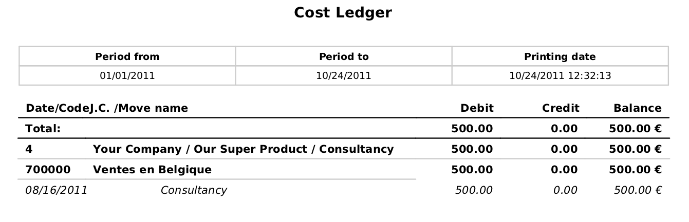
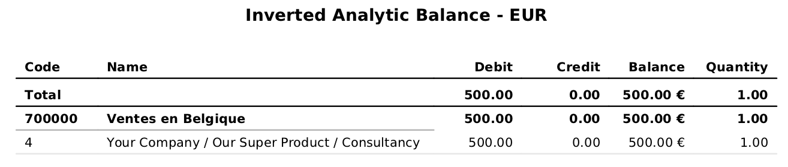
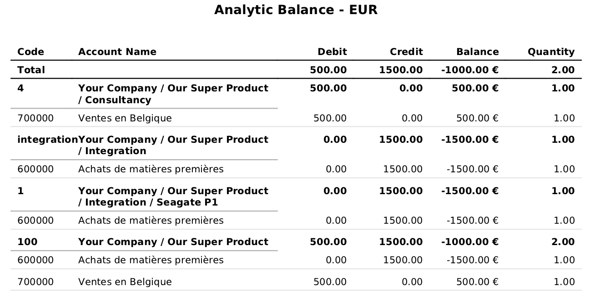
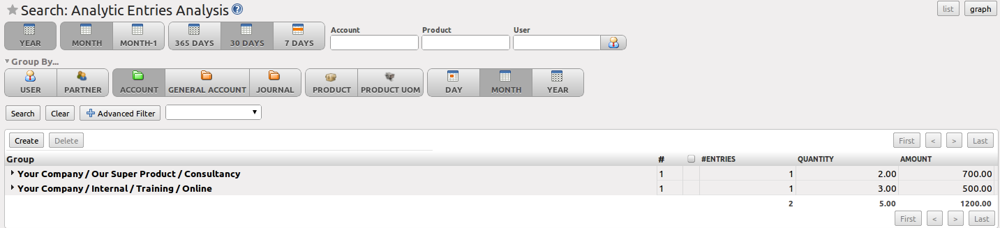

.. i18n: Analytic Analysis
.. i18n: =================
..

成本分析
=================

.. i18n: There are various reports designed for financial analysis based on the analytic accounts. Most of these reports are available directly from the tree of analytic accounts or from the form view of the analytic account.
..

There are various reports designed for financial analysis based on the analytic accounts. Most of these reports are available directly from the tree of analytic accounts or from the form view of the analytic account.

.. i18n: From the :menuselection:`Accounting --> Configuration --> Analytic Accounting --> Analytic Accounts` menu, select one or more analytic accounts and then click one of the reports in the `Reports` section at the right side of the screen.
.. i18n: OpenERP provides the following financial analyses from the analytic accounts (and maybe more, depending on the additional installed modules):
..

From the :menuselection:`Accounting --> Configuration --> Analytic Accounting --> Analytic Accounts` menu, select one or more analytic accounts and then click one of the reports in the `Reports` section at the right side of the screen.
OpenERP provides the following financial analyses from the analytic accounts (and maybe more, depending on the additional installed modules):

.. i18n: *  :guilabel:`Cost Ledger`,
.. i18n: 
.. i18n: *  :guilabel:`Inverted Analytic Balance`,
.. i18n: 
.. i18n: *  :guilabel:`Cost Ledger (only quantities)`.
.. i18n: 
.. i18n: *  :guilabel:`Analytic Balance`,
..

*  :guilabel:`Cost Ledger`,

*  :guilabel:`Inverted Analytic Balance`,

*  :guilabel:`Cost Ledger (only quantities)`.

*  :guilabel:`Analytic Balance`,

.. i18n: .. note:: Menu
.. i18n: 
.. i18n:     At the time of writing, there is no separate menu to print analytic reporting.
..

.. note:: Menu

    At the time of writing, there is no separate menu to print analytic reporting.

.. i18n: .. index::
.. i18n:    pair: cost ledger; analytic
..

.. index::
   pair: cost ledger; analytic

.. i18n: The Cost Ledger
.. i18n: ---------------
..

成本账
---------------

.. i18n: The cost ledger provides the entries in general accounts for the selected analytic account(s). It enables you to make a detailed analysis of each operation carried out on one or several projects.
..

The cost ledger provides the entries in general accounts for the selected analytic account(s). It enables you to make a detailed analysis of each operation carried out on one or several projects.

.. i18n: .. figure::  images/analytic_cost_ledger.png
.. i18n:    :scale: 65
.. i18n:    :align: center
.. i18n: 
.. i18n:    *Cost Ledger*
..

   *Cost Ledger*

.. i18n: .. index::
.. i18n:    pair: balance; analytic
..

.. index::
   pair: balance; analytic

.. i18n: Inverted Analytic Balance
.. i18n: -------------------------
..

反向辅助核算余额
-------------------------

.. i18n: The inverted analytic balance provides a summary report relating general accounts and analytic accounts. This report shows the balances of the general accounts broken down by the selected analytic accounts from date / to date.
..

The inverted analytic balance provides a summary report relating general accounts and analytic accounts. This report shows the balances of the general accounts broken down by the selected analytic accounts from date / to date.

.. i18n: .. figure::  images/analytic_balance_inverse.png
.. i18n:    :scale: 65
.. i18n:    :align: center
.. i18n: 
.. i18n:    *Inverted Analytic Balance*
..

   *Inverted Analytic Balance*

.. i18n: This enables you to analyse your costs by general account. For example, if you examine your general account for staff salaries, you can obtain all your salary costs broken down by the different analytic (or project) accounts.
..

This enables you to analyse your costs by general account. For example, if you examine your general account for staff salaries, you can obtain all your salary costs broken down by the different analytic (or project) accounts.

.. i18n: The Cost Ledger (Quantities Only)
.. i18n: ---------------------------------
..

成本费用总账 (仅数量)
---------------------------------

.. i18n: This report gives the details of entries for an analytic account and a list of selected journals.
.. i18n: Only quantities are reported for this analysis, not costs and revenues. In the wizard you can select from period and to period and one or more journals.
..

This report gives the details of entries for an analytic account and a list of selected journals.
Only quantities are reported for this analysis, not costs and revenues. In the wizard you can select from period and to period and one or more journals.

.. i18n: .. figure::  images/analytic_cost_ledger_quantity.png
.. i18n:    :scale: 65
.. i18n:    :align: center
.. i18n: 
.. i18n:    *Cost Ledger with Quantities Only*
..

.. figure::  images/analytic_cost_ledger_quantity.png
   :scale: 65
   :align: center

   *Cost Ledger with Quantities Only*

.. i18n: The report is often used to print the number of hours worked on a project, without exposing the costs and revenues. So you can show it to a customer as a record of the hours worked on a particular project.
..

The report is often used to print the number of hours worked on a project, without exposing the costs and revenues. So you can show it to a customer as a record of the hours worked on a particular project.

.. i18n: To restrict the report to hours worked, without including sales and purchases, select only the services journal in the printing options.
..

To restrict the report to hours worked, without including sales and purchases, select only the services journal in the printing options.

.. i18n: .. tip:: Multiple Printing
.. i18n: 
.. i18n:     To print several analytic accounts at once, you can make a multiple selection on the different accounts in the tree of accounts. Then
.. i18n:     click the appropriate :guilabel:`Report` in the toolbar (in the web client), or select one of the :guilabel:`Print` reports (in the
.. i18n:     GTK client), to export the whole selection into a single PDF document.
..

.. tip:: Multiple Printing

    To print several analytic accounts at once, you can make a multiple selection on the different accounts in the tree of accounts. Then
    click the appropriate :guilabel:`Report` in the toolbar (in the web client), or select one of the :guilabel:`Print` reports (in the
    GTK client), to export the whole selection into a single PDF document.

.. i18n: Analytic Balance
.. i18n: ----------------
..

辅助核算余额
----------------

.. i18n: The analytic balance is a summary report that relates the analytic accounts to the general accounts. It shows the balances of the analytic accounts broken down by general account for a selected period. The analytic balance allows you to display a breakdown of each project by operation in the general accounts. Quantities are printed too. You can choose to include accounts without a balance as well.
..

The analytic balance is a summary report that relates the analytic accounts to the general accounts. It shows the balances of the analytic accounts broken down by general account for a selected period. The analytic balance allows you to display a breakdown of each project by operation in the general accounts. Quantities are printed too. You can choose to include accounts without a balance as well.

.. i18n: When you select the analytic chart itself (the main analytic account), you can print the analytic balance for the entire analytic chart of accounts.
..

When you select the analytic chart itself (the main analytic account), you can print the analytic balance for the entire analytic chart of accounts.

.. i18n: .. figure::  images/analytic_balance.png
.. i18n:    :scale: 65
.. i18n:    :align: center
.. i18n: 
.. i18n:    *Analytic Balance*
..

   *Analytic Balance*

.. i18n: This report gives you the profitability of a project for the different operations that you used to carry out the project.
..

This report gives you the profitability of a project for the different operations that you used to carry out the project.

.. i18n: .. index::
.. i18n:    single: multi-company
..

.. index::
   single: multi-company

.. i18n: .. tip::  Multi-company
.. i18n: 
.. i18n:     In a multi-company environment, each company can have its own general chart of accounts on the same database.
.. i18n:     The two general charts of accounts are independent, but can be linked in a third chart using a view account to do the consolidation.
.. i18n: 
.. i18n:     If the different companies collaborate on joint projects, they may all share the same analytic chart of accounts.
.. i18n:     In this environment, the cross-related reports like the balance and inverted balance are extremely useful, because they enable you to make an analysis per company by linking up to the general accounts.
..

.. tip::  Multi-company

    In a multi-company environment, each company can have its own general chart of accounts on the same database.
    The two general charts of accounts are independent, but can be linked in a third chart using a view account to do the consolidation.

    If the different companies collaborate on joint projects, they may all share the same analytic chart of accounts.
    In this environment, the cross-related reports like the balance and inverted balance are extremely useful, because they enable you to make an analysis per company by linking up to the general accounts.

.. i18n: Analytic Journals
.. i18n: -----------------
..

辅助核算账簿
-----------------

.. i18n: From the :menuselection:`Accounting --> Configuration --> Analytic Accounting --> Analytic Journals`, select one or more analytic journals and click the ``Analytic Journal`` report at the right side of the screen. This prints a report per analytic journal from debit and credit (general account versus analytic account).
..

From the :menuselection:`Accounting --> Configuration --> Analytic Accounting --> Analytic Journals`, select one or more analytic journals and click the ``Analytic Journal`` report at the right side of the screen. This prints a report per analytic journal from debit and credit (general account versus analytic account).

.. i18n: .. figure::  images/analytic_journal.png
.. i18n:    :scale: 75
.. i18n:    :align: center
.. i18n: 
.. i18n:    *Analytic Sales Journal*
..

.. figure::  images/analytic_journal.png
   :scale: 75
   :align: center

   *Analytic Sales Journal*

.. i18n: Analytic Entries Analysis
.. i18n: -------------------------
..

辅助核算分录分析
-------------------------

.. i18n: You can have the statistical analysis on all analytic entries from the menu :menuselection:`Accounting --> Reporting --> Statistic Reports --> Analytic Entries Analysis`. By default, analytic entries are grouped by analytic account and month, but you have many options to sort and regroup analytic entries. You can, for instance, first group the information by general account, then by analytic account.
..

You can have the statistical analysis on all analytic entries from the menu :menuselection:`Accounting --> Reporting --> Statistic Reports --> Analytic Entries Analysis`. By default, analytic entries are grouped by analytic account and month, but you have many options to sort and regroup analytic entries. You can, for instance, first group the information by general account, then by analytic account.

.. i18n: .. figure::  images/analytic_entries_analysis.png
.. i18n:    :scale: 75
.. i18n:    :align: center
.. i18n: 
.. i18n:    *Statistical Report for Analytic Entries*
..

   *Statistical Report for Analytic Entries*

.. i18n: .. tip:: Graph
.. i18n: 
.. i18n:     You can easily turn this analysis screen into a graph by clicking the :guilabel:`Graph` button at the top of the screen.
..

.. tip:: Graph

    You can easily turn this analysis screen into a graph by clicking the :guilabel:`Graph` button at the top of the screen.

.. i18n: .. Copyright © Open Object Press. All rights reserved.
..

.. Copyright © Open Object Press. All rights reserved.

.. i18n: .. You may take electronic copy of this publication and distribute it if you don't
.. i18n: .. change the content. You can also print a copy to be read by yourself only.
..

.. You may take electronic copy of this publication and distribute it if you don't
.. change the content. You can also print a copy to be read by yourself only.

.. i18n: .. We have contracts with different publishers in different countries to sell and
.. i18n: .. distribute paper or electronic based versions of this book (translated or not)
.. i18n: .. in bookstores. This helps to distribute and promote the OpenERP product. It
.. i18n: .. also helps us to create incentives to pay contributors and authors using author
.. i18n: .. rights of these sales.
..

.. We have contracts with different publishers in different countries to sell and
.. distribute paper or electronic based versions of this book (translated or not)
.. in bookstores. This helps to distribute and promote the OpenERP product. It
.. also helps us to create incentives to pay contributors and authors using author
.. rights of these sales.

.. i18n: .. Due to this, grants to translate, modify or sell this book are strictly
.. i18n: .. forbidden, unless Tiny SPRL (representing Open Object Press) gives you a
.. i18n: .. written authorisation for this.
..

.. Due to this, grants to translate, modify or sell this book are strictly
.. forbidden, unless Tiny SPRL (representing Open Object Press) gives you a
.. written authorisation for this.

.. i18n: .. Many of the designations used by manufacturers and suppliers to distinguish their
.. i18n: .. products are claimed as trademarks. Where those designations appear in this book,
.. i18n: .. and Open Object Press was aware of a trademark claim, the designations have been
.. i18n: .. printed in initial capitals.
..

.. Many of the designations used by manufacturers and suppliers to distinguish their
.. products are claimed as trademarks. Where those designations appear in this book,
.. and Open Object Press was aware of a trademark claim, the designations have been
.. printed in initial capitals.

.. i18n: .. While every precaution has been taken in the preparation of this book, the publisher
.. i18n: .. and the authors assume no responsibility for errors or omissions, or for damages
.. i18n: .. resulting from the use of the information contained herein.
..

.. While every precaution has been taken in the preparation of this book, the publisher
.. and the authors assume no responsibility for errors or omissions, or for damages
.. resulting from the use of the information contained herein.

.. i18n: .. Published by Open Object Press, Grand Rosière, Belgium
..

.. Published by Open Object Press, Grand Rosière, Belgium
