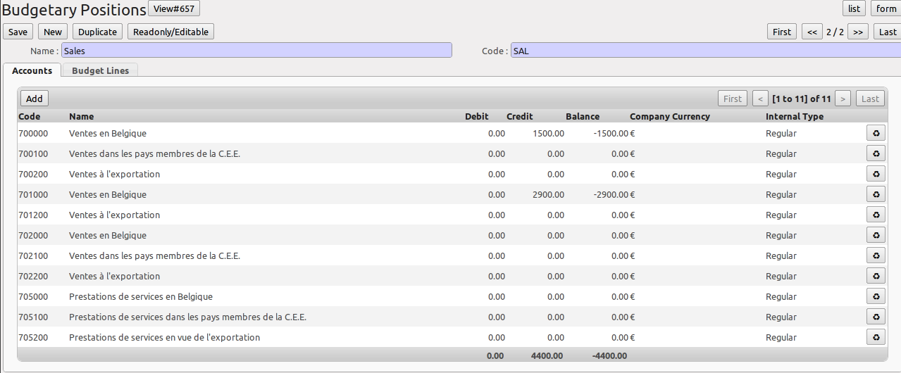
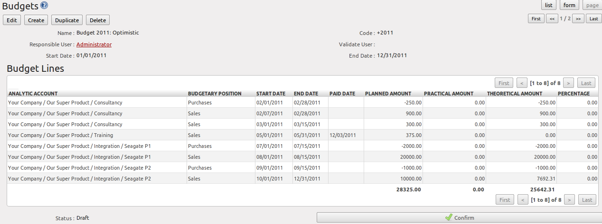
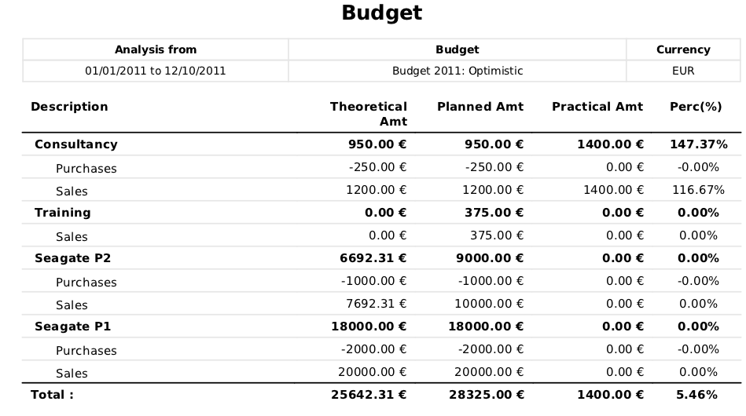
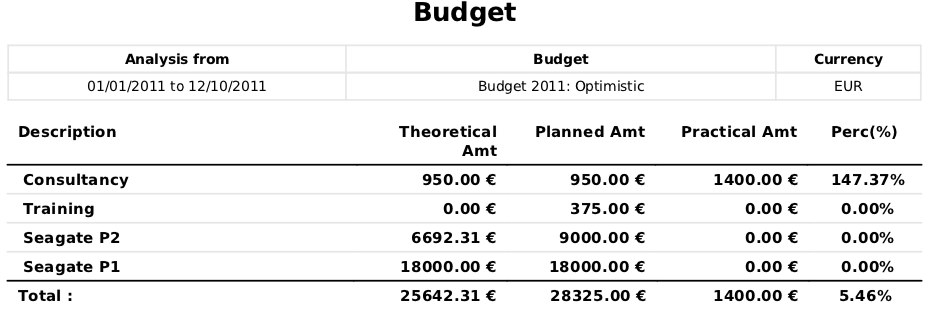
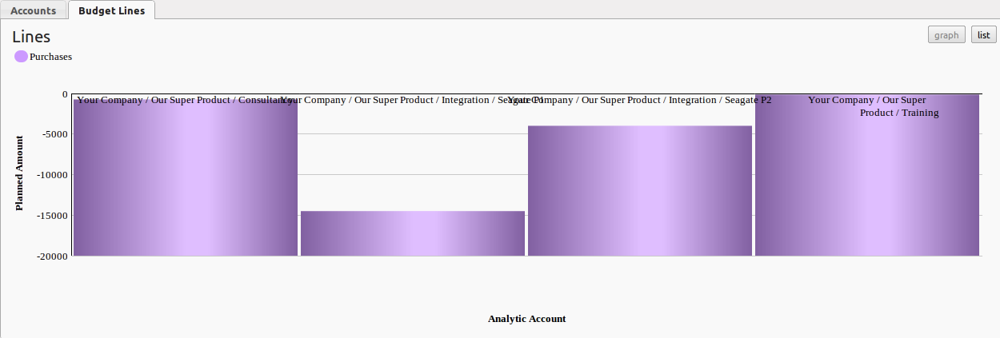

.. i18n: .. index::
.. i18n:    single: budgeting
..

.. index::
   single: budgeting

.. i18n: Good Management Budgeting
.. i18n: -------------------------
..

良好的预算管理
-------------------------

.. i18n: Budgets are important for a company to get a good grip on forecasted expenses and revenues. They allow you to measure your actual financial performance against the planned one.
..

对于公司来说，预算是非常重要的，使你能很好地控制并预计费用和收入。他们使你能衡量财务状况相对于计划的实际表现。

.. i18n: OpenERP manages its budgets using both General and Analytic Accounts.
.. i18n: Go to :menuselection:`Settings --> Modules --> Modules` and install :mod:`account_budget` to be able to do this.
..

OpenERP 使用总账和辅助核算来管理预算
进入菜单o :menuselection:设置Settings --> 模块Modules --> 模块Modules` 并安装模块 :mod:`account_budget` 就可以做这些工作了.

.. i18n: The first step in defining budgets is to determine the general accounts for which you want to keep budgets (typically expense or income accounts).
.. i18n: That is what you will use ``Budgetary Positions`` for, from the menu :menuselection:`Accounting --> Configuration --> Budgets --> Budgetary Positions`. Here you can select the general accounts for which you want to keep budgets. The aim is to group general accounts logically, according to sales or purchases, for instance. OpenERP has no limitations as to the account types that can be used for budgeting.
..

The first step in defining budgets is to determine the general accounts for which you want to keep budgets (typically expense or income accounts).
That is what you will use ``Budgetary Positions`` for, from the menu :menuselection:`Accounting --> Configuration --> Budgets --> Budgetary Positions`. Here you can select the general accounts for which you want to keep budgets. The aim is to group general accounts logically, according to sales or purchases, for instance. OpenERP has no limitations as to the account types that can be used for budgeting.

.. i18n: .. figure::  images/account_budget_pos.png
.. i18n:    :scale: 75
.. i18n:    :align: center
.. i18n: 
.. i18n:    *Budgetary Position for Sales*
..

   *Budgetary Position for Sales*

.. i18n: To define your budgets, go to the menu :menuselection:`Accounting --> Budgets --> Budgets`. Define a new budget by clicking the `New` button.
..

To define your budgets, go to the menu :menuselection:`Accounting --> Budgets --> Budgets`. Define a new budget by clicking the `New` button.

.. i18n: .. figure::  images/account_budget_form.png
.. i18n:    :scale: 75
.. i18n:    :align: center
.. i18n: 
.. i18n:    *Optimistic Budget*
..

   *Optimistic Budget*

.. i18n: .. index::
.. i18n:    single: budget revisions
..

.. index::
   single: budget revisions

.. i18n: .. tip:: Budget Revisions
.. i18n: 
.. i18n:     Even though you *can* modify a budget at any time to make a revision, we recommend you to create a new budget, because otherwise you will have no history of changes.
.. i18n: 
.. i18n:     Rather than edit an existing budget, make a new version so that you can keep your original estimates safe for comparison. This lets you analyse your changing perspectives of the company from revision to revision.
..

.. tip:: Budget Revisions

    Even though you *can* modify a budget at any time to make a revision, we recommend you to create a new budget, because otherwise you will have no history of changes.

    Rather than edit an existing budget, make a new version so that you can keep your original estimates safe for comparison. This lets you analyse your changing perspectives of the company from revision to revision.

.. i18n: To define your budgets, start by entering a :guilabel:`Name`, a :guilabel:`Code`, a :guilabel:`Start Date` and an :guilabel:`End Date` for your new budget. Then you can define the budgeted amounts for each analytic account within a specified period, one by one (enter negative amounts for purchases, positive amounts for sales). For each, you define:
..

To define your budgets, start by entering a :guilabel:`Name`, a :guilabel:`Code`, a :guilabel:`Start Date` and an :guilabel:`End Date` for your new budget. Then you can define the budgeted amounts for each analytic account within a specified period, one by one (enter negative amounts for purchases, positive amounts for sales). For each, you define:

.. i18n: * an :guilabel:`Analytic Account`
.. i18n: 
.. i18n: * a :guilabel:`Budgetary Position`, for example ``Sales`` or ``Purchases``,
.. i18n: 
.. i18n: * a :guilabel:`Start Date` and an :guilabel:`End Date` for the budget,
.. i18n: 
.. i18n: * a :guilabel:`Planned Amount` in the default currency of the chart of accounts.
..

* an :guilabel:`Analytic Account`

* a :guilabel:`Budgetary Position`, for example ``Sales`` or ``Purchases``,

* a :guilabel:`Start Date` and an :guilabel:`End Date` for the budget,

* a :guilabel:`Planned Amount` in the default currency of the chart of accounts.

.. i18n: Once this information is completed, save your budget.
..

Once this information is completed, save your budget.

.. i18n: A budget has various stages:
..

A budget has various stages:

.. i18n: * *Confirmed*: the budget is to be reviewed, but it can still be changed before actual approval;
.. i18n: 
.. i18n: * *Approved*: the budget is approved by the budget holder; the name of the user approving the budget will be displayed in the ``Validate User`` field.
..

* *Confirmed*: the budget is to be reviewed, but it can still be changed before actual approval;

* *Approved*: the budget is approved by the budget holder; the name of the user approving the budget will be displayed in the ``Validate User`` field.

.. i18n: You can cancel a budget and reset it to draft for the two preceding steps.
..

You can cancel a budget and reset it to draft for the two preceding steps.

.. i18n: * *Done*: the budget is fully approved and no changes will be allowed. You can no longer cancel the budget and reset it to draft.
..

* *Done*: the budget is fully approved and no changes will be allowed. You can no longer cancel the budget and reset it to draft.

.. i18n: The :guilabel:`Theoretical Amount` indicates the actual amount that might have been realised for the budget concerned according to the current date. When your budget is 1200 for 12 months, and today is the 30 October, the theoretical amount will be 1000, since this is the actual amount that could have been realised to date.
..

The :guilabel:`Theoretical Amount` indicates the actual amount that might have been realised for the budget concerned according to the current date. When your budget is 1200 for 12 months, and today is the 30 October, the theoretical amount will be 1000, since this is the actual amount that could have been realised to date.

.. i18n: To print a budget and make calculations of expenditure through budget, use the menu :menuselection:`Accounting --> Budgets --> Budgets`. OpenERP then gives you a list of available budgets. Select one or more budgets and then click :guilabel:`Print Budgets` to create the report for each, in a date range of your choice.
..

To print a budget and make calculations of expenditure through budget, use the menu :menuselection:`Accounting --> Budgets --> Budgets`. OpenERP then gives you a list of available budgets. Select one or more budgets and then click :guilabel:`Print Budgets` to create the report for each, in a date range of your choice.

.. i18n: The ``Print Budget`` report gives an overview of each analytic account included in your budget, according to the individual budgetary positions for that account. From the percentage and the comparison of planned (budgeted) and practical (actual) amounts, you have a good view on your situation.
..

The ``Print Budget`` report gives an overview of each analytic account included in your budget, according to the individual budgetary positions for that account. From the percentage and the comparison of planned (budgeted) and practical (actual) amounts, you have a good view on your situation.

.. i18n: From the same list of actions, you can also print the ``Print Summary`` report, which will give you a total per analytic account (without splitting by budgetary position).
..

From the same list of actions, you can also print the ``Print Summary`` report, which will give you a total per analytic account (without splitting by budgetary position).

.. i18n: Each of these reports can be printed from a specific date to a specific date. The End Date selected in the wizard determines how the theoretical amount will be calculated; if you select the last day of your financial year, the theoretical amount will be calculated as a function of that date (thus considering a complete financial year). Note that the theoretical amount will be zero when the :guilabel:`Paid Date` entered is equal to or greater than the :guilabel:`End Date` for the budget.
..

Each of these reports can be printed from a specific date to a specific date. The End Date selected in the wizard determines how the theoretical amount will be calculated; if you select the last day of your financial year, the theoretical amount will be calculated as a function of that date (thus considering a complete financial year). Note that the theoretical amount will be zero when the :guilabel:`Paid Date` entered is equal to or greater than the :guilabel:`End Date` for the budget.

.. i18n: The percentage for a budget is calculated as follows: (practical amount / theoretical amount) x 100.
.. i18n: This way you get a view on how much of the forecasted amount has been actually realised in your accounting.
..

The percentage for a budget is calculated as follows: (practical amount / theoretical amount) x 100.
This way you get a view on how much of the forecasted amount has been actually realised in your accounting.

.. i18n: The figure :ref:`fig-accbudg` gives an example of a budget produced by OpenERP.
..

The figure :ref:`fig-accbudg` gives an example of a budget produced by OpenERP.

.. i18n: .. _fig-accbudg:
.. i18n: 
.. i18n: .. figure::  images/account_budget.png
.. i18n:    :scale: 75
.. i18n:    :align: center
.. i18n: 
.. i18n:    *Printing a Budget*
..

.. _fig-accbudg:

   *Printing a Budget*

.. i18n: .. figure::  images/account_budget_summ.png
.. i18n:    :scale: 75
.. i18n:    :align: center
.. i18n: 
.. i18n:    *Summarised Budget*
..

   *Summarised Budget*

.. i18n: You could also use the menu :menuselection:`Accounting --> Reporting --> Generic Reporting --> Budgets --> Budget Lines`.
.. i18n: This gives an analysis of each budget line.
..

You could also use the menu :menuselection:`Accounting --> Reporting --> Generic Reporting --> Budgets --> Budget Lines`.
This gives an analysis of each budget line.

.. i18n: From the menu :menuselection:`Accounting --> Configuration --> Budgets --> Budgetary Positions`, you can print the budgets for an individual budgetary position. Open a budgetary position, and click the :guilabel:`Budget Lines` tab for a graphical representation of your budgetary position.
..

From the menu :menuselection:`Accounting --> Configuration --> Budgets --> Budgetary Positions`, you can print the budgets for an individual budgetary position. Open a budgetary position, and click the :guilabel:`Budget Lines` tab for a graphical representation of your budgetary position.

.. i18n: .. figure::  images/account_budget_graph.png
.. i18n:    :scale: 75
.. i18n:    :align: center
.. i18n: 
.. i18n:    *Graphical Representation of Budgetary Position*
..

   *Graphical Representation of Budgetary Position*

.. i18n: .. note:: Print Reports
.. i18n: 
.. i18n:     You can also print budgets from the menu :menuselection:`Accounting --> Configuration --> Analytic Accounting --> Analytic Accounts`.
..

.. note:: Print Reports

    You can also print budgets from the menu :menuselection:`Accounting --> Configuration --> Analytic Accounting --> Analytic Accounts`.

.. i18n: The Accounting Dashboard
.. i18n: ------------------------
..

会计仪表板
------------------------

.. i18n: You can open the `Accounting Dashboard` in more than one way: either by clicking the ``Accounting`` button at the top of the web screen, or from the menu :menuselection:`Accounting --> Reporting --> Dashboard --> Accounting Dashboard`.
..

You can open the `Accounting Dashboard` in more than one way: either by clicking the ``Accounting`` button at the top of the web screen, or from the menu :menuselection:`Accounting --> Reporting --> Dashboard --> Accounting Dashboard`.

.. i18n: .. figure::  images/account_board.png
.. i18n:    :scale: 75
.. i18n:    :align: center
.. i18n: 
.. i18n:    *Accounting Dashboard*
..

.. figure::  images/account_board.png
   :scale: 75
   :align: center

   *Accounting Dashboard*

.. i18n: .. index::
.. i18n:    single: module; board_account
..

.. index::
   single: module; board_account

.. i18n: OpenERP gives you an accounting dashboard that will be presented to your accounting staff as they sign in to the Accounting system (you can also set the dashboard as their Home Page by setting the :guilabel:`Home Action` to ``Accounting Dashboard`` in the :guilabel:`User` form). This dashboard provides an analysis of the company's financial health at a glance.
..

OpenERP gives you an accounting dashboard that will be presented to your accounting staff as they sign in to the Accounting system (you can also set the dashboard as their Home Page by setting the :guilabel:`Home Action` to ``Accounting Dashboard`` in the :guilabel:`User` form). This dashboard provides an analysis of the company's financial health at a glance.

.. i18n: The description of the different parts of the dashboard, from top to bottom, then from left to right, is as follows:
..

The description of the different parts of the dashboard, from top to bottom, then from left to right, is as follows:

.. i18n: *  :guilabel:`Customer Invoices to Approve` : gives the list of invoices waiting to be approved by an accountant.
.. i18n: 
.. i18n: *  :guilabel:`Company Analysis` : lists the debit, credit and balance of all account types.
.. i18n: 
.. i18n: *  :guilabel:`Treasury` : shows the balance per Bank account in graphical view.
.. i18n: 
.. i18n: *  :guilabel:`Aged Receivables` : gives a weekly graph of the receivables that have not yet been reconciled.
..

*  :guilabel:`Customer Invoices to Approve` : gives the list of invoices waiting to be approved by an accountant.

*  :guilabel:`Company Analysis` : lists the debit, credit and balance of all account types.

*  :guilabel:`Treasury` : shows the balance per Bank account in graphical view.

*  :guilabel:`Aged Receivables` : gives a weekly graph of the receivables that have not yet been reconciled.

.. i18n: For most of the panels of the `Accounting Dashboard`, you can click a line or a graph to investigate the detail of your financial indicators.
..

For most of the panels of the `Accounting Dashboard`, you can click a line or a graph to investigate the detail of your financial indicators.

.. i18n: The `Accounting Dashboard` is dynamically integrated, which means that you can navigate easily through the data if you want more detail about certain factors, and edit the entries if necessary.
..

The `Accounting Dashboard` is dynamically integrated, which means that you can navigate easily through the data if you want more detail about certain factors, and edit the entries if necessary.

.. i18n: The ``Change Layout`` button at the top right allows you to change the way the dashboard is displayed; you can choose among several options, such as one column, two columns, etc.
.. i18n: You can also add other features to the dashboard and customise it to your needs with the ``Add Widget`` button. You can easily ``Undo`` changes or ``Reset`` the original dashboard.
..

The ``Change Layout`` button at the top right allows you to change the way the dashboard is displayed; you can choose among several options, such as one column, two columns, etc.
You can also add other features to the dashboard and customise it to your needs with the ``Add Widget`` button. You can easily ``Undo`` changes or ``Reset`` the original dashboard.

.. i18n: .. Copyright © Open Object Press. All rights reserved.
..

.. Copyright © Open Object Press. All rights reserved.

.. i18n: .. You may take electronic copy of this publication and distribute it if you don't
.. i18n: .. change the content. You can also print a copy to be read by yourself only.
..

.. You may take electronic copy of this publication and distribute it if you don't
.. change the content. You can also print a copy to be read by yourself only.

.. i18n: .. We have contracts with different publishers in different countries to sell and
.. i18n: .. distribute paper or electronic based versions of this book (translated or not)
.. i18n: .. in bookstores. This helps to distribute and promote the OpenERP product. It
.. i18n: .. also helps us to create incentives to pay contributors and authors using author
.. i18n: .. rights of these sales.
..

.. We have contracts with different publishers in different countries to sell and
.. distribute paper or electronic based versions of this book (translated or not)
.. in bookstores. This helps to distribute and promote the OpenERP product. It
.. also helps us to create incentives to pay contributors and authors using author
.. rights of these sales.

.. i18n: .. Due to this, grants to translate, modify or sell this book are strictly
.. i18n: .. forbidden, unless Tiny SPRL (representing Open Object Press) gives you a
.. i18n: .. written authorisation for this.
..

.. Due to this, grants to translate, modify or sell this book are strictly
.. forbidden, unless Tiny SPRL (representing Open Object Press) gives you a
.. written authorisation for this.

.. i18n: .. Many of the designations used by manufacturers and suppliers to distinguish their
.. i18n: .. products are claimed as trademarks. Where those designations appear in this book,
.. i18n: .. and Open Object Press was aware of a trademark claim, the designations have been
.. i18n: .. printed in initial capitals.
..

.. Many of the designations used by manufacturers and suppliers to distinguish their
.. products are claimed as trademarks. Where those designations appear in this book,
.. and Open Object Press was aware of a trademark claim, the designations have been
.. printed in initial capitals.

.. i18n: .. While every precaution has been taken in the preparation of this book, the publisher
.. i18n: .. and the authors assume no responsibility for errors or omissions, or for damages
.. i18n: .. resulting from the use of the information contained herein.
..

.. While every precaution has been taken in the preparation of this book, the publisher
.. and the authors assume no responsibility for errors or omissions, or for damages
.. resulting from the use of the information contained herein.

.. i18n: .. Published by Open Object Press, Grand Rosière, Belgium
..

.. Published by Open Object Press, Grand Rosière, Belgium
