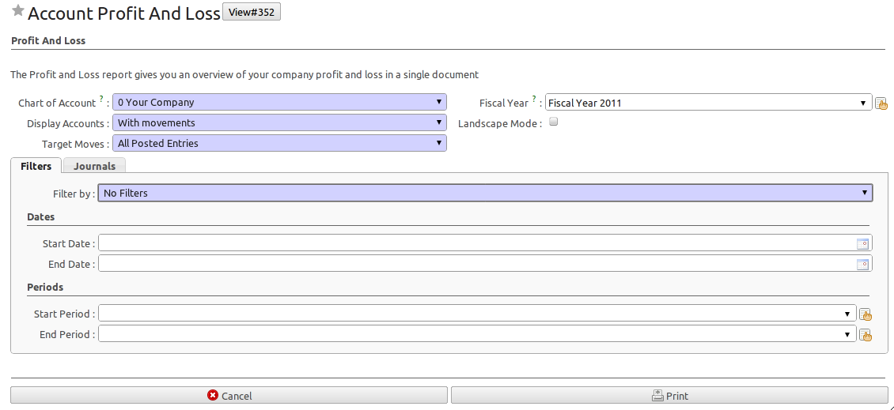
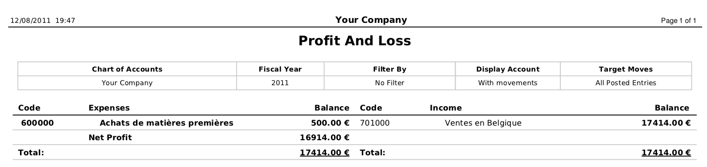
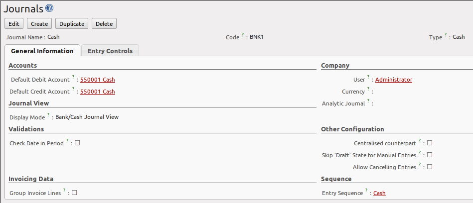
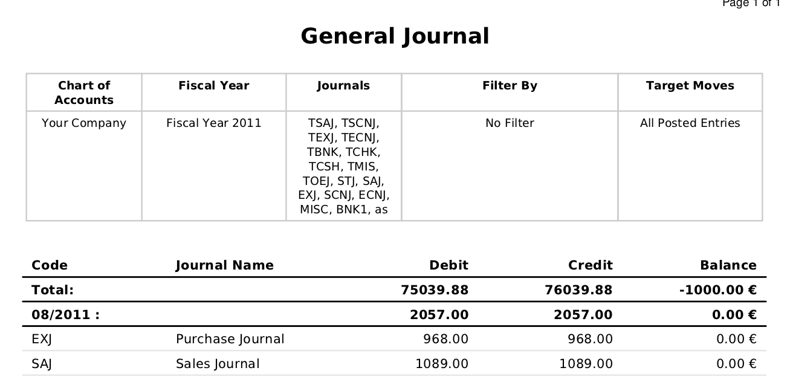
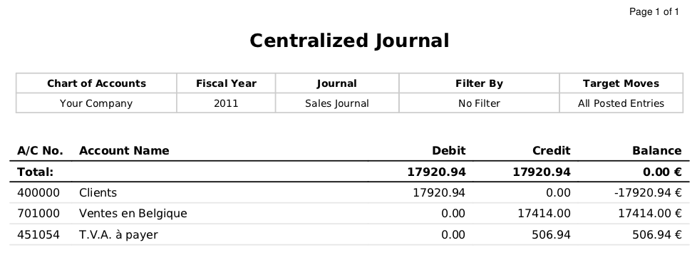
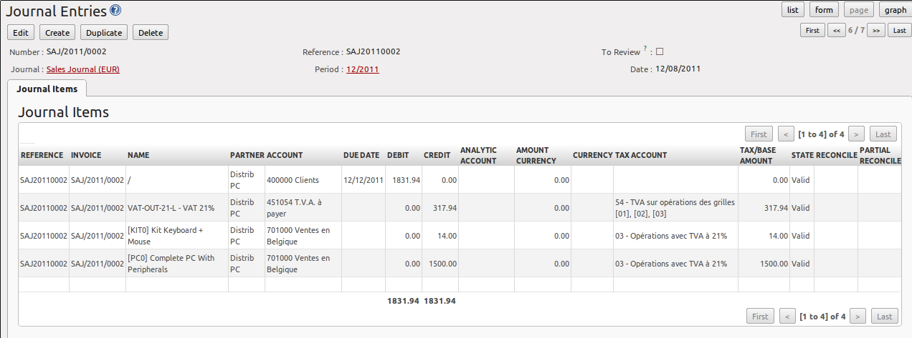
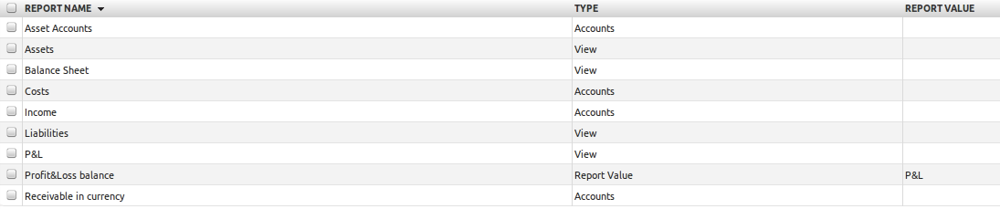
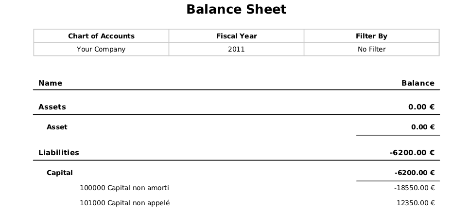

.. i18n: .. index::
.. i18n:    single: trial balance
.. i18n:    single: general ledger
..

.. index::
   single: trial balance
   single: general ledger

.. i18n: General Ledger and Trial Balance
.. i18n: --------------------------------
..

总账和试算平衡表
--------------------------------

.. i18n: A general ledger includes accounts with their debits and credits, and shows all transactions in an account, for one period, for several periods or for a financial year.
..

A general ledger includes accounts with their debits and credits, and shows all transactions in an account, for one period, for several periods or for a financial year.

.. i18n: To print the `General Ledger`, you can use the menu :menuselection:`Accounting --> Reporting --> Legal Reports --> Accounting Reports --> General Ledger`.
.. i18n: You will find the following wizard which is used to filter the resulting report.
..

To print the `General Ledger`, you can use the menu :menuselection:`Accounting --> Reporting --> Legal Reports --> Accounting Reports --> General Ledger`.
You will find the following wizard which is used to filter the resulting report.

.. i18n: .. figure::  images/account_wizard_report.png
.. i18n:    :scale: 75
.. i18n:    :align: center
.. i18n: 
.. i18n:    *Preparing a General Ledger*
..

.. figure::  images/account_wizard_report.png
   :scale: 75
   :align: center

   *Preparing a General Ledger*

.. i18n: Select the proper options and journal(s) from the above wizard to print the `General Ledger`. The report can also be filtered by date or by period. When you choose to print the general ledger from one date to another, or for one or more periods, you can also have the initial balances printed for the periods preceding the periods you selected.
.. i18n: You can sort the report by date or by journal / partner.
..

Select the proper options and journal(s) from the above wizard to print the `General Ledger`. The report can also be filtered by date or by period. When you choose to print the general ledger from one date to another, or for one or more periods, you can also have the initial balances printed for the periods preceding the periods you selected.
You can sort the report by date or by journal / partner.

.. i18n: .. figure::  images/account_general_ledger.png
.. i18n:    :scale: 65
.. i18n:    :align: center
.. i18n: 
.. i18n:    *General Ledger*
..

.. figure::  images/account_general_ledger.png
   :scale: 65
   :align: center

   *General Ledger*

.. i18n: .. tip:: General Ledger for one or more accounts
.. i18n: 
.. i18n:     When you want to print the general ledger for one or more accounts, go to the menu :menuselection:`Accounting --> Configuration -> Financial Accounting --> Accounts --> Accounts`. Select the account(s) for which you want to print the general ledger and click the :guilabel:`General Ledger` report at the right side of the screen. 
..

.. tip:: General Ledger for one or more accounts

    When you want to print the general ledger for one or more accounts, go to the menu :menuselection:`Accounting --> Configuration -> Financial Accounting --> Accounts --> Accounts`. Select the account(s) for which you want to print the general ledger and click the :guilabel:`General Ledger` report at the right side of the screen. 

.. i18n: While the general ledger displays transactions for an account, a trial balance will show one amount (either debit or credit) for each account. The aim of the trial balance is to prove that the total of all debit balances is equal to the total of all credit balances.
..

While the general ledger displays transactions for an account, a trial balance will show one amount (either debit or credit) for each account. The aim of the trial balance is to prove that the total of all debit balances is equal to the total of all credit balances.

.. i18n: To print the `Trial Balance`, go to the menu :menuselection:`Accounting --> Reporting --> Legal Reports --> Accounting Reports --> Trial Balance`.
.. i18n: This report allows you to print or generate a PDF of your trial balance, allowing you to quickly check the balance of each of your accounts in a single report. A trial balance may include all accounts (even the ones without balance), only accounts with transactions or accounts of which the balance is not equal to zero. You can print a trial balance for all posted entries (meaning entries with a Valid state) or all entries, in which case the report will also print entries in a draft state. This option is useful, for instance, when your new financial year has just been opened, and you are preparing miscellaneous entries in the previous financial year.
..

To print the `Trial Balance`, go to the menu :menuselection:`Accounting --> Reporting --> Legal Reports --> Accounting Reports --> Trial Balance`.
This report allows you to print or generate a PDF of your trial balance, allowing you to quickly check the balance of each of your accounts in a single report. A trial balance may include all accounts (even the ones without balance), only accounts with transactions or accounts of which the balance is not equal to zero. You can print a trial balance for all posted entries (meaning entries with a Valid state) or all entries, in which case the report will also print entries in a draft state. This option is useful, for instance, when your new financial year has just been opened, and you are preparing miscellaneous entries in the previous financial year.

.. i18n: .. figure::  images/account_trial_balance.png
.. i18n:    :scale: 65
.. i18n:    :align: center
.. i18n: 
.. i18n:    *Trial Balance*
..

.. figure::  images/account_trial_balance.png
   :scale: 65
   :align: center

   *Trial Balance*

.. i18n: .. tip:: Reporting for One or More Accounts
.. i18n: 
.. i18n:     You can print the `Trial Balance` report directly from the `Account` form too.
..

.. tip:: Reporting for One or More Accounts

    You can print the `Trial Balance` report directly from the `Account` form too.

.. i18n: .. index::
.. i18n:    single: balance sheet
.. i18n:    single: profit & loss
..

.. index::
   single: balance sheet
   single: profit & loss

.. i18n: Balance Sheet and Profit & Loss Report
.. i18n: --------------------------------------
..

资产负债表和损益表
--------------------------------------

.. i18n: OpenERP also offers a Balance Sheet and a Profit & Loss Report.
..

OpenERP also offers a Balance Sheet and a Profit & Loss Report.

.. i18n: A `Balance Sheet` is a financial statement that summarises the assets, liabilities and shareholders' equity of a company at a specific point in time. These three balance sheet segments give investors an idea as to what the company owns and owes, as well as the amount invested by the shareholders.
..

A `Balance Sheet` is a financial statement that summarises the assets, liabilities and shareholders' equity of a company at a specific point in time. These three balance sheet segments give investors an idea as to what the company owns and owes, as well as the amount invested by the shareholders.

.. i18n: The balance sheet complies with the formula below:
..

The balance sheet complies with the formula below:

.. i18n: Assets = Liabilities + Shareholders' Equity.
..

Assets = Liabilities + Shareholders' Equity.

.. i18n: A balance sheet is often described as a snapshot of a company's financial condition.
..

A balance sheet is often described as a snapshot of a company's financial condition.

.. i18n: The accounts displayed in the Balance Sheet are linked to an account type for which the ``P&L / Balance Sheet`` parameter is set to Balance Sheet (either Assets or Liabilities account). To configure :guilabel:`Account Types`, go to :menuselection:`Accounting --> Configuration --> Financial Accounting --> Accounts --> Account Types`.
..

The accounts displayed in the Balance Sheet are linked to an account type for which the ``P&L / Balance Sheet`` parameter is set to Balance Sheet (either Assets or Liabilities account). To configure :guilabel:`Account Types`, go to :menuselection:`Accounting --> Configuration --> Financial Accounting --> Accounts --> Account Types`.

.. i18n: The Balance Sheet can be printed from the menu :menuselection:`Accounting --> Reporting --> Legal Reports --> Accounting Reports --> Balance Sheet`. You can print this report in Landscape mode too.
..

The Balance Sheet can be printed from the menu :menuselection:`Accounting --> Reporting --> Legal Reports --> Accounting Reports --> Balance Sheet`. You can print this report in Landscape mode too.

.. i18n: .. tip:: Reserve & Profit and Loss Account
.. i18n: 
.. i18n:     A Balance Sheet needs a reserve & profit and loss account, but instead of entering it each time you start the report, you can add a default Reserve & Profit and Loss account through the menu:menuselection:`Settings --> Companies --> Companies` on the ``Configuration`` tab. This account will be used as a counterpart to balance your accounts.
..

.. tip:: Reserve & Profit and Loss Account

    A Balance Sheet needs a reserve & profit and loss account, but instead of entering it each time you start the report, you can add a default Reserve & Profit and Loss account through the menu:menuselection:`Settings --> Companies --> Companies` on the ``Configuration`` tab. This account will be used as a counterpart to balance your accounts.

.. i18n: The `Profit & Loss Report` is a financial statement which gives a summary of the revenues, costs and expenses during a specific period of time. Such a report provides information that shows the ability of a company to generate profit by increasing revenue and reducing costs. The P&L statement is also known as an "Income Statement".
..

The `Profit & Loss Report` is a financial statement which gives a summary of the revenues, costs and expenses during a specific period of time. Such a report provides information that shows the ability of a company to generate profit by increasing revenue and reducing costs. The P&L statement is also known as an "Income Statement".

.. i18n: The purpose of the Profit & Loss Report is to show managers and accountants whether the company earned or lost money during the report period.
..

The purpose of the Profit & Loss Report is to show managers and accountants whether the company earned or lost money during the report period.

.. i18n: In general, the Profit and Loss report will be used to determine profit ratios, to examine sales prices and costs, and to set marketing budgets, for instance.
..

In general, the Profit and Loss report will be used to determine profit ratios, to examine sales prices and costs, and to set marketing budgets, for instance.

.. i18n: The accounts displayed in the Profit and Loss Report are linked to an account type for which the ``"P&L / Balance Sheet`` parameter is set to Profit & Loss (either Expense or Income account). To configure Account types, go to :menuselection:`Accounting --> Configuration --> Financial Accounting --> Account Types`.
..

The accounts displayed in the Profit and Loss Report are linked to an account type for which the ``"P&L / Balance Sheet`` parameter is set to Profit & Loss (either Expense or Income account). To configure Account types, go to :menuselection:`Accounting --> Configuration --> Financial Accounting --> Account Types`.

.. i18n: The Profit and Loss report can be printed from the menu :menuselection:`Accounting --> Reporting --> Legal Reports --> Accounting Reports --> Profit And Loss`.
..

The Profit and Loss report can be printed from the menu :menuselection:`Accounting --> Reporting --> Legal Reports --> Accounting Reports --> Profit And Loss`.

.. i18n: .. figure::  images/account_profit_loss.png
.. i18n:    :scale: 75
.. i18n:    :align: center
.. i18n: 
.. i18n:    *Profit and Loss Wizard*
..

   *Profit and Loss Wizard*

.. i18n: .. figure::  images/account_profit_loss_report.png
.. i18n:    :scale: 75
.. i18n:    :align: center
.. i18n: 
.. i18n:    *Profit and Loss Report*
..

   *Profit and Loss Report*

.. i18n: .. index:: journal
..

.. index:: journal

.. i18n: The Accounting Journals
.. i18n: -----------------------
..

账户分类账
-----------------------

.. i18n: A journal allows you to list entries in chronological order (by default according to date). Each entry posted in OpenERP is recorded in such a journal. To configure the different accounting journals, go to the menu :menuselection:`Accounting --> Configuration --> Financial Accounting --> Journals --> Journals`.
..

A journal allows you to list entries in chronological order (by default according to date). Each entry posted in OpenERP is recorded in such a journal. To configure the different accounting journals, go to the menu :menuselection:`Accounting --> Configuration --> Financial Accounting --> Journals --> Journals`.

.. i18n: .. figure::  images/account_journal_form.png
.. i18n:    :scale: 75
.. i18n:    :align: center
.. i18n: 
.. i18n:    *Defining a Journal*
..

   *Defining a Journal*

.. i18n: OpenERP provides three main reports regarding the journals:
..

OpenERP provides three main reports regarding the journals:

.. i18n: * To print a `Journal`, use the menu :menuselection:`Accounting --> Reporting --> Legal Reports --> Journals --> Journals`. This report will show all entries per journal, e.g. sales entries, purchase entries, etc. Each transaction is mentioned, with date, reference, document number, account, partner, description and debit and credit amount. The ``Journal`` report can be printed per period and per journal.
..

* To print a `Journal`, use the menu :menuselection:`Accounting --> Reporting --> Legal Reports --> Journals --> Journals`. This report will show all entries per journal, e.g. sales entries, purchase entries, etc. Each transaction is mentioned, with date, reference, document number, account, partner, description and debit and credit amount. The ``Journal`` report can be printed per period and per journal.

.. i18n: .. figure::  images/account_journal_print.png
.. i18n:    :scale: 75
.. i18n:    :align: center
.. i18n: 
.. i18n:    *Printing a Journal*
..

.. figure::  images/account_journal_print.png
   :scale: 75
   :align: center

   *Printing a Journal*

.. i18n: * To print a `General Journal`, use the menu :menuselection:`Accounting --> Reporting --> Legal Reports --> Journals --> General Journals`. A General Journal will print a page per period for any journal entries posted in that period, and totalised per journal. The report will show the period, the journal, debit, credit and balance, but no details of the related entries.
..

* To print a `General Journal`, use the menu :menuselection:`Accounting --> Reporting --> Legal Reports --> Journals --> General Journals`. A General Journal will print a page per period for any journal entries posted in that period, and totalised per journal. The report will show the period, the journal, debit, credit and balance, but no details of the related entries.

.. i18n: .. figure::  images/account_gen_journal_print.png
.. i18n:    :scale: 75
.. i18n:    :align: center
.. i18n: 
.. i18n:    *Printing a General Journal*
..

   *Printing a General Journal*

.. i18n: * To print a `Centralizing Journal`, use the menu :menuselection:`Accounting --> Reporting --> Legal Reports --> Journals --> Centralizing Journal`. A centralizing journal gives a summary per account for each journal and period of debit, credit and balance.
..

* To print a `Centralizing Journal`, use the menu :menuselection:`Accounting --> Reporting --> Legal Reports --> Journals --> Centralizing Journal`. A centralizing journal gives a summary per account for each journal and period of debit, credit and balance.

.. i18n: .. figure::  images/account_cent_journal_print.png
.. i18n:    :scale: 75
.. i18n:    :align: center
.. i18n: 
.. i18n:    *Printing a Centralizing Journal*
..

   *Printing a Centralizing Journal*

.. i18n: Tax Declaration
.. i18n: ---------------
..

纳税申报
---------------

.. i18n: Information required for a tax declaration is automatically generated by OpenERP from invoices. In the section on invoicing, you will have seen that you can get details of tax information from the area at the bottom left of an invoice.
..

Information required for a tax declaration is automatically generated by OpenERP from invoices. In the section on invoicing, you will have seen that you can get details of tax information from the area at the bottom left of an invoice.

.. i18n: You can also get the tax information when you open a journal entry by looking at the columns to the right of each line.
..

You can also get the tax information when you open a journal entry by looking at the columns to the right of each line.

.. i18n: .. figure::  images/account_journal_vat.png
.. i18n:    :scale: 75
.. i18n:    :align: center
.. i18n: 
.. i18n:    *Journal Entry with VAT Information*
..

   *Journal Entry with VAT Information*

.. i18n: OpenERP keeps a tax chart that you can reach from the menu :menuselection:`Accounting --> Charts --> Chart of Taxes`. The wizard will propose to display entries for the current period only, but you can also leave the period empty to see a complete financial year. The structure of the chart is for calculating the VAT declaration, but all the other taxes can be calculated as well (such as the French DEEE).
..

OpenERP keeps a tax chart that you can reach from the menu :menuselection:`Accounting --> Charts --> Chart of Taxes`. The wizard will propose to display entries for the current period only, but you can also leave the period empty to see a complete financial year. The structure of the chart is for calculating the VAT declaration, but all the other taxes can be calculated as well (such as the French DEEE).

.. i18n: .. index::
.. i18n:    single: VAT
..

.. index::
   single: VAT

.. i18n: .. figure::  images/account_tax_chart.png
.. i18n:    :scale: 75
.. i18n:    :align: center
.. i18n: 
.. i18n:    *Example of a Belgian VAT Structure*
..

.. figure::  images/account_tax_chart.png
   :scale: 75
   :align: center

   *Example of a Belgian VAT Structure*

.. i18n: The tax chart represents the amount of each area of the VAT declaration for your country. It is presented in a hierarchical structure which lets you see the detail only of what interests you and hides the less interesting subtotals. This structure can be altered as you wish to fit your needs.
..

The tax chart represents the amount of each area of the VAT declaration for your country. It is presented in a hierarchical structure which lets you see the detail only of what interests you and hides the less interesting subtotals. This structure can be altered as you wish to fit your needs.

.. i18n: You can create several tax charts if your company is subject to different types of tax or tax-like accounts, such as:
..

You can create several tax charts if your company is subject to different types of tax or tax-like accounts, such as:

.. i18n: * authors' rights,
.. i18n: 
.. i18n: * ecotaxes, such as the French DEEE for recycling electrical equipment.
..

* authors' rights,

* ecotaxes, such as the French DEEE for recycling electrical equipment.

.. i18n: By creating several charts of taxes, you can print different declarations from the menu :menuselection:`Accounting --> Reporting --> Generic Reporting --> Taxes --> Taxes Report`. Simply select the chart of taxes you want to print in the wizard.
..

By creating several charts of taxes, you can print different declarations from the menu :menuselection:`Accounting --> Reporting --> Generic Reporting --> Taxes --> Taxes Report`. Simply select the chart of taxes you want to print in the wizard.

.. i18n: Each accounting entry can then be linked to one of the tax accounts. This association is done automatically from the taxes which had previously been configured in the invoice lines.
..

Each accounting entry can then be linked to one of the tax accounts. This association is done automatically from the taxes which had previously been configured in the invoice lines.

.. i18n: .. tip:: Tax Declaration
.. i18n: 
.. i18n:         Some accounting software manages the tax declaration in a dedicated general account.
.. i18n:         The declaration is then limited to the balance in the specified period.
.. i18n:         In OpenERP, you can create an independent chart of taxes, which has several advantages:
.. i18n: 
.. i18n:         * it is possible to allocate only a part of the tax transaction,
.. i18n: 
.. i18n:         * it is not necessary to manage several general accounts depending on the type of sales and the type of tax,
.. i18n: 
.. i18n:         * you can restructure your chart of taxes as required.
..

.. tip:: Tax Declaration

        Some accounting software manages the tax declaration in a dedicated general account.
        The declaration is then limited to the balance in the specified period.
        In OpenERP, you can create an independent chart of taxes, which has several advantages:

        * it is possible to allocate only a part of the tax transaction,

        * it is not necessary to manage several general accounts depending on the type of sales and the type of tax,

        * you can restructure your chart of taxes as required.

.. i18n: At any time, you can check your chart of taxes for a given period using the report :menuselection:`Accounting --> Reporting --> Generic Reporting --> Taxes --> Taxes Report`.
..

At any time, you can check your chart of taxes for a given period using the report :menuselection:`Accounting --> Reporting --> Generic Reporting --> Taxes --> Taxes Report`.

.. i18n: Data is updated in real time. This is very useful because it enables you to preview at any time the tax that you owe at the start and end of the month or quarter.
..

Data is updated in real time. This is very useful because it enables you to preview at any time the tax that you owe at the start and end of the month or quarter.

.. i18n: Furthermore, for your tax declaration, you can click one of the tax accounts to investigate the detailed entries that make up the full amount. This helps you search for errors, such as when you have entered an invoice at full tax rate when it should have been zero-rated for an intracommunity trade or for charity.
..

Furthermore, for your tax declaration, you can click one of the tax accounts to investigate the detailed entries that make up the full amount. This helps you search for errors, such as when you have entered an invoice at full tax rate when it should have been zero-rated for an intracommunity trade or for charity.

.. i18n: Management Indicators
.. i18n: ---------------------
..

管理指标
---------------------

.. i18n: With OpenERP you can also create your own financial reports. This feature is now included in standard OpenERP. Go to :menuselection:`Accounting -_> Configuration --> Financial Accounting --> Financial  Reports --> Account Reports` and click ``Create``.
..

With OpenERP you can also create your own financial reports. This feature is now included in standard OpenERP. Go to :menuselection:`Accounting -_> Configuration --> Financial Accounting --> Financial  Reports --> Account Reports` and click ``Create``.

.. i18n: Suppose we would like to create our company Balance Sheet. The first report to be created, should be a View report which will contain the final details. Keep the default Sequence 0.
..

Suppose we would like to create our company Balance Sheet. The first report to be created, should be a View report which will contain the final details. Keep the default Sequence 0.

.. i18n: Now create the ``Assets`` report, and set ``Balance Sheet`` as the parent for this report. Set the Sequence to 1.
..

Now create the ``Assets`` report, and set ``Balance Sheet`` as the parent for this report. Set the Sequence to 1.

.. i18n: Now create the ``Liabilities`` report, and set ``Balance Sheet`` as the parent for this report too. Set the Sequence to 2.
..

Now create the ``Liabilities`` report, and set ``Balance Sheet`` as the parent for this report too. Set the Sequence to 2.

.. i18n: Both these reports are of the ``View`` type.
..

Both these reports are of the ``View`` type.

.. i18n: Apart from the ``View`` type, you can select three other types: ``Accounts``, ``Account Type`` and ``Report Value``.
..

Apart from the ``View`` type, you can select three other types: ``Accounts``, ``Account Type`` and ``Report Value``.

.. i18n: * *Accounts*: here you can select view accounts or individual accounts that should be included in the report. View accounts offer the advantage that when new accounts are added as a child of such view account, they will automatically be printed on the report. When selecting individual accounts, you need to specifically add each newly created account to get the correct report.
.. i18n: 
.. i18n: * *Account Type*: selecting an account type means that all accounts related to the selected account type(s) will be printed on the report.
.. i18n: 
.. i18n: * *Report Value*: thanks to this value you can include the balance of existing reports in another report. Example: create a profit & loss report (view) including costs (account class 6) and income (account class 7). In the Balance Sheet, define a report Profit&Loss Balance, with Balance Sheet as the Parent. Set the type to Report Value and link it to the P&L view report you defined. This way, the balance sheet will print the Profit&Loss result.
..

* *Accounts*: here you can select view accounts or individual accounts that should be included in the report. View accounts offer the advantage that when new accounts are added as a child of such view account, they will automatically be printed on the report. When selecting individual accounts, you need to specifically add each newly created account to get the correct report.

* *Account Type*: selecting an account type means that all accounts related to the selected account type(s) will be printed on the report.

* *Report Value*: thanks to this value you can include the balance of existing reports in another report. Example: create a profit & loss report (view) including costs (account class 6) and income (account class 7). In the Balance Sheet, define a report Profit&Loss Balance, with Balance Sheet as the Parent. Set the type to Report Value and link it to the P&L view report you defined. This way, the balance sheet will print the Profit&Loss result.

.. i18n: .. figure::  images/financial_reports.png
.. i18n:    :scale: 75
.. i18n:    :align: center
.. i18n: 
.. i18n:    *Financial Reports*
..

   *Financial Reports*

.. i18n: Create a report to print the Asset accounts (class 2 from the Belgian ledger) on the Assets side of the report. As a Parent, define the Assets report; sequence 3, type Accounts. If you want to use all accounts of class 2, just select the class (view account). You can also select various asset accounts. You could also have set this report to Account Type, with type Immo.
..

Create a report to print the Asset accounts (class 2 from the Belgian ledger) on the Assets side of the report. As a Parent, define the Assets report; sequence 3, type Accounts. If you want to use all accounts of class 2, just select the class (view account). You can also select various asset accounts. You could also have set this report to Account Type, with type Immo.

.. i18n: If you just want the sum of the selected accounts to appear, you leave the settings as they are. Should you wish to print the account details as well, you can select the ``Display details`` checkbox. The report will then also print the selected account numbers.
..

If you just want the sum of the selected accounts to appear, you leave the settings as they are. Should you wish to print the account details as well, you can select the ``Display details`` checkbox. The report will then also print the selected account numbers.

.. i18n: To print the results, go to :menuselection:`Accounting --> Reporting --> Legal Reports --> Accounting Reports --> Financial Report`. Select the report you want to print (only reports of the View type will be displayed in the list). You can also print a report for specific periods or dates. If you select the ``Enable Comparison`` checkbox, an extra ``Comparison`` tab will appear in which you can, for instance, select periods from a previous financial year. You have to give the comparison column a name through the ``Column Label`` field.
..

To print the results, go to :menuselection:`Accounting --> Reporting --> Legal Reports --> Accounting Reports --> Financial Report`. Select the report you want to print (only reports of the View type will be displayed in the list). You can also print a report for specific periods or dates. If you select the ``Enable Comparison`` checkbox, an extra ``Comparison`` tab will appear in which you can, for instance, select periods from a previous financial year. You have to give the comparison column a name through the ``Column Label`` field.

.. i18n: .. figure::  images/account_fin_report.png
.. i18n:    :scale: 75
.. i18n:    :align: center
.. i18n: 
.. i18n:    *Example of a Financial Report*
..

   *Example of a Financial Report*

.. i18n: .. Copyright © Open Object Press. All rights reserved.
..

.. Copyright © Open Object Press. All rights reserved.

.. i18n: .. You may take electronic copy of this publication and distribute it if you don't
.. i18n: .. change the content. You can also print a copy to be read by yourself only.
..

.. You may take electronic copy of this publication and distribute it if you don't
.. change the content. You can also print a copy to be read by yourself only.

.. i18n: .. We have contracts with different publishers in different countries to sell and
.. i18n: .. distribute paper or electronic based versions of this book (translated or not)
.. i18n: .. in bookstores. This helps to distribute and promote the OpenERP product. It
.. i18n: .. also helps us to create incentives to pay contributors and authors using author
.. i18n: .. rights of these sales.
..

.. We have contracts with different publishers in different countries to sell and
.. distribute paper or electronic based versions of this book (translated or not)
.. in bookstores. This helps to distribute and promote the OpenERP product. It
.. also helps us to create incentives to pay contributors and authors using author
.. rights of these sales.

.. i18n: .. Due to this, grants to translate, modify or sell this book are strictly
.. i18n: .. forbidden, unless Tiny SPRL (representing Open Object Press) gives you a
.. i18n: .. written authorisation for this.
..

.. Due to this, grants to translate, modify or sell this book are strictly
.. forbidden, unless Tiny SPRL (representing Open Object Press) gives you a
.. written authorisation for this.

.. i18n: .. Many of the designations used by manufacturers and suppliers to distinguish their
.. i18n: .. products are claimed as trademarks. Where those designations appear in this book,
.. i18n: .. and Open Object Press was aware of a trademark claim, the designations have been
.. i18n: .. printed in initial capitals.
..

.. Many of the designations used by manufacturers and suppliers to distinguish their
.. products are claimed as trademarks. Where those designations appear in this book,
.. and Open Object Press was aware of a trademark claim, the designations have been
.. printed in initial capitals.

.. i18n: .. While every precaution has been taken in the preparation of this book, the publisher
.. i18n: .. and the authors assume no responsibility for errors or omissions, or for damages
.. i18n: .. resulting from the use of the information contained herein.
..

.. While every precaution has been taken in the preparation of this book, the publisher
.. and the authors assume no responsibility for errors or omissions, or for damages
.. resulting from the use of the information contained herein.

.. i18n: .. Published by Open Object Press, Grand Rosière, Belgium
..

.. Published by Open Object Press, Grand Rosière, Belgium
