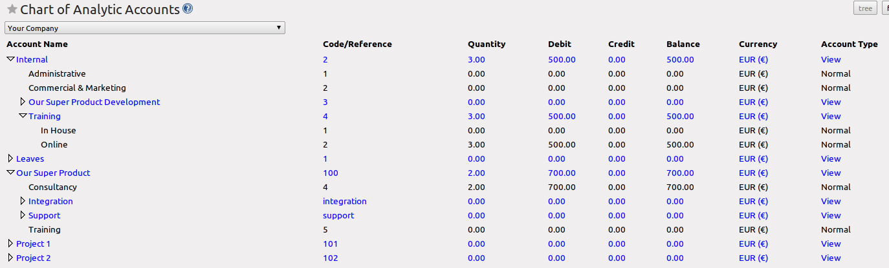
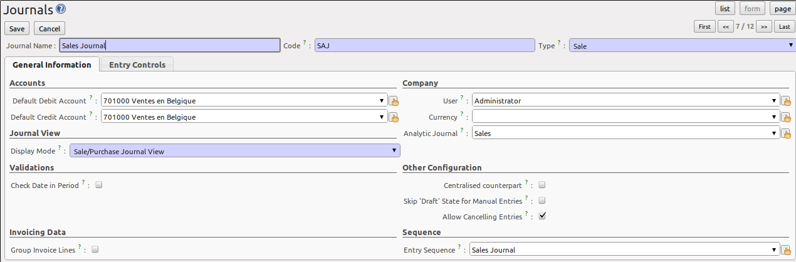
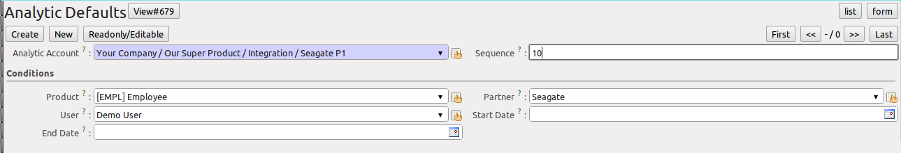

.. i18n: .. index::
.. i18n:    single: analytic; accounts
..

.. index::
   single: analytic; accounts

.. i18n: Putting Analytic Accounts in Place
.. i18n: ==================================
..

使辅助核算项到位
==================================

.. i18n: For the initial setup of good analytic accounts you should:
..

For the initial setup of good analytic accounts you should:

.. i18n: * set up the chart of accounts,
.. i18n: 
.. i18n: * create the different journals,
.. i18n: 
.. i18n: * link the analytic journals to your accounting journals.
..

* set up the chart of accounts,

* create the different journals,

* link the analytic journals to your accounting journals.

.. i18n: Setting up the Chart of Accounts
.. i18n: --------------------------------
..

设置科目表
--------------------------------

.. i18n: Start by choosing the most suitable analytic representation for your company before entering it into OpenERP. To create the different analytic accounts, use the menu :menuselection:`Accounting--> Configuration --> Analytic Accounting --> Analytic Accounts` and click the :guilabel:`Create` button.
.. i18n: Note that the data you see when creating an analytic account will depend upon the business applications installed.
..

Start by choosing the most suitable analytic representation for your company before entering it into OpenERP. To create the different analytic accounts, use the menu :menuselection:`Accounting--> Configuration --> Analytic Accounting --> Analytic Accounts` and click the :guilabel:`Create` button.
Note that the data you see when creating an analytic account will depend upon the business applications installed.

.. i18n: .. figure::  images/account_analytic_form.png
.. i18n:    :scale: 75
.. i18n:    :align: center
.. i18n: 
.. i18n:    *Setting up an Analytic Account*
..

.. figure::  images/account_analytic_form.png
   :scale: 75
   :align: center

   *配置辅助核算项*

.. i18n: To create an analytic account, you have to complete the main fields:
..

To create an analytic account, you have to complete the main fields:

.. i18n: * the :guilabel:`Account Name`,
.. i18n: 
.. i18n: * the :guilabel:`Code/Reference`: used as a shortcut for selecting the account,
.. i18n: 
.. i18n: * the :guilabel:`Parent Analytic Account`: use this field to define the hierarchy between the accounts.
.. i18n: 
.. i18n: * the :guilabel:`Account Type`: just like general accounts, the \ ``View``\ type is used for virtual accounts which are used only to create a hierarchical structure and for subtotals, and not to store accounting entries. The \ ``Normal``\ type will be used for analytic accounts containing entries.
..

* the :guilabel:`Account Name`,

* the :guilabel:`Code/Reference`: used as a shortcut for selecting the account,

* the :guilabel:`Parent Analytic Account`: use this field to define the hierarchy between the accounts.

* the :guilabel:`Account Type`: just like general accounts, the \ ``View``\ type is used for virtual accounts which are used only to create a hierarchical structure and for subtotals, and not to store accounting entries. The \ ``Normal``\ type will be used for analytic accounts containing entries.

.. i18n: If an analytic account (e.g. a project) is for a limited time, you can define a start and end date here.
..

If an analytic account (e.g. a project) is for a limited time, you can define a start and end date here.

.. i18n: The :guilabel:`Maximum Time` can be used for contracts with a fixed limit of hours to use.
..

The :guilabel:`Maximum Time` can be used for contracts with a fixed limit of hours to use.

.. i18n: .. index::
.. i18n:    single: invoicing
..

.. index::
   single: invoicing

.. i18n: .. tip:: Invoicing
.. i18n: 
.. i18n:         You have several methods available to you in OpenERP for automated invoicing:
.. i18n: 
.. i18n:         * Service companies usually use invoicing from purchase orders, analytic accounts or
.. i18n:           project management tasks.
.. i18n: 
.. i18n:         * Manufacturing and trading companies more often use invoicing from deliveries or customer purchase
.. i18n:           orders.
.. i18n: 
.. i18n:         For more information about invoicing from projects, we refer to the book (soon to be released) about Project and Services Management.
..

.. tip:: Invoicing

        You have several methods available to you in OpenERP for automated invoicing:

        * Service companies usually use invoicing from purchase orders, analytic accounts or
          project management tasks.

        * Manufacturing and trading companies more often use invoicing from deliveries or customer purchase
          orders.

        For more information about invoicing from projects, we refer to the book (soon to be released) about Project and Services Management.

.. i18n: Once you have defined the different analytic accounts, you can view your chart through the menu :menuselection:`Accounting --> Charts --> Chart of Analytic Accounts`. You can display analytic accounts for one or more periods or for an entire financial year.
..

Once you have defined the different analytic accounts, you can view your chart through the menu :menuselection:`Accounting --> Charts --> Chart of Analytic Accounts`. You can display analytic accounts for one or more periods or for an entire financial year.

.. i18n: .. figure::  images/account_analytic_chart.png
.. i18n:    :scale: 85
.. i18n:    :align: center
.. i18n: 
.. i18n:    *Analytic Chart of Accounts*
..

   *Analytic Chart of Accounts*

.. i18n: .. index::
.. i18n:    single: module; hr_timesheet_invoice
.. i18n:    single: module; account_analytic_analysis
..

.. index::
   single: module; hr_timesheet_invoice
   single: module; account_analytic_analysis

.. i18n: .. tip:: Setting up an Analytic Account
.. i18n: 
.. i18n:         The setup screen for an analytic account can vary according to the modules installed in your database.
.. i18n:         For example, you will see information about recharging services only if you have the module :mod:`hr_timesheet_invoice` installed.
.. i18n: 
.. i18n:         Some of these modules add helpful management statistics to the analytic account. The most useful is probably the module :mod:`account_analytic_analysis`, which adds such information as indicators about your margins, invoicing amounts, and latest service dates and invoice dates.
..

.. tip:: Setting up an Analytic Account

        The setup screen for an analytic account can vary according to the modules installed in your database.
        For example, you will see information about recharging services only if you have the module :mod:`hr_timesheet_invoice` installed.

        Some of these modules add helpful management statistics to the analytic account. The most useful is probably the module :mod:`account_analytic_analysis`, which adds such information as indicators about your margins, invoicing amounts, and latest service dates and invoice dates.

.. i18n: Creating Journals
.. i18n: -----------------
..

创建辅助核算账簿
-----------------

.. i18n: Once the analytic chart has been created for your company, you have to create the different journals.
.. i18n: These journals enable you to categorise the different accounting entries by their type, such as:
..

Once the analytic chart has been created for your company, you have to create the different journals.
These journals enable you to categorise the different accounting entries by their type, such as:

.. i18n: * services,
.. i18n: 
.. i18n: * expense reimbursements,
.. i18n: 
.. i18n: * purchases of materials,
.. i18n: 
.. i18n: * miscellaneous expenditure,
.. i18n: 
.. i18n: * sales.
..

* services,

* expense reimbursements,

* purchases of materials,

* miscellaneous expenditure,

* sales.

.. i18n: .. index::
.. i18n:    single: journal; minimal journals
..

.. index::
   single: journal; minimal journals

.. i18n: .. note::  Minimal Journals
.. i18n: 
.. i18n:         At a minimum, you have to create one analytic journal for Sales and one for Purchases.
.. i18n:         If you do not create these two, OpenERP will not validate invoices linked to an analytic account,
.. i18n:         because it would not be able to create an analytic accounting entry automatically.
..

.. note::  Minimal Journals

        At a minimum, you have to create one analytic journal for Sales and one for Purchases.
        If you do not create these two, OpenERP will not validate invoices linked to an analytic account,
        because it would not be able to create an analytic accounting entry automatically.

.. i18n: .. figure::  images/account_analytic_journal.png
.. i18n:    :scale: 85
.. i18n:    :align: center
.. i18n: 
.. i18n:    *Creating an Analytic Journal*
..

.. figure::  images/account_analytic_journal.png
   :scale: 85
   :align: center

   *创建辅助核算账簿*

.. i18n: To define your analytic journals, use the menu :menuselection:`Accounting --> Configuration --> Analytic Accounting --> Analytic Journals` then click the :guilabel:`Create` button.
..

To define your analytic journals, use the menu :menuselection:`Accounting --> Configuration --> Analytic Accounting --> Analytic Journals` then click the :guilabel:`Create` button.

.. i18n: It is easy to create an analytic journal. Just give it a :guilabel:`Journal Name`, a :guilabel:`Journal Code` and a :guilabel:`Type`. The
.. i18n: types available are:
..

It is easy to create an analytic journal. Just give it a :guilabel:`Journal Name`, a :guilabel:`Journal Code` and a :guilabel:`Type`. The
types available are:

.. i18n: * \ ``Sale``\, for sales to customers and for credit notes,
.. i18n: 
.. i18n: * \ ``Purchase``\, for purchases and expenses,
.. i18n: 
.. i18n: * \ ``Cash``\, for financial entries,
.. i18n: 
.. i18n: * \ ``Situation``\, to adjust accounts when starting an activity, or at the end of the financial year,
.. i18n: 
.. i18n: * \ ``General``\, for all other entries.
..

* \ ``Sale``\, for sales to customers and for credit notes,

* \ ``Purchase``\, for purchases and expenses,

* \ ``Cash``\, for financial entries,

* \ ``Situation``\, to adjust accounts when starting an activity, or at the end of the financial year,

* \ ``General``\, for all other entries.

.. i18n: The analytic journal now has to be linked to your general journals to allow OpenERP to post the analytic entries. For example, if you enter an invoice for a customer, OpenERP will automatically search for the analytic journal of type \ ``Sales``\ linked to your Sales Journal.
.. i18n: Go to :menuselection:`Accounting--> Configuration --> Financial Accounting --> Journals --> Journals` and select for instance the Sales journal. In the :guilabel:`Analytic Journal` select the analytic sales journal.
..

The analytic journal now has to be linked to your general journals to allow OpenERP to post the analytic entries. For example, if you enter an invoice for a customer, OpenERP will automatically search for the analytic journal of type \ ``Sales``\ linked to your Sales Journal.
Go to :menuselection:`Accounting--> Configuration --> Financial Accounting --> Journals --> Journals` and select for instance the Sales journal. In the :guilabel:`Analytic Journal` select the analytic sales journal.

.. i18n: .. figure::  images/account_general_journal.png
.. i18n:    :scale: 85
.. i18n:    :align: center
.. i18n: 
.. i18n:    *Linking an Analytic Journal to a Journal*
..

   *Linking an Analytic Journal to a Journal*

.. i18n: Working with Analytic Defaults
.. i18n: ------------------------------
..

默认辅助核算项(方案)
------------------------------

.. i18n: You can work with analytic default accounts in OpenERP by installing the :mod:`account_analytic_default` module. Notice that this module is also linked with the :mod:`sale`, :mod:`stock` and :mod:`procurement` modules.
..

You can work with analytic default accounts in OpenERP by installing the :mod:`account_analytic_default` module. Notice that this module is also linked with the :mod:`sale`, :mod:`stock` and :mod:`procurement` modules.

.. i18n: The system will automatically select analytic accounts according to the following criteria:
..

The system will automatically select analytic accounts according to the following criteria:

.. i18n: * Product
.. i18n: * Partner
.. i18n: * User
.. i18n: * Company
.. i18n: * Date
..

* 按 所选产品 产生默认
* 按 所选业务伙伴 产生默认
* 按 登陆用户 产生默认
* 按 所选公司 产生默认
* 按 日期 产生默认

.. i18n: You can configure these criteria using the menu :menuselection:`Accounting --> Configuration --> Analytic Accounting --> Analytic Defaults` and clicking the `Create` button.
.. i18n: According to the criteria you define here, the correct analytic account will be proposed when creating an order or an invoice.
..

You can configure these criteria using the menu :menuselection:`Accounting --> Configuration --> Analytic Accounting --> Analytic Defaults` and clicking the `Create` button.
According to the criteria you define here, the correct analytic account will be proposed when creating an order or an invoice.

.. i18n: .. figure::  images/account_analytic_default.png
.. i18n:    :scale: 85
.. i18n:    :align: center
.. i18n: 
.. i18n:    *Specify Criteria to Automatically Select Analytic Account*
..

   *Specify Criteria to Automatically Select Analytic Account*

.. i18n: .. Copyright © Open Object Press. All rights reserved.
..

.. Copyright © Open Object Press. All rights reserved.

.. i18n: .. You may take electronic copy of this publication and distribute it if you don't
.. i18n: .. change the content. You can also print a copy to be read by yourself only.
..

.. You may take electronic copy of this publication and distribute it if you don't
.. change the content. You can also print a copy to be read by yourself only.

.. i18n: .. We have contracts with different publishers in different countries to sell and
.. i18n: .. distribute paper or electronic based versions of this book (translated or not)
.. i18n: .. in bookstores. This helps to distribute and promote the OpenERP product. It
.. i18n: .. also helps us to create incentives to pay contributors and authors using author
.. i18n: .. rights of these sales.
..

.. We have contracts with different publishers in different countries to sell and
.. distribute paper or electronic based versions of this book (translated or not)
.. in bookstores. This helps to distribute and promote the OpenERP product. It
.. also helps us to create incentives to pay contributors and authors using author
.. rights of these sales.

.. i18n: .. Due to this, grants to translate, modify or sell this book are strictly
.. i18n: .. forbidden, unless Tiny SPRL (representing Open Object Press) gives you a
.. i18n: .. written authorisation for this.
..

.. Due to this, grants to translate, modify or sell this book are strictly
.. forbidden, unless Tiny SPRL (representing Open Object Press) gives you a
.. written authorisation for this.

.. i18n: .. Many of the designations used by manufacturers and suppliers to distinguish their
.. i18n: .. products are claimed as trademarks. Where those designations appear in this book,
.. i18n: .. and Open Object Press was aware of a trademark claim, the designations have been
.. i18n: .. printed in initial capitals.
..

.. Many of the designations used by manufacturers and suppliers to distinguish their
.. products are claimed as trademarks. Where those designations appear in this book,
.. and Open Object Press was aware of a trademark claim, the designations have been
.. printed in initial capitals.

.. i18n: .. While every precaution has been taken in the preparation of this book, the publisher
.. i18n: .. and the authors assume no responsibility for errors or omissions, or for damages
.. i18n: .. resulting from the use of the information contained herein.
..

.. While every precaution has been taken in the preparation of this book, the publisher
.. and the authors assume no responsibility for errors or omissions, or for damages
.. resulting from the use of the information contained herein.

.. i18n: .. Published by Open Object Press, Grand Rosière, Belgium
..

.. Published by Open Object Press, Grand Rosière, Belgium
