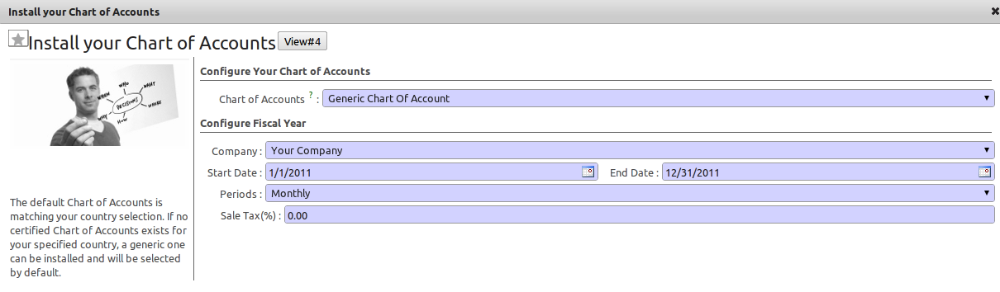
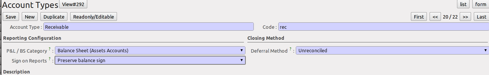

.. i18n: .. index::
.. i18n:    single: accounts; chart
.. i18n:    single: chart of accounts
..

.. index::
   single: accounts; chart
   single: chart of accounts

.. i18n: Chart of Accounts
.. i18n: =================
..

会计科目表
=================

.. i18n: .. index::
.. i18n:    single: modules; l10n_
.. i18n:    single: modules; l10n_be
..

.. index::
   single: modules; l10n_
   single: modules; l10n_be

.. i18n: When configuring the software, OpenERP allows you to choose predefined charts of accounts, which include all basic configuration, such as tax codes and fiscal positions. Of course, you can also define your own chart of accounts.
..

配置软件时，OpenERP允许您选择预定义的会计科目表，其中包括所有的基本配置，如税收法规和财政状况。当然，你也可以定义自己的会计科目表。

.. i18n: Using a Preconfigured Chart of Accounts
.. i18n: ---------------------------------------
..

使用预配置的会计科目表
---------------------------------------

.. i18n: On installation, the software allows you to select a default chart of accounts from a huge list of predefined charts. To install the chart of accounts as well as the tax definitions for your own country (in most cases), select the chart corresponding to your country from the ``Installation Wizard``.
.. i18n: The ``Generic Chart of Accounts`` offers a default (but limited) set of accounts which can be used as a basic chart in any country. The ``Chart of Accounts`` list also includes a lot of localised charts of accounts.
..

在安装时，软件可以让您从一个许多的预定义好的科目表中选择一个默认的会计科目表。 To install the chart of accounts as well as the tax definitions for your own country (in most cases), select the chart corresponding to your country from the ``Installation Wizard``.
The ``Generic Chart of Accounts`` offers a default (but limited) set of accounts which can be used as a basic chart in any country.   ``Chart of Accounts`` 列表中还包括了很多本地化的会计科目表。

.. i18n: .. figure::  images/account_chart.png
.. i18n:    :scale: 75
.. i18n:    :align: center
.. i18n: 
.. i18n:    *Starting from a Generic Chart of Accounts*
..

   *Starting from a Generic Chart of Accounts*

.. i18n: The wizard will change a bit according to the chart of accounts you select. For the Generic Chart you will be able to add a tax percentage, which will not be the case when you install, for instance, the chart named ``Belgium - Plan Comptable Minimum Normalise``. Here OpenERP will automatically install the tax configuration for Belgium too. You will, however, be able to select the default sales and purchase tax to be added when you create a new product.
..

该向导将根据您所选择的科目表而有所不同。 For the Generic Chart you will be able to add a tax percentage, which will not be the case when you install, for instance, the chart named ``Belgium - Plan Comptable Minimum Normalise``. Here OpenERP will automatically install the tax configuration for Belgium too. 您也许愿意，当增加一个新的产品时可以选择默认的销售和采购税种。

.. i18n: .. figure::  images/account_chart_be.png
.. i18n:    :scale: 75
.. i18n:    :align: center
.. i18n: 
.. i18n:    *Starting from a Belgian Chart of Accounts*
..

.. figure::  images/account_chart_be.png
   :scale: 75
   :align: center

   *Starting from a Belgian Chart of Accounts*

.. i18n: Please keep in mind that even when you use a default chart of accounts, you can still modify it to fit your needs.
..

请记住，即使您使用默认的会计科目表，您仍然可以修改它以满足您的需求。

.. i18n: .. note:: Modules
.. i18n: 
.. i18n:     You can install a chart from the list of modules too, so simply skip the installation wizard then. The module name will be like :mod:`l10n_XX` where XX represents your country code in two letters. For example, to get the chart of accounts for Belgium, go to :menuselection:`Settings --> Modules --> Modules` and install the module :mod:`l10n_be`. This will propose the exact same chart from the wizard (``Belgium - Plan Comptable Minimum Normalise``).
..

.. note:: 模块

    您也可以从模块列表中安装一个科目表，要这样在此只需要简单地跳过安装向导。 模块名会类似 :mod:`l10n_XX` where XX represents your country code in two letters. 例如,要得到比利时科目表, 通过 :menuselection:`Settings --> Modules --> Modules` 安装模块 :mod:`l10n_be`。 结果和通过向导 (``Belgium - Plan Comptable Minimum Normalise``) 可取得同样的科目表。

.. i18n: Some of these pre-defined charts of accounts are comprehensive and accurate, others rather have a more tentative status and are simply indicators of the possibilities. You can modify these, or build your own accounts onto the default chart, or replace it entirely with a custom chart.
..

许多预定义的科目表是完整且准确的，但也有一些处于试验状态和仅仅显示其可能性如此定义。 您可以修改它们，或在默认科目表上定义自己的科目， 或根据自定义的科目表修改其中项目。

.. i18n: Creating a Chart of Accounts
.. i18n: ----------------------------
..

建立会计科目表
----------------------------

.. i18n: .. index::
.. i18n:    pair: account; type
..

.. index::
   pair: account; type

.. i18n: Start by creating :guilabel:`Account Types`, which determine the kind of account and the way in which accounts will be treated at financial year closing.
..

Start by creating :guilabel:`Account Types`, which determine the kind of account and the way in which accounts will be treated at financial year closing.

.. i18n: To add, modify or delete existing account types, go to the menu :menuselection:`Accounting --> Configuration --> Financial Accounting --> Accounts --> Account Types`.
..

要增加，修改或删除已存在的科目类型得通过菜单 :menuselection:`Accounting --> Configuration --> Financial Accounting --> Accounts --> Account Types`.

.. i18n: .. figure::  images/account_type.png
.. i18n:    :scale: 75
.. i18n:    :align: center
.. i18n: 
.. i18n:    *Defining Account Types*
..

   *定义科目类型*

.. i18n: The fields used to define an account type are the following:
..

用于定义科目类型的字段如下：

.. i18n: *  :guilabel:`Account Type`: the name of the account type.
.. i18n: 
.. i18n: *  :guilabel:`Code`: the code of the account type.
.. i18n: 
.. i18n: *  :guilabel:`PL/BS Category`: this category determines where in a report the account will be printed (i.e. Balance Sheet and Profit and Loss). There are five types you can use: No type at all (/), Balance Sheet (Assets Accounts = active), Balance Sheet (Liabilities Accounts = passive), Profit & Loss (Income) and Profit & Loss (Expense).
.. i18n: 
.. i18n: *  :guilabel:`Deferral Method`: this field indicates how and whether the account will be transferred at financial year closing.
.. i18n: 
.. i18n:     - ``None`` means that the account will not be transferred. Typically used for profit and loss accounts.
.. i18n:     - ``Balance`` means that the account balance will be transferred at year closing. Typically used for balance sheet accounts.
.. i18n:     - ``Detail`` means that every single entry will be transferred to the next financial year.
.. i18n:     - ``Unreconciled`` means that only unreconciled (outstanding) entries will be transferred to the next financial year. Typically used for centralisation accounts.
.. i18n: 
.. i18n: *  :guilabel:`Sign on Reports`: this field allows you to reverse the sign of accounts, such as Income accounts being printed positive instead of the default negative. Use ``Reverse balance sign`` to accomplish this.
..

*  :guilabel:`Account Type`: 科目类型名称。

*  :guilabel:`Code`: 科目类型编码。

*  :guilabel:`PL/BS Category`: this category determines where in a report the account will be printed (i.e. Balance Sheet and Profit and Loss). There are five types you can use: No type at all (/), Balance Sheet (Assets Accounts = active), Balance Sheet (Liabilities Accounts = passive), Profit & Loss (Income) and Profit & Loss (Expense).

*  :guilabel:`Deferral Method`: this field indicates how and whether the account will be transferred at financial year closing.

    - ``None`` means that the account will not be transferred. Typically used for profit and loss accounts.
    - ``Balance`` means that the account balance will be transferred at year closing. Typically used for balance sheet accounts.
    - ``Detail`` means that every single entry will be transferred to the next financial year.
    - ``Unreconciled`` means that only unreconciled (outstanding) entries will be transferred to the next financial year. Typically used for centralisation accounts.

*  :guilabel:`Sign on Reports`: this field allows you to reverse the sign of accounts, such as Income accounts being printed positive instead of the default negative. Use ``Reverse balance sign`` to accomplish this.

.. i18n: Use the :guilabel:`View` type for accounts that make up the structure of the charts and have no account data inputs of their own.
..

Use the :guilabel:`View` type for accounts that make up the structure of the charts and have no account data inputs of their own.

.. i18n: To add, modify or delete existing accounts, use the menu :menuselection:`Accounting --> Configuration --> Financial Accounting --> Accounts --> Accounts`.
..

要增加，修改或删除已存在的会计科目得通过菜单 :menuselection:`Accounting --> Configuration --> Financial Accounting --> Accounts --> Accounts`.

.. i18n: .. figure::  images/account_form.png
.. i18n:    :scale: 75
.. i18n:    :align: center
.. i18n: 
.. i18n:    *Defining Accounts*
..

.. figure::  images/account_form.png
   :scale: 75
   :align: center

   *定义会计科目*

.. i18n: The main account fields are:
..

科目涉及的主要的字段:

.. i18n: *  :guilabel:`Name`: the account name.
.. i18n: 
.. i18n: *  :guilabel:`Code`: the code length is not limited to a specific number of digits. Use code 0 to indicate the root account.
.. i18n: 
.. i18n: *  :guilabel:`Parent`: determines which account is the parent of this one, to create the tree structure of
.. i18n:    the chart of accounts.
.. i18n: 
.. i18n: *  :guilabel:`Internal Type`: internal types have special effects in OpenERP.
.. i18n:    By default, the following types are available:
.. i18n:    ``View`` can be used to create a hierarchical structure for your accounts (grouping),
.. i18n:    ``Regular`` any account that does not fit into one of the other types; most of the accounts will have this type,
.. i18n:    ``Receivable`` - ``Payable``: these types are used to indicate the centralisation accounts (for customers and suppliers) that will be set for each partner,
.. i18n:    ``Liquidity`` used to indicate financial accounts (bank and cash accounts),
.. i18n:    ``Consolidation`` to create a virtual (or consolidation) chart of accounts,
.. i18n:    ``Closed`` to indicate accounts that are no longer used.
.. i18n: 
.. i18n: *  :guilabel:`Account Type`: it is important to select the corresponding account type, as explained above. This will have an impact at year closing and also when printing reports.
.. i18n: 
.. i18n: *  :guilabel:`Secondary Currency`: forces all the moves for this account to have this secondary currency. Note that you can also define exchange rates from the menu :menuselection:`Accounting --> Configuration --> Miscellaneous --> Currencies`.
.. i18n: 
.. i18n: *  :guilabel:`Outgoing Currencies Rate`: to be selected only when you add a secondary currency. You have two options for outgoing transactions: ``At Date`` or ``Average Rate``. Incoming transactions are always calculated ``At Date``, according to the date of the transaction.
.. i18n: 
.. i18n: *  :guilabel:`Allow Reconciliation`: determines if you can reconcile the entries in this account. Activate this field for receivable and payable accounts and any other account that need to be reconciled other than by bank statements.
.. i18n: 
.. i18n: *  :guilabel:`Default Taxes`: this is the default tax applied to purchases or sales using this account. It enables the system to propose tax entries automatically when entering data in a journal manually.
..

*  :guilabel:`Name`: 科目名称。

*  :guilabel:`Code`: 科目编码数字的位数不受限制. 0为顶级科目的编码。

*  :guilabel:`Parent`: 确定哪个科目是本科目的上级科目， 这样可创建树型科目表。

*  :guilabel:`Internal Type`: OpenERP中有特殊作用的内部类型。正常情况下，有如下类型可选：

   ``View`` can be used to create a hierarchical structure for your accounts (grouping),
   ``Regular`` any account that does not fit into one of the other types; most of the accounts will have this type,
   ``Receivable`` - ``Payable``: these types are used to indicate the centralisation accounts (for customers and suppliers) that will be set for each partner,
   ``Liquidity`` used to indicate financial accounts (bank and cash accounts),
   ``Consolidation`` to create a virtual (or consolidation) chart of accounts,
   ``Closed`` to indicate accounts that are no longer used.

*  :guilabel:`Account Type`: it is important to select the corresponding account type, as explained above. This will have an impact at year closing and also when printing reports.

*  :guilabel:`Secondary Currency`: forces all the moves for this account to have this secondary currency. Note that you can also define exchange rates from the menu :menuselection:`Accounting --> Configuration --> Miscellaneous --> Currencies`.

*  :guilabel:`Outgoing Currencies Rate`: to be selected only when you add a secondary currency. You have two options for outgoing transactions: ``At Date`` or ``Average Rate``. Incoming transactions are always calculated ``At Date``, according to the date of the transaction.

*  :guilabel:`Allow Reconciliation`: determines if you can reconcile the entries in this account. Activate this field for receivable and payable accounts and any other account that need to be reconciled other than by bank statements.

*  :guilabel:`Default Taxes`: this is the default tax applied to purchases or sales using this account. It enables the system to propose tax entries automatically when entering data in a journal manually.

.. i18n: The tree structure of the accounts can be altered as often and as much as you wish without recalculating any of the individual entries. So you can easily restructure your account during the year to reflect the reality of the company better.
..

The tree structure of the accounts can be altered as often and as much as you wish without recalculating any of the individual entries. So you can easily restructure your account during the year to reflect the reality of the company better.

.. i18n: You can have a look at active charts of accounts using the menu :menuselection:`Accounting --> Charts --> Chart of Accounts`, and :guilabel:`Open Charts` for the selected year, account moves and periods. Click an account to drill down to its details. 
..

You can have a look at active charts of accounts using the menu :menuselection:`Accounting --> Charts --> Chart of Accounts`, and :guilabel:`Open Charts` for the selected year, account moves and periods. Click an account to drill down to its details. 

.. i18n: .. note:: Hierarchical Charts
.. i18n: 
.. i18n:         Most accounting software packages represent their charts of accounts in the form of a list. You can
.. i18n:         do this in OpenERP as well if you want to, but its tree view offers several advantages:
.. i18n: 
.. i18n:         * it lets you show in detail only the accounts that interest you,
.. i18n: 
.. i18n:         * it enables you to get a global view of accounts (when you show only summary accounts),
.. i18n: 
.. i18n:         * it is more intuitive, because you can search for accounts on the basis of their classification,
.. i18n: 
.. i18n:         * it is flexible because you can easily restructure them.
..

.. note:: Hierarchical Charts

        Most accounting software packages represent their charts of accounts in the form of a list. You can
        do this in OpenERP as well if you want to, but its tree view offers several advantages:

        * it lets you show in detail only the accounts that interest you,

        * it enables you to get a global view of accounts (when you show only summary accounts),

        * it is more intuitive, because you can search for accounts on the basis of their classification,

        * it is flexible because you can easily restructure them.

.. i18n: The structure of the chart of accounts is hierarchical, with account subtotals calculated from the ``View`` accounts. You can develop a set of view accounts to contain only those elements that interest you.
..

The structure of the chart of accounts is hierarchical, with account subtotals calculated from the ``View`` accounts. You can develop a set of view accounts to contain only those elements that interest you.

.. i18n: To get the details of the account entries that are important to you, all you need to do is click the account's code or name.
..

To get the details of the account entries that are important to you, all you need to do is click the account's code or name.

.. i18n: Displaying the chart of accounts can take several seconds, because OpenERP calculates the debits, credits and balance for each account in real time. 
..

Displaying the chart of accounts can take several seconds, because OpenERP calculates the debits, credits and balance for each account in real time. 

.. i18n: .. index::
.. i18n:    single: consolidation (accounting)
.. i18n:    pair: chart of accounts; virtual
..

.. index::
   single: consolidation (accounting)
   pair: chart of accounts; virtual

.. i18n: Virtual Charts of Accounts
.. i18n: --------------------------
..

虚拟会计科目表
--------------------------

.. i18n: The structure of a chart of accounts is imposed by the legislation in effect in the country concerned. Unfortunately, that structure does not always correspond to the view that a company needs.
..

The structure of a chart of accounts is imposed by the legislation in effect in the country concerned. Unfortunately, that structure does not always correspond to the view that a company needs.

.. i18n: In OpenERP, you can use the concept of virtual charts of accounts to manage several representations of the same accounts simultaneously. These representations can be shown in real time with no additional data entry.
..

In OpenERP, you can use the concept of virtual charts of accounts to manage several representations of the same accounts simultaneously. These representations can be shown in real time with no additional data entry.

.. i18n: So your general chart of accounts can be the one imposed by the statutes of your country, and your CEO can then have other virtual charts as necessary, based on the accounts in the general chart. For example, you can create a view per department, a cash-flow and liquidity view, or consolidated accounts for different companies.
..

So your general chart of accounts can be the one imposed by the statutes of your country, and your CEO can then have other virtual charts as necessary, based on the accounts in the general chart. For example, you can create a view per department, a cash-flow and liquidity view, or consolidated accounts for different companies.

.. i18n: The most interesting thing about virtual charts of accounts is that they can be used in the same way as the default chart of accounts for the whole organization. For example, you can establish budgets from your consolidated accounts or from the accounts from one of your companies.
..

The most interesting thing about virtual charts of accounts is that they can be used in the same way as the default chart of accounts for the whole organization. For example, you can establish budgets from your consolidated accounts or from the accounts from one of your companies.

.. i18n: .. tip:: Virtual Accounts
.. i18n: 
.. i18n:         Virtual accounts enable you to provide different representations of one or several existing charts of accounts.
.. i18n:         Creating and restructuring virtual accounts has no impact on the accounting entries.
.. i18n:         You can then use the virtual charts with no risk of altering the general chart of accounts or future accounting entries.
.. i18n: 
.. i18n:         Because they are used only to get a different representation of the same entries, they are very useful for:
.. i18n: 
.. i18n:         * consolidating several companies in real time,
.. i18n: 
.. i18n:         * reporting to a holding according to their chart of accounts,
.. i18n: 
.. i18n:         * depreciation calculations,
.. i18n: 
.. i18n:         * cash-flow views,
.. i18n: 
.. i18n:         * getting more useful views than those imposed,
.. i18n: 
.. i18n:         * presenting summary charts to other users that are appropriate to their general system rights.
.. i18n: 
.. i18n:         So there are good reasons for viewing the impact of financial transactions through virtual charts, such as budgets and financial indicators based on special views of the company.
..

.. tip:: Virtual Accounts

        Virtual accounts enable you to provide different representations of one or several existing charts of accounts.
        Creating and restructuring virtual accounts has no impact on the accounting entries.
        You can then use the virtual charts with no risk of altering the general chart of accounts or future accounting entries.

        Because they are used only to get a different representation of the same entries, they are very useful for:

        * consolidating several companies in real time,

        * reporting to a holding according to their chart of accounts,

        * depreciation calculations,

        * cash-flow views,

        * getting more useful views than those imposed,

        * presenting summary charts to other users that are appropriate to their general system rights.

        So there are good reasons for viewing the impact of financial transactions through virtual charts, such as budgets and financial indicators based on special views of the company.

.. i18n: To create a new chart of accounts you should create a root account using the menu :menuselection:`Accounting --> Configuration --> Financial Accounting --> Accounts --> Accounts`. Your top level account should have a name, a code (different from any other code in your current chart), an :guilabel:`Internal Type` and :guilabel:`Account Type`  \ ``View``\. Then you can choose your structure by creating other accounts of :guilabel:`Account Type` \ ``View``\ as necessary. The :guilabel:`Internal Type` should be of the ``Consolidation`` type if you want to map accounts. Check your virtual structure using the menu :menuselection:`Financial Management --> Charts --> Charts of Accounts` and select the corresponding chart in the drop-down list at the top of the screen.
..

To create a new chart of accounts you should create a root account using the menu :menuselection:`Accounting --> Configuration --> Financial Accounting --> Accounts --> Accounts`. Your top level account should have a name, a code (different from any other code in your current chart), an :guilabel:`Internal Type` and :guilabel:`Account Type`  \ ``View``\. Then you can choose your structure by creating other accounts of :guilabel:`Account Type` \ ``View``\ as necessary. The :guilabel:`Internal Type` should be of the ``Consolidation`` type if you want to map accounts. Check your virtual structure using the menu :menuselection:`Financial Management --> Charts --> Charts of Accounts` and select the corresponding chart in the drop-down list at the top of the screen.

.. i18n: To be able to map your virtual chart of accounts to your general chart of accounts, you have to set :guilabel:`Internal Type` as ``Consolidation``. From the :guilabel:`Consolidated Children` you can then map accounts or make accounts consolidate. In the :guilabel:`Consolidated Children`, you can add ``View`` accounts or normal accounts. If you add a ``View`` account to the consolidated children, OpenERP will automatically include all existing and future linked accounts.
..

To be able to map your virtual chart of accounts to your general chart of accounts, you have to set :guilabel:`Internal Type` as ``Consolidation``. From the :guilabel:`Consolidated Children` you can then map accounts or make accounts consolidate. In the :guilabel:`Consolidated Children`, you can add ``View`` accounts or normal accounts. If you add a ``View`` account to the consolidated children, OpenERP will automatically include all existing and future linked accounts.

.. i18n: .. figure::  images/account_virtual.png
.. i18n:    :scale: 75
.. i18n:    :align: center
.. i18n: 
.. i18n:    *Virtual Accounts Mapped to View Account*
..

.. figure::  images/account_virtual.png
   :scale: 75
   :align: center

   *Virtual Accounts Mapped to View Account*

.. i18n: You can then run reports such as :guilabel:`Trial Balance` and :guilabel:`General Ledger` for both your general chart of accounts and your virtual chart(s) giving you another representation of the company. All the actions and states in your general account are also available in the virtual accounts.
..

You can then run reports such as :guilabel:`Trial Balance` and :guilabel:`General Ledger` for both your general chart of accounts and your virtual chart(s) giving you another representation of the company. All the actions and states in your general account are also available in the virtual accounts.

.. i18n: Finally, you can also make virtual charts of accounts from other virtual charts. That can give an additional dimension for financial analysis. You can create an unlimited number of virtual (consolidation) charts of accounts.
..

Finally, you can also make virtual charts of accounts from other virtual charts. That can give an additional dimension for financial analysis. You can create an unlimited number of virtual (consolidation) charts of accounts.

.. i18n: .. Copyright © Open Object Press. All rights reserved.
..

.. Copyright © Open Object Press. All rights reserved.

.. i18n: .. You may take electronic copy of this publication and distribute it if you don't
.. i18n: .. change the content. You can also print a copy to be read by yourself only.
..

.. You may take electronic copy of this publication and distribute it if you don't
.. change the content. You can also print a copy to be read by yourself only.

.. i18n: .. We have contracts with different publishers in different countries to sell and
.. i18n: .. distribute paper or electronic based versions of this book (translated or not)
.. i18n: .. in bookstores. This helps to distribute and promote the OpenERP product. It
.. i18n: .. also helps us to create incentives to pay contributors and authors using author
.. i18n: .. rights of these sales.
..

.. We have contracts with different publishers in different countries to sell and
.. distribute paper or electronic based versions of this book (translated or not)
.. in bookstores. This helps to distribute and promote the OpenERP product. It
.. also helps us to create incentives to pay contributors and authors using author
.. rights of these sales.

.. i18n: .. Due to this, grants to translate, modify or sell this book are strictly
.. i18n: .. forbidden, unless Tiny SPRL (representing Open Object Press) gives you a
.. i18n: .. written authorisation for this.
..

.. Due to this, grants to translate, modify or sell this book are strictly
.. forbidden, unless Tiny SPRL (representing Open Object Press) gives you a
.. written authorisation for this.

.. i18n: .. Many of the designations used by manufacturers and suppliers to distinguish their
.. i18n: .. products are claimed as trademarks. Where those designations appear in this book,
.. i18n: .. and Open Object Press was aware of a trademark claim, the designations have been
.. i18n: .. printed in initial capitals.
..

.. Many of the designations used by manufacturers and suppliers to distinguish their
.. products are claimed as trademarks. Where those designations appear in this book,
.. and Open Object Press was aware of a trademark claim, the designations have been
.. printed in initial capitals.

.. i18n: .. While every precaution has been taken in the preparation of this book, the publisher
.. i18n: .. and the authors assume no responsibility for errors or omissions, or for damages
.. i18n: .. resulting from the use of the information contained herein.
..

.. While every precaution has been taken in the preparation of this book, the publisher
.. and the authors assume no responsibility for errors or omissions, or for damages
.. resulting from the use of the information contained herein.

.. i18n: .. Published by Open Object Press, Grand Rosière, Belgium
..

.. Published by Open Object Press, Grand Rosière, Belgium
