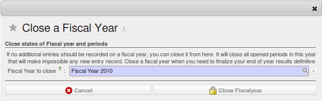

.. i18n: .. index::
.. i18n:    single: closing; end of year; opening; opening entry
..

.. index::
   single: closing; end of year; opening; opening entry

.. i18n: Opening and Closing a Financial Year
.. i18n: ====================================
..

会计年度的启用和结账
====================================

.. i18n: At the end of a financial year, you will have to transfer the closing balance of that year as an opening balance to the new financial year. OpenERP allows you to automatically post such an entry. You can transfer the new opening balance numerous times, because it is impossible to close a year at once. Correction entries will have to be made, due to which balances will change. The new balance can easily be transferred through a wizard, so you do not have to keep track of each correction entry made in the previous financial year.
..

At the end of a financial year, you will have to transfer the closing balance of that year as an opening balance to the new financial year. OpenERP allows you to automatically post such an entry. You can transfer the new opening balance numerous times, because it is impossible to close a year at once. Correction entries will have to be made, due to which balances will change. The new balance can easily be transferred through a wizard, so you do not have to keep track of each correction entry made in the previous financial year.

.. i18n: .. note:: OpenERP Accounting
.. i18n: 
.. i18n:     The procedure below is valid if you already have a financial year with entries in OpenERP.
..

.. note:: OpenERP Accounting

    The procedure below is valid if you already have a financial year with entries in OpenERP.

.. i18n: Steps to Open a New Financial Year in an Existing OpenERP Configuration
.. i18n: -----------------------------------------------------------------------
..

在一个已有的 OpenERP 配置中，逐步启用一个新的会计年度
-----------------------------------------------------------------------

.. i18n: .. index::
.. i18n:    single: accounts; start of year
..

.. index::
   single: accounts; start of year

.. i18n: Before generating the opening balance for your various accounts, you have to go through several steps.
..

Before generating the opening balance for your various accounts, you have to go through several steps.

.. i18n: 1. Create the new Financial Year
..

1. Create the new Financial Year

.. i18n: Create the new financial year as explained in :ref:`financialyear`.
..

Create the new financial year as explained in :ref:`financialyear`.

.. i18n: 2. Define an Opening Period
..

2. Define an Opening Period

.. i18n: Go to :menuselection:`Accounting --> Configuration --> Financial Accounting --> Periods --> Periods` and create a new period for the financial year you wish to open (in case it has not been generated automatically). Make sure to link the period to the newly defined financial year. Select the :guilabel:`Opening/Closing Period` checkbox to indicate that this period should be used for opening entries. Both dates typically match the first day of your financial year (e.g. 01/01/YYYY).
..

Go to :menuselection:`Accounting --> Configuration --> Financial Accounting --> Periods --> Periods` and create a new period for the financial year you wish to open (in case it has not been generated automatically). Make sure to link the period to the newly defined financial year. Select the :guilabel:`Opening/Closing Period` checkbox to indicate that this period should be used for opening entries. Both dates typically match the first day of your financial year (e.g. 01/01/YYYY).

.. i18n: 3. Check the Account Types
..

3. Check the Account Types

.. i18n: Before generating the opening entries, make sure to check the defined account types, more specifically the :guilabel:`Deferral Method`.
.. i18n: The deferral method determines whether and how account entries will be transferred to the new financial year. There are four possible deferral methods: None, Balance, Detail, Unreconciled.
..

Before generating the opening entries, make sure to check the defined account types, more specifically the :guilabel:`Deferral Method`.
The deferral method determines whether and how account entries will be transferred to the new financial year. There are four possible deferral methods: None, Balance, Detail, Unreconciled.

.. i18n: =============== ======================================================================
.. i18n: Deferral Method Action
.. i18n: =============== ======================================================================
.. i18n: None            Nothing will be transferred (typically P&L accounts)
.. i18n: Balance         Account balance will be transferred (typically Balance Sheet accounts)
.. i18n: Detail          All entries are transferred, also reconciled entries
.. i18n: Unreconciled    Only entries that are not reconciled on the first day of the new
.. i18n:                 financial year will be transferred (typically receivable and payable)
.. i18n: =============== ======================================================================
..

=============== ======================================================================
Deferral Method Action
=============== ======================================================================
None            Nothing will be transferred (typically P&L accounts)
Balance         Account balance will be transferred (typically Balance Sheet accounts)
Detail          All entries are transferred, also reconciled entries
Unreconciled    Only entries that are not reconciled on the first day of the new
                financial year will be transferred (typically receivable and payable)
=============== ======================================================================

.. i18n: 4. Check the Link between Account and Account Type.
..

4. Check the Link between Account and Account Type.

.. i18n: Check whether each account is linked to the correct account type to avoid generating an incorrect opening entry.
..

Check whether each account is linked to the correct account type to avoid generating an incorrect opening entry.

.. i18n: 5. Create an Opening/Closing Journal
..

5. Create an Opening/Closing Journal

.. i18n: Go to :menuselection:`Accounting --> Configuration --> Financial Accounting --> Journals --> Journals`.
.. i18n: Create a new journal to post your opening entries. Make sure to respect the following settings:
..

Go to :menuselection:`Accounting --> Configuration --> Financial Accounting --> Journals --> Journals`.
Create a new journal to post your opening entries. Make sure to respect the following settings:

.. i18n:     1. :guilabel:`Type` should be :guilabel:`Opening/Closing Situation`.
.. i18n:     2. :guilabel:`Standard debit/credit account` could be something like 140000 Benefits.
.. i18n:     3. :guilabel:`Centralised counterpart` will be checked automatically when select the journal type, to avoid a counterpart on each line, and instead have one debit and one credit entry on the corresponding opening account.
.. i18n:     4. The :guilabel:`Entry Sequence` will also be created automatically on save.
..

    1. :guilabel:`Type` should be :guilabel:`Opening/Closing Situation`.
    2. :guilabel:`Standard debit/credit account` could be something like 140000 Benefits.
    3. :guilabel:`Centralised counterpart` will be checked automatically when select the journal type, to avoid a counterpart on each line, and instead have one debit and one credit entry on the corresponding opening account.
    4. The :guilabel:`Entry Sequence` will also be created automatically on save.

.. i18n: Generating the Opening Entry
.. i18n: ----------------------------
..

生成期初分录
----------------------------

.. i18n: To automatically generate the opening entries based on your actual books, OpenERP provides a wizard. Go to :menuselection:`Accounting --> Periodical Processing --> End of Period --> Generate Opening Entries`.
..

To automatically generate the opening entries based on your actual books, OpenERP provides a wizard. Go to :menuselection:`Accounting --> Periodical Processing --> End of Period --> Generate Opening Entries`.

.. i18n: In the wizard, enter the financial year for which you want to transfer the balances (:guilabel:`Fiscal Year to close`). Select the :guilabel:`New Fiscal Year` (the year in which you want to generate the opening entry). You also have to select the journal and the period to post the opening entries. The description for the opening entry is proposed by default, but of course you can enter your own description, such as *Opening Entry for financial year YYYY*. Then you click the :guilabel:`Create` button to generate the opening entry according to the settings defined.
..

In the wizard, enter the financial year for which you want to transfer the balances (:guilabel:`Fiscal Year to close`). Select the :guilabel:`New Fiscal Year` (the year in which you want to generate the opening entry). You also have to select the journal and the period to post the opening entries. The description for the opening entry is proposed by default, but of course you can enter your own description, such as *Opening Entry for financial year YYYY*. Then you click the :guilabel:`Create` button to generate the opening entry according to the settings defined.

.. i18n: To have a look at the draft opening entry that has been generated, go to :menuselection:`Accounting --> Journal Entries --> Journal Entries`. Click the :guilabel:`Unposted` button to filter only draft entries. Open the corresponding entry and verify the data. Click the :guilabel:`Post` button to confirm the entry.
..

To have a look at the draft opening entry that has been generated, go to :menuselection:`Accounting --> Journal Entries --> Journal Entries`. Click the :guilabel:`Unposted` button to filter only draft entries. Open the corresponding entry and verify the data. Click the :guilabel:`Post` button to confirm the entry.

.. i18n: .. note:: Changes in Previous Financial Year
.. i18n: 
.. i18n:     As long as the audit is ongoing, extra entries may be added to the financial year to close. To automatically have the correct balances, OpenERP allows you to use the `Cancel Opening Entries` wizard. This wizard will automatically cancel the existing opening entry.
.. i18n: 
.. i18n:     To update the balances to show the correct results, you should run the :guilabel:`Generate Opening Entries:guilabel:` wizard again. The new opening entry will contain the correct balances. This way, you can generate your opening entry as many times as required.
..

.. note:: Changes in Previous Financial Year

    As long as the audit is ongoing, extra entries may be added to the financial year to close. To automatically have the correct balances, OpenERP allows you to use the `Cancel Opening Entries` wizard. This wizard will automatically cancel the existing opening entry.

    To update the balances to show the correct results, you should run the :guilabel:`Generate Opening Entries:guilabel:` wizard again. The new opening entry will contain the correct balances. This way, you can generate your opening entry as many times as required.

.. i18n: Closing a Financial Year
.. i18n: ------------------------
..

会计年度结账
------------------------

.. i18n: To close a financial year, use the menu :menuselection:`Accounting--> Periodical Processing --> End of Period --> Close a Fiscal Year`.
.. i18n: A wizard opens asking you for the financial year to close.
..

To close a financial year, use the menu :menuselection:`Accounting--> Periodical Processing --> End of Period --> Close a Fiscal Year`.
A wizard opens asking you for the financial year to close.

.. i18n: When the year is closed, you can no longer create or modify any transactions in that year.
.. i18n: So you should always make a backup of the database before closing the fiscal year. Closing a year is not mandatory, and you could easily do that sometime in the following year, when your accounts are finally sent to the statutory authorities, and no further modifications are permitted.
..

When the year is closed, you can no longer create or modify any transactions in that year.
So you should always make a backup of the database before closing the fiscal year. Closing a year is not mandatory, and you could easily do that sometime in the following year, when your accounts are finally sent to the statutory authorities, and no further modifications are permitted.

.. i18n: .. figure::  images/account_fy_close.png
.. i18n:    :scale: 75
.. i18n:    :align: center
.. i18n: 
.. i18n:    *Closing a Financial Year*
..

   *Closing a Financial Year*

.. i18n: Steps to Start your Financial Year
.. i18n: ==================================
..

Steps to Start your Financial Year
==================================

.. i18n: When you decide to do your accounting in OpenERP, and you already have an accounting system, you should enter your opening balance and outstanding entries in OpenERP. Make sure you configure your accounting system as explained in the Configuration chapter.
.. i18n: Below we explain the minimal configuration required to post your opening balance and outstanding entries.
..

When you decide to do your accounting in OpenERP, and you already have an accounting system, you should enter your opening balance and outstanding entries in OpenERP. Make sure you configure your accounting system as explained in the Configuration chapter.
Below we explain the minimal configuration required to post your opening balance and outstanding entries.

.. i18n: 1. Create the new Financial Year
..

1. Create the new Financial Year

.. i18n: Create the new financial year as explained in :ref:`financialyear`.
..

Create the new financial year as explained in :ref:`financialyear`.

.. i18n: 2. Define an Opening Period
..

2. Define an Opening Period

.. i18n: Go to :menuselection:`Accounting --> Configuration --> Financial Accounting --> Periods --> Periods` and create a new period for the financial year you wish to open (in case it has not been generated automatically). Make sure to link the period to the newly defined financial year. Select the :guilabel:`Opening/Closing Period` checkbox to indicate that this period should be used for opening entries. Both dates typically match the first day of your financial year (e.g. 01/01/YYYY).
..

Go to :menuselection:`Accounting --> Configuration --> Financial Accounting --> Periods --> Periods` and create a new period for the financial year you wish to open (in case it has not been generated automatically). Make sure to link the period to the newly defined financial year. Select the :guilabel:`Opening/Closing Period` checkbox to indicate that this period should be used for opening entries. Both dates typically match the first day of your financial year (e.g. 01/01/YYYY).

.. i18n: 3. Check the Account Types
..

3. Check the Account Types

.. i18n: Before generating the opening entries, make sure to check the defined account types, more specifically the :guilabel:`Deferral Method`.
.. i18n: The deferral method determines whether and how account entries will be transferred to the new financial year. There are four possible deferral methods: None, Balance, Detail, Unreconciled.
..

Before generating the opening entries, make sure to check the defined account types, more specifically the :guilabel:`Deferral Method`.
The deferral method determines whether and how account entries will be transferred to the new financial year. There are four possible deferral methods: None, Balance, Detail, Unreconciled.

.. i18n: =============== ======================================================================
.. i18n: Deferral Method Action
.. i18n: =============== ======================================================================
.. i18n: None            Nothing will be transferred (typically P&L accounts)
.. i18n: Balance         Account balance will be transferred (typically Balance Sheet accounts)
.. i18n: Detail          All entries are transferred, also reconciled entries
.. i18n: Unreconciled    Only entries that are not reconciled on the first day of the new
.. i18n:                 financial year will be transferred (typically receivable and payable)
.. i18n: =============== ======================================================================
..

=============== ======================================================================
Deferral Method Action
=============== ======================================================================
None            Nothing will be transferred (typically P&L accounts)
Balance         Account balance will be transferred (typically Balance Sheet accounts)
Detail          All entries are transferred, also reconciled entries
Unreconciled    Only entries that are not reconciled on the first day of the new
                financial year will be transferred (typically receivable and payable)
=============== ======================================================================

.. i18n: 4. Define Accounts
..

4. Define Accounts

.. i18n: Check whether each account with an opening balance has been defined in the Chart of Accounts and is linked to the correct account type.
.. i18n: We recommend you to define one or more suspense accounts to post your outstanding entries from the previous financial year. Check the :guilabel:`Reconcile` for such suspense accounts, because their balance will be zero.
..

Check whether each account with an opening balance has been defined in the Chart of Accounts and is linked to the correct account type.
We recommend you to define one or more suspense accounts to post your outstanding entries from the previous financial year. Check the :guilabel:`Reconcile` for such suspense accounts, because their balance will be zero.

.. i18n: 5. Create an Opening/Closing Journal
..

5. Create an Opening/Closing Journal

.. i18n: Go to :menuselection:`Accounting --> Configuration --> Financial Accounting --> Journals --> Journals`.
.. i18n: Create a new journal to post your opening entries. Make sure to respect the following settings:
..

Go to :menuselection:`Accounting --> Configuration --> Financial Accounting --> Journals --> Journals`.
Create a new journal to post your opening entries. Make sure to respect the following settings:

.. i18n:     1. :guilabel:`Type` should be :guilabel:`Opening/Closing Situation`.
.. i18n:     2. :guilabel:`Standard debit/credit account` could be something like 140000 Benefits.
.. i18n:     3. :guilabel:`Centralised counterpart` will be checked automatically when select the journal type, to avoid a counterpart on each line, and instead have one debit and one credit entry on the corresponding opening account.
.. i18n:     4. The :guilabel:`Entry Sequence` will also be created automatically on save.
.. i18n: 
.. i18n: 6. Create a Purchase and/or Sales Journal for Outstanding Entries
..

    1. :guilabel:`Type` should be :guilabel:`Opening/Closing Situation`.
    2. :guilabel:`Standard debit/credit account` could be something like 140000 Benefits.
    3. :guilabel:`Centralised counterpart` will be checked automatically when select the journal type, to avoid a counterpart on each line, and instead have one debit and one credit entry on the corresponding opening account.
    4. The :guilabel:`Entry Sequence` will also be created automatically on save.

6. Create a Purchase and/or Sales Journal for Outstanding Entries

.. i18n: We recommend you to create separate purchase and sales journals to post the outstanding entries from your previous accounting system. This will allow you to easily keep track of your opening entries.
..

We recommend you to create separate purchase and sales journals to post the outstanding entries from your previous accounting system. This will allow you to easily keep track of your opening entries.

.. i18n: Go to :menuselection:`Accounting --> Configuration --> Financial Accounting --> Journals --> Journals`.
.. i18n: Create a new purchase and sales journal to post your outstanding entries. Make sure to respect the following settings:
..

Go to :menuselection:`Accounting --> Configuration --> Financial Accounting --> Journals --> Journals`.
Create a new purchase and sales journal to post your outstanding entries. Make sure to respect the following settings:

.. i18n:     1. :guilabel:`Type` should be :guilabel:`Purchase` or `Sales`.
.. i18n:     2. The :guilabel:`Entry Sequence` will also be created automatically on save.
..

    1. :guilabel:`Type` should be :guilabel:`Purchase` or `Sales`.
    2. The :guilabel:`Entry Sequence` will also be created automatically on save.

.. i18n: Now you can start entering your outstanding customer and supplier entries according to your list of open entries at the end of the year.
..

Now you can start entering your outstanding customer and supplier entries according to your list of open entries at the end of the year.

.. i18n: Go to the menu :menuselection:`Accounting --> Customers --> Customer Invoices` to post your outstanding sales entries. To post your outstanding purchase entries, go to Go to the menu :menuselection:`Accounting --> Suppliers --> Supplier Invoices`.
..

Go to the menu :menuselection:`Accounting --> Customers --> Customer Invoices` to post your outstanding sales entries. To post your outstanding purchase entries, go to Go to the menu :menuselection:`Accounting --> Suppliers --> Supplier Invoices`.

.. i18n: We recommend you to use suspense accounts instead of expense or income accounts. Indeed, your expense and income accounts have already been posted in the previous financial year, and there is no need to transfer these balances. The outstanding entries from previous financial years should not contain any VAT entries; they only get the balance the customer still has to pay you, or the balance you have to pay to the supplier.
..

We recommend you to use suspense accounts instead of expense or income accounts. Indeed, your expense and income accounts have already been posted in the previous financial year, and there is no need to transfer these balances. The outstanding entries from previous financial years should not contain any VAT entries; they only get the balance the customer still has to pay you, or the balance you have to pay to the supplier.

.. i18n: 7. Enter the Opening Balance (Miscellaneous Entry)
..

7. Enter the Opening Balance (Miscellaneous Entry)

.. i18n: For each account that needs to be reopened, enter account data (debit or credit) in the journal. For this operation, go to the menu :menuselection:`Accounting --> Journal Entries --> Journal Entries` and select a miscellaneous journal.
..

For each account that needs to be reopened, enter account data (debit or credit) in the journal. For this operation, go to the menu :menuselection:`Accounting --> Journal Entries --> Journal Entries` and select a miscellaneous journal.

.. i18n: .. tip:: Import
.. i18n: 
.. i18n:     You can also use OpenERP's generic import tool if you load the balance of each of your accounts from other accounting software.
..

.. tip:: Import

    You can also use OpenERP's generic import tool if you load the balance of each of your accounts from other accounting software.

.. i18n: .. Copyright © Open Object Press. All rights reserved.
..

.. Copyright © Open Object Press. All rights reserved.

.. i18n: .. You may take electronic copy of this publication and distribute it if you don't
.. i18n: .. change the content. You can also print a copy to be read by yourself only.
..

.. You may take electronic copy of this publication and distribute it if you don't
.. change the content. You can also print a copy to be read by yourself only.

.. i18n: .. We have contracts with different publishers in different countries to sell and
.. i18n: .. distribute paper or electronic based versions of this book (translated or not)
.. i18n: .. in bookstores. This helps to distribute and promote the OpenERP product. It
.. i18n: .. also helps us to create incentives to pay contributors and authors using author
.. i18n: .. rights of these sales.
..

.. We have contracts with different publishers in different countries to sell and
.. distribute paper or electronic based versions of this book (translated or not)
.. in bookstores. This helps to distribute and promote the OpenERP product. It
.. also helps us to create incentives to pay contributors and authors using author
.. rights of these sales.

.. i18n: .. Due to this, grants to translate, modify or sell this book are strictly
.. i18n: .. forbidden, unless Tiny SPRL (representing Open Object Press) gives you a
.. i18n: .. written authorisation for this.
..

.. Due to this, grants to translate, modify or sell this book are strictly
.. forbidden, unless Tiny SPRL (representing Open Object Press) gives you a
.. written authorisation for this.

.. i18n: .. Many of the designations used by manufacturers and suppliers to distinguish their
.. i18n: .. products are claimed as trademarks. Where those designations appear in this book,
.. i18n: .. and Open Object Press was aware of a trademark claim, the designations have been
.. i18n: .. printed in initial capitals.
..

.. Many of the designations used by manufacturers and suppliers to distinguish their
.. products are claimed as trademarks. Where those designations appear in this book,
.. and Open Object Press was aware of a trademark claim, the designations have been
.. printed in initial capitals.

.. i18n: .. While every precaution has been taken in the preparation of this book, the publisher
.. i18n: .. and the authors assume no responsibility for errors or omissions, or for damages
.. i18n: .. resulting from the use of the information contained herein.
..

.. While every precaution has been taken in the preparation of this book, the publisher
.. and the authors assume no responsibility for errors or omissions, or for damages
.. resulting from the use of the information contained herein.

.. i18n: .. Published by Open Object Press, Grand Rosière, Belgium
..

.. Published by Open Object Press, Grand Rosière, Belgium
