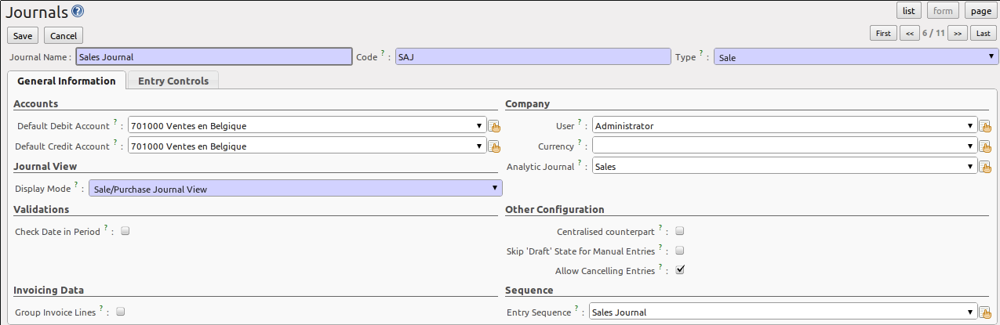

.. i18n: .. index::
.. i18n:    single: journal; configuring
..

.. index::
   single: journal; configuring

.. i18n: Journals
.. i18n: ========
..

账簿
========

.. i18n: All your accounting entries need to appear in an accounting journal. So you should create a Sales Journal for customer invoices, a Sales Refund journal for customer credit notes, a Purchase Journal for supplier invoices, a Purchase Refund journal for supplier credit notes and a Bank Journal for bank transactions.
..

所有的会计分录需要由会计帐簿来显示。因此您应该为销售发票创建销售分类帐， 为客户退货创建销售红字分类账, 为供应商发票创建采购分类帐， 为供应商欠条创建采购红字分类账以及为银行业务创建一个银行分类账。

.. i18n: Configuring a Journal
.. i18n: ---------------------
..

配置账簿
---------------------

.. i18n: To view, edit or create new journals use the menu :menuselection:`Accounting --> Configuration --> Financial Accounting --> Journals --> Journals`.
..

要查看，编辑或创建新分类帐，使用菜单 :menuselection:`Accounting --> Configuration --> Financial Accounting --> Journals --> Journals`.

.. i18n: .. figure::  images/account_journal_form.png
.. i18n:    :scale: 75
.. i18n:    :align: center
.. i18n: 
.. i18n:    *Defining an Accounting Journal*
..

   *定义会计分类帐*

.. i18n: Blue fields are mandatory fields. When you select a journal type, some configuration parameters will be preset. The journal type will tell the system where the journal concerned can be used.
..

蓝色字段均为必填字段。当您选择了分类帐类型，将被预置一些配置参数。 分类帐类型告诉系统有关分类帐可用于何处。

.. i18n: Each journal has a specific way of displaying data. The type of journal determines the journal view, which indicates the fields that need to be visible and are required to enter accounting data in that journal. The view determines both the order of the fields and the properties of each field. For example, the field :guilabel:`Statement` has to appear when entering data in the bank journal, but not in the other journals.
..

每一分类帐都有显示数据的特殊方式。 分类帐类型决定分类帐视图，也就是表明哪些字段需要显示出来和输入会计数据。视图确定字段的顺序和每个字段的属性。 比如, 字段  :guilabel:`Statement`  在银行分类帐录入数据时会出现，但不会出现在别的分类帐中。

.. i18n: You can also create your own journal views. However, before creating a new view for a journal, check whether there is nothing similar already defined. You should only create a new view for new types of journals.
..

您还可以创建自己的分类帐视图。 然而，在创建新的视图前，最好检查一下有没有已经定义的类似的视图。您应该仅为新分类帐类型创建新的视图。

.. i18n: You can create a sequence for each journal. This sequence determines the automatic numbering for accounting entries. Several journals can use the same sequence if you want to define one for them all, and if your legislation allows this.
..

您可为每一分类帐创建序号。 这个序号为会计分录自动设定号码。 如果您想将多个分类帐定义成使用同一个序号（如果您允许这么做），它们可以使用同一套序号。

.. i18n: .. tip:: Sequences
.. i18n: 
.. i18n:     Sequences can also be created from the :menuselection:`Settings --> Configuration --> Sequences & Identifiers --> Sequences`.
.. i18n:     By default, OpenERP has only one sequence in the journal definition. If you need two separate sequences to be kept for the journal, you can install the module :mod:`account_sequence`.
..

.. tip:: 序号编码

    序号可通过 :menuselection:`Settings --> Configuration --> Sequences & Identifiers --> Sequences` 创建。
    默认情况下， OpenERP 的分类帐定义中仅有一个序号。 如果您需要在分类帐中保存两个不同的序号，您可安装 :mod:`account_sequence` 模块。

.. i18n: The default credit and debit account allow the software to automatically generate counterpart entries when you are entering data through :guilabel:`Journal Items`. In some journals, debit and credit accounts are mandatory. For example, in a bank journal you should put an associated bank account, so that you do not have to create counterparts for each transaction manually.
..

当您通过 :guilabel:`Journal Items` 录入数据时，默认贷方或借方科目可自动生成对方分录。 在一些分类帐中，借方科目或贷方科目是强制性的，比如在银行日记账中您必须写入相关的银行科目，这样你就不必手动创建每个业务的对应科目。

.. i18n: A journal can be marked as being centralised. When you do this, the counterpart entries will not be owned by each entry, but will be global for the given journal and period. You will then have a credit line and a debit line centralized for each entry in one of these journals, meaning that both credit and debit appear on the same line. This option is used when posting opening entries in a situation journal.
..

A journal can be marked as being centralised. When you do this, the counterpart entries will not be owned by each entry, but will be global for the given journal and period. You will then have a credit line and a debit line centralized for each entry in one of these journals, meaning that both credit and debit appear on the same line. This option is used when posting opening entries in a situation journal.

.. i18n: .. note:: Bank Journal, Easy Configuration
.. i18n: 
.. i18n:     A bank journal can automatically be created from the bank account(s) you define for your company. Go to :menuselection:`Accounting --> Configuration --> Financial Accounting --> Accounts --> Setup your Bank Accounts`. Here you create the bank account or IBAN number of your company's bank account(s). Fill in the Bank Name, and when you save the entry, your Bank Journal will automatically be created with the Bank Name and the Account Number. The general ledger account for this bank will also be created for you.
..

.. note:: 银行日记帐，容易配置

    在您定义您公司的银行帐户事可自动创建银行日记帐。到 :menuselection:`Accounting --> Configuration --> Financial Accounting --> Accounts --> Setup your Bank Accounts`， 这里您可创建您公司银行帐户的银行帐号或IBAN号。 录入银行名称，那么当您保存时，您的银行日记帐会连同银行名称和科目代码一起自动创建，  这家银行的总帐帐户也会创建。

.. i18n: Controls and Tips for Data Entry
.. i18n: --------------------------------
..

数据录入的控制和提示
--------------------------------

.. i18n: You can carry out two types of control on journals in OpenERP – controls over the accounts and access controls for groups of users. In addition to these controls, you can also apply all of the standard user rights management.
..

在OpenERP中您有两种方式可以控制分类帐————科目控制和组用户权限控制。除了这些控制之外，您也可启用所有的标准用户权限管理。

.. i18n: To avoid entering account data in wrong accounts, you can put conditions on the general accounts about which journal can use a given account. To do this, you have to list all the accounts or valid account types in the second tab, :guilabel:`Entry Controls`. If you have not added any accounts there, OpenERP applies no restriction on the accounts for that journal. If you list accounts and/or the types of accounts that can be used in a journal, OpenERP prevents you from using any account or account type not in that list. This verification step starts from the moment you enter data. You can only select allowed accounts or account types.
..

为避免在错误的科目中录入会计数据，您可以在总帐科目中设置哪些分类帐可以使用给定的会计科目的条件。 要做到这一点，你必须在第二个页签  :guilabel:`Entry Controls` 中列出所有有效的科目或科目类型。 如果您没有在此添加任何科目， OpenERP 在分类帐中的会计科目是没有任何约束的。 如果您列出在分类帐中可以使用的科目以及/或科目类型， OpenERP 阻止您使用任何不在该列表中的科目或科目类型。 这一校验步骤从您录入数据时开始， 您仅可选择允许的科目或科目类型。

.. i18n: This functionality is useful for limiting possible data entry errors by restricting the accounts to be used in a journal.
..

这一功能通过分类帐中可以使用的科目可限制数据录入中发生错误的可能性。

.. i18n: .. tip:: Control of Data Entry
.. i18n: 
.. i18n:         In accounting it is not a good idea to allow a data entry directly from bank account A to bank
.. i18n:         account B.
.. i18n:         If you enter a transaction from bank A to bank B, the transaction will be accounted for twice.
.. i18n: 
.. i18n:         To prevent this problem, pass the transaction through intermediate account C.
.. i18n:         At the time of data entry, the system checks the type of account that is accepted in the bank
.. i18n:         journal: only accounts that are not of type ``Bank`` are accepted.
.. i18n: 
.. i18n:         If your accountant defines this control properly, non-accounting users are prevented from
.. i18n:         transferring payments from one bank to another, reducing your risks.
..

.. tip:: 数据录入控制

        在帐务处理过程中，允许直接从银行A到银行B的会计分录不是一个好主意。如果您录入了银行A直接到银行B的会计分录，则这个分录会被记账两次。  

        要避免这个问题，通过中间科目C，在数据录入时，系统检查银行分类帐中可接受的科目类型: 只有非 ``Bank`` 类型的科目才会被接受。

        如果您的财务人员定义了这种特性，则非会计人员不可从一个银行帐户划款到另一银行帐户，这可降低风险。
        

.. i18n: .. Copyright © Open Object Press. All rights reserved.
..

.. Copyright © Open Object Press. All rights reserved.

.. i18n: .. You may take electronic copy of this publication and distribute it if you don't
.. i18n: .. change the content. You can also print a copy to be read by yourself only.
..

.. You may take electronic copy of this publication and distribute it if you don't
.. change the content. You can also print a copy to be read by yourself only.

.. i18n: .. We have contracts with different publishers in different countries to sell and
.. i18n: .. distribute paper or electronic based versions of this book (translated or not)
.. i18n: .. in bookstores. This helps to distribute and promote the OpenERP product. It
.. i18n: .. also helps us to create incentives to pay contributors and authors using author
.. i18n: .. rights of these sales.
..

.. We have contracts with different publishers in different countries to sell and
.. distribute paper or electronic based versions of this book (translated or not)
.. in bookstores. This helps to distribute and promote the OpenERP product. It
.. also helps us to create incentives to pay contributors and authors using author
.. rights of these sales.

.. i18n: .. Due to this, grants to translate, modify or sell this book are strictly
.. i18n: .. forbidden, unless Tiny SPRL (representing Open Object Press) gives you a
.. i18n: .. written authorisation for this.
..

.. Due to this, grants to translate, modify or sell this book are strictly
.. forbidden, unless Tiny SPRL (representing Open Object Press) gives you a
.. written authorisation for this.

.. i18n: .. Many of the designations used by manufacturers and suppliers to distinguish their
.. i18n: .. products are claimed as trademarks. Where those designations appear in this book,
.. i18n: .. and Open Object Press was aware of a trademark claim, the designations have been
.. i18n: .. printed in initial capitals.
..

.. Many of the designations used by manufacturers and suppliers to distinguish their
.. products are claimed as trademarks. Where those designations appear in this book,
.. and Open Object Press was aware of a trademark claim, the designations have been
.. printed in initial capitals.

.. i18n: .. While every precaution has been taken in the preparation of this book, the publisher
.. i18n: .. and the authors assume no responsibility for errors or omissions, or for damages
.. i18n: .. resulting from the use of the information contained herein.
..

.. While every precaution has been taken in the preparation of this book, the publisher
.. and the authors assume no responsibility for errors or omissions, or for damages
.. resulting from the use of the information contained herein.

.. i18n: .. Published by Open Object Press, Grand Rosière, Belgium
..

.. Published by Open Object Press, Grand Rosière, Belgium
