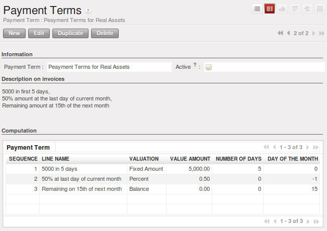

.. i18n: .. index:: payment terms
..

.. index:: payment terms

.. i18n: Payment Terms
.. i18n: =============
..

支付条款
=============

.. i18n: You can define whatever payment terms you need in OpenERP. Payment terms determine the due dates
.. i18n: for paying an invoice.
..

您可以在OpenERP中根据您的需要定义付款条款。 付款条款确定发票的到期支付日期。

.. i18n: To define new payment terms, use the menu :menuselection:`Accounting -->
.. i18n: Configuration --> Miscellaneous --> Payment Terms` and then click :guilabel:`New`.
..

要定义付款条款，使用菜单 :menuselection:`Accounting -->
Configuration --> Miscellaneous --> Payment Terms` and then click :guilabel:`New`.

.. i18n: The figure below represents the following payment term: 5000 within 5 days, 50% payment at the last day of current month,
.. i18n: Remaining on 15th of next month.
..

下图中付款条款后的数字代表天数: 5天内5000, 在本月内支付50%，剩下的在下月15日支付。

.. i18n: .. figure::  images/account_payment_term.png
.. i18n:    :scale: 75
.. i18n:    :align: center
.. i18n: 
.. i18n:    *Configuring payment terms*
..

   *配置付款条款*

.. i18n: To configure new conditions, start by giving a name to the :guilabel:`Payment Term` field. Text that
.. i18n: you put in the field :guilabel:`Description on invoices`, is used on invoices, so enter a clear description of
.. i18n: the payment terms there.
..

要配置新的条款，首先在 :guilabel:`Payment Term` 中给付款条款一个名称。 在 :guilabel:`Description on invoices` 中输入该付款条款的简单说明，该说明将被发票所使用。

.. i18n: Then create individual lines for calculating the terms in the section :guilabel:`Payment Term`. You
.. i18n: must give each line a name (:guilabel:`Line Name`). These give an informative title and do not affect
.. i18n: the actual calculation of terms. The :guilabel:`Sequence` field lets you define the order in which
.. i18n: the rules are evaluated.
..

在 :guilabel:`Payment Term` 部分新增单独的一行以创建新付款条款。您必须给每行提供一个名称 :guilabel:`Line Name` . 这些信息并不会对付款条款的实际计算产生影响。  :guilabel:`Sequence` 字段允许您定义计算规则的顺序。

.. i18n: The :guilabel:`Valuation` field enables you to calculate the amount to pay for each line:
..

每行中 :guilabel:`Valuation` 字段能让您计算付款金额:

.. i18n: * ``Percent`` : the line corresponds to a percentage of the total amount, the factor being
.. i18n:   given in :guilabel:`Value Amount`. The number indicated in :guilabel:`Value Amount` must take a value between 0 and 1.
.. i18n: 
.. i18n: * ``Fixed Amount`` : this is a fixed value given by the :guilabel:`Value Amount` box.
.. i18n: 
.. i18n: * ``Balance`` : indicates the balance remaining after accounting for the other lines.
..

* ``Percent`` : 本行表明th此次付款占总金额的百分比，百分比在 :guilabel:`Value Amount`字段中提供，
                :guilabel:`Value Amount` 中的取值必须在0到1之间.

* ``Fixed Amount`` : 这是一个给定在 :guilabel:`Value Amount` 中的固定金额.

* ``Balance`` : 表明本次付款金额是除去以前付款金额的余款.

.. i18n: Think carefully about setting the last line of the calculation to \ ``Balance`` \, to avoid rounding
.. i18n: errors. The highest sequence number is evaluated last.
..

Think carefully about setting the last line of the calculation to \ ``Balance`` \, to avoid rounding
errors. The highest sequence number is evaluated last.

.. i18n: The two last fields, :guilabel:`Number of Days` and :guilabel:`Day of the Month`, enable the calculation of
.. i18n: the delay in payment for each line. The delay :guilabel:`Day of the Month` can be set to \ ``-1`` \, \ ``0`` \
.. i18n: or any positive number. For example, if today is 20th December 2010, and if you want to set payment terms like this:
..

The two last fields, :guilabel:`Number of Days` and :guilabel:`Day of the Month`, enable the calculation of
the delay in payment for each line. The delay :guilabel:`Day of the Month` can be set to \ ``-1`` \, \ ``0`` \
or any positive number. For example, if today is 20th December 2010, and if you want to set payment terms like this:

.. i18n: * :guilabel:`5000 within 5 days`: set `Valuation` ``Fixed Amount``, `Number of Days` ``5`` and `Day of the Month` ``0``. That creates journal entry for date 25th December 2010.
.. i18n: * :guilabel:`50% payment at the last day of current month`: set `Valuation` ``Percent``, `Number of Days` ``0`` and  `Day of the Month` ``-1``. That creates journal entry for date 31st December 2010.
.. i18n: * :guilabel:`Remaining on 15th of next month`: set `Valuation` ``Balance``, `Number of Days` ``0`` and  `Day of the Month` ``15``. That creates journal entry for date 15th January 2011.
..

* :guilabel:`5000 within 5 days`: set `Valuation` ``Fixed Amount``, `Number of Days` ``5`` and `Day of the Month` ``0``. That creates journal entry for date 25th December 2010.
* :guilabel:`50% payment at the last day of current month`: set `Valuation` ``Percent``, `Number of Days` ``0`` and  `Day of the Month` ``-1``. That creates journal entry for date 31st December 2010.
* :guilabel:`Remaining on 15th of next month`: set `Valuation` ``Balance``, `Number of Days` ``0`` and  `Day of the Month` ``15``. That creates journal entry for date 15th January 2011.

.. i18n: You can then add payment terms to a Partner through the tab :guilabel:`Accounting` on the partner form.
..

You can then add payment terms to a Partner through the tab :guilabel:`Accounting` on the partner form.

.. i18n: .. Copyright © Open Object Press. All rights reserved.
..

.. Copyright © Open Object Press. All rights reserved.

.. i18n: .. You may take electronic copy of this publication and distribute it if you don't
.. i18n: .. change the content. You can also print a copy to be read by yourself only.
..

.. You may take electronic copy of this publication and distribute it if you don't
.. change the content. You can also print a copy to be read by yourself only.

.. i18n: .. We have contracts with different publishers in different countries to sell and
.. i18n: .. distribute paper or electronic based versions of this book (translated or not)
.. i18n: .. in bookstores. This helps to distribute and promote the OpenERP product. It
.. i18n: .. also helps us to create incentives to pay contributors and authors using author
.. i18n: .. rights of these sales.
..

.. We have contracts with different publishers in different countries to sell and
.. distribute paper or electronic based versions of this book (translated or not)
.. in bookstores. This helps to distribute and promote the OpenERP product. It
.. also helps us to create incentives to pay contributors and authors using author
.. rights of these sales.

.. i18n: .. Due to this, grants to translate, modify or sell this book are strictly
.. i18n: .. forbidden, unless Tiny SPRL (representing Open Object Press) gives you a
.. i18n: .. written authorisation for this.
..

.. Due to this, grants to translate, modify or sell this book are strictly
.. forbidden, unless Tiny SPRL (representing Open Object Press) gives you a
.. written authorisation for this.

.. i18n: .. Many of the designations used by manufacturers and suppliers to distinguish their
.. i18n: .. products are claimed as trademarks. Where those designations appear in this book,
.. i18n: .. and Open Object Press was aware of a trademark claim, the designations have been
.. i18n: .. printed in initial capitals.
..

.. Many of the designations used by manufacturers and suppliers to distinguish their
.. products are claimed as trademarks. Where those designations appear in this book,
.. and Open Object Press was aware of a trademark claim, the designations have been
.. printed in initial capitals.

.. i18n: .. While every precaution has been taken in the preparation of this book, the publisher
.. i18n: .. and the authors assume no responsibility for errors or omissions, or for damages
.. i18n: .. resulting from the use of the information contained herein.
..

.. While every precaution has been taken in the preparation of this book, the publisher
.. and the authors assume no responsibility for errors or omissions, or for damages
.. resulting from the use of the information contained herein.

.. i18n: .. Published by Open Object Press, Grand Rosière, Belgium
..

.. Published by Open Object Press, Grand Rosière, Belgium
