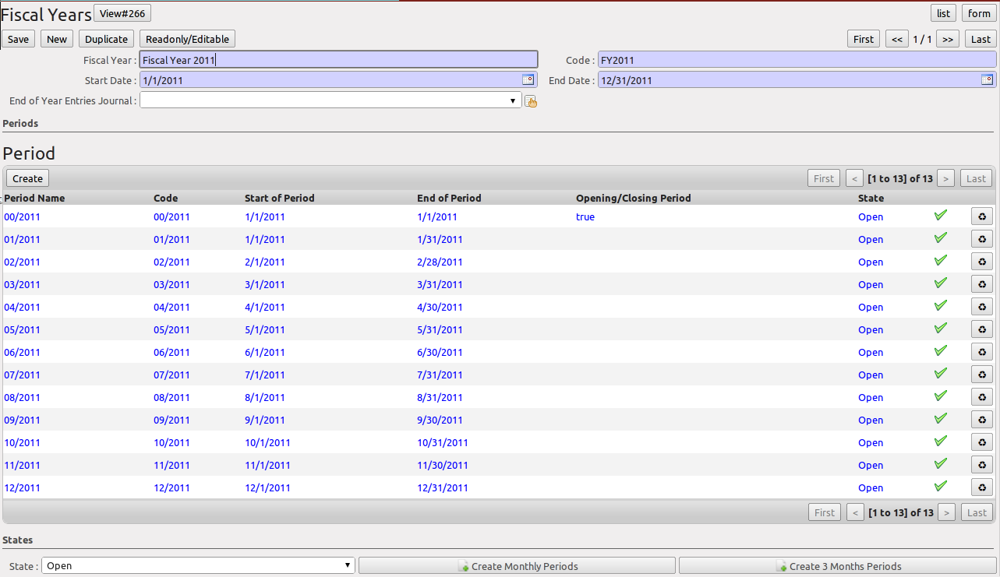

.. i18n: Periods and Financial Years
.. i18n: ===========================
..

会计期间和会计年度
===========================

.. i18n: .. note:: Periods and Fiscal Years
.. i18n: 
.. i18n:         A fiscal year (or financial year) corresponds to twelve months for a company.
.. i18n:         In many countries, the fiscal year corresponds to a calendar year. That may not be the case in other countries.
.. i18n: 
.. i18n:         The financial year can be divided into monthly or three-monthly accounting periods (when you have a quarterly declaration).
..

.. 注释:: 会计期间和会计年度

        会计年度 (或财务年度) 对公司而言相当于12个月。
        在许多国家，会计年度对应于一个日历年度。而另外一些国家不是这样。

        财政年度可分为每月或每3月的会计期间（当你需要一个季度报表时）。

.. i18n: OpenERP's management of the fiscal year is flexible enough to enable you to work on several years at the same time. This gives you several advantages, such as the possibility to create three-year budgets.
..

OpenERP的会计年度管理具有足够的灵活性，使您能够在一次创建几个会计年度。这给您一些优势，如可以建立为期三年的预算。

.. i18n: .. index:: period
.. i18n: .. index:: fiscal year
..

.. index:: period
.. index:: fiscal year

.. i18n: .. _financialyear:
.. i18n: 
.. i18n: Defining a Period or a Financial Year
.. i18n: -------------------------------------
..

.. _financialyear:

定义一个会计期间或者会计年度
-------------------------------------

.. i18n: To define your fiscal year, use the menu :menuselection:`Accounting --> Configuration --> Financial Accounting --> Periods --> Fiscal Year`. You can create several years in advance to define long-term budgets.
..

定义会计年度，使用菜单 :menuselection:`Accounting --> Configuration --> Financial Accounting --> Periods --> Fiscal Year` . 您可以提前创建多年的会计年度以便定义长期的预算。

.. i18n: .. figure::  images/account_period.png
.. i18n:    :scale: 75
.. i18n:    :align: center
.. i18n: 
.. i18n:    *Defining a Financial Year and Periods*
..

   *定义会计年度和会计期间*

.. i18n: First enter the date of the first day and the last day of your fiscal year. Then, to create the periods, click one of the two buttons at the bottom depending on whether you want to create twelve 1-month or four 3-months periods:
..

先输入会计年度的第一天和最后一天。然后，要创建会计期间, 单击两个底部的按钮中的一个，取决于您需要创建12个1个月还是4个3个月的会计期间:

.. i18n: *  :guilabel:`Create Monthly Periods` ,
.. i18n: 
.. i18n: *  :guilabel:`Create 3 Months Periods` .
..

*  :guilabel:`Create Monthly Periods`,

*  :guilabel:`Create 3 Months Periods` .

.. i18n: OpenERP automatically creates an opening period to allow you to post your outstanding balances from the previous fiscal year. Notice the ``Opening/Closing Period`` checkbox for such a period.
..

OpenERP的自动创建一个初始会计期间，让您录入您的上一财年的余额。请注意这个会计期间 ``Opening/Closing Period`` 复选框。

.. i18n: Closing a Period
.. i18n: ----------------
..

期末结账
----------------

.. i18n: To close a financial period, for example when a tax declaration has been made, go to the menu :menuselection:`Accounting--> Configuration --> Financial Accounting --> Periods --> Periods`. Click the green arrow to close the period for which you want no more entries to be posted.
..

要关闭会计期间,，比方税收申报已经做好，到菜单 :menuselection:`Accounting--> Configuration --> Financial Accounting --> Periods --> Periods`. 点击绿色的箭头就可关闭已没有业务需要处理的会计期间。

.. i18n: .. tip:: Opening Closed Periods
.. i18n: 
.. i18n:     The system administrator can re-open a period should a period have been closed by mistake.
..

.. 提示:: 打开关已关闭的会计期间

    The system administrator can re-open a period should a period have been closed by mistake.

.. i18n: When a period is closed, you can no longer create or modify any transactions in that period. Closing a period is not obligatory, and you could easily leave periods open.
..

When a period is closed, you can no longer create or modify any transactions in that period. Closing a period is not obligatory, and you could easily leave periods open.

.. i18n: To close an accounting period you can also use the menu :menuselection:`Accounting--> Periodical Processing --> End of Period --> Close a Period`.
..

To close an accounting period you can also use the menu :menuselection:`Accounting--> Periodical Processing --> End of Period --> Close a Period`.

.. i18n: .. Copyright © Open Object Press. All rights reserved.
..

.. Copyright © Open Object Press. All rights reserved.

.. i18n: .. You may take electronic copy of this publication and distribute it if you don't
.. i18n: .. change the content. You can also print a copy to be read by yourself only.
..

.. You may take electronic copy of this publication and distribute it if you don't
.. change the content. You can also print a copy to be read by yourself only.

.. i18n: .. We have contracts with different publishers in different countries to sell and
.. i18n: .. distribute paper or electronic based versions of this book (translated or not)
.. i18n: .. in bookstores. This helps to distribute and promote the OpenERP product. It
.. i18n: .. also helps us to create incentives to pay contributors and authors using author
.. i18n: .. rights of these sales.
..

.. We have contracts with different publishers in different countries to sell and
.. distribute paper or electronic based versions of this book (translated or not)
.. in bookstores. This helps to distribute and promote the OpenERP product. It
.. also helps us to create incentives to pay contributors and authors using author
.. rights of these sales.

.. i18n: .. Due to this, grants to translate, modify or sell this book are strictly
.. i18n: .. forbidden, unless Tiny SPRL (representing Open Object Press) gives you a
.. i18n: .. written authorisation for this.
..

.. Due to this, grants to translate, modify or sell this book are strictly
.. forbidden, unless Tiny SPRL (representing Open Object Press) gives you a
.. written authorisation for this.

.. i18n: .. Many of the designations used by manufacturers and suppliers to distinguish their
.. i18n: .. products are claimed as trademarks. Where those designations appear in this book,
.. i18n: .. and Open Object Press was aware of a trademark claim, the designations have been
.. i18n: .. printed in initial capitals.
..

.. Many of the designations used by manufacturers and suppliers to distinguish their
.. products are claimed as trademarks. Where those designations appear in this book,
.. and Open Object Press was aware of a trademark claim, the designations have been
.. printed in initial capitals.

.. i18n: .. While every precaution has been taken in the preparation of this book, the publisher
.. i18n: .. and the authors assume no responsibility for errors or omissions, or for damages
.. i18n: .. resulting from the use of the information contained herein.
..

.. While every precaution has been taken in the preparation of this book, the publisher
.. and the authors assume no responsibility for errors or omissions, or for damages
.. resulting from the use of the information contained herein.

.. i18n: .. Published by Open Object Press, Grand Rosière, Belgium
..

.. Published by Open Object Press, Grand Rosière, Belgium
