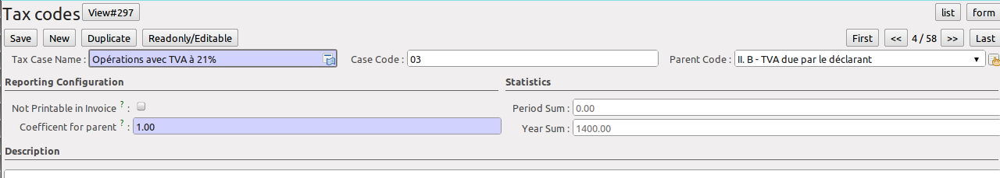

.. i18n: .. _tax:
.. i18n: 
.. i18n: Managing your Tax Structure
.. i18n: ===========================
..

.. _tax:

管理税务结构
===========================

.. i18n: This section deals with statutory taxes and accounts which are legally required from the company:
..

本章节处理法定税收和公司通用会计科目的有关问题:

.. i18n: * the taxation structure provided by Open ERP,
..

* OpenERP中提供的税制结构，

.. i18n: .. index:: tax
..

.. index:: tax

.. i18n: You can attach taxes to transactions so that you can:
..

您可以在交易中增加税款，那样您就能:

.. i18n: * add taxes to the amount you pay or receive,
.. i18n: 
.. i18n: * report on the taxes in various categories that you should pay the tax authorities,
.. i18n: 
.. i18n: * track taxes in your general accounts,
.. i18n: 
.. i18n: * manage the payment and refund of taxes using the same mechanisms OpenERP uses for other monetary transactions.
..

* 在付款或收款金额中包含税款,

* 生成您应向税务机关缴纳的各种税收报告,

* 在总帐中跟踪税收情况,

* 用OpenERP处理其他货币交易一样的机制来管理付款和退税.
.. i18n: Since the detailed tax structure is a mechanism for carrying out governments' policies, and the collection of taxes so critical to their authorities, tax requirements and reporting can be complex. OpenERP has a flexible mechanism for handling taxation that can be configured to meet the requirements of many tax jurisdictions.
..

由于税收机制的细节是执行政府政策、为国家积聚税款的一种机制，因此税收规定和税务报表可能很复杂。OpenERP有灵活的机制来满足不同地区的税务要求。

.. i18n: The taxation mechanism can also be used to handle other tax-like financial transactions, such as royalties to authors based on the value of transactions through an account.
..

税收机制也可以用于处理类似税收的交易，比如通过一个科目基于交易额的作者的版税。

.. i18n: From the menu :menuselection:`Accounting --> Configuration --> Financial Accounting --> Taxes` you can define your tax structure. Note that when you use a predefined (localised) chart of accounts, taxes will be configured as well in most cases.
..

通过菜单 :menuselection:`Accounting --> Configuration --> Financial Accounting --> Taxes` 您可以定义您的税收结构。 注意如果您使用预定义（本地化）科目表，多数情况下都已经定义好了税收。

.. i18n: OpenERP's tax system runs around three major concepts:
..

OpenERP的税收机制围绕三大概念运行:

.. i18n: * :guilabel:`Tax Code` (or :guilabel:`Tax Case`), used for tax reporting, can be set up in a hierarchical
.. i18n:   structure so that multiple codes can be formed into trees in the same way as a ``Chart of Accounts``. The Tax Codes structure is used to define your VAT return; it can be numeric and alphanumeric. You can define tax codes from the menu :menuselection: `Accounting --> Configuration --> Financial Accounting --> Taxes --> Tax Codes`.
.. i18n: 
.. i18n: * :guilabel:`Taxes`, the basic tax object that contains the rules for calculating tax on the transaction it is attached to, linked to the General Accounts and to the Tax Codes. A tax can contain multiple child taxes and base its calculation on those taxes rather than on the base transaction, providing considerable flexibility.
.. i18n: 
.. i18n: * the :guilabel:`General Accounts`, which record the taxes owing and paid. Since the general accounts are discussed elsewhere in this part of the book and are not tax-specific, they will not be detailed in this section.
..

* :guilabel:`Tax Code` (or :guilabel:`Tax Case`), 用于纳税申报， 可以设置成具有树状结构，这样多个税务代码可以像 ``Chart of Accounts``  （会计科目表）一样显示。 税务代码用来定义您的VAT统计表，可以为数字或字母，您可以通过菜单  :menuselection: `Accounting --> Configuration --> Financial Accounting --> Taxes --> Tax Codes`  定义税务代码。

* :guilabel:`Taxes`, 在业务中包含计税规则的基本税务概念，它和总帐科目和税务登记号有关。税种下面包含多个税目，不同的税目使用不同的计税规则，因而具有很好的灵活性。

*  :guilabel:`General Accounts`, 用于记录缴纳的税款。由于总帐科目并非是税收特有的，在本书中其他章节也有说明，所以本节不再详细阐述。

.. i18n: You can attach zero or more :guilabel:`Purchase Taxes` and :guilabel:`Sale Taxes` items to products, so that you can account separately for purchase and sales taxes (or Input and Output VAT – where VAT is Value Added Tax). Because you can attach more than one tax, you can handle a VAT or Sales Tax separately from an Eco Tax on the same product.
..

您可以为商品设置0至多个 :guilabel:`Purchase Taxes` 和 :guilabel:`Sale Taxes` ，这样您可以分别统计采购税和销售税（增值税进项税和销项税，增值税是商品流通环节价值增加而产生的税收）。由于可以设置多个税种，所以您可以对同一商品分别同时处理增值税和消费税。

.. i18n: To create a new :guilabel:`Tax Code`, use the menu :menuselection:`Accounting --> Configuration --> Financial Accounting --> Taxes --> Tax Codes`. You should define the following fields:
..

创建新 :guilabel:`Tax Code`，使用菜单 :menuselection:`Accounting --> Configuration --> Financial Accounting --> Taxes --> Tax Codes`。 您应当定义如下字段：

.. i18n: .. figure::  images/account_def_tax_code_form.png
.. i18n:    :scale: 75
.. i18n:    :align: center
.. i18n: 
.. i18n:    *Tax Code*
..

   *Tax Code*

.. i18n: *  :guilabel:`Tax Case Name`: a unique name required to identify the tax case, usually taken from your VAT return,
.. i18n: 
.. i18n: *  :guilabel:`Case Code`: an optional short code for the case,
.. i18n: 
.. i18n: *  :guilabel:`Parent Code`: a link to a parent Tax Code to create a tree structure which can be displayed from the menu :menuselection:`Accounting --> Charts --> Cgart of Taxes`,
.. i18n: 
.. i18n: *  :guilabel:`Not Printable in Invoice`: a checkbox allowing you to indicate that any taxes linked to the tax code concerned should not be printed on the invoice,
.. i18n: 
.. i18n: *  :guilabel:`Coefficient for parent`: choose ``1.00`` to add the total to the parent account or ``-1.00`` to subtract it,
.. i18n: 
.. i18n: *  :guilabel:`Description`: a free text field for documentation purposes.
..

*  :guilabel:`Tax Case Name`: 用于区分税目的唯一名称，通常来自于增值税申报表，

*  :guilabel:`Case Code`: 用于该税目的一个可选的短的代码,

*  :guilabel:`Parent Code`: 关联到上级税目的代码，用于树状结构，可通过菜单 :menuselection:`Accounting --> Charts --> Chart of Taxes` 显示

*  :guilabel:`Not Printable in Invoice`: a checkbox allowing you to indicate that any taxes linked to the tax code concerned should not be printed on the invoice,

*  :guilabel:`Coefficient for parent`: 选择 ``1.00`` 用于增加到上级科目或选择 ``-1.00`` 以从上级科目减少，

*  :guilabel:`Description`: 用于说明的一段文本。

.. i18n: You can also see two read-only fields:
..

您还会看到两个只读字段：

.. i18n: *  :guilabel:`Period Sum`: a single figure showing the total accumulated on this case for the current financial period.
.. i18n: 
.. i18n: *  :guilabel:`Year Sum`: a single figure showing the total accumulated on this case for the financial year.
..

*  :guilabel:`Period Sum`: 显示本会计期间本税目税款合计数。
*  :guilabel:`Year Sum`： 显示本会计年度本税目税款合计数。

.. i18n: You will probably need to create two tax codes for each different tax rate that you have to define, one for the tax itself and one for the invoice amount (the so-called base code) the tax is computed from. And you will create tax codes that you will not link to any tax objects (similar to General Account \ ``View``\   types) just to organise the tree (or hierarchical) structure.
..

You will probably need to create two tax codes for each different tax rate that you have to define, one for the tax itself and one for the invoice amount (the so-called base code) the tax is computed from. And you will create tax codes that you will not link to any tax objects (similar to General Account \ ``View``\   types) just to organise the tree (or hierarchical) structure.

.. i18n: To have a look at the structure you have constructed, you can use the menu :menuselection:`Accounting --> Charts --> Chart of Taxes`.
.. i18n: This tree view reflects the structure of the :guilabel:`Tax Codes` and shows the current tax situation for the selected period, or for the complete financial year.
..

To have a look at the structure you have constructed, you can use the menu :menuselection:`Accounting --> Charts --> Chart of Taxes`.
This tree view reflects the structure of the :guilabel:`Tax Codes` and shows the current tax situation for the selected period, or for the complete financial year.

.. i18n: The :guilabel:`Taxes` defined are used to compute taxes on the transactions they are attached to, and they are linked to the corresponding General Accounts (usually VAT accounts) and to Tax Codes, both for the base amount and the tax amount.
..

The :guilabel:`Taxes` defined are used to compute taxes on the transactions they are attached to, and they are linked to the corresponding General Accounts (usually VAT accounts) and to Tax Codes, both for the base amount and the tax amount.

.. i18n: To create a new Tax, use the menu :menuselection:`Accounting --> Configuration --> Financial Accounting --> Taxes --> Taxes`.
..

To create a new Tax, use the menu :menuselection:`Accounting --> Configuration --> Financial Accounting --> Taxes --> Taxes`.

.. i18n: .. figure::  images/account_define_tax_form.png
.. i18n:    :scale: 75
.. i18n:    :align: center
.. i18n: 
.. i18n:    *Defining Taxes*
..

.. figure::  images/account_define_tax_form.png
   :scale: 75
   :align: center

   *Defining Taxes*

.. i18n: You define the following fields:
..

您定义如下字段:

.. i18n: *  :guilabel:`Tax Name`: a unique name required for this tax (such as \ ``21% Purchase VAT``\  ),
.. i18n: 
.. i18n: *  :guilabel:`Tax Code`: an optional code for this tax (such as \ ``VAT IN IC``\  ),
.. i18n: 
.. i18n: *  :guilabel:`Tax Application`: defines whether the tax is applicable to ``Sale``, ``Purchase`` or ``All`` transactions,
.. i18n: 
.. i18n: *  :guilabel:`Tax Included in Price`: when checked, the price shown in the product or invoice is inclusive of this tax,
.. i18n: 
.. i18n: *  :guilabel:`Tax Type`: a required field indicating how tax should be calculated: ``Percentage``,
.. i18n:    ``Fixed Amount``, ``None``, ``Balance`` or ``Python Code``, (the latter is found in the :guilabel:`Compute Code`
.. i18n:    field in the :guilabel:`Special Computation` tab),
.. i18n: 
.. i18n: *  :guilabel:`Amount`: a required field whose meaning depends on the Tax Type, being a multiplier of the base amount when the :guilabel:`Tax
.. i18n:    Type` is \ ``Percentage``\ and a fixed amount added to the base amount when the :guilabel:`Tax Type` is \ ``Fixed Amount``\,
.. i18n: 
.. i18n: *  :guilabel:`Invoice Tax Account`: a General Account used to record invoiced tax amounts, which may be the same for several taxes or split according to percentage so that one tax is allocated to one account,
.. i18n: 
.. i18n: *  :guilabel:`Refund Tax Account`: a General Account used to record invoiced tax refunds, which may be the same as the Invoice Tax Account or, in some tax jurisdictions, has to be separated,
.. i18n: 
.. i18n: *  :guilabel:`Tax on Children`: when checked, the tax calculation is applied to the output from other tax calculations specified in the :guilabel:`Child Tax Accounts` field (so you can have taxes on taxes), otherwise the calculation is applied to the base amount of the transaction,
.. i18n: 
.. i18n: *  :guilabel:`Include in base amount`: when checked, the tax is added to the base amount and not shown separately, such as Eco taxes,
.. i18n: 
.. i18n: *  :guilabel:`Child Tax Accounts`: other taxes that can be used to supply the figure for taxation.
..

*  :guilabel:`Tax Name`: a unique name required for this tax (such as \ ``21% Purchase VAT``\  ),

*  :guilabel:`Tax Code`: an optional code for this tax (such as \ ``VAT IN IC``\  ),

*  :guilabel:`Tax Application`: defines whether the tax is applicable to ``Sale``, ``Purchase`` or ``All`` transactions,

*  :guilabel:`Tax Included in Price`: when checked, the price shown in the product or invoice is inclusive of this tax,

*  :guilabel:`Tax Type`: a required field indicating how tax should be calculated: ``Percentage``,
   ``Fixed Amount``, ``None``, ``Balance`` or ``Python Code``, (the latter is found in the :guilabel:`Compute Code`
   field in the :guilabel:`Special Computation` tab),

*  :guilabel:`Amount`: a required field whose meaning depends on the Tax Type, being a multiplier of the base amount when the :guilabel:`Tax
   Type` is \ ``Percentage``\ and a fixed amount added to the base amount when the :guilabel:`Tax Type` is \ ``Fixed Amount``\,

*  :guilabel:`Invoice Tax Account`: a General Account used to record invoiced tax amounts, which may be the same for several taxes or split according to percentage so that one tax is allocated to one account,

*  :guilabel:`Refund Tax Account`: a General Account used to record invoiced tax refunds, which may be the same as the Invoice Tax Account or, in some tax jurisdictions, has to be separated,

*  :guilabel:`Tax on Children`: when checked, the tax calculation is applied to the output from other tax calculations specified in the :guilabel:`Child Tax Accounts` field (so you can have taxes on taxes), otherwise the calculation is applied to the base amount of the transaction,

*  :guilabel:`Include in base amount`: when checked, the tax is added to the base amount and not shown separately, such as Eco taxes,

*  :guilabel:`Child Tax Accounts`: other taxes that can be used to supply the figure for taxation.

.. i18n: .. tip:: Using Child Taxes
.. i18n: 
.. i18n:     You can use child taxes when you have a complex tax situation requiring several tax codes to be used.
..

.. tip:: 使用子税

    当您有一个复杂的You can use child taxes when you have a complex tax situation requiring several tax codes to be used.

.. i18n: The fields above apply the taxes that you specify and record them in the general accounts, but do not provide you with the information that your tax authorities might need. Use the :guilabel:`Tax Definition` tab, parts Tax Declaration: Invoices and Credit Notes to define to which tax codes the tax should be assigned:
..

The fields above apply the taxes that you specify and record them in the general accounts, but do not provide you with the information that your tax authorities might need. Use the :guilabel:`Tax Definition` tab, parts Tax Declaration: Invoices and Credit Notes to define to which tax codes the tax should be assigned:

.. i18n: *  :guilabel:`Account Base Code`: tax code to record the invoiced amount (exclusive of taxes) the tax is calculated on,
.. i18n: 
.. i18n: *  :guilabel:`Account Tax Code`: tax code to record the calculated tax amount,
.. i18n: 
.. i18n: *  :guilabel:`Refund Base Code`: tax code to record the refund amount (exclusive of taxes) the tax is calculated on,
.. i18n: 
.. i18n: *  :guilabel:`Refund Tax Code`: tax code to record the refund tax amount.
..

*  :guilabel:`Account Base Code`: tax code to record the invoiced amount (exclusive of taxes) the tax is calculated on,

*  :guilabel:`Account Tax Code`: tax code to record the calculated tax amount,

*  :guilabel:`Refund Base Code`: tax code to record the refund amount (exclusive of taxes) the tax is calculated on,

*  :guilabel:`Refund Tax Code`: tax code to record the refund tax amount.

.. i18n: When you have created a tax structure consisting of taxe codes and taxes, you can use the taxes in your various business objects so that transactions can be associated with taxes and tax-like charges, such as Eco Taxes (Recupel and Bebat, for instance).
..

When you have created a tax structure consisting of taxe codes and taxes, you can use the taxes in your various business objects so that transactions can be associated with taxes and tax-like charges, such as Eco Taxes (Recupel and Bebat, for instance).

.. i18n: .. tip:: Retail Customers
.. i18n: 
.. i18n:     When you are retailing to end users rather than selling to a business,
.. i18n:     you may want to (or be required to) show tax-inclusive prices on your invoicing documents rather
.. i18n:     than a tax-exclusive price plus tax.
..

.. tip:: 零售客户

    当您零售给最终用户而非销售给公司时，您也许希望（或必须）在您的发票上显示含税价格而非不含税价格再加税。
    

.. i18n: You can assign multiple taxes to a Product. Assuming you have set up the appropriate taxes, you would use the menu :menuselection:`Sales --> Products --> Products` to open and edit a :guilabel:`Product` definition, then:
..

您可以为一种商品制定多个税，假定您已经创建了适当的税，您可以使用菜单 :menuselection:`Sales --> Products --> Products` 打开并编辑 :guilabel:`Product` 定义，然后:

.. i18n: * select one or more :guilabel:`Sale Taxes` for any products that you might sell, which may
.. i18n:   include a \ ``Sales Tax``\   or \ ``Output VAT``\  and a \ ``Sales Eco Tax``\  ,
.. i18n: 
.. i18n: * select one or more :guilabel:`Purchase Taxes` for any products that you might purchase, which may
.. i18n:   include a \ ``Purchase Tax``\   or \ ``Input VAT``\  and a \ ``Purchase Eco Tax``\  .
..

* 为您将销售的商品选择一个或多个 :guilabel:`Sale Taxes` ,它可能包含 \ ``Sales Tax``\   or \ ``Output VAT``\  and a \ ``Sales Eco Tax``\  ,

* 为您将采购的商品选择一个或多个 :guilabel:`Purchase Taxes` ，它可能包含 \ ``Purchase Tax``\   or \ ``Input VAT``\  and a \ ``Purchase Eco Tax``\  .

.. i18n: Generally, when you make a purchase or sales, the taxes assigned to the product are used to calculate the taxes owing or owed.
..

通常您采购或销售时，会自动计算该分配给该商品的税种的应缴税额或抵扣金额（如进项税）。

.. i18n: You can also assign multiple taxes to an account, so that when you transfer money through the account you attract a tax amount. This principle can easily be used when posting purchase invoices for which no products are required.
..

您也可以指派多个税种到一个会计科目，这样这个会计科目发生业务时您可以自动计算指派的税收金额。 This principle can easily be used when posting purchase invoices for which no products are required.

.. i18n: .. index:: fiscal position
..

.. index:: fiscal position

.. i18n: Taxes on Products and Accounts will usually be national taxes. OpenERP is capable of automatically converting national taxes to intracommunal or export taxes through the concept of ``Fiscal Positions``.
..

与产品和科目关联的税收通常是国内税。 OpenERP is capable of automatically converting national taxes to intracommunal or export taxes through the concept of ``Fiscal Positions``.

.. i18n: Go to the menu :menuselection:`Accounting --> Configuration -_> Financial Accounting --> Taxes --> Fiscal Positions`. You can use the fiscal positions to automatically convert national taxes to the required intracommunal or export taxes, according to the fiscal position specified for the customer or supplier.
..

Go to the menu :menuselection:`Accounting --> Configuration -_> Financial Accounting --> Taxes --> Fiscal Positions`. You can use the fiscal positions to automatically convert national taxes to the required intracommunal or export taxes, according to the fiscal position specified for the customer or supplier.

.. i18n: Fiscal positions allow you to make a mapping from national taxes to intracommunal or export taxes, or to map your accounts according to these criteria. You can link fiscal positions to your customers and suppliers to ensure automatic and easy VAT conversion when posting entries.
..

Fiscal positions allow you to make a mapping from national taxes to intracommunal or export taxes, or to map your accounts according to these criteria. You can link fiscal positions to your customers and suppliers to ensure automatic and easy VAT conversion when posting entries.
