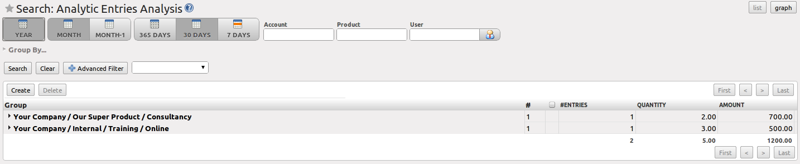
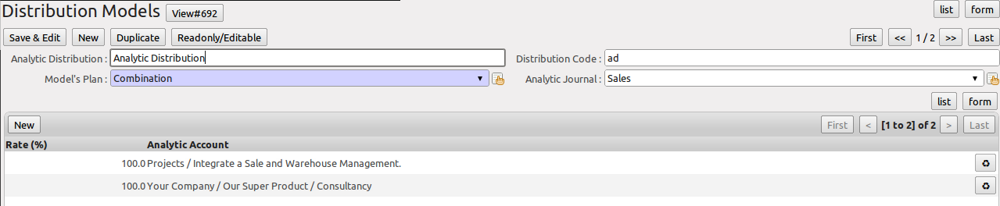

.. i18n: .. index::
.. i18n:    single: analytic; records
.. i18n: ..
..

.. index::
   single: analytic; records
..

.. i18n: Analytic Entries
.. i18n: ================
..

辅助核算凭证
================

.. i18n: Integrated with General Accounting
.. i18n: ----------------------------------
..

跟总账集成
----------------------------------

.. i18n: Just as in general accounting, analytic entries should be related to an account and an analytic journal.
..

正如在总账，辅助核算分录必须属于一个会计帐户和一个辅助核算账簿。

.. i18n: Analytic records can be distinguished from general records by the following characteristics:
..

通过以下几个特点辅助核算记录可以区别于普通会计记录：

.. i18n: * they are not necessarily legal accounting documents,
.. i18n: 
.. i18n: * they do not necessarily belong to an existing accounting period,
.. i18n: 
.. i18n: * they are managed according to their date and not an accounting period,
.. i18n: 
.. i18n: * they do not generate both a debit and a credit entry, but a positive amount (income) or a negative amount (cost).
..

* 它们不一定是必要的会计凭证,

* 它们不一定属于现有会计期间,

* 它们根据它们自己的日期管理，而不是一个会计期间管理,

* 它们不产生借方和贷方分录，而是一个正数金额（收入）或负数金额（成本）.

.. i18n: .. _fig-accanmv:
.. i18n: 
.. i18n: .. figure::  images/account_analytic_move.png
.. i18n:    :scale: 85
.. i18n:    :align: center
.. i18n: 
.. i18n:    *Analytic Account Records for a Customer Project*
..

.. _fig-accanmv:

.. figure::  images/account_analytic_move.png
   :scale: 85
   :align: center

   *为客户项目的分析账户记录*

.. i18n: The figure :ref:`fig-accanmv` represents the entries in an analytic account for a customer project.
..

图ref:`fig-accanmv`的辅助核算会计记录了客户项目并为客户项目展示辅助核算会计中的分录条目。

.. i18n: You can see there:
..

你可以看到有:

.. i18n: * the service costs for staff working on the project,
.. i18n: 
.. i18n: * the costs for reimbursing the expenses of a return journey to the customer,
.. i18n: 
.. i18n: * purchases of goods that have been delivered to the customer,
.. i18n: 
.. i18n: * sales for recharging these costs.
..

* 该项目工作人员的服务费用成本,

* 报销去见客户往返程的费用成本,

* 客户的购买的已交付货物,

* 销售收回这些成本.

.. i18n: Manual Entries
.. i18n: --------------
..

手工录入凭证
--------------

.. i18n: Even though most analytic entries are produced automatically by the other OpenERP documents, it is sometimes necessary to record manual entries. It is usually needed for certain analytic operations which have no counterpart in the general accounts.
..

尽管大多数辅助核算分录目由其他Open ERP文件自动生成，有时使用手动记录分录还是必要的。它通常需要一定的分析操作，而它在总账里没有对应的操作。

.. i18n: To record manual entries, go to the menu :menuselection:`Accounting --> Journal Entries --> Analytic Journal Items` and click the :guilabel:`Create` button.
..

使用手动记录分录，请使用菜单“会计→账簿的分录→辅助核算明细”，然后点击“新建”按钮。

.. i18n: .. index::
.. i18n:    single: analytic; entries
..

.. index::
   single: analytic; entries

.. i18n: .. note:: Analytic Entries
.. i18n: 
.. i18n:         To make an analytic entry, OpenERP asks you to specify a general account. This is given only for information in the different cross-reports. It will not create any new entries in the general accounts.
..

.. note:: 辅助核算记录

        建立一条辅助核算记录，Open ERP要求你指定一个总账账户。这只是给不同的交叉报告一个信息。它不会在总账中产生任何新记录。

.. i18n: Select a journal and complete the different fields. Write an expense as a negative amount and income as a positive amount.
..

选择一个辅助核算并完成不同的栏目。把支出费用记为负数，收入记为正数。

.. i18n: .. index::
.. i18n:    pair: cost; allocation
..

.. index::
   pair: cost; allocation

.. i18n: .. tip::  Entering a Date
.. i18n: 
.. i18n:         To enter a date in the editable list you can use the calendar widget in the web client or, in the
.. i18n:         GTK client, if you enter just the day of the month OpenERP automatically completes the month and
.. i18n:         year when you press the :kbd:`Tab` key.
..

.. tip::  输入日期

        在编辑列表中选择输入一个日期，你可以在web客户端或者在GTK客户端中使用日历小工具，，如果你只输入一个月中的某一天，当您按下Tab键时Open ERP系统会自动填充年份和月份。

.. i18n: .. note:: Example Cost Redistribution
.. i18n: 
.. i18n:         One of the uses of manual data entry for analytic operations is reallocation of costs. For
.. i18n:         example, if a development has been done for a given project, but can be used again for another
.. i18n:         project, you can reallocate part of the cost to the other project.
.. i18n: 
.. i18n:         In this case, make a positive entry on the first account and a negative entry for the same
.. i18n:         amount on the account of the second project.
..

.. note:: 成本的分摊示例

        辅助核算操作中的手工录入数据分录的用途之一是成本分摊。例如，一个已交付的项目的研发，可再次使用在另一个项目上，你可以分摊部分成本到这个项目上。

        在这种情况下，在第一个帐户上做一个正数的分录，第二个项目的帐户上做一个相同数额的负数分录。

.. i18n: Automated Entries
.. i18n: -----------------
..

自动生成凭证
-----------------

.. i18n: Analytic accounting is totally integrated with the other OpenERP modules, so you never have to re-enter the records. They are automatically generated by the following operations:
..

辅助核算会计与其他Open ERP模块完全集成，所以你永远不必重新输入记录。他们会自动生成以下操作：

.. i18n: * confirmation of an invoice generates analytic entries for sales or purchases connected to the
.. i18n:   account shown in the invoice line,
.. i18n: 
.. i18n: * the entry of a service generates an analytic entry for the cost of this service to the given project,
.. i18n: 
.. i18n: * the manufacturing of a product generates an entry for the manufacturing cost of each operation in the product range.
..

* 确认发票销售或采购生成辅助核算分录关联到帐户显示在发票行,

* 关于服务的分录为这项特定项目的服务成本生成一个辅助核算分录,

* 生产产品生成一个关于该产品范围内的每一项操作的生产成本分录。
.. i18n: Other documents linked to one of these three operations produce analytic records indirectly. For example, when you are entering a customer sales order, you can link it to the customer's analytic account. When you are managing by case or project, mark the project with that order. This order will then generate a customer invoice, which will be linked to the analytic account. When the invoice is validated, it will automatically create general and analytic accounting records for the corresponding project.
..

其他文件关联到这三个操作中的任何一个产生间接的辅助核算记录。例如，当你进入客户的销售订单，你可以把它链接到客户的辅助核算项。当您管理案子或项目时，把项目同订单做上标记。这个订单将生成客户发票，这将关联到辅助核算项。当发票得到确认时，它会自动为相应的项目创建辅助核算会计记录。

.. i18n: Expense receipts from an employee can be linked to an analytic account for reimbursement. When a receipt is approved by the company, a purchase invoice is created. This invoice represents a debit on the company in favour of the employee. Each line of the purchase invoice is then linked to an analytic account which automatically allocates the costs for that receipt to the corresponding project.
..

来自雇员的费用收据可以关联到辅助核算项报销。当收据得到公司批准时，购买发票将会被创建。这发票作为员工福利登在公司的借方。每一行购买发票自动链接到一个辅助核算项，分摊成本到相应的项目。

.. i18n: To visualise the general entries following these different actions, you can use one of the following menus:
..

可视化以下各种动作的普通分录，您可以通过使用以下菜单之一来实现：

.. i18n:         #. To see all of the entries, :menuselection:`Accounting --> Journal Entries --> Analytic Journal Items`
.. i18n: 
.. i18n:         #. To see the entries per account, per user, per product or per partner, you can use the menu :menuselection:`Accounting --> Reporting --> Statistic Reports --> Analytic Entries Analysis`.
..

        #. 查看的所有分录, :menuselection:`会计 --> 账簿的分录 --> 辅助核算明细`

        #. 2.   查看每个帐户的分录，每个用户，每个产品或每个业务伙伴，你可以使用菜单 :menuselection:`会计 --> 报告 --> 统计报表 --> 辅助核算分析`.

.. i18n: .. figure::  images/account_analytic_analysis2.png
.. i18n:    :scale: 85
.. i18n:    :align: center
.. i18n: 
.. i18n:    *Analytic Entries Analysis*
..

   *Analytic Entries Analysis*

.. i18n: Analytic Models
.. i18n: ---------------
..

辅助核算模型
---------------

.. i18n: Standard OpenERP allows you to post analytic entries to one chart at a time. Using the `Analytic Model` concept (install the option ``Multiple Analytic Plans`` from the `Add New Features` wizard), you can distribute your income or expenses to one or several analytic charts of account at the same time.
.. i18n: You can define the combination of analytic plans through the menu :menuselection:`Accounting --> Configuration --> Analytic Accounting --> Multi Plans --> Analytic Plan.`
..

Standard OpenERP allows you to post analytic entries to one chart at a time. Using the `Analytic Model` concept (install the option ``Multiple Analytic Plans`` from the `Add New Features` wizard), you can distribute your income or expenses to one or several analytic charts of account at the same time.
You can define the combination of analytic plans through the menu :menuselection:`Accounting --> Configuration --> Analytic Accounting --> Multi Plans --> Analytic Plan.`

.. i18n: .. figure::  images/account_analytic_plan_61.png
.. i18n:    :scale: 85
.. i18n:    :align: center
.. i18n: 
.. i18n:    *Definition of Analytic Plan*
..

.. figure::  images/account_analytic_plan_61.png
   :scale: 85
   :align: center

   *Definition of Analytic Plan*

.. i18n: Using the link `Distribution Models` at the right side of the `Analytic Plan` form, you can define the distribution of either your expenses while creating a supplier invoice, or revenue when defining customer invoices.
.. i18n: Thanks to these models, you can have one amount distributed amongst several analytic accounts. Models can be reused, and they can be applied to one analytic chart of accounts, but also to a combination of various charts of account, such as projects and cost centers.
..

Using the link `Distribution Models` at the right side of the `Analytic Plan` form, you can define the distribution of either your expenses while creating a supplier invoice, or revenue when defining customer invoices.
Thanks to these models, you can have one amount distributed amongst several analytic accounts. Models can be reused, and they can be applied to one analytic chart of accounts, but also to a combination of various charts of account, such as projects and cost centers.

.. i18n: .. figure::  images/account_distribution_model_61.png
.. i18n:    :scale: 85
.. i18n:    :align: center
.. i18n: 
.. i18n:    *Definition of Distribution Models*
..

   *Definition of Distribution Models*

.. i18n: For example, when you create the invoice (suppose 1000 EUR) for the product ``Client Project`` with the analytic distribution defined above.
..

For example, when you create the invoice (suppose 1000 EUR) for the product ``Client Project`` with the analytic distribution defined above.

.. i18n: When the invoice has been validated, you can find the Analytic Journal Entries with the amount distributed amongst the analytic accounts through the menu :menuselection:`Accounting --> Journal Entries --> Analytic Journal Items.`
..

When the invoice has been validated, you can find the Analytic Journal Entries with the amount distributed amongst the analytic accounts through the menu :menuselection:`Accounting --> Journal Entries --> Analytic Journal Items.`

.. i18n: .. figure::  images/analytic_journal_entry_analytic_distribution_61.png
.. i18n:    :scale: 85
.. i18n:    :align: center
.. i18n: 
.. i18n:    *Journal Entries with Distributed Amount*
..

.. figure::  images/analytic_journal_entry_analytic_distribution_61.png
   :scale: 85
   :align: center

   *Journal Entries with Distributed Amount*

.. i18n: You can also specify a default `Analytic Distribution` for a particular product, partner, user and company for a specific time interval using the menu :menuselection:`Accounting --> Configuration --> Analytic Accounting --> Analytic Defaults.`
..

You can also specify a default `Analytic Distribution` for a particular product, partner, user and company for a specific time interval using the menu :menuselection:`Accounting --> Configuration --> Analytic Accounting --> Analytic Defaults.`

.. i18n: .. Copyright © Open Object Press. All rights reserved.
..

.. Copyright © Open Object Press. All rights reserved.

.. i18n: .. You may take electronic copy of this publication and distribute it if you don't
.. i18n: .. change the content. You can also print a copy to be read by yourself only.
..

.. You may take electronic copy of this publication and distribute it if you don't
.. change the content. You can also print a copy to be read by yourself only.

.. i18n: .. We have contracts with different publishers in different countries to sell and
.. i18n: .. distribute paper or electronic based versions of this book (translated or not)
.. i18n: .. in bookstores. This helps to distribute and promote the OpenERP product. It
.. i18n: .. also helps us to create incentives to pay contributors and authors using author
.. i18n: .. rights of these sales.
..

.. We have contracts with different publishers in different countries to sell and
.. distribute paper or electronic based versions of this book (translated or not)
.. in bookstores. This helps to distribute and promote the OpenERP product. It
.. also helps us to create incentives to pay contributors and authors using author
.. rights of these sales.

.. i18n: .. Due to this, grants to translate, modify or sell this book are strictly
.. i18n: .. forbidden, unless Tiny SPRL (representing Open Object Press) gives you a
.. i18n: .. written authorisation for this.
..

.. Due to this, grants to translate, modify or sell this book are strictly
.. forbidden, unless Tiny SPRL (representing Open Object Press) gives you a
.. written authorisation for this.

.. i18n: .. Many of the designations used by manufacturers and suppliers to distinguish their
.. i18n: .. products are claimed as trademarks. Where those designations appear in this book,
.. i18n: .. and Open Object Press was aware of a trademark claim, the designations have been
.. i18n: .. printed in initial capitals.
..

.. Many of the designations used by manufacturers and suppliers to distinguish their
.. products are claimed as trademarks. Where those designations appear in this book,
.. and Open Object Press was aware of a trademark claim, the designations have been
.. printed in initial capitals.

.. i18n: .. While every precaution has been taken in the preparation of this book, the publisher
.. i18n: .. and the authors assume no responsibility for errors or omissions, or for damages
.. i18n: .. resulting from the use of the information contained herein.
..

.. While every precaution has been taken in the preparation of this book, the publisher
.. and the authors assume no responsibility for errors or omissions, or for damages
.. resulting from the use of the information contained herein.

.. i18n: .. Published by Open Object Press, Grand Rosière, Belgium
..

.. Published by Open Object Press, Grand Rosière, Belgium
