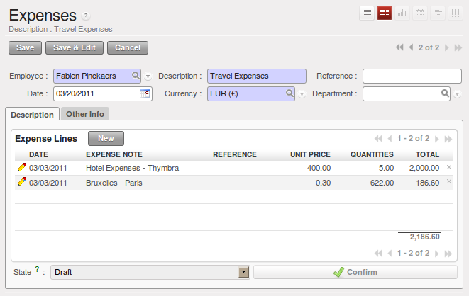

.. i18n: .. index::
.. i18n:    single: expense
.. i18n: ..
..

.. index::
   single: expense
..

.. i18n: Keeping Track of Expenses
.. i18n: =========================
..

管理各种费用开支
=========================

.. i18n: Employee expenses are charges incurred on behalf of the company. The company then reimburses these
.. i18n: expenses to the employee. The receipts encountered most frequently are:
..

员工费用是员工为公司垫付的。公司应将这些费用报销给员工。最常见的收据有以下几种:

.. i18n: * car travel, reimbursed per unit of distance (mile or kilometer),
.. i18n: 
.. i18n: * subsistence expenses, reimbursed based on the bill,
.. i18n: 
.. i18n: * other purchases, such as stationery and books, destined for the company but carried out by the
.. i18n:   employee.
..

* 汽车费用，每（英里或公里）费用报销,

* 生活费用，根据账单报销,

* 其他商品，例如员工使用的文具和书籍.

.. i18n: .. figure::  images/service_expense_workflow.png
.. i18n:    :scale: 75
.. i18n:    :align: center
.. i18n: 
.. i18n:    *Process for Dealing with Expense Reimbursements*
..

.. figure::  images/service_expense_workflow.png
   :scale: 75
   :align: center

   *处理费用报销的过程*

.. i18n: Expenses generated by employees are grouped into periods of a week or a month. At the end of the
.. i18n: period, the employee confirms all of his expenses and a summary sheet is sent to the department
.. i18n: manager. The manager is responsible for approving all the expense requests generated by his team.
.. i18n: The expense sheet must be signed by the employee, who also attaches its receipts to the expense sheet.
..

员工费用可以一个星期一报也可以一个月一报。在一个星期或者一个月结束时，员工可以将复核好的所有费用及费用清单发
给部门经理。经理负责批准本部门所有的费用报销申请。费用清单上必须有员工的签字，同时也必须将收据附在费用清单上。

.. i18n: Once the sheet has been approved by the head of department, it is sent to the Accounting department, which registers the
.. i18n: company's liability to the employee. Accounting can then pay this invoice and reimburse the employee
.. i18n: who originally advanced the money.
..

一旦部门经理批准费用清单后，费用清单将被送到财务部门（记录了公司对员工的负债）。财务可以用支票支付报销费用
也可以以员工最初提供的支付方式支付报销费用。

.. i18n: Some receipts are for project expenses, so these can then be attached to an analytic account. The
.. i18n: costs incurred are then added to the supplementary cost of the analytic account when the invoice is
.. i18n: approved.
..

一些收据是项目费用，因此需要一个分析账户。当这些收据被批准后，这些费用被添加到分析账户的成本中。

.. i18n: You often need to invoice expenses to a customer, depending on the precise contract that has been
.. i18n: negotiated. Travelling and subsistence expenses are generally handled this way. These can be
.. i18n: charged to the customer at the end of the month if the contract price has been negotiated inclusive of
.. i18n: expenses.
..

经常会有一些在客户中产生的费用，具体的费用要根据合同情况而定。差旅费和生活费就是这样产生的。如果合同价包括
这些费用，那么可以在月底的时候向客户索取。

.. i18n: If you have to go through many steps to reclaim expenses, it can all quickly become too cumbersome,
.. i18n: especially for those employees who claim large numbers of different expense lines. If you have got a
.. i18n: good system that integrates the management of these claims, such as the one described, you can avoid
.. i18n: many problems and increase staff productivity.
..

如果你要通过很多步骤收回费用，那么会很繁琐，特别是员工那些大量的不同的费用。如果你有一个好的管理系统，那么
你可以避免很多麻烦并且提高员工的工作效率。

.. i18n: If your systems handle expenses well, then you can avoid significant losses by setting your terms of
.. i18n: sales effectively. In fixed-price contracts, expense reimbursements are usually invoiced according to
.. i18n: the actual expense. It is in your interest to systematize their treatment, and automate the process
.. i18n: to the maximum, to recharge as much as you are contractually able.
..

如果用系统处理费用，那么你可以通过有效的设置销售条款从而避免重大损失。在固定价格的合同中，费用报销通常是根
据实际发生的费用报销。这将有利于系统化处理，自动程序最大化。

.. i18n: .. index::
.. i18n:    single: expense; entered by employee
..

.. index::
   single: expense; entered by employee

.. i18n: Allow employees to enter professional expenses
.. i18n: ----------------------------------------------
..

允许员工输入费用
----------------------------------------------

.. i18n: .. index::
.. i18n:    single: module; hr_expense
..

.. index::
   single: module; hr_expense

.. i18n: Install the module :mod:`hr_expense` to automate the management of expense claims.
.. i18n: The configuration wizard to install this module is shown below.
..

安装人力资源-费用模块 :mod:`hr_expense` 自动管理费用处理。安装该模块的配置向导如下所示。

.. i18n: .. figure::  images/config_wiz_expenses.png
.. i18n:    :scale: 75
.. i18n:    :align: center
.. i18n: 
.. i18n:    *Configuration wizard to install hr_expense module*
..

.. figure::  images/config_wiz_expenses.png
   :scale: 75
   :align: center

   *Configuration wizard to install hr_expense module*

.. i18n: Users can then enter and review their expenses using the menu :menuselection:`Human Resources --> Expenses --> Expenses`.
..

用户可以通过 :menuselection:`人力资源 --> 费用 --> 费用` :menuselection:`Human Resources --> Expenses --> Expenses` 输入和查看他们的费用。

.. i18n: .. figure::  images/employee_expenses.png
.. i18n:    :scale: 75
.. i18n:    :align: center
.. i18n: 
.. i18n:    *Expenses form to enter and review expenses*
..

   *Expenses form to enter and review expenses*

.. i18n: Create templates for the various expenses accepted by the company using OpenERP's
.. i18n: product form. You could, for instance, create a product with the following parameters for the
.. i18n: reimbursement of travel expenses by car at 0.25 per kilometer:
..

公司认可通过OpenERP产品类型创建的各种费用的模板。例如，你可以创建一个 `每公里0.25元的汽车费用` 报销产品:

.. i18n: *  :guilabel:`Name` : \ ``Car travel``\  ,
.. i18n: 
.. i18n: *  :guilabel:`Default Unit Of Measure` : \ ``km``\  ,
.. i18n: 
.. i18n: *  :guilabel:`Cost Price` : \ ``0.25``\  ,
.. i18n: 
.. i18n: *  :guilabel:`Sale Price` : \ ``0.30``\  ,
.. i18n: 
.. i18n: *  :guilabel:`Product Type` : \ ``Service``\  .
..

*  :guilabel:`名称` : \ ``汽车费用``\  ,

*  :guilabel:`默认计量单位` : \ ``公里``\  ,

*  :guilabel:`成本价` : \ ``0.25``\  ,

*  :guilabel:`销售价` : \ ``0.30``\  ,

*  :guilabel:`产品类型` : \ ``服务``\  .

.. i18n: The employee keeps his expenses sheet in the \ ``Draft``\   state while completing it throughout the
.. i18n: period. At the end of the period (week or month), the employee can confirm his expense form using the
.. i18n: :guilabel:`Confirm` button on the form. This puts it into the state \ ``Waiting Approval``\  .
..

员工在规定的每个周期之前应该保持它的费用清单处于 \ ``草稿``\ 状态。到达规定时期（星期或者月）时，员工通过点击 :guilabel:`确认` 按钮
来确认他的报销清单。确认后报销清单处于 \ ``等待批准``\ 状态。

.. i18n: .. index::
.. i18n:    single: expense; approval
..

.. index::
   single: expense; approval

.. i18n: Track the approval management process
.. i18n: -------------------------------------
..

完善审批审核流程
-------------------------------------

.. i18n: At the end of the period, the department manager can access the list of expense forms awaiting
.. i18n: approval using the menu :menuselection:`Human Resources --> Expenses --> Expenses`.
..

在一段时期后，部门经理通过 :menuselection:`人力资源 --> 费用 --> 费用` :menuselection:`Human Resources --> Expenses --> Expenses` 访问等待批准的费用清单。

.. i18n: The department manager can then approve the expenses. Now, the :guilabel:`Invoice` button is visible which on clicking creates a supplier invoice
.. i18n: in the employee's name so that the employee can be reimbursed. An analytic account is coded onto
.. i18n: each line of the invoice. When the invoice is confirmed, general and analytic accounting entries are
.. i18n: automatically generated as they would be with any other invoice.
..

费用报销由部门经理批准。点击 :guilabel:`发票按钮` 创建供应商发票以便于员工报销。分析账户编码到每一行发票中。当发票确认后，一般的分析会计条目将自动生成。

.. i18n: .. index::
.. i18n:    single: expense; rebill customers
..

.. index::
   single: expense; rebill customers

.. i18n: Rebill customers through analytical accounts
.. i18n: --------------------------------------------
..

通过辅助核算在付给客户
--------------------------------------------

.. i18n: If you base your invoicing on service time or analytic costs, the expense will
.. i18n: automatically be charged to the customer when the customer invoice is generated for services
.. i18n: associated with the project.
..

如果你基于服务时间或者分析成本开票，当客户发票根据相关服务项目生成时，费用将自动计入客户。

.. i18n: Invoicing from timesheets allows you to prepare all your invoices, both
.. i18n: expenses and timesheets for a project's customer.
..

根据时间表开票你可以准备好所有的发票，包括费用以及项目客户的时间表。

.. i18n: You can view the statistical analysis of expenses using menu :menuselection:`Human Resources --> Reporting --> Expenses Analysis`.
..

你可以通过 :menuselection:`人力资源 --> 报告 --> 费用分析` :menuselection:`Human Resources --> Reporting --> Expenses Analysis` 查看到费用统计分析。

.. i18n: .. Copyright © Open Object Press. All rights reserved.
..

.. Copyright © Open Object Press. All rights reserved.

.. i18n: .. You may take electronic copy of this publication and distribute it if you don't
.. i18n: .. change the content. You can also print a copy to be read by yourself only.
..

.. You may take electronic copy of this publication and distribute it if you don't
.. change the content. You can also print a copy to be read by yourself only.

.. i18n: .. We have contracts with different publishers in different countries to sell and
.. i18n: .. distribute paper or electronic based versions of this book (translated or not)
.. i18n: .. in bookstores. This helps to distribute and promote the OpenERP product. It
.. i18n: .. also helps us to create incentives to pay contributors and authors using author
.. i18n: .. rights of these sales.
..

.. We have contracts with different publishers in different countries to sell and
.. distribute paper or electronic based versions of this book (translated or not)
.. in bookstores. This helps to distribute and promote the OpenERP product. It
.. also helps us to create incentives to pay contributors and authors using author
.. rights of these sales.

.. i18n: .. Due to this, grants to translate, modify or sell this book are strictly
.. i18n: .. forbidden, unless Tiny SPRL (representing Open Object Press) gives you a
.. i18n: .. written authorisation for this.
..

.. Due to this, grants to translate, modify or sell this book are strictly
.. forbidden, unless Tiny SPRL (representing Open Object Press) gives you a
.. written authorisation for this.

.. i18n: .. Many of the designations used by manufacturers and suppliers to distinguish their
.. i18n: .. products are claimed as trademarks. Where those designations appear in this book,
.. i18n: .. and Open Object Press was aware of a trademark claim, the designations have been
.. i18n: .. printed in initial capitals.
..

.. Many of the designations used by manufacturers and suppliers to distinguish their
.. products are claimed as trademarks. Where those designations appear in this book,
.. and Open Object Press was aware of a trademark claim, the designations have been
.. printed in initial capitals.

.. i18n: .. While every precaution has been taken in the preparation of this book, the publisher
.. i18n: .. and the authors assume no responsibility for errors or omissions, or for damages
.. i18n: .. resulting from the use of the information contained herein.
..

.. While every precaution has been taken in the preparation of this book, the publisher
.. and the authors assume no responsibility for errors or omissions, or for damages
.. resulting from the use of the information contained herein.

.. i18n: .. Published by Open Object Press, Grand Rosière, Belgium
..

.. Published by Open Object Press, Grand Rosière, Belgium
