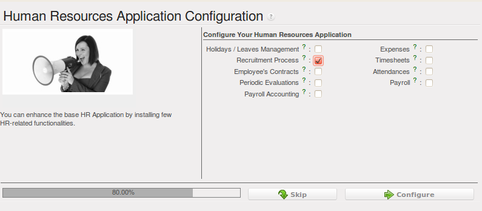
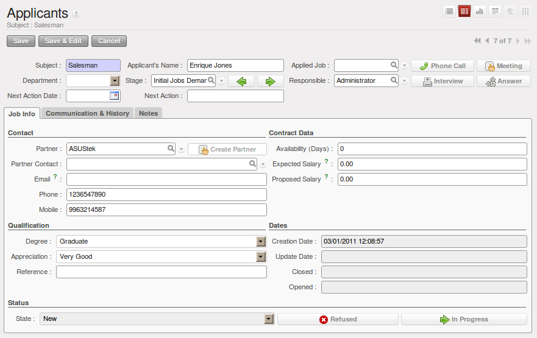
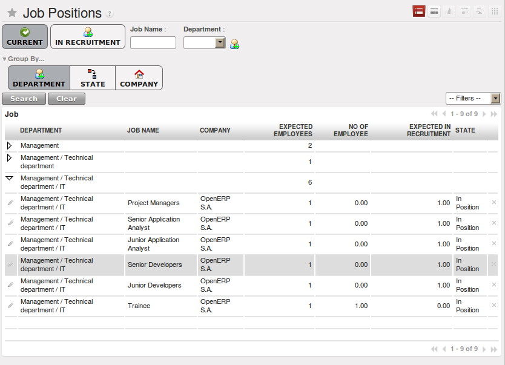
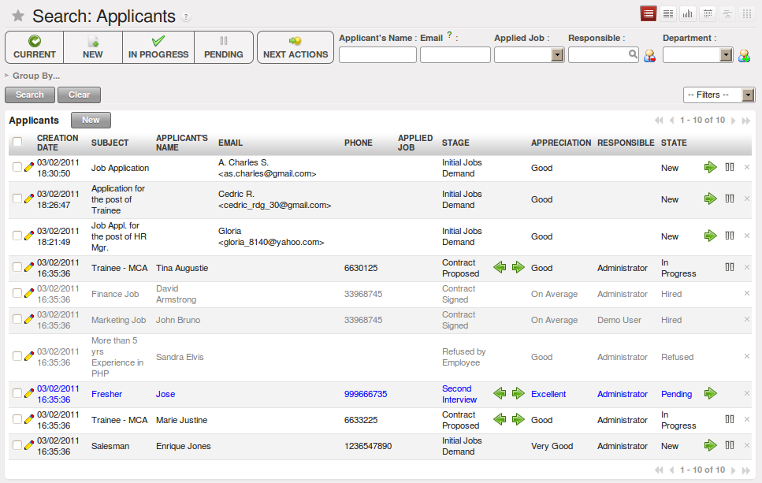
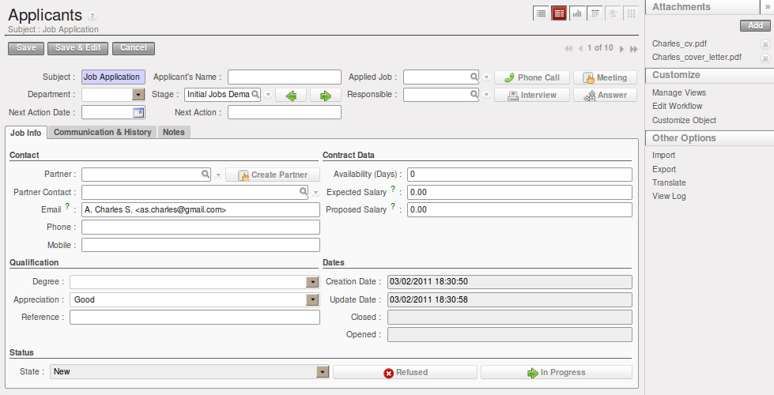
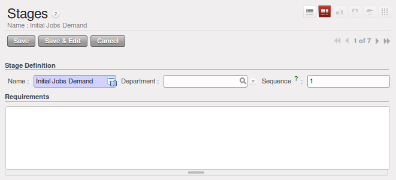
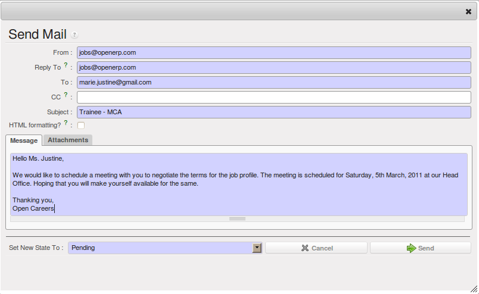
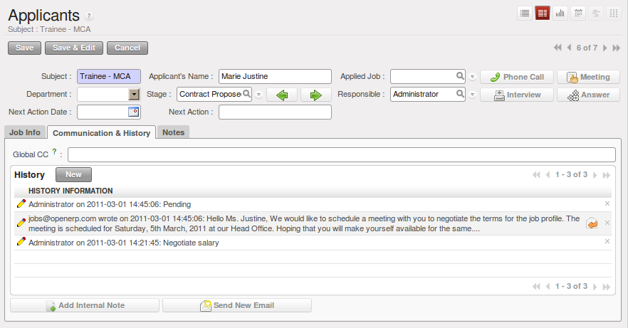
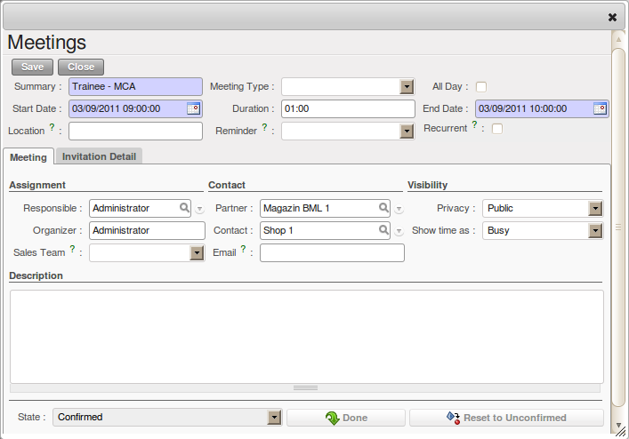
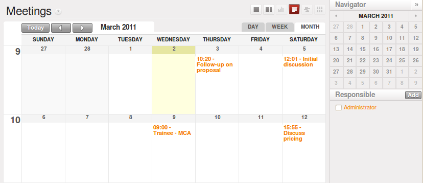

.. i18n: .. index::
.. i18n:    single: recruitments
.. i18n: ..
..

.. index::
   single: recruitments
..

.. i18n: Talent Acquisition
.. i18n: ==================
..

招聘
==================

.. i18n: Using OpenERP, you can efficiently manage the process of hiring new people for your organization.
.. i18n: It is a well managed recruitment process from initial contact to hiring the applicant.
..

使用ERP可以高效的管理招聘新员工的流程。可以很好的管理从最初接触到雇用应聘者的全部招聘过程。

.. i18n: .. index::
.. i18n:    single: module; hr_recruitment
..

.. index::
   single: module; hr_recruitment

.. i18n: You need to install :mod:`hr_recruitment` module to efficiently manage the recruitment process.
.. i18n: The configuration wizard to install this module is shown below:
..

你需要安装 `人力资源招聘` 模块 :mod:`hr_recruitment` 来高效地管理招聘流程。安装此模块的配置向导如下图所示:

.. i18n: .. figure::  images/config_wiz_recruitment.png
.. i18n:    :scale: 75
.. i18n:    :align: center
.. i18n: 
.. i18n:    *Configuration wizard to install hr_recruitment module*
..

   *安装人力资源招聘模块的配置向导*

.. i18n: The :guilabel:`Applicants` form can be seen from the menu :menuselection:`Human Resources --> Recruitment --> Applicants`.
..

在 :menuselection:`人力资源 --> 招聘 --> 申请人` :menuselection:`Human Resources --> Recruitment --> Applicants` 中显示申请人 `申请表` :guilabel:`Applicants` 。

.. i18n: .. figure::  images/recruitment_applicant_form.png
.. i18n:    :scale: 75
.. i18n:    :align: center
.. i18n: 
.. i18n:    *Applicant recruitment form*
..

   *申请人申请表*

.. i18n: You can manage the following information using the Applicants form:
..

你可以使用申请人申请表管理下列信息:

.. i18n: * :guilabel:`Applicant's Name`
.. i18n: * :guilabel:`Applied Job`
.. i18n: * :guilabel:`Department`
.. i18n: * :guilabel:`Stage`: can be ``Initial Job Demand``, ``Salary Negotiation``, ...
.. i18n: * :guilabel:`Responsible`: Responsible person who conducts the interview
.. i18n: * :guilabel:`Contact` information
.. i18n: * :guilabel:`Contract Data`: including Availability, Expected Salary, Proposed Salary
.. i18n: * :guilabel:`Qualification` of the applicant
.. i18n: * :guilabel:`State`: reflects the actual status of the recruitment process like ``New``, ``In Progress``, ``Pending``, ``Refused`` or ``Hired``
..

* :guilabel:`申请人姓名`
* :guilabel:`申请的职位`
* :guilabel:`部门`
* :guilabel:`阶段`: ``初期工作要求``, ``工资协议``, ...
* :guilabel:`负责人`: 面试人
* :guilabel:`联系人` 联系方式
* :guilabel:`合同信息`: 包括有效（天数），期望的薪酬，提议薪酬
* :guilabel:`资格` 
* :guilabel:`状态`: 实际招聘状态: ``新建`` , ``进行中`` , ``待定`` , ``拒绝`` 或者 ``录用``

.. i18n: Initially, the applicant state is ``New``, after that it can be converted to ``In Progress``.
.. i18n: If the applicant is at one of the different stages like it may be in `Waiting for approval by human resource department` or `Waiting for offer acceptance by applicant`,
.. i18n: in these cases, the applicant state should be ``Pending``. When the status is ``Hired``, you can find that applicant's detail from the list of employees.
..

最初，申请状态是 ``新建`` ，然后转变为 ``进行中`` 。如果申请人处于 ``等待人力资源部审批`` 或者 ``等待接受录用`` 的任何一种
状态下，申请状态是 ``待定`` 。当状态处于 ``录用`` 时，你就可以在员工列表中看到该申请人的详细材料。

.. i18n: The information about the :guilabel:`Job Position` can be maintained by the menu :menuselection:`Human Resources --> Recruitment --> Job Positions`.
..

:guilabel:`职位信息` 保存在 :menuselection:`人力资源 --> 招聘 --> 职位` :menuselection:`Human Resources --> Recruitment --> Job Positions` 。

.. i18n: .. figure::  images/recruitment_job_position.png
.. i18n:    :scale: 75
.. i18n:    :align: center
.. i18n: 
.. i18n:    *Job Positions in the organization*
..

   *系统中的职位*

.. i18n: The key features of OpenERP for the process of hiring new people using :mod:`hr_recruitment` module are:
..

在ERP中，使用 `招聘模块` :mod:`hr_recruitment` 招聘新员工的主要功能有:

.. i18n: * It manages job positions and the recruitment process.
.. i18n: * It is integrated with the :mod:`survey` module to allow you to define interviews for different jobs.
.. i18n: * This module is integrated with the mail gateway to automatically track emails
.. i18n:   sent to jobs@yourcompany.com.
.. i18n: * It is also integrated with the document management system to store and search CVs in your CV base.
..

* 管理职务职位和招聘过程.
* 利用 `调查模块` :mod:`survey` 为不同工作设定面试.
* 利用邮件网关自动跟踪邮件发送到jobs@yourcompany.com.
* 利用文件管理系统在简历库中保存和查找简历.

.. i18n: You can analyse data of recruitment process through the menu :menuselection:`Human Resources --> Reporting --> Recruitment Analysis`.
..

你可以通过 :menuselection:`人力资源 --> 报告 --> 招聘分析` :menuselection:`Human Resources --> Reporting --> Recruitment Analysis` 分析招聘过程数据.

.. i18n: .. index::
.. i18n:    single: recruitments; create applicants from e-mail
..

.. index::
   single: recruitments; create applicants from e-mail

.. i18n: Create applicants automatically based on incoming mail and keep track of attachments such as resumes and cover letters
.. i18n: ----------------------------------------------------------------------------------------------------------------------
..

根据进来的邮件自动创建申请人并跟踪附件，如简历和求职信
----------------------------------------------------------------------------------------------------------------------

.. i18n: You have seen how to create new applicants from the `Applicants` form. You can also configure your email server in OpenERP to create new applicants based on incoming mails. For example, if you have an e-mail ID ``jobs@yourcompany.com``, you can configure it such that all emails received at this ID automatically generate new job applicants.
..

你可以在 `申请人申请表` 中看到如何建立一个新的申请人。你也可以在ERP中安装电子邮件服务器从而在接收到邮件的同时建立新的
申请人。例如，如果你有一个邮件地址，你可以安装它，这样所有通过这个地址接收到的电子邮件将自动生成新的申请人。

.. i18n: For this, you have to install the :mod:`fetchmail` module by using the :guilabel:`Reconfigure` wizard and configuring :guilabel:`Fetch Emails` for installation in the `CRM Application Configuration` section. 
..

因此，你可以通过 :guilabel:`使用重新设置向导` 和 :guilabel:`在客户管理设置部分安装读取电子邮件设备` 来配置安装 `读取电子邮件模块` :mod:`fetchmail` 。

.. i18n: Navigate to :menuselection:`Sales --> Configuration --> Emails --> Email Servers` and click :guilabel:`New`. Supply the following information in the `Email Servers` form:
..

浏览 :menuselection:`销售 --> 安装 --> 邮件 --> 邮件服务器` :menuselection:`Sales --> Configuration --> Emails --> Email Servers` 并且点击 :guilabel:`新建` 。 `邮件服务器` 表提供下列信息:

.. i18n: * :guilabel:`Name` : A name for the server configuration.
.. i18n: * :guilabel:`Server Type` : Either ``POP Server`` or ``IMAP Server``.
.. i18n: * :guilabel:`Add Attachment` : Set to ``True``, to be able to retrieve attachments like CVs, cover letters, etc.
.. i18n: * :guilabel:`Server` : Server name.
.. i18n: * :guilabel:`Port` : Server port.
.. i18n: * :guilabel:`User Name` : The username on this e-mail server.
.. i18n: * :guilabel:`Password` : The password for access to this e-mail account.
.. i18n: * :guilabel:`Model` : The object model for which you wish to generate a record. Select ``Applicant`` (hr.applicant) in this case.
..

* :guilabel:`名称` : 服务器配置名称.
* :guilabel:`服务器类型` : ``POP服务器`` 或者 ``IMAP服务器`` .
* :guilabel:`添加附件` : 设置 ``真`` 可以检索到简历，求职信等附件.
* :guilabel:`服务器` : 服务器地址.
* :guilabel:`端口` : 服务器端口.
* :guilabel:`用户名` : 电子邮件服务器用户名.
* :guilabel:`密码` : 访问电子邮件账户的密码.
* :guilabel:`模型` : 你希望生成的记录。这种情况下选择 ``申请人`` （人力资源-申请人）.

.. i18n: .. figure::  images/recruitment_config_server.png
.. i18n:    :scale: 75
.. i18n:    :align: center
.. i18n: 
.. i18n:    *Configuring an e-mail server*
..

.. figure::  images/recruitment_config_server.png
   :scale: 75
   :align: center

   *配置一个电子邮件服务器*

.. i18n: After configuring your server, click the :guilabel:`Confirm` button to enable this configuration and start receiving e-mails.
..

配置服务器之后，点击 :guilabel:`确认` 按钮启用此配置并且开始接收电子邮件

.. i18n: Whenever you receive a new e-mail at the configured e-mail address, a new applicant record is created having the same subject name as the e-mail subject. The applicants e-mail details are stored too, for future correspondence. You can add more details to this job application. You can view these newly created applicants from :menuselection:`Human Resources --> Recruitment --> Applicants` and by clicking the :guilabel:`Clear` button to clear all filters. In the figure :ref:`ejob`, the top three applicants have been created automatically from received e-mails.
..

如果在安装好的电子邮件地址中接收一封新邮件，那么与此同时（一个与该新邮件主题相同的）新申请人主题名称被建立。申请人
电子邮件详细内容被保存（用于今后核对）。你可以添加更多的详情到这个工作申请中。你可以在 :menuselection:`人力资源—招聘—申请人` :menuselection:`Human Resources --> Recruitment --> Applicants` 中查看
这些新建立的申请人并且通过点击 :guilabel:`清除` 键清除所有过滤器。电子邮件中的申请人在求职者数据中自动建立，电子邮件中的前三个
申请人被自动创建, 参见图: :ref:`ejob`.

.. i18n: .. _ejob:
.. i18n: 
.. i18n: .. figure::  images/recruitment_from_email.png
.. i18n:    :scale: 70
.. i18n:    :align: center
.. i18n: 
.. i18n:    *Job applicants automatically created from e-mails*
..

.. _ejob:

   *Job applicants automatically created from e-mails*

.. i18n: Because you have configured your server to add attachments, if an incoming applicant e-mail contains attachments, it will be linked to the corresponding applicant record. You can find it in the :guilabel:`Attachments` section at the right of the applicant form. You can click on the attachment name to open it.
..

由于您的服务器已安装添加附件，如果一个收到的电子邮件中包含 :guilabel:`附件` ，它将会链接到相应的申请人记录。你可以在申请表
右侧附件部分找到。你可以点击附件打开。

.. i18n: .. figure::  images/recruitment_email_attach.png
.. i18n:    :scale: 70
.. i18n:    :align: center
.. i18n: 
.. i18n:    *Applicant form with its corresponding attachments*
..

   *Applicant form with its corresponding attachments*

.. i18n: .. index::
.. i18n:    single: recruitments; stages
..

.. index::
   single: recruitments; stages

.. i18n: Define stages to track the progress in the recruitment process
.. i18n: --------------------------------------------------------------
..

在招聘进程中定义阶段来跟踪进程
--------------------------------------------------------------

.. i18n: Rarely will a recruitment process end after just a single meeting or a phone call. It is in fact a string of stages through which a recruitment progresses in order to bear a favourable outcome. You can define the stages which a recruitment process would undergo. Use the menu :menuselection:`Human Resources --> Configuration --> Recruitment --> Stages` to define various stages.
..

很少会只是一个单独的见面或者一个电话之后就结束招聘。为了有个良好的结果通常一个招聘过程是一系列的筹划。你可以设定招聘
过程中会经历的阶段。使用 :menuselection:`人力资源 --> 设置 --> 招聘 --> 阶段` :menuselection:`Human Resources --> Configuration --> Recruitment --> Stages` 来设定不同阶段。

.. i18n: .. figure::  images/recruitment_stages.png
.. i18n:    :scale: 75
.. i18n:    :align: center
.. i18n: 
.. i18n:    *Defining recruitment stages*
..

   *Defining recruitment stages*

.. i18n: You must give the stage a :guilabel:`Name`. Use the :guilabel:`Sequence` field to give a sequence order when displaying a list of stages. You may also associate the stage with a :guilabel:`Department`. The stages that you have defined then become available in the `Applicants` form's `Stage` field. Using this, you can qualify an ongoing recruitment process from one stage to another.
..

你必须给出 :guilabel:`阶段名称` 。当显示阶段明细时，使用 :guilabel:`序列` 领域给出序列指令。你也可以将 :guilabel:`部门` 与 :guilabel:`阶段` 联系在一起。你设定的阶段在申请表
的阶段领域可用。使用这个，你可以使持续的招聘过程有效地从一个阶段到另一个阶段。

.. i18n: .. index::
.. i18n:    single: recruitments; next action
..

.. index::
   single: recruitments; next action

.. i18n: Define next action and next action dates
.. i18n: ----------------------------------------
..

定义下个动作以及日期
----------------------------------------

.. i18n: The :guilabel:`Next Action Date` and :guilabel:`Next Action` fields on the `Applicants` form let you define an action you would like to initiate on a given date. It serves as a reminder to the recruitment officer regarding what step he must take next and on which date.
..

`申请表` 上的 :guilabel:`下一个操作` 和 :guilabel:`下一个操作日期` 字段允许你设定未来某个时间想要实施的行动。这可以提醒招聘主管接下来要做的事情和时间。

.. i18n: .. index::
.. i18n:    single: recruitments; communication history
..

.. index::
   single: recruitments; communication history

.. i18n: Track the history of the e-mail communication with the applicant
.. i18n: ----------------------------------------------------------------
..

跟踪申请人的邮件通信记录
----------------------------------------------------------------

.. i18n: Using the :guilabel:`Communication & History` tab in the `Applicants` form, you can add notes for internal reference or send e-mails to the applicant. You can also view the history of communication and notes for a recruitment application in the `History` section. If you specify e-mail addresses in the :guilabel:`Global CC` field, these e-mail addresses will be added to the :guilabel:`CC` field of all inbound and outbound e-mails for this record before being sent. You can separate multiple e-mail addresses with a comma.
..

使用 `应聘申请表` 上的 :guilabel:`联系与历史` 栏，你可以添加上仅供内部参考的注释或者发送电子邮件给应聘者。你也可以在 `历史` 部分查看交流历史
和注解招聘申请。如果你在 :guilabel:`全局抄送` 字段中指定电子邮件地址，那么该电子邮件地址将（在所有入站和出站的电子邮件发送前）添加
到邮件的 :guilabel:`抄送` 字段中。你可以用逗号分隔多个电子邮件地址。

.. i18n: To create an internal note, click the :guilabel:`Add Internal Note` button. Add a note description in the popup that appears. You also have a choice to change the application state at this stage. Click :guilabel:`Add` to save the note and see it listed in the `History` section.
..

点击 :guilabel:`添加内部说明` 按钮建立一个内部说明。在弹出框中 :guilabel:`添加` 一个描述说明。你也可以在这里改变应聘状态。点击添加保存注解使其
可以在 `历史` 部分看到。

.. i18n: To send an e-mail to the applicant, click the :guilabel:`Send New Email` button. In the popup, you must enter the following:
..

点击 :guilabel:`发送新电子邮件` 按钮给应聘者发送邮件。在弹出框中，你必须填入下列信息:

.. i18n: * :guilabel:`来自` : 用于发送电子邮件的地址.
.. i18n: * :guilabel:`回复` : 收回复的电子邮件地址.
.. i18n: * :guilabel:`发送` : 应聘者的电子邮件地址.
.. i18n: * :guilabel:`主题` : 电子邮件的主题。默认状态下，主题是招聘申请.
.. i18n: * :guilabel:`消息` : 电子邮件内容.
..

* :guilabel:`From` : E-mail address used to send an e-mail.
* :guilabel:`Reply To` : E-mail address for receiving a reply.
* :guilabel:`To` : The applicants e-mail address
* :guilabel:`Subject` : Subject of the e-mail. By default, it takes the subject of the recruitment application.
* :guilabel:`Message` : The message to send in the e-mail.

.. i18n: .. figure::  images/recruitment_send_mail.png
.. i18n:    :scale: 75
.. i18n:    :align: center
.. i18n: 
.. i18n:    *Send an e-mail to the applicant*
..

   *发送电子邮件给应聘者*

.. i18n: Here too, you have a choice to change the application state. You may also add attachments through the :guilabel:`Attachments` tab in the popup. Click :guilabel:`Send` to send the e-mail. You can see a listing of the correspondence as shown in the figure below:
..

这里你也可以改变应聘状态。你也可以在弹出的 :guilabel:`附件框` 中添加附件。点击 :guilabel:`发送` 发送电子邮件。如图所示你可以看到一个对应列表:

.. i18n: .. figure::  images/recruitment_comm_history.png
.. i18n:    :scale: 75
.. i18n:    :align: center
.. i18n: 
.. i18n:    *History of communication for the recruitment application*
..

   *History of communication for the recruitment application*

.. i18n: .. index::
.. i18n:    single: recruitments; phone calls
.. i18n:    single: recruitments; appointments
..

.. index::
   single: recruitments; phone calls
   single: recruitments; appointments

.. i18n: Plan phone calls or appointments
.. i18n: --------------------------------
..

计划电话呼叫或者访问
--------------------------------

.. i18n: One of the advantages of using the :mod:`hr_recruitment` module is that you can plan and organise phone calls to and appointments with prospective employees. This is made possible due to its integration with :mod:`crm` module's Phone Calls and Meetings features.
..

使用 `人力资源模块` :mod:`hr_recruitment` 的一个优点是你可以计划安排给未来的员工打电话和预约。这是由于其与 `客户关系管理` :mod:`crm` 模块中的电话和会议功能
相结合的原因。

.. i18n: You can schedule a phone call from the `Applicants` form by clicking the :guilabel:`Phone Call` button. This brings up a popup as shown below:
..

你可以通过点击  :guilabel:`打电话` 键从 `应聘申请表` 中安排一个电话。弹出框如下所示:

.. i18n: .. figure::  images/recruitment_sched_phone.png
.. i18n:    :scale: 75
.. i18n:    :align: center
.. i18n: 
.. i18n:    *Schedule an outbound phone call to an applicant*
..

.. figure::  images/recruitment_sched_phone.png
   :scale: 75
   :align: center

   *安排一个呼出电话给应聘者*

.. i18n: You can enter the following details in the popup:
..

你需要在弹出框中输入下列信息:

.. i18n: * :guilabel:`Assign To` : The user who is responsible for making the call.
.. i18n: * :guilabel:`Planned Date` : The scheduled date and time to make the call.
.. i18n: * :guilabel:`Goals` : The agenda of the phone call.
.. i18n: * :guilabel:`Category` : Whether the call is ``Outbound`` (default) or ``Inbound``.
..

* :guilabel:`分配` : 电话负责人.
* :guilabel:`计划时间` : 打电话的日期和时间.
* :guilabel:`目标` : 电话议程.
* :guilabel:`类别` : ``呼入`` 或者 ``呼出`` (默认).

.. i18n: You can then click the :guilabel:`Schedule Phone Call` button to create a plan for making the call. If the :guilabel:`Category` of your phone call is ``Outbound``, the `Outbound` form opens where you may add additional details. Once you have made the phone call, you can enter the :guilabel:`Duration` as well and click the :guilabel:`Held` button. You can track and evolve your plans of phone calls to an applicant from :menuselection:`Sales --> Phone Calls --> Outbound`.
..

然后你可以点击 :guilabel:`安排打电话` 键创建一个打电话计划。如果你的打 :guilabel:`电话类别` 是 ``呼出`` ，那么在 ``呼出`` 表中你可以添加更多的信息。一旦
确定打电话，你可以输入 :guilabel:`持续时间` 并且点击 :guilabel:`确定` 按钮。你可以通过 :menuselection:`销售 --> 打电话 --> 呼出` :menuselection:`Sales --> Phone Calls --> Outbound` 来跟踪和进行你的打电话计划.

.. i18n: .. figure::  images/recruitment_outbound_phone.png
.. i18n:    :scale: 75
.. i18n:    :align: center
.. i18n: 
.. i18n:    *Details of an outbound phone call to an applicant*
..

.. figure::  images/recruitment_outbound_phone.png
   :scale: 75
   :align: center

   *Details of an outbound phone call to an applicant*

.. i18n: Just like you schedule phone calls, you can also schedule meetings with an applicant. To do this, click the :guilabel:`Meeting` button on the `Applicants` form. A calendar of meetings opens in the `Meetings` form. Here, you click an empty area on a date for which you wish to schedule the meeting. A popup appears as shown below:
..

就像你安排打电话一样，你也可以为应聘者 :guilabel:`安排面谈` 。在 `应聘申请表` 中点击 :guilabel:`会见` 键。 `会见` 表格中有一个会议日程。在这里，你可以
点击时间的空白处，确定你希望安排会议的时间。如图所示:

.. i18n: .. figure::  images/recruitment_sched_meeting.png
.. i18n:    :scale: 75
.. i18n:    :align: center
.. i18n: 
.. i18n:    *Schedule a meeting with an applicant*
..

   *为应聘者安排会谈*

.. i18n: You can manage the following details from this form:
..

你可以从这张表格中管理以下信息:

.. i18n: * :guilabel:`Summary` : Is the recruitment application subject by default, although you can change it.
.. i18n: * :guilabel:`Start Date` : The scheduled start date and time.
.. i18n: * :guilabel:`End Date` : The scheduled end date and time.
.. i18n: * :guilabel:`Duration` : The duration of the meeting in hours.
.. i18n: * :guilabel:`Location` : Location of the meeting.
.. i18n: * :guilabel:`Reminder` : If you want to be reminded about the meeting, you can select an alarm time before the event occurs.
.. i18n: * :guilabel:`Description` : You may specify the agenda of the meeting here.
..

* :guilabel:`摘要` : 默认地招聘申请主题，当然你可以更改它.
* :guilabel:`开始日期` : 面谈开始的日期和时间.
* :guilabel:`结束日期` : 面谈结束的日期和时间.
* :guilabel:`持续时间` : 面谈持续多少小时.
* :guilabel:`地点` : 面谈地点.
* :guilabel:`提醒` : 如果你想提醒面谈，你可以在面谈开始前设定会议提醒.
* :guilabel:`描述` : 在这里你可以指定会谈内容.

.. i18n: On the :guilabel:`Invitation Detail` tab, you also have the choice to invite people for the meeting. Click :guilabel:`Save` once you have entered the necessary details. You can then see the meeting appear in the calendar as shown below:
..

在 :guilabel:`邀请信息` 栏，你也可以邀请参加会议的人。当你输入必要的信息后点击 :guilabel:`保存` 。然后你可以在日程中看到这个会议，如图所示:

.. i18n: .. figure::  images/recruitment_calendar_meeting.png
.. i18n:    :scale: 75
.. i18n:    :align: center
.. i18n: 
.. i18n:    *The scheduled meeting "Trainee - MCA" with the applicant as seen in the calendar*
..

   *日程中可以看到申请人的预约会议*

.. i18n: You can track and edit your meetings with applicants from the menu :menuselection:`Sales --> Meetings --> Meetings`. By default, you will see the month-wise calendar view of meetings.
..

你可以通过 :menuselection:`销售 --> 会议 --> 会议` :menuselection:`Sales --> Meetings --> Meetings` 来跟踪和编辑你的会议。默认地，你将会看到会议的“月份形式的日历”。

.. i18n: .. index::
.. i18n:    single: recruitments; questionnaires
.. i18n:    single: recruitments; survey
..

.. index::
   single: recruitments; questionnaires
   single: recruitments; survey

.. i18n: Fill questionnaires for each applicant (for instance preliminary questionnaires)
.. i18n: --------------------------------------------------------------------------------
..

应聘者填写调查问卷（例如初步调查问卷）
--------------------------------------------------------------------------------

.. i18n: You can use questionnaires as a tool to interview a job applicant. To be able to use questionnaires for a job applicant you must first define one through :menuselection:`Tools --> Surveys --> Define Surveys --> Survey`. Click :guilabel:`New` to open a new survey form. You may enter the :guilabel:`Survey Title` and the :guilabel:`Responsible` user for the survey.
..

你可以将调查问卷作为面试应聘者的工具。为了能够让应聘者使用调查问卷，你必须首先通过 :menuselection:`工具 --> 调查 --> 设定调查 --> 调查` :menuselection:`Tools --> Surveys --> Define Surveys --> Survey` 设定问卷。
点击  :guilabel:`新建` 打开一个新的调查表。你可以输入 :guilabel:`调查标题` 和 :guilabel:`负责人` 。

.. i18n: .. figure::  images/recruitment_job_survey.png
.. i18n:    :scale: 75
.. i18n:    :align: center
.. i18n: 
.. i18n:    *The survey form*
..

.. figure::  images/recruitment_job_survey.png
   :scale: 75
   :align: center

   *调查表*

.. i18n: A survey may have multiple pages. Each page may contain multiple questions and each question may have multiple answers. Different users may give different answers to the questions. You can define these in the :guilabel:`Survey` tab of the form. When you have entered the necessary details in the form, click :guilabel:`Save`. Since you will use this survey in a job interview, click the :guilabel:`Open` button to change the survey's state from ``Draft`` to ``Open``.
..

一个调查可以有多页。每一页可以包含多个问题并且每一个问题可以有多个答案。不同的使用者可以给出不同的答案。你可以在 :guilabel:`表格` 
的调查框中进行设定这些。当你在表格中输入必要信息后点击 :guilabel:`保存` 。面试时使用这个调查问卷，点击 :guilabel:`打开` 键更改调查问卷（从 ``草稿`` 
到 ``打开`` ）的状态。

.. i18n: Then, go to :menuselection:`Human Resources --> Recruitment --> Job Positions` and select the job position that the applicant has applied for, or create a new job position. In the :guilabel:`Survey` field of the `Job Positions` form, enter the name of the survey you have just created, thus linking a questionnaire with this job profile and making it available for use during the interview.
..

然后，在 :menuselection:`人力资源 --> 招聘 --> 职位` :menuselection:`Human Resources --> Recruitment --> Job Positions` 中选择应聘者应聘的岗位或者创建一个新的岗位。在 `工作岗位` 表格的 :guilabel:`调查` 字段中，输入你建立的调查
问卷名称，从而链接到这一工作的调查问卷并且在面试中使用该问卷。

.. i18n: You can now open the form of the applicant whose interview you wish to initiate. If an :guilabel:`Applied Job` is specified to which a survey is linked, the :guilabel:`Answer` button becomes accessible. Click it to initiate the survey, and fill in the applicant's response as you proceed. After the questionnaire has been completed, you can click the :guilabel:`Interview` button on the `Applicants` form to view the applicant's response in a PDF file.
..

现在你可以打开你希望进行初步面试的应聘者的表格。如果申请的  :guilabel:`职位` 与某个调查相连接， :guilabel:`答案` 按钮将可用。点击它进行初步调查，
并且在应聘者回复中填写。调查问卷完成后，你可以点击申请者 `申请表` 上的 :guilabel:`面试` 按钮在PDF中查看应聘者回复。

.. i18n: .. figure::  images/recruitment_survey_answers.png
.. i18n:    :scale: 75
.. i18n:    :align: center
.. i18n: 
.. i18n:    *The applicant's response in a PDF file*
..

.. figure::  images/recruitment_survey_answers.png
   :scale: 75
   :align: center

   *The applicant's response in a PDF file*

.. i18n: .. Copyright © Open Object Press. All rights reserved.
..

.. Copyright © Open Object Press. All rights reserved.

.. i18n: .. You may take electronic copy of this publication and distribute it if you don't
.. i18n: .. change the content. You can also print a copy to be read by yourself only.
..

.. You may take electronic copy of this publication and distribute it if you don't
.. change the content. You can also print a copy to be read by yourself only.

.. i18n: .. We have contracts with different publishers in different countries to sell and
.. i18n: .. distribute paper or electronic based versions of this book (translated or not)
.. i18n: .. in bookstores. This helps to distribute and promote the OpenERP product. It
.. i18n: .. also helps us to create incentives to pay contributors and authors using author
.. i18n: .. rights of these sales.
..

.. We have contracts with different publishers in different countries to sell and
.. distribute paper or electronic based versions of this book (translated or not)
.. in bookstores. This helps to distribute and promote the OpenERP product. It
.. also helps us to create incentives to pay contributors and authors using author
.. rights of these sales.

.. i18n: .. Due to this, grants to translate, modify or sell this book are strictly
.. i18n: .. forbidden, unless Tiny SPRL (representing Open Object Press) gives you a
.. i18n: .. written authorisation for this.
..

.. Due to this, grants to translate, modify or sell this book are strictly
.. forbidden, unless Tiny SPRL (representing Open Object Press) gives you a
.. written authorisation for this.

.. i18n: .. Many of the designations used by manufacturers and suppliers to distinguish their
.. i18n: .. products are claimed as trademarks. Where those designations appear in this book,
.. i18n: .. and Open Object Press was aware of a trademark claim, the designations have been
.. i18n: .. printed in initial capitals.
..

.. Many of the designations used by manufacturers and suppliers to distinguish their
.. products are claimed as trademarks. Where those designations appear in this book,
.. and Open Object Press was aware of a trademark claim, the designations have been
.. printed in initial capitals.

.. i18n: .. While every precaution has been taken in the preparation of this book, the publisher
.. i18n: .. and the authors assume no responsibility for errors or omissions, or for damages
.. i18n: .. resulting from the use of the information contained herein.
..

.. While every precaution has been taken in the preparation of this book, the publisher
.. and the authors assume no responsibility for errors or omissions, or for damages
.. resulting from the use of the information contained herein.

.. i18n: .. Published by Open Object Press, Grand Rosière, Belgium
..

.. Published by Open Object Press, Grand Rosière, Belgium
