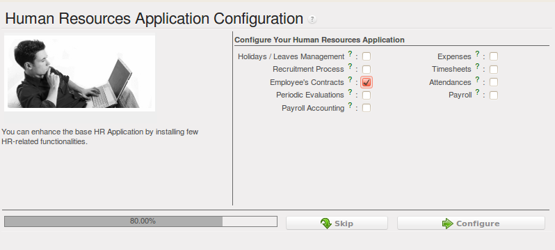
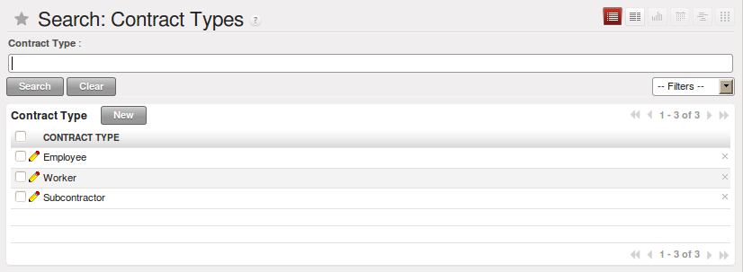
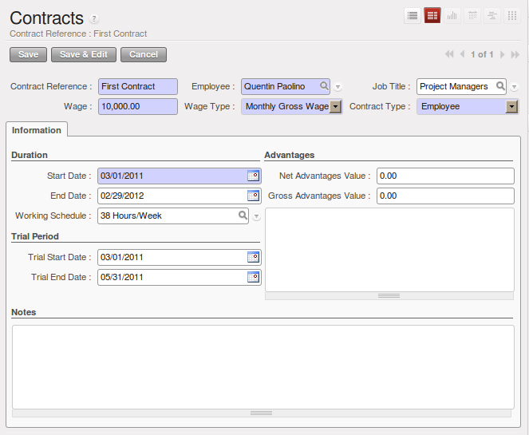

.. i18n: .. index::
.. i18n:    single: HR; management
.. i18n:    single: employee
..

.. index::
   single: HR; management
   single: employee

.. i18n: Managing Human Resources
.. i18n: ========================
..

管理人力资源
========================

.. i18n: To establish a system that is integrated into the company's management, you need to start with a
.. i18n: current list of collaborators.
..

为了建立一个公司管理系统，你需要启动当前列表中的一个用户。

.. i18n: .. note:: Do not confuse employees and users
.. i18n: 
.. i18n: 	For OpenERP, “employee” represents all of the physical people who have a work contract with
.. i18n: 	the company. This includes all types of contracts: contracts with both fixed and indeterminate time
.. i18n: 	periods, and also independent and freelance service contracts.
.. i18n: 
.. i18n: 	A “user” is a physical person who is given access to the company's systems. Most employees are
.. i18n: 	users but some users are not employees: external partners can have access to parts of the system.
..

.. note:: 不要混淆员工和用户

	就OpenERP而言，所谓 ``员工`` 是指与公司签署劳动合同的人。包括所有类型的合同：长期的和临时的，也
	包括全职的和兼职的。

	所谓 ``用户`` 是指有权访问公司系统的人。绝大部分的员工是用户，但是一些用户却不是员工，例如外部
	合作伙伴可以访问系统的部分模块。

.. i18n: Here are some examples of functions which depend on the accuracy of the employee list:
..

一些取决于员工名单准确性的功能如下所示:

.. i18n: * the cost of a service, which depends on the employee's working contract,
.. i18n: 
.. i18n: * project planning, which depends on the work pattern of the project contributors,
.. i18n: 
.. i18n: * the client billing rate, which probably depends on the employee's job function,
.. i18n: 
.. i18n: * the chain of command, or responsibilities, which is related to the hierarchical structure of the
.. i18n:   company.
..

* 服务成本，取决于员工的劳动合同,

* 工程计划，取决于工程贡献者的工作模式,

* 客户端计费率，可能取决于员工的工作职能,

* 连锁的命令或者责任，与公司的分层结构相关.

.. i18n: Link employees and OpenERP users to facilitate the management of rights
.. i18n: -----------------------------------------------------------------------
..

关联员工和OpenERP用户，促进权限的管理
-----------------------------------------------------------------------

.. i18n: To define a new employee in OpenERP, use the menu :menuselection:`Human Resources --> Employees`.
..

在OpenERP中使用菜单 :menuselection:`人力资源(Human Resources) --> 员工(Employees)` 中定义一个新员工. 

.. i18n: .. figure::  images/service_employee_form.png
.. i18n:    :scale: 75
.. i18n:    :align: center
.. i18n: 
.. i18n:    *Form describing an employee*
..

.. figure::  images/service_employee_form.png
   :scale: 75
   :align: center

   *员工详细信息表单*

.. i18n: Start by entering the employee's name in :guilabel:`Name` and the company that this employee works for
.. i18n: in :guilabel:`Company`. You can then create a new user of the OpenERP system linked to this
.. i18n: employee by filling in a new :guilabel:`User` form through the :guilabel:`User` field.
..

在 :guilabel:`名称` 框输入员工姓名和在 :guilabel:`公司` 框输入员工所在公司的名称。然后在 :guilabel:`用户` 中填写一个新用户从而建立一个新的ERP系统 :guilabel:`用户` 。

.. i18n: Even if the employee is not a user, it is best if you
.. i18n: create a system access for most of your staff just so that you can control their access rights from
.. i18n: the outset (and you can do that through this field if you need to).
..

即使这个员工不是用户，你最好为你的员工创建一个系统账号以便于你可以从一开始就掌控他们的访问权限（如果你需要你可以
通过这个模块这么做）。

.. i18n: .. tip:: Employee and User link.
.. i18n: 
.. i18n: 	If the employee has a user account on the system, you always link his or her user
.. i18n: 	account to the employee form.
.. i18n: 
.. i18n: 	Creating this link enables automatic completion to be done on the :guilabel:`Employee` field in the
.. i18n: 	relevant forms, such as services and expense records.
..

.. tip:: 员工和用户的关联

	如果员工在系统中有用户名，你可以通过他（她）的用户名连接到员工表。

	创建这个链接后员工模块中的相关界面中的 :guilabel:`员工` 字段能够自动完成，例如服务和费用记录。

.. i18n: Then enter the employee's address.
..

输入员工地址.

.. i18n: .. todo:: We need to give better guidance about Partners vs Employees just here.
..

.. todo:: We need to give better guidance about Partners vs Employees just here.

.. i18n: This appears in the partner contact form in OpenERP. Since
.. i18n: employees are people that have contracts with your company, it is logical that they have entries
.. i18n: like any other partner in your database. So enter the name of the employee as a new partner Name and
.. i18n: the address in the Partner Contact section of the General tab.
.. i18n: Then all of the functions that apply to a partner can also be
.. i18n: applied to an employee. This is particularly useful for tracking debits and credits in
.. i18n: the accounts – so you can track salary payments, for example.
..

这个出现在ERP中的合作伙伴联系表中，自员工与公司签订合同开始，他们就可以像数据库中其他合作伙伴一样有记录。因此在
合作伙伴联系一栏输入员工的名字和地址。然后所有的功能既适用于一个合作伙伴也适用于一个员工。这个对于跟踪账户中借贷
方很有用-例如你可以跟踪薪酬支付。

.. i18n: To help employees encode and validate timesheets and attendances, you can install :mod:`hr_timesheet_sheet` by selecting :guilabel:`Timesheets` in the :guilabel:`Reconfigure` wizard.
.. i18n: You can then set both an analytic journal and a linked product to this employee
.. i18n: in the :guilabel:`Timesheets` tab. If
.. i18n: you do it that way, then this information can be used to track services. For now, just complete the
.. i18n: form with the following information:
..

你可以通过在 :guilabel:`配置导向` 中选择工时表安装 :mod:`hr_timesheet_sheet` ，帮助 :guilabel:`员工们` 编制和确认 :guilabel:`工时表` 和考勤。然后你可以在工时表中
为这个员工设立一个成本凭证薄和一个产品。如果你这么做了，这些信息将用于跟踪服务。现在，完成下列表单信息:

.. i18n: *  :guilabel:`Analytic Journal` : usually a ``Timesheet Journal``,
.. i18n: 
.. i18n: *  :guilabel:`Product` : a service product that describes how this employee would be charged out,
.. i18n:    for example as ``Service on Timesheet``.
..

*  :guilabel:`Analytic Journal` : 通常是一个 ``工时表日志``,

*  :guilabel:`Product` : 一个描述了这个员工被解除的服务产品，例如 ``工时服务表`` 。

.. i18n: .. index::
.. i18n:    single: employee; billing
..

.. index::
   single: employee; billing

.. i18n: Define employees' billing prices and costs
.. i18n: ------------------------------------------
..

定义员工的账单价格和成本
------------------------------------------

.. i18n: To be able to use the timesheets at all, you must first define those employees who are system users.
.. i18n: The employee definition forms contain the information necessary to use that sheet, such as the job
.. i18n: title, and hourly costs.
..

你首先必须要确认员工是系统用户，才能够使用工时表。员工基本信息包括必要的信息，例如职务和小时成本。

.. i18n: Two fields will be of particular interest to you for managing timesheets: the :guilabel:`Analytic
.. i18n: Journal` and the :guilabel:`Product`.
..

:guilabel:`成本凭证薄` 和 :guilabel:`产品` 这两模块有利于管理工时表.

.. i18n: All the analytic entries about the costs of service times will be stored in the analytic journal.
.. i18n: These enable you to isolate the cost of service from other company costs, such as the purchase of raw
.. i18n: materials, expenses receipts and subcontracting. You can use different journals for each employee to
.. i18n: separate costs by department or by function.
..

所有关于服务次数成本的分析将保存在成本凭证薄中。它们能帮助你将服务成本与公司的其他成本分开，例如原材料的购买，
费用和分包。你可以通过部门或者功能给每个员工指定不同的成本凭证薄来区分成本。

.. i18n: The employee is also associated with a product in your database in OpenERP. An employee is linked
.. i18n: with a product, so they can be 'bought' (subcontracting) or 'invoiced' (project management). You have
.. i18n: to create a product for each job type in your company.
..

员工也与ERP数据库中的一个产品相关联。一个员工与一个产品相关联，所以他们可以是 '购买'（分包）也可以是 '开票'（
项目管理）。你必须为每一个工作类型建立一个产品。

.. i18n: The following information is important in the product form:
..

在产品界面中下列信息至关重要:

.. i18n: *  :guilabel:`Name` : \ ``Secretary`` \,  \ ``Salesperson`` \ or \ ``Project Manager``\
.. i18n: 
.. i18n: *  :guilabel:`Product Type` : \ ``Service``\
.. i18n: 
.. i18n: *  :guilabel:`Unit of Measure` : \ ``Hour`` \ or \ ``Day``\
.. i18n: 
.. i18n: *  :guilabel:`Cost Price`
.. i18n: 
.. i18n: *  :guilabel:`Sale Price`
.. i18n: 
.. i18n: *  :guilabel:`Costing Method` : either \ ``Standard Price``\  or  \ ``Average Price``\
..

*  :guilabel:`名称` : \ ``秘书`` \， \ ``销售人员`` \ 或者 \ ``项目经理`` \, 
                                                                             
*  :guilabel:`产品类型` : \ ``服务``\                                        
                                                                             
*  :guilabel:`计量单位` : \ ``小时`` \ 或者 \ ``天``\                        
                                                                             
*  :guilabel:`成本价格`                                                      
                                                                             
*  :guilabel:`销售价格`                                                      
                                                                             
*  :guilabel:`成本计算方法` : \ ``标准价格``\  或者  \ ``平均价格``\         

.. i18n: .. index::
.. i18n:    single: module; product_index
..

.. index::
   single: module; product_index

.. i18n: .. tip:: Price Indexation
.. i18n: 
.. i18n: 	When the `Costing Method` is `Average Price` in the `Product` form, you can have a button :guilabel:`Update`, beside the `Cost Price` field, that opens up a wizard for changing the cost price.
..

.. tip:: 价格指数

	当在 `产品` 页面中 `成本计算方法` 是 `平均价格法` 时，你可以使用 `成本价格` 字段旁边的 :guilabel:`更新` 按钮打开更换成本价格的向导。

.. i18n: In summary, each company employee corresponds, in most cases, to:
..

总之，每一个公司员工应该对应下列主要事项:

.. i18n: * a :guilabel:`Partner`
.. i18n: 
.. i18n: * an :guilabel:`Employee` form,
.. i18n: 
.. i18n: * a :guilabel:`System User`.
..

* :guilabel:`合作伙伴`

* :guilabel:`员工` 表,

* :guilabel:`系统用户`.

.. i18n: And each company job position corresponds to a :guilabel:`Product`.
..

一个公司工作职位对应一个 :guilabel:`产品` 。

.. i18n: .. index::
.. i18n:    single: module; hr_contract
..

.. index::
   single: module; hr_contract

.. i18n: .. note:: Time Charge Rates
.. i18n: 
.. i18n: 	By default, the hourly cost of an employee is given by the standard cost of the product linked to
.. i18n: 	that employee.
.. i18n: 	But if you install the :mod:`hr_contract` module, it is possible to manage contracts differently.
.. i18n: 	The hourly cost of the employee is then automatically calculated from their employment contract
.. i18n: 	when they enter their timesheet data.
.. i18n: 
.. i18n: 	To do this, the software uses a factor defined in the contract type
.. i18n: 	(for example, the gross monthly salary, calculated per day).
.. i18n: 	Ideally, this factor should take into account the salary costs, taxes, insurances and other
.. i18n: 	overheads associated with pay.
..

.. note:: 工时价格

	默认地，员工小时成本来自于员工对应产品的标准成本。
	但如果你安装了 ``人力资源合同`` :mod:`hr_contract` 模块，将可以管理不同的合同。当员工输入他们的工时数据时，员工的小时成本
	将根据员工的雇用合同自动计算。

	为此，软件中用一个因素定义合同类型（例如总月工资，每天计算）。理想地，这个因素应该考虑到工资
	成本，税，保险和其他费用支付。

.. i18n: .. index::
.. i18n:    single: employee; categories
..

.. index::
   single: employee; categories

.. i18n: Define employee categories to assign different Holiday’s rights to different employee groups
.. i18n: --------------------------------------------------------------------------------------------
..

定义员工分类，给不同的员工组别指定不同的休假权限
--------------------------------------------------------------------------------------------

.. i18n: You must create and assign employee categories for employees in order to be able to assign and manage leave and allocation requests by category. You can define employee categories from :menuselection:`Human Resources --> Configuration --> Human Resources --> Employees --> Categories of Employee`. For a new category, define its name in :guilabel:`Category`. A category may also be assigned a :guilabel:`Parent Category`.
..

（你必须为员工建立和分派类型）以便于（能够根据类型）分配和管理（离开和分配要求）。你可以在 :menuselection:`人力资源 --> 结构 --> 人力资源 --> 员工 --> 员工分类` :menuselection:`Human Resources --> Configuration --> Human Resources --> Employees --> Categories of Employee`
中将 :guilabel:`员工分类` 。在分类框填入一个新的分类名称从而建立一个新的分类。一个分类也可以被分配一个 :guilabel:`父类` 。

.. i18n: .. figure::  images/employee_categories.png
.. i18n:    :scale: 75
.. i18n:    :align: center
.. i18n: 
.. i18n:    *Example of categories defined for employees*
..

.. figure::  images/employee_categories.png
   :scale: 75
   :align: center

   *Example of categories defined for employees*

.. i18n: To link an employee to a category, open the employee form through :menuselection:`Human Resources --> Human Resources --> Employees`. In the :guilabel:`Categories` tab, you can assign more than one category to an employee by clicking :guilabel:`Add` and selecting a category.
..

从 :menuselection:`人力资源 --> 人力资源 --> 员工` :menuselection:`Human Resources --> Human Resources --> Employees` 中找到员工将其归到一个 :guilabel:`分类` 中。在 :guilabel:`分类` 栏中，你可以通过选择 :guilabel:`添加` 和选定一个分类将一个员工归到
不止一个类别中。

.. i18n: .. figure::  images/employee_assign_category.png
.. i18n:    :scale: 75
.. i18n:    :align: center
.. i18n: 
.. i18n:    *Assign categories to an employee in the Employee form*
..

.. figure::  images/employee_assign_category.png
   :scale: 75
   :align: center

   *Assign categories to an employee in the Employee form*

.. i18n: Now, when you create a new leave or allocation request from the menuitems under :menuselection:`Human Resources --> Holidays`, if your :guilabel:`Leave Category` or :guilabel:`Allocation Category` is ``By Employee Category``, then you must choose a pre-defined :guilabel:`Category`. The request will then be applicable to all those employees who belong to the category selected. For example, you can create an allocation request for employees belonging to the ``Trainee`` category, entitling them to fewer leaves than the rest of the employees.
..

现在，当你在 :menuselection:`人力资源 --> 假期` :menuselection:`Human Resources --> Holidays` 下面的菜单中建立一个新的 :guilabel:`离开` 或者 :guilabel:`分配请求` ，如果你的 :guilabel:`离开类别` 或者分配类别是 :guilabel:`员工类别` ，那么
你必须选者一个预先定义的 :guilabel:`类别` 。这个请求将适用于所有属于这个类别的员工。例如你可以为 ``学员`` 类别的员工建立一个分配要求，
使他们的离开少于其他员工。

.. i18n: .. index::
.. i18n:    single: employee; contracts
..

.. index::
   single: employee; contracts

.. i18n: Define contract types and wage types with start and end dates for contracts as well as trial periods
.. i18n: ----------------------------------------------------------------------------------------------------
..

用合同起止日期、试用期来定义合同类型和工资类型
----------------------------------------------------------------------------------------------------

.. i18n: If you install the :mod:`hr_contract` module you can link contract details to the employee record.
.. i18n: The configuration wizard to install this module is shown below.
..

如果你安装了 ``人力资源合同`` :mod:`hr_contract` 模块，你就可以打开合同明细员工记录。这个模块的安装如下图所示:

.. i18n: .. figure::  images/config_wiz_contract.png
.. i18n:    :scale: 75
.. i18n:    :align: center
.. i18n: 
.. i18n:    *Configuration wizard to install hr_contract*
..

   *Configuration wizard to install hr_contract*

.. i18n: Define new contract types at :menuselection:`Human Resources --> Configuration --> Human Resources --> Contract --> Contract Types`.
..

在 :menuselection:`人力资源 --> 设置 --> 人力资源 --> 合同 --> 合同类型` :menuselection:`Human Resources --> Configuration --> Human Resources --> Contract --> Contract Types` 中建立一个新的合同类型。

.. i18n: .. figure::  images/hr_contract_type_list.png
.. i18n:    :scale: 75
.. i18n:    :align: center
.. i18n: 
.. i18n:    *Contract Types list*
..

   *Contract Types list*

.. i18n: You may similarly define wage types at :menuselection:`Human Resources --> Configuration --> Human Resources --> Contract --> Wage Type`. Enter the following details in the form:
..

你可以用同样方法在 :menuselection:`人力资源 --> 设置 --> 人力资源 --> 合同 --> 工资类型` :menuselection:`Human Resources --> Configuration --> Human Resources --> Contract --> Wage Type` 中建立一个新的工资类型。在表格中输入下列信息:

.. i18n: *  :guilabel:`Wage Type Name` : A name for the wage type.
.. i18n: *  :guilabel:`Wage Period` : Select a pre-defined wage period. Wage periods are defined at :menuselection:`Human Resources --> Configuration --> Human Resources --> Contract --> Wage period`.
.. i18n: *  :guilabel:`Type` : Either ``Gross`` or ``Net``.
.. i18n: *  :guilabel:`Factor for hour cost` : Used by the timesheet system to compute the price of an hour of work based on the contract of an employee.
..

*  :guilabel:`工资类型名称` : 一个工资类型名称.
*  :guilabel:`工资期间` : 选择一个预先定义的工资期间。工资期间在 :menuselection:`人力资源 --> 配置 --> 人力资源 --> 合同 --> 工资期间` :menuselection:`Human Resources --> Configuration --> Human Resources --> Contract --> Wage period` 中设定。
*  :guilabel:`类型` : ``毛工资`` 或者 ``净工资`` 。
*  :guilabel:`小时成本因素` : 根据每个员工的合同通过工时系统计算每小时工作价格。

.. i18n: .. figure::  images/hr_wage_type.png
.. i18n:    :scale: 75
.. i18n:    :align: center
.. i18n: 
.. i18n:    *Wage Type form*
..

.. figure::  images/hr_wage_type.png
   :scale: 75
   :align: center

   *Wage Type form*

.. i18n: Using :menuselection:`Human Resources --> Human Resources --> Contracts` you can create and edit contracts.
..

你可以在 :menuselection:`人力资源 --> 人力资源 --> 合同` :menuselection:`Human Resources --> Human Resources --> Contracts` 中建立和编辑合同。

.. i18n: .. figure::  images/service_hr_contract.png
.. i18n:    :scale: 75
.. i18n:    :align: center
.. i18n: 
.. i18n:    *Definition of a working contract for a given employee*
..

   *Definition of a working contract for a given employee*

.. i18n: You can enter information about the employment contract for the employee, such as:
..

你可以输入员工雇用合同的信息，如下:

.. i18n: *  :guilabel:`Contract Reference`
.. i18n: 
.. i18n: *  :guilabel:`Job Title`
.. i18n: 
.. i18n: *  :guilabel:`Working Schedule`
.. i18n: 
.. i18n: *  :guilabel:`Start Date`
.. i18n: 
.. i18n: *  :guilabel:`End Date`
.. i18n: 
.. i18n: *  :guilabel:`Wage Type` : Select one from pre-defined wage types.
.. i18n: 
.. i18n: *  :guilabel:`Contract Type` : Select one from pre-defined contract types.
.. i18n: 
.. i18n: *  :guilabel:`Trial Start Date` : Start date for the contract trial period, if any.
.. i18n: 
.. i18n: *  :guilabel:`Trial End Date` : End date for the contract trial period, if any.
..

*  :guilabel:`合同编码`

*  :guilabel:`职务名称`

*  :guilabel:`工作安排`

*  :guilabel:`开始日期`

*  :guilabel:`结束日期`

*  :guilabel:`薪酬结构` : 在预先定义的工资期间选择一个。

*  :guilabel:`合同类型` : 在预先定义的合同期间选择一个。

*  :guilabel:`试用期开始日期` : 开始日期为合同的试用期。

*  :guilabel:`试用期结束日期` : 结束日期为合同的试用期。

.. i18n: .. index::
.. i18n:    single: employee; sign in / sign out
..

.. index::
   single: employee; sign in / sign out

.. i18n: Manage attendance (Sign in / Sign out)
.. i18n: --------------------------------------
..

管理考勤(上班/下班)
--------------------------------------

.. i18n: In some companies, staff have to sign in when they arrive at work and sign out again at the end of
.. i18n: the day. If each employee has been linked to a system user, then they can sign into OpenERP by
.. i18n: using the menu :menuselection:`Human Resources --> Attendances --> Sign in / Sign out`.
..

在一些公司中，员工必须上班时签入，下班时签出。如果员工是系统用户，他们可以在ERP中使用 :menuselection:`人力资源 --> 考勤 --> 签入/签出` :menuselection:`Human Resources --> Attendances --> Sign in / Sign out` 
进行签字（签入/签出）。

.. i18n: If an employee has forgotten to sign out on leaving, the system proposes that they sign out manually
.. i18n: and type in the time that they left when they come in again the next day. This gives you a simple way
.. i18n: of managing forgotten sign-outs.
..

如果一个员工下班时忘记签出，系统将在第二天他们准备下班签出时，建议他们手工签出。这是一个管理忘记签出的简单方法。

.. i18n: Find employee attendance details from their forms in
.. i18n: :menuselection:`Human Resources --> Employees`.
..

在 :menuselection:`人力资源 --> 员工` :menuselection:`Human Resources --> Employees` 中的员工表格中找到员工考勤详情。

.. i18n: To get the detail of attendances from an employee's form in OpenERP, you can use the
.. i18n: available reports:
..

你可以使用下列有效记录，在ERP的员工表格中看到员工考勤详情:

.. i18n: *  :guilabel:`Attendances By Month`
.. i18n: 
.. i18n: *  :guilabel:`Attendances By Week`
.. i18n: 
.. i18n: *  :guilabel:`Attendance Error Report`
..

*  :guilabel:`每月考勤`

*  :guilabel:`每周考勤`

*  :guilabel:`考勤异常记录`

.. i18n: The last report highlights errors in attendance data entry.
.. i18n: It shows you whether an employee has entered the time of
.. i18n: entry or exit manually and the differences between the actual and expected sign out time and the sign in time.
..

最后一份报告显示在考勤数据中输入的错误。显示员工是否手工输入进入或者离开时间以及事实和期望签出签入时间的区别。

.. i18n: The second report shows the attendance data for the selected month.
..

第二份报告显示选定月份的考勤数据。

.. i18n: .. Copyright © Open Object Press. All rights reserved.
..

.. Copyright © Open Object Press. All rights reserved.

.. i18n: .. You may take electronic copy of this publication and distribute it if you don't
.. i18n: .. change the content. You can also print a copy to be read by yourself only.
..

.. You may take electronic copy of this publication and distribute it if you don't
.. change the content. You can also print a copy to be read by yourself only.

.. i18n: .. We have contracts with different publishers in different countries to sell and
.. i18n: .. distribute paper or electronic based versions of this book (translated or not)
.. i18n: .. in bookstores. This helps to distribute and promote the OpenERP product. It
.. i18n: .. also helps us to create incentives to pay contributors and authors using author
.. i18n: .. rights of these sales.
..

.. We have contracts with different publishers in different countries to sell and
.. distribute paper or electronic based versions of this book (translated or not)
.. in bookstores. This helps to distribute and promote the OpenERP product. It
.. also helps us to create incentives to pay contributors and authors using author
.. rights of these sales.

.. i18n: .. Due to this, grants to translate, modify or sell this book are strictly
.. i18n: .. forbidden, unless Tiny SPRL (representing Open Object Press) gives you a
.. i18n: .. written authorisation for this.
..

.. Due to this, grants to translate, modify or sell this book are strictly
.. forbidden, unless Tiny SPRL (representing Open Object Press) gives you a
.. written authorisation for this.

.. i18n: .. Many of the designations used by manufacturers and suppliers to distinguish their
.. i18n: .. products are claimed as trademarks. Where those designations appear in this book,
.. i18n: .. and Open Object Press was aware of a trademark claim, the designations have been
.. i18n: .. printed in initial capitals.
..

.. Many of the designations used by manufacturers and suppliers to distinguish their
.. products are claimed as trademarks. Where those designations appear in this book,
.. and Open Object Press was aware of a trademark claim, the designations have been
.. printed in initial capitals.

.. i18n: .. While every precaution has been taken in the preparation of this book, the publisher
.. i18n: .. and the authors assume no responsibility for errors or omissions, or for damages
.. i18n: .. resulting from the use of the information contained herein.
..

.. While every precaution has been taken in the preparation of this book, the publisher
.. and the authors assume no responsibility for errors or omissions, or for damages
.. resulting from the use of the information contained herein.

.. i18n: .. Published by Open Object Press, Grand Rosière, Belgium
..

.. Published by Open Object Press, Grand Rosière, Belgium
