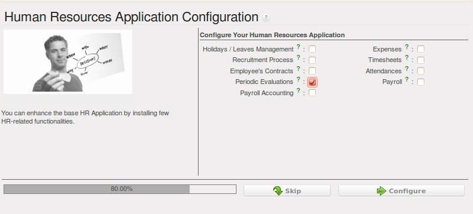
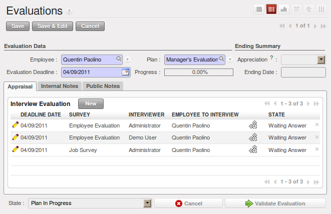
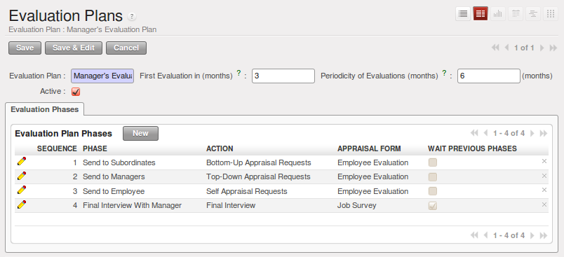

.. i18n: .. index::
.. i18n:    single: evaluation
.. i18n: ..
..

.. index::
   single: evaluation
..

.. i18n: Inspire your People through Assessments
.. i18n: =======================================
..

通过考评激励你的员工
=======================================

.. i18n: A motivated workforce of people can give the best outcome for an organization. OpenERP
.. i18n: can maintain this motivational process by periodical evaluation of employees' performance.
..

员工的工作积极性可以提高工作效率，带来更好的收益。OpenERP可以通过定期考评员工绩效来激励员工的工作积极性。

.. i18n: The regular assessment of human resources can benefit your people as well your organization.
.. i18n: For efficient periodical evaluation of employees' performance, you need to install the :mod:`hr_evaluation`
.. i18n: module. The configuration wizard to install this module is shown below:
..

定期的人力资源评价对员工和公司都有益。为了高效的定期评价员工绩效，你需要安装“人力资源-评价”模型。安装此模型的
配置向导如下图所示:

.. i18n: .. figure::  images/config_wiz_evaluation.png
.. i18n:    :scale: 75
.. i18n:    :align: center
.. i18n: 
.. i18n:    *Configuration wizard to install hr_evaluation module*
..

   *Configuration wizard to install hr_evaluation module*

.. i18n: To create and manage new evaluations, you can use the menu :menuselection:`Human Resources --> Evaluations --> Evaluations`.
..

你可以在 :menuselection:`人力资源 --> 评价 --> 评价` :menuselection:`Human Resources --> Evaluations --> Evaluations` 中建立和管理新的评价。

.. i18n: .. figure::  images/employee_evaluation.png
.. i18n:    :scale: 75
.. i18n:    :align: center
.. i18n: 
.. i18n:    *Employee Evaluation form*
..

   *Employee Evaluation form*

.. i18n: Each employee can be assigned an evaluation plan. These plans define the frequency and the
.. i18n: way you manage your periodic personal evaluation. You will be able to define steps and attach
.. i18n: interview forms to each step. OpenERP manages all kinds of evaluations: bottom-up, top-down,
.. i18n: self evaluation and final evaluation by the manager.
..

为每个员工设定一个评估计划。这些评估计划都设定好频率和方式。你可以设定好评价步骤并且在每一步骤上都附带评价表格。
OpenERP可以管理所有类型的评价: 自下而上,自上而下,自评和经理终评。

.. i18n: The main features of the evaluation process covered by OpenERP are as follows:
..

OpenERP涵盖以下主要评价功能:

.. i18n: * Ability to create employees evaluation.
.. i18n: * An evaluation can be created by an employee for subordinates, juniors as well
.. i18n:   as his manager.
.. i18n: * The evaluation is done under a plan in which various surveys can be created.
.. i18n:   Each survey can be answered by a particular level of employee hierarchy.
.. i18n:   The final review and evaluation is done by the manager.
.. i18n: * Every evaluation filled by employees can be viewed through a PDF form.
.. i18n: * Interview Requests are generated automatically by OpenERP according to employees
.. i18n:   evaluation plans. Each user receives automatic emails and requests to perform evaluation
.. i18n:   of their colleagues periodically.
..

* 建立员工评价表。
* 员工可以建立发送给下级的或者经理的评价表。
* 评价遵循评估计划，评估计划包含各种各样的问卷。每一特定级别的员工对应特定的问卷。最终由经理终评并确认评价完成。
* 每个员工填写的评价表都可以用pdf格式查看。
* OpenERP根据评价计划自动生成评价申请。每个员工定期收到邮件，要求对他们的同事进行评价。

.. i18n: You can analyse evaluation data through the menu :menuselection:`Human Resources --> Reporting --> Evaluations Analysis`.
..

你可以通过 :menuselection:`人力资源 --> 报告 --> 评估分析` :menuselection:`Human Resources --> Reporting --> Evaluations Analysis` 分析评估数据。

.. i18n: .. index::
.. i18n:    single: evaluation; define categories
..

.. index::
   single: evaluation; define categories

.. i18n: Define different evaluation categories
.. i18n: --------------------------------------
..

制定各种考核等级
--------------------------------------

.. i18n: You can create new evaluation plans from :menuselection:`Human Resources --> Configuration --> Periodic Evaluations --> Evaluation Plans`. Click :guilabel:`New` and fill in the following details:
..

在 :menuselection:`人力资源 --> 设置 --> 定义复核 --> 评估计划` :menuselection:`Human Resources --> Configuration --> Periodic Evaluations --> Evaluation Plans` 中建立新的评估计划。点击 :guilabel:`新建` 并且完成下列信息

.. i18n: * :guilabel:`Evaluation Plan` : A name for the evaluation plan.
.. i18n: * :guilabel:`First Evaluation in (months)` : This will be used to schedule the first evaluation date of the employee when selecting an evaluation plan.
.. i18n: * :guilabel:`Periodicity of Evaluations (months)` : This depicts the delay between each evaluation of this plan (after the first one).
..

* :guilabel:`评估计划` : 评估计划名称,
* :guilabel:`初次评估月份` : 设定好评估计划后的首次员工评估时间,
* :guilabel:`评估周期` : 上一次评估与下一次评估的间隔时间.

.. i18n: .. figure::  images/eval_evaluation_plans.png
.. i18n:    :scale: 75
.. i18n:    :align: center
.. i18n: 
.. i18n:    *Evaluation Plans form*
..

   *Evaluation Plans form*

.. i18n: You must also create :guilabel:`Evaluation Plan Phases`, to let your plan evolve from one stage to another and be able to take appropriate action at every stage, like sending an e-mail. You can configure the following settings in an evaluation plan phase:
..

你还必须建立 :guilabel:`评估计划阶段` ，让计划可以从一个阶段到下一个阶段，并且能很好的完成每个阶段的指令，例如发送电子邮件。你必须在
评估计划阶段安装下列设置:

.. i18n: * :guilabel:`Phase` : A name for the evaluation plan phase.
.. i18n: * :guilabel:`Wait Previous Phases` : Set to ``True`` if you want all preceding phases to finish before launching this phase.
.. i18n: * :guilabel:`Sequence` : The sequence number of this phase.
.. i18n: * :guilabel:`Action` : Select an action, either ``Top-Down Appraisal Requests``, ``Bottom-Up Appraisal Requests``, ``Self Appraisal Requests`` or ``Final Interview``.
.. i18n: * :guilabel:`Appraisal Form` : The survey to link to this phase.
..

* :guilabel:`阶段` : 评估计划阶段名称.
* :guilabel:`等待前面的阶段` : 你可以设定当前面的所有阶段完成后开始此阶段.
* :guilabel:`序列` : 此阶段的序列号.
* :guilabel:`操作` : 选择一个操作，可以是 ``自上而下的评估申请`` ， ``自下而上的评估申请`` ， ``自我评估申请`` 也可以是 ``最终评估`` .
* :guilabel:`评价表` : 链接到这个阶段的问卷.

.. i18n: If you use the GTK-client, it will be possible to open the form view of an evaluation plan phase. Here you will be able to customize more settings, like whether you would like to send an e-mail for this phase and the corresponding layout for it. You can also choose to send the results (answers) of this phase to the managers and employees.
..

如果你使用GTK-client,将可以打开评估计划阶段窗体视图.这里你可以自定义更多的设置,例如你是否想在这个阶段发送电子邮件。你也
可以选择发送这个阶段的结果给经理和员工。

.. i18n: .. index::
.. i18n:    single: evaluation; plan dates
..

.. index::
   single: evaluation; plan dates

.. i18n: Plan assessment dates
.. i18n: ---------------------
..

计划考评日期
---------------------

.. i18n: Once an evaluation plan is created, you can use it in an evaluation of an employee. Create a new evaluation from :menuselection:`Human Resources --> Evaluations --> Evaluations`. Select an :guilabel:`Employee` for whom this evaluation is being designed and select a :guilabel:`Plan` too. Here you must specify a deadline for the evaluation in the :guilabel:`Evaluation Deadline` field.
..

一旦一个评价计划被建立，你可以使用它评价 :guilabel:`员工` 。在 :menuselection:`人力资源 --> 评价 --> 评价` :menuselection:`Human Resources --> Evaluations --> Evaluations` 中建立一个新的评价。选择一个 :guilabel:`员工` 同时选择一个 :guilabel:`计划` 。在
 :guilabel:`评估截止时间` 选择一个评估截止时间。
 
.. i18n: Although, evaluation reminders are sent based on the :guilabel:`First Evaluation in (months)` and :guilabel:`Periodicity of Evaluations (months)` fields in :guilabel:`Evaluation Plans` form. You can use these to regulate assessment dates of evaluations that utilize a corresponding plan.
..

虽然，评价提醒是根据 :guilabel:`评价计划表` 中的 :guilabel:`第一个评价月` 和 :guilabel:`评价周期` 进行提醒的。你可以用这些规范评价日期。

.. i18n: .. index::
.. i18n:    single: evaluation; link to survey
..

.. index::
   single: evaluation; link to survey

.. i18n: Link survey and job evaluations
.. i18n: -------------------------------
..

连接调查和工作考评
-------------------------------

.. i18n: An evaluation plan is a sequence of phases, and each phase is linked to an appraisal form. This appraisal form is nothing but a survey, a tool for assessment through a questionnaire. Surveys are defined at :menuselection:`Tools --> Surveys --> Define Surveys --> Surveys`. When an evaluation is started, interview requests are automatically created based on evaluation plans. If you create additional interview requests, there too you have to link the interview to a :guilabel:`Survey`. You may link to a survey that is any state (even ``Draft``), but in order to start the interview, the linked survey must be in ``Open`` state.
..

一个评价计划是一系列的阶段，每一阶段对应一个评价表。这个评价表只不过是一个调查，一个通过问卷调查评估的工具。在
 :menuselection:`工具 --> 调查 --> 定义调查 --> 调查` :menuselection:`Tools --> Surveys --> Define Surveys --> Surveys` 中设定调查。一个评价开始后，采访要求在评价计划的基础上自动创建。如果你要建立额外的采访要求，你
必须将采访与 :guilabel:`调查` 相连接。这个调查可以处于任何状态（甚至是 ``草稿`` ），但是要启用采访时，调查必须处于 ``打开`` 状态。

.. i18n: .. Copyright © Open Object Press. All rights reserved.
..

.. Copyright © Open Object Press. All rights reserved.

.. i18n: .. You may take electronic copy of this publication and distribute it if you don't
.. i18n: .. change the content. You can also print a copy to be read by yourself only.
..

.. You may take electronic copy of this publication and distribute it if you don't
.. change the content. You can also print a copy to be read by yourself only.

.. i18n: .. We have contracts with different publishers in different countries to sell and
.. i18n: .. distribute paper or electronic based versions of this book (translated or not)
.. i18n: .. in bookstores. This helps to distribute and promote the OpenERP product. It
.. i18n: .. also helps us to create incentives to pay contributors and authors using author
.. i18n: .. rights of these sales.
..

.. We have contracts with different publishers in different countries to sell and
.. distribute paper or electronic based versions of this book (translated or not)
.. in bookstores. This helps to distribute and promote the OpenERP product. It
.. also helps us to create incentives to pay contributors and authors using author
.. rights of these sales.

.. i18n: .. Due to this, grants to translate, modify or sell this book are strictly
.. i18n: .. forbidden, unless Tiny SPRL (representing Open Object Press) gives you a
.. i18n: .. written authorisation for this.
..

.. Due to this, grants to translate, modify or sell this book are strictly
.. forbidden, unless Tiny SPRL (representing Open Object Press) gives you a
.. written authorisation for this.

.. i18n: .. Many of the designations used by manufacturers and suppliers to distinguish their
.. i18n: .. products are claimed as trademarks. Where those designations appear in this book,
.. i18n: .. and Open Object Press was aware of a trademark claim, the designations have been
.. i18n: .. printed in initial capitals.
..

.. Many of the designations used by manufacturers and suppliers to distinguish their
.. products are claimed as trademarks. Where those designations appear in this book,
.. and Open Object Press was aware of a trademark claim, the designations have been
.. printed in initial capitals.

.. i18n: .. While every precaution has been taken in the preparation of this book, the publisher
.. i18n: .. and the authors assume no responsibility for errors or omissions, or for damages
.. i18n: .. resulting from the use of the information contained herein.
..

.. While every precaution has been taken in the preparation of this book, the publisher
.. and the authors assume no responsibility for errors or omissions, or for damages
.. resulting from the use of the information contained herein.

.. i18n: .. Published by Open Object Press, Grand Rosière, Belgium
..

.. Published by Open Object Press, Grand Rosière, Belgium
