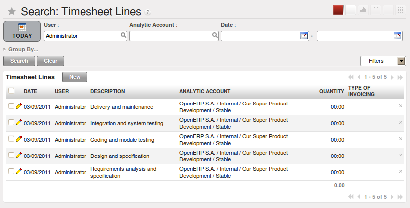
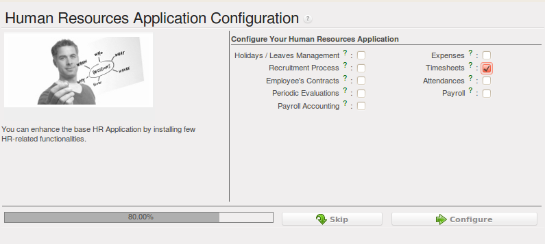
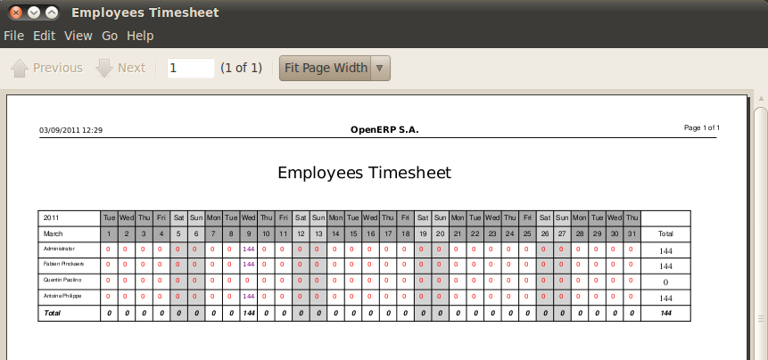
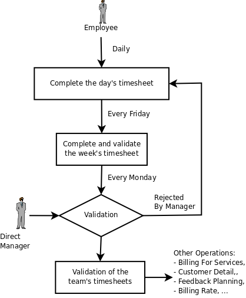
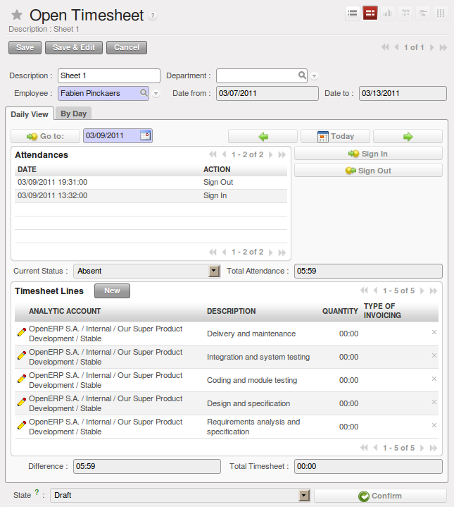

.. i18n: .. index::
.. i18n:    single: attendance
.. i18n:    single: timesheet
.. i18n: ..
..

.. index::
   single: attendance
   single: timesheet
..

.. i18n: Attendances and Timesheet Management
.. i18n: ====================================
..

考勤和计工单管理
====================================

.. i18n: In most service companies where OpenERP has been integrated, service sheets, or timesheets, have
.. i18n: revolutionized management practices. These service sheets are produced by each employee as they work
.. i18n: on the different cases or projects that are running. Each of these is represented by an analytic
.. i18n: account in the system.
..

在大多数使用OpenERP的服务公司中，服务表或者工时表改变了管理的一贯做法。这些服务表是由每个员工为正在运行的不同的项目建立
的。这些是通过系统中的一个分析账户来反映的。

.. i18n: Throughout the day, when employees work on one project or another, they add a line to the timesheets
.. i18n: with details of the time used on each project. At the end of the day, each employee must mark all
.. i18n: the time worked on client or internal projects to make up the full number of hours worked in the
.. i18n: day. If an account is not in the system, then the time is added to the hours that have not been
.. i18n: assigned for the day.
..

一天中，员工需要将他们花在每个项目上的时间明细都添加在工时表中。一天结束后，员工必须记录他们当天所有的工作时间从而构成
一天的工作时间。如果（项目）账户不在系统中，那么工作时间不被计入任何指定的一天，而是另外记为小时。

.. i18n: .. _fig-servtimlis:
.. i18n: 
.. i18n: .. figure::  images/service_timesheet_list.png
.. i18n:    :scale: 65
.. i18n:    :align: center
.. i18n: 
.. i18n:    *Timesheet for a working day*
..

.. _fig-servtimlis:

   *Timesheet for a working day*

.. i18n: The figure :ref:`fig-servtimlis` gives an example of a timesheet for an employee.
..

此工时表 :ref:`fig-servtimlis` 为一个员工工时表的例子。

.. i18n: .. index::
.. i18n:    pair: cost; allocation
..

.. index::
   pair: cost; allocation

.. i18n: .. note:: Do not confuse timesheets and attendance compliance
.. i18n: 
.. i18n: 	The timesheet system is not intended to be a disguised attendance form. There is no control over the
.. i18n: 	service times and the employee is free to encode 8 or 9 hours or more of services each day if they
.. i18n: 	want.
.. i18n: 
.. i18n: 	If you decide to put such a system into place, it is important to clarify this point with your
.. i18n: 	staff. The objective here is not to control hours, because the employees decide for themselves what
.. i18n: 	they will be entering – but to track the tasks running and the allocation of costs between them is the
.. i18n: 	responsibility of the management.
..

.. note:: 不要混淆工时表与考勤情况

	工时表并不是一个考勤表。工时表无法控制超出的服务时间，如果员工愿意他们可以每天工作八小时，九小时甚至
	更长时间。

	如果你决定实行这个系统，那么一定要跟员工讲清楚这一点（工时表并不是考勤表），我们的目的不是控制时间，
	因为时间是由员工自己输入的，但是任务运行和成本分配是由管理层负责的。

.. i18n: To enable your system with all the features related to `Timesheet`, your configuration wizard should be like this.
..

确保系统中的所有功能与 `工时表` 相关联，配置向导如下所示:

.. i18n: .. figure::  images/config_wiz_timesheets.png
.. i18n:    :scale: 75
.. i18n:    :align: center
.. i18n: 
.. i18n:    *Configuration wizard for Timesheet*
..

   *Configuration wizard for Timesheet*

.. i18n: Amongst the many uses of such a timesheet system for a company, here are some of the most important:
..

工时表系统的功能有很多，这里列举一些重要的功能:

.. i18n: * enabling tracking of the true costs of a project by accounting for the time used on it,
.. i18n: 
.. i18n: * tracking the services provided by different employees,
.. i18n: 
.. i18n: * comparing the hours really used on a project with the initial planning estimates,
.. i18n: 
.. i18n: * automatically invoicing based on the service hours provided,
.. i18n: 
.. i18n: * obtaining a list of the service hours for a given client,
.. i18n: 
.. i18n: * knowing the costs needed to run the company, such as the marketing costs, the training costs for a
.. i18n:   new employee, and the invoicing rates for a client.
..

* 通过计算花在项目上的时间来跟踪项目的真实成本,

* 追踪不同员工提供的服务,

* 将项目真实的耗时时间与最初计划的时间进行比较,

* 在服务时间的基础上自动提供进销存率

* 获得指定客户端的服务时间明细

* 获知运行公司所需的成本，例如市场成本，新员工培训成本以及客户进销存率.

.. i18n: **Timesheet Categories**
..

**工时表分类**

.. i18n: You will need to install the :guilabel:`Manufacturing` application (:mod:`mrp`) in order to access timesheet categories.
.. i18n: The different timesheet categories (working time sessions) can be defined through the menu
.. i18n: :menuselection:`Manufacturing --> Configuration --> Resources --> Working Period` and selecting
.. i18n: one of the groups there such as :guilabel:`38 Hours/Week`.
..

你需要安装 :guilabel:`制造应用（制造资源计划）` :mod:`mrp` 从而访问工时分类。在 :menuselection:`制造 --> 设置 --> 资源 --> 工作期间` :menuselection:`Manufacturing --> Configuration --> Resources --> Working Period` 中设定不同的工时表分类（工作会议时间）
并且可以选择一组（例如： :guilabel:`每周38小时` ）。

.. i18n: .. figure::  images/service_timesheet_def.png
.. i18n:    :scale: 75
.. i18n:    :align: center
.. i18n: 
.. i18n:    *Timesheet category for full time 38 hours per week*
..

.. figure::  images/service_timesheet_def.png
   :scale: 75
   :align: center

   *Timesheet category for full time 38 hours per week*

.. i18n: .. index::
.. i18n:    single: timesheet; entering data
.. i18n: ..
..

.. index::
   single: timesheet; entering data
..

.. i18n: **Entering Timesheet Data**
..

**输入工时表数据**

.. i18n: .. index::
.. i18n:    single: module; hr_timesheet
..

.. index::
   single: module; hr_timesheet

.. i18n: To be able to use timesheets fully, install the module :mod:`hr_timesheet_sheet` through the :guilabel:`Reconfigure` wizard by selecting :guilabel:`Timesheets` and clicking :guilabel:`Configure`. Once this module
.. i18n: has been installed and the employees configured, the different system users can enter their
.. i18n: timesheet data in the menu
.. i18n: :menuselection:`Human Resources --> Time Tracking --> Working Hours`,
.. i18n: then click :guilabel:`New`.
..

为了充分使用工时表，可以通过在 :guilabel:`重新配置向导` 中选择 :guilabel:`工时表` 同时点击 :guilabel:`设置` 来安装 `人力资源工时表` :mod:`hr_timesheet_sheet` 模块。一旦此模块被安装并且
设置好员工，那么不同系统的用户可以在 :menuselection:`人力资源 --> 时间跟踪 --> 工作小时` :menuselection:`Human Resources --> Time Tracking --> Working Hours` 中输入他们的工时表数据，然后点击 :guilabel:`新建` 。

.. i18n: .. tip:: Shortcut to Timesheets
.. i18n: 
.. i18n: 	It is a good idea if all employees who use timesheets place this menu in their shortcuts.
.. i18n: 	That is because they will need to return to them several times each day.
..

.. tip:: 工时表快捷方式

	使用工时表的所有员工可以将这个菜单放在他们的快捷方式中。因为他们每天要使用很多次。

.. i18n: For a new entry:
..

一个新的条目:

.. i18n: 	#.	The :guilabel:`User` : proposed by default, but you can change it if you are encoding the first timesheet
.. i18n: 		for another company employee.
.. i18n: 
.. i18n: 	#.	The :guilabel:`Date` : automatically proposed as today's date, but it is possible to change it if you are
.. i18n: 		encoding the timesheet for a prior day.
.. i18n: 
.. i18n: 	#.	:guilabel:`Analytic Account` : for the project you have been working on - obviously it should be predefined.
.. i18n: 
.. i18n: 	#. 	:guilabel:`Description` : a free text description of the work done in the time.
.. i18n: 
.. i18n: 	#. 	:guilabel:`Quantity` : number of units of time (the units are defined as part of the product).
..

	#.	The :guilabel:`用户` : 本身是默认的，但是如果你编码的是公司其他员工的第一个工时表的话，你可以更改。

	#.	The :guilabel:`日期` : 自动默认为当天日期，但是如果你要编码前一天的工时表，你也可以更改。

	#.	:guilabel:`帐户分析` : 运行中的项目，需要提前设定。

	#. 	:guilabel:`描述` : 一个空白的文本文档用来描述工作时间。

	#. 	:guilabel:`数量` : 时间单位数量（单位作为产品的一部分）。

.. i18n: The other fields are automatically completed, but can be modified: the :guilabel:`Product`
.. i18n: which is the service product such as consultancy, the
.. i18n: :guilabel:`Unit of Measure` (predefined, and could perhaps be minutes, hours or days),
.. i18n: the :guilabel:`Cost` of the service (which is calculated by default),
.. i18n: and the associated :guilabel:`General Account`.
..

其他字段将自动完成，但是可以修改： :guilabel:`服务产品` 例如咨询，:guilabel:`计量单位` （预定义的，也可能是分钟，小时或者天）， :guilabel:`服务成本`
（默认计算地）以及相关的 :guilabel:`普通账户`。

.. i18n: The hours are then encoded throughout the day by each employee. It helps to revisit the list at the
.. i18n: end of the day to verify that the number of hours of attendance in the company has been properly
.. i18n: accounted for. The total entered is shown at the bottom right of the list of service hours.
..

每位员工可以编码一天的工作时间。它有助于在一天结束时再访明细从而确认工作时间的正确性。总输入的时间显示在服务小时明细的
右下角。

.. i18n: .. tip:: Hiding Service Costs
.. i18n: 
.. i18n: 	By default, OpenERP is configured to show the cost of each service when an employee encodes the
.. i18n: 	number of hours per project.
.. i18n: 	You can modify this field by adding the attribute ``invisible=True`` in the timesheet view.
.. i18n: 
.. i18n: 	(And the way to do that is either to modify the view on the file system, or
.. i18n: 	to use the web client to modify the view in the current database.
.. i18n: 	For the latter, there is a pale grey :guilabel:`[Customize]` label
.. i18n: 	to the bottom left of each form that gives you access to the
.. i18n: 	:guilabel:`Manage Views` option.
.. i18n: 	If you have sufficient permissions, you can edit the XML that defines the current view.)
.. i18n: 
.. i18n: 	The value in the cost field shows employees the cost of their time used in the company, so masking this
.. i18n: 	field might not always be the best option.
..

.. tip:: 隐藏的服务成本

	默认地，当员工编码每个项目的小时总数时，OpenERP会显示每个服务的成本。你可以通过在时间表视图中添加
	``invisible=True`` 来修改此字段。

	其方法是要么修改文件系统上视图，要么使用网络客户端当前数据库中的修改视图。对于后者，在每个你可以访
	问 :guilabel:`管理视图` 的表格的左下方有一个淡灰色 :guilabel:`【自定义】` 标识。如果你有足够的权限，你可以编辑设定当前视图的文
	档。

	成本中的价值显示的是员工为公司花费的时间成本，因此不应当总是隐藏此项。

.. i18n: The accuracy of the services entered is crucial for calculating the profitability of the different
.. i18n: jobs and the recharging of services. Different reports are therefore available for verifying
.. i18n: employees' data entry. Employees can verify their own timesheet using the following reports:
..

服务输入的准确性对于计算不同工作的收益率和服务补给至关重要。不同的报告对于核对员工输入数据的准确性都很有用。员工可以使用
以下报告核对他们工时表:

.. i18n: * Printing the particular employee's timesheet, using the menu :menuselection:`Human Resources --> Reporting
.. i18n:   --> Timesheet --> Employee Timesheet`.
.. i18n: 
.. i18n: * Printing more than one employees' timesheet, using the menu :menuselection:`Human Resources --> Reporting
.. i18n:   --> Timesheet --> Employees Timesheet`.You can print a summary in the form of a table per user and per day.
..

* 通过 :menuselection:`人力资源 --> 报告 --> 工时表 --> 员工工时表` :menuselection:`Human Resources --> Reporting --> Timesheet --> Employee Timesheet` 打印指定员工工时表。 

* 通过 :menuselection:`人力资源 --> 报告 --> 工时表 --> 员工工时表` :menuselection:`Human Resources --> Reporting --> Timesheet --> Employees Timesheet` 打印多个员工的工时表。你可以在每个用户每一天的表格中打印总表。

.. i18n: .. figure::  images/service_timesheet_all.png
.. i18n:    :scale: 65
.. i18n:    :align: center
.. i18n: 
.. i18n:    *Employees' monthly summary timesheet*
..

   *Employees' monthly summary timesheet*

.. i18n: * Reviewing profit of timesheet, using the menu :menuselection:`Human Resources --> Reporting --> Timesheets
.. i18n:   --> Timesheet Profit`.
.. i18n: 
.. i18n: * You can then use the statistical reports to analyze your services by period, by product
.. i18n:   or by account using the menu :menuselection:`Human Resources --> Reporting --> Timesheets
.. i18n:   --> Timesheet Analysis` and :menuselection:`Human Resources --> Reporting --> Timesheets
.. i18n:   --> Timesheet Sheet Analysis`.
..

* 通过 :menuselection:`人力资源 --> 报告 --> 工时表 --> 工时表利润` :menuselection:`Human Resources --> Reporting --> Timesheets --> Timesheet Profit` 审查工时表利润。

* 你可以通过在 :menuselection:`人力资源 --> 报告 --> 工时表 --> 工时表分析` :menuselection:`Human Resources --> Reporting --> Timesheets --> Timesheet Analysis` 与 :menuselection:`人力资源 --> 报告 --> 工时表 --> 工时表分析` :menuselection:`Human Resources --> Reporting --> Timesheets --> Timesheet Sheet Analysis` 中使用统计报告分析你的每
  时期的，每产品的，每账户的服务。

.. i18n: .. figure::  images/service_timesheet_graph.png
.. i18n:    :scale: 75
.. i18n:    :align: center
.. i18n: 
.. i18n:    *Chart of timesheet by account*
..

.. figure::  images/service_timesheet_graph.png
   :scale: 75
   :align: center

   *Chart of timesheet by account*

.. i18n: The data making up these list views can be varied using the filters available in the upper part of the
.. i18n: screen. If you want to see more detail, switch to the graph view.
..

使用屏幕上方的过滤器可以使组成这个例表视图的数据不同。如果你想了解更多的细节，可以切换至图形视图。

.. i18n: .. index::
.. i18n:    single: timesheet; evaluation
.. i18n: ..
..

.. index::
   single: timesheet; evaluation
..

.. i18n: **Evaluation of Service Costs**
..

**计算服务成本**

.. i18n: You already know that timesheets are closely linked with analytic accounts. The different projects
.. i18n: reported on the timesheets correspond to analytic accounts. The timesheet entries themselves are
.. i18n: analytic entries.
..

我们知道，工时表与成本科目（分析账户）密切相连。工时表中的各个项目与成本科目（分析账户）相一致。工时记录本身也是分析
（成本）记录。

.. i18n: These entries comprise various analytic operations that do not correspond to any of
.. i18n: the general accounts. Therefore all operations that modify and create timesheet lines automatically
.. i18n: impact the corresponding analytic line and, conversely are automatically modified by changes in that
.. i18n: line.
..

这些记录包括各种不同于一般账户的分析操作。因此修改和创建工时表线的所有操作将自动影响相应的分析线，反过来，分析线上的
更改也将自动影响工时表线。

.. i18n: .. note:: Timesheets and Analytical Data
.. i18n: 
.. i18n: 	The implementation of timesheets in OpenERP relating to analytic entries is managed by an
.. i18n: 	inheritance mechanism:
.. i18n: 	the timesheet object inherits the analytic entry object.
.. i18n: 
.. i18n: 	The information is therefore not encoded into the database as two separate events, which avoids
.. i18n: 	many synchronization problems.
.. i18n: 	They are stored in two different tables, however, because a service is an analytical entry, but an
.. i18n: 	analytical entry is not necessarily a service.
..

.. note:: 工时表和分析数据

	OpenERP中，有关于分析记录的工时表实施是由一个继承机制管理的:
	工时表对象继承分析记录对象。

	这样相同的信息不需要输入两次，避免了不一致的错误。
	不过他们被存储在两个不同的表里，因为计工单一定是个成本凭证行，但成本凭证行不一定是计工单。

.. i18n: This is not a classical approach, but it is logical and pragmatic. Employee timesheets are a good
.. i18n: indication of how the costs of a service enterprise are spread across different cases, as reported in
.. i18n: the analytic accounts.
..

这不是传统的实现方式，但符合逻辑并且实用。员工的计工单是服务型企业在成本会计管理过程中分析服务成本在各个项目中分布的
重要指标。

.. i18n: .. index::
.. i18n:    single: benefits
..

.. index::
   single: benefits

.. i18n: An analytic account should be reflected in the general accounts, but there is no direct counterpart
.. i18n: of these analytic accounts in the general accounts. Instead, if the hourly costs of the employees
.. i18n: are correctly accounted for, the month's timesheet entries should be balanced by the salary +
.. i18n: benefits package paid out to all the employees at the end of the month.
..

成本科目应该在会计科目上反映，但成本科目与会计科目并非一一对应。取而代之的是，如果员工的每小时成本有了很好的预算，全月
的计工单条目余额应与月底支付给员工的工资加提成相匹配。

.. i18n: Despite all this, it is quite difficult to work out the average hourly cost of an employee precisely,
.. i18n: because it depends on:
..

尽管如此，要精确计算出一个员工每小时的平均成本是很难的，因为它依赖于:

.. i18n: * the extra hours that they have worked,
.. i18n: 
.. i18n: * holidays and sickness,
.. i18n: 
.. i18n: * salary variations and all the linked costs, such as social insurance charges.
..

* 额外的工作时间,

* 假期或病休,

* 工资变量及其他相关成本，如社保基数.

.. i18n: The reports that enable you to relate general accounts to analytic accounts are valuable tools for
.. i18n: improving your evaluation of different hourly costs of employees. The difference between product
.. i18n: balances in the analytic account and in the general accounts, divided by the total number of hours
.. i18n: worked, can then be applied to the cost of the product. Some companies adjust for that difference by
.. i18n: carrying out another analytic operation at the end of the month in an account created for that
.. i18n: purpose. This analytic account should have a balance that tends towards zero.
..

一系列的报表可以用于比对会计科目和成本科目的发生额，并且有利于你评估不同员工的工时成本。在成本科目上的产品余额与会计
科目上的产品余额的差异可以计入产品的成本。有些公司在月底用一个特殊的会计科目和另一个成本科目来处理这些差异。这个成本
科目的余额应该趋向于零。

.. i18n: Because you have got a system with integrated timesheets, you can then:
..

因为你拥有了一个完整的计工单系统，所以你可以:

.. i18n: * track the profitability of projects in the analytic accounts,
.. i18n: 
.. i18n: * look at the history of timesheet entries by project and by employee,
.. i18n: 
.. i18n: * regularly adjust hourly costs by comparing your rates with reality,
..

* 追踪成本科目中项目的盈利,

* 按项目或员工查找计工单的历史记录,

* 定期通过与实际成本的比较来调整每小时成本,

.. i18n: .. important:: Project Cost Control
.. i18n: 
.. i18n: 	Controlling the costs and the profitability of projects precisely is very important.
.. i18n: 
.. i18n: 	It enables you to make good estimates and to track budgets allocated to different services and
.. i18n: 	their projects, such as sales and, R&D costs.
.. i18n: 	You can also refine your arguments on the basis of clear facts rather than guesses if you have
.. i18n: 	to renegotiate a contract with a customer following a project slippage.
..

.. important:: 项目成本控制

	严格控制项目的成本和利润是非常重要的。

	有利于很好地估算以及为不同的服务产品和项目分配预算，如销售、研发。你还能通过清晰的证据来论证你的
	理由而不是通过猜测来决定是不是应该在项目后期重新与客户讨论修正合同。

.. i18n: The analyses of profitability by project and by employee are available from the analytic accounts.
.. i18n: They take all of the invoices into account, and also take into account the cost of the time spent on
.. i18n: each project.
..

在成本会计模块中按项目或员工来分析盈利能力。分析的依据是所有的发票以及每个项目上花费的时间。

.. i18n: .. index::
.. i18n:    single: attendance; sign in / sign out
..

.. index::
   single: attendance; sign in / sign out

.. i18n: Manage attendance through Sign in / Sign out
.. i18n: --------------------------------------------
..

工作“上班”/“下班”管理考勤
--------------------------------------------

.. i18n: In some companies, staff have to sign in when they arrive at work and sign out again at the end of
.. i18n: the day. If each employee has been linked to a system user, then they can sign in on OpenERP by
.. i18n: using the menu :menuselection:`Human Resources --> Attendances --> Sign in / Sign out`.
..

在一些公司中，员工必须上班时签入，下班时签出。如果员工是系统用户，他们可以在ERP中使用 :menuselection:`人力资源 --> 考勤 --> 签入/签出` :menuselection:`Human Resources --> Attendances --> Sign in / Sign out` 进行签字
（签入/签出）。

.. i18n: If an employee has forgotten to sign out on leaving, the system proposes that they sign out manually
.. i18n: and type in the time that they left when they come in again the next day. This gives you a simple way
.. i18n: of managing forgotten sign-outs.
..

如果一个员工下班时忘记签出，系统将在第二天他们准备下班签出时，建议他们手工签出。这是一个管理忘记签出的简单方法。

.. i18n: Find employee attendance details from their forms in
.. i18n: :menuselection:`Human Resources --> Employees`.
..

在 :menuselection:`人力资源 --> 员工` :menuselection:`Human Resources --> Employees` 中的员工表格中找到员工考勤详情。

.. i18n: To get the detail of attendance from an employee's form in OpenERP, you can use the
.. i18n: available reports:
..

你可以使用下列有效记录，在ERP的员工表格中看到员工考勤详情:

.. i18n: *  :guilabel:`Attendances By Month`
.. i18n: 
.. i18n: *  :guilabel:`Attendances By Week`
.. i18n: 
.. i18n: *  :guilabel:`Attendance Error Report`
..

*  :guilabel:`每月考勤`

*  :guilabel:`每周考勤`

*  :guilabel:`考勤错误记录`

.. i18n: The last report highlights errors in attendance data entry.
.. i18n: It shows you whether an employee has entered the time of
.. i18n: entry or exit manually and the differences between the actual and expected sign out time and the time.
..

最后一份报告显示在考勤数据中输入的错误。显示员工是否手工输入进入或者离开时间以及事实和期望签出签入时间的区别。
第二份报告显示选定月份的考勤数据。

.. i18n: .. index::
.. i18n:    single: attendance; differences
..

.. index::
   single: attendance; differences

.. i18n: Keep track of differences between timesheets and attendance
.. i18n: -----------------------------------------------------------
..

跟踪计工单和考勤的差异
-----------------------------------------------------------

.. i18n: When they are used properly, timesheets can be a good control tool for project managers and can
.. i18n: provide awareness of costs and times.
..

当工时表能够被正确使用时，它对于项目经理将是一个很好的控制工具，可以为其提供成本和次数意识。

.. i18n: When employee teams are important, a control system must be implemented. All employees should
.. i18n: complete their timesheets correctly because this forms the basis of planning control, and the
.. i18n: financial management and invoicing of projects
..

员工团队很重要，因此必须执行一个控制体系。所有的员工都应该正确的完成他们的工时表，因为这是项目计划控制，财务管理以及
开发票的基础。

.. i18n: You will see in :ref:`ch-services` that you can automatically invoice services at the end of
.. i18n: the month based on the timesheet. But at the same time, some contracts are limited to prepaid hours.
.. i18n: These hours and their deduction from the original limit are also managed by these timesheets.
..

在 `实现服务质量` :ref:`ch-services` 中，月底你可以根据工时表自动开票。但同时，一些合同的预付时间是有限的。这些时间以及它们的扣减（从原始限制中的扣减）也是由这些工时表管理的。

.. i18n: .. index::
.. i18n:    single: module; hr_timesheet_sheet
..

.. index::
   single: module; hr_timesheet_sheet

.. i18n: In such a situation, hours that are not coded into the timesheets represent lost money for the
.. i18n: company. So it is important to establish effective follow-up of the services timesheets and their
.. i18n: encoding. To set up a structure for control using timesheets you should install the module
.. i18n: :mod:`hr_timesheet_sheet` (:guilabel:`Timesheets` in the :guilabel:`Reconfigure` wizard).
..

这种情况下，没有编码到工时表中的时间反映了公司的亏损。所以建立后续的服务工时表及其编码是很重要的。你需要安装
`人力资源-工时表-表` 模块 :mod:`hr_timesheet_sheet` 从而建立一个使用工时表的控制体系（ :guilabel:`配置向导` 中的 :guilabel:`工时表` ）。

.. i18n: .. figure::  images/timesheet_flow.png
.. i18n:    :scale: 75
.. i18n:    :align: center
.. i18n: 
.. i18n:    *Process of approving a timesheet*
..

   *Process of approving a timesheet*

.. i18n: This module supplies a new screen enabling you to manage timesheets by period. Timesheet entries are
.. i18n: made by employees each day. At the end of the week, employees validate their week's sheet and it is
.. i18n: then passed to the services manager, who must approve his team's entries. Periods are defined in the
.. i18n: company forms, and you can set them to run monthly or weekly.
..

这个模型提供了一个新的过滤器使你能够通过周期管理工时表。工时表的记录由员工每天完成的。一个星期结束后，员工核实一周的
工时表然后发给服务经理批准。周期由公司设定，可以是一个月也可以是一个星期。

.. i18n: To enter timesheet data each employee uses the menu :menuselection:`Human Resources --> Time Tracking
.. i18n: --> My Timesheet`.
..

员工通过 :menuselection:`人力资源 --> 时间追踪 --> 我的工时表` :menuselection:`Human Resources --> Time Tracking --> My Timesheet` 输入工时表数据。

.. i18n: .. figure::  images/service_timesheet_sheet_form.png
.. i18n:    :scale: 75
.. i18n:    :align: center
.. i18n: 
.. i18n:    *Form for entering timesheet data*
..

   *Form for entering timesheet data*

.. i18n: In the upper part of the screen, the user starts with the sign-in and sign-out times. The system
.. i18n: enables the control of attendance day by day. The two buttons :guilabel:`Sign In` and :guilabel:`Sign Out` enable the
.. i18n: automatic completion of hours in the area to the left. These hours can be modified by employee, so
.. i18n: it is not a true management control system.
..

在屏幕的上面部分，用户可以进行签入和签出。系统掌控着每一天的考勤。屏幕左边的 :guilabel:`签入` 和 :guilabel:`签出` 按钮能够使时间自动完成。这些
时间可以由员工修改，所以它不是一个真实的管理控制系统。

.. i18n: The area to the bottom of the screen represents a sheet of the employee's time entries for the
.. i18n: selected day. In total, this should comprise the number of hours worked in the company each day.
.. i18n: This provides a simple verification that the whole day's attendance time has been entered properly.
..

屏幕底部是选定日期的员工时间记录表。总体来说，这个包含了在公司工作的时间数。为一整天的考勤时间提供了一个简单的核查。

.. i18n: The second tab of the timesheet, :guilabel:`By Day`, gives the number of hours worked on the different
.. i18n: projects. When there is a gap between the attendance and the timesheet entries, you can use the
.. i18n: second tab to detect the days or the entries that have not been correctly entered.
..

工时表的第二栏 :guilabel:`天数` 给出了在不同项目上工作的时间数。如果考勤表和时间表记录有差距，你可以用第二栏检测（天数）或者
（输入错误的记录）。

.. i18n: .. figure::  images/timesheet_sheet_hours.png
.. i18n:    :scale: 75
.. i18n:    :align: center
.. i18n: 
.. i18n:    *Detail of hours worked by day for an employee*
..

.. figure::  images/timesheet_sheet_hours.png
   :scale: 75
   :align: center

   *Detail of hours worked by day for an employee*

.. i18n: The action :guilabel:`Timesheet by Account` shows the time worked on all the different projects. That enables you
.. i18n: to step back to see an overview of the time an employee has worked spread over different projects.
..

:guilabel:`工时表` 账户显示了所有项目的工作时间。这样你可以看到员工在不同项目的工作时间。

.. i18n: At the end of the week or the month, the employee confirms his timesheet. If the attendance time in
.. i18n: the company corresponds to the encoded entries, the whole timesheet is then confirmed and sent to
.. i18n: his department manager, who is then responsible for approving it or asking for corrections.
..

一周或者一个月结束时，员工确认其工时表。如果公司的考勤时间与工时表相一致，那么就将工时表确认好发送给部门经理，由部门
经理核查批准。

.. i18n: Each manager can then look at a list of his department's timesheets waiting for approval using the
.. i18n: menu :menuselection:`Human Resource --> Reporting  --> Timesheet --> Timesheet Sheet Analysis` by applying the proper filters. He then has to approve them or return them to their initial state.
..

每一位经理都可以在 :menuselection:`人力资源 --> 报告 --> 工时表 --> 工时表表分析` :menuselection:`Human Resource --> Reporting  --> Timesheet --> Timesheet Sheet Analysis` 中看到其部门等待审批的工时表。经理可以批准“等待审批的工时表”
也可以将其退回。

.. i18n: To define the departmental structure, use the menu :menuselection:`Human Resources --> Configuration -->
.. i18n: Human Resources --> Departments`.
..

通过 :menuselection:`人力资源 --> 配置 --> 人力资源 --> 部门` :menuselection:`Human Resources --> Configuration --> Human Resources --> Departments` 设定部门结构。

.. i18n: .. tip:: Timesheet Approval
.. i18n: 
.. i18n: 	At first sight, the approval of timesheets by a department manager can seem a bureaucratic
.. i18n: 	hindrance.
.. i18n: 	This operation is crucial for effective management, however.
.. i18n: 	We have too frequently seen companies in the situation where managers are so overworked that they
.. i18n: 	do not know what their employees are doing.
.. i18n: 
.. i18n: 	So this approval process supplies the manager with an outline of each employee's work at least once
.. i18n: 	a week.
.. i18n: 	And this is carried out for the hours worked on all the different projects.
..

.. tip:: 工时表审批

	工时表的审批对于部门经理来说是一个很烦琐的事情。然而，这一步骤对于有效管理是至关重要的。在公司，
	我们经常会发现这种情况：经理超负荷的工作，但是他们却不知道自己的员工在做什么。

	因此至少每周一次由经理审批每一个员工的工时表（即工作大纲）。每个不同的项目所花费的时间都有所记录，
	都要审批。

.. i18n: Once the timesheets have been approved, you can then use them for cost control and for invoicing
.. i18n: hours to clients.
..

一旦工时表被通过，你可以利用工时表控制成本以及管理开发票给客户的时间。

.. i18n: Contracts and their rates, planning, and methods of invoicing are the object of the following
.. i18n: chapter, :ref:`ch-services`.
..

合同及其费用，计划和进销存方法将在下个章节讲述， ``提高服务质量`` :ref:`ch-services` 。

.. i18n: .. Copyright © Open Object Press. All rights reserved.
..

.. Copyright © Open Object Press. All rights reserved.

.. i18n: .. You may take electronic copy of this publication and distribute it if you do not
.. i18n: .. change the content. You can also print a copy to be read by yourself only.
..

.. You may take electronic copy of this publication and distribute it if you do not
.. change the content. You can also print a copy to be read by yourself only.

.. i18n: .. We have contracts with different publishers in different countries to sell and
.. i18n: .. distribute paper or electronic based versions of this book (translated or not)
.. i18n: .. in bookstores. This helps to distribute and promote the OpenERP product. It
.. i18n: .. also helps us to create incentives to pay contributors and authors using author
.. i18n: .. rights of these sales.
..

.. We have contracts with different publishers in different countries to sell and
.. distribute paper or electronic based versions of this book (translated or not)
.. in bookstores. This helps to distribute and promote the OpenERP product. It
.. also helps us to create incentives to pay contributors and authors using author
.. rights of these sales.

.. i18n: .. Due to this, grants to translate, modify or sell this book are strictly
.. i18n: .. forbidden, unless Tiny SPRL (representing Open Object Press) gives you a
.. i18n: .. written authorisation for this.
..

.. Due to this, grants to translate, modify or sell this book are strictly
.. forbidden, unless Tiny SPRL (representing Open Object Press) gives you a
.. written authorisation for this.

.. i18n: .. Many of the designations used by manufacturers and suppliers to distinguish their
.. i18n: .. products are claimed as trademarks. Where those designations appear in this book,
.. i18n: .. and Open Object Press was aware of a trademark claim, the designations have been
.. i18n: .. printed in initial capitals.
..

.. Many of the designations used by manufacturers and suppliers to distinguish their
.. products are claimed as trademarks. Where those designations appear in this book,
.. and Open Object Press was aware of a trademark claim, the designations have been
.. printed in initial capitals.

.. i18n: .. While every precaution has been taken in the preparation of this book, the publisher
.. i18n: .. and the authors assume no responsibility for errors or omissions, or for damages
.. i18n: .. resulting from the use of the information contained herein.
..

.. While every precaution has been taken in the preparation of this book, the publisher
.. and the authors assume no responsibility for errors or omissions, or for damages
.. resulting from the use of the information contained herein.

.. i18n: .. Published by Open Object Press, Grand Rosière, Belgium
..

.. Published by Open Object Press, Grand Rosière, Belgium
