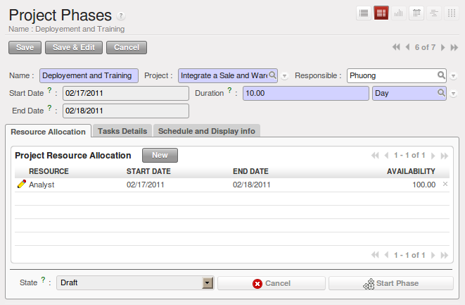
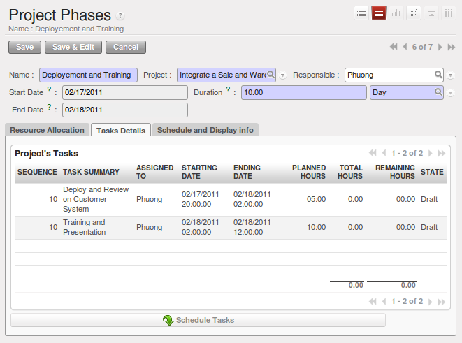
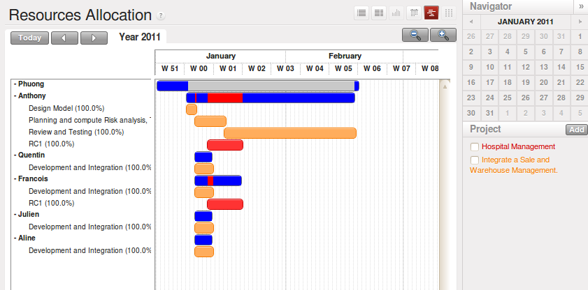

.. i18n: .. index::
.. i18n:    single: Long Term
.. i18n: ..
..

.. index::
   single: Long Term
..

.. i18n: Long Term Project Planning
.. i18n: ==========================
..

长期项目规划
============

.. i18n: You can plan your projects with Long Term Planning. To do this, use the :guilabel:`Reconfigure` wizard and in the
.. i18n: :guilabel:`Project Application Configuration` section, select \ ``Long Term Planning`` \ and click :guilabel:`Configure`. This installs the :mod:`project_long_term` module. By using this feature, you can link tasks to your planning to have a great view of who will do what at a specific time.
..

您可以用“长期计划”规划您的项目。要做到这一点，使用的 :guilabel:`重新配置` 向导，并在项目应用配置一节中，选择 \ ``长期规划`` \ ，
并单击 :guilabel:`配置` 。这会安装 :mod:`project_long_term` 模块。通过使用此功能，您可以将任务和在特定的时间由谁做完的计划链接起来。

.. i18n: The traditional phased approach identifies the sequence of steps to be completed. `Faces <http://faces.homeip.net/>`_ library is used for scheduling phases and tasks based on calendar resources. So resource availability or resource leaves are tracked using this tool. The Gantt chart allows you to easily manage your resources and plans by mere drag & drop. The Calendar view also helps you map your deadlines and tasks needing attention.
..

传统的分阶段的方法，确定了必须完成的步骤的顺序。`Faces <http://faces.homeip.net/>`_ 用于调度阶段和基于日历的任务。因此，可使用此工具跟踪资源的可用
性或资源叶子。甘特图，让您通过拖放即可轻松管理您的资源和计划。日历视图还帮助您审视截止日期和需要注意的任务。

.. i18n: Project Phases
.. i18n: --------------
..

项目阶段
--------

.. i18n: You can subdivide your larger projects into several phases.
.. i18n: To define a new phase, go to :menuselection:`Project --> Project --> Project Phases` and click :guilabel:`New`. You must link your phase to a project through the :guilabel:`Project` field. For each phase, you can define your resources allocation (human or machine), describe the different tasks and link your phase to previous and following ones. You can also add constraints linked with dates and scheduling. A Gantt view of your project is available from this menu, which you may alternatively open through the :menuselection:`Project --> Long Term Planning --> Project Phases` menu.
..

您可以将大项目分拆成多个阶段。定义一个新阶段，在 :menuselection:`Project --> Project --> Project Phases` 点击 :guilabel:`New` .
您必需通过 :guilabel:`Project` 字段将“项目阶段”和项目关联起来。对于每一个阶段，你可以定义你的需分配的资源（人或设备），描述不同
的任务和之前以及之后阶段。您还可以添加日期和调度相挂钩的约束。项目的甘特视图也来自本菜单，
此菜单为 :menuselection:`Project --> Long Term Planning --> Project Phases` .

.. i18n: .. _fig-project_phase:
.. i18n: 
.. i18n: .. figure::  images/project_phase.png
.. i18n:    :scale: 75
.. i18n:    :align: center
.. i18n: 
.. i18n:    *Form View of Project Phase*
..

.. _fig-project_phase:

   *Form View of Project Phase*

.. i18n: Scheduling
.. i18n: ----------
..

排程
----

.. i18n: You need to define a working schedule and leaves, since the project scheduler will use these to calculate the project dates.
.. i18n: Ensure that you have entered a working schedule for your project in the :guilabel:`Working Time` field in the :guilabel:`Administration` tab of the :guilabel:`Project` form. This is useful to generate accurate Gantt charts for your project.
..

你需要确定一个工作进度表以及分支，因为项目调度者会以此来计算定项目周期。请确定您在项目表单中的 :guilabel:`Administration` 
选项卡中 :guilabel:`Working Time` 字段填入了工作安排。这有助于为您的项目生成精确的甘特图。

.. i18n: If you have tasks related to a phase, you can see them in the :guilabel:`Tasks Details` tab of your phase form. Schedule them by clicking the :guilabel:`Schedule Tasks` button. All the tasks which are in draft, pending and open state are scheduled and their dates are calculated based on the starting date of the phase.
..

如果您有一个任务与项目阶段相关，您可以在“项目阶段”表单中的 :guilabel:`Tasks Details` 选项卡中看到他们。为其分配日程点 :guilabel:`Schedule Tasks` 按钮。处于草稿、待决和打开状态的所有任务的日程和他们的工期的计算都基于阶段中的开始日期。

.. i18n: .. _fig-schedule_tasks:
.. i18n: 
.. i18n: .. figure::  images/schedule_tasks.png
.. i18n:    :scale: 75
.. i18n:    :align: center
.. i18n: 
.. i18n:    *Schedule Related Unclosed Tasks*
..

.. _fig-schedule_tasks:

   *安排相关的结束的任务*

.. i18n: You can similarly derive the Gantt charts for Project Phases and Resources Allocation in the following ways:
..

您同样可以用以下方式分配项目阶段和分配项目资源:

.. i18n: Compute Phase Scheduling
.. i18n: ^^^^^^^^^^^^^^^^^^^^^^^^
..

计算阶段计划
^^^^^^^^^^^^

.. i18n: Obtain the Gantt chart for Project Phases through the menu :menuselection:`Project --> Scheduling --> Compute Phase Scheduling`. A dialog box will appear, allowing you to select all projects or a single project.
.. i18n: It will compute the start date and end date of the phases which are in draft, open and pending state of the given project. Click :guilabel:`Compute` to open Gantt view.
..

要获得项目阶段的甘特图需通过菜单项 :menuselection:`Project --> Scheduling --> Compute Phase Scheduling` ，
会出现一个对话框让您选择的所有项目或单个项目。它将计算给定项目处于草稿、打开和待决状态的各阶段的开始日期和结束日期。
点 :guilabel:`Compute` 按钮打开甘特图视图。

.. i18n: .. _fig-gc_project_phases:
.. i18n: 
.. i18n: .. figure::  images/gc_project_phases.png
.. i18n:    :scale: 75
.. i18n:    :align: center
.. i18n: 
.. i18n:    *Gantt Chart for Project Phases*
..

.. _fig-gc_project_phases:

.. figure::  images/gc_project_phases.png
   :scale: 75
   :align: center

   *Gantt Chart for Project Phases*

.. i18n: Compute Tasks Scheduling
.. i18n: ^^^^^^^^^^^^^^^^^^^^^^^^
..

计算任务计划
^^^^^^^^^^^^

.. i18n: This feature has the same purpose as the previous one and is used only for projects that are not cut in phases, but only consist of a list of tasks. To access it, go to :menuselection:`Project --> Scheduling --> Compute Task Scheduling`. You must and can select only a single project for computation. It shows the Gantt chart for Resources Allocation.
..

这一功能和前一功能目的一样，此功能仅用于不分阶段，但包含一系列任务的项目。要访问它，到 :menuselection:`Project --> Scheduling --> Compute Task Scheduling` 。
你必须且能选择单个项目来算。它可示资源分配的甘特图。

.. i18n: .. _fig-gc_resources_allocation:
.. i18n: 
.. i18n: .. figure::  images/gc_resources_allocation.png
.. i18n:    :scale: 75
.. i18n:    :align: center
.. i18n: 
.. i18n:    *Gantt Chart for Resources Allocation*
..

.. _fig-gc_resources_allocation:

   *资源分配甘特图*

.. i18n: .. Copyright © Open Object Press. All rights reserved.
..

.. Copyright © Open Object Press. All rights reserved.

.. i18n: .. You may take electronic copy of this publication and distribute it if you don't
.. i18n: .. change the content. You can also print a copy to be read by yourself only.
..

.. You may take electronic copy of this publication and distribute it if you don't
.. change the content. You can also print a copy to be read by yourself only.

.. i18n: .. We have contracts with different publishers in different countries to sell and
.. i18n: .. distribute paper or electronic based versions of this book (translated or not)
.. i18n: .. in bookstores. This helps to distribute and promote the OpenERP product. It
.. i18n: .. also helps us to create incentives to pay contributors and authors using author
.. i18n: .. rights of these sales.
..

.. We have contracts with different publishers in different countries to sell and
.. distribute paper or electronic based versions of this book (translated or not)
.. in bookstores. This helps to distribute and promote the OpenERP product. It
.. also helps us to create incentives to pay contributors and authors using author
.. rights of these sales.

.. i18n: .. Due to this, grants to translate, modify or sell this book are strictly
.. i18n: .. forbidden, unless Tiny SPRL (representing Open Object Press) gives you a
.. i18n: .. written authorisation for this.
..

.. Due to this, grants to translate, modify or sell this book are strictly
.. forbidden, unless Tiny SPRL (representing Open Object Press) gives you a
.. written authorisation for this.

.. i18n: .. Many of the designations used by manufacturers and suppliers to distinguish their
.. i18n: .. products are claimed as trademarks. Where those designations appear in this book,
.. i18n: .. and Open Object Press was aware of a trademark claim, the designations have been
.. i18n: .. printed in initial capitals.
..

.. Many of the designations used by manufacturers and suppliers to distinguish their
.. products are claimed as trademarks. Where those designations appear in this book,
.. and Open Object Press was aware of a trademark claim, the designations have been
.. printed in initial capitals.

.. i18n: .. While every precaution has been taken in the preparation of this book, the publisher
.. i18n: .. and the authors assume no responsibility for errors or omissions, or for damages
.. i18n: .. resulting from the use of the information contained herein.
..

.. While every precaution has been taken in the preparation of this book, the publisher
.. and the authors assume no responsibility for errors or omissions, or for damages
.. resulting from the use of the information contained herein.

.. i18n: .. Published by Open Object Press, Grand Rosière, Belgium
..

.. Published by Open Object Press, Grand Rosière, Belgium
