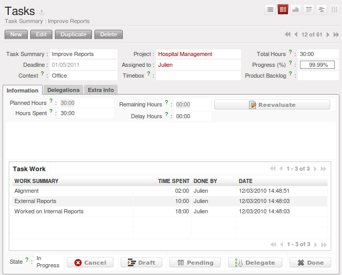
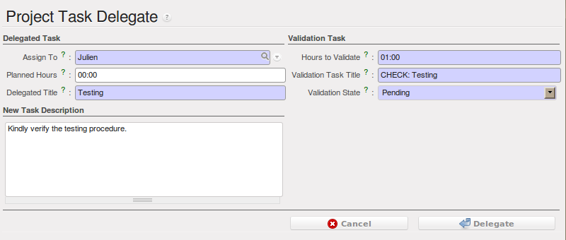

.. i18n: Project Management
.. i18n: ==================
..

项目管理
========

.. i18n: In the previous chapter you learned more about the financial management of projects, based on
.. i18n: OpenERP's analytic accounts, structured into cases. This way of working enables you to analyze
.. i18n: time plans and budgets, to control invoicing and to manage your different contracts.
..

In the previous chapter you learned more about the financial management of projects, based on
OpenERP's analytic accounts, structured into cases. This way of working enables you to analyze
time plans and budgets, to control invoicing and to manage your different contracts.

.. i18n: Here we will explain operational project management to organize tasks and plan the work you
.. i18n: need to get the tasks completed. All the necessary operations are carried out from the
.. i18n: :menuselection:`Project` menu.
..

Here we will explain operational project management to organize tasks and plan the work you
need to get the tasks completed. All the necessary operations are carried out from the
:menuselection:`Project` menu.

.. i18n: .. tip:: Remember that you will have less options in Simplified view than in Extended view.
..

.. tip:: Remember that you will have less options in Simplified view than in Extended view.

.. i18n: .. index::
.. i18n:    single: project
..

.. index::
   single: project

.. i18n: .. note:: Project
.. i18n: 
.. i18n: 	In OpenERP, a project is represented by a set of tasks to be completed.
.. i18n: 	Projects have a tree structure that can be divided into phases and sub-phases.
.. i18n: 	This structure is very useful to organise your work.
.. i18n: 
.. i18n: 	Whereas analytic accounts look at the past activities of the company, Project Management's role is
.. i18n: 	to plan the future.
.. i18n: 	Even though there is a close link between the two (such as where a project has been planned and then
.. i18n: 	completed through OpenERP) they are still two different concepts, each making its own contribution to a flexible workflow.
..

.. note:: Project

	In OpenERP, a project is represented by a set of tasks to be completed.
	Projects have a tree structure that can be divided into phases and sub-phases.
	This structure is very useful to organise your work.

	Whereas analytic accounts look at the past activities of the company, Project Management's role is
	to plan the future.
	Even though there is a close link between the two (such as where a project has been planned and then
	completed through OpenERP) they are still two different concepts, each making its own contribution to a flexible workflow.

.. i18n: Most customer projects are represented by:
..

Most customer projects are represented by:

.. i18n: * one or several analytic accounts in the Accounting System, to keep track of the contract and its
.. i18n:   different phases,
.. i18n: 
.. i18n: * one or several projects in Project Management, to track the project and the different tasks to
.. i18n:   be completed.
..

* one or several analytic accounts in the Accounting System, to keep track of the contract and its
  different phases,

* one or several projects in Project Management, to track the project and the different tasks to
  be completed.

.. i18n: There is a direct link between the project and the analytic account, because for each new project created, OpenERP will automatically create the corresponding analytic account in the `Projects` analytic chart of accounts. Note that you have no access to the analytic account directly from a project.
..

There is a direct link between the project and the analytic account, because for each new project created, OpenERP will automatically create the corresponding analytic account in the `Projects` analytic chart of accounts. Note that you have no access to the analytic account directly from a project.

.. i18n: Creating Projects and Related Tasks
.. i18n: -----------------------------------
..

Creating Projects and Related Tasks
-----------------------------------

.. i18n: To define a new project, go to the menu :menuselection:`Project --> Project --> Projects`.
.. i18n: Click :guilabel:`New` and give your new project a :guilabel:`Project Name`.
..

To define a new project, go to the menu :menuselection:`Project --> Project --> Projects`.
Click :guilabel:`New` and give your new project a :guilabel:`Project Name`.

.. i18n: You can put this project into a hierarchy, as a child of a :guilabel:`Parent Project`, and
.. i18n: assign a :guilabel:`Project Manager`.
.. i18n: Enter the general duration by completing :guilabel:`Start Date` and :guilabel:`End Date`.
..

You can put this project into a hierarchy, as a child of a :guilabel:`Parent Project`, and
assign a :guilabel:`Project Manager`.
Enter the general duration by completing :guilabel:`Start Date` and :guilabel:`End Date`.

.. i18n: The `Administration` tab displays information about Planned Time and the Time Spent on the project according to the task work completed.
.. i18n: By checking the box :guilabel:`Warn Manager`, you configure the system to automatically send the project manager
.. i18n: an OpenERP `Request` every time a task is closed.
..

The `Administration` tab displays information about Planned Time and the Time Spent on the project according to the task work completed.
By checking the box :guilabel:`Warn Manager`, you configure the system to automatically send the project manager
an OpenERP `Request` every time a task is closed.

.. i18n: In case a project takes too long, it can also be escalated to another project. This feature is available if you have installed the module :mod:`project_issue`, which can be done by selecting :guilabel:`Issues Tracker` in the :guilabel:`Reconfigure` wizard. In :guilabel:`Project Escalation`, enter the project that will be used for escalated tasks.
.. i18n: Define a generic :guilabel:`Reply-To Email Address` linked to all automated mails; this allows you to receive replies directly in OpenERP.
.. i18n: You can also link to a :guilabel:`Working Time` category, which will be used to calculate the Project's time line, i.e. through a Gantt chart.
..

In case a project takes too long, it can also be escalated to another project. This feature is available if you have installed the module :mod:`project_issue`, which can be done by selecting :guilabel:`Issues Tracker` in the :guilabel:`Reconfigure` wizard. In :guilabel:`Project Escalation`, enter the project that will be used for escalated tasks.
Define a generic :guilabel:`Reply-To Email Address` linked to all automated mails; this allows you to receive replies directly in OpenERP.
You can also link to a :guilabel:`Working Time` category, which will be used to calculate the Project's time line, i.e. through a Gantt chart.

.. i18n: The status of a project can take the following values:
..

The status of a project can take the following values:

.. i18n: * \ ``Open``\: the project is being carried out,
.. i18n: 
.. i18n: * \ ``Pending``\: the project is paused,
.. i18n: 
.. i18n: * \ ``Cancelled``\: the project has been cancelled and therefore aborted,
.. i18n: 
.. i18n: * \ ``Closed``\: the project has been successfully completed,
.. i18n: 
.. i18n: * \ ``Template``\: the project can be used as a template to make projects based on this.
..

* \ ``Open``\: the project is being carried out,

* \ ``Pending``\: the project is paused,

* \ ``Cancelled``\: the project has been cancelled and therefore aborted,

* \ ``Closed``\: the project has been successfully completed,

* \ ``Template``\: the project can be used as a template to make projects based on this.

.. i18n: On the `Members` tab, add :guilabel:`Members` to the project; this is related to access rights too.
..

On the `Members` tab, add :guilabel:`Members` to the project; this is related to access rights too.

.. i18n: On the `Billing` tab, you find information to invoice your customer.
.. i18n: Select the `Customer`; the Invoice address will automatically be filled from the customer form.
.. i18n: To generate invoices based on time spent on tasks, if activated on a project, you may install :mod:`project_timesheet` by selecting :guilabel:`Bill Time on Tasks` in the :guilabel:`Reconfigure` wizard.
.. i18n: Then you can complete the invoicing data, such as `Sale Pricelist` and `Invoice Task Work` to directly invoice from task work done.
.. i18n: OpenERP allows you to set a `Max. Invoice Price` for the project (or sub-project). The `Invoiced Amount` shows the total amount that has already been invoiced for the project concerned. 
..

On the `Billing` tab, you find information to invoice your customer.
Select the `Customer`; the Invoice address will automatically be filled from the customer form.
To generate invoices based on time spent on tasks, if activated on a project, you may install :mod:`project_timesheet` by selecting :guilabel:`Bill Time on Tasks` in the :guilabel:`Reconfigure` wizard.
Then you can complete the invoicing data, such as `Sale Pricelist` and `Invoice Task Work` to directly invoice from task work done.
OpenERP allows you to set a `Max. Invoice Price` for the project (or sub-project). The `Invoiced Amount` shows the total amount that has already been invoiced for the project concerned. 

.. i18n: If you want to automatically keep your customer informed about the progress of the project, check `Warn Partner`. 
..

If you want to automatically keep your customer informed about the progress of the project, check `Warn Partner`. 

.. i18n: .. note:: Warn Partner Setup
.. i18n: 
.. i18n:    If you check :guilabel:`Warn Partner`, you should define a generic Mail Header and Mail Footer in the
.. i18n:    :guilabel:`Billing` tab that will be used in the automated email (*Extended view* only).
.. i18n:    OpenERP prepares an email the user can send to the customer
.. i18n:    each time that a task is completed. The contents of this email are based on details of the project
.. i18n:    task, and can be modified by the user before the email is sent.
.. i18n:    OpenERP displays a number of variables at the bottom of this tab.
..

.. note:: Warn Partner Setup

   If you check :guilabel:`Warn Partner`, you should define a generic Mail Header and Mail Footer in the
   :guilabel:`Billing` tab that will be used in the automated email (*Extended view* only).
   OpenERP prepares an email the user can send to the customer
   each time that a task is completed. The contents of this email are based on details of the project
   task, and can be modified by the user before the email is sent.
   OpenERP displays a number of variables at the bottom of this tab.

.. i18n: .. note:: Study of Customer Satisfaction
.. i18n: 
.. i18n: 	Some companies run a system where emails are automatically sent at the end of a task requesting the
.. i18n: 	customer to complete an online survey.
.. i18n: 	This survey enables a company to ask several questions about the work carried out, to gauge customer
.. i18n: 	satisfaction as the project progresses.
.. i18n: 
.. i18n: 	This function can also be used by ISO 9001-certified companies, to measure customer satisfaction.
.. i18n: 	OpenERP also allows you to create your own surveys. 
..

.. note:: Study of Customer Satisfaction

	Some companies run a system where emails are automatically sent at the end of a task requesting the
	customer to complete an online survey.
	This survey enables a company to ask several questions about the work carried out, to gauge customer
	satisfaction as the project progresses.

	This function can also be used by ISO 9001-certified companies, to measure customer satisfaction.
	OpenERP also allows you to create your own surveys. 

.. i18n: The `Task Stages` tab allows you to define stages that help you divide your tasks. You can add a sequence number to set the stage order, allowing you to prioritize your task work, i.e. first you will have the Specification stage and then Development.
..

The `Task Stages` tab allows you to define stages that help you divide your tasks. You can add a sequence number to set the stage order, allowing you to prioritize your task work, i.e. first you will have the Specification stage and then Development.

.. i18n: Managing Tasks
.. i18n: --------------
..

Managing Tasks
--------------

.. i18n: Once a project has been defined, you can enter the tasks to be executed. You have two possibilities for this:
..

Once a project has been defined, you can enter the tasks to be executed. You have two possibilities for this:

.. i18n: * click the :guilabel:`ACTION` button :guilabel:`Tasks` to the right of the project form, then click :guilabel:`New`,
.. i18n: 
.. i18n: * from the menu :menuselection:`Project --> Project --> Tasks`, create a new task and assign it
.. i18n:   to an existing project.
..

* click the :guilabel:`ACTION` button :guilabel:`Tasks` to the right of the project form, then click :guilabel:`New`,

* from the menu :menuselection:`Project --> Project --> Tasks`, create a new task and assign it
  to an existing project.

.. i18n: Each task has one of the following states:
..

Each task has one of the following states:

.. i18n: * \ ``Draft``\: the task has been entered but has not yet been validated by the person who will
.. i18n:   have to do it,
.. i18n: 
.. i18n: * \ ``In Progress``\: you can start working on the task, hence the task is in progress,
.. i18n: 
.. i18n: * \ ``Done``\: task is completed,
.. i18n: 
.. i18n: * \ ``Cancelled``\: task work is no longer required,
.. i18n: 
.. i18n: * \ ``Pending``\: task is waiting for response of someone else (e.g. customer information).
..

* \ ``Draft``\: the task has been entered but has not yet been validated by the person who will
  have to do it,

* \ ``In Progress``\: you can start working on the task, hence the task is in progress,

* \ ``Done``\: task is completed,

* \ ``Cancelled``\: task work is no longer required,

* \ ``Pending``\: task is waiting for response of someone else (e.g. customer information).

.. i18n: A task can be assigned to a user, who then becomes responsible for closing it. But you could also
.. i18n: leave it unassigned so that nobody specific will be responsible: various team members instead are
.. i18n: made jointly responsible for working on tasks they have the skills for.
..

A task can be assigned to a user, who then becomes responsible for closing it. But you could also
leave it unassigned so that nobody specific will be responsible: various team members instead are
made jointly responsible for working on tasks they have the skills for.

.. i18n: .. figure::  images/service_task.png
.. i18n:    :scale: 75
.. i18n:    :align: center
.. i18n: 
.. i18n:    *Tasks in Project Management*
..

   *Tasks in Project Management*

.. i18n: Each user manages his or her own task using the various menus available. To open the list of
.. i18n: unclosed tasks that have been specifically assigned to you, go to the menu :menuselection:`Project --> Project --> Tasks`. Or to open the unassigned tasks, go to :menuselection:`Project --> Project --> Tasks` and then click \ ``Clear``\ button
.. i18n: and then \ ``Unassigned``\   button.
..

Each user manages his or her own task using the various menus available. To open the list of
unclosed tasks that have been specifically assigned to you, go to the menu :menuselection:`Project --> Project --> Tasks`. Or to open the unassigned tasks, go to :menuselection:`Project --> Project --> Tasks` and then click \ ``Clear``\ button
and then \ ``Unassigned``\   button.

.. i18n: .. tip:: Shortcuts
.. i18n: 
.. i18n: 	Every user should create a link in their own shortcuts to the :menuselection:`Tasks` menu, because they will
.. i18n: 	have to consult this menu several times a day.
..

.. tip:: Shortcuts

	Every user should create a link in their own shortcuts to the :menuselection:`Tasks` menu, because they will
	have to consult this menu several times a day.

.. i18n: The `Delegations` tab allows you to define links between your tasks. From `Parent Tasks` set the tasks that are related to this task. Use this feature to define the order in which tasks need to be accomplished, i.e. task 2 may not be executed before task 1.
..

The `Delegations` tab allows you to define links between your tasks. From `Parent Tasks` set the tasks that are related to this task. Use this feature to define the order in which tasks need to be accomplished, i.e. task 2 may not be executed before task 1.

.. i18n: .. index::
.. i18n:    single: invoicing; tasks
..

.. index::
   single: invoicing; tasks

.. i18n: Invoicing Tasks
.. i18n: ---------------
..

Invoicing Tasks
---------------

.. i18n: Several methods of invoicing have already been described:
..

Several methods of invoicing have already been described:

.. i18n: * invoicing from a sales order,
.. i18n: 
.. i18n: * invoicing on the basis of analytic costs (service times, expenses),
.. i18n: 
.. i18n: * invoicing on the basis of deliveries,
.. i18n: 
.. i18n: * manual invoicing.
..

* invoicing from a sales order,

* invoicing on the basis of analytic costs (service times, expenses),

* invoicing on the basis of deliveries,

* manual invoicing.

.. i18n: Although invoicing tasks might appear useful, in certain situations it is best to invoice from the
.. i18n: service or purchase orders instead. These methods of invoicing are more flexible, with various
.. i18n: pricing levels set out in the pricelist, and different products that can be invoiced. And it is
.. i18n: helpful to limit the number of invoicing methods in your company by extending the use of an
.. i18n: invoicing method that you already have.
..

Although invoicing tasks might appear useful, in certain situations it is best to invoice from the
service or purchase orders instead. These methods of invoicing are more flexible, with various
pricing levels set out in the pricelist, and different products that can be invoiced. And it is
helpful to limit the number of invoicing methods in your company by extending the use of an
invoicing method that you already have.

.. i18n: If you want to connect your Sales Order with Project tasks you should create
.. i18n: products such as \ ``Consultant``\  and \ ``Senior Developer``\ . These products should be configured
.. i18n: with :guilabel:`Product Type` \ ``Service``\ , a :guilabel:`Procurement Method` of \ ``Make to Order``\  ,
.. i18n: and a :guilabel:`Supply Method` of \ ``Produce``\. Once you have set this up, OpenERP automatically creates a task in project management when the order is approved.
.. i18n: You can even take this further by adding a default project to your product. In the Product form, on the `Procurement & Locations` tab, enter the default project to which the automatically created task (from the sales order) should be linked.
..

If you want to connect your Sales Order with Project tasks you should create
products such as \ ``Consultant``\  and \ ``Senior Developer``\ . These products should be configured
with :guilabel:`Product Type` \ ``Service``\ , a :guilabel:`Procurement Method` of \ ``Make to Order``\  ,
and a :guilabel:`Supply Method` of \ ``Produce``\. Once you have set this up, OpenERP automatically creates a task in project management when the order is approved.
You can even take this further by adding a default project to your product. In the Product form, on the `Procurement & Locations` tab, enter the default project to which the automatically created task (from the sales order) should be linked.

.. i18n: You can also change some of the order parameters, which affects the invoice:
..

You can also change some of the order parameters, which affects the invoice:

.. i18n: *  :guilabel:`Shipping Policy` : \ ``Invoice on Order After Delivery`` \ (when the task is closed),
.. i18n: 
.. i18n: *  :guilabel:`Invoice On` : \ ``Shipped Quantities`` \ (actual hours in the task).
..

*  :guilabel:`Shipping Policy` : \ ``Invoice on Order After Delivery`` \ (when the task is closed),

*  :guilabel:`Invoice On` : \ ``Shipped Quantities`` \ (actual hours in the task).

.. i18n: Create the `Sales Order` using the product :guilabel:`Consultant` with the above configuration and confirm it.
.. i18n: You can find the task created from this sale order using the menu :menuselection:`Project --> Project --> Tasks`.
.. i18n: Once you find that task, click on the :guilabel:`Start Task` button in order to start it.  You have to manually assign the
.. i18n: project for this task, unless you specified a default project in the Product form. When you complete the task, enter the information in the :guilabel:`Task Work` field. Then click the :guilabel:`Done` button in order to indicate to OpenERP that this task is finished.
.. i18n: As an example, the new task `SO008:Create SRS` generated from sales order `SO0008` is shown in following figure.
..

Create the `Sales Order` using the product :guilabel:`Consultant` with the above configuration and confirm it.
You can find the task created from this sale order using the menu :menuselection:`Project --> Project --> Tasks`.
Once you find that task, click on the :guilabel:`Start Task` button in order to start it.  You have to manually assign the
project for this task, unless you specified a default project in the Product form. When you complete the task, enter the information in the :guilabel:`Task Work` field. Then click the :guilabel:`Done` button in order to indicate to OpenERP that this task is finished.
As an example, the new task `SO008:Create SRS` generated from sales order `SO0008` is shown in following figure.

.. i18n: .. figure::  images/project_task_from_sale_order.png
.. i18n:    :scale: 75
.. i18n:    :align: center
.. i18n: 
.. i18n:    *Task created from Sales Order*
..

.. figure::  images/project_task_from_sale_order.png
   :scale: 75
   :align: center

   *Task created from Sales Order*

.. i18n: .. tip:: You need to carefully configure the analytic account related to this project. If you use the Billing tab of the project to do this, the analytic account linked to the project will automatically get the related settings.
..

.. tip:: You need to carefully configure the analytic account related to this project. If you use the Billing tab of the project to do this, the analytic account linked to the project will automatically get the related settings.

.. i18n: After finishing this task, go to the menu :menuselection:`Project --> Invoicing --> Invoice Tasks Work` in order to
.. i18n: find the list of uninvoiced task works.
.. i18n: Click the action :guilabel:`Invoice analytic lines` when you want to create an invoice for this task work.
..

After finishing this task, go to the menu :menuselection:`Project --> Invoicing --> Invoice Tasks Work` in order to
find the list of uninvoiced task works.
Click the action :guilabel:`Invoice analytic lines` when you want to create an invoice for this task work.

.. i18n: .. figure::  images/project_invoice_from_task_work.png
.. i18n:    :scale: 70
.. i18n:    :align: center
.. i18n: 
.. i18n:    *Form to Create Invoice from Tasks Work*
..

.. figure::  images/project_invoice_from_task_work.png
   :scale: 70
   :align: center

   *Form to Create Invoice from Tasks Work*

.. i18n: Priority Management
.. i18n: -------------------
..

Priority Management
-------------------

.. i18n: Several methods can be used for ordering tasks by their respective priorities. OpenERP orders
.. i18n: tasks based on a function of the following fields: :guilabel:`Sequence`, :guilabel:`Priority`, and
.. i18n: :guilabel:`Deadline`.
..

Several methods can be used for ordering tasks by their respective priorities. OpenERP orders
tasks based on a function of the following fields: :guilabel:`Sequence`, :guilabel:`Priority`, and
:guilabel:`Deadline`.

.. i18n: Use the :guilabel:`Sequence` field on the second tab, :guilabel:`Extra Info`, to plan a
.. i18n: project made up of several tasks. In the case of an IT project, for example, where development tasks
.. i18n: are done in a given order, the first task to do will be sequence number 1, then numbers 2, 3, 4 and
.. i18n: so on. When you first open the list of project tasks, they are listed in their sequence order. You can simply drag and drop tasks to change their sequence.
..

Use the :guilabel:`Sequence` field on the second tab, :guilabel:`Extra Info`, to plan a
project made up of several tasks. In the case of an IT project, for example, where development tasks
are done in a given order, the first task to do will be sequence number 1, then numbers 2, 3, 4 and
so on. When you first open the list of project tasks, they are listed in their sequence order. You can simply drag and drop tasks to change their sequence.

.. i18n: You can use one of these three ordering methods, or combine several of them, depending on the
.. i18n: project.
..

You can use one of these three ordering methods, or combine several of them, depending on the
project.

.. i18n: .. index::
.. i18n:    single: module; scrum
.. i18n:    single: agile (method)
..

.. index::
   single: module; scrum
   single: agile (method)

.. i18n: .. note:: Agile Methods
.. i18n: 
.. i18n: 	OpenERP implements the agile methodology Scrum for IT development projects in the :mod:`project_scrum`
.. i18n: 	module.
.. i18n: 
.. i18n: 	Scrum supplements the task system with the following concepts:
.. i18n: 	long-term planning, sprints, iterative development, progress meetings, burndown chart, and product
.. i18n: 	backlog.
.. i18n: 
.. i18n: 	Look at the site: http://controlchaos.com for more information on the Scrum methodology.
..

.. note:: Agile Methods

	OpenERP implements the agile methodology Scrum for IT development projects in the :mod:`project_scrum`
	module.

	Scrum supplements the task system with the following concepts:
	long-term planning, sprints, iterative development, progress meetings, burndown chart, and product
	backlog.

	Look at the site: http://controlchaos.com for more information on the Scrum methodology.

.. i18n: .. figure::  images/service_project_gantt.png
.. i18n:    :scale: 75
.. i18n:    :align: center
.. i18n: 
.. i18n:    *Gantt chart, calculated for earliest delivery*
..

.. figure::  images/service_project_gantt.png
   :scale: 75
   :align: center

   *Gantt chart, calculated for earliest delivery*

.. i18n: You can set the Working Time in the project file. If you do not specify
.. i18n: anything, OpenERP assumes by default that you work 8 hours a day from Monday to Sunday. Once the
.. i18n: time is specified you can call up a project Gantt chart from Tasks. The system then
.. i18n: calculates a project plan for earliest delivery using task ordering and the working time.
..

You can set the Working Time in the project file. If you do not specify
anything, OpenERP assumes by default that you work 8 hours a day from Monday to Sunday. Once the
time is specified you can call up a project Gantt chart from Tasks. The system then
calculates a project plan for earliest delivery using task ordering and the working time.

.. i18n: .. tip:: Calendar View
.. i18n: 
.. i18n: 	OpenERP can give you a calendar view of the different tasks in both the web client and the GTK client.
.. i18n: 	This is all based on the deadline data and displays only tasks that have a deadline.
.. i18n: 	You can then delete, create or modify tasks using drag and drop (only in web).
.. i18n: 
.. i18n: 	.. figure::  images/service_task_calendar.png
.. i18n: 	   :scale: 65
.. i18n: 	   :align: center
.. i18n: 
.. i18n: 	*Calendar View of the System Tasks*
..

.. tip:: Calendar View

	OpenERP can give you a calendar view of the different tasks in both the web client and the GTK client.
	This is all based on the deadline data and displays only tasks that have a deadline.
	You can then delete, create or modify tasks using drag and drop (only in web).

	.. figure::  images/service_task_calendar.png
	   :scale: 65
	   :align: center

	*Calendar View of the System Tasks*

.. i18n: .. index:: delegation (task)
..

.. index:: delegation (task)

.. i18n: Delegate your Tasks
.. i18n: -------------------
..

Delegate your Tasks
-------------------

.. i18n: To delegate a task to another user, you can just change the person responsible for that task. However,
.. i18n: the system does not help you track tasks that you have delegated, such as monitoring of work done, if
.. i18n: you do it this way.
..

To delegate a task to another user, you can just change the person responsible for that task. However,
the system does not help you track tasks that you have delegated, such as monitoring of work done, if
you do it this way.

.. i18n: .. figure::  images/service_task_delegate.png
.. i18n:    :scale: 75
.. i18n:    :align: center
.. i18n: 
.. i18n:    *Form for Delegating a Task to Another User*
..

   *Form for Delegating a Task to Another User*

.. i18n: Instead, you can use the :guilabel:`Delegate` button on a task.
..

Instead, you can use the :guilabel:`Delegate` button on a task.

.. i18n: .. *Delegate* \ ``Pending``\
..

.. *Delegate* \ ``Pending``\

.. i18n: .. \ ``Pending``\  \ ``Open``\
..

.. \ ``Pending``\  \ ``Open``\

.. i18n: The system enables you to modify tasks at all levels in the chain of delegation, to add additional
.. i18n: information. A task can therefore start as a global objective and become more detailed as it is
.. i18n: delegated down in the hierarchy.
..

The system enables you to modify tasks at all levels in the chain of delegation, to add additional
information. A task can therefore start as a global objective and become more detailed as it is
delegated down in the hierarchy.

.. i18n: The second tab on the task form gives you a complete history of the chain of delegation for each
.. i18n: task. You can find a link to the parent task there, and the different tasks that have been
.. i18n: delegated.
..

The second tab on the task form gives you a complete history of the chain of delegation for each
task. You can find a link to the parent task there, and the different tasks that have been
delegated.

.. i18n: .. Copyright © Open Object Press. All rights reserved.
..

.. Copyright © Open Object Press. All rights reserved.

.. i18n: .. You may take electronic copy of this publication and distribute it if you don't
.. i18n: .. change the content. You can also print a copy to be read by yourself only.
..

.. You may take electronic copy of this publication and distribute it if you don't
.. change the content. You can also print a copy to be read by yourself only.

.. i18n: .. We have contracts with different publishers in different countries to sell and
.. i18n: .. distribute paper or electronic based versions of this book (translated or not)
.. i18n: .. in bookstores. This helps to distribute and promote the OpenERP product. It
.. i18n: .. also helps us to create incentives to pay contributors and authors using author
.. i18n: .. rights of these sales.
..

.. We have contracts with different publishers in different countries to sell and
.. distribute paper or electronic based versions of this book (translated or not)
.. in bookstores. This helps to distribute and promote the OpenERP product. It
.. also helps us to create incentives to pay contributors and authors using author
.. rights of these sales.

.. i18n: .. Due to this, grants to translate, modify or sell this book are strictly
.. i18n: .. forbidden, unless Tiny SPRL (representing Open Object Press) gives you a
.. i18n: .. written authorisation for this.
..

.. Due to this, grants to translate, modify or sell this book are strictly
.. forbidden, unless Tiny SPRL (representing Open Object Press) gives you a
.. written authorisation for this.

.. i18n: .. Many of the designations used by manufacturers and suppliers to distinguish their
.. i18n: .. products are claimed as trademarks. Where those designations appear in this book,
.. i18n: .. and Open Object Press was aware of a trademark claim, the designations have been
.. i18n: .. printed in initial capitals.
..

.. Many of the designations used by manufacturers and suppliers to distinguish their
.. products are claimed as trademarks. Where those designations appear in this book,
.. and Open Object Press was aware of a trademark claim, the designations have been
.. printed in initial capitals.

.. i18n: .. While every precaution has been taken in the preparation of this book, the publisher
.. i18n: .. and the authors assume no responsibility for errors or omissions, or for damages
.. i18n: .. resulting from the use of the information contained herein.
..

.. While every precaution has been taken in the preparation of this book, the publisher
.. and the authors assume no responsibility for errors or omissions, or for damages
.. resulting from the use of the information contained herein.

.. i18n: .. Published by Open Object Press, Grand Rosière, Belgium
..

.. Published by Open Object Press, Grand Rosière, Belgium
