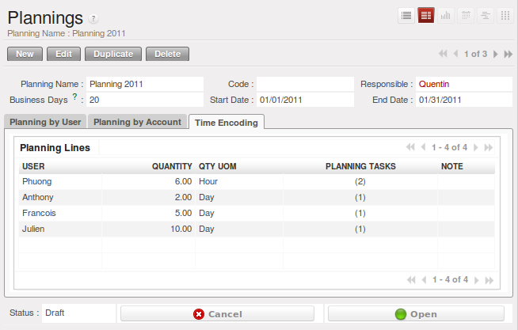

.. i18n: .. index::
.. i18n:    single: planning
.. i18n: ..
..

.. index::
   single: planning
..

.. i18n: Planning to Improve Leadership
.. i18n: ==============================
..

提高领导能力的规划
==============================

.. i18n: Planning in a company often takes the form of regular meetings between the different teams. Each
.. i18n: team has a certain number of projects and objectives that they must organize and establish
.. i18n: priorities for.
..

在公司中的计划，往往通过团队之间的例会来确定。每个团队都有一定数量的项目和目标，他们必须确定优先事项。

.. i18n: Ideally, these planning meetings should be short but regular and systematic. They can be weekly or
.. i18n: monthly depending on the type of activity. A planning meeting often runs in three phases:
..

理想的情况下，这些例会应是短暂的，但例行和系统的。取决于业务的要求他们可以每周或每月召开。一次计划会议，通常包括三个阶段:

.. i18n: 	#. Minutes of the preceding period, and analysis of the work done compared to the planned work.
.. i18n: 
.. i18n: 	#. Introduction of new projects.
.. i18n: 
.. i18n: 	#. Planning the next period.
..

	#. 先用几分钟对前段时间的工作和计划作对比分析.

	#. 介绍新的项目.

	#. 计划下阶段工作.

.. i18n: The planning function covers several objectives which will be described in this section:
..

规划功能包括将在本节中所述的几个目标:

.. i18n: * planning live projects against the commitments that have been made to clients,
.. i18n: 
.. i18n: * determining staffing (HR) requirements in the coming month,
.. i18n: 
.. i18n: * setting work for each employee or team for the periods to come,
.. i18n: 
.. i18n: * analyzing the work done in the preceding periods,
.. i18n: 
.. i18n: * passing the high-level objectives to lower levels in the company's hierarchy.
..

* 根据对客户作出的承诺规划现场项目,

* 决定在未来一个月的工作人员（人力资源）的要求,

* 安排每个员工或团队下阶段的工作,

* 分析在前一阶段的工作完成情况,

* 公司高层商议相对较低级别任务接受高级别任务.

.. i18n: .. tip:: The Social Role of Planning
.. i18n: 
.. i18n: 	Some project managers think that they can manage planning on their own.
.. i18n: 	They are commonly overworked and think that meetings are a waste of time.
.. i18n: 
.. i18n: 	Even if staff really can manage their work for themselves, you should recognize that this regular
.. i18n: 	meeting is also aimed at reassurance.
.. i18n: 	Without it you can get into unduly stressful situations from:
.. i18n: 
.. i18n: 	* feelings of overwork because they have lost sight of their priorities,
.. i18n: 
.. i18n: 	* lack of feedback and tracking of the work actually completed,
.. i18n: 
.. i18n: 	* an impression of poor organization if that has not been made explicit.
.. i18n: 
.. i18n: 	So the social role of planning should not be neglected. We have often experienced a background of
.. i18n: 	stress in a company stemming from a lack of communication and planning.
..

.. tip:: 制定计划的作用

	很多项目经理认为他们可以独自制定计划。他们往往工作量过大，认为开会浪费时间。

	即使员工真的可以安排自己的工作，你还是应该把例会当作一种缓解。否则你将陷入过度压抑的状态:

	* 有工作负荷的感觉是因为他们对于自身优先权没有把握,

	* 工作的反馈及跟踪可实现,

	* 若工作计划不明确,会给人造成组织管理差的印象.

	So the social role of planning should not be neglected. We have often experienced a background of
	stress in a company stemming from a lack of communication and planning.

.. i18n: .. index::
.. i18n:    single: tasks
..

.. index::
   single: tasks

.. i18n: Planning by Time or by Tasks?
.. i18n: -----------------------------
..

按时间还是按任务作计划？
-----------------------------

.. i18n: There are two major approaches to enterprise planning: planning by task and planning by time. You
.. i18n: can manage both with OpenERP.
..

制定计划的方法有两种：按任务或者按时间。你可使用 `Open ERP` 。

.. i18n: In planning by task, the project manager assigns tasks from the different projects to each employee
.. i18n: over a given period. Employees then carry out precisely the work they have been assigned by the
.. i18n: project manager.
..

若按任务方式，项目经理可在规定时间内将不同项目分配给员工。雇员认真完成项目经理分配的任务。

.. i18n: .. index::
.. i18n:    pair: time; allocation
..

.. index::
   pair: time; allocation

.. i18n: Planning by time consists of allocating, for each employee, some time on each of the different
.. i18n: projects for the period concerned. The tasks for each project are ordered by priority and can be
.. i18n: directly assigned to a user or left unassigned. Each employee then chooses the task that he or she
.. i18n: will do next, based on the plans and the relative priorities of the tasks.
..

若按时间分配方式，每个员工将有一定时间内每个不同项目中分配的时间任务。每个项目的任务由上级分配，可直接分配给接受者，或者
不进行分配。每个员工按计划和任务的先后顺序，选择接下来的任务。

.. i18n: .. _fig-srvplantime:
.. i18n: 
.. i18n: .. figure::  images/service_planning_time.png
.. i18n:    :scale: 75
.. i18n:    :align: center
.. i18n: 
.. i18n:    *Monthly planning for work time of each employee*
..

.. _fig-srvplantime:

   *员工月度工作时间分配*

.. i18n: The figure :ref:`fig-srvplantime` shows a monthly planning session where plans are being made for each employee to spend a
.. i18n: number of days' work on various different projects.
..

从员工月度工作时间分配图 :ref:`fig-srvplantime` 看出，月度计划制订了每个员工在不同项目上的工作时间。

.. i18n: In this time-focused planning approach, clients' priorities do not feature in the planning any more,
.. i18n: but are explicit in the task list instead. So this approach helps you separate the planning of human
.. i18n: resources on projects from the task prioritization within a project.
..

按照这种按时间分配的方式，客户的优先权不再在计划中体现，而是在任务列表中体现。所以该方法可将项目人力资源规划从任务优先
化处理中区分开来。

.. i18n: .. note:: Comparing the Two Planning Methods
.. i18n: 
.. i18n:     To illustrate the difference between planning by time and planning by task, take the case of an
.. i18n:     IT project that is estimated to be around six months of work. This project is managed by iterative
.. i18n:     cycles of development of around a month, and a presentation is made to the client at the end of
.. i18n:     each cycle to track the progress of the project. At this meeting, you plan what must be carried
.. i18n:     out for the following month. At the end of the month, the account manager for the project invoices
.. i18n:     the client for the work done on the project.
.. i18n: 
.. i18n:     Suppose that the project encounters a delay because it is more complex than expected. There are
.. i18n:     two ways of resolving the delay if you have no further resources: you can be
.. i18n: 
.. i18n:     * late in your delivery of the planned functions, or 
.. i18n: 
.. i18n:     * on time, but with fewer functions than planned.
.. i18n: 
.. i18n:     If your planning is based on phases and tasks you will report at the client meeting that it will
.. i18n:     take several weeks to complete everything that was planned for the current phase. Conversely, if
.. i18n:     you are planning by time you will keep the meeting with the client to close the present development
.. i18n:     phase and plan the new one, but only be able to present part of the planned functionality.
.. i18n: 
.. i18n:     If the client is sensitive to delay, the first approach will cause acute unhappiness. You will have
.. i18n:     to re-plan the project and all of its future phases to take account of that delay. Some problems
.. i18n:     are also likely to occur later with invoicing, because it will be difficult for you to invoice
.. i18n:     any work that has been completed late but has not yet been shown to the client.
..

.. note:: 两种计划方式比较

    为说明按时间规划和按任务规划的不同，以一为期6个月的IT项目为例。该项目循环开发周期约一个月，每周期末
    为客户作演示，来作项目跟踪。在会议上，你为下个月作计划。月末，项目的客户经理为客户为已完成的部分开票。

    假设该项目由于比预期复杂而延期，若没有其他资源，有两种解决延期的方法:

    * 完成预期功能但延迟 

    * 准时完成但完成的功能比预期要少.

    若按阶段或任务作计划，你要在会议上告知客户现阶段要完成所有任务还需几周时间。相反，若按时间作计划，你要
    告知客户停止现行的开发计划，作新计划，但只能提出部分规划的功能。

    若客户对延期很在意，那么第一种方法会导致不开心的情况发生。你就必须考虑到延期重新对项目以及项目未来的
    进程作计划。后期开票方面也可能出现问题，因为对于延迟完成且未展示给客户的工作部分，开票有难度。

.. i18n: .. note:: Comparing the Two Planning Methods
.. i18n: 
.. i18n:     The second approach will require you to report on the functions that have not been completed, and
.. i18n:     on how they would fit into a future planning phase. That will not involve a break in the
.. i18n:     working time allocated to the project, however. 
.. i18n:     You would then generate two different lists: a staffing plan
.. i18n:     for the different projects, and the list of tasks prioritized for the client's project. This
.. i18n:     approach offers a number of advantages over the first one:
.. i18n: 
.. i18n:     * The client will have the choice of delaying the end of the project by planning an extra phase,
.. i18n:       or letting go of some minor functions to be able to deliver a final system more rapidly,
.. i18n: 
.. i18n:     * The client may re-plan the functions taking the new delay into account.
.. i18n: 
.. i18n:     * You will be able to make the client gradually aware of the fact that project progress has come
.. i18n:       under pressure and that work is perhaps more complex than had been estimated at the outset.
.. i18n: 
.. i18n:     * A delay in the delivery of several of the functions will not necessarily affect either monthly
.. i18n:       invoicing or project planning.
.. i18n: 
.. i18n:     Being able to separate human resource planning from task prioritization simplifies your
.. i18n:     management of complex issues, such as adjusting for employee holidays or handling the constantly
.. i18n:     changing priorities within projects.
..

.. note:: Comparing the Two Planning Methods

    第二种方法要求你汇报未完成的功能以及其对未来计划阶段产生的影响。这种方法不会对分配到项目的工作时间产生中断，
    但你必须提供两种清单：不同项目人员配置清单和客户项目的任务优化清单。这种方法相对于第一种方法有这些优势:

    * 客户也可通过制定新阶段计划来延长项目完成时间，或者放弃其中次要的功能来快速完成系统开发,

    * 客户可能因为考虑到延期, 而重新策划功能.

    * 你就要让客户意识到, 项目进度背负压力, 工作任务比期初预想的要复杂得多.

    * 几项功能的延迟发布, 不会对月度开票和项目计划造成影响.

    将人力资源规划从任务优化中分离出来，简化了复杂事务的管理，如对员工假期的调整及处理项目中不断变化的岗位级别。

.. i18n: .. index::
.. i18n:    single: planning; create plan
.. i18n: ..
..

.. index::
   single: planning; create plan
..

.. i18n: Plan your Time
.. i18n: --------------
..

计划你的时间
--------------

.. i18n: Install the module :mod:`project_planning` to get additional functions
.. i18n: that help with both planning and reporting on projects. Start a plan by using the
.. i18n: menu :menuselection:`Project --> Long Term Planning --> Plannings`.
..

安装项目计划模块 :mod:`project_planning` ，以获得其它功能，辅助项目规划和报告。使用菜单 :menuselection:`Project --> Long Term Planning --> Plannings`
:menuselection:`项目—长期规划—计划实施` 来开始计划。

.. i18n: .. index::
.. i18n:    pair: time; allocation
..

.. index::
   pair: time; allocation

.. i18n: On each planning line you should enter the user, the analytic account concerned, and the quantity of
.. i18n: time allocated. The quantity will be expressed in hours or in days depending on the unit of measure
.. i18n: used. For each line you can add a brief note about the work to be done.
..

在每项规划线内，你应登陆用户，可看到账户分析以及时间分配。分配量以小时或天的形式表示，取决于衡量的单位。每项规划线中，
可对要完成的工作加入简要说明。

.. i18n: Once the plan has been saved, use the other tabs of the planning form to check that the amount of
.. i18n: time allocated to the employees or to the projects is right. The time allocated should match
.. i18n: the employees' employment contracts, for example 37.5 hours per week. The forecast time for the
.. i18n: project should also match the commitments that you have made with client.
..

保存好计划后，使用其它计划形式选项卡，确认分配给员工或项目的时间是否正确。分配的时间必须与员工的工作合同相一致，例如每周
37.5小时。同时项目预设的时间也应与你和客户的承诺相一致。

.. i18n: You should ideally complete all the planning for the current period. You can also complete some
.. i18n: lines in the planning of future months – reserving resources on different project in response to
.. i18n: your client commitments, for example. This enables you to manage your available human resources for
.. i18n: the months ahead.
..

你应理想地完成现阶段的所有计划。也可完成未来几个月内的几项计划——如响应客户的承诺，储备不同项目的资源。这使你提前管理
几个月可用的人力资源。

.. i18n: .. index::
.. i18n:    single: module; board_project
..

.. index::
   single: module; board_project

.. i18n: Plans can be printed and/or sent to employees by email. 
.. i18n: Each employee can be given access to a dashboard that graphically shows the
.. i18n: time allocated to him or her on a project and the time that has been worked so far. So each employee
.. i18n: can decide which projects should be prioritized.
..

计划可打印或通过邮件发送给员工。每位员工可通过图表清楚地看到他/她在项目上要花费的时间以及目前为止
已工作的时间。所以每位员工可对项目进行优化选择。

.. i18n: The employee then selects a task in the highest priority project. She ideally chooses either a task
.. i18n: that has been directly assigned to her, or one which is high on the priority list that she is capable
.. i18n: of completing, but is not yet directly assigned to anybody.
..

然后员工可在最紧急项目中选择任务。她可自己选择分配给她的任务，或者在最紧急任务列表中选择能够完成的任务，且该任务还未直接
分配给别人。

.. i18n: At the end of the period you can compare the duration of effective work on the different projects to
.. i18n: that of the initial estimate. Print the plan to obtain a comparison of the planned working time and
.. i18n: the real time worked.
..

最后，你可对不同项目中所开展的有效工作时间与最初的预计作比较。将计划打印出来，来作计划工作时间和实际工作时间的比较。

.. i18n: .. figure::  images/planning_stat.png
.. i18n:    :scale: 75
.. i18n:    :align: center
.. i18n: 
.. i18n:    *Comparison of planned hours, worked hours and the productivity of employees by project*
..

.. figure::  images/planning_stat.png
   :scale: 75
   :align: center

   *计划工作时间，实际工作时间，项目员工生产力比较*

.. i18n: You can also study several of your project's figures from the menus in :menuselection:`Project
.. i18n: --> Reporting`.
..

你还可根据 :menuselection:`项目 --> 上报` :menuselection:`Project --> Reporting` 菜单对项目数据作分析.

.. i18n: Planning at all Levels of the Hierarchy
.. i18n: ---------------------------------------
..

在层次每个级别都进行计划
---------------------------------------

.. i18n: .. index::
.. i18n:    single: module; report_analytic_planning_delegate
..

.. index::
   single: module; report_analytic_planning_delegate

.. i18n: To put planning in place across the whole company you can use a system of planning delegation.
..

要将规划在整个公司落实到位，你需要运用规划代表团系统。

.. i18n: The planning entry form can reflect the hierarchical
.. i18n: structure of the company. To enter data into a plan line you can:
..

规划表格能够反应公司的层次结构。要使数据成为规划线的一部分，你可以:

.. i18n: * assign time on a project to an employee,
.. i18n: 
.. i18n: * assign time on a project to a department manager for his whole team.
..

* 将项目上要花的时间分配给员工,

* 将项目上要花的时间分配给负责其团队的部门经理.

.. i18n: You can now allocate the working time on projects for the whole of a department, without having to
.. i18n: detail each employee's tasks. Then when a department manager creates his own plan, he will find
.. i18n: what is required of his group by his management at the bottom of the form. At the top of the form
.. i18n: there is a place for assigning project work in detail to each member of department.
..

现你可按部门整体来分配项目工作时间，无需细化每个员工的工作任务。当部门经理制定计划时，便可在表格底部看到其管理团队的需求。
而在表格顶部留有空白处，用于将工作具体分配至部门每个成员。

.. i18n: If you do not have to plan time to work on a final draft you can do it on an analytic account that
.. i18n: relies on child accounts. This means that you can create plans to meet top-level objectives of the
.. i18n: senior management team and then cascade them down through the different departments to establish a
.. i18n: time budget for each employee. Each manager then uses his own plans for managing his level in the
.. i18n: hierarchy.
..

若你不需要在最终稿中作工作时间计划，你可在依附于子帐户的分析帐户作计划.也就是说你可以制定计划来满足高级管理层的最高级
目标,然后分配到不同部门,为每个员工作时间预算.每个经理之后用其计划管理其所在的等级。

.. i18n: .. Copyright © Open Object Press. All rights reserved.
..

.. Copyright © Open Object Press. All rights reserved.

.. i18n: .. You may take electronic copy of this publication and distribute it if you don't
.. i18n: .. change the content. You can also print a copy to be read by yourself only.
..

.. You may take electronic copy of this publication and distribute it if you don't
.. change the content. You can also print a copy to be read by yourself only.

.. i18n: .. We have contracts with different publishers in different countries to sell and
.. i18n: .. distribute paper or electronic based versions of this book (translated or not)
.. i18n: .. in bookstores. This helps to distribute and promote the OpenERP product. It
.. i18n: .. also helps us to create incentives to pay contributors and authors using author
.. i18n: .. rights of these sales.
..

.. We have contracts with different publishers in different countries to sell and
.. distribute paper or electronic based versions of this book (translated or not)
.. in bookstores. This helps to distribute and promote the OpenERP product. It
.. also helps us to create incentives to pay contributors and authors using author
.. rights of these sales.

.. i18n: .. Due to this, grants to translate, modify or sell this book are strictly
.. i18n: .. forbidden, unless Tiny SPRL (representing Open Object Press) gives you a
.. i18n: .. written authorisation for this.
..

.. Due to this, grants to translate, modify or sell this book are strictly
.. forbidden, unless Tiny SPRL (representing Open Object Press) gives you a
.. written authorisation for this.

.. i18n: .. Many of the designations used by manufacturers and suppliers to distinguish their
.. i18n: .. products are claimed as trademarks. Where those designations appear in this book,
.. i18n: .. and Open Object Press was aware of a trademark claim, the designations have been
.. i18n: .. printed in initial capitals.
..

.. Many of the designations used by manufacturers and suppliers to distinguish their
.. products are claimed as trademarks. Where those designations appear in this book,
.. and Open Object Press was aware of a trademark claim, the designations have been
.. printed in initial capitals.

.. i18n: .. While every precaution has been taken in the preparation of this book, the publisher
.. i18n: .. and the authors assume no responsibility for errors or omissions, or for damages
.. i18n: .. resulting from the use of the information contained herein.
..

.. While every precaution has been taken in the preparation of this book, the publisher
.. and the authors assume no responsibility for errors or omissions, or for damages
.. resulting from the use of the information contained herein.

.. i18n: .. Published by Open Object Press, Grand Rosière, Belgium
..

.. Published by Open Object Press, Grand Rosière, Belgium
