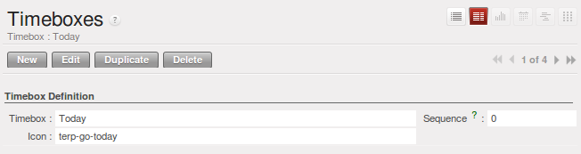

.. i18n: .. index:: GTD
..

.. index:: GTD

.. i18n: The Art of Productivity without Stress
.. i18n: ======================================
..

没有压力的生产力的艺术
======================================

.. i18n: Now you can take a slight detour away from pure enterprise management by looking at some tools offered by
.. i18n: OpenERP to improve your own personal time management. It is not much of a detour because good
.. i18n: organization is the key to better productivity in your daily work.
..

现你可通过查看ERP提供的一些工具,稍放下单纯的企业管理,来加强你的个人时间管理.这不算绕行,因为良好的组织是你每日工作中
提高生产力的关键.

.. i18n: .. index::
.. i18n:    single: module; project_gtd
.. i18n:    single: GTD
.. i18n:    single: Getting Things Done
..

.. index::
   single: module; project_gtd
   single: GTD
   single: Getting Things Done

.. i18n: OpenERP's :mod:`project_gtd` module was inspired by the work of two books focusing on efficient
.. i18n: time management:
..

OpenERP的项目 :mod:`project_gtd` 模块 灵感来自两本有效时间管理为主题的书:

.. i18n: * Getting Things Done – The Art of Stress-Free Productivity, by David Allen (2001), most often
.. i18n:   referred to by its initials **GTD** (trademark registered since 2005). This book is built around the
.. i18n:   principle that people should clearly write down all their outstanding tasks and store the details
.. i18n:   about these tasks in a trustworthy system.
..

* 《Getting Things Done》---无压力环境下提高生产力,戴维艾论著(2001).大部分参考了他本人在2005年草拟的
  **GTD**, 这本书围绕人应该列出未完成任务,然后在一可靠的系统中储存这些任务的细节.

.. i18n:   They then do not have to worry about holding all of this stuff in their head. Since they can be
.. i18n:   quite sure that it is recorded safely, they can allow themselves to relax and so have the energy
.. i18n:   and time to concentrate on handling the tasks themselves systematically.
..

  然后他们无须将这些任务记在脑中,他们可以很确定,这些事情已安全记录,他们可让自己放松,并将时间和经历系统
  集中在处理任务上.

.. i18n: .. index::
.. i18n:    simple: The 7 Habits of Highly Effective People
..

.. index::
   simple: The 7 Habits of Highly Effective People

.. i18n: * The 7 Habits of Highly Effective People by Stephen R. Covey (1989) : the author advises
.. i18n:   organizations on the use of these practices, and reports on the productivity improvements in the
.. i18n:   organization that result.
..

* 《The 7 Habits of Highly Effective People》--- 高效能人士的七个习惯(1989): 作者(Stephen R. Covey)建议
  组织使用这些实践条例,并在组织中报告生产力提高的结果。

.. i18n:   .. note:: Managing Time Efficiently
.. i18n: 
.. i18n:      David Allen, Getting Things Done, Penguin Books, New York, 2001, 267 pages. (ISBN :
.. i18n:      978-0142000281). Also see the site: http://davidco.com
.. i18n: 
.. i18n:      Stephen R. Covey, The 7 Habits of Highly Effective People, Free Press, 1989, 15th Anniversary
.. i18n:      Edition : 2004, 384 pages. (ISBN : 978-0743269513).
.. i18n: 
.. i18n:   .. tip:: De-stress Yourself!
.. i18n: 
.. i18n: 	 Clear the tasks that clutter your thoughts by registering them in an organized system.
.. i18n: 	 This immediately helps you to de-stress yourself and organize your work in the best possible way.
.. i18n: 
.. i18n: 	 If you feel stressed by too much work, do the following exercise to convince yourself about the
.. i18n: 	 benefits.
.. i18n: 	 Take some sheets of blank paper and write down everything that passes through your head about the
.. i18n: 	 things you need to do.
.. i18n: 	 For each task, note the next action to do on an adjacent line, and rank it by the date that you will
.. i18n: 	 commit yourself to doing it.
.. i18n: 
.. i18n: 	 At the end of the exercise you will feel better organized, considerably de-stressed and remarkably
.. i18n: 	 free of worries !
..

  .. note:: 有效安排时间

     《Getting Things Done》 --- 尽管去做 (David Allen)，企鹅书籍，纽约，2001,267页。(ISBN : 978-0142000281)
     见网址：http://davidco.com

     《The 7 Habits of Highly Effective People》 --- 高效能人士的七个习惯(Stephen R. Covey), Free出版社, 1989, 
     第15期周年改版：2004,384页(ISBN : 978-0743269513)

  .. tip:: 自我解压!

	将混乱思维的任务理清，将其记录在一个有序的系统中。这能使你快速自我解压，并以最好的方式组织工作开展。

	若你因工作负荷倍感压力，按以下方法来告诉自己它的好处。
	拿出几页空白纸，将在你脑中要做的事情写下来。
	每项工作的下一步用邻近线连接，并在上面标注你要承诺自己完成的时间。

	 在这个练习的最后，你会觉得做事更有条理，压力和忧虑大大减小。

.. i18n: The objective in this detour is not to detail the whole methodology, but to describe the supporting
.. i18n: tools provided by OpenERP's :mod:`project_gtd` module.
..

在这绕行中的目标不是为了具体补充丰富方法论，而是为了介绍 OpenERP项目模块 :mod:`project_gtd` 的辅助工具。

.. i18n: Not Everything that is Urgent is Necessarily Important
.. i18n: ------------------------------------------------------
..

并非所有急事必然是重要的
------------------------------------------------------

.. i18n: The first modification brought by the module to the basic OpenERP system is a separation of the
.. i18n: concepts of urgency and importance. Tasks are no longer classified by a single criterion, but by the
.. i18n: product of the two criteria, enabling you to prioritize matters that are both urgent and important
.. i18n: in a single list.
..

相对于基础OpenERP系统，模块的第一个调整就是将紧急性和重要性的概念区分开来。工作任务不再按单一的标准分类而是
由两个标准分类，使你在一张列表中看出同具紧急性和重要性的任务。

.. i18n: Many managers with a heavy workload use urgency as their sole method of prioritization. The
.. i18n: difficulty is then in working out how to plan for substantive tasks (like medium term objectives).
.. i18n: These are not urgent but are nevertheless very important.
..

很多工作任务重的管理者只用紧急性来作为区分工作优先性的方法。其中的问题在于怎样为大多数的工作作计划（如中期目标）。这些工作不紧急但却非常重要。

.. i18n: .. note:: Example Distinction between Urgency and Importance
.. i18n: 
.. i18n:     If you are very well organized, urgent tasks can (and should often) be given lower precedence than
.. i18n:     important tasks. Take an example from daily life as an illustration: the case of having some time
.. i18n:     with your children.
.. i18n: 
.. i18n:     For most people, this task is important. But if you have a busy professional life, the days and
.. i18n:     weeks flow on with endless urgent tasks to be resolved. Even if you manage your time well, you
.. i18n:     could let several months pass without spending time with your children because the task of seeing
.. i18n:     them is never as urgent as your other work, despite its importance.
..

.. note:: 紧急性和重要性区别举例

    如果你组织能力强，紧急的任务通常可以(通常应该)被安排在重要任务之后。从平时的生活中取一例子:
    安排时间和你的孩子一起的例子

    对于大多数人来说，此项任务是重要的。但是如果你的职业生活很忙碌。每日每周都被没完没了的紧急任务所填满。
    即使你将时间安排的很好，几个月过去你仍然没有安排和你的孩子在一起的时间，因为见他们尽管很重要，但是却不像你的
    工作那么紧急.

.. i18n: In OpenERP, urgency is given by the :guilabel:`Deadline` of the task, and importance by the :guilabel:`Priority`.
.. i18n: The classification of the tasks then results from the product of the two factors. The most important
.. i18n: tasks and the most urgent both appear at the top of the list.
..

在Open ERP程序中，紧急性由任务的截止期限 :guilabel:`Deadline` 决定，重要性由优先顺序 :guilabel:`Priority` 决定。任务的分类由两个因素决定。
最重要和最紧急的任务显示在表格顶端。

.. i18n: Organizing your Life Systematically
.. i18n: -----------------------------------
..

有条不紊地组织你的生活
-----------------------------------

.. i18n: A methodology of organizing yourself using the concepts of context and timebox is presented in this
.. i18n: section.
..

在此部分展示了运用环境联系和时间盒概念来安排自己的方法学

.. i18n: Context
.. i18n: ^^^^^^^
..

相关环境因素
^^^^^^^^^^^^^^^^

.. i18n: The context is determined by the work environment you must be in to deal with certain tasks. For
.. i18n: example, you could define the following contexts:
..

环境联系是指你要处理某项任务的工作环境。例如你可以为下列环境联系作定义:

.. i18n: *  *Office* : for tasks which have to be dealt with at your workplace (such as telephone a customer,
.. i18n:    or write a document),
.. i18n: 
.. i18n: *  *Car* : for tasks that you need to do on the move (such as going shopping, or going to
.. i18n:    the post office),
.. i18n: 
.. i18n: *  *Travel* : for tasks that you can handle on the plane or in the train while you are doing
.. i18n:    travelling on business (tasks such as writing an article, or analyzing a new product),
.. i18n: 
.. i18n: *  *Home* : for tasks which have to happen at your private address (such as finding a cleaning
.. i18n:    contractor, or mowing the lawn).
..

*  *办公室* : 在你工作场所要完成的任务（如打给客户电话或起草一份文件）,

*  *车* : 要四处奔波的任务（如购物或去邮局）,

*  *旅行* : 你在出差时在飞机或火车上完成的任务（如写一部作品，或分析一样新产品）,

*  *家* : 在私人住处完成的任务（如找一家清洁商户或割草）

.. i18n: An employee / system user can create his or her own contexts using the menu
.. i18n: :menuselection:`Project --> Configuration --> Tasks --> Contexts`.
..

员工/系统用户可通过菜单 :menuselection:`项目 --> 配置 --> 任务 --> 环境因素` :menuselection:`Project --> Configuration --> Tasks --> Contexts` 来创建自己的相关环境困素.

.. i18n: Timebox
.. i18n: ^^^^^^^
..

时间盒
^^^^^^^

.. i18n: You then have to define the timeboxes. You have to complete the tasks in the time interval specified
.. i18n: by a timebox. You usually define timeboxes with the following periods:
..

而后你需要为时间盒作定义。你必须完成在时间盒规定的时间间隔中完成任务。你经常通过以下时间段来为时间盒作定义。

.. i18n: *  *Today* : for tasks which must be handled today,
.. i18n: 
.. i18n: *  *This Week* : for tasks that have to be dealt with this week,
.. i18n: 
.. i18n: *  *This Month* : for tasks which have to be completed within the month,
.. i18n: 
.. i18n: *  *Long Term* : for tasks that can be dealt with in more than one month.
..

*  *今天* : 今天必须完成的任务,

* *本周* : 本周必须完成的任务,

*  *本月* : 本月必须完成的任务,

*  *长期* : 一个月之后要完成的任务.

.. i18n: A task can be put in one and only one timebox at a time.
..

一项任务一次只能放在一个时间盒里。

.. i18n: You should distinguish between a timebox and the deadline for completing a task because the deadline
.. i18n: is usually fixed by the requirements of the project manager. A timebox, by contrast, is selected
.. i18n: with reference to what an individual can do.
..

你必须将时间盒和完成任务的最后期限区分开来，因为任务最后期限是由项目管理者制定的，而时间盒是关于个人的任务。

.. i18n: To define timeboxes for your company, use the menu
.. i18n: :menuselection:`Project --> Configuration --> Tasks --> Timeboxes`.
..

为你公司的时间盒下定义，要用菜单 :menuselection:`项目 --> 配置 --> 任务 --> 时间盒` :menuselection:`Project --> Configuration --> Tasks --> Timeboxes`.

.. i18n: .. index:: methodology; GTD
..

.. index:: methodology; GTD

.. i18n: Methodology and Iterative Process
.. i18n: ^^^^^^^^^^^^^^^^^^^^^^^^^^^^^^^^^
..

方法和迭代过程
^^^^^^^^^^^^^^^^^^^^^^^^^^^^^^^^^

.. i18n: To organize your tasks efficiently, OpenERP uses a method based on the following systematic and
.. i18n: iterative process:
..

为有效开展你的任务，OpenERP软件在以下系统及迭代过程基础上使用方法:

.. i18n: 	#. Identify all the tasks that you have to deal with, including everything that keeps you awake at
.. i18n: 	   night, and enter them in Tasks, which you will find in the menu
.. i18n: 	   :menuselection:`Project --> Project --> Tasks`.
.. i18n: 
.. i18n: 	#. Classify the tasks periodically, assigning them a context and a timebox. This
.. i18n: 	   indicates both when and where the task should be handled. If a task takes less than 10 minutes, then
.. i18n: 	   maybe it could be handled immediately.
.. i18n: 
.. i18n: 	#. Every day, carry out the following process:
.. i18n: 
.. i18n: 		* First thing in the morning, select those tasks contained in the current week's timebox that you
.. i18n: 		  want to deal with today. These are presented in order of importance and urgency, so you should
.. i18n: 		  select the tasks closest to the top of the list.
.. i18n: 
.. i18n: 		* Carry out each task, that is to say either work on the task yourself or delegate it to another
.. i18n: 		  user,
.. i18n: 
.. i18n: 		* Last thing, at the end of the day's work, empty that day's timebox and return all unclosed tasks
.. i18n: 		  into the week's timebox.
.. i18n: 
.. i18n: 	#. Repeat the same process each week and each month for the respective timeboxes.
..

	#. 确定你要完成的所有任务，包括让你晚上失眠的所有事情，将其输入 `任务` 中，在菜单 :menuselection:`项目 --> 项目 --> 任务`
	:menuselection:`Project --> Project --> Tasks` 里。

	#. 定期将任务进行分类，为任务指定环境联系和时间盒。同时也指定了任务执行的时间和地点。若一项任务要花少于十分钟的时间，那么这项任务可以很快处理好。

	#. 每天开展以下工作步骤:

		* 早上的第一件事，从最近一周的时间盒里选择你今天想完成的任务。这些任务按照重要性和紧急性排列，所以
		  你要从表格的最上方选择任务,

		* 执行每项任务，也就是说，你自己完成任务或者将任务委托给另一位用户,

		* 在一天结束的时候要做的就是清空当日的时间盒，并将未完成的任务放至周时间盒.

	#. 每周每月按照各自的时间盒重复相同的步骤

.. i18n: .. index:: agenda
.. i18n: .. index:: timebox
..

.. index:: agenda
.. index:: timebox

.. i18n: .. tip:: Do not confuse **Agenda** and **Timebox**
.. i18n: 
.. i18n: 	The idea of timebox is independent from that of an agenda.
.. i18n: 	Certain tasks, such as meetings, must be done on a precise date.
.. i18n: 	So they cannot be managed by the timebox system but by an agenda.
.. i18n: 
.. i18n: 	The ideal is to put the minimum of things on the agenda and to put there only tasks that have a
.. i18n: 	fixed date.
.. i18n: 	The timebox system is more flexible and more efficient for dealing with multiple tasks.
..

.. tip:: 不要将 **议程** 和 **时间盒** 混淆

	时间盒和议程是不同的。某些任务，例如会议，必须在指定的时间完成。
	所以这样的任务不能由时间盒系统管理，而要由议程管理。

	最理想的就是将最小的事放在议程上，并将有明确日期的任务放在议程上。
	时间盒系统对于处理多项任务来说更加灵活有效。

.. i18n: So start by entering all the tasks required by project.
.. i18n: These could have been entered by another user and assigned to you.
.. i18n: It is important to code in all of the tasks that are buzzing around in your head, just to get them
.. i18n: off your mind. A task could be:
..

所以由输入项目所需的所有任务开始。
这些任务可能已由其他用户输入，并分配给你。
将那些在恼人的任务进行编码很重要，就将他们从你脑中除去。任务可能是:

.. i18n: * work to be done,
.. i18n: 
.. i18n: * a short objective, medium or long term,
.. i18n: 
.. i18n: * a complex project that has not yet been broken into tasks.
..

* 待完成的工作,

* 短期, 中期或长期目标,

* 一个还未分配任务的项目.

.. i18n: A project or an objective over several days can be summarized in a single task. You do not have to
.. i18n: detail each operation if the actions to be done are sufficiently clear to you.
..

几天的项目或目标可在一单项任务中概括。如果你很清楚操作步骤，就不必细化每项操作.

.. i18n: You have to empty your Tasks periodically. To do that, use the menu :menuselection:`Project
.. i18n: --> Project --> Tasks`. Assign a timebox and a context to each task. This operation should
.. i18n: not take more than a few minutes, because you are not dealing with the tasks themselves, just
.. i18n: classifying them.
..

你必须定期清空你的任务。使用菜单 :menuselection:`项目 --> 项目 --> 任务` :menuselection:`Project--> Project --> Tasks` 为每项任务安排时间盒和环境联系。这个步骤用不了一分钟的时间，
你只是将他们分配，并不是完成任务本身

.. i18n: .. figure::  images/service_timebox_day.png
.. i18n:    :scale: 75
.. i18n:    :align: center
.. i18n: 
.. i18n:    *Timebox for tasks to be done today*
..

   *今天所要完成任务的时间盒*

.. i18n: Then click on the button at the top right :guilabel:`Plannify Timebox`. This procedure lets you
.. i18n: select the tasks for the day from those in the timebox for the week. This operation gives you an
.. i18n: overview of the medium term tasks and objectives and makes you review them there at least once a
.. i18n: day. It is then that you would decide to allocate a part of your time that day to certain tasks based on
.. i18n: your priorities.
..

点击顶端右方的 :guilabel:`Plannify Timebox` .你从包含每周任务的时间盒中选择当天要完成的任务。通过这项操作你可对中期要完成的
任务和目标有整体了解，并让你每天至少回顾一次。然后你根据你任务的先后顺序来分配时间。

.. i18n: Since the tasks are sorted by priority, it is sufficient to take the first from the list, up to the
.. i18n: number of hours in your day. That will only take a minute, because the selection is not taken from
.. i18n: every task you know about in the future, but just from those selected for the current week.
..

任务是按先后顺序分类的，可直接从列表最上方选择任务，一天忙上几个小时。这个步骤只需要一分钟，因为选择无关你未来的
任务，而只是最近一周任务的选择。

.. i18n: Once the timebox has been completed you can start your daily work on the tasks. For each task, you
.. i18n: can start work on it, delegate it, close it, or cancel it.
..

时间盒已设定好，你就可以开始你一天的工作。每项任务，你可对其设定开始，删除，结束，取消.

.. i18n: At the end of the day, you empty the timebox using the button at the top right
.. i18n: :guilabel:`Empty Timebox`. All the tasks that have not been done are sent back
.. i18n: to the weekly timebox to sit in amongst the tasks that will be planned next morning.
..

下班后你可点击顶端右边按钮 :guilabel:`清空时间盒` 。所有未完成的任务将放回周时间盒，并归类到第二天早上计划要完成的任务列表中。

.. i18n: Do the same each week and each month using the same principles, but just using the appropriate
.. i18n: timeboxes for those periods.
..

使用相同的原则对每周每月的任务作计划，但要为每个时间段设置合适的时间盒。

.. i18n: Some Convincing Results
.. i18n: ^^^^^^^^^^^^^^^^^^^^^^^
..

令人信服的结果
^^^^^^^^^^^^^^^^^^^^^^^

.. i18n: After a few days of carefully practising this method, users have reported the following
.. i18n: improvements:
..

经过一段时间这种方法的运用，用户报告了以下进展:

.. i18n: * a reduction in the number of tasks and objectives that were forgotten,
.. i18n: 
.. i18n: * a reduction in stress because people felt more in control of their situation,
.. i18n: 
.. i18n: * a change of the priorities in the types of tasks carried out daily,
.. i18n: 
.. i18n: * more notice taken of the urgency and importance of tasks and objectives in the long-term
.. i18n:   organization of time,
.. i18n: 
.. i18n: * better management of task delegation and the selection of which tasks were better to delegate,
..

* 被遗漏的任务和目标减少,

* 压力减小，人们对其所在处境控制更强,

* 日常开展的工作类型的先后顺序的改变,

* 以更长远的时间管理角度来看任务和目标的重要性和紧急性,

* 更好地管理所有任务，对任务进行筛选,

.. i18n: Finally, it is important to note that this system is totally integrated with OpenERP's project
.. i18n: management function. Staff can use the system or not, depending on their own needs. The system is
.. i18n: complementary to the project management function that handles team organization and company-wide
.. i18n: planning.
..

最后，注意这个系统完全和OpenERP的项目管理功能完全集成在一起。工作人员可以根据自己的需要决定是否使用该系统。
该系统是对OpenERP的项目管理功能的补充，用于对团队的组织以及对公司的规划.

.. i18n: .. Copyright © Open Object Press. All rights reserved.
..

.. Copyright © Open Object Press. All rights reserved.

.. i18n: .. You may take electronic copy of this publication and distribute it if you don't
.. i18n: .. change the content. You can also print a copy to be read by yourself only.
..

.. You may take electronic copy of this publication and distribute it if you don't
.. change the content. You can also print a copy to be read by yourself only.

.. i18n: .. We have contracts with different publishers in different countries to sell and
.. i18n: .. distribute paper or electronic based versions of this book (translated or not)
.. i18n: .. in bookstores. This helps to distribute and promote the OpenERP product. It
.. i18n: .. also helps us to create incentives to pay contributors and authors using author
.. i18n: .. rights of these sales.
..

.. We have contracts with different publishers in different countries to sell and
.. distribute paper or electronic based versions of this book (translated or not)
.. in bookstores. This helps to distribute and promote the OpenERP product. It
.. also helps us to create incentives to pay contributors and authors using author
.. rights of these sales.

.. i18n: .. Due to this, grants to translate, modify or sell this book are strictly
.. i18n: .. forbidden, unless Tiny SPRL (representing Open Object Press) gives you a
.. i18n: .. written authorisation for this.
..

.. Due to this, grants to translate, modify or sell this book are strictly
.. forbidden, unless Tiny SPRL (representing Open Object Press) gives you a
.. written authorisation for this.

.. i18n: .. Many of the designations used by manufacturers and suppliers to distinguish their
.. i18n: .. products are claimed as trademarks. Where those designations appear in this book,
.. i18n: .. and Open Object Press was aware of a trademark claim, the designations have been
.. i18n: .. printed in initial capitals.
..

.. Many of the designations used by manufacturers and suppliers to distinguish their
.. products are claimed as trademarks. Where those designations appear in this book,
.. and Open Object Press was aware of a trademark claim, the designations have been
.. printed in initial capitals.

.. i18n: .. While every precaution has been taken in the preparation of this book, the publisher
.. i18n: .. and the authors assume no responsibility for errors or omissions, or for damages
.. i18n: .. resulting from the use of the information contained herein.
..

.. While every precaution has been taken in the preparation of this book, the publisher
.. and the authors assume no responsibility for errors or omissions, or for damages
.. resulting from the use of the information contained herein.

.. i18n: .. Published by Open Object Press, Grand Rosière, Belgium
..

.. Published by Open Object Press, Grand Rosière, Belgium
