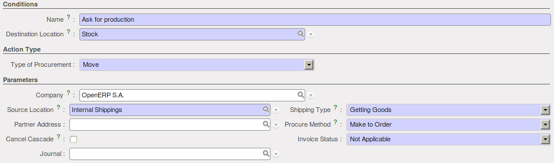
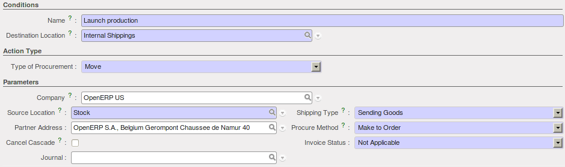
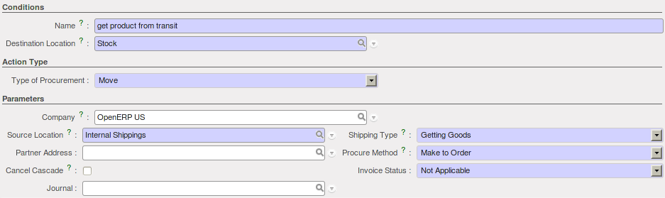

.. i18n: Stock Location Example
.. i18n: ++++++++++++++++++++++
..

库位例子
++++++++++++++++++++++

.. i18n: In this section, we will develop a more detailed example that includes different concepts seen
.. i18n: in the previous sections. 
..

在本节中，我们将用一个更详细的例子，你将看到其中包含在前面的章节中的不同的概念. 

.. i18n: The following example will use the *Stock Location types*, the *Logistic Flows* and the *Bill Of
.. i18n: Materials*.
..

下面的例子将使用库位类型 *Stock Location types*, *Logistic Flows* 和 *Bill Of Materials*.

.. i18n: We have two companies: OpenERP SA and OpenERP US.
..

我们有两个公司: OpenERP SA 和 OpenERP US.

.. i18n: We have three products: Product A, Product B and Product C. For each product, we will have to define
.. i18n: the Stock Location to determine where to take these products.
..

我们有三个产品: Product A, Product B 和 Product C. 每个产品, 我们将定义库位，以确定从那个地方来取这些产品.

.. i18n: To make one unit of Product A, we need the Product B and the Product C. So we will have to define a 
.. i18n: *Bill of Material*.
..

一个 Product A, 我们需要 Product B 和 Product C. 因此我们需要定义一个产品A的 *物料清单*.

.. i18n: .. table:: Bill of Materials
.. i18n: 
.. i18n:    =========== ==========
.. i18n:    Field       Value
.. i18n:    =========== ==========
.. i18n:    Product     Product A
.. i18n:    Product Qty 1
.. i18n:    Name        Product A
.. i18n:    BoM Type    Normal
.. i18n:    Company     OpenERP US
.. i18n:    =========== ==========
..

.. table:: Bill of Materials

   =========== ==========
   Field       Value
   =========== ==========
   Product     Product A
   Product Qty 1
   Name        Product A
   BoM Type    Normal
   Company     OpenERP US
   =========== ==========

.. i18n: The different components to produce one unit of Product A are one unit of Product B
.. i18n: and one unit of Product C.
..

一个 Product A 由一个 Product B
和一个 Product C 组成.

.. i18n: .. table:: Companies and Products
.. i18n:    
.. i18n:    ========== =====================
.. i18n:    Company    What
.. i18n:    ========== =====================
.. i18n:    OpenERP SA Sell the Product A
.. i18n:    OpenERP SA Store the Product C
.. i18n:    OpenERP US Produce the Product A
.. i18n:    OpenERP US Store the Product B
.. i18n:    ========== =====================
.. i18n:               
.. i18n: .. table:: Logistics Flows
.. i18n: 
.. i18n:    ======================== ==== ========= ======================================================
.. i18n:    Name                     Type Product   Goal of the flow
.. i18n:    ======================== ==== ========= ======================================================
.. i18n:    Ask for Production       Pull Product A OpenERP SA asks OpenERP US to produce the Product A
.. i18n:    Launch Production        Pull Product A OpenERP US launches the production of the Product A
.. i18n:    Send Product to Transit  Pull Product C OpenERP US asks for the Product C to OpenERP SA
.. i18n:    Get Product from Transit Pull Product C OpenERP US receives the Product C
.. i18n:    ======================== ==== ========= ======================================================
.. i18n:    
.. i18n: Here are the details of the different flows:
..

.. table:: Companies and Products
   
   ========== =====================
   Company    What
   ========== =====================
   OpenERP SA Sell the Product A
   OpenERP SA Store the Product C
   OpenERP US Produce the Product A
   OpenERP US Store the Product B
   ========== =====================
              
.. table:: Logistics Flows

   ======================== ==== ========= ======================================================
   Name                     Type Product   Goal of the flow
   ======================== ==== ========= ======================================================
   Ask for Production       Pull Product A OpenERP SA asks OpenERP US to produce the Product A
   Launch Production        Pull Product A OpenERP US launches the production of the Product A
   Send Product to Transit  Pull Product C OpenERP US asks for the Product C to OpenERP SA
   Get Product from Transit Pull Product C OpenERP US receives the Product C
   ======================== ==== ========= ======================================================
   
这里是各种详细的工作流:

.. i18n: .. figure:: images/ask_production.png
.. i18n: 	:scale: 75
.. i18n: 	:align: center
.. i18n: 	
.. i18n: 	*Ask for Production*
.. i18n: 	
.. i18n: .. figure:: images/launch_production.png
.. i18n: 	:scale: 75
.. i18n: 	:align: center
.. i18n: 	
.. i18n: 	*Launch Production*	
.. i18n: 	
.. i18n: .. figure:: images/send_transit.png
.. i18n: 	:scale: 75
.. i18n: 	:align: center
.. i18n: 	
.. i18n: 	*Send Product to Transit*	
..

	
	*Ask for Production*
	

	
	*Launch Production*	
	
.. figure:: images/send_transit.png
	:scale: 75
	:align: center
	
	*Send Product to Transit*	

.. i18n: .. figure:: images/get_transit.png
.. i18n: 	:scale: 75
.. i18n: 	:align: center
.. i18n: 	
.. i18n: 	*Get Product from Transit*
..

	
	*Get Product from Transit*

.. i18n: With this configuration, when a Sales Order for 3 units of Product A is confirmed and the scheduler has been launched,
.. i18n: you will have the following procurements:
..

通过这样的配置, 当销售订单确定销售 3 个 Product A 并且计划被执行,
你将得到下面的需求:

.. i18n: .. figure:: images/procurement.png
.. i18n: 	:scale: 90
.. i18n: 	:align: center
.. i18n: 	
.. i18n: 	*Procurements View*
.. i18n: 	
.. i18n: And the following stock moves have been generated:
..

.. figure:: images/procurement.png
	:scale: 90
	:align: center
	
	*Procurements View*
	
并且生成下面的库存移动:

.. i18n: .. figure:: images/stock_moves_ex.png
.. i18n: 	:scale: 90
.. i18n: 	:align: center
.. i18n: 	
.. i18n: 	*Stock Moves*
..

.. figure:: images/stock_moves_ex.png
	:scale: 90
	:align: center
	
	*Stock Moves*

.. i18n: Because we are working in two different companies, different stock moves have been generated. The products have to move 
.. i18n: from OpenERP SA to OpenERP US for the products C. After the manufacturing process, the products A have to move from
.. i18n: OpenERP US to OpenERP SA to be sold to the customer.
..

因为我们用了两个不同公司做案例, 生成了不同的库存移动. 产品从 
OpenERP SA 移动到了 OpenERP US 做为 products C. 通过制造过程后, products A 从
OpenERP US 移动到 OpenERP SA 出售给客户.

.. i18n: Once you have confirmed the different moves for the products B and C, the Manufacturing Order is in `ready to produce`
.. i18n: status. So you can run the production of the three units of Product A.
..

一旦你对 products B 和 C 配置了不同的移动, 生产订单在 `ready to produce`
状态. 你就可以开始 3个 Product A 的制造.

.. i18n: .. figure:: images/start_production.png
.. i18n: 	:scale: 75
.. i18n: 	:align: center
.. i18n: 	
.. i18n: 	*Launch the Production*
..

.. figure:: images/start_production.png
	:scale: 75
	:align: center
	
	*Launch the Production*

.. i18n: Once again due to the use of two companies, you have to confirm different deliveries. One to deliver the product 
.. i18n: from OpenERP US to OpenERP SA and another to deliver the product from OpenERP SA to the customer.
.. i18n: Now you have to confirm the delivery of the three units from OpenERP US to OpenERP SA, then to confirm the 
.. i18n: reception of the products in OpenERP SA and finally, deliver the products to you final customer.	
..

Once again due to the use of two companies, you have to confirm different deliveries. One to deliver the product 
from OpenERP US to OpenERP SA and another to deliver the product from OpenERP SA to the customer.
Now you have to confirm the delivery of the three units from OpenERP US to OpenERP SA, then to confirm the 
reception of the products in OpenERP SA and finally, deliver the products to you final customer.	

.. i18n: .. Copyright © Open Object Press. All rights reserved.
..

.. Copyright © Open Object Press. All rights reserved.

.. i18n: .. You may take electronic copy of this publication and distribute it if you don't
.. i18n: .. change the content. You can also print a copy to be read by yourself only.
..

.. You may take electronic copy of this publication and distribute it if you don't
.. change the content. You can also print a copy to be read by yourself only.

.. i18n: .. We have contracts with different publishers in different countries to sell and
.. i18n: .. distribute paper or electronic based versions of this book (translated or not)
.. i18n: .. in bookstores. This helps to distribute and promote the OpenERP product. It
.. i18n: .. also helps us to create incentives to pay contributors and authors using author
.. i18n: .. rights of these sales.
..

.. We have contracts with different publishers in different countries to sell and
.. distribute paper or electronic based versions of this book (translated or not)
.. in bookstores. This helps to distribute and promote the OpenERP product. It
.. also helps us to create incentives to pay contributors and authors using author
.. rights of these sales.

.. i18n: .. Due to this, grants to translate, modify or sell this book are strictly
.. i18n: .. forbidden, unless Tiny SPRL (representing Open Object Press) gives you a
.. i18n: .. written authorisation for this.
..

.. Due to this, grants to translate, modify or sell this book are strictly
.. forbidden, unless Tiny SPRL (representing Open Object Press) gives you a
.. written authorisation for this.

.. i18n: .. Many of the designations used by manufacturers and suppliers to distinguish their
.. i18n: .. products are claimed as trademarks. Where those designations appear in this book,
.. i18n: .. and Open Object Press was aware of a trademark claim, the designations have been
.. i18n: .. printed in initial capitals.
..

.. Many of the designations used by manufacturers and suppliers to distinguish their
.. products are claimed as trademarks. Where those designations appear in this book,
.. and Open Object Press was aware of a trademark claim, the designations have been
.. printed in initial capitals.

.. i18n: .. While every precaution has been taken in the preparation of this book, the publisher
.. i18n: .. and the authors assume no responsibility for errors or omissions, or for damages
.. i18n: .. resulting from the use of the information contained herein.
..

.. While every precaution has been taken in the preparation of this book, the publisher
.. and the authors assume no responsibility for errors or omissions, or for damages
.. resulting from the use of the information contained herein.

.. i18n: .. Published by Open Object Press, Grand Rosière, Belgium   
..

.. Published by Open Object Press, Grand Rosière, Belgium   
