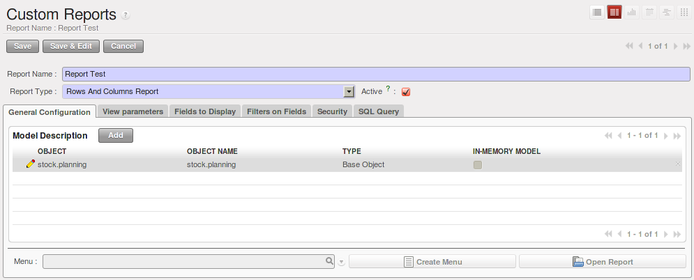

.. i18n: Estimating Delivery Dates
.. i18n: =========================
..

估算交付日期
=========================

.. i18n: Standard Delivery Time
.. i18n: ----------------------
..

标准交付时间
----------------------

.. i18n: In order to define the delivery time, you have to know three things:
..

在订单中的标准交付时间,有下面三种含义:

.. i18n: * Customer Lead Time : 
..

* 客户交付时间 : 

.. i18n:   That is the time you promise to your customer for a delivery. It corresponds to the average delay
.. i18n:   between the confirmation of the customer order and the delivery of the finished goods. It can be
.. i18n:   defined in the product form, in the :guilabel:`Procurement and Locations` tab.
.. i18n:   
.. i18n:   This time will be influenced by the Manufacturing Lead Time and the Delivery Lead Time.
.. i18n:   
.. i18n: * Manufacturing Lead Time :
..

  即你向客户承诺的交货时间. It corresponds to the average delay
  between the confirmation of the customer order and the delivery of the finished goods. It can be
  defined in the product form, in the :guilabel:`Procurement and Locations` tab.
  
  This time will be influenced by the Manufacturing Lead Time and the Delivery Lead Time.
  
* 生产交付时间 :

.. i18n:   This is the time you need to produce one unit of a product. If this product needs other sub-products,
.. i18n:   the different manufacturing times will be summed. It can also be defined in the product form, in the 
.. i18n:   :guilabel:`Procurement and Locations` tab.
.. i18n:   
.. i18n: * Delivery Lead Time :
..

  指你生产一个生产单位的产品所需的时间. 如果产品由多个半成品组成,则需要加上各个半成品的生产时间. 
  这个时间需要在产品页面的 guilabel:`生产与库位(Procurement and Locations)` 页签中去设置.
  
* 运送间隔时间 :

.. i18n:   This is the time your supplier needs to deliver the goods. This delay can be defined in the product form
.. i18n:   in the :guilabel:`Suppliers` tab.
.. i18n:   
.. i18n: For example, if we have to deliver some products to a customer in a month (in 30 days). You promise to deliver
.. i18n: the goods to the customer within 10 days, the manufacturing time is equal to 4 days and our suppliers deliver 
.. i18n: the raw materials within 3 days.
..

  指你的供应商需要的送货时间. 在产品页的 :guilabel:`供应商(Suppliers)` 页签中去设置.
  
For example, if we have to deliver some products to a customer in a month (in 30 days). You promise to deliver
the goods to the customer within 10 days, the manufacturing time is equal to 4 days and our suppliers deliver 
the raw materials within 3 days.

.. i18n: According to those numbers, we will have to start the process in 23 days if we have to order raw materials.
.. i18n:     
.. i18n: Schedule Logistic Flows according to MRP1 Rules 
.. i18n: -----------------------------------------------
..

According to those numbers, we will have to start the process in 23 days if we have to order raw materials.
    
依据MRP1规则的定期物流
-----------------------------------------------

.. i18n: MRP is a software-based production, planning and inventory control system used to manage the manufacturing process.
..

MRP is a software-based production, planning and inventory control system used to manage the manufacturing process.

.. i18n: It is a computer-based system in which the given Master Schedule is exploded with Bills Of 
.. i18n: Material, into the required amount of raw material, parts and subassemblies needed to produce 
.. i18n: the final products in each period.
..

It is a computer-based system in which the given Master Schedule is exploded with Bills Of 
Material, into the required amount of raw material, parts and subassemblies needed to produce 
the final products in each period.

.. i18n: Incoming and Outgoing Products Planning
.. i18n: ========================================
..

收入和发出产品计划
========================================

.. i18n: To be able to plan incoming and outgoing shipments of products, you have to install the module
.. i18n: :guilabel:`stock_planning`. 
..

要控制管理好收/发货时间计划, 你要安装模块: :guilabel:`stock_planning`. 

.. i18n: .. figure:: images/stock_forecast.png
.. i18n: 	:scale: 75
.. i18n: 	:align: center
.. i18n: 	
.. i18n: 	*Planning the Deliveries of Customer Products*
..

.. figure:: images/stock_forecast.png
	:scale: 75
	:align: center
	
	*预计送货日期*

.. i18n: Thanks to this module, you will be able to calculate a planning of the stock for a product.
..

使用本模块,你可以大致估算出产品的预计送货日期.

.. i18n: Planned dates on a packing order are put in each stock move line. If you have a packing order 
.. i18n: containing several products, not all of the lines necessarily need to be delivered the same day. 
.. i18n: The minimum and maximum dates in a packing order show the earliest and latest dates on the stock 
.. i18n: move lines for the packing.
..

Picking单的交付日期会传递到单据明细上面去. 由于一次收/发货可能会有多个产品,所以,根据每个产品可以出的送货日期可以得到该
收/发货的最早及最迟日期.

.. i18n: If you move a packing order in the calendar view, the planned date in the stock move lines will 
.. i18n: automatically be moved as a result.
..

在日历视图上, 直接拖动单据, 可以直接修改相应数据的计划日期.

.. i18n: Managing Inventory Reconciliation
.. i18n: =================================
..

管理库存盘点
=================================

.. i18n: Inventory reconciliation involves two steps: physical and accounting.
..

盘点要控制两个点: 实物与账务.

.. i18n: Physical inventory steps include taking a written inventory record and comparing it to the actual 
.. i18n: goods in the company’s warehouses. Counting obsolete and damaged products is also a reconciliation 
.. i18n: activity. 
..

实物盘点则是通过对实际的物理库位上的产品进行纸质盘点,并且数量含过期与损坏的产品.

.. i18n: Reconciliation steps on the accounting side include verification that all inventory purchases are 
.. i18n: posted, entering adjustments from the physical count and analysing the dollar differences between months.
.. i18n: Inventory reconciliation frequency depends on the size, location, and type of inventory in a company’s 
.. i18n: operations.
..

Reconciliation steps on the accounting side include verification that all inventory purchases are 
posted, entering adjustments from the physical count and analysing the dollar differences between months.
Inventory reconciliation frequency depends on the size, location, and type of inventory in a company’s 
operations.

.. i18n: Building Reports to Track Activity 
.. i18n: ==================================
..

物料追溯报表
==================================

.. i18n: With OpenERP, you can build your own reports in order to track the different activities in your warehouses.
.. i18n: To create your own reports, you have to install the :guilabel:`base_report_creator`. It will add a 
.. i18n: submenu in :menuselection:`Administration --> Customization --> Reporting`.
..

OpenERP可以创建灵活的物料追溯报表. 创建报表请先安装 :guilabel:`base_report_creator` 模块,并在菜单
:menuselection:`设置(Administration) --> 自定义(Customization) --> 报表(Reporting)` 中去新建.

.. i18n: .. figure:: images/report_creation.png
.. i18n: 	:scale: 75
.. i18n: 	:align: center
.. i18n: 	
.. i18n: 	*Create your Own Reports*
..

	
	*创建自定义报表*

.. i18n: This newly added section allows you to define for your new report:
..

您可以打开最近使用过的报表:

.. i18n: * The general configuration:
..

* 常规配置:

.. i18n:   The aim of this tab is to choose the models your report will rely on.
..

  The aim of this tab is to choose the models your report will rely on.

.. i18n: * The view parameters
.. i18n:   
.. i18n:   This tab will define the display of your report. You can choose between the traditional available views
.. i18n:   (Tree/List, Form, Graph and Calendar) and you can define three different ways to display your report.
.. i18n: 
.. i18n: * The fields to display
..

* 视图参数
  
  This tab will define the display of your report. You can choose between the traditional available views
  (Tree/List, Form, Graph and Calendar) and you can define three different ways to display your report.

* 显示字段

.. i18n:   The fields available to display will depend on the models you choose in the :guilabel:`General Configuration`
.. i18n:   tab.
.. i18n:   
.. i18n:   When you add a new field to your report, different fields have to be specified:
.. i18n:   
.. i18n:   * Sequence - defines the order in which the fields will be displayed in the report
.. i18n:   * Field - the information you want to display in your report
.. i18n:   * Grouping method - affects the way the field is displayed. You can choose between *Grouped*, *Sum*,
.. i18n:     *Minimum*, *Count*, *Maximum* and *Average*
.. i18n:   * Graph mode - defines which axe of the graph the field will represent
.. i18n:   * Calendar mode - defines the meaning of the field for the calendar (*Starting or Ending date*,
.. i18n:     *Delay*, *End Date*, *Unique Colours*)
..

  The fields available to display will depend on the models you choose in the :guilabel:`General Configuration`
  tab.
  
  When you add a new field to your report, different fields have to be specified:
  
  * Sequence - defines the order in which the fields will be displayed in the report
  * Field - the information you want to display in your report
  * Grouping method - affects the way the field is displayed. You can choose between *Grouped*, *Sum*,
    *Minimum*, *Count*, *Maximum* and *Average*
  * Graph mode - defines which axe of the graph the field will represent
  * Calendar mode - defines the meaning of the field for the calendar (*Starting or Ending date*,
    *Delay*, *End Date*, *Unique Colours*)

.. i18n: * The filters on fields
..

* 过滤项

.. i18n:   This tab will let you choose which data to display according to the value of a field. It is possible to 
.. i18n:   manually modify or add new filters according to your needs.
..

  This tab will let you choose which data to display according to the value of a field. It is possible to 
  manually modify or add new filters according to your needs.

.. i18n: * The security
.. i18n:   
.. i18n:   The security tab is used to select the groups that are able to display the report.
.. i18n:   
.. i18n: .. tip:: Create Report with OpenOffice
.. i18n:    
.. i18n:    You can also create or edit reports with OpenOffice using the :guilabel:`base_report_designer`
.. i18n:    module.
.. i18n:    
.. i18n:    In order to add the extension to OpenOffice, load this module and start the configuration. A new 
.. i18n:    window will ask you to *Save As* a file that contains the extension. 
.. i18n:    
.. i18n:    Once you have saved the file, start OpenOffice and go to :menuselection:`Tools --> Extension Manager`, 
.. i18n:    then click Add and select the previously saved file. Restart OpenOffice.org and now you have the
.. i18n:    extension installed.
.. i18n:    
.. i18n:    .. figure:: images/report_creator_openoffice.png
.. i18n:    		:scale: 50
.. i18n:    		:align: center
.. i18n:    		
.. i18n:    		*Extension to Create a Report in OpenOffice*
.. i18n:    		
..

* 安全项
  
  安全页签用于控制哪些用户组可以显示报表.

.. tip:: 用 OpenOffice 创建报表
   
   安装模块 :guilabel:`base_report_designer` 后,你就可以利用 OpenOffice 方便地创建与修改报表.

   In order to add the extension to OpenOffice, load this module and start the configuration. A new 
   window will ask you to *Save As* a file that contains the extension. 
   
   Once you have saved the file, start OpenOffice and go to :menuselection:`Tools --> Extension Manager`, 
   then click Add and select the previously saved file. Restart OpenOffice.org and now you have the
   extension installed.
   
   .. figure:: images/report_creator_openoffice.png
   		:scale: 50
   		:align: center
   		
   		*Extension to Create a Report in OpenOffice*
   		

.. i18n: .. Copyright © Open Object Press. All rights reserved.
..

.. Copyright © Open Object Press. All rights reserved.

.. i18n: .. You may take electronic copy of this publication and distribute it if you don't
.. i18n: .. change the content. You can also print a copy to be read by yourself only.
..

.. You may take electronic copy of this publication and distribute it if you don't
.. change the content. You can also print a copy to be read by yourself only.

.. i18n: .. We have contracts with different publishers in different countries to sell and
.. i18n: .. distribute paper or electronic based versions of this book (translated or not)
.. i18n: .. in bookstores. This helps to distribute and promote the OpenERP product. It
.. i18n: .. also helps us to create incentives to pay contributors and authors using author
.. i18n: .. rights of these sales.
..

.. We have contracts with different publishers in different countries to sell and
.. distribute paper or electronic based versions of this book (translated or not)
.. in bookstores. This helps to distribute and promote the OpenERP product. It
.. also helps us to create incentives to pay contributors and authors using author
.. rights of these sales.

.. i18n: .. Due to this, grants to translate, modify or sell this book are strictly
.. i18n: .. forbidden, unless Tiny SPRL (representing Open Object Press) gives you a
.. i18n: .. written authorisation for this.
..

.. Due to this, grants to translate, modify or sell this book are strictly
.. forbidden, unless Tiny SPRL (representing Open Object Press) gives you a
.. written authorisation for this.

.. i18n: .. Many of the designations used by manufacturers and suppliers to distinguish their
.. i18n: .. products are claimed as trademarks. Where those designations appear in this book,
.. i18n: .. and Open Object Press was aware of a trademark claim, the designations have been
.. i18n: .. printed in initial capitals.
..

.. Many of the designations used by manufacturers and suppliers to distinguish their
.. products are claimed as trademarks. Where those designations appear in this book,
.. and Open Object Press was aware of a trademark claim, the designations have been
.. printed in initial capitals.

.. i18n: .. While every precaution has been taken in the preparation of this book, the publisher
.. i18n: .. and the authors assume no responsibility for errors or omissions, or for damages
.. i18n: .. resulting from the use of the information contained herein.
..

.. While every precaution has been taken in the preparation of this book, the publisher
.. and the authors assume no responsibility for errors or omissions, or for damages
.. resulting from the use of the information contained herein.

.. i18n: .. Published by Open Object Press, Grand Rosière, Belgium
..

.. Published by Open Object Press, Grand Rosière, Belgium
