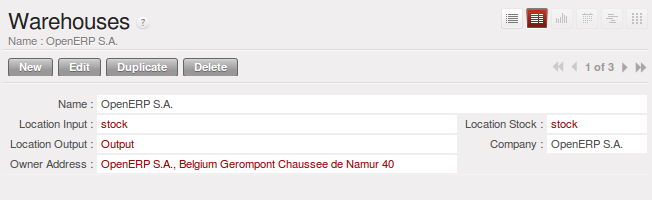
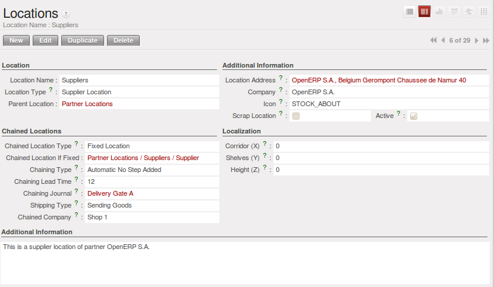
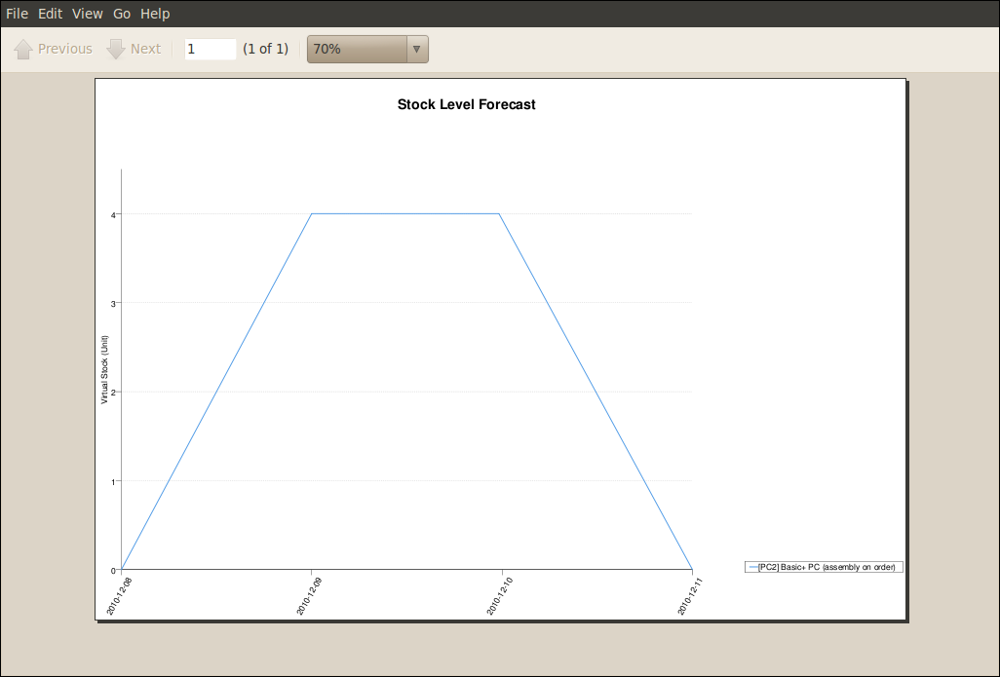

.. i18n: Managing Physical Inventory Structure
.. i18n: =====================================
..

管理实际库存结构
=====================================

.. i18n: .. index::
.. i18n: 	single: Stock; Warehouse
.. i18n: 	
.. i18n: Warehouse
.. i18n: ---------
..

.. index::
	single: Stock; Warehouse
	
仓库
---------

.. i18n: Warehouses are designed for physical locations from which you can deliver to the customer, and to which you
.. i18n: receive raw materials. When you buy products from a supplier, you should take account of the Warehouse you use
.. i18n: for this purchase. This also enables the end user to not have to choose from a list of locations, but simply a
.. i18n: real warehouse.
.. i18n: Use the menu :menuselection:`Warehouse --> Configuration --> Warehouse Management --> Warehouses`, then click New to 
.. i18n: configure a new warehouse.
..

仓库是设计用于向客户进行交付活动或是接收原材料的实际场所。
当你从供应商处购买产品时，你应该考虑这次采购所要使用的仓库。这也使得最终用户不必从库位列表中进行选择，而是一个真实的仓库

使用菜单 :menuselection:`仓库 --> 设置 --> 仓库管理 --> 仓库`, 然后点击新建配置一个新的仓库.

.. i18n: A warehouse is defined by a link between three locations:
..

A warehouse is defined by a link between three locations:

.. i18n: * The :guilabel:`Location Stock` field shows the place of products available for delivery to a customer directly from
.. i18n:   this warehouse. Availability is given by all the products in that location and any child locations.
.. i18n: 
.. i18n: * The :guilabel:`Location Input` field shows where ordered products are received from a supplier in that warehouse. It
.. i18n:   can be the same as the stock location if, for example, you want to do a quality control operation on
.. i18n:   your incoming raw materials.
.. i18n: 
.. i18n: * The :guilabel:`Location Output` field (called ``Output`` in the demonstration database) is designed as a buffer zone
.. i18n:   in which you store all the items that have been picked, but not yet delivered to a customer. You are
.. i18n:   strongly advised not to put this location within the stock hierarchy but instead at a higher level or at the same level.
.. i18n:   
.. i18n: .. figure:: images/stock_warehouse.png
.. i18n: 	:scale: 75
.. i18n: 	:align: center
.. i18n: 	
.. i18n: 	*Warehouse Parameters*
.. i18n:   
.. i18n: You can also set an address for the warehouse. This address should ideally be an address of your company. Once
.. i18n: the warehouse has been defined, it can be used in:
.. i18n: 
.. i18n: * Minimum stock rules,
.. i18n: 
.. i18n: * Supplier orders,
.. i18n: 
.. i18n: * Customer orders (using the definition of a point of sale, which is linked to a warehouse).
..

* :guilabel:`库位库存` 字段显示了可以直接从这个仓库交付给客户的可用的产品. 
  可用数 给出在这个库位以及子库位的所有产品。

* The :guilabel:`Location Input` field shows where ordered products are received from a supplier in that warehouse. It
  can be the same as the stock location if, for example, you want to do a quality control operation on
  your incoming raw materials.

* The :guilabel:`Location Output` field (called ``Output`` in the demonstration database) is designed as a buffer zone
  in which you store all the items that have been picked, but not yet delivered to a customer. You are
  strongly advised not to put this location within the stock hierarchy but instead at a higher level or at the same level.
  

	
	*仓库参数*
  

你也能为仓库设置一个地址。这个地址应该是你的公司的一个地址。一旦仓库被定义，你能用在：

* 最小库存规则,

* 供应商订单,

* 客户订单 (用在 POS的定义，关联到一个仓库).

.. i18n: Automatic Procurement
.. i18n: ^^^^^^^^^^^^^^^^^^^^^
..

自动产生需求
^^^^^^^^^^^^^^^^^^^^^

.. i18n: Several methods of automatically procuring products can be carried out by OpenERP:
..

OpenERP 有多种自动供应(procurement)产品的方法：

.. i18n: * the workflow used by products that have the procurement method *Make to Order*,
.. i18n: 
.. i18n: * using minimum stock rules for *Make to Stock* products,
.. i18n: 
.. i18n: * using the master production schedule for *Make to Stock* products.
..

* the workflow used by products that have the procurement method *Make to Order*,

* 对于*Make to Stock*产品(存货制造)，可以使用最小库存规则

* 对于*Make to Stock*产品(存货制造)，使用主生产计划(Master Production Schedule)

.. i18n: The last two methods are described below.
..

The last two methods are described below.

.. i18n: Minimum Stock Rules
.. i18n: ^^^^^^^^^^^^^^^^^^^
..

最小库存规则
^^^^^^^^^^^^^^^^^^^

.. i18n: To automatically make stock replenishment proposals, you can use minimum stock rules. Go to the menu
.. i18n: :menuselection:`Warehouse --> Automatic Procurements --> Minimum Stock Rules`.
..

当希望自动产生补货请求是，你可以使用最小库存规则. 菜单路径：
:menuselection:`Warehouse --> Automatic Procurements --> Minimum Stock Rules`.

.. i18n: The rule is the following: if the virtual stock for the given location is lower than the minimum stock indicated in
.. i18n: the rule, the system will automatically propose a procurement to increase the level of virtual stock to the
.. i18n: maximum level given in the rule.
..

规则如下：如果指定地点(location)的虚拟库存(virtual stock)比规则中指定的最小库存量少，
系统会自动建议采购，增加虚拟库存(virtual stock)的数量至规则中规定的最大值

.. i18n: .. figure:: images/stock_min_rule.png
.. i18n: 	:scale: 75
.. i18n: 	:align: center
.. i18n: 	
.. i18n: 	*List of Minimum Stock Rules*
.. i18n: 	
.. i18n: .. tip:: Conflict Resolution
.. i18n: 
.. i18n:    You may find draft production or procurement orders to be created although they should not exist.
.. i18n:    That can happen if the system is badly configured (for example, if you have forgotten to set the
.. i18n:    supplier on a product).
.. i18n: 
.. i18n:    To check this, look at the list of procurements in the exception state in the menu
.. i18n:    :menuselection:`Warehouse --> Schedulers --> Procurement Exceptions`. More
.. i18n:    details about processing these exceptions is given in :ref:`ch-mnf`.
..

.. figure:: images/stock_min_rule.png
	:scale: 75
	:align: center
	
	*List of Minimum Stock Rules*
	
.. tip:: Conflict Resolution

   You may find draft production or procurement orders to be created although they should not exist.
   That can happen if the system is badly configured (for example, if you have forgotten to set the
   supplier on a product).

   To check this, look at the list of procurements in the exception state in the menu
   :menuselection:`Warehouse --> Schedulers --> Procurement Exceptions`. More
   details about processing these exceptions is given in :ref:`ch-mnf`.

.. i18n: We underline that the rule is based on *virtual* quantities and not just on real
.. i18n: quantities. It takes into account the calculation of orders and receipts to come.
..

We underline that the rule is based on *virtual* quantities and not just on real
quantities. It takes into account the calculation of orders and receipts to come.

.. i18n: Take the following example:
..

如下面的例子：

.. i18n: * Products in stock: 15
.. i18n: 
.. i18n: * Products ordered but not delivered: 5
.. i18n: 
.. i18n: * Products in manufacturing: 2
..

* 库存中的产品数量：15

* 已下单(Sales Order?)但是未发货的数量：5

* 在制数量：2

.. i18n: The rules defined are:
..

定义的规则为：

.. i18n: * Minimum stock: 13
.. i18n: 
.. i18n: * Maximum stock: 25.
..

* 最小库存: 13

* 最大库存: 25.

.. i18n: Once the rules have been properly configured, the purchasing manager only needs to look at the list
.. i18n: of orders for confirmation with the supplier using the menu :menuselection:`Purchases --> Purchase Management -->
.. i18n: Requests for Quotation`.
..

一旦规则被正确设置，采购经理只需要查看订单(采购订单)列表与供应商进行确认，菜单路径为 :menuselection:`Purchases --> Purchase Management -->
Requests for Quotation`.

.. i18n: .. note:: Procurement
.. i18n: 
.. i18n:    Note that the procurement does not require that you buy from a supplier. If the product has a
.. i18n:    :guilabel:`Supply Method` ``Produce``, the scheduler will generate a Manufacturing order instead of a
.. i18n:    supplier order.
..

.. note:: Procurement
   
   注意，供应请求不一定要求你从供应商处购买，如果产品有一个属性
   :guilabel:`Supply Method` ``Produce``,(注：即供应方式为生产) 
   主生产计划(scheduler)会产生一个生产工单，而不是一个采购订单

.. i18n: You can also set multiple quantities in the minimum stock rules. If you set a multiple quantity of 3
.. i18n: the system will propose procurement of 15 pieces, and not the 13 it really needs. In this case, it
.. i18n: automatically rounds the quantity upwards.
..

你也可以在规则中设置最小包装量(multiple quantities). 如果你设置的最小包装量为3，系统会建议一个15pieces的供应，
而不是真正需要的13。在这种情况下，系统会自动根据最小包装量取上整数。（注：即根据最小包装取整，多买一个最小包装的量）

.. i18n: .. note:: Maximum Quantity
.. i18n: 
.. i18n: 	Pay attention to the fact that the maximum quantity is not the maximum you will have in stock. 
.. i18n: 	If we take the following situation: a company has 10 pieces of product with minimum stock rules defined 
.. i18n: 	for this product by `Min quantity = 10`, `Max quantity = 30` and `Qty multiple = 12`. If an order of 2 
.. i18n: 	pieces comes, a purchase of 24 pieces order will be executed. The first 12 pieces will be ordered to reach
.. i18n: 	the minimum quantity and the other 12 to reach the maximum quantity. At the end, the stock of this product 
.. i18n: 	will be equal to 32 pieces.
..

.. note:: Maximum Quantity

        注意一个事实，最大数量不是你库存的最大量。
        比如：一个公司有10 pieces的产品，最小库存规则设置为，`最小数量 = 10`, `最大数量 = 30` 及 `最小包装 = 12`
        如果有一个预计的2 piece订单（销售订单），系统执行计算后会产生一个24 pieces的采购需求。
        第一个12 pieces会用于达到最小数量，第二个12 pieces用于达到最大数量。

.. i18n: In a minimum stock rule, when you indicate a warehouse, it suggests a stock location by default in
.. i18n: that warehouse. You can change that default location when the scheduler completes.
..

In a minimum stock rule, when you indicate a warehouse, it suggests a stock location by default in
that warehouse. You can change that default location when the scheduler completes.

.. i18n: .. index::
.. i18n: 	single: Stock; Location
.. i18n: 	
.. i18n: Location
.. i18n: --------
..

.. index::
	single: Stock; Location
	
库位
----

.. i18n: A location is one component of the warehouses that is used to managed all types of storage places, such as at the 
.. i18n: customer's and production counterparts.
..

一个库位（或 货位）是仓库中的一个组成部分，用来管理所有类型的库存位置。 such as at the 
customer's and production counterparts.

.. i18n: There are different types of locations that allow you to structure your warehouses according to your needs.
.. i18n: Locations are structured hierarchically to account for the subdivision of a warehouse into sections, aisles, and/or
.. i18n: cupboards. The hierarchical view also enables you to structure virtual locations such as production counterparts.
.. i18n: That gives you a finer level of analysis.
.. i18n: Go to the menu :menuselection:`Warehouse --> Configuration --> Warehouse Management --> Locations`, then click New 
.. i18n: to define new locations.
..

根据你的需求，在你（在系统中）构建你的仓库时候，可以设置不同类型的库位。
Locations are structured hierarchically to account for the subdivision of a warehouse into sections, aisles, and/or
cupboards.
(译：库位是多层级结构的，用于将仓库分为更小的子层级，如 区域、通道 或者 cupboards(货架？))
The hierarchical view also enables you to structure virtual locations such as production counterparts.
That gives you a finer level of analysis.
Go to the menu :menuselection:`Warehouse --> Configuration --> Warehouse Management --> Locations`, then click New 
to define new locations.

.. i18n: .. figure:: images/stock_location_form.png
.. i18n: 	:scale: 75
.. i18n: 	:align: center
.. i18n: 	
.. i18n: 	*Defining a new Stock Location*
..

	
	*定义新库位*

.. i18n: Here are the different available types of locations:
..

下面是几种常见的库位:

.. i18n: .. index::
.. i18n:    single: Stock; Location types
.. i18n:    
.. i18n: * ``Supplier Location``: virtual location representing the source location for products received from suppliers,
..

.. index::
   single: Stock; Location types
   
* ``供应商库位``: 虚拟货位，代表产品是从供应商处接收的(如收货时候，源货位就是供应商货位，代表供应商库存减少)

.. i18n: * ``View``: shows that the location is only an organizational node for the hierarchical structure, and
.. i18n:   cannot be involved in stock moves itself. The view type is not made into a leaf node in a
.. i18n:   structure – it usually has children.
.. i18n:   
.. i18n: * ``Internal Location``: physical location inside your own stock,
.. i18n: 
.. i18n: * ``Customer Location``: virtual location representing the destination for products sent to customers,
.. i18n: 
.. i18n: * ``Inventory``: virtual location serving as the counterpart for inventory operations used to correct stock levels (physical inventories),
.. i18n: 
.. i18n: * ``Procurement``: virtual location serving as temporary counterpart for procurement operations when you do not yet know the source (supplier or production). Products in this location should be zero after the scheduler run
.. i18n:   completes,
.. i18n:   
.. i18n: * ``Production``: virtual counterpart location for production operations; consuming raw material and sending
.. i18n:   finished products,
.. i18n: 
.. i18n: * ``Transit Location for Inter-Companies Transfers``: used as an intermediate location in a multi-company environment.
..

* ``视图库位``: shows that the location is only an organizational node for the hierarchical structure, and
  cannot be involved in stock moves itself. The view type is not made into a leaf node in a
  structure – it usually has children.
  
* ``内部库位``:  您仓库中的物理货位

* ``客户库位``: 虚拟货位，表示货物发送给了客户，(如销售订单发货后，客户货位增加，表示已经发给了客户)

* ``盘点/损耗库位``: virtual location serving as the counterpart for inventory operations used to correct stock levels (physical inventories),

* ``Procurement``: virtual location serving as temporary counterpart for procurement operations when you do not yet know the source (supplier or production). Products in this location should be zero after the scheduler run
  completes,
  
* ``生产库位``: 生产过程的虚拟货位，用来记录原材料消耗(发放至此货位)以及成品完工来源

* ``多公司间中转库位``: 用于多组织环境中的中间过程货位。(如两个组织间调拨时候，货物仍在途的情况)

.. i18n: You can have several locations of the same type. In that case, your product, supplier and warehouse configurations
.. i18n: determine the location that is to be used for any given operation.
..

You can have several locations of the same type. In that case, your product, supplier and warehouse configurations
determine the location that is to be used for any given operation.

.. i18n: Location Addresses
.. i18n: ^^^^^^^^^^^^^^^^^^
.. i18n: Each location can have a specific address that enables you to create a location for a customer or a supplier, for
.. i18n: example. You can then give it the address of that customer or supplier. Go to the partner form to tell OpenERP it should use this location rather than the default location given to partner deliveries.
..

库位地址
^^^^^^^^^^^^^^^^^^
每个库位可以指定一个地址，使你能够给客户或者供应商建立一个库位。
如：你能够设置库位地址为供应商或者客户的地址。
去 业务合作伙伴 界面，告诉OpenERP，他应该使用这个库位，而不是默认库位
(Go to the partner form to tell OpenERP it should use this location rather than the default location given to partner deliveries.)

.. i18n: .. tip:: Subcontracting Production
.. i18n: 
.. i18n: 	You will see in the on line chapter Manufacturing that it is possible to assign a location to a manufacturing workcenter.
.. i18n: 	If this location is at a suppliers, you must give it an address so that OpenERP can prepare a delivery order for
.. i18n: 	the supplier and a receive operation for the manufactured goods.
.. i18n: 	Creating a location specifically for a partner is also a simple solution for handling consigned stocks in OpenERP.
..

.. tip:: Subcontracting Production

	You will see in the on line chapter Manufacturing that it is possible to assign a location to a manufacturing workcenter.
	If this location is at a suppliers, you must give it an address so that OpenERP can prepare a delivery order for
	the supplier and a receive operation for the manufactured goods.
	Creating a location specifically for a partner is also a simple solution for handling consigned stocks in OpenERP.

.. i18n: .. note:: Consigned Stock
.. i18n: 
.. i18n: 	Consigned stock is stock that is owned by you (valued in your accounts), but is physically stocked by your supplier.
.. i18n: 	Or, conversely, it could be stock owned by your customer (not valued by you), but stocked in your company. Make sure
.. i18n: 	that you create consignment locations as part of your internal stock.
..

.. note:: 托管库存(Consigned Stock)

	Consigned stock is stock that is owned by you (valued in your accounts), but is physically stocked by your supplier.
	Or, conversely, it could be stock owned by your customer (not valued by you), but stocked in your company. Make sure
	that you create consignment locations as part of your internal stock.

.. i18n: To enable you to easily consolidate at a higher level, the location definition is hierarchical. This structure is
.. i18n: given by the field ``Parent Location``. That also enables you to manage complex cases of product localization.
..

To enable you to easily consolidate at a higher level, the location definition is hierarchical. This structure is
given by the field ``Parent Location``. That also enables you to manage complex cases of product localization.

.. i18n: For example, you could imagine the following scenario: **One Company with Two Warehouses**
..

例如，你可以想象一下以下场景：*一个公司有两个仓库*

.. i18n: A company has a warehouse in Paris and in Bordeaux. For some orders, you have to deliver the products from Paris,
.. i18n: and for others from Bordeaux. But you should also specify a fictitious warehouse that OpenERP uses to calculate
.. i18n: whether it should deliver products from Paris or from Bordeaux.
.. i18n: To do this in OpenERP, you would create a third warehouse ‘France’ which consolidates the warehouses in Paris
.. i18n: and Bordeaux. You create the following physical locations:
..

一个公司有两个仓库，一个在巴黎，一个在波尔多。对于某些销售订单，你需要从巴黎发货，另外一些订单需要由波尔多进行发货。
但你仍需要指定一个虚拟的仓库给OpenERP,让系统计算他应该由巴黎还是波尔多进行发货。
在OpenERP里面，你可以设置一个(虚拟)仓库“法国”，组合(consolidates)了巴黎仓库和波尔多仓库。
(注：也就是设定了 法国.巴黎，以及 法国.波尔多 ？)
你建立了以下物理库位：

.. i18n: * Company
.. i18n: 
.. i18n:   * Output
.. i18n: 
.. i18n:     * Warehouses France
.. i18n: 
.. i18n:       * Warehouse Paris
.. i18n: 
.. i18n:       * Warehouse Bordeaux			
.. i18n: 			
.. i18n: OpenERP will then deliver the goods from the warehouse that has the ordered product in stock. When products
.. i18n: are available in several warehouses, OpenERP will select the nearest warehouse. To formalize the notion of
.. i18n: distance between warehouses you should use the geographic co-ordinates (X, Y, Z) of the different stores to
.. i18n: enable OpenERP to search for the nearest goods.
.. i18n: The same co-ordinates could also be used to structure the shelves, aisles and interior rooms in a warehouse.
..

* Company

  * Output

    * Warehouses France

      * Warehouse Paris

      * Warehouse Bordeaux			
	
OpenERP会从有产品库存的仓库发货。
当产品在几个仓库均有货时，OpenERP会选择最近的仓库(进行发货)。
为了让系统知道仓库之间的距离，你需要为每个仓库设置地理坐标(X,Y,Z)，以便OpenERP搜索最近的货物。
同样，坐标可以用于构建仓库的货架、货道和内部房间。(注：即仓库内部坐标)

.. i18n: Linked Locations
.. i18n: ^^^^^^^^^^^^^^^^
..

链式库位
^^^^^^^^^^^^^^^^

.. i18n: Locations in OpenERP can be linked between each other to define paths followed by products. So you can define
.. i18n: rules such as: all products that enter the warehouse should automatically be sent to quality control. The warehouse
.. i18n: and quality control are represented by two different locations.

OpenERP中的库位是可以相互链接在一起，以定义产品的路径的。
因此你能够定义如下规则：所有进入仓库的产品会自动的发送至质量监控(即检验货位)。
仓储和质检由两个不同的货位表示(即类似于收货时，在一个货位做质检，另外一个货位做储存)

.. i18n: Then when a product arrives in a location, OpenERP can automatically suggest that you send the product to
.. i18n: another linked location. Three link modes are available:
..

这样，当一个货物到达库位时候，OpenERP会自动建议你将货物发送到一个链接的库位。
有3种链接的模式：

.. i18n: * Manual Operation,
.. i18n: * Automatic Move,
.. i18n: * Automatic No Step Added.
..

* 手工操作(Manual Operation),
* 自动移动(Automatic Move),
* 自动无步骤添加(Automatic No Step Added).

.. i18n: The *Manual Operation* mode will create an internal move order to the linked location once products arrive in the
.. i18n: source locations. This order will wait for a confirmation of the move by a user. This enables you to have a list of
.. i18n: moves to do, proposed by the system and confirmed by the storesperson. 

*手工操作* 模式，一旦货物到达源库位，(系统)会创建一张内部物料搬运单(从当前库位)至链接库位
物料搬运单会等待用户的确认(confirmation of the move)。
This enables you to have a list of moves to do, 
物料搬运单由系统建议，由仓管员(storesperson)确认。

.. i18n: The *Automatic Move* mode will do the same, but will not wait for a confirmation from the user. Products will automatically be sent to the linked location without any intervening manual operation to do. This corresponds to the case where, for simplicity, you delete a step in the process so the end user can set off the process automatically.

*自动移动(Automatic Move)* 模式会做相同的事情,但不会等待一个用户的确认(即移动步骤系统自动完成了)。
不需要人工的接入，产品会自动发送到链接库位。
这适合于，为了简化操作，你删除了系统上的一个操作步骤，用户自己完成这个(物理的)操作流程。
(即系统上少操作一步，但是现实中库存人员还是做了两步，如检验-入库)

.. i18n: The *Automatic No Step Added* mode will not include the additional stock move, but will change the destination
.. i18n: move transparently to assign the linked location. You could then assign a destination location to which you
.. i18n: send all the products that arrive in your warehouse. The storesperson will modify the goods receipt note.

*自动无步骤添加(Automatic No Step Added)* 模式不会包含额外的库存移动，但会透明的将目标库位进行更改至链接库位。(即直接更改目标库位，不会产生上面两个模式中的物料搬运单)
You could then assign a destination location to which you
send all the products that arrive in your warehouse. The storesperson will modify the goods receipt note.

.. i18n: .. tip:: Product Logistics
.. i18n: 
.. i18n: 	The module ``stock_location`` lets you generate paths to follow, not just at the level of locations, but also at the
.. i18n: 	level of products. It then enables you to manage default locations for a given product or to refer to the products
.. i18n: 	as a function of operations such as quality control, supplier receipt, and after-sales service.
.. i18n: 	
.. i18n: 	A more detailed explanation of this module, with examples, is given at the end of this chapter.
.. i18n: 	
.. i18n: If there is linking to do, the **Chained Location Type** field allows you to determine the destination location. If the field
.. i18n: is set to ‘Customer’, the location is given by the properties of the partner form. If the field is set to `fixed`, the
.. i18n: destination location is given by the field **Chained Location If Fixed**.
..

.. tip:: Product Logistics

	The module ``stock_location`` lets you generate paths to follow, not just at the level of locations, but also at the
	level of products. It then enables you to manage default locations for a given product or to refer to the products
	as a function of operations such as quality control, supplier receipt, and after-sales service.
	
	A more detailed explanation of this module, with examples, is given at the end of this chapter.
	
If there is linking to do, the **Chained Location Type** field allows you to determine the destination location. If the field
is set to ‘Customer’, the location is given by the properties of the partner form. If the field is set to `fixed`, the
destination location is given by the field **Chained Location If Fixed**.

.. i18n: Some operations take a certain time between order and execution. To account for this lead time, you can set a
.. i18n: value in days in the field **Chaining Lead Time**. Then the extra move (automatic or not) will be carried out several
.. i18n: days after the original move. If you use the mode *Automatic No Step Added*, the lead time is inserted directly into
.. i18n: the initial order. In this way, you can add security lead times at certain control points in the warehouse.
..

Some operations take a certain time between order and execution. To account for this lead time, you can set a
value in days in the field **Chaining Lead Time**. Then the extra move (automatic or not) will be carried out several
days after the original move. If you use the mode *Automatic No Step Added*, the lead time is inserted directly into
the initial order. In this way, you can add security lead times at certain control points in the warehouse.

.. i18n: Structuring Locations
.. i18n: ^^^^^^^^^^^^^^^^^^^^^
..

结构化库位
^^^^^^^^^^^^^^^^^^^^^

.. i18n: In the next part, you will see that by linking locations you can manage a whole series of complex cases for efficient production management:
..

In the next part, you will see that by linking locations you can manage a whole series of complex cases for efficient production management:

.. i18n: * Handling multiple operations for a customer order,
.. i18n: * Tracking import and export by sea transport,
.. i18n: * Managing a production chain in detail,
.. i18n: * Managing rented products,
.. i18n: * Managing consigned products.
..

* Handling multiple operations for a customer order,
* Tracking import and export by sea transport,
* Managing a production chain in detail,
* Managing rented products,
* Managing consigned products.

.. i18n: To show these concepts, different cases of structuring and configuring these locations are given below. Many other
.. i18n: configurations are possible according to company needs.
..

To show these concepts, different cases of structuring and configuring these locations are given below. Many other
configurations are possible according to company needs.

.. i18n: Examples:
..

Examples:

.. i18n: * **Handling customer orders**
..

* **Handling customer orders**

.. i18n: Customer orders are usually handled in one of two ways:
..

Customer orders are usually handled in one of two ways:

.. i18n: 	* item note (or preparation order), confirmed when the item is ready to send,
.. i18n: 	* delivery order (or freight note), confirmed when the transporter has delivered the item to a customer.
.. i18n: 	
.. i18n: You use the following stock move in OpenERP to simulate these operations:
.. i18n: 
.. i18n: 	* Packing Note: Stock > Output,
.. i18n: 	* Delivery Order: Output > Customer.
.. i18n: 	
.. i18n: The first operation is automatically generated by the customer order. The second one is generated by the stock management,
.. i18n: showing that the Output location is linked to the Customer location. The two operations will be displayed in *Waiting* status. If the 
.. i18n: Output location is not situated beneath the stock location, you then have to move the item from stock to the place where
.. i18n: the item is prepared.
..

	* item note (or preparation order), confirmed when the item is ready to send,
	* delivery order (or freight note), confirmed when the transporter has delivered the item to a customer.
	
You use the following stock move in OpenERP to simulate these operations:

	* Packing Note: Stock > Output,
	* Delivery Order: Output > Customer.
	
The first operation is automatically generated by the customer order. The second one is generated by the stock management,
showing that the Output location is linked to the Customer location. The two operations will be displayed in *Waiting* status. If the 
Output location is not situated beneath the stock location, you then have to move the item from stock to the place where
the item is prepared.

.. i18n: Some companies do not want to work in two steps, because it just seems like extra work to have to confirm a
.. i18n: delivery note in the system. You can then set the link mode to ‘Automatic’ to make OpenERP automatically
.. i18n: confirm the second step. It is then assumed all the items have automatically been delivered to the customer.
..

Some companies do not want to work in two steps, because it just seems like extra work to have to confirm a
delivery note in the system. You can then set the link mode to ‘Automatic’ to make OpenERP automatically
confirm the second step. It is then assumed all the items have automatically been delivered to the customer.

.. i18n: * **Linked production**
..

* **Linked production**

.. i18n: The :mod:`stock_location module` enables you to manage the linkages by product in addition to doing that by
.. i18n: location. You can then create a location structure that represents your production chain by product.
..

The :mod:`stock_location module` enables you to manage the linkages by product in addition to doing that by
location. You can then create a location structure that represents your production chain by product.

.. i18n: The location structure may look like this:
..

The location structure may look like this:

.. i18n: * Stock
.. i18n: 
.. i18n:   * Level 1
.. i18n:   
.. i18n:   * Level 2
.. i18n:   
.. i18n: 	* Link 1
.. i18n: 	
.. i18n: 	  * Operation 1
.. i18n: 	  
.. i18n: 	  * Operation 2
.. i18n: 	  
.. i18n: 	  * Operation 3
.. i18n: 	  
.. i18n: 	  * Operation 4
.. i18n: 			
.. i18n: You can then set the locations a product or a routing must go through in the relevant form. All products that enter
.. i18n: the production chain will automatically follow the predetermined path.
.. i18n: You can see the location structure using :menuselection:`Warehouse --> Inventory Control --> Location Structure`.
..

* Stock

  * Level 1
  
  * Level 2
  
	* Link 1
	
	  * Operation 1
	  
	  * Operation 2
	  
	  * Operation 3
	  
	  * Operation 4
			
You can then set the locations a product or a routing must go through in the relevant form. All products that enter
the production chain will automatically follow the predetermined path.
You can see the location structure using :menuselection:`Warehouse --> Inventory Control --> Location Structure`.

.. i18n:     
.. i18n: Shop
.. i18n: ----
..

    
商店
----

.. i18n: The counterparts for procurement, inventory and production operations are given by the locations shown in the
.. i18n: product form. The counterparts of reception and delivery operations are given by the locations shown in the
.. i18n: partner form. The choice of stock location is determined by the configuration of the warehouse, linked to a Shop,
.. i18n: which can be defined using :menuselection:`Sales --> Configuration --> Sales --> Shop`.
..

The counterparts for procurement, inventory and production operations are given by the locations shown in the
product form. The counterparts of reception and delivery operations are given by the locations shown in the
partner form. The choice of stock location is determined by the configuration of the warehouse, linked to a Shop,
which can be defined using :menuselection:`Sales --> Configuration --> Sales --> Shop`.

.. i18n: Once a shop is defined, you will be able to make sales orders from this shop. You need at least one shop in order to be able to make sales orders.
..

Once a shop is defined, you will be able to make sales orders from this shop. You need at least one shop in order to be able to make sales orders.

.. i18n: Stock
.. i18n: -----
..

库存
-----

.. i18n: In the Product form, the ``Stock by Location`` action will give you the stock levels of the various products in any selected location. If you have not selected any location, OpenERP calculates stocks for all of the physical locations. When you are in the Stock by Location view, click the Print button to print the Location Content or the Location Inventory Overview reports.
..

In the Product form, the ``Stock by Location`` action will give you the stock levels of the various products in any selected location. If you have not selected any location, OpenERP calculates stocks for all of the physical locations. When you are in the Stock by Location view, click the Print button to print the Location Content or the Location Inventory Overview reports.

.. i18n: .. note:: Availability of Stock
.. i18n: 
.. i18n: 	Depending on whether you look at the product from a customer order, or from the menu of a product form, you
.. i18n: 	can get different values for stock availability. If you use the Product menu, you get the stock in all of the
.. i18n: 	physical stock locations. Looking at the product from the order you will only see the report of the warehouse 
.. i18n: 	selected in the order.
..

.. note:: Availability of Stock

	Depending on whether you look at the product from a customer order, or from the menu of a product form, you
	can get different values for stock availability. If you use the Product menu, you get the stock in all of the
	physical stock locations. Looking at the product from the order you will only see the report of the warehouse 
	selected in the order.

.. i18n: In this respect, two important fields in the product form are:
..

In this respect, two important fields in the product form are:

.. i18n: * Real Stock: Quantity physically present in your warehouse,
.. i18n: 
.. i18n: * Virtual Stock: Calculated as follows: real stock – outgoing + incoming.
..

* Real Stock: Quantity physically present in your warehouse,

* Virtual Stock: Calculated as follows: real stock – outgoing + incoming.

.. i18n: .. note:: Virtual Stock
.. i18n: 
.. i18n: 	Virtual stock is very useful because it shows what the salespeople can sell. If the virtual stock is higher than
.. i18n: 	the real stock, this means products will be coming in. If virtual stock is smaller than real stock, certain 
.. i18n: 	products are reserved for other sales orders or work orders.
..

.. note:: Virtual Stock

	Virtual stock is very useful because it shows what the salespeople can sell. If the virtual stock is higher than
	the real stock, this means products will be coming in. If virtual stock is smaller than real stock, certain 
	products are reserved for other sales orders or work orders.

.. i18n: .. tip:: Detail of Future Stock
.. i18n: 
.. i18n: 	To get more details about future stock, you can click ``Stock Level Forecast`` to the right of the product form to 
.. i18n: 	get the report Forecast Stock Levels as illustrated below. OpenERP shows a graph of the changes in stock 
.. i18n: 	in the days to come, varying as a function of purchase orders, confirmed production and sales orders.
.. i18n: 	
.. i18n: .. figure:: images/stock_forecast_report.png
.. i18n: 	:scale: 75
.. i18n: 	:align: center
.. i18n: 	
.. i18n: 	*Printout of forecast stock levels*
..

.. tip:: Detail of Future Stock

	To get more details about future stock, you can click ``Stock Level Forecast`` to the right of the product form to 
	get the report Forecast Stock Levels as illustrated below. OpenERP shows a graph of the changes in stock 
	in the days to come, varying as a function of purchase orders, confirmed production and sales orders.
	

	
	*Printout of forecast stock levels*

.. i18n: .. tip:: Filter Stock by Location
.. i18n: 
.. i18n: 	By default, in Product list view, the columns Real Stock and Virtual Stock show the stock figures for all stock
.. i18n: 	locations where a product is stored. Use the `Extended Filters` to enter a specific stock location, if you want to 
.. i18n: 	only see the stock in a specific location.
..

.. tip:: Filter Stock by Location

	By default, in Product list view, the columns Real Stock and Virtual Stock show the stock figures for all stock
	locations where a product is stored. Use the `Extended Filters` to enter a specific stock location, if you want to 
	only see the stock in a specific location.

.. i18n: Lead Times and Locations
.. i18n: ^^^^^^^^^^^^^^^^^^^^^^^^
..

提前期和库位
^^^^^^^^^^^^^^^^^^^^^^^^

.. i18n: The tab **Procurement & Locations** in the Product form contains information about different lead times and
.. i18n: locations. Three lead time figures are available:
..

The tab **Procurement & Locations** in the Product form contains information about different lead times and
locations. Three lead time figures are available:

.. i18n: * **Customer Lead Time**: lead time promised to the customer, expressed in number of days between the order
.. i18n:   and the delivery to the customer,
.. i18n:   
.. i18n: * **Manufacturing Lead Time**: lead time, in days, between a production order and the end of production of
.. i18n:   the finished product,
.. i18n:   
.. i18n: * **Warranty (months)**: length of time in months for the warranty of the delivered products.
..

* **Customer Lead Time**: lead time promised to the customer, expressed in number of days between the order
  and the delivery to the customer,
  
* **Manufacturing Lead Time**: lead time, in days, between a production order and the end of production of
  the finished product,
  
* **Warranty (months)**: length of time in months for the warranty of the delivered products.

.. i18n: .. note:: Warranty
.. i18n: 
.. i18n: 	The warranty period is used in the `Repairs management and after-sales service`. You can find more information
.. i18n: 	on this subject in the on line chapter about Manufacturing.
..

.. note:: Warranty

	The warranty period is used in the `Repairs management and after-sales service`. You can find more information
	on this subject in the on line chapter about Manufacturing.

.. i18n: Fields in the section *Storage Localisation* are for information only; they do not have any impact on the management
.. i18n: of stock.
..

Fields in the section *Storage Localisation* are for information only; they do not have any impact on the management
of stock.

.. i18n: *Counter-Part Locations Properties* are automatically proposed by the system, but the different values can be
.. i18n: modified. You will find counterpart locations for:
..

*Counter-Part Locations Properties* are automatically proposed by the system, but the different values can be
modified. You will find counterpart locations for:

.. i18n: * Procurement,
.. i18n: 
.. i18n: * Production,
.. i18n: 
.. i18n: * Inventory.
..

* Procurement,

* Production,

* Inventory.

.. i18n: A procurement location is a temporary location for stock moves that have not yet been finalized by the scheduler.
.. i18n: When the system does not yet know if procurement is to be done by a purchase or production, OpenERP uses the
.. i18n: counterpart location Procurement. In this location, you will find everything that has not yet been planned by the
.. i18n: system. The quantities of product in this location cancel each other out.
..

A procurement location is a temporary location for stock moves that have not yet been finalized by the scheduler.
When the system does not yet know if procurement is to be done by a purchase or production, OpenERP uses the
counterpart location Procurement. In this location, you will find everything that has not yet been planned by the
system. The quantities of product in this location cancel each other out.

.. i18n: Initial Inventory
.. i18n: ^^^^^^^^^^^^^^^^^
..

期初库存
^^^^^^^^^^^^^^^^^

.. i18n: Once a product has been defined, use an initial inventory operation to put current quantities into the system by
.. i18n: location for the products in stock. Go to the menu :menuselection:`Warehouse --> Inventory Control --> Physical 
.. i18n: Inventories` to do your initial inventory.
..

Once a product has been defined, use an initial inventory operation to put current quantities into the system by
location for the products in stock. Go to the menu :menuselection:`Warehouse --> Inventory Control --> Physical 
Inventories` to do your initial inventory.

.. i18n: .. figure:: images/stock_inventory_new.png
.. i18n: 	:scale: 75
.. i18n: 	:align: center
.. i18n: 	
.. i18n: 	*Defining a New Inventory Operation*
..

.. figure:: images/stock_inventory_new.png
	:scale: 75
	:align: center
	
	*Defining a New Inventory Operation*

.. i18n: Give a name (for example Initial Inventory or Lost Product XYZ) and a date (proposed by default)
.. i18n: for each inventory operation.
..

Give a name (for example Initial Inventory or Lost Product XYZ) and a date (proposed by default)
for each inventory operation.

.. i18n: You have three ways of doing an inventory.
..

You have three ways of doing an inventory.

.. i18n: * Click the Import Inventory action and select the location concerned. You can choose to include child locations 
.. i18n:   and set the inventory to zero (especially useful to ensure the count is done correctly).
.. i18n:   
.. i18n: * You can update the inventory from the Product form. Go to the Information tab, Stocks section, and click
.. i18n:   the Update button. On confirmation, OpenERP will create a Physical Inventory.
.. i18n:   
.. i18n: * You can manually add inventory lines. You can then enter data about the quantities available for each product 
.. i18n:   by location. Start by entering the location, for example Stock, and then select the product.
.. i18n:   OpenERP automatically completes the quantity available for that product in the location shown. You can
.. i18n:   then change that value to correct the value in stock.
..

* Click the Import Inventory action and select the location concerned. You can choose to include child locations 
  and set the inventory to zero (especially useful to ensure the count is done correctly).
  
* You can update the inventory from the Product form. Go to the Information tab, Stocks section, and click
  the Update button. On confirmation, OpenERP will create a Physical Inventory.
  
* You can manually add inventory lines. You can then enter data about the quantities available for each product 
  by location. Start by entering the location, for example Stock, and then select the product.
  OpenERP automatically completes the quantity available for that product in the location shown. You can
  then change that value to correct the value in stock.

.. i18n: Enter data for a single line in your inventory:
..

Enter data for a single line in your inventory:

.. i18n: * Location : Stock,
.. i18n: * Product : PC1 Basic PC,
.. i18n: * Quantity : 23 Units.
..

* Location : Stock,
* Product : PC1 Basic PC,
* Quantity : 23 Units.

.. i18n: When your inventory operation is finished, you can confirm it using the Confirm Inventory button to the bottom
.. i18n: right of the form. OpenERP will then automatically create the stock moves to close the gaps, as mentioned at the
.. i18n: start of this chapter. You can verify the moves generated using the Posted Inventory tab of the inventory operation
.. i18n: form.
..

When your inventory operation is finished, you can confirm it using the Confirm Inventory button to the bottom
right of the form. OpenERP will then automatically create the stock moves to close the gaps, as mentioned at the
start of this chapter. You can verify the moves generated using the Posted Inventory tab of the inventory operation
form.

.. i18n: The correct levels of your product are now in your stock locations. A simple way of verifying this is to reopen the
.. i18n: product form to see the quantities available in stock.
..

The correct levels of your product are now in your stock locations. A simple way of verifying this is to reopen the
product form to see the quantities available in stock.

.. i18n: .. tip:: Periodical Inventory
.. i18n: 
.. i18n: 	You are usually legally required to do a stock check of all your products at least once a year. As well as doing a
.. i18n: 	complete annual stock check, OpenERP also supports the method of periodical inventory.
.. i18n: 	
.. i18n: 	That means you can check the stock levels of a proportion of your products every so often. This system is accepted
.. i18n: 	in France as long as you can guarantee that all of your products have been counted at least once per year. To see
.. i18n: 	the last inventory count per product, use the report :menuselection:`Warehouse --> Reporting --> Last Product 
.. i18n: 	Inventories`.
.. i18n: 	
.. i18n: 	You can do this the same way for all products and all locations, so you only carry out small inventory operations
.. i18n: 	through the year, rather than a single large stock check at one point in the year (which usually turns out to be at
.. i18n: 	an inconvenient time).
..

.. tip:: Periodical Inventory

	You are usually legally required to do a stock check of all your products at least once a year. As well as doing a
	complete annual stock check, OpenERP also supports the method of periodical inventory.
	
	That means you can check the stock levels of a proportion of your products every so often. This system is accepted
	in France as long as you can guarantee that all of your products have been counted at least once per year. To see
	the last inventory count per product, use the report :menuselection:`Warehouse --> Reporting --> Last Product 
	Inventories`.
	
	You can do this the same way for all products and all locations, so you only carry out small inventory operations
	through the year, rather than a single large stock check at one point in the year (which usually turns out to be at
	an inconvenient time).

.. i18n: .. Copyright © Open Object Press. All rights reserved.
..

.. Copyright © Open Object Press. All rights reserved.

.. i18n: .. You may take electronic copy of this publication and distribute it if you don't
.. i18n: .. change the content. You can also print a copy to be read by yourself only.
..

.. You may take electronic copy of this publication and distribute it if you don't
.. change the content. You can also print a copy to be read by yourself only.

.. i18n: .. We have contracts with different publishers in different countries to sell and
.. i18n: .. distribute paper or electronic based versions of this book (translated or not)
.. i18n: .. in bookstores. This helps to distribute and promote the OpenERP product. It
.. i18n: .. also helps us to create incentives to pay contributors and authors using author
.. i18n: .. rights of these sales.
..

.. We have contracts with different publishers in different countries to sell and
.. distribute paper or electronic based versions of this book (translated or not)
.. in bookstores. This helps to distribute and promote the OpenERP product. It
.. also helps us to create incentives to pay contributors and authors using author
.. rights of these sales.

.. i18n: .. Due to this, grants to translate, modify or sell this book are strictly
.. i18n: .. forbidden, unless Tiny SPRL (representing Open Object Press) gives you a
.. i18n: .. written authorisation for this.
..

.. Due to this, grants to translate, modify or sell this book are strictly
.. forbidden, unless Tiny SPRL (representing Open Object Press) gives you a
.. written authorisation for this.

.. i18n: .. Many of the designations used by manufacturers and suppliers to distinguish their
.. i18n: .. products are claimed as trademarks. Where those designations appear in this book,
.. i18n: .. and Open Object Press was aware of a trademark claim, the designations have been
.. i18n: .. printed in initial capitals.
..

.. Many of the designations used by manufacturers and suppliers to distinguish their
.. products are claimed as trademarks. Where those designations appear in this book,
.. and Open Object Press was aware of a trademark claim, the designations have been
.. printed in initial capitals.

.. i18n: .. While every precaution has been taken in the preparation of this book, the publisher
.. i18n: .. and the authors assume no responsibility for errors or omissions, or for damages
.. i18n: .. resulting from the use of the information contained herein.
..

.. While every precaution has been taken in the preparation of this book, the publisher
.. and the authors assume no responsibility for errors or omissions, or for damages
.. resulting from the use of the information contained herein.

.. i18n: .. Published by Open Object Press, Grand Rosière, Belgium
..

.. Published by Open Object Press, Grand Rosière, Belgium
