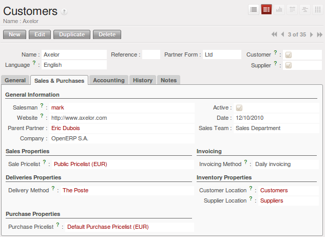
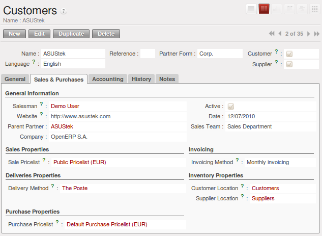
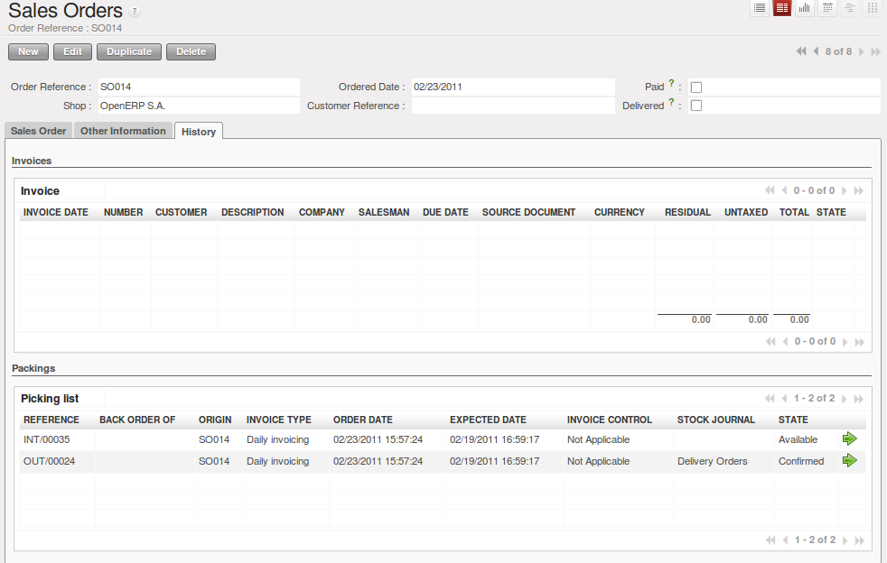

.. i18n: Organize your Deliveries
.. i18n: ========================
..

Organize your Deliveries
========================

.. i18n: You can manage stock through journals in the same way as you can manage your accounts
.. i18n: through journals. This approach has the great advantage
.. i18n: that you can define journals in various ways to meet your company's needs.
..

You can manage stock through journals in the same way as you can manage your accounts
through journals. This approach has the great advantage
that you can define journals in various ways to meet your company's needs.

.. i18n: For example, a large company may want to organize deliveries by department or warehouse. You can
.. i18n: then create a journal and a manager for each department. The different users can work in a
.. i18n: journal as a function of their position in the company. That enables you to better structure your
.. i18n: information.
..

For example, a large company may want to organize deliveries by department or warehouse. You can
then create a journal and a manager for each department. The different users can work in a
journal as a function of their position in the company. That enables you to better structure your
information.

.. i18n: A company doing a lot of transport could organize its journals by delivery vehicle. The different
.. i18n: delivery orders will then be assigned to a journal representing a particular vehicle. When the
.. i18n: vehicle has left the company, you can confirm all the orders that are found in the journal all at the
.. i18n: same time.
..

A company doing a lot of transport could organize its journals by delivery vehicle. The different
delivery orders will then be assigned to a journal representing a particular vehicle. When the
vehicle has left the company, you can confirm all the orders that are found in the journal all at the
same time.

.. i18n: .. index::
.. i18n:    single: stock; journal
..

.. index::
   single: stock; journal

.. i18n: The Different Journals
.. i18n: ----------------------
..

The Different Journals
----------------------

.. i18n: .. index::
.. i18n:    single: module; sale_journal
..

.. index::
   single: module; sale_journal

.. i18n: Install the Reconfigure option `Invoicing Journals` for Sales Management or the :mod:`sale_journal` module to work with different journals. This adds two new concepts to OpenERP:
..

Install the Reconfigure option `Invoicing Journals` for Sales Management or the :mod:`sale_journal` module to work with different journals. This adds two new concepts to OpenERP:

.. i18n: * Invoicing journals,
.. i18n: 
.. i18n: * Stock journals or Delivery journals.
..

* Invoicing journals,

* Stock journals or Delivery journals.

.. i18n: **Invoicing journals** (:menuselection:`Sales --> Configuration --> Sales --> Invoice Types`) are used to assign purchase orders and/or delivery orders to a given invoicing journal. Everything in the journal can be invoiced in one go, and you can control the amounts by
.. i18n: journal. For example, you can create the following journals: daily invoicing, end-of-week invoicing
.. i18n: and monthly invoicing. It is also possible to show the invoicing journal by default in the partner form.
.. i18n: Set the `Invoicing Method` to ``Grouped`` (one invoice per customer) or ``Non Grouped`` (individual invoices) according to your needs.
..

**Invoicing journals** (:menuselection:`Sales --> Configuration --> Sales --> Invoice Types`) are used to assign purchase orders and/or delivery orders to a given invoicing journal. Everything in the journal can be invoiced in one go, and you can control the amounts by
journal. For example, you can create the following journals: daily invoicing, end-of-week invoicing
and monthly invoicing. It is also possible to show the invoicing journal by default in the partner form.
Set the `Invoicing Method` to ``Grouped`` (one invoice per customer) or ``Non Grouped`` (individual invoices) according to your needs.

.. i18n: **Stock journals** (:menuselection:`Warehouse --> Configuration --> Warehouse Management --> Stock Journals`) allow you to classify the delivery orders in various ways, such as by department, by salesperson or by type. If a salesperson looks for a delivery order in his own journal, he can
.. i18n: easily see the work on current items compared with his own orders.
..

**Stock journals** (:menuselection:`Warehouse --> Configuration --> Warehouse Management --> Stock Journals`) allow you to classify the delivery orders in various ways, such as by department, by salesperson or by type. If a salesperson looks for a delivery order in his own journal, he can
easily see the work on current items compared with his own orders.

.. i18n: .. tip:: Default Values
.. i18n: 
.. i18n:    To enter all the orders in his own stock journal, a salesperson can use the default values that
.. i18n:    are entered in the fields when creating orders.
..

.. tip:: Default Values

   To enter all the orders in his own stock journal, a salesperson can use the default values that
   are entered in the fields when creating orders.

.. i18n: Finally, the stock journals can also be used as **delivery journals** to post each item into a delivery journal. For example, you
.. i18n: can create journals dated according to customer delivery dates (such as Monday's deliveries, or
.. i18n: afternoon deliveries) or these journals could represent the day's work for delivery vehicles (such
.. i18n: as truck1, truck2).
..

Finally, the stock journals can also be used as **delivery journals** to post each item into a delivery journal. For example, you
can create journals dated according to customer delivery dates (such as Monday's deliveries, or
afternoon deliveries) or these journals could represent the day's work for delivery vehicles (such
as truck1, truck2).

.. i18n: Using the Journals
.. i18n: ------------------
..

Using the Journals
------------------

.. i18n: You will now see how to use the journals to organize your stock management in practice. After
.. i18n: installing the module :mod:`sale_journal` look at the list of partners. In the tab :guilabel:`Sales and
.. i18n: Purchases` on any of them you will now see the field :guilabel:`Invoicing Method`.
..

You will now see how to use the journals to organize your stock management in practice. After
installing the module :mod:`sale_journal` look at the list of partners. In the tab :guilabel:`Sales and
Purchases` on any of them you will now see the field :guilabel:`Invoicing Method`.

.. i18n: .. figure:: images/partner_property_view.png
.. i18n:    :scale: 75
.. i18n:    :align: center
.. i18n: 
.. i18n:    *Partner Form in Invoicing Mode*
..

   *Partner Form in Invoicing Mode*

.. i18n: You can create a new :guilabel:`Invoicing Journal` for a partner through the menu :menuselection:`Sales --> Configuration --> Sales --> Invoice Types`. You can decide if the invoices should be grouped or not when generating them in the journal. Create a second invoicing journal
.. i18n: ``End-of-Month Invoicing`` which you can assign to another partner.
..

You can create a new :guilabel:`Invoicing Journal` for a partner through the menu :menuselection:`Sales --> Configuration --> Sales --> Invoice Types`. You can decide if the invoices should be grouped or not when generating them in the journal. Create a second invoicing journal
``End-of-Month Invoicing`` which you can assign to another partner.

.. i18n: .. figure:: images/invoice_mode.png
.. i18n:    :scale: 75
.. i18n:    :align: center
.. i18n: 
.. i18n:    *Defining an Invoicing Journal*
..

   *Defining an Invoicing Journal*

.. i18n: Then enter the data for some sales orders for these two partners. After entering sales order data, the
.. i18n: field :guilabel:`Invoicing Mode` in the second tab ``Other Information`` is completed automatically from the partner settings.
..

Then enter the data for some sales orders for these two partners. After entering sales order data, the
field :guilabel:`Invoicing Mode` in the second tab ``Other Information`` is completed automatically from the partner settings.

.. i18n: Look at the `History` tab of the Sales order, and observe the `Picking List` that has been created. The field :guilabel:`Invoicing Mode` is
.. i18n: automatically shown there. 
..

Look at the `History` tab of the Sales order, and observe the `Picking List` that has been created. The field :guilabel:`Invoicing Mode` is
automatically shown there. 

.. i18n: .. figure:: images/sales_order_picking.png
.. i18n:    :scale: 75
.. i18n:    :align: center
.. i18n: 
.. i18n:    *Generated Picking Lists*
..

   *Generated Picking Lists*

.. i18n: At the end of the day, the invoicing supervisor can display the list by journal. Go to the
.. i18n: menu :menuselection:`Sales --> Invoicing --> Lines to Invoice`. Add a New Filter by selecting `Invoice Type contains Daily`, or any other part of the invoice journal you are using. Select the different orders in the list. You can automatically carry out invoicing by clicking the action :guilabel:`Make Invoices` (the gears symbol).
..

At the end of the day, the invoicing supervisor can display the list by journal. Go to the
menu :menuselection:`Sales --> Invoicing --> Lines to Invoice`. Add a New Filter by selecting `Invoice Type contains Daily`, or any other part of the invoice journal you are using. Select the different orders in the list. You can automatically carry out invoicing by clicking the action :guilabel:`Make Invoices` (the gears symbol).

.. i18n: .. tip:: Confirming Invoices
.. i18n: 
.. i18n:     By default, invoices are generated in the draft state, which enables you to modify them before
.. i18n:     sending them to the customer.
.. i18n:     But you can confirm all the invoices in one go by selecting them all from the list and selecting the
.. i18n:     action `Confirm Draft Invoices`.
..

.. tip:: Confirming Invoices

    By default, invoices are generated in the draft state, which enables you to modify them before
    sending them to the customer.
    But you can confirm all the invoices in one go by selecting them all from the list and selecting the
    action `Confirm Draft Invoices`.

.. i18n: At the end of the month the invoicing management does the same work, but in the journal 'month-end invoicing'.
..

At the end of the month the invoicing management does the same work, but in the journal 'month-end invoicing'.

.. i18n: You can also enter a journal to confirm / cancel all the orders in one go. Then you can do several
.. i18n: quotations, assign them to a journal and confirm or cancel them at once.
..

You can also enter a journal to confirm / cancel all the orders in one go. Then you can do several
quotations, assign them to a journal and confirm or cancel them at once.

.. i18n: .. figure:: images/stock_journal_form.png
.. i18n:    :scale: 65
.. i18n:    :align: center
.. i18n: 
.. i18n:    *View of an Order Journal*
..

.. figure:: images/stock_journal_form.png
   :scale: 65
   :align: center

   *View of an Order Journal*

.. i18n: .. Copyright © Open Object Press. All rights reserved.
..

.. Copyright © Open Object Press. All rights reserved.

.. i18n: .. You may take electronic copy of this publication and distribute it if you don't
.. i18n: .. change the content. You can also print a copy to be read by yourself only.
..

.. You may take electronic copy of this publication and distribute it if you don't
.. change the content. You can also print a copy to be read by yourself only.

.. i18n: .. We have contracts with different publishers in different countries to sell and
.. i18n: .. distribute paper or electronic based versions of this book (translated or not)
.. i18n: .. in bookstores. This helps to distribute and promote the OpenERP product. It
.. i18n: .. also helps us to create incentives to pay contributors and authors using author
.. i18n: .. rights of these sales.
..

.. We have contracts with different publishers in different countries to sell and
.. distribute paper or electronic based versions of this book (translated or not)
.. in bookstores. This helps to distribute and promote the OpenERP product. It
.. also helps us to create incentives to pay contributors and authors using author
.. rights of these sales.

.. i18n: .. Due to this, grants to translate, modify or sell this book are strictly
.. i18n: .. forbidden, unless Tiny SPRL (representing Open Object Press) gives you a
.. i18n: .. written authorisation for this.
..

.. Due to this, grants to translate, modify or sell this book are strictly
.. forbidden, unless Tiny SPRL (representing Open Object Press) gives you a
.. written authorisation for this.

.. i18n: .. Many of the designations used by manufacturers and suppliers to distinguish their
.. i18n: .. products are claimed as trademarks. Where those designations appear in this book,
.. i18n: .. and Open Object Press was aware of a trademark claim, the designations have been
.. i18n: .. printed in initial capitals.
..

.. Many of the designations used by manufacturers and suppliers to distinguish their
.. products are claimed as trademarks. Where those designations appear in this book,
.. and Open Object Press was aware of a trademark claim, the designations have been
.. printed in initial capitals.

.. i18n: .. While every precaution has been taken in the preparation of this book, the publisher
.. i18n: .. and the authors assume no responsibility for errors or omissions, or for damages
.. i18n: .. resulting from the use of the information contained herein.
..

.. While every precaution has been taken in the preparation of this book, the publisher
.. and the authors assume no responsibility for errors or omissions, or for damages
.. resulting from the use of the information contained herein.

.. i18n: .. Published by Open Object Press, Grand Rosière, Belgium
..

.. Published by Open Object Press, Grand Rosière, Belgium
