.. i18n: Keeping Track of Stock Movements
.. i18n: ================================
..

跟踪库存运动
================================

.. i18n: Goods Receipts
.. i18n: --------------
..

货物接收
--------------

.. i18n: In OpenERP, you have the choice between three ways to receive goods from suppliers. 
..

在OpenERP中, you have the choice between three ways to receive goods from suppliers. 

.. i18n: The first method is to manually enter the information in the incoming shipment. To receive the products
.. i18n: through this method, you have to go to :guilabel:`Incoming Shipments` section in the :guilabel:`Warehouse 
.. i18n: Management` submenu, click New and then you enter the information about the receipt.
..

The first method is to manually enter the information in the incoming shipment. To receive the products
through this method, you have to go to :guilabel:`Incoming Shipments` section in the :guilabel:`Warehouse 
Management` submenu, click New and then you enter the information about the receipt.

.. i18n: .. figure:: images/stock_getting.png
.. i18n: 	:scale: 75
.. i18n: 	:align: center
.. i18n: 	
.. i18n: 	*Manual Data Entry for Product Receipt*
..

.. figure:: images/stock_getting.png
	:scale: 75
	:align: center
	
	*Manual Data Entry for Product Receipt*

.. i18n: The second method is to receive products from a generated incoming shipment. To achieve the reception 
.. i18n: using this method, you have to go to :guilabel:`Incoming Shipments` section in the :guilabel:`Warehouse 
.. i18n: Management` submenu. You will find the list of waiting incoming shipments.
..

The second method is to receive products from a generated incoming shipment. To achieve the reception 
using this method, you have to go to :guilabel:`Incoming Shipments` section in the :guilabel:`Warehouse 
Management` submenu. You will find the list of waiting incoming shipments.

.. i18n: The third method is to receive products by waiting products without looking at the shipment document.
.. i18n: You can validate the reception by products in :guilabel:`Receive Products` section in the :guilabel:`
.. i18n: Product Moves` submenu. With this method, you will be able to receive one product, regardless of the
.. i18n: document which is attached to this product.
..

The third method is to receive products by waiting products without looking at the shipment document.
You can validate the reception by products in :guilabel:`Receive Products` section in the :guilabel:`
Product Moves` submenu. With this method, you will be able to receive one product, regardless of the
document which is attached to this product.

.. i18n: Receipt of a Supplier Order by Purchase Order
.. i18n: ^^^^^^^^^^^^^^^^^^^^^^^^^^^^^^^^^^^^^^^^^^^^^
..

按采购单接收供应商货物 
^^^^^^^^^^^^^^^^^^^^^^^^^^^^^^^^^^^^^^^^^^^^^

.. i18n: If you use Purchase Orders in OpenERP, product receipts are automatically generated by the system when the
.. i18n: purchase order is confirmed. You do not have to enter any date, just confirm that the quantities ordered match the
.. i18n: quantities received.
..

If you use Purchase Orders in OpenERP, product receipts are automatically generated by the system when the
purchase order is confirmed. You do not have to enter any date, just confirm that the quantities ordered match the
quantities received.

.. i18n: Incoming Shipments forms are automatically prepared by OpenERP from the purchase management
.. i18n: process. You will find a list of all the awaited receipts in the menu :menuselection:`Warehouse
.. i18n: --> Warehouse Management --> Incoming Shipments`. Use the order number or the supplier name to find the
.. i18n: right goods receipt form for confirmation of a goods-in. This approach enables you to control
.. i18n: quantities received by referring to the quantities ordered.
..

Incoming Shipments forms are automatically prepared by OpenERP from the purchase management
process. You will find a list of all the awaited receipts in the menu :menuselection:`Warehouse
--> Warehouse Management --> Incoming Shipments`. Use the order number or the supplier name to find the
right goods receipt form for confirmation of a goods-in. This approach enables you to control
quantities received by referring to the quantities ordered.

.. i18n: .. figure:: images/stock_picking_in_tree.png
.. i18n:    :scale: 75
.. i18n:    :align: center
.. i18n: 
.. i18n:    *List of Items Waiting*
..

.. figure:: images/stock_picking_in_tree.png
   :scale: 75
   :align: center

   *List of Items Waiting*

.. i18n: You can also do goods-in data entry manually if there is no order, using the same menu by clicking the `New` button.
..

You can also do goods-in data entry manually if there is no order, using the same menu by clicking the `New` button.

.. i18n: A new goods-in data entry form opens. Enter the supplier data in the :guilabel:`Address` field
.. i18n: and type the reference number from your supplier in the field :guilabel:`Origin`. You should then enter data about the products received in the lines.
..

A new goods-in data entry form opens. Enter the supplier data in the :guilabel:`Address` field
and type the reference number from your supplier in the field :guilabel:`Origin`. You should then enter data about the products received in the lines.

.. i18n: The source location is already completed by default because of your supplier selection. You should
.. i18n: then give the destination location where you will place the products. For example, enter ``Stock``.
.. i18n: At this stage, you can set a lot number for traceability (this function will be described later in
.. i18n: this chapter, so leave this field empty for the moment).
..

The source location is already completed by default because of your supplier selection. You should
then give the destination location where you will place the products. For example, enter ``Stock``.
At this stage, you can set a lot number for traceability (this function will be described later in
this chapter, so leave this field empty for the moment).

.. i18n: Once the form has been completed, you can confirm the receipt of all the products at the same time
.. i18n: using the :guilabel:`Process Now` button. If you want to enter data for a goods receipt that you are still
.. i18n: waiting for, click the button :guilabel:`Process Later`.
..

Once the form has been completed, you can confirm the receipt of all the products at the same time
using the :guilabel:`Process Now` button. If you want to enter data for a goods receipt that you are still
waiting for, click the button :guilabel:`Process Later`.

.. i18n: .. note:: Partial or Complete Reception
.. i18n: 
.. i18n: 	When you process the incoming shipment, you can choose between partial or complete.
.. i18n: 	
.. i18n: 	If you have to validate a partial incoming shipment, click ``Process now`` and change the number of items
.. i18n: 	according to the quantity received. 
.. i18n: 	
.. i18n: 	.. figure:: images/product_to_process.png
.. i18n: 		:scale: 60
.. i18n: 		:align: center
.. i18n: 		
.. i18n: 		*Confirm partial reception*
.. i18n: 	
.. i18n: 	Another object will be generated with a back order reference equal to the
.. i18n: 	``Reference`` number of the incoming shipment already confirmed. 
.. i18n: 	
.. i18n: 	.. figure:: images/partial_shipment.png
.. i18n: 		:scale: 75
.. i18n: 		:align: center
.. i18n: 		
.. i18n: 		*Process a Partial Incoming Shipment*
.. i18n: 	
.. i18n: 	Once the rest of the order has arrived and has been processed, both orders will be merged.
..

.. note:: Partial or Complete Reception

	When you process the incoming shipment, you can choose between partial or complete.
	
	If you have to validate a partial incoming shipment, click ``Process now`` and change the number of items
	according to the quantity received. 
	
	.. figure:: images/product_to_process.png
		:scale: 60
		:align: center
		
		*Confirm partial reception*
	
	Another object will be generated with a back order reference equal to the
	``Reference`` number of the incoming shipment already confirmed. 
	
	.. figure:: images/partial_shipment.png
		:scale: 75
		:align: center
		
		*Process a Partial Incoming Shipment*
	
	Once the rest of the order has arrived and has been processed, both orders will be merged.

.. i18n: .. figure:: images/stock_picking_in_form.png
.. i18n:    :scale: 75
.. i18n:    :align: center
.. i18n: 
.. i18n:    *Form for Entering Goods received from a Supplier Order*
..

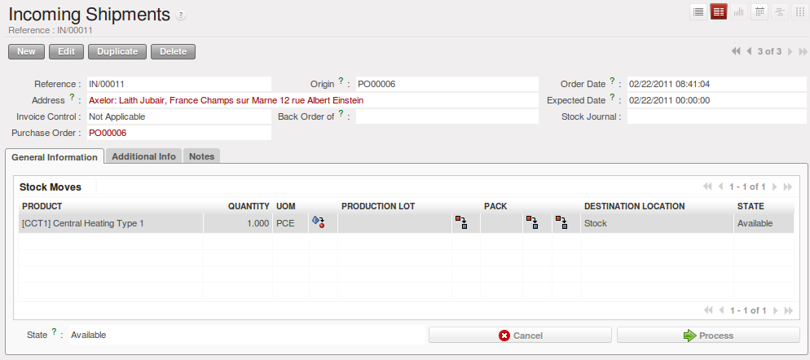

   *Form for Entering Goods received from a Supplier Order*

.. i18n: The products then arrive in stock and should reflect the quantities shown on the product form.
..

The products then arrive in stock and should reflect the quantities shown on the product form.

.. i18n: In the `Incoming Shipments` form, the field :guilabel:`Invoice Control` lets you influence the way you
.. i18n: send invoices to suppliers. If this is set to ``To be invoiced``, a supplier invoice will now be
.. i18n: generated automatically in the draft state, based on the goods received. Your accountant then has to
.. i18n: confirm this pre-invoicing once the supplier's invoice is received. This enables you to verify that
.. i18n: the invoiced quantities correspond to the quantities received.
..

In the `Incoming Shipments` form, the field :guilabel:`Invoice Control` lets you influence the way you
send invoices to suppliers. If this is set to ``To be invoiced``, a supplier invoice will now be
generated automatically in the draft state, based on the goods received. Your accountant then has to
confirm this pre-invoicing once the supplier's invoice is received. This enables you to verify that
the invoiced quantities correspond to the quantities received.

.. i18n: .. tip:: Print the Packing List
.. i18n: 
.. i18n: 	In order to print the packing list of an incoming shipment, select the incoming shipment of which you need
.. i18n: 	the details and click ``Packing List`` in the panel at the right side of the screen.
.. i18n: 	
.. i18n: 	This link is available in the ``Internal Moves`` and ``Delivery Orders`` sections.
.. i18n: 	
.. i18n: In case you received damaged or wrong products, you can return them to the supplier. In the ``Incoming shipment``
.. i18n: form, click the ``Return Products`` button. A window will open that lets you choose the invoicing
.. i18n: process to follow. Once you click ``Process``, a stock move is generated with the same reference number
.. i18n: and `return` to specify that this is a return move.
..

.. tip:: Print the Packing List

	In order to print the packing list of an incoming shipment, select the incoming shipment of which you need
	the details and click ``Packing List`` in the panel at the right side of the screen.
	
	This link is available in the ``Internal Moves`` and ``Delivery Orders`` sections.
	
In case you received damaged or wrong products, you can return them to the supplier. In the ``Incoming shipment``
form, click the ``Return Products`` button. A window will open that lets you choose the invoicing
process to follow. Once you click ``Process``, a stock move is generated with the same reference number
and `return` to specify that this is a return move.

.. i18n: .. figure:: images/return_product_stock_move.png
.. i18n: 	:scale: 75
.. i18n: 	:align: center
.. i18n: 	
.. i18n: 	*Stock Move for Returned Products*
..

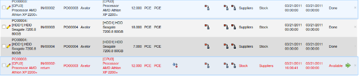
	
	*Stock Move for Returned Products*

.. i18n: Receipt of a Supplier Order by Product
.. i18n: ^^^^^^^^^^^^^^^^^^^^^^^^^^^^^^^^^^^^^^
..

按产品接收供应商货物
^^^^^^^^^^^^^^^^^^^^^^^^^^^^^^^^^^^^^^

.. i18n: The approach shown above is very useful if goods receipts correspond to the original orders. If your suppliers
.. i18n: deliver items that do not necessarily coincide with the orders, however, it is easier to work by products received
.. i18n: rather than by orders.
..

The approach shown above is very useful if goods receipts correspond to the original orders. If your suppliers
deliver items that do not necessarily coincide with the orders, however, it is easier to work by products received
rather than by orders.

.. i18n: From this version on, you can also handle receptions by product, even from List view. Go to :menuselection:`Warehouse --> Products Moves --> Receive Products`.
..

From this version on, you can also handle receptions by product, even from List view. Go to :menuselection:`Warehouse --> Products Moves --> Receive Products`.

.. i18n: Filters allow you to easily select receipts to be done, and so on. One way to quickly receive products is to Group by `Supplier` and select `To Do`. 
..

Filters allow you to easily select receipts to be done, and so on. One way to quickly receive products is to Group by `Supplier` and select `To Do`. 

.. i18n: This is very useful functionality when your supplier sends the goods for several purchase orders at a time. You can now just receive the products, regardless of the purchase order they come from, simply by clicking the green arrow at the right side of the screen.
..

This is very useful functionality when your supplier sends the goods for several purchase orders at a time. You can now just receive the products, regardless of the purchase order they come from, simply by clicking the green arrow at the right side of the screen.

.. i18n: The List view offers great flexibility and allows you to rapidly receive products by keeping full functionality! Of course, you can handle both partial and complete receptions, and you can add information about the production lots and packs.
..

The List view offers great flexibility and allows you to rapidly receive products by keeping full functionality! Of course, you can handle both partial and complete receptions, and you can add information about the production lots and packs.

.. i18n: .. figure:: images/receive_products.png
.. i18n:    :scale: 75
.. i18n:    :align: center
.. i18n:    
.. i18n:    *Receipt of a Supplier Order using Group By*
..

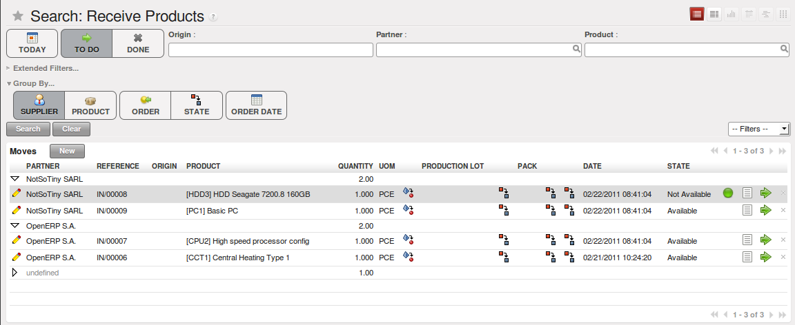
   
   *Receipt of a Supplier Order using Group By*

.. i18n: This can be also accomplished from Form view.
.. i18n:     
.. i18n: Internal Stock Moves
.. i18n: --------------------
..

This can be also accomplished from Form view.
    
内部库存调拨
--------------------

.. i18n: You should install the :mod:`stock_location` module (from the list of modules, or through Reconfigure wizard, Advanced Routes) if routing products to customers, from suppliers or in your warehouse is determined by the identity of the product itself.
..

You should install the :mod:`stock_location` module (from the list of modules, or through Reconfigure wizard, Advanced Routes) if routing products to customers, from suppliers or in your warehouse is determined by the identity of the product itself.

.. i18n: .. figure:: images/product_location.png
.. i18n: 	:scale: 75
.. i18n: 	:align: center
.. i18n: 	
.. i18n: 	*Managing the Paths from one Location to Another in a Product Form*
..

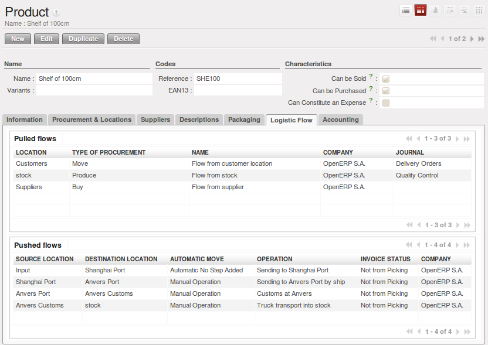
	
	*Managing the Paths from one Location to Another in a Product Form*

.. i18n: This will let you configure logistics rules individually for each product. For example, when a specific product
.. i18n: arrives in stores, it can automatically be sent to quality control. In this case, it has to be configured as a Push Flow
.. i18n: with rules in the Product form. The fields that make up those rules are:
..

This will let you configure logistics rules individually for each product. For example, when a specific product
arrives in stores, it can automatically be sent to quality control. In this case, it has to be configured as a Push Flow
with rules in the Product form. The fields that make up those rules are:

.. i18n: * **Source Location**: the rule only applies if a product comes from this location,
.. i18n: * **Destination Location**: the rule only applies if a product ends up in this location,
.. i18n: * **Automatic Move**: ``Automatic Move``, ``Manual Operation``, ``Automatic No Step Added``,
.. i18n: * **Delay (days)**,
.. i18n: * **Operation**: a free text field which will be included in the automatic stock move proposed by OpenERP.
..

* **Source Location**: the rule only applies if a product comes from this location,
* **Destination Location**: the rule only applies if a product ends up in this location,
* **Automatic Move**: ``Automatic Move``, ``Manual Operation``, ``Automatic No Step Added``,
* **Delay (days)**,
* **Operation**: a free text field which will be included in the automatic stock move proposed by OpenERP.

.. i18n: There are two main logistic flows:
..

There are two main logistic flows:

.. i18n: * **Pushed Flows**
.. i18n: * **Pulled Flows**
..

* **Pushed Flows**
* **Pulled Flows**

.. i18n: `Push` flows are useful when the arrival of certain products in a given location should always be followed by a 
.. i18n: corresponding move to another location, optionally after a certain delay. The original Warehouse application already
.. i18n: supports such Push flow specifications on the Locations themselves, but these cannot be refined per product.
.. i18n: `Pull` flows are a bit different from Push flows, in the sense that they are not related to the processing of product
.. i18n: moves, but rather to the processing of procurement orders. What is being pulled is a need, not directly products.
.. i18n: You will now see some examples of using these locations and logistics by product through Pushed Flows for:
..

`Push` flows are useful when the arrival of certain products in a given location should always be followed by a 
corresponding move to another location, optionally after a certain delay. The original Warehouse application already
supports such Push flow specifications on the Locations themselves, but these cannot be refined per product.
`Pull` flows are a bit different from Push flows, in the sense that they are not related to the processing of product
moves, but rather to the processing of procurement orders. What is being pulled is a need, not directly products.
You will now see some examples of using these locations and logistics by product through Pushed Flows for:

.. i18n: * A rentable product,
.. i18n: * A product bought in China, following its freight by ship from port to port,
.. i18n: * A product that you want to send to quality control before putting it in stocks.
..

* A rentable product,
* A product bought in China, following its freight by ship from port to port,
* A product that you want to send to quality control before putting it in stocks.

.. i18n: We will develop the third scenario: **the quality control**.
..

We will develop the third scenario: **the quality control**.

.. i18n: You can configure the system to put a given product in the Quality Control bay automatically when it arrives in
.. i18n: your company. To do that, you just configure a rule for the product to be placed in the Quality Control location
.. i18n: rather than the Input location when the product is received from the supplier.
..

You can configure the system to put a given product in the Quality Control bay automatically when it arrives in
your company. To do that, you just configure a rule for the product to be placed in the Quality Control location
rather than the Input location when the product is received from the supplier.

.. i18n: .. table:: Rule to Move Products manually from Input to Quality Control
.. i18n: 
.. i18n: 	==================== ================
.. i18n: 	Field                Value
.. i18n: 	==================== ================
.. i18n: 	Source location      Stock
.. i18n: 	Destination location Quality Control
.. i18n: 	Automatic Move       Manual Operation
.. i18n: 	Shipping Type        Getting Goods
.. i18n: 	Delay (days)         0
.. i18n: 	Operation            Quality Control
.. i18n: 	==================== ================
..

.. table:: Rule to Move Products manually from Input to Quality Control

	==================== ================
	Field                Value
	==================== ================
	Source location      Stock
	Destination location Quality Control
	Automatic Move       Manual Operation
	Shipping Type        Getting Goods
	Delay (days)         0
	Operation            Quality Control
	==================== ================

.. i18n: Once this product has been received, OpenERP will automatically manage the request for an internal movement 
.. i18n: to send it to the Quality Control location. If you want to do this automatically without having to 
.. i18n: confirm it, in the ``Automatic Move`` field, select `Automatic Move` or `Automatic No Step Added`.
..

Once this product has been received, OpenERP will automatically manage the request for an internal movement 
to send it to the Quality Control location. If you want to do this automatically without having to 
confirm it, in the ``Automatic Move`` field, select `Automatic Move` or `Automatic No Step Added`.

.. i18n: With the configuration described in the table above, you will have to confirm the stock move manually once you 
.. i18n: have received the goods.
..

With the configuration described in the table above, you will have to confirm the stock move manually once you 
have received the goods.

.. i18n: .. figure:: images/manual_move.png
.. i18n: 	:scale: 75
.. i18n: 	:align: center
.. i18n: 	
.. i18n: 	*Manual Stock Move to Quality Control*
..

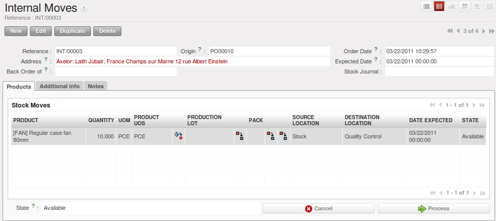
	
	*Manual Stock Move to Quality Control*

.. i18n: If you do not want to confirm the stock move manually, but you want to see the move `Suppliers --> Stock` then
.. i18n: `Stock --> Quality Control`, change the ``Automatic Move`` field and select `Automatic Move`. With this 
.. i18n: configuration, you will see the two stock moves. 
..

If you do not want to confirm the stock move manually, but you want to see the move `Suppliers --> Stock` then
`Stock --> Quality Control`, change the ``Automatic Move`` field and select `Automatic Move`. With this 
configuration, you will see the two stock moves. 

.. i18n: .. figure:: images/stock_move.png
.. i18n: 	:scale: 75
.. i18n: 	:align: center
.. i18n: 	
.. i18n: 	*Automatic Stock Move to Quality Control*
..

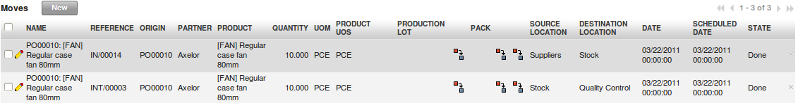
	
	*Automatic Stock Move to Quality Control*

.. i18n: If you select ``Automatic Move No Step Added``, you will only see one stock move: `Suppliers --> Quality Control`
..

If you select ``Automatic Move No Step Added``, you will only see one stock move: `Suppliers --> Quality Control`

.. i18n: .. figure:: images/automatic_move_nsta.png
.. i18n: 	:scale: 75
.. i18n: 	:align: center
.. i18n: 	
.. i18n: 	*Automatic Stock Move to Quality Control (No Step Added)*
..

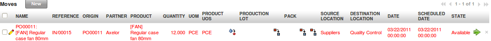
	
	*Automatic Stock Move to Quality Control (No Step Added)*

.. i18n: Shipping of Goods
.. i18n: -----------------
.. i18n:  
.. i18n: In the same way as delivering goods, you can ship goods in three different ways:
..

货物运输
-----------------
 
In the same way as delivering goods, you can ship goods in three different ways:

.. i18n: * manually enter data,
.. i18n: * deliver goods according to a sales order,
.. i18n: * deliver goods by product.
..

* manually enter data,
* deliver goods according to a sales order,
* deliver goods by product.

.. i18n: .. index::
.. i18n:    single: Module; Sale
..

.. index::
   single: Module; Sale

.. i18n: Everything about goods receipt can also be done manually in the same way for a customer delivery. This time, use
.. i18n: the automated product delivery processes based on customer orders. Install the :mod:`sale` module 
.. i18n: (`Reconfigure` wizard, `Sales Management`), so that you can proceed further in this section of the chapter.
..

Everything about goods receipt can also be done manually in the same way for a customer delivery. This time, use
the automated product delivery processes based on customer orders. Install the :mod:`sale` module 
(`Reconfigure` wizard, `Sales Management`), so that you can proceed further in this section of the chapter.

.. i18n: Now create a new sales order from the menu :menuselection:`Sales --> Sales --> Sales Orders`.
.. i18n: Enter the following data in this order:
..

Now create a new sales order from the menu :menuselection:`Sales --> Sales --> Sales Orders`.
Enter the following data in this order:

.. i18n: * :guilabel:`Shop` : ``OpenERP S.A.``
.. i18n: 
.. i18n: * :guilabel:`Customer` : ``Agrolait``
.. i18n: 
.. i18n: * :guilabel:`Sales order lines` :
.. i18n: 
.. i18n:   * :guilabel:`Product` : ``[PC2] Basic+ PC (assembly on order)``,
.. i18n: 
.. i18n:   * :guilabel:`Quantity (UoM)` : ``3``,
.. i18n: 
.. i18n:   * :guilabel:`Product UoM` : ``PCE``,
.. i18n: 
.. i18n:   * :guilabel:`Procurement Method` : ``from stock``.
..

* :guilabel:`Shop` : ``OpenERP S.A.``

* :guilabel:`Customer` : ``Agrolait``

* :guilabel:`Sales order lines` :

  * :guilabel:`Product` : ``[PC2] Basic+ PC (assembly on order)``,

  * :guilabel:`Quantity (UoM)` : ``3``,

  * :guilabel:`Product UoM` : ``PCE``,

  * :guilabel:`Procurement Method` : ``from stock``.

.. i18n: You have already seen that OpenERP shows the available product stock in list view. The real stock is equal to the virtual stock because you have nothing to deliver to customers and you are not waiting for any of these products to be received into stock. The salesperson then has
.. i18n: all the information needed to take orders efficiently.
..

You have already seen that OpenERP shows the available product stock in list view. The real stock is equal to the virtual stock because you have nothing to deliver to customers and you are not waiting for any of these products to be received into stock. The salesperson then has
all the information needed to take orders efficiently.

.. i18n: .. figure:: images/stock_sale_form.png
.. i18n:    :scale: 70
.. i18n:    :align: center
.. i18n: 
.. i18n:    *Entering an Order for Three Computers*
..

.. figure:: images/stock_sale_form.png
   :scale: 70
   :align: center

   *Entering an Order for Three Computers*

.. i18n: Then confirm the quotation to convert it to an order. If you return to the product form, you will see
.. i18n: the virtual stock is now smaller than the real stock. 
..

Then confirm the quotation to convert it to an order. If you return to the product form, you will see
the virtual stock is now smaller than the real stock. 

.. i18n: Start the scheduler through the menu :menuselection:`Warehouse --> Schedulers --> Compute Schedulers`. Its
.. i18n: functionality will be detailed in :ref:`ch-mnf`. This manages the reservation of products and places orders 
.. i18n: based on the dates promised to customers, and the various internal lead times and priorities.
.. i18n: Three products will be reserved in the order that you created, so they cannot be sold to another customer.
..

Start the scheduler through the menu :menuselection:`Warehouse --> Schedulers --> Compute Schedulers`. Its
functionality will be detailed in :ref:`ch-mnf`. This manages the reservation of products and places orders 
based on the dates promised to customers, and the various internal lead times and priorities.
Three products will be reserved in the order that you created, so they cannot be sold to another customer.

.. i18n: .. index::
.. i18n:    single: Module; mrp_jit
..

.. index::
   single: Module; mrp_jit

.. i18n: .. tip:: Just in Time
.. i18n: 
.. i18n:     Install the module :mod:`mrp_jit` to schedule each order in real time after it has been confirmed.
.. i18n:     This means that you do not have to start the scheduler or wait for its periodical start time.
..

.. tip:: Just in Time

    Install the module :mod:`mrp_jit` to schedule each order in real time after it has been confirmed.
    This means that you do not have to start the scheduler or wait for its periodical start time.

.. i18n: Now have a look at the list of deliveries waiting to be carried out using the menu
.. i18n: :menuselection:`Warehouse --> Warehouse Management --> Delivery Orders`. You find a line
.. i18n: there for your order representing the items to be sent. Double-click the line to see the detail of
.. i18n: the items proposed by OpenERP.
..

Now have a look at the list of deliveries waiting to be carried out using the menu
:menuselection:`Warehouse --> Warehouse Management --> Delivery Orders`. You find a line
there for your order representing the items to be sent. Double-click the line to see the detail of
the items proposed by OpenERP.

.. i18n: .. figure:: images/stock_picking_out_form.png
.. i18n:    :scale: 75
.. i18n:    :align: center
.. i18n: 
.. i18n:    *Items on a Customer Order*
..

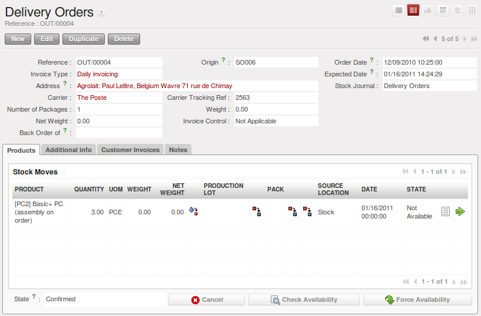

   *Items on a Customer Order*

.. i18n: .. tip::  States
.. i18n: 
.. i18n:     OpenERP distinguishes between the states **Confirmed** and **Assigned**.
.. i18n: 
.. i18n:     An item is **Confirmed** when it is needed, but the available stock may be insufficient.
.. i18n:     An item is **Assigned** when it is available in stock and the storesperson reserves it:
.. i18n:     the necessary products have been reserved for this specific operation.
..

.. tip::  States

    OpenERP distinguishes between the states **Confirmed** and **Assigned**.

    An item is **Confirmed** when it is needed, but the available stock may be insufficient.
    An item is **Assigned** when it is available in stock and the storesperson reserves it:
    the necessary products have been reserved for this specific operation.

.. i18n: You can also confirm a customer delivery from a confirmed Sales Order.
.. i18n: When you click the :guilabel:`Process` button of `Outgoing Deliveries`, a window opens where you can
.. i18n: enter the quantities actually delivered. If you enter a value less than the forecasted one, OpenERP
.. i18n: automatically generates a partial delivery note and a new order for the remaining items. For this
.. i18n: exercise, just confirm all the products.
..

You can also confirm a customer delivery from a confirmed Sales Order.
When you click the :guilabel:`Process` button of `Outgoing Deliveries`, a window opens where you can
enter the quantities actually delivered. If you enter a value less than the forecasted one, OpenERP
automatically generates a partial delivery note and a new order for the remaining items. For this
exercise, just confirm all the products.

.. i18n: However, if you want to look at a partial shipping, an example will be developed at the end of this section.
..

However, if you want to look at a partial shipping, an example will be developed at the end of this section.

.. i18n: If you return to the list of current orders, you will see that your order has now been marked as
.. i18n: delivered (``Done``). A progress indicator from 0% to 100% is shown by each order so that the
.. i18n: salesperson can follow the progress of his orders at a glance.
..

If you return to the list of current orders, you will see that your order has now been marked as
delivered (``Done``). A progress indicator from 0% to 100% is shown by each order so that the
salesperson can follow the progress of his orders at a glance.

.. i18n: .. figure:: images/stock_sale_tree.png
.. i18n:    :scale: 75
.. i18n:    :align: center
.. i18n: 
.. i18n:    *List of Orders with their Delivery State*
..

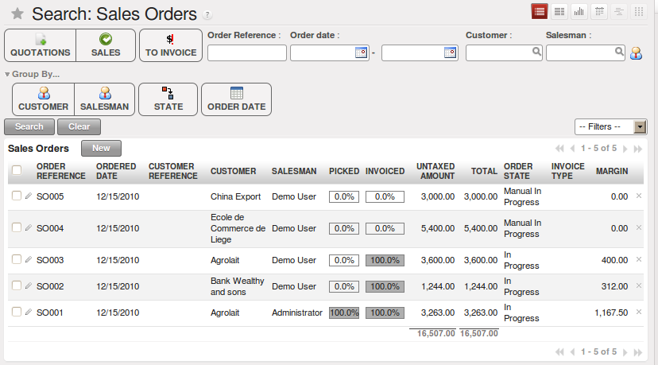

   *List of Orders with their Delivery State*

.. i18n: .. index::
.. i18n:    single: Stock; Negative
..

.. index::
   single: Stock; Negative

.. i18n: .. note:: Negative Stock
.. i18n: 
.. i18n:     Stock Management is very flexible to be more effective.
.. i18n:     For example, if you forget to enter products at goods-in, this will not prevent you from sending
.. i18n:     them to customers.
.. i18n:     In OpenERP, you can force all operations manually using the button :guilabel:`Force Availability`.
.. i18n:     In this case, your stocks risk to become negative. You should monitor all stocks for negative
.. i18n:     levels and carry out an inventory correction when that happens.
..

.. note:: Negative Stock

    Stock Management is very flexible to be more effective.
    For example, if you forget to enter products at goods-in, this will not prevent you from sending
    them to customers.
    In OpenERP, you can force all operations manually using the button :guilabel:`Force Availability`.
    In this case, your stocks risk to become negative. You should monitor all stocks for negative
    levels and carry out an inventory correction when that happens.

.. i18n: Partial Shipping
.. i18n: ^^^^^^^^^^^^^^^^
..

部分运输
^^^^^^^^^^^^^^^^

.. i18n: Should you have to process a partial delivery, you can go to :menuselection:`Warehouse --> 
.. i18n: Warehouse Management --> Delivery Orders`, then select the order to process it. In the new window, change
.. i18n: the quantity to ship and then confirm it.
..

Should you have to process a partial delivery, you can go to :menuselection:`Warehouse --> 
Warehouse Management --> Delivery Orders`, then select the order to process it. In the new window, change
the quantity to ship and then confirm it.

.. i18n: If you go back to the list view, you will now see a new delivery order with a ``back order`` number
.. i18n: equal to the just confirmed order. This is illustrated in the following figure.
..

If you go back to the list view, you will now see a new delivery order with a ``back order`` number
equal to the just confirmed order. This is illustrated in the following figure.

.. i18n: .. figure:: images/partial_shipping.png
.. i18n: 	:scale: 100
.. i18n: 	:align: center
.. i18n: 	
.. i18n: 	*Partial Shipping*
..

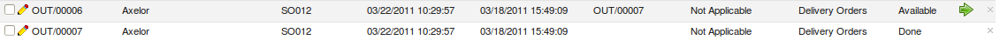
	
	*Partial Shipping*

.. i18n: In the stock moves, you will see that there are two moves. The first move is for the remaining quantities to
.. i18n: ship and the second one is for the shipped goods. There will be more stock moves if you process partial
.. i18n: shipping in more than two times.
..

In the stock moves, you will see that there are two moves. The first move is for the remaining quantities to
ship and the second one is for the shipped goods. There will be more stock moves if you process partial
shipping in more than two times.

.. i18n: .. figure:: images/stock_move_partial.png
.. i18n: 	:scale: 100
.. i18n: 	:align: center
.. i18n: 	
.. i18n: 	*Stock Moves in Partial Shipping*
..

.. figure:: images/stock_move_partial.png
	:scale: 100
	:align: center
	
	*Stock Moves in Partial Shipping*

.. i18n: Return Products from Customers
.. i18n: ^^^^^^^^^^^^^^^^^^^^^^^^^^^^^^
..

客户退货
^^^^^^^^^^^^^^^^^^^^^^^^^^^^^^

.. i18n: If a customer returns damaged or wrongly delivered products, you can enter this information in OpenERP
.. i18n: via :menuselection:`Warehouse --> Warehouse Management --> Delivery Orders`. 
..

If a customer returns damaged or wrongly delivered products, you can enter this information in OpenERP
via :menuselection:`Warehouse --> Warehouse Management --> Delivery Orders`. 

.. i18n: You have to select the order related to the returned products and click the :guilabel:`Return Products`.
.. i18n: A new window will open and will let you choose the invoicing method.
..

You have to select the order related to the returned products and click the :guilabel:`Return Products`.
A new window will open and will let you choose the invoicing method.

.. i18n: .. figure:: images/return_picking.png
.. i18n: 	:scale: 75
.. i18n: 	:align: center
.. i18n: 	
.. i18n: 	*Return Products from Customers*
..

.. figure:: images/return_picking.png
	:scale: 75
	:align: center
	
	*Return Products from Customers*

.. i18n: When the product is returned, it will go back to your stock and you will see a stock move from `Customers
.. i18n: --> Shelf 1`.
..

When the product is returned, it will go back to your stock and you will see a stock move from `Customers
--> Shelf 1`.

.. i18n: .. figure:: images/return_product.png
.. i18n: 	:scale: 75
.. i18n: 	:align: center
.. i18n: 	
.. i18n: 	*Stock Move for a Returned Product*
..

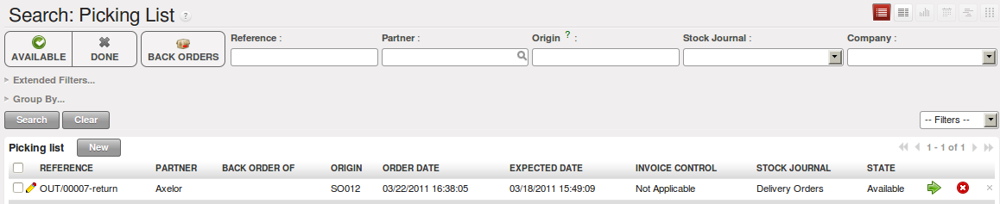
	
	*Stock Move for a Returned Product*

.. i18n: Just In Time
.. i18n: ^^^^^^^^^^^^
..

准时生产方式（JIT）
^^^^^^^^^^^^^^^^^^^^

.. i18n: By default, scheduling starts automatically once a day. You should make this
.. i18n: scheduling execute overnight to ensure that the system does not slow down under a heavy load of scheduling when
.. i18n: you are also trying to use it interactively.
..

By default, scheduling starts automatically once a day. You should make this
scheduling execute overnight to ensure that the system does not slow down under a heavy load of scheduling when
you are also trying to use it interactively.

.. i18n: To set the start time for the scheduler, go to the menu
.. i18n: :menuselection:`Administration --> Configuration --> Scheduler --> Scheduled Actions`. Select the rule
.. i18n: called 'Run mrp scheduler' and modify the date and time of the next execution.
..

To set the start time for the scheduler, go to the menu
:menuselection:`Administration --> Configuration --> Scheduler --> Scheduled Actions`. Select the rule
called 'Run mrp scheduler' and modify the date and time of the next execution.

.. i18n: .. index::
.. i18n:    single: module; mrp_jit
..

.. index::
   single: module; mrp_jit

.. i18n: Some companies want to plan orders progressively as they are entered, so they do not wait until
.. i18n: procurement orders are planned the next day. Install the module :mod:`mrp_jit` (`Reconfigure` wizard, `Just In Time Scheduling`) to handle this. Once the module is installed, each requirement (that could result in a Production or Purchase Order)
.. i18n: will be planned in real time as soon as it has been confirmed.
..

Some companies want to plan orders progressively as they are entered, so they do not wait until
procurement orders are planned the next day. Install the module :mod:`mrp_jit` (`Reconfigure` wizard, `Just In Time Scheduling`) to handle this. Once the module is installed, each requirement (that could result in a Production or Purchase Order)
will be planned in real time as soon as it has been confirmed.

.. i18n: Then if you make a sales order with a product that is ``Make To Order``, the quotation request to a
.. i18n: supplier will immediately be generated.
..

Then if you make a sales order with a product that is ``Make To Order``, the quotation request to a
supplier will immediately be generated.

.. i18n: .. index::
.. i18n:    single: module; sale_supplier_direct_delivery
..

.. index::
   single: module; sale_supplier_direct_delivery

.. i18n: .. tip :: Delivery from the Supplier or to the Customer
.. i18n: 
.. i18n:     The :mod:`sale_supplier_direct_delivery` module enables you to deliver the product directly from
.. i18n:     the supplier to the customer. At the time of writing, this module is in ``extra-addons``.
.. i18n:     The logic that the product follows is configured individually for each product and affects only
.. i18n:     products marked ``Make to Order``.
..

.. tip :: Delivery from the Supplier or to the Customer

    The :mod:`sale_supplier_direct_delivery` module enables you to deliver the product directly from
    the supplier to the customer. At the time of writing, this module is in ``extra-addons``.
    The logic that the product follows is configured individually for each product and affects only
    products marked ``Make to Order``.

.. i18n: This mode does not always makes sense. Each order is processed immediately when confirmed. So if an order
.. i18n: is to be delivered in three months, the scheduler will reserve goods in stock for each order once
.. i18n: it has been confirmed. It would have been more sensible to leave these products available for other
.. i18n: orders.
..

This mode does not always makes sense. Each order is processed immediately when confirmed. So if an order
is to be delivered in three months, the scheduler will reserve goods in stock for each order once
it has been confirmed. It would have been more sensible to leave these products available for other
orders.

.. i18n: If a Purchase Order's :guilabel:`Invoicing Control` is configured ``From Order``,
.. i18n: the scheduler will immediately create the corresponding supplier quotation request. It might have been better to delay it for several weeks, if
.. i18n: you could have used the lead time to group the purchase with other future orders.
..

If a Purchase Order's :guilabel:`Invoicing Control` is configured ``From Order``,
the scheduler will immediately create the corresponding supplier quotation request. It might have been better to delay it for several weeks, if
you could have used the lead time to group the purchase with other future orders.

.. i18n: The negative effects of the Just in Time module are:
..

The negative effects of the Just in Time module are:

.. i18n: * Poor priority management between orders,
.. i18n: 
.. i18n: * Additionally stocked products.
..

* Poor priority management between orders,

* Additionally stocked products.

.. i18n: Logistics Configuration through Advanced Routes
.. i18n: -----------------------------------------------
..

通过高级路线（Advanced Routes）配置物流
-----------------------------------------------

.. i18n: To configure your logistics for advanced push and pull, you need to install :mod:`stock_location` module 
.. i18n: (`Reconfigure` wizard, `Advanced Routes`) as explained before. A complete scenario will be developed at the end of this chapter.
..

To configure your logistics for advanced push and pull, you need to install :mod:`stock_location` module 
(`Reconfigure` wizard, `Advanced Routes`) as explained before. A complete scenario will be developed at the end of this chapter.

.. i18n: This module supplements the *Warehouse* application by adding support for location paths per product, effectively implementing Push and Pull inventory flows.
..

This module supplements the *Warehouse* application by adding support for location paths per product, effectively implementing Push and Pull inventory flows.

.. i18n: Typically this could be used to:
..

Typically this could be used to:

.. i18n: * Manage product manufacturing chains,
.. i18n: * Manage default locations per product,
.. i18n: * Define routes within your warehouse according to business needs, such as:
.. i18n: 
.. i18n:   * Quality Control
.. i18n:   * After Sales Services
.. i18n:   * Supplier Returns
.. i18n:   
.. i18n: * Help rental management, by generating automated return moves for rented products.
..

* Manage product manufacturing chains,
* Manage default locations per product,
* Define routes within your warehouse according to business needs, such as:

  * Quality Control
  * After Sales Services
  * Supplier Returns
  
* Help rental management, by generating automated return moves for rented products.

.. i18n: Once this module is installed, an additional `Logistics Flows` tab appears in the ``Product`` form, allowing you to add *Push and Pull* flow specifications.
..

Once this module is installed, an additional `Logistics Flows` tab appears in the ``Product`` form, allowing you to add *Push and Pull* flow specifications.

.. i18n: Push Flow
.. i18n: ^^^^^^^^^
..

推式物流
^^^^^^^^^

.. i18n: Push flows are useful when the arrival of certain products in a given location should always be followed by a corresponding move to another location, optionally after a certain delay.
..

Push flows are useful when the arrival of certain products in a given location should always be followed by a corresponding move to another location, optionally after a certain delay.

.. i18n: .. note:: Product
.. i18n: 
.. i18n:    The core *Warehouse Management* application already supports such Push Flow specifications on the Locations, but these cannot be refined per product.
..

.. note:: Product

   The core *Warehouse Management* application already supports such Push Flow specifications on the Locations, but these cannot be refined per product.

.. i18n: A push flow specification indicates which location is chained with another location, as well as the parameters used. As soon as a given quantity of products is moved to the source location, a chained move is automatically foreseen according to the parameters set on the flow specification (destination location, delay, type of move, journal, etc.) The new move may be processed automatically, or may require a manual confirmation, according to what you have defined.
..

A push flow specification indicates which location is chained with another location, as well as the parameters used. As soon as a given quantity of products is moved to the source location, a chained move is automatically foreseen according to the parameters set on the flow specification (destination location, delay, type of move, journal, etc.) The new move may be processed automatically, or may require a manual confirmation, according to what you have defined.

.. i18n: Suppose whenever the demo data product ``CPU3`` enters the `Stock` location, it first has to be moved to the `Quality Control` location in order to check the quality.
..

Suppose whenever the demo data product ``CPU3`` enters the `Stock` location, it first has to be moved to the `Quality Control` location in order to check the quality.

.. i18n: Look up the product ``CPU3`` using the menu :menuselection:`Warehouse --> Product --> Products`.
..

Look up the product ``CPU3`` using the menu :menuselection:`Warehouse --> Product --> Products`.

.. i18n: To have OpenERP accomplish this move automatically, you have to configure the *Push* flow as follows:
..

To have OpenERP accomplish this move automatically, you have to configure the *Push* flow as follows:

.. i18n: * :guilabel:`Operation`: ``Receptions to Quality Control``
.. i18n: * :guilabel:`Source Location`: ``Stock``
.. i18n: * :guilabel:`Destination Location`: ``Quality Control``
.. i18n: * :guilabel:`Automatic Move`: ``Automatic No Step Added``
.. i18n: * :guilabel:`Delay (days)`: ``1``
.. i18n: * :guilabel:`Shipping Type`: ``Getting Goods``
.. i18n: * :guilabel:`Invoice Status`: ``Not Applicable``
..

* :guilabel:`Operation`: ``Receptions to Quality Control``
* :guilabel:`Source Location`: ``Stock``
* :guilabel:`Destination Location`: ``Quality Control``
* :guilabel:`Automatic Move`: ``Automatic No Step Added``
* :guilabel:`Delay (days)`: ``1``
* :guilabel:`Shipping Type`: ``Getting Goods``
* :guilabel:`Invoice Status`: ``Not Applicable``

.. i18n: .. figure:: images/stock_pushed_flow.png
.. i18n:    :scale: 75
.. i18n:    :align: center
.. i18n: 
.. i18n:    *Push Flow Specification for Product CPU3*
..

.. figure:: images/stock_pushed_flow.png
   :scale: 75
   :align: center

   *Push Flow Specification for Product CPU3*

.. i18n: A push flow is related to how stock moves should be generated in order to increase or decrease inventory.
..

A push flow is related to how stock moves should be generated in order to increase or decrease inventory.

.. i18n: Pull Flow
.. i18n: ^^^^^^^^^
..

拉式物流
^^^^^^^^^

.. i18n: *Pull* flows are a bit different from Push flows, in the sense that they are not related to the processing of product moves, but rather to the processing of procurement orders. What is being pulled is a *need*, not directly products.
..

*Pull* flows are a bit different from Push flows, in the sense that they are not related to the processing of product moves, but rather to the processing of procurement orders. What is being pulled is a *need*, not directly products.

.. i18n: A classical example of a Pull flow is when you have an Outlet company, with a parent Company that is responsible for the supplies of the Outlet. 
..

A classical example of a Pull flow is when you have an Outlet company, with a parent Company that is responsible for the supplies of the Outlet. 

.. i18n:   [ Customer ] <- A - [ Outlet ]  <- B -  [ Holding ] <- C - [ Supplier ]
..

  [ Customer ] <- A - [ Outlet ]  <- B -  [ Holding ] <- C - [ Supplier ]

.. i18n: .. tip:: Demo Data
.. i18n: 
.. i18n:         In our demo data example, the Outlet Company is Shop 1, while OpenERP SA is the parent company. 
..

.. tip:: Demo Data

        In our demo data example, the Outlet Company is Shop 1, while OpenERP SA is the parent company. 

.. i18n: When a new procurement order A (resulting from the confirmation of a Sales Order, for example) is created in the Outlet (Shop 1), it is converted into another procurement B (through a Pull flow of the 'move' type) requested from the Holding. When procurement order B is processed by the Holding company (OpenERP SA), and if the product is out of stock, it may be converted into a Purchase Order (C) from the Supplier (Push flow of the 'Buy' type). The result is that the procurement order, the need, is pushed all the way between the Customer and Supplier.
..

When a new procurement order A (resulting from the confirmation of a Sales Order, for example) is created in the Outlet (Shop 1), it is converted into another procurement B (through a Pull flow of the 'move' type) requested from the Holding. When procurement order B is processed by the Holding company (OpenERP SA), and if the product is out of stock, it may be converted into a Purchase Order (C) from the Supplier (Push flow of the 'Buy' type). The result is that the procurement order, the need, is pushed all the way between the Customer and Supplier.

.. i18n: Technically, Pull flows allow to process procurement orders differently, not only depending on the product being considered, but also depending on which location holds the "need" for that product (i.e. the destination location of that procurement order).
..

Technically, Pull flows allow to process procurement orders differently, not only depending on the product being considered, but also depending on which location holds the "need" for that product (i.e. the destination location of that procurement order).

.. i18n: To explain a pull flow for the product ``CPU1``, we first have to configure the minimum stock rules of ``CPU1`` for the company ``OpenERP S.A.`` and ``Shop 1`` using the menu :menuselection:`Warehouse --> Automatic Procurements --> Minimum Stock Rules` or by selecting the product concerned and then clicking the ``Minimum Stock Rules`` action.
..

To explain a pull flow for the product ``CPU1``, we first have to configure the minimum stock rules of ``CPU1`` for the company ``OpenERP S.A.`` and ``Shop 1`` using the menu :menuselection:`Warehouse --> Automatic Procurements --> Minimum Stock Rules` or by selecting the product concerned and then clicking the ``Minimum Stock Rules`` action.

.. i18n: .. note:: Minimum Stock Rules
.. i18n: 
.. i18n:         If you work with the demo data, these minimum stock rules have already been defined.
..

.. note:: Minimum Stock Rules

        If you work with the demo data, these minimum stock rules have already been defined.

.. i18n: For the company `OpenERP S.A.`:
..

For the company `OpenERP S.A.`:

.. i18n: * :guilabel:`Min Quantity` : ``10``
.. i18n: * :guilabel:`Max Quantity` : ``50``
..

* :guilabel:`Min Quantity` : ``10``
* :guilabel:`Max Quantity` : ``50``

.. i18n: For the company `Shop 1`;
..

For the company `Shop 1`;

.. i18n: * :guilabel:`Min Quantity` : ``10``
.. i18n: * :guilabel:`Max Quantity` : ``20``
..

* :guilabel:`Min Quantity` : ``10``
* :guilabel:`Max Quantity` : ``20``

.. i18n: Look up the product ``CPU1`` using menu :menuselection:`Warehouse --> Product --> Products` in order to define the configuration of the pulled flow.
..

Look up the product ``CPU1`` using menu :menuselection:`Warehouse --> Product --> Products` in order to define the configuration of the pulled flow.

.. i18n: .. figure:: images/stock_pulled_flow.png
.. i18n:    :scale: 75
.. i18n:    :align: center
.. i18n: 
.. i18n:    *Pull Flow Specification for Product CPU1*
..

.. figure:: images/stock_pulled_flow.png
   :scale: 75
   :align: center

   *Pull Flow Specification for Product CPU1*

.. i18n: There are two specifications of a pull flow for product `CPU1`.
..

There are two specifications of a pull flow for product `CPU1`.

.. i18n: `Specification 1`:
..

`Specification 1`:

.. i18n: * :guilabel:`Name` : ``Receive from Warehouse``
.. i18n: * :guilabel:`Destination Location` : ``Shop 1``
.. i18n: * :guilabel:`Type of Procurement` : ``Move``
.. i18n: * :guilabel:`Source Location` : ``Internal Shippings``
.. i18n: * :guilabel:`Partner Address` : ``OpenERP S.A., Belgium Gerompont Chaussee de Namur 40``
.. i18n: * :guilabel:`Shipping Type` : ``Getting Goods``
.. i18n: * :guilabel:`Procure Method` : ``Make to Order``
.. i18n: * :guilabel:`Invoice Status`: ``Not Applicable``
..

* :guilabel:`Name` : ``Receive from Warehouse``
* :guilabel:`Destination Location` : ``Shop 1``
* :guilabel:`Type of Procurement` : ``Move``
* :guilabel:`Source Location` : ``Internal Shippings``
* :guilabel:`Partner Address` : ``OpenERP S.A., Belgium Gerompont Chaussee de Namur 40``
* :guilabel:`Shipping Type` : ``Getting Goods``
* :guilabel:`Procure Method` : ``Make to Order``
* :guilabel:`Invoice Status`: ``Not Applicable``

.. i18n: `Specification 2`:
..

`Specification 2`:

.. i18n: * :guilabel:`Name` : ``Deliver Shop``
.. i18n: * :guilabel:`Destination Location` : ``Internal Shippings``
.. i18n: * :guilabel:`Type of Procurement` : ``Move``
.. i18n: * :guilabel:`Source Location` : ``Stock``
.. i18n: * :guilabel:`Partner Address` : ``Fabien``
.. i18n: * :guilabel:`Shipping Type` : ``Sending Goods``
.. i18n: * :guilabel:`Procure Method` : ``Make to Stock``
.. i18n: * :guilabel:`Invoice Status`: ``Not Applicable``
..

* :guilabel:`Name` : ``Deliver Shop``
* :guilabel:`Destination Location` : ``Internal Shippings``
* :guilabel:`Type of Procurement` : ``Move``
* :guilabel:`Source Location` : ``Stock``
* :guilabel:`Partner Address` : ``Fabien``
* :guilabel:`Shipping Type` : ``Sending Goods``
* :guilabel:`Procure Method` : ``Make to Stock``
* :guilabel:`Invoice Status`: ``Not Applicable``

.. i18n: Now sell 1 unit of product ``CPU1`` from the ``Shop1`` (do not forget to confirm your sales order) and run the scheduler using the menu :menuselection:`Warehouse --> Schedulers --> Compute Schedulers`. Then check the stock moves for product ``CPU1`` from the menu  :menuselection:`Warehouse --> Traceability --> Stock Moves`.
..

Now sell 1 unit of product ``CPU1`` from the ``Shop1`` (do not forget to confirm your sales order) and run the scheduler using the menu :menuselection:`Warehouse --> Schedulers --> Compute Schedulers`. Then check the stock moves for product ``CPU1`` from the menu  :menuselection:`Warehouse --> Traceability --> Stock Moves`.

.. i18n: .. figure:: images/stock_move_pull_flow.png
.. i18n:    :scale: 75
.. i18n:    :align: center
.. i18n: 
.. i18n:    *Stock Move of CPU1 related to Pull Flow Specification*
..

.. figure:: images/stock_move_pull_flow.png
   :scale: 75
   :align: center

   *Stock Move of CPU1 related to Pull Flow Specification*

.. i18n: These moves can be explained like this:
..

These moves can be explained like this:

.. i18n: [ Customer ] <-- [ :guilabel:`Shop 1` ]  <-- Internal Shippings <-- Stock <--  [ :guilabel:`OpenERP S.A.` ]
..

[ Customer ] <-- [ :guilabel:`Shop 1` ]  <-- Internal Shippings <-- Stock <--  [ :guilabel:`OpenERP S.A.` ]

.. i18n: When the company ``Shop 1`` sells one unit of ``CPU1`` to a customer, its stock decreases to 10 units.
.. i18n: According to the minimum stock rule of the product ``CPU1``, OpenERP generates a procurement order of 21 units of ``CPU1`` for the company ``Shop 1`` (OP/00007, or another number if you have added extra data). So 21 units of ``CPU1`` move from OpenERP S.A. ``Stock`` to ``Shop 1`` according to their internal configuration of Source and Destination Locations.
..

When the company ``Shop 1`` sells one unit of ``CPU1`` to a customer, its stock decreases to 10 units.
According to the minimum stock rule of the product ``CPU1``, OpenERP generates a procurement order of 21 units of ``CPU1`` for the company ``Shop 1`` (OP/00007, or another number if you have added extra data). So 21 units of ``CPU1`` move from OpenERP S.A. ``Stock`` to ``Shop 1`` according to their internal configuration of Source and Destination Locations.

.. i18n: A pull flow is related to how the procurement process runs in order to find products to increase or decrease inventory.
..

A pull flow is related to how the procurement process runs in order to find products to increase or decrease inventory.

.. i18n: .. _log-methods:
.. i18n: 
.. i18n: Procurement Methods – Make to Stock and Make to Order
.. i18n: -----------------------------------------------------
..

.. _log-methods:

获得方式 – 按库存生产(MTS)和按订单生产(MTO)
-----------------------------------------------------

.. i18n: The procurement method determines how the product will be replenished:
..

The procurement method determines how the product will be replenished:

.. i18n: * :guilabel:`Make to Stock`: your customers are supplied from available stock. If the quantities in stock are
.. i18n:   too low to fulfil the order, a Purchase Order (according the minimum stock rules) will be generated in order 
.. i18n:   to get the products required. Example: a classic distributor.
.. i18n: 
.. i18n: * :guilabel:`Make to Order`: when a customer order is confirmed, you procure or manufacture
.. i18n:   the products for this order. A customer order 'Make to Order' will not modify stock in the medium term
.. i18n:   because you restock with the exact amount that was ordered. Example: computers from a large supplier
.. i18n:   assembled on demand.
..

* :guilabel:`Make to Stock`: your customers are supplied from available stock. If the quantities in stock are
  too low to fulfil the order, a Purchase Order (according the minimum stock rules) will be generated in order 
  to get the products required. Example: a classic distributor.

* :guilabel:`Make to Order`: when a customer order is confirmed, you procure or manufacture
  the products for this order. A customer order 'Make to Order' will not modify stock in the medium term
  because you restock with the exact amount that was ordered. Example: computers from a large supplier
  assembled on demand.

.. i18n: You find a mix of these two modes used for the different final and intermediate products in most
.. i18n: industries. The procurement method shown on the product form is a default value for the order,
.. i18n: enabling the salesperson to choose the best mode for fulfilling a particular order by varying the
.. i18n: sales order parameters as needed.
..

You find a mix of these two modes used for the different final and intermediate products in most
industries. The procurement method shown on the product form is a default value for the order,
enabling the salesperson to choose the best mode for fulfilling a particular order by varying the
sales order parameters as needed.

.. i18n: The figures :ref:`fig-stfrst2` and :ref:`fig-stfrord2` show the change of stock levels for one product
.. i18n: managed as `Make to Order` and another managed as `Make to Stock`. The two figures are taken from OpenERP's 
.. i18n: :guilabel:`Stock Level Forecast` report, available from the product form.
..

The figures :ref:`fig-stfrst2` and :ref:`fig-stfrord2` show the change of stock levels for one product
managed as `Make to Order` and another managed as `Make to Stock`. The two figures are taken from OpenERP's 
:guilabel:`Stock Level Forecast` report, available from the product form.

.. i18n: .. _fig-stfrst2:
.. i18n: 
.. i18n: .. figure:: images/stock_from_stock.png
.. i18n:    :scale: 65
.. i18n:    :align: center
.. i18n: 
.. i18n:    *Change in Stock for a Make to Stock Product*
..

.. _fig-stfrst2:

.. figure:: images/stock_from_stock.png
   :scale: 65
   :align: center

   *Change in Stock for a Make to Stock Product*

.. i18n: .. _fig-stfrord2:
.. i18n: 
.. i18n: .. figure:: images/stock_from_order.png
.. i18n:    :scale: 65
.. i18n:    :align: center
.. i18n: 
.. i18n:    *Change in Stock for a Make to Order Product*
..

.. _fig-stfrord2:

.. figure:: images/stock_from_order.png
   :scale: 65
   :align: center

   *Change in Stock for a Make to Order Product*

.. i18n: .. note:: Logistical Methods
.. i18n: 
.. i18n:    The :guilabel:`Make to Stock` logistical approach is usually used for high volumes and when the
.. i18n:    demand is seasonal or otherwise easy to forecast.
.. i18n:    The :guilabel:`Make to Order` approach is used for products that are measured, or very expensive to
.. i18n:    stock or have a short restocking time.
..

.. note:: Logistical Methods

   The :guilabel:`Make to Stock` logistical approach is usually used for high volumes and when the
   demand is seasonal or otherwise easy to forecast.
   The :guilabel:`Make to Order` approach is used for products that are measured, or very expensive to
   stock or have a short restocking time.

.. i18n: Choosing Supply Methods
.. i18n: -----------------------
..

供应方法的选择
-----------------------

.. i18n: OpenERP supports two supply methods:
..

OpenERP supports two supply methods:

.. i18n: * Produce: when the product is manufactured or the service is supplied from internal resources.
.. i18n: 
.. i18n: * Buy: when the product is bought from a supplier.
..

* Produce: when the product is manufactured or the service is supplied from internal resources.

* Buy: when the product is bought from a supplier.

.. i18n: These are just the default settings used by the system during automated replenishment. The same
.. i18n: product can be either manufactured internally or bought from a supplier.
..

These are just the default settings used by the system during automated replenishment. The same
product can be either manufactured internally or bought from a supplier.

.. i18n: These three fields (:guilabel:`Supply Method`, :guilabel:`Procurement Method`, :guilabel:`Product
.. i18n: Type`) determine the system's behaviour when a product is required. The system will generate
.. i18n: different documents depending on the configuration of these three fields when satisfying an order, a
.. i18n: price quotation to a supplier or a manufacturing order.
..

These three fields (:guilabel:`Supply Method`, :guilabel:`Procurement Method`, :guilabel:`Product
Type`) determine the system's behaviour when a product is required. The system will generate
different documents depending on the configuration of these three fields when satisfying an order, a
price quotation to a supplier or a manufacturing order.

.. i18n: OpenERP manages both stockable products and services. A service bought from a supplier in
.. i18n: :guilabel:`Make to Order` mode, will generate a subcontract order from the supplier in question.
..

OpenERP manages both stockable products and services. A service bought from a supplier in
:guilabel:`Make to Order` mode, will generate a subcontract order from the supplier in question.

.. i18n: Figure :ref:`fig-stflow2` illustrates different cases for automatic procurement.
..

Figure :ref:`fig-stflow2` illustrates different cases for automatic procurement.

.. i18n: .. _fig-stflow2:
.. i18n: 
.. i18n: .. figure:: images/stock_flow.png
.. i18n:    :scale: 80
.. i18n:    :align: center
.. i18n: 
.. i18n:    *Workflow for Automatic Procurement, depending on the Product Configuration*
..

.. _fig-stflow2:

.. figure:: images/stock_flow.png
   :scale: 80
   :align: center

   *Workflow for Automatic Procurement, depending on the Product Configuration*

.. i18n: The table below shows all possible cases for the figure :ref:`fig-stflow2`.
..

The table below shows all possible cases for the figure :ref:`fig-stflow2`.

.. i18n: .. table:: Consequences of Procurement Methods Make to Stock (MTS) and Make To Order (MTO)
.. i18n: 
.. i18n:    ================== ===================== =====================
.. i18n:    Procurement Method Produce               Buy
.. i18n:    ================== ===================== =====================
.. i18n:    MTS                Wait for availability Wait for availability
.. i18n:    MTO                Production Order      Purchase Order
.. i18n:    ================== ===================== =====================
..

.. table:: Consequences of Procurement Methods Make to Stock (MTS) and Make To Order (MTO)

   ================== ===================== =====================
   Procurement Method Produce               Buy
   ================== ===================== =====================
   MTS                Wait for availability Wait for availability
   MTO                Production Order      Purchase Order
   ================== ===================== =====================

.. i18n: .. table:: Consequences of Procurement Methods when using Services
.. i18n: 
.. i18n:    ================== ===================== =====================
.. i18n:    Procurement Method Produce               Buy
.. i18n:    ================== ===================== =====================
.. i18n:    MTS                /                     /
.. i18n:    MTO                Create task           Subcontract
.. i18n:    ================== ===================== =====================
.. i18n: 
.. i18n:  
.. i18n: Packaging with Various Logistics Units of Measure
.. i18n: -------------------------------------------------
..

.. table:: Consequences of Procurement Methods when using Services

   ================== ===================== =====================
   Procurement Method Produce               Buy
   ================== ===================== =====================
   MTS                /                     /
   MTO                Create task           Subcontract
   ================== ===================== =====================

 
各种计量单位的物流包装
-------------------------------------------------

.. i18n: Units of Measure
.. i18n: ^^^^^^^^^^^^^^^^
..

计量单位
^^^^^^^^^^^^^^^^

.. i18n: OpenERP supports several units of measure. Quantities of the same product can be expressed in
.. i18n: several units of measure at once. For example, you can buy grain by the tonne and resell it by kg.
.. i18n: You just have to make sure that all the units of measure used for a product are in the same units of
.. i18n: measure category.
..

OpenERP supports several units of measure. Quantities of the same product can be expressed in
several units of measure at once. For example, you can buy grain by the tonne and resell it by kg.
You just have to make sure that all the units of measure used for a product are in the same units of
measure category.

.. i18n: .. note:: Categories of Units of Measure
.. i18n: 
.. i18n:    All units of measure in the same category are convertible from one unit to another.
..

.. note:: Categories of Units of Measure

   All units of measure in the same category are convertible from one unit to another.

.. i18n: The table below shows some examples of units of measure and their category. The factor is used to
.. i18n: convert from one unit of measure to another as long as they are in the same category.
..

The table below shows some examples of units of measure and their category. The factor is used to
convert from one unit of measure to another as long as they are in the same category.

.. i18n: .. table:: Example Units of Measure
.. i18n: 
.. i18n:    ========= ============ ====== =========
.. i18n:    UoM       Category     Ratio  UoM Type
.. i18n:    ========= ============ ====== =========
.. i18n:    Kg        Weight            1 Reference       
.. i18n:    Gram      Weight         1000   Smaller
.. i18n:    Tonne     Weight         1000    Bigger
.. i18n:    Hour      Working time      8   Smaller
.. i18n:    Day       Working time      1 Reference
.. i18n:    Half-day  Working time      4   Smaller
.. i18n:    Item      Unit              1
.. i18n:    100 Items Unit           0.01
.. i18n:    ========= ============ ====== =========
..

.. table:: Example Units of Measure

   ========= ============ ====== =========
   UoM       Category     Ratio  UoM Type
   ========= ============ ====== =========
   Kg        Weight            1 Reference       
   Gram      Weight         1000   Smaller
   Tonne     Weight         1000    Bigger
   Hour      Working time      8   Smaller
   Day       Working time      1 Reference
   Half-day  Working time      4   Smaller
   Item      Unit              1
   100 Items Unit           0.01
   ========= ============ ====== =========

.. i18n: Depending on the table above, you have 1Kg = 1000g = 0.001 Tonnes. A product in the ``Weight``
.. i18n: category could be expressed in Kg, Tonnes or Grammes. You cannot express it in hours or pieces, for example.
..

Depending on the table above, you have 1Kg = 1000g = 0.001 Tonnes. A product in the ``Weight``
category could be expressed in Kg, Tonnes or Grammes. You cannot express it in hours or pieces, for example.

.. i18n: Use the menu :menuselection:`Warehouse --> Configuration --> Products -->  Units of Measure --> Units of Measure`
.. i18n: to define a new unit of measure.
..

Use the menu :menuselection:`Warehouse --> Configuration --> Products -->  Units of Measure --> Units of Measure`
to define a new unit of measure.

.. i18n: In the definition of a Unit of Measure, you have a :guilabel:`Rounding precision` factor which shows how
.. i18n: amounts are rounded after the conversion. A value of 1 gives rounding to the level of one unit. 0.01
.. i18n: gives rounding to one hundredth.
..

In the definition of a Unit of Measure, you have a :guilabel:`Rounding precision` factor which shows how
amounts are rounded after the conversion. A value of 1 gives rounding to the level of one unit. 0.01
gives rounding to one hundredth.

.. i18n: .. note::  Secondary Units
.. i18n: 
.. i18n:    OpenERP supports double units of measure.
.. i18n:    Notice however that the default unit of measure and the purchase unit of measure have to be in the same category.
.. i18n:    Only the sales unit of measure may be in a different category.
.. i18n: 
.. i18n:    This is very useful in the agro-food industry, for example: you sell ham by the piece, but invoice
.. i18n:    by the Kg.
.. i18n:    A weighing operation is needed before invoicing the customer.
..

.. note::  Secondary Units

   OpenERP supports double units of measure.
   Notice however that the default unit of measure and the purchase unit of measure have to be in the same category.
   Only the sales unit of measure may be in a different category.

   This is very useful in the agro-food industry, for example: you sell ham by the piece, but invoice
   by the Kg.
   A weighing operation is needed before invoicing the customer.

.. i18n: To activate the management options for double units of measure, assign the group :guilabel:`Useability /
.. i18n: Product UoS View` to your user.
..

To activate the management options for double units of measure, assign the group :guilabel:`Useability /
Product UoS View` to your user.

.. i18n: In this case, the same product can be expressed in two units of measure belonging to different
.. i18n: categories for sales and stock/purchase. You can then distinguish between the unit of stock management (the piece) and the unit
.. i18n: of invoicing or sales (kg).
..

In this case, the same product can be expressed in two units of measure belonging to different
categories for sales and stock/purchase. You can then distinguish between the unit of stock management (the piece) and the unit
of invoicing or sales (kg).

.. i18n: .. figure:: images/UOM_UOS.png
.. i18n: 	:scale: 100
.. i18n: 	:align: center
.. i18n: 	
.. i18n: 	*Secondary Unit of Measure*
..

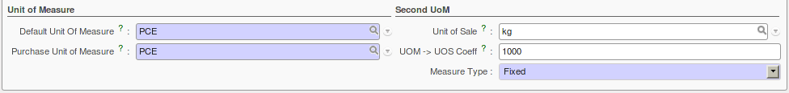
	
	*Secondary Unit of Measure*

.. i18n: In the product form you can set one unit of measure for sales and stock management, and one
.. i18n: unit of measure for purchases.
..

In the product form you can set one unit of measure for sales and stock management, and one
unit of measure for purchases.

.. i18n: For each operation on a product, you can use another unit of
.. i18n: measure, as long as it can be found in the same category as the two units already defined. If you
.. i18n: use another unit of measure, OpenERP automatically handles the conversion of prices and quantities.
..

For each operation on a product, you can use another unit of
measure, as long as it can be found in the same category as the two units already defined. If you
use another unit of measure, OpenERP automatically handles the conversion of prices and quantities.

.. i18n: So if you have 430 Kg of carrots at 5.30 EUR/Kg, OpenERP will automatically make the conversion if
.. i18n: you want to sell in tonnes – 0.43 tonnes at 5300 EUR / tonne. If you had set a rounding factor of
.. i18n: 0.1 for the :guilabel:`tonne` unit of measure, OpenERP will tell you that you have only 0.4 tonnes
.. i18n: available.
..

So if you have 430 Kg of carrots at 5.30 EUR/Kg, OpenERP will automatically make the conversion if
you want to sell in tonnes – 0.43 tonnes at 5300 EUR / tonne. If you had set a rounding factor of
0.1 for the :guilabel:`tonne` unit of measure, OpenERP will tell you that you have only 0.4 tonnes
available.

.. i18n: Packaging
.. i18n: ^^^^^^^^^
..

包装
^^^^^^^^^

.. i18n: The packaging allows you to ship products in several ways. For example, you can ship goods by boxes or by
.. i18n: pallets.
..

The packaging allows you to ship products in several ways. For example, you can ship goods by boxes or by
pallets.

.. i18n: At first, you have to define possible packaging. To define the packaging, go to :menuselection:
.. i18n: `Warehouse --> Configuration --> Product --> Packaging` and click :guilabel:`New`.
..

At first, you have to define possible packaging. To define the packaging, go to :menuselection:
`Warehouse --> Configuration --> Product --> Packaging` and click :guilabel:`New`.

.. i18n: .. figure:: images/packaging.png
.. i18n: 	:scale: 75
.. i18n: 	:align: center
.. i18n: 	
.. i18n: 	*Packaging definition*
..

.. figure:: images/packaging.png
	:scale: 75
	:align: center
	
	*Packaging definition*

.. i18n: To complete the creation of a new packaging, you have to give it a name and a type. Different types are
.. i18n: available in OpenERP: :guilabel:`Box`, :guilabel:`Pack`, :guilabel:`Pallet` and :guilabel:`Unit`.
..

To complete the creation of a new packaging, you have to give it a name and a type. Different types are
available in OpenERP: :guilabel:`Box`, :guilabel:`Pack`, :guilabel:`Pallet` and :guilabel:`Unit`.

.. i18n: Once all packaging is defined, you can attach the packaging to your products through the following menu: 
.. i18n: :menuselection:`Warehouse --> Configuration --> Product --> Packaging`.
..

Once all packaging is defined, you can attach the packaging to your products through the following menu: 
:menuselection:`Warehouse --> Configuration --> Product --> Packaging`.

.. i18n: .. figure:: images/product_packaging.png
.. i18n: 	:scale: 75
.. i18n: 	:align: center
.. i18n: 	
.. i18n: 	*Defining the Packaging for the Product*
..

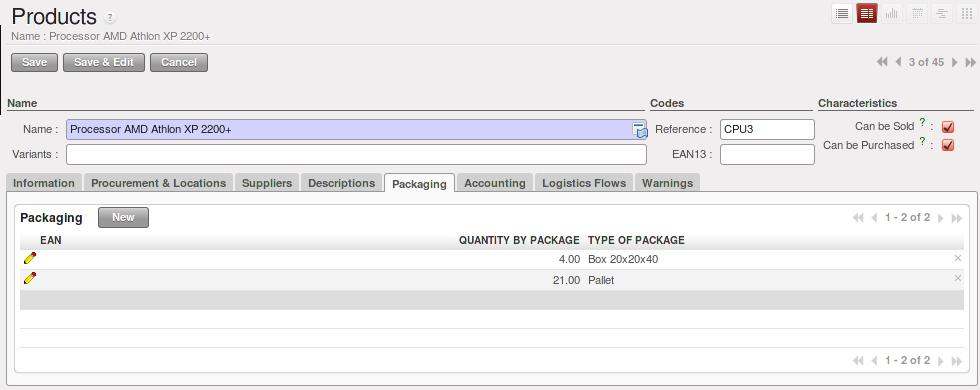
	
	*Defining the Packaging for the Product*

.. i18n: .. Copyright © Open Object Press. All rights reserved.
..

.. Copyright © Open Object Press. All rights reserved.

.. i18n: .. You may take electronic copy of this publication and distribute it if you don't
.. i18n: .. change the content. You can also print a copy to be read by yourself only.
..

.. You may take electronic copy of this publication and distribute it if you don't
.. change the content. You can also print a copy to be read by yourself only.

.. i18n: .. We have contracts with different publishers in different countries to sell and
.. i18n: .. distribute paper or electronic based versions of this book (translated or not)
.. i18n: .. in bookstores. This helps to distribute and promote the OpenERP product. It
.. i18n: .. also helps us to create incentives to pay contributors and authors using author
.. i18n: .. rights of these sales.
..

.. We have contracts with different publishers in different countries to sell and
.. distribute paper or electronic based versions of this book (translated or not)
.. in bookstores. This helps to distribute and promote the OpenERP product. It
.. also helps us to create incentives to pay contributors and authors using author
.. rights of these sales.

.. i18n: .. Due to this, grants to translate, modify or sell this book are strictly
.. i18n: .. forbidden, unless Tiny SPRL (representing Open Object Press) gives you a
.. i18n: .. written authorisation for this.
..

.. Due to this, grants to translate, modify or sell this book are strictly
.. forbidden, unless Tiny SPRL (representing Open Object Press) gives you a
.. written authorisation for this.

.. i18n: .. Many of the designations used by manufacturers and suppliers to distinguish their
.. i18n: .. products are claimed as trademarks. Where those designations appear in this book,
.. i18n: .. and Open Object Press was aware of a trademark claim, the designations have been
.. i18n: .. printed in initial capitals.
..

.. Many of the designations used by manufacturers and suppliers to distinguish their
.. products are claimed as trademarks. Where those designations appear in this book,
.. and Open Object Press was aware of a trademark claim, the designations have been
.. printed in initial capitals.

.. i18n: .. While every precaution has been taken in the preparation of this book, the publisher
.. i18n: .. and the authors assume no responsibility for errors or omissions, or for damages
.. i18n: .. resulting from the use of the information contained herein.
..

.. While every precaution has been taken in the preparation of this book, the publisher
.. and the authors assume no responsibility for errors or omissions, or for damages
.. resulting from the use of the information contained herein.

.. i18n: .. Published by Open Object Press, Grand Rosière, Belgium
..

.. Published by Open Object Press, Grand Rosière, Belgium
