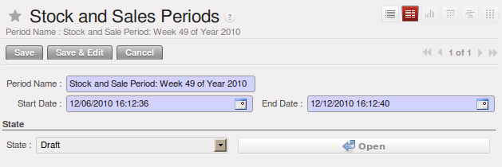
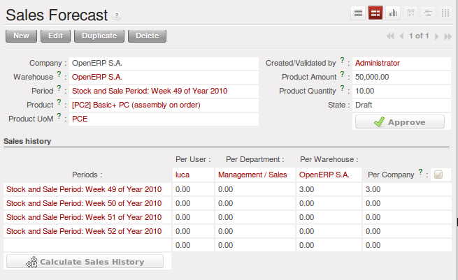

.. i18n: .. index:: MPS
.. i18n: .. index:: Master Production Schedule
.. i18n: .. index:: Master Procurement Schedule
..

.. index:: MPS
.. index:: Master Production Schedule
.. index:: Master Procurement Schedule

.. i18n: Scheduling Procurements
.. i18n: =======================
..

Scheduling Procurements
=======================

.. i18n: The master production plan, sometimes called the MPS (Master Production Schedule), enables you to
.. i18n: generate forecasts for incoming and outgoing material. It is based on forecasts of inputs and outputs
.. i18n: by the logistics manager.
..

The master production plan, sometimes called the MPS (Master Production Schedule), enables you to
generate forecasts for incoming and outgoing material. It is based on forecasts of inputs and outputs
by the logistics manager.

.. i18n: To be able to use the production plan, you must install the :mod:`stock_planning` module.
..

To be able to use the production plan, you must install the :mod:`stock_planning` module.

.. i18n: .. note:: MPS, Procurement and Production
.. i18n: 
.. i18n:    OpenERP distinguishes between Production, Purchase and Procurement.
.. i18n: 
.. i18n:    Production is manufacturing, Purchase is the acquisition of goods from another party,
.. i18n:    and Procurement is either one or both of those. So it would be better to call the
.. i18n:    MPS the Master Procurement Schedule. Which OpenERP does!
..

.. note:: MPS, Procurement and Production

   OpenERP distinguishes between Production, Purchase and Procurement.

   Production is manufacturing, Purchase is the acquisition of goods from another party,
   and Procurement is either one or both of those. So it would be better to call the
   MPS the Master Procurement Schedule. Which OpenERP does!

.. i18n: .. tip:: Product Trading
.. i18n: 
.. i18n:     Also called the Production Plan, this tool is also very useful for traded products which are not
.. i18n:     manufactured.
.. i18n:     You can use it for stock management with purchased and manufactured products.
..

.. tip:: Product Trading

    Also called the Production Plan, this tool is also very useful for traded products which are not
    manufactured.
    You can use it for stock management with purchased and manufactured products.

.. i18n: Processing Exceptions
.. i18n: ---------------------
..

Processing Exceptions
---------------------

.. i18n: The set of stock requirements is generated by procurement orders.
..

The set of stock requirements is generated by procurement orders.

.. i18n: In normal system use, you do not need to worry about procurement orders because they are automatically
.. i18n: generated by OpenERP and the user will usually work on the results of a procurement: a production
.. i18n: order, a purchase order, a sales order and a task.
..

In normal system use, you do not need to worry about procurement orders because they are automatically
generated by OpenERP and the user will usually work on the results of a procurement: a production
order, a purchase order, a sales order and a task.

.. i18n: If there should be configuration problems, the system can remain blocked by a procurement without
.. i18n: generating a corresponding document. For example, suppose that you configure a product :guilabel:`Procurement Method`
.. i18n: as ``Make to Order``, and :guilabel:`Supply Method` as ``Produce``, but you have not defined the bill of materials. In that case, procurement of the product will stay blocked in an exception state ``No Bill of Materials defined for this product``. You then have to create a bill of materials to solve the problem.
..

If there should be configuration problems, the system can remain blocked by a procurement without
generating a corresponding document. For example, suppose that you configure a product :guilabel:`Procurement Method`
as ``Make to Order``, and :guilabel:`Supply Method` as ``Produce``, but you have not defined the bill of materials. In that case, procurement of the product will stay blocked in an exception state ``No Bill of Materials defined for this product``. You then have to create a bill of materials to solve the problem.

.. i18n: Troubleshooting:
..

Troubleshooting:

.. i18n: * No bill of materials defined for production: you need to create a BoM or indicate
.. i18n:   that the product can be purchased instead.
.. i18n: 
.. i18n: * No supplier available for a purchase: you have to define a supplier in the `Supplier` tab
.. i18n:   of the product form.
.. i18n: 
.. i18n: * No address defined on the supplier partner: you have to complete an address for the default supplier
.. i18n:   for the product concerned.
.. i18n: 
.. i18n: * No quantity available in stock: you have to create a rule for automatic procurement (for example, a
.. i18n:   minimum stock rule) and put it in the order, or manually procure it.
..

* No bill of materials defined for production: you need to create a BoM or indicate
  that the product can be purchased instead.

* No supplier available for a purchase: you have to define a supplier in the `Supplier` tab
  of the product form.

* No address defined on the supplier partner: you have to complete an address for the default supplier
  for the product concerned.

* No quantity available in stock: you have to create a rule for automatic procurement (for example, a
  minimum stock rule) and put it in the order, or manually procure it.

.. i18n: Some problems are just those of timing and can be automatically corrected by the system.
..

Some problems are just those of timing and can be automatically corrected by the system.

.. i18n: Use the menu :menuselection:`Warehouse --> Schedulers --> Procurement Exceptions` to see all the exceptions.
..

Use the menu :menuselection:`Warehouse --> Schedulers --> Procurement Exceptions` to see all the exceptions.

.. i18n: If a product has to be 'in stock', but is not available in your stores, OpenERP will make the
.. i18n: exception as 'temporary' or 'to be corrected'. The exception is temporary if the system can procure
.. i18n: it automatically, for example, if a procurement rule is defined for minimum stock.
..

If a product has to be 'in stock', but is not available in your stores, OpenERP will make the
exception as 'temporary' or 'to be corrected'. The exception is temporary if the system can procure
it automatically, for example, if a procurement rule is defined for minimum stock.

.. i18n: .. figure:: images/mrp_exception.png
.. i18n:    :scale: 75
.. i18n:    :align: center
.. i18n: 
.. i18n:    *Example of a Procurement in Exception*
..

.. figure:: images/mrp_exception.png
   :scale: 75
   :align: center

   *Example of a Procurement in Exception*

.. i18n: If no procurement rule is defined, the exception has to be corrected manually by the user. Once the
.. i18n: exception is corrected, you can restart by clicking :guilabel:`Retry`. If you do not do that, 
.. i18n: OpenERP will automatically recalculate on the next automated requirements calculation.
..

If no procurement rule is defined, the exception has to be corrected manually by the user. Once the
exception is corrected, you can restart by clicking :guilabel:`Retry`. If you do not do that, 
OpenERP will automatically recalculate on the next automated requirements calculation.

.. i18n: Manual Procurement
.. i18n: ------------------
..

Manual Procurement
------------------

.. i18n: To procure internally, you can create a procurement order manually. Use the menu
.. i18n: :menuselection:`Warehouse --> Schedulers --> Procurement Exceptions` and click the `New` button to do this.
..

To procure internally, you can create a procurement order manually. Use the menu
:menuselection:`Warehouse --> Schedulers --> Procurement Exceptions` and click the `New` button to do this.

.. i18n: .. figure:: images/mrp_procurement.png
.. i18n:    :scale: 75
.. i18n:    :align: center
.. i18n: 
.. i18n:    *Encoding a New Procurement Order*
..

.. figure:: images/mrp_procurement.png
   :scale: 75
   :align: center

   *Encoding a New Procurement Order*

.. i18n: The procurement order will then be responsible for calculating a proposal for automatic procurement
.. i18n: for the product concerned. This procurement will start a task, a purchase order for the supplier or
.. i18n: a production depending on the product configuration.
..

The procurement order will then be responsible for calculating a proposal for automatic procurement
for the product concerned. This procurement will start a task, a purchase order for the supplier or
a production depending on the product configuration.

.. i18n: .. figure:: images/mrp_procurement_flow.png
.. i18n:    :scale: 65
.. i18n:    :align: center
.. i18n: 
.. i18n:    *Workflow for Handling a Procurement according to Product Configuration*
..

.. figure:: images/mrp_procurement_flow.png
   :scale: 65
   :align: center

   *Workflow for Handling a Procurement according to Product Configuration*

.. i18n: It is better to encode a procurement order rather than direct purchasing or production. This method
.. i18n: has the following advantages:
..

It is better to encode a procurement order rather than direct purchasing or production. This method
has the following advantages:

.. i18n: * The form is simpler because OpenERP calculates the different values from other values and defined rules: purchase date calculated from order date, default supplier, raw materials needs, selection of the most suitable bill of materials, etc.
.. i18n: 
.. i18n: * The calculation of requirements prioritises the procurements. If you encode a purchase directly, you short-circuit the planning of different procurements.
..

* The form is simpler because OpenERP calculates the different values from other values and defined rules: purchase date calculated from order date, default supplier, raw materials needs, selection of the most suitable bill of materials, etc.

* The calculation of requirements prioritises the procurements. If you encode a purchase directly, you short-circuit the planning of different procurements.

.. i18n: .. tip:: Shortcuts
.. i18n: 
.. i18n:    On the product form you have an :guilabel:`ACTIONS` shortcut button :guilabel:`Create Procurements`
.. i18n:    that lets you quickly create a new procurement order.
..

.. tip:: Shortcuts

   On the product form you have an :guilabel:`ACTIONS` shortcut button :guilabel:`Create Procurements`
   that lets you quickly create a new procurement order.

.. i18n: .. index::
.. i18n:    single: module; stock_planning
..

.. index::
   single: module; stock_planning

.. i18n: .. index:: forecasts
..

.. index:: forecasts

.. i18n: Sales Forecasts
.. i18n: ---------------
..

Sales Forecasts
---------------

.. i18n: The first thing you have to do to work with a production plan is define the periods for stock management.
.. i18n: Some companies plan daily, others weekly or monthly.
..

The first thing you have to do to work with a production plan is define the periods for stock management.
Some companies plan daily, others weekly or monthly.

.. i18n: .. tip:: Stock Management Interval
.. i18n: 
.. i18n:    The interval chosen for managing stock in the production plan will depend on the length of your
.. i18n:    production cycle. You generally work daily, weekly or monthly.
.. i18n: 
.. i18n:    If it takes several days to assemble your products, you most likely will define a weekly plan. If your
.. i18n:    manufacturing cycles take several months, you can work with a monthly plan.
.. i18n:    
.. i18n:    To predefine these periods you can use the :menuselection:`Stock and Sales Planning Periods` that will automatically generate 
.. i18n:    daily, weekly or monthly periods.
.. i18n:    
.. i18n:    .. _fig-stfore:
.. i18n: 
.. i18n:    .. figure:: images/stock_sales_periods.png
.. i18n: 	  :scale: 75
.. i18n: 	  :align: center
.. i18n: 	  
.. i18n: 	  *Stock and Sales Planning Periods*
..

.. tip:: Stock Management Interval

   The interval chosen for managing stock in the production plan will depend on the length of your
   production cycle. You generally work daily, weekly or monthly.

   If it takes several days to assemble your products, you most likely will define a weekly plan. If your
   manufacturing cycles take several months, you can work with a monthly plan.
   
   To predefine these periods you can use the :menuselection:`Stock and Sales Planning Periods` that will automatically generate 
   daily, weekly or monthly periods.
   
   .. _fig-stfore:

   .. figure:: images/stock_sales_periods.png
	  :scale: 75
	  :align: center
	  
	  *Stock and Sales Planning Periods*

.. i18n: Go to the menu :menuselection:`Sales --> Configuration --> Stock and Sales Periods -->
.. i18n: Create Stock and Sales Periods`. A window appears enabling you to automatically define the next periods that will be
.. i18n: provided for stock management. For this example, create weekly periods.
..

Go to the menu :menuselection:`Sales --> Configuration --> Stock and Sales Periods -->
Create Stock and Sales Periods`. A window appears enabling you to automatically define the next periods that will be
provided for stock management. For this example, create weekly periods.

.. i18n: .. figure:: images/sale_period.png
.. i18n:    :scale: 75
.. i18n:    :align: center
.. i18n: 
.. i18n:    *Defining Periods for Stock Management*
..

   *Defining Periods for Stock Management*

.. i18n: Salespeople can then enter their sales forecasts by product and by period using the menu
.. i18n: :menuselection:`Sales --> Sales Forecasts --> Sales Forecasts`. The forecasts can be
.. i18n: made by quantity or by value. For a forecast by amount, OpenERP automatically calculates the
.. i18n: quantity equivalent to the estimated amount. This can be modified manually as needed before
.. i18n: completion. A salesperson can create sales forecasts manually, or he can use the `Create Sales Forecasts` wizard in the above menu.
..

Salespeople can then enter their sales forecasts by product and by period using the menu
:menuselection:`Sales --> Sales Forecasts --> Sales Forecasts`. The forecasts can be
made by quantity or by value. For a forecast by amount, OpenERP automatically calculates the
quantity equivalent to the estimated amount. This can be modified manually as needed before
completion. A salesperson can create sales forecasts manually, or he can use the `Create Sales Forecasts` wizard in the above menu.

.. i18n: .. figure:: images/stock_sale_forecast.png
.. i18n:    :scale: 75
.. i18n:    :align: center
.. i18n: 
.. i18n:    *Sales Forecast to Help Create a Master Production Plan*
..

   *Sales Forecast to Help Create a Master Production Plan*

.. i18n: .. index::
.. i18n:    single: plan; production
..

.. index::
   single: plan; production

.. i18n: Production Plan
.. i18n: ---------------
..

Production Plan
---------------

.. i18n: The manager responsible for logistics then plans receipts (manufacturing or purchases) and outgoings
.. i18n: (consumption or customer deliveries) by period. From the menu :menuselection:`Warehouse --> Stock Planning --> Create Stock Planning Lines`, you can create a stock planning per week for a specific product category. Through  :menuselection:`Warehouse --> Stock Planning --> Master Procurement Schedule` you can adjust the planning.
..

The manager responsible for logistics then plans receipts (manufacturing or purchases) and outgoings
(consumption or customer deliveries) by period. From the menu :menuselection:`Warehouse --> Stock Planning --> Create Stock Planning Lines`, you can create a stock planning per week for a specific product category. Through  :menuselection:`Warehouse --> Stock Planning --> Master Procurement Schedule` you can adjust the planning.

.. i18n: For each period and product, OpenERP gives you the following information:
..

For each period and product, OpenERP gives you the following information:

.. i18n: * Stock estimated at the end of the period, calculated as stock in the following period less the total
.. i18n:   estimated outgoings plus total estimated inputs,
.. i18n: 
.. i18n: * Closed entries, coming from production or confirmed purchases,
.. i18n: 
.. i18n: * Forecast inputs for the period, calculated using the incoming entries less the closing amounts,
.. i18n: 
.. i18n: * Planned inputs entered manually by the logistics manager,
.. i18n: 
.. i18n: * Closed outgoings which are the consumption of manufacturing waiting and deliveries to be made to
.. i18n:   customers,
.. i18n: 
.. i18n: * Forecast outgoings, calculated from the planned outgoings, less the closing amounts,
.. i18n: 
.. i18n: * Planned outgoings, manually entered by the logistics manager,
.. i18n: 
.. i18n: * Sales forecasts, which represent the sum of forecasts made by the salespeople.
..

* Stock estimated at the end of the period, calculated as stock in the following period less the total
  estimated outgoings plus total estimated inputs,

* Closed entries, coming from production or confirmed purchases,

* Forecast inputs for the period, calculated using the incoming entries less the closing amounts,

* Planned inputs entered manually by the logistics manager,

* Closed outgoings which are the consumption of manufacturing waiting and deliveries to be made to
  customers,

* Forecast outgoings, calculated from the planned outgoings, less the closing amounts,

* Planned outgoings, manually entered by the logistics manager,

* Sales forecasts, which represent the sum of forecasts made by the salespeople.

.. i18n: .. figure:: images/stock_forecast.png
.. i18n:    :scale: 75
.. i18n:    :align: center
.. i18n: 
.. i18n:    *The Master Production Schedule (MPS)*
..

.. figure:: images/stock_forecast.png
   :scale: 75
   :align: center

   *The Master Production Schedule (MPS)*

.. i18n: The production plan enables the logistics manager to play with the forecast receipts and
.. i18n: outgoings and test the impact on the future stock for the product concerned. It enables
.. i18n: you, for example, to check that the stock does not fall below a certain level for that product.
..

The production plan enables the logistics manager to play with the forecast receipts and
outgoings and test the impact on the future stock for the product concerned. It enables
you, for example, to check that the stock does not fall below a certain level for that product.

.. i18n: You can also open the production plan for past periods. In this case, OpenERP shows you the real
.. i18n: stock moves, by period for forecast reports.
..

You can also open the production plan for past periods. In this case, OpenERP shows you the real
stock moves, by period for forecast reports.

.. i18n: If you do not have automated procurement rules for a product, you can start procurement at any time
.. i18n: based on the estimates of the production plan.
.. i18n: To do this, press the button :guilabel:`Procure Incoming Left` (i.e. remaining) on
.. i18n: the :guilabel:`Master Procurement Schedule`.
.. i18n: OpenERP plans procurement for an amount equal to the entries forecast.
..

If you do not have automated procurement rules for a product, you can start procurement at any time
based on the estimates of the production plan.
To do this, press the button :guilabel:`Procure Incoming Left` (i.e. remaining) on
the :guilabel:`Master Procurement Schedule`.
OpenERP plans procurement for an amount equal to the entries forecast.

.. i18n: .. Copyright © Open Object Press. All rights reserved.
..

.. Copyright © Open Object Press. All rights reserved.

.. i18n: .. You may take electronic copy of this publication and distribute it if you don't
.. i18n: .. change the content. You can also print a copy to be read by yourself only.
..

.. You may take electronic copy of this publication and distribute it if you don't
.. change the content. You can also print a copy to be read by yourself only.

.. i18n: .. We have contracts with different publishers in different countries to sell and
.. i18n: .. distribute paper or electronic based versions of this book (translated or not)
.. i18n: .. in bookstores. This helps to distribute and promote the OpenERP product. It
.. i18n: .. also helps us to create incentives to pay contributors and authors using author
.. i18n: .. rights of these sales.
..

.. We have contracts with different publishers in different countries to sell and
.. distribute paper or electronic based versions of this book (translated or not)
.. in bookstores. This helps to distribute and promote the OpenERP product. It
.. also helps us to create incentives to pay contributors and authors using author
.. rights of these sales.

.. i18n: .. Due to this, grants to translate, modify or sell this book are strictly
.. i18n: .. forbidden, unless Tiny SPRL (representing Open Object Press) gives you a
.. i18n: .. written authorisation for this.
..

.. Due to this, grants to translate, modify or sell this book are strictly
.. forbidden, unless Tiny SPRL (representing Open Object Press) gives you a
.. written authorisation for this.

.. i18n: .. Many of the designations used by manufacturers and suppliers to distinguish their
.. i18n: .. products are claimed as trademarks. Where those designations appear in this book,
.. i18n: .. and Open Object Press was aware of a trademark claim, the designations have been
.. i18n: .. printed in initial capitals.
..

.. Many of the designations used by manufacturers and suppliers to distinguish their
.. products are claimed as trademarks. Where those designations appear in this book,
.. and Open Object Press was aware of a trademark claim, the designations have been
.. printed in initial capitals.

.. i18n: .. While every precaution has been taken in the preparation of this book, the publisher
.. i18n: .. and the authors assume no responsibility for errors or omissions, or for damages
.. i18n: .. resulting from the use of the information contained herein.
..

.. While every precaution has been taken in the preparation of this book, the publisher
.. and the authors assume no responsibility for errors or omissions, or for damages
.. resulting from the use of the information contained herein.

.. i18n: .. Published by Open Object Press, Grand Rosière, Belgium
..

.. Published by Open Object Press, Grand Rosière, Belgium
