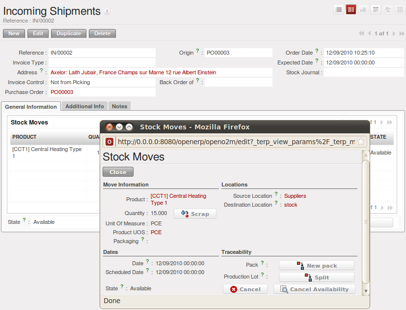
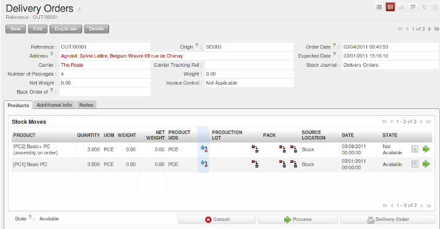

.. i18n: Managing Lots and Traceability
.. i18n: ==============================
..

管理批次和可追溯性
==============================

.. i18n: The double-entry management in OpenERP enables you to run very advanced traceability. All
.. i18n: operations are formalized in terms of stock moves, so it is very easy to search for the cause of any
.. i18n: gaps in stock moves.
..

The double-entry management in OpenERP enables you to run very advanced traceability. All
operations are formalized in terms of stock moves, so it is very easy to search for the cause of any
gaps in stock moves.

.. i18n: .. index::
.. i18n:    single: traceability; upstream
.. i18n:    single: traceability; downstream
..

.. index::
   single: traceability; upstream
   single: traceability; downstream

.. i18n: .. note:: Upstream Traceability
.. i18n: 
.. i18n:     It runs from the raw materials received from the supplier and follows the
.. i18n:     chain to the finished products delivered to customers.
.. i18n:     (Note that the name is confusing - this would often be considered a downstream direction.
.. i18n:     Think of it as **Where Used**.)
.. i18n:     
.. i18n: .. note:: Downstream Traceability
.. i18n: 
.. i18n:     It follows the product in the other direction, from customer to the
.. i18n:     different suppliers of raw material.
.. i18n:     (Note that the name is confusing - this would often be considered an upstream direction.
.. i18n:     Think of it as **Where Supplied**.)
..

.. note:: Upstream Traceability

    It runs from the raw materials received from the supplier and follows the
    chain to the finished products delivered to customers.
    (Note that the name is confusing - this would often be considered a downstream direction.
    Think of it as **Where Used**.)
    
.. note:: Downstream Traceability

    It follows the product in the other direction, from customer to the
    different suppliers of raw material.
    (Note that the name is confusing - this would often be considered an upstream direction.
    Think of it as **Where Supplied**.)

.. i18n: Stock Moves
.. i18n: -----------
..

库存调拨
-----------

.. i18n: Use the menu :menuselection:`Warehouse --> Traceability --> Stock Moves`
.. i18n: to track past stock transactions for a product or a given location. All the operations
.. i18n: are available. You can filter on the various fields to retrieve the operations about an order,
.. i18n: or a production activity, or a source location, or any given destination.
..

Use the menu :menuselection:`Warehouse --> Traceability --> Stock Moves`
to track past stock transactions for a product or a given location. All the operations
are available. You can filter on the various fields to retrieve the operations about an order,
or a production activity, or a source location, or any given destination.

.. i18n: .. figure:: images/stock_move_tree.png
.. i18n:    :scale: 65
.. i18n:    :align: center
.. i18n: 
.. i18n:    *History of Stock Movements*
..

.. figure:: images/stock_move_tree.png
   :scale: 65
   :align: center

   *History of Stock Movements*

.. i18n: Each stock move is in a given state. The various states are:
..

Each stock move is in a given state. The various states are:

.. i18n: * ``Draft`` : the move so far has no effect in the system. The transaction has not yet been confirmed,
.. i18n: 
.. i18n: * ``Not available``: the move will be done, so it will be counted in the calculations of virtual stock. But
.. i18n:   you do not know whether it will be done without problem because the products have not been reserved for
.. i18n:   the move,
.. i18n: 
.. i18n: * ``Available`` : the move will be done and the necessary raw materials have been reserved for the
.. i18n:   transaction,
.. i18n: 
.. i18n: * ``Done`` : the stock move (picking) has been done, and entered into the calculations of real stock,
.. i18n: 
.. i18n: * ``Waiting`` : in the case of transactions ``From Order``, this state shows that the stock move is blocked
.. i18n:   waiting for the end of another move,
.. i18n: 
.. i18n: * ``Cancelled`` : the stock move was not carried out, so it is not taken into account in either real stock or
.. i18n:   virtual stock.
..

* ``Draft`` : the move so far has no effect in the system. The transaction has not yet been confirmed,

* ``Not available``: the move will be done, so it will be counted in the calculations of virtual stock. But
  you do not know whether it will be done without problem because the products have not been reserved for
  the move,

* ``Available`` : the move will be done and the necessary raw materials have been reserved for the
  transaction,

* ``Done`` : the stock move (picking) has been done, and entered into the calculations of real stock,

* ``Waiting`` : in the case of transactions ``From Order``, this state shows that the stock move is blocked
  waiting for the end of another move,

* ``Cancelled`` : the stock move was not carried out, so it is not taken into account in either real stock or
  virtual stock.

.. i18n: Delivery orders, goods receipts and internal picking lists are just documents that group a set of
.. i18n: stock moves. You can also consult the history of these documents using the menu
.. i18n: :menuselection:`Warehouse --> Traceability --> Packs`.
..

Delivery orders, goods receipts and internal picking lists are just documents that group a set of
stock moves. You can also consult the history of these documents using the menu
:menuselection:`Warehouse --> Traceability --> Packs`.

.. i18n: Lots
.. i18n: ----
..

批次
----

.. i18n: OpenERP can also manage product lots. Two lot types are defined:
..

OpenERP can also manage product lots. Two lot types are defined:

.. i18n: * Production lots (batch numbers) are represented by a unique product or an assembly of identical
.. i18n:   products leaving the same production area. They are usually identified by bar codes stuck on the
.. i18n:   products. The batch can be marked with a supplier number or your own company numbers.
.. i18n: 
.. i18n: * Tracking numbers are logistical lots to identify the container for a set of
.. i18n:   products. This corresponds, for example, to the pallet numbers on which several different products
.. i18n:   are stocked.
..

* Production lots (batch numbers) are represented by a unique product or an assembly of identical
  products leaving the same production area. They are usually identified by bar codes stuck on the
  products. The batch can be marked with a supplier number or your own company numbers.

* Tracking numbers are logistical lots to identify the container for a set of
  products. This corresponds, for example, to the pallet numbers on which several different products
  are stocked.

.. i18n: These lots can be encoded onto all stock moves and, specifically, on incoming shipments lines, internal moves
.. i18n: and outgoing deliveries.
..

These lots can be encoded onto all stock moves and, specifically, on incoming shipments lines, internal moves
and outgoing deliveries.

.. i18n: .. figure:: images/picking_form_line.png
.. i18n:    :scale: 75
.. i18n:    :align: center
.. i18n: 
.. i18n:    *Entering a Line for Production Receipt*
..

   *Entering a Line for Production Receipt*

.. i18n: To enter the lot number in an operation, you can use an existing lot number or create a new pack. A
.. i18n: production lot (batch number) is used for a single product. A tracking number can be
.. i18n: used several times for different products, so you can mix different products on a pallet or in a box.
..

To enter the lot number in an operation, you can use an existing lot number or create a new pack. A
production lot (batch number) is used for a single product. A tracking number can be
used several times for different products, so you can mix different products on a pallet or in a box.

.. i18n: .. note:: Simplified View
.. i18n: 
.. i18n:     In the ``Simplified`` view, the tracking numbers cannot be seen: the field is hidden.
.. i18n:     To get to ``Extended`` view mode, assign the group
.. i18n:     :guilabel:`Useability / Extended View` to the current user, or change the User Preferences.
..

.. note:: Simplified View

    In the ``Simplified`` view, the tracking numbers cannot be seen: the field is hidden.
    To get to ``Extended`` view mode, assign the group
    :guilabel:`Useability / Extended View` to the current user, or change the User Preferences.

.. i18n: You can also specify on the product form the operations in which a lot number is
.. i18n: required. You can then compel the user to set a lot number for manufacturing operations, goods
.. i18n: receipt, or customer packing.
..

You can also specify on the product form the operations in which a lot number is
required. You can then compel the user to set a lot number for manufacturing operations, goods
receipt, or customer packing.

.. i18n: You do not have to encode the lot numbers one by one to assign a unique lot number to a set of several items.
.. i18n: You only need to take a stock move for several products line and click the button
.. i18n: :guilabel:`Split in Production Lots`. You can then give a lot number prefix (if you want) and OpenERP will
.. i18n: complete the prefix in the wizard with a continuing sequence number. This sequence number
.. i18n: might correspond to a set of pre-printed barcodes that you stick on each product.
..

You do not have to encode the lot numbers one by one to assign a unique lot number to a set of several items.
You only need to take a stock move for several products line and click the button
:guilabel:`Split in Production Lots`. You can then give a lot number prefix (if you want) and OpenERP will
complete the prefix in the wizard with a continuing sequence number. This sequence number
might correspond to a set of pre-printed barcodes that you stick on each product.

.. i18n: .. figure:: images/picking_split_lot.png
.. i18n:    :scale: 75
.. i18n:    :align: center
.. i18n: 
.. i18n:    *Splitting a Lot into uniquely Identified Parts*
..

.. figure:: images/picking_split_lot.png
   :scale: 75
   :align: center

   *Splitting a Lot into uniquely Identified Parts*

.. i18n: .. index:: traceability (stock)
..

.. index:: traceability (stock)

.. i18n: Traceability
.. i18n: ------------
..

可追溯性
------------

.. i18n: If you key in the lot numbers for stock moves as described above, you can investigate the traceability of any
.. i18n: given lot number. Go to the menu :menuselection:`Warehouse --> Traceability -->
.. i18n: Production Lots` or :menuselection:`Warehouse --> Traceability --> Packs`.
..

如果你在收/发货时 为移库单录入了批次号, 那你以后就可以用这个批次号进行移库追踪.
相应菜单项:
英文 :menuselection:`Warehouse --> Traceability -->
Production Lots` 或者 :menuselection:`Warehouse --> Traceability --> Packs`
中文 :menuselection:`仓库 --> 可追溯的 --> 生产批次` 或者 :menuselection:`仓库 --> 可追溯的 --> 包装`.

.. i18n: .. tip:: Product Shortcuts
.. i18n: 
.. i18n:     From the product form, the toolbar to the right offers useful information:
.. i18n: 
.. i18n:     * :guilabel:`Minimum Stock Rules`,
.. i18n: 
.. i18n:     * :guilabel:`Stock by Location`,
.. i18n: 
.. i18n:     * :guilabel:`Product Sales`,
.. i18n: 
.. i18n:     * :guilabel:`Bills of Material`.
..

.. tip:: Product Shortcuts

    From the product form, the toolbar to the right offers useful information:

    * :guilabel:`Minimum Stock Rules`,

    * :guilabel:`Stock by Location`,

    * :guilabel:`Product Sales`,

    * :guilabel:`Bills of Material`.

.. i18n: Search for a particular lot using the filters for the lot number, the date or the product. Once you
.. i18n: can see the form about this lot, several actions can be performed:
..

Search for a particular lot using the filters for the lot number, the date or the product. Once you
can see the form about this lot, several actions can be performed:

.. i18n: * :guilabel:`Upstream Traceability`: from supplier through to customers,
.. i18n: 
.. i18n: * :guilabel:`Downstream Traceability`: from customer back to suppliers,
.. i18n: 
.. i18n: * Stock in all the physical and virtual locations.
..

* :guilabel:`Upstream Traceability`: from supplier through to customers,

* :guilabel:`Downstream Traceability`: from customer back to suppliers,

* Stock in all the physical and virtual locations.

.. i18n: .. figure:: images/stock_traceability_upstream.png
.. i18n:    :scale: 75
.. i18n:    :align: center
.. i18n: 
.. i18n:    *Tracing Upstream in Make to Order*
..

.. figure:: images/stock_traceability_upstream.png
   :scale: 75
   :align: center

   *Tracing Upstream in Make to Order*

.. i18n: .. figure:: images/stock_traceability_downstream.png
.. i18n:    :scale: 75
.. i18n:    :align: center
.. i18n: 
.. i18n:    *Tracing Downstream in Make to Stock*
..

.. figure:: images/stock_traceability_downstream.png
   :scale: 75
   :align: center

   *Tracing Downstream in Make to Stock*

.. i18n: Finally, on a lot, you can enter data on all the operations that have been done for the product. That
.. i18n: keeps a useful history of the pre-sales operations.
..

Finally, on a lot, you can enter data on all the operations that have been done for the product. That
keeps a useful history of the pre-sales operations.

.. i18n: Scrapping Products
.. i18n: ==================
..

报废产品
==================

.. i18n: In OpenERP, there are many ways to handle scrap products. 
..

In OpenERP, there are many ways to handle scrap products. 

.. i18n: #. :menuselection:`Warehouse --> Product Moves --> Receive Products`
.. i18n: 
.. i18n: #. :menuselection:`Warehouse --> Product Moves --> Deliver Products`
.. i18n: 
.. i18n: #. :menuselection:`Warehouse --> Warehouse Management --> Incoming Shipments`
..

#. :menuselection:`Warehouse --> Product Moves --> Receive Products`

#. :menuselection:`Warehouse --> Product Moves --> Deliver Products`

#. :menuselection:`Warehouse --> Warehouse Management --> Incoming Shipments`

.. i18n:     .. figure:: images/incoming_scrap.png
.. i18n: 	   :scale: 75
.. i18n: 	   :align: center
.. i18n: 	
.. i18n: 	   *Scrapping from an Incoming Shipment*
..

    .. figure:: images/incoming_scrap.png
	   :scale: 75
	   :align: center
	
	   *Scrapping from an Incoming Shipment*

.. i18n: #. :menuselection:`Warehouse --> Warehouse Management --> Internal Moves`
..

#. :menuselection:`Warehouse --> Warehouse Management --> Internal Moves`

.. i18n:    .. figure:: images/internal_scrap.png
.. i18n: 	  :scale: 75
.. i18n: 	  :align: center
.. i18n: 	
.. i18n: 	  *Scrapping from an Internal Move*	
..

   .. figure:: images/internal_scrap.png
	  :scale: 75
	  :align: center
	
	  *Scrapping from an Internal Move*	

.. i18n: #. :menuselection:`Warehouse --> Warehouse Management --> Delivery Orders`
..

#. :menuselection:`Warehouse --> Warehouse Management --> Delivery Orders`

.. i18n: .. figure:: images/delivery_scrap.png
.. i18n: 	  :scale: 75
.. i18n: 	  :align: center
.. i18n: 	
.. i18n: 	  *Scrapping from a Delivery Order*	
..

	
	  *Scrapping from a Delivery Order*	

.. i18n: When you decide to scrap some products, they are transferred to the :guilabel:`Scrap` location.
.. i18n: To display the content of this :guilabel:`Virtual Location`, go to :menuselection:
.. i18n: `Warehouse --> Inventory Control --> Location Structure`, then select the virtual locations and display the
.. i18n: :guilabel:`Scrap` location.
..

When you decide to scrap some products, they are transferred to the :guilabel:`Scrap` location.
To display the content of this :guilabel:`Virtual Location`, go to :menuselection:
`Warehouse --> Inventory Control --> Location Structure`, then select the virtual locations and display the
:guilabel:`Scrap` location.

.. i18n: If you want to transfer the products to another location, you can create a new one and check the 
.. i18n: :guilabel:`Scrap Location` in the additional information.
..

If you want to transfer the products to another location, you can create a new one and check the 
:guilabel:`Scrap Location` in the additional information.

.. i18n: Identifying Products and Locations with Barcodes and RFID Devices
.. i18n: =================================================================
..

使用条码和RFID设备标识产品和库位
=================================================================

.. i18n: You can the barcode in the product form in the field :guilabel:`EAN13`.
..

You can the barcode in the product form in the field :guilabel:`EAN13`.

.. i18n: .. Copyright © Open Object Press. All rights reserved.
..

.. Copyright © Open Object Press. All rights reserved.

.. i18n: .. You may take electronic copy of this publication and distribute it if you don't
.. i18n: .. change the content. You can also print a copy to be read by yourself only.
..

.. You may take electronic copy of this publication and distribute it if you don't
.. change the content. You can also print a copy to be read by yourself only.

.. i18n: .. We have contracts with different publishers in different countries to sell and
.. i18n: .. distribute paper or electronic based versions of this book (translated or not)
.. i18n: .. in bookstores. This helps to distribute and promote the OpenERP product. It
.. i18n: .. also helps us to create incentives to pay contributors and authors using author
.. i18n: .. rights of these sales.
..

.. We have contracts with different publishers in different countries to sell and
.. distribute paper or electronic based versions of this book (translated or not)
.. in bookstores. This helps to distribute and promote the OpenERP product. It
.. also helps us to create incentives to pay contributors and authors using author
.. rights of these sales.

.. i18n: .. Due to this, grants to translate, modify or sell this book are strictly
.. i18n: .. forbidden, unless Tiny SPRL (representing Open Object Press) gives you a
.. i18n: .. written authorisation for this.
..

.. Due to this, grants to translate, modify or sell this book are strictly
.. forbidden, unless Tiny SPRL (representing Open Object Press) gives you a
.. written authorisation for this.

.. i18n: .. Many of the designations used by manufacturers and suppliers to distinguish their
.. i18n: .. products are claimed as trademarks. Where those designations appear in this book,
.. i18n: .. and Open Object Press was aware of a trademark claim, the designations have been
.. i18n: .. printed in initial capitals.
..

.. Many of the designations used by manufacturers and suppliers to distinguish their
.. products are claimed as trademarks. Where those designations appear in this book,
.. and Open Object Press was aware of a trademark claim, the designations have been
.. printed in initial capitals.

.. i18n: .. While every precaution has been taken in the preparation of this book, the publisher
.. i18n: .. and the authors assume no responsibility for errors or omissions, or for damages
.. i18n: .. resulting from the use of the information contained herein.
..

.. While every precaution has been taken in the preparation of this book, the publisher
.. and the authors assume no responsibility for errors or omissions, or for damages
.. resulting from the use of the information contained herein.

.. i18n: .. Published by Open Object Press, Grand Rosière, Belgium
..

.. Published by Open Object Press, Grand Rosière, Belgium
