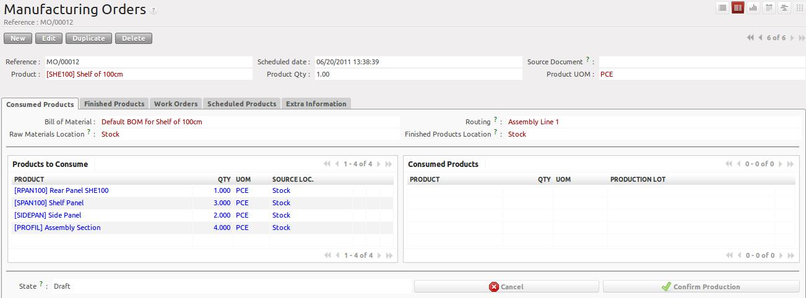
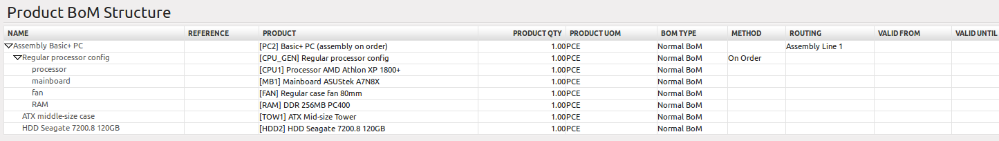
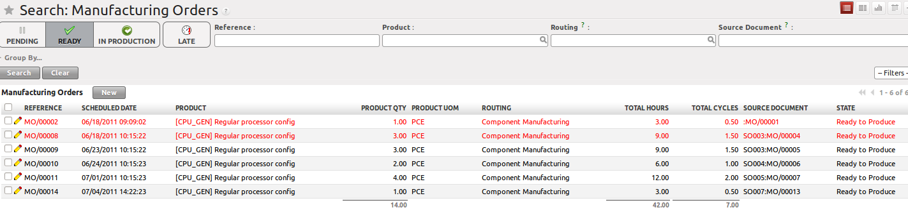
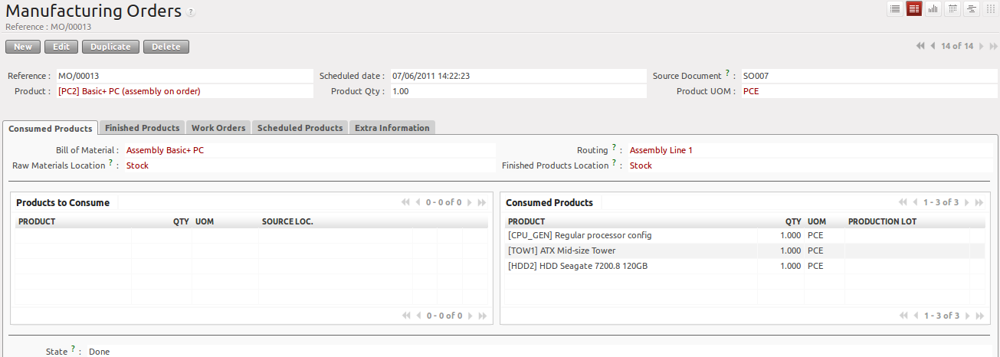
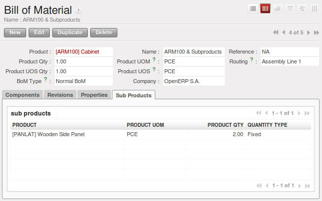
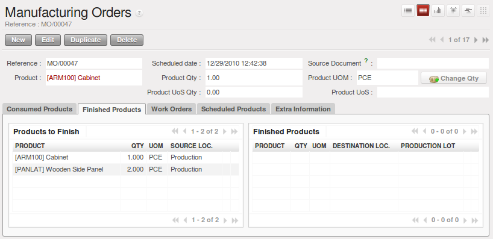
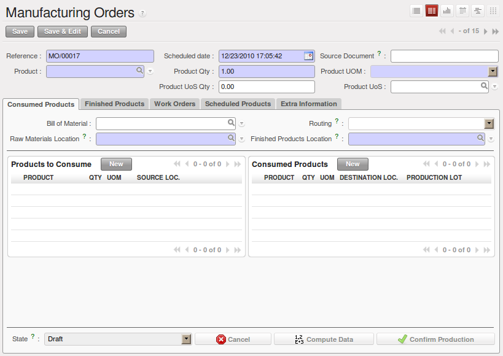
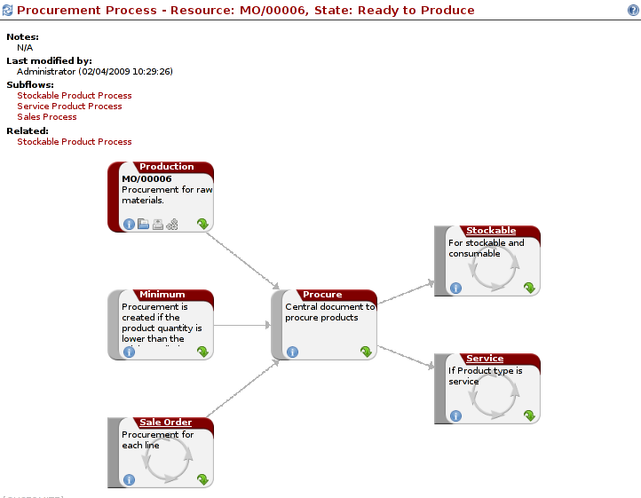

.. i18n: Manufacturing Orders
.. i18n: ====================
..

生产计划单
====================

.. i18n: Once the bills of materials have been defined, OpenERP is capable of automatically deciding on the manufacturing route according to the needs of the company.
..

一旦物料清单定义好，OpenERP能够根据该公司的需求自动决定制造路线.

.. i18n: Production orders can be proposed automatically by the system depending on several criteria described in the preceding chapter:
..

生产订单可以由系统根据前面的章节中描述的一些标准自动产生:

.. i18n: * Using the ``Make to Order`` rules,
.. i18n: 
.. i18n: * Using the ``Order Point`` (Minimum Stock) rules,
.. i18n: 
.. i18n: * Using the Production plan.
..

* 使用 ``Make to Order`` 规则,

* 使用 ``Order Point`` (最小库存) 规则,

* 使用生产计划.

.. i18n: Of course, you can also start production manually by clicking the button :guilabel:`New` in the menu :menuselection:`Manufacturing --> Manufacturing --> Manufacturing Orders`.
..

当然, 你可以在菜单 :menuselection:`Manufacturing --> Manufacturing --> Manufacturing Orders` , 点击 :guilabel:`New` 按钮手动建立生产订单 .

.. i18n: .. figure:: images/mrp_manual.png
.. i18n:    :scale: 75
.. i18n:    :align: center
.. i18n: 
.. i18n:    *Manufacturing Order*
..

   *生成订单*

.. i18n: .. index::
.. i18n:    single: module; mrp_jit
..

.. index::
   single: module; mrp_jit

.. i18n: If you have not installed the Just-in-Time planning module :mod:`mrp_jit`, you should start using OpenERP to schedule the Production Orders automatically using the various system rules. To do this, use the menu :menuselection:`Warehouse --> Schedulers --> Compute Schedulers`.
..

如果你没有安装 Just-in-Time 计划模块 :mod:`mrp_jit`, 你要Openerp通过各种不同系统规则安排生产订单. 需要这样做,执行菜单:menuselection:`Warehouse --> Schedulers --> Compute Schedulers`.

.. i18n: .. tip:: Procurement Exceptions
.. i18n: 
.. i18n:         Pay attention to the fact that you have to define `minimum stock rules` for each product set as ``Make to Stock``.
..

.. tip:: 采购例外

        注意，如果产品设置为 ``Make to Stock`` ，你需要对每个产品定义 `最小库存规则` .

.. i18n: Complete Production Workflow
.. i18n: ============================
..

完成生产流程
============================

.. i18n: To understand the usefulness and the functioning of the system you should test a complete workflow
.. i18n: on the database installed with the demonstration data. We will show you:
..

要了解的系统功能和系统如何运作的，你需要安装带演示数据的数据库，我们将向您展示，测试一个完整的工作流程:

.. i18n: * How to create a sales order,
.. i18n: 
.. i18n: * The manufacturing workflow for an intermediate product,
.. i18n: 
.. i18n: * The manufacturing of an ordered product,
.. i18n: 
.. i18n: * The delivery of products to a customer,
.. i18n: 
.. i18n: * Invoicing at the end of the month,
.. i18n: 
.. i18n: * Traceability for after-sales service.
..

* 如何创建销售订单,

* 中间产品的制造工作流程,

* 订购的产品的制造,

* 交付产品给客户,

* Invoicing at the end of the month,

* 可追溯性的售后服务.

.. i18n: .. tip:: Demonstration data
.. i18n: 
.. i18n:     To exactly follow the workflow as shown below, you should keep the same quantities as in the
.. i18n:     example and start from a new database. Then you will not run into exceptions resulting from a lack of stock.
..

.. tip:: 示范数据

    要严格遵循工作流程如下图所示，你应该从一个新的数据库开始，
    使用和本例中相同的数量，那么，你将不会碰到因库存不足造成的例外状况.

.. i18n: This more advanced case of handling problems in procurement will be sorted out later in the chapter.
..

更高级的采购问题的处理将在本章的后面来解决.

.. i18n: To be able to do the following step, add ``Sales Management`` through the Reconfigure wizard.
..

可以做以下步骤，通过重新配置向导添加销售管理 ``Sales Management`` .

.. i18n: The Sales Order
.. i18n: +++++++++++++++
..

销售单
+++++++++++++++

.. i18n: .. index:: quotation
.. i18n: .. index:: sales order
..

.. index:: quotation
.. index:: sales order

.. i18n: Begin by encoding a sales (or customer) order through the menu :menuselection:`Sales --> Sales Orders -> New Quotation`. Enter the following information:
..

通过菜单 :menuselection:`Sales --> Sales Orders -> New Quotation` 来开始创建一个销售(或客户)订单. 键入下面的信息:

.. i18n: * :guilabel:`Customer` : Agrolait,
.. i18n: 
.. i18n: * :guilabel:`Shipping Policy` : Invoice from the picking (``Other Information`` tab),
.. i18n: 
.. i18n: * :guilabel:`Sales Order Lines`, click `New`:
.. i18n: 
.. i18n:   * :guilabel:`Product` : PC2 – Basic PC (assembly on order),
.. i18n: 
.. i18n:   * :guilabel:`Quantity (UoM)` : 1,
.. i18n: 
.. i18n:   * :guilabel:`Product UoM` : PCE,
.. i18n: 
.. i18n:   * :guilabel:`Procurement Method` : on order.
..

* :guilabel:`Customer` : Agrolait,

* :guilabel:`Shipping Policy` : Invoice from the picking (``Other Information`` tab),

* :guilabel:`Sales Order Lines`, click `New`:

  * :guilabel:`Product` : PC2 – Basic PC (assembly on order),

  * :guilabel:`Quantity (UoM)` : 1,

  * :guilabel:`Product UoM` : PCE,

  * :guilabel:`Procurement Method` : on order.

.. i18n: Once the quotation has been entered, you can confirm it immediately by clicking the button
.. i18n: :guilabel:`Confirm Order` at the bottom to the right. Keep note of the order reference because this
.. i18n: follows all through the process. Usually, in a new database, this will be ``SO007`` . At this stage,
.. i18n: you can look at the process linked to your order using the :guilabel:`Question Mark` button next to the ``Sales Orders`` title.
..

报价单建好后, 你可以通过按钮 :guilabel:`Confirm Order` 来立即确认订单.at the bottom to the right. Keep note of the order reference because this
follows all through the process. Usually, in a new database, this will be ``SO007`` . At this stage,
you can look at the process linked to your order using the :guilabel:`Question Mark` button next to the ``Sales Orders`` title.

.. i18n: .. figure:: images/mrp_sales_process_new.png
.. i18n:    :scale: 75
.. i18n:    :align: center
.. i18n: 
.. i18n:    *Process for Handling Sales Order SO007*
..

.. figure:: images/mrp_sales_process_new.png
   :scale: 75
   :align: center

   *处理销售订单 SO007 的过程*

.. i18n: Start the requirements calculation using the menu :menuselection:`Manufacturing --> Compute All Schedulers`.
..

通过菜单 :menuselection:`Manufacturing --> Compute All Schedulers` 来做需求计算.

.. i18n: .. index::
.. i18n:    single: semi-finished product
..

.. index::
   single: semi-finished product

.. i18n: Producing an Intermediate Product
.. i18n: +++++++++++++++++++++++++++++++++
..

在制品管理
+++++++++++++++++++++++++++++++++

.. i18n: To understand the implications of requirements calculation, you should know the configuration of the sold product. To do this, go to the form for product PC2 and click the link :guilabel:`Product BoM Structure` to the right. You get the scheme shown in :ref:`fig-mrpbomtree` which is the composition of the selected product.
..

要了解需求计算所带来的影响，你需要知道对销售的产品配置. 要做到这一点, 在产品 PC2 的form点击链接 :guilabel:`Product BoM Structure` . 所示的计划 :ref:`fig-mrpbomtree` 这里就是所选产品的组成.

.. i18n: .. _fig-mrpbomtree:
.. i18n: 
.. i18n: .. figure:: images/mrp_product_bom_tree_new.png
.. i18n:    :scale: 75
.. i18n:    :align: center
.. i18n: 
.. i18n:    *Composition of PC2*
..

.. _fig-mrpbomtree:

   *PC2 的组成*

.. i18n: The PC2 computer has to be manufactured in two steps:
..

PC2 电脑分两步来制造:

.. i18n: 1: The intermediate product: CPU_GEN
..

1: 中间产品: CPU_GEN

.. i18n: 2: The finished product using that intermediate product: PC2
..

2: 使用中间产品组成的成品: PC2

.. i18n: The manufacturing supervisor can then consult the production orders using the menu
.. i18n: :menuselection:`Manufacturing --> Manufacturing --> Manufacturing Orders`. You then get a
.. i18n: list of orders to start (``Ready to Produce``) and the estimated start date (``Scheduled Date``) to meet the customer delivery date.
..

生产主管可以使用菜单
:menuselection:`Manufacturing --> Manufacturing --> Manufacturing Orders`看到生产订单. 然后，您可以得到一个
准备生产的订单列表 (``Ready to Produce``) 和预计开始日期 (``Scheduled Date``) 满足客户的交付日期.

.. i18n: .. figure:: images/mrp_production_list_new.png
.. i18n:    :scale: 75
.. i18n:    :align: center
.. i18n: 
.. i18n:    *List of Manufacturing Orders*
..

   *生产订单列表*

.. i18n: You will see the production order for CPU_GEN, but not the one for PC2 because it depends on an intermediate product that has to be produced first. Return to the production order for CPU_GEN and click it. If there are several of them, select the one corresponding to your order using the source document that contains your order number (in this example ``SO007`` ).
..

您将看到 CPU_GEN 的生产订单, 不是 PC2 的，因为PC2的生产依赖于中间产品 CPU_GEN ,中间产品要首先生产. 返回到 CPU_GEN 的生产订单点击它. 如果有一些其他订单的列表, 选择一个和你产品关联的订单号 (in this example ``SO007`` ).

.. i18n: .. figure:: images/mrp_production_form_new.png
.. i18n:    :scale: 75
.. i18n:    :align: center
.. i18n: 
.. i18n:    *Details of a Production Order*
..

.. figure:: images/mrp_production_form_new.png
   :scale: 75
   :align: center

   *生产订单详细资料*

.. i18n: The system shows you that you have to manufacture product CPU_GEN using the components: MB1, CPU1, FAN, RAM. You can then confirm the production twice:
..

系统会告诉你，你制造产品 CPU_GEN 必须使用的组件: MB1, CPU1, FAN, RAM. 您可以再次确认生产订单:

.. i18n: Start production: consumption of raw materials,
..

开始生产: 原料消耗,

.. i18n: Produce: manufacturing of finished product.
..

生产: 生产成品.

.. i18n: Click the ``Start Production`` button, then click the ``Edit`` button, and edit the line for the product MB1. Enter a lot number for it by putting the cursor in the field :guilabel:`Production Lot` and pressing :kbd:`<F1>` to create a new lot. Enter an internal reference, for example: ``MB1345678``. The system may then show you a warning because this lot is not in stock, but you can ignore this message.
..

单击 ``Start Production`` 按钮, 然后单击 ``Edit`` 按钮, 然后编辑该行的产品 MB1. 把光标定位在域 :guilabel:`Production Lot` 输入批号，快捷键 :kbd:`<F1>` 创建一个新批号. 输入一个内部的参考，例如: ``MB1345678``. 系统可能给你一个警告，因为这一个批号没有库存, 你可以忽略此消息.

.. i18n: Click the ``Produce`` button to manufacture the finished product.
..

单击 ``Produce`` 按钮，制造成品.

.. i18n: The production order has to be in the closed state as shown in the figure :ref:`fig-mrpprdfrm`.
..

生产订单的关闭状态，如下图中所示 :ref:`fig-mrpprdfrm`.

.. i18n: .. _fig-mrpprdfrm:
.. i18n: 
.. i18n: .. figure:: images/mrp_production_form_end_new.png
.. i18n:    :scale: 75
.. i18n:    :align: center
.. i18n: 
.. i18n:    *Production Order after the Different Stages*
..

.. _fig-mrpprdfrm:

.. figure:: images/mrp_production_form_end_new.png
   :scale: 75
   :align: center

   *生产订单后的不同阶段*

.. i18n: Finished Product Manufacturing
.. i18n: ++++++++++++++++++++++++++++++
..

生产完工流程
++++++++++++++++++++++++++++++

.. i18n: Having manufactured the intermediate product CPU_GEN, OpenERP automatically proposes the manufacturing
.. i18n: of the computer PC2 using the order created earlier. Return to the Manufacturing Orders menu and look at the orders Ready to Produce through  :menuselection:`Manufacturing --> Manufacturing --> Manufacturing Orders`.
..

经过中间产品 CPU_GEN 的制造, OpenERP 自动建议使用先前创建的 PC2 的订单制造. 返回到“生产订单”菜单 ，可以通过菜单 :menuselection:`Manufacturing --> Manufacturing --> Manufacturing Orders` 看到订单准备生产.

.. i18n: You will find computer PC2 which has been sold to the customer (source document SO007), as shown in the figure hereafter.
..

你能找到电脑 PC2 已经销售给客户 (源文件 SO007), 如图所示.

.. i18n: .. figure:: images/mrp_production_list_end_new.png
.. i18n:     :scale: 75
.. i18n:     :align: center
.. i18n:     
.. i18n:     *Completed Production for PC2*
..

    
    *完成 PC2 的生产*

.. i18n: Now that the production has been completed, the product sold to the customer has been manufactured and the raw materials have been consumed and taken out of stock.
.. i18n:  
.. i18n: .. tip:: Automatic Actions
.. i18n: 
.. i18n:     As well as managing the use of materials and the production of stocks, manufacturing can have the following
.. i18n:     automatic effects which are detailed further on in the chapter:
.. i18n:     
.. i18n:     * adding value to stock,
.. i18n:     * generating operations for assembly staff,
.. i18n:     * automatically creating analytical accounting entries.
..

现在的生产已经完成, 销售给客户的产品已生产完成和原材料已出库被消耗.
 
.. tip:: Automatic Actions

    使用按库存生产的材料, 生产完成后将自动影响到下面几处， 更详细的介绍在后面章节介绍:
    
    * 增加库存,
    * 为装配人员自动生成操作,
    * 自动创建财务相关分录以及分析.

.. i18n: Subproduct Production
.. i18n: +++++++++++++++++++++
..

半成品(部件)生产
+++++++++++++++++++++

.. i18n: If you need to manage subproducts, you should install the module :mod:`mrp_subproduct` (Reconfigure wizard, MRP Sub-
.. i18n: products). The normal behaviour of manufacturing in OpenERP enables you to manufacture several units of the
.. i18n: same finished product from raw materials (A + B > C). With Subproduct management, the manufacturing result can be to have both finished products and secondary products (A + B > C + D).
..

如果您需要管理的子产品, 你应该安装的模块 :mod:`mrp_subproduct` (Reconfigure wizard, MRP Sub-
products). 生产的业务过程，在OpenERP您可以从原材料
制造几个单位的成品 (A + B > C). 在子产品管理, 制造的结果可以是有两个成品和子产品 (A + B > C + D).

.. i18n: .. note:: Subproduct Material
.. i18n: 
.. i18n:     In OpenERP, subproduct material corresponds to secondary products that are a by-product of the main manufacturing
.. i18n:     process. For example, cutting planks of timber will produce other planks but these bits of timber are too small 
.. i18n:     (or the offcuts may have value for the company if they can be used elsewhere).
..

.. note:: 子产品材料

    在 OpenERP, 子产品材料对应在产品制造主产品过程中的第二个产品
    例如, 切割木板的木材会产生其他的木板，但这些木板太小，不能做主要的产品。
    (如果他们能用在其他地方，或许切下部分具有价值).

.. i18n: If the module :mod:`mrp_subproduct` has been installed, you get a new tab Sub products in the Bill of Material
.. i18n: that lets you set secondary products resulting from the manufacturing of the finished product.
..

如果模块 :mod:`mrp_subproduct` 已经安装, 你将在 BOM上看到一个新的标签页，
在这里你可以设置子产品的制造成品.

.. i18n: .. figure:: images/mrp_bom_subproduct.png
.. i18n:     :scale: 75
.. i18n:     :align: center
.. i18n:     
.. i18n:     *Definition of Subproducts*
..

    
    *定义子产品*

.. i18n: When OpenERP generates a production order based on a bill of materials that uses a secondary product, you pick
.. i18n: up the list of all products in the second tab of the production order ``Finished Products``.
.. i18n:     
.. i18n: .. figure:: images/mrp_production.png
.. i18n:     :scale: 75
.. i18n:     :align: center
.. i18n:     
.. i18n:     *Production Order producing Several Finished Products*
..

当 OpenERP 基于物料清单生成生产订单使用辅助产品时, 你可以在产品订单的 ``Finished Products``
标签页中看到所有完成产品的列表.
    

    
    *Production Order producing Several Finished Products*

.. i18n: Secondary products enable you to generate several types of products from the same raw materials and manufacturing methods - only these are not used in the calculation of requirements. Then, if you need the secondary products, OpenERP will not ask you to manufacture another product to use the waste products and secondary products of this production. In this case, you should enter another production order for the secondary product.
..

第二产品可以让你生成一些类型的产品用同样的原材料和制造方法 - 只有在不使用这些要求的计算. 然后, 如果你需要第二产品, OpenERP 不会问你制造其他产品使用废弃产品和第二产品. 
在这种情况下, 你应该进入为第二产品的另一个生产订单.

.. i18n: .. note:: Services in Manufacturing
.. i18n: 
.. i18n:     Unlike most software for production management, OpenERP manages services as well as stockable products. So
.. i18n:     it is possible to put products of type Service in a bill of materials. These do not appear in the production 
.. i18n:     order, but their requirements will be taken into account.
.. i18n:     
.. i18n:     If they are defined as Make to Order, OpenERP will generate a task for the manufacturing or a subcontract
.. i18n:     order for the operations. The behaviour will depend on the Supply Method configured in the product form: Buy
.. i18n:     or Produce.
..

.. note:: Services in Manufacturing

    不同于大多数软件的生产管理, OpenERP 管理服务作为库存商品. 所以
    它可以把服务类型的产品放在BOM中. 这些不出现在生产订单，但他们的要求将被考虑到.
    
    如果它们被定义为 Make to Order 按订单生产, OpenERP 将生成一个任务或转包生产的操作. 
    这个行为将取决于产品的配置供给方法: 购买还是生产。

.. i18n: Scrapping
.. i18n: +++++++++
..

生产废品管理
+++++++++++++

.. i18n: If you have to scrap the final product before it is finished, you will have to scrap every component allowed for this product. 
..

If you have to scrap the final product before it is finished, you will have to scrap every component allowed for this product. 

.. i18n: .. figure:: images/mo_scrap.png
.. i18n:     :scale: 75
.. i18n:     :align: center
.. i18n:     
.. i18n:     *Scrapping a Product to Finish*
..

.. figure:: images/mo_scrap.png
    :scale: 75
    :align: center
    
    *Scrapping a Product to Finish*

.. i18n: If you scrap a Product to Finish, you will get the situation illustrated in the previous figure. A finished product will be *created* and put in the scrapped virtual location. A new Product to Finish has been added to the manufacturing order.
..

If you scrap a Product to Finish, you will get the situation illustrated in the previous figure. A finished product will be *created* and put in the scrapped virtual location. A new Product to Finish has been added to the manufacturing order.

.. i18n: .. tip:: Scrap a product
.. i18n: 
.. i18n:     To scrap a product, you have to edit the manufacturing order and then select the product to be
.. i18n:     scrapped by clicking the little pencil at the left of the item.
..

.. tip:: Scrap a product

    To scrap a product, you have to edit the manufacturing order and then select the product to be
    scrapped by clicking the little pencil at the left of the item.

.. i18n: This new product has been added for the following reason: when you have to manufacture a product and if this product
.. i18n: has to be scrapped, you have to produce another product to replace the scrapped one. The reason why 
.. i18n: you have to scrap each component manually is that the production problem can come from one component.
..

This new product has been added for the following reason: when you have to manufacture a product and if this product
has to be scrapped, you have to produce another product to replace the scrapped one. The reason why 
you have to scrap each component manually is that the production problem can come from one component.

.. i18n: If the production process is finished and you see that you have to scrap the finished product, you will
.. i18n: not have to scrap the different components. They are already *consumed*. They are not available anymore
.. i18n: for further manufacturing orders; they have been moved to the production Stock Location.
..

If the production process is finished and you see that you have to scrap the finished product, you will
not have to scrap the different components. They are already *consumed*. They are not available anymore
for further manufacturing orders; they have been moved to the production Stock Location.

.. i18n: Production Orders
.. i18n: +++++++++++++++++
..

生产订单
+++++++++++++++++

.. i18n: To open a Production Order, use the menu :menuselection:`Manufacturing --> Manufacturing --> Manufacturing Orders` and click the `New` button.
.. i18n: You get a blank form to enter a new production order as shown in the figure :ref:`fig-mrpprdnew`.
..

To open a Production Order, use the menu :menuselection:`Manufacturing --> Manufacturing --> Manufacturing Orders` and click the `New` button.
You get a blank form to enter a new production order as shown in the figure :ref:`fig-mrpprdnew`.

.. i18n: .. _fig-mrpprdnew:
.. i18n: 
.. i18n: .. figure:: images/mrp_production_new.png
.. i18n:    :scale: 75
.. i18n:    :align: center
.. i18n: 
.. i18n:    *New Production Order*
..

.. _fig-mrpprdnew:

   *New Production Order*

.. i18n: The production order follows the process given by the figure :ref:`fig-mrpprdproc`.
..

The production order follows the process given by the figure :ref:`fig-mrpprdproc`.

.. i18n: .. _fig-mrpprdproc:
.. i18n: 
.. i18n: .. figure:: images/mrp_production_processus.png
.. i18n:    :scale: 75
.. i18n:    :align: center
.. i18n: 
.. i18n:    *Process for Handling a Production Order*
..

.. _fig-mrpprdproc:

   *Process for Handling a Production Order*

.. i18n: The `Scheduled date` , `Product Qty` and `Reference`, are automatically completed when the form is first opened.
.. i18n: Enter the product that you want to produce, and the quantity required. The :guilabel:`Product UOM` by
.. i18n: default is completed automatically by OpenERP when the product is first selected.
..

The `Scheduled date` , `Product Qty` and `Reference`, are automatically completed when the form is first opened.
Enter the product that you want to produce, and the quantity required. The :guilabel:`Product UOM` by
default is completed automatically by OpenERP when the product is first selected.

.. i18n: You then have to set two locations:
..

You then have to set two locations:

.. i18n: 	* The location from which the required raw materials should be found, and
.. i18n: 
.. i18n: 	* The location for depositing the finished products.
..

	* The location from which the required raw materials should be found, and

	* The location for depositing the finished products.

.. i18n: For simplicity, put the ``Stock`` location in both places. The field :guilabel:`Bill of Materials` will
.. i18n: automatically be completed by OpenERP when you select the product. You can then overwrite it with another BoM to specify something else to use for this specific manufacturing, then click the button :guilabel:`Compute Data`.
..

For simplicity, put the ``Stock`` location in both places. The field :guilabel:`Bill of Materials` will
automatically be completed by OpenERP when you select the product. You can then overwrite it with another BoM to specify something else to use for this specific manufacturing, then click the button :guilabel:`Compute Data`.

.. i18n: The tabs :guilabel:`Scheduled Products` and :guilabel:`Work Orders` are also completed automatically when you click
.. i18n: :guilabel:`Compute Data` (in the :guilabel:`Work Orders` or :guilabel:`Scheduled Products` tabs). 
.. i18n: You will find the raw materials there that are required for the production and the operations needed by the assembly staff.
..

The tabs :guilabel:`Scheduled Products` and :guilabel:`Work Orders` are also completed automatically when you click
:guilabel:`Compute Data` (in the :guilabel:`Work Orders` or :guilabel:`Scheduled Products` tabs). 
You will find the raw materials there that are required for the production and the operations needed by the assembly staff.

.. i18n: If you want to start production, click the button :guilabel:`Confirm Production`, and OpenERP automatically completes the :guilabel:`Products to Consume` field in the :guilabel:`Consumed Products` tab and :guilabel:`Products to Finish` field in :guilabel:`Finished Products` tab.
..

If you want to start production, click the button :guilabel:`Confirm Production`, and OpenERP automatically completes the :guilabel:`Products to Consume` field in the :guilabel:`Consumed Products` tab and :guilabel:`Products to Finish` field in :guilabel:`Finished Products` tab.

.. i18n: The information in the :guilabel:`Consumed Products` tab can be changed if:
..

The information in the :guilabel:`Consumed Products` tab can be changed if:

.. i18n: * you want to enter a serial number for raw materials,
.. i18n: 
.. i18n: * you want to change the quantities consumed (lost during production).
..

* you want to enter a serial number for raw materials,

* you want to change the quantities consumed (lost during production).

.. i18n: For traceability, you can set lot numbers on the raw materials used, or on the finished
.. i18n: products.
.. i18n: Note the :guilabel:`Production Lot` and :guilabel:`Pack` numbers.
..

For traceability, you can set lot numbers on the raw materials used, or on the finished
products.
Note the :guilabel:`Production Lot` and :guilabel:`Pack` numbers.

.. i18n: Once the order is confirmed, you should force the reservation of materials
.. i18n: using the :guilabel:`Force Reservation` button. This means that you do not have
.. i18n: to wait for the scheduler to assign and reserve the raw materials from your stock for this
.. i18n: production run. This shortens the procurement process.
..

Once the order is confirmed, you should force the reservation of materials
using the :guilabel:`Force Reservation` button. This means that you do not have
to wait for the scheduler to assign and reserve the raw materials from your stock for this
production run. This shortens the procurement process.

.. i18n: If you do not want to change the priorities, just leave the production order in this state and the scheduler will create a plan based on the priority and your planned date.
..

If you do not want to change the priorities, just leave the production order in this state and the scheduler will create a plan based on the priority and your planned date.

.. i18n: To start the production of products, click :guilabel:`Start Production`. The raw materials are then consumed automatically from stock, which means that the draft ( ``Waiting`` ) movements become ``Done``.
..

To start the production of products, click :guilabel:`Start Production`. The raw materials are then consumed automatically from stock, which means that the draft ( ``Waiting`` ) movements become ``Done``.

.. i18n: Once the production is complete, click :guilabel:`Produce`. The finished products are now moved into stock.
..

Once the production is complete, click :guilabel:`Produce`. The finished products are now moved into stock.

.. i18n: .. Copyright © Open Object Press. All rights reserved.
..

.. Copyright © Open Object Press. All rights reserved.

.. i18n: .. You may take electronic copy of this publication and distribute it if you don't
.. i18n: .. change the content. You can also print a copy to be read by yourself only.
..

.. You may take electronic copy of this publication and distribute it if you don't
.. change the content. You can also print a copy to be read by yourself only.

.. i18n: .. We have contracts with different publishers in different countries to sell and
.. i18n: .. distribute paper or electronic based versions of this book (translated or not)
.. i18n: .. in bookstores. This helps to distribute and promote the OpenERP product. It
.. i18n: .. also helps us to create incentives to pay contributors and authors using author
.. i18n: .. rights of these sales.
..

.. We have contracts with different publishers in different countries to sell and
.. distribute paper or electronic based versions of this book (translated or not)
.. in bookstores. This helps to distribute and promote the OpenERP product. It
.. also helps us to create incentives to pay contributors and authors using author
.. rights of these sales.

.. i18n: .. Due to this, grants to translate, modify or sell this book are strictly
.. i18n: .. forbidden, unless Tiny SPRL (representing Open Object Press) gives you a
.. i18n: .. written authorisation for this.
..

.. Due to this, grants to translate, modify or sell this book are strictly
.. forbidden, unless Tiny SPRL (representing Open Object Press) gives you a
.. written authorisation for this.

.. i18n: .. Many of the designations used by manufacturers and suppliers to distinguish their
.. i18n: .. products are claimed as trademarks. Where those designations appear in this book,
.. i18n: .. and Open Object Press was aware of a trademark claim, the designations have been
.. i18n: .. printed in initial capitals.
..

.. Many of the designations used by manufacturers and suppliers to distinguish their
.. products are claimed as trademarks. Where those designations appear in this book,
.. and Open Object Press was aware of a trademark claim, the designations have been
.. printed in initial capitals.

.. i18n: .. While every precaution has been taken in the preparation of this book, the publisher
.. i18n: .. and the authors assume no responsibility for errors or omissions, or for damages
.. i18n: .. resulting from the use of the information contained herein.
..

.. While every precaution has been taken in the preparation of this book, the publisher
.. and the authors assume no responsibility for errors or omissions, or for damages
.. resulting from the use of the information contained herein.

.. i18n: .. Published by Open Object Press, Grand Rosière, Belgium
..

.. Published by Open Object Press, Grand Rosière, Belgium
