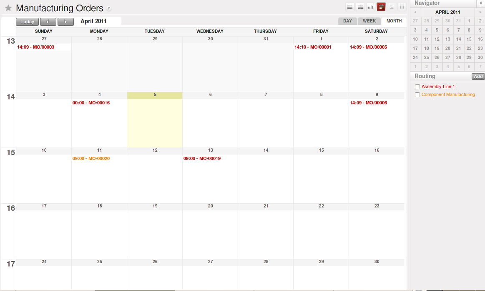
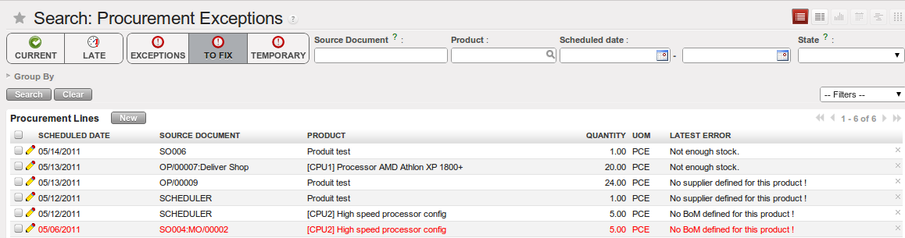
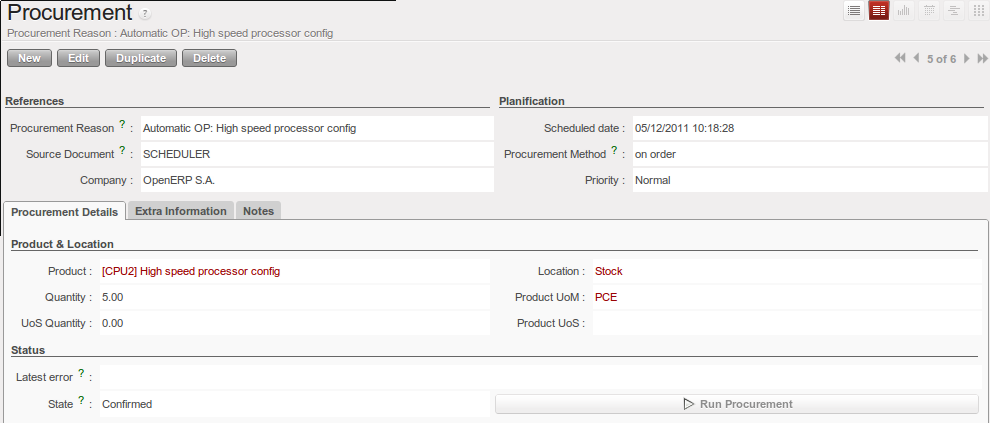
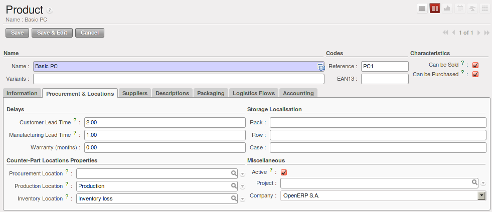
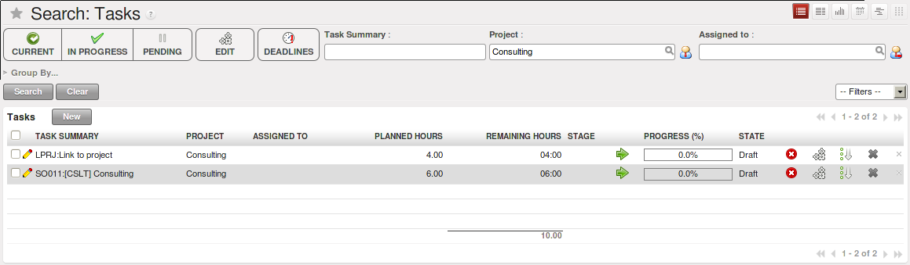

.. i18n: Forecasting and Supplying
.. i18n: =========================
..

预测和供应
=========================

.. i18n: Scheduler
.. i18n: +++++++++
..

排程
+++++++++

.. i18n: The requirements scheduler is the calculation engine which plans and prioritises production and purchasing automatically according to the rules defined on products. By default, the scheduler is set to run once a day (OpenERP automatically creates a *Scheduled Action* for this). You can also start the scheduler manually from the menu :menuselection:`Warehouse --> Schedulers --> Compute Schedulers`.
.. i18n: The scheduler uses all the relevant parameters defined for products, suppliers and the company to determine the priorities between the different production orders, deliveries and supplier purchases.
..

需求计划是根据定义在产品部分的规则，自动计划/优化生产和采购的计算引擎。该计划默认设定为每天运行一次（OpenERP为此自动完成一个既定动作）。你也可以使用菜单 :menuselection:`Warehouse --> Schedulers --> Compute Schedulers`. 来运行计划。
该需求计划依据定义在产品、供应商及公司上的所有相关参数来决定不同生产订单、发货以及供应商采购的优先次序。

.. i18n: .. note:: Starting Time
.. i18n: 
.. i18n:         You can set the starting time of the scheduler by modifying the corresponding action in the menu :menuselection:`Administration --> Configuration --> Scheduler --> Scheduled Actions`. Modify the ``Run mrp Scheduler`` configuration document.
..

.. note:: 起始时间

        你可以同过修改菜单 :menuselection:`Administration --> Configuration --> Scheduler --> Scheduled Actions` 来设置计划的起始时间。修改“运行MRP计划”配置文件。（此处原文是两句单独的话，有点看不懂，只能直译）

.. i18n: .. figure:: images/stock_cron.png
.. i18n:    :scale: 75
.. i18n:    :align: center
.. i18n: 
.. i18n:    *Configuring the Start Time to Calculate Requirements*
..

.. figure:: images/stock_cron.png
   :scale: 75
   :align: center

   *配置计算需求的起始时间*

.. i18n: .. tip::  Calculating Requirements / Scheduling
.. i18n: 
.. i18n:     Scheduling only validates procurements that are confirmed but not yet started. These procurement reservations
.. i18n:     will themselves start production, tasks or purchases depending on the configuration of the requested product.
..

.. tip::  计算需求/排程

    排程计划只考虑那些已经被确认但却还没有开始的获取需求，这些预定需求将根据所需求产品的配置自行开始生产/任务或者采购。

.. i18n: You take into account the priority of operations when starting reservations and procurements.
.. i18n: Urgent requests, those with a date in the past, or requests with a date earlier than the others will be started first. In case there are not enough products in stock to satisfy all the requests, you can be sure that the most urgent requests will be produced first.
..

在开始进行保留和获取的时候，你需要考虑到操作的优先顺序。那些需求日期已经超期的紧急需求，或者比其他产品的需求日期更早的产品，将最先启动。如果库存里有足够的产品能满足所有需求的话，你可以肯定的是，那些最紧急的需求产品将最先被生产。

.. i18n: Planning
.. i18n: ++++++++
..

计划
++++++++

.. i18n: In OpenERP, you can plan the production in an easy way. Simply by going to :menuselection:`Manufacturing --> Planning`, you can plan manufacturing orders, work orders and/or work centers.
..

使用OpenERP，你可以以简单的方法来计划生产。只需进入菜单 :menuselection:`Manufacturing --> Planning`，就可以计划制造订单，工单，以及/或者工作中心。

.. i18n: By clicking ``Manufacturing Orders`` in the *Planning* menu, a calendar view will open in which you can select a day to create the order whenever you want. You will also see the already planned orders. By dragging and dropping a manufacturing order in Calendar view, you can change the starting date of the order.
..

点击 *计划* 菜单里的 ``制造订单`` ，将会打开一个日历视图。在这里，你可以选择一个你需要的日期来创建订单。你也可以看到那些已经计划好的订单。在日历视图里拖动一个制单订单，你可以更改这个订单的起始日期。

.. i18n: .. figure:: images/mo_plan.png
.. i18n:     :scale: 75
.. i18n:     :align: center
.. i18n:     
.. i18n:     *Planning Manufacturing Orders*
..

    
    *计划制造订单*

.. i18n: When you click in a day in the Calendar view, an empty manufacturing order window will open and let you choose which product you want to produce.
..

你在日历视图里点击一个日期，将会打开一个空白的生产订单窗口，允许你选择你想要生产的产品。

.. i18n: .. figure:: images/newmo_plan.png
.. i18n:     :scale: 75
.. i18n:     :align: center
.. i18n:     
.. i18n:     *New Manufacturing Order*    
..

.. figure:: images/newmo_plan.png
    :scale: 75
    :align: center
    
    *新的生产订单*    

.. i18n: Scheduler and Just in Time
.. i18n: --------------------------
..

排程和和精益生产（JIT）
--------------------------

.. i18n: When you want to work according to the *Just in Time* way, you should install the module :mod:`mrp_jit`.
..

如果你想采用 *精益生产（JIT）* 的方式，你需要安装模块 :mod:`mrp_jit`.

.. i18n: If you install this module, you will not have to run the regular procurement scheduler anymore (but you still need to run the minimum order point rule scheduler, or for example let it run daily.) 
..

如果你安装了这个模块，你将不再需要运行常规的采购计划排程（但仍然需要运行最小库存采购点计划，或者比如说，每天运行一次。） 

.. i18n: All procurement orders will be processed immediately, which could in some cases entail a small performance impact. 
..

所有的需求订单都将立即运行，这在某些情况下可能会引起轻微的性能影响。 

.. i18n: It may also increase your stock size because products are reserved as soon as possible and the scheduler time range is not taken into account anymore. In that case, you can no longer use priorities for the different picking orders. 
..

这也可能会增加你的库存量，因为产品会尽快地被保存占用而且计划的时间范围却不再被考虑进去。在这种情况下，你没有办法再对不同的分拣订单使用优先顺序。

.. i18n: Lead times
.. i18n: ----------
..

提前期
----------

.. i18n: All procurement operations (that is, the requirement for both production orders and purchase orders) are automatically calculated by the scheduler. But more than just creating each order, OpenERP plans the timing of each step. A planned date calculated by the system can be found on each order document.
..

所有的资源获取操作（也就是包括生产订单的需求和采购订单的需求）都会被计划排程所计算。但是OpenERP不只是生成每一个订单，还能够计划每一个步骤的时间安排。在每个订单文件上你都能找到一个由系统计算出来的计划时间。

.. i18n: To organize the whole chain of manufacturing and procurement, OpenERP bases everything on the delivery date promised to the customer. This is given by the date of the confirmation in the order and the lead times shown in each product line of the order. This lead time is itself proposed automatically in the field :guilabel:`Customer Lead Time` shown in the product form. This Customer Lead Time is the difference between the time on an order and that of the delivery.
..

OpenERP基于承诺给客户的交货日期来组织整个生产和采购链。这些数据是由订单里确认的日期和订单行里所列的产品的提前期决定的。这个提前期是自动从字段 :guilabel:`Customer Lead Time` 获取的，你可以在产品表单里看到。客户的提前期则和产品的提前期以及交货期是有区别的。

.. i18n: To see a calculation of the lead times, take the example of the cabinet above. Suppose that the cabinet is assembled in two steps, using the two following bills of materials.
..

要知道提前期的计算方法，我们以下面要生产一款柜子为例。假设这个柜子的组装过程分为2个工序，使用下面的两个物料清单（Bill of Materials）。

.. i18n: .. table:: Bill of Materials for 1 SHE100 Unit
.. i18n: 
.. i18n:    ============  ========  ===============
.. i18n:    Product Code  Quantity  Unit of Measure
.. i18n:    ============  ========  ===============
.. i18n:    SIDEPAN       2         PCE
.. i18n:    WOOD002       0.25      m
.. i18n:    LIN040        1         m
.. i18n:    WOOD010       0.249     m
.. i18n:    METC000       12        PCE
.. i18n:    ============  ========  ===============
..

.. table:: 1 SHE100 Unit的物料清单

   ============  ========  ===============
   产品编码      数量      单位
   ============  ========  ===============
   SIDEPAN       2         PCE
   WOOD002       0.25      m
   LIN040        1         m
   WOOD010       0.249     m
   METC000       12        PCE
   ============  ========  ===============

.. i18n: .. table:: Bill of Materials for 2 SIDEPAN Units
.. i18n: 
.. i18n:    ============  ========  ===============
.. i18n:    Product Code  Quantity  Unit of Measure
.. i18n:    ============  ========  ===============
.. i18n:    WOOD002       0.17      m
.. i18n:    ============  ========  ===============
..

.. table:: 2 SIDEPAN Units的物料清单

   ============  ========  ===============
   产品编码      数量      单位
   ============  ========  ===============
   WOOD002       0.17      m
   ============  ========  ===============

.. i18n: The SIDEPAN is made from an order using the workflow shown. The WOOD002 is purchased on order and the other products are all found in stock. An order for the product SHE100 will then generate two production orders (SHE100 and SIDEPAN) then produce two purchase orders for the product WOOD002.
.. i18n: Product WOOD002 is used in the production of both SHE100 and SIDEPAN. Set the lead times on the product forms to the following:
..

这里，SIDEPAN是由所示的流程按订单生产， WOOD002则是按订单采购，而其他的产品都有库存。这样一个SHE100的产品，会生成2张生产订单（SHE100和SIDEPAN），并且生成2张采购WOOD002的采购订单。产品WOOD002会用在SHE100和SIDEPAN的生产过程中。我们在产品表单里设置提前期如下： 

.. i18n: .. table:: Lead Times
.. i18n: 
.. i18n:    ============ ================== ======================= ==================
.. i18n:    Product Code Customer Lead Time Manufacturing Lead Time Supplier Lead Time
.. i18n:    ============ ================== ======================= ==================
.. i18n:    SHE100       30 days            5 days
.. i18n:    SIDEPAN                         10 days
.. i18n:    WOOD002                                                 5 days
.. i18n:    ============ ================== ======================= ==================
..

.. table:: 提前期

   ============ ================== ======================= ==================
   产品编码     客户提前期         生产提前期              供应商提前期
   ============ ================== ======================= ==================
   SHE100       30 days            5 days
   SIDEPAN                         10 days
   WOOD002                                                 5 days
   ============ ================== ======================= ==================

.. i18n: A customer order placed on the 1st January will set up the following operations and lead times:
..

一个下单日期在1月1日的客户订单，将会安排下列操作和提前期：

.. i18n: * Delivery SHE100: 31 January (=1st January + 30 days),
.. i18n: 
.. i18n: * Manufacture SHE100: 26 January (=31 January – 5 days),
.. i18n: 
.. i18n: * Manufacture SIDEPAN: 16 January (=26 January – 10 days),
.. i18n: 
.. i18n: * Purchase WOOD002 (for SHE100): 21 January (=26 January – 5 days),
.. i18n: 
.. i18n: * Purchase WOOD002 (for SIDEPAN): 11 January (=16 January – 5 days).
..

* SHE100发货: 1月31日 （=1月1日 + 30天），

* 生产SHE100: 1月26日（=1月31日 - 5天），

* 生产SIDEPAN: 1月16日（=1月26日 - 10天），

* 采购WOOD002 （生产SHE100用）： 1月21日（=1月26日 - 5天），

* 采购WOOD002 （生产SIDEPAN用）：1月11日（=1月16日 - 5天）。

.. i18n: In this example, OpenERP will propose placing two orders with the supplier of product WOOD002. Each of these orders can be for a different planned date. Before confirming these orders, the purchasing manager could group (merge) these orders into a single order.
..

在这个例子里，OpenERP将拟向产品WOOD002的供应商下2个订单，这两个订单可以有不同的需求日期。 在确认订单前，采购经理可以把这两个订单合并成一个单独的订单。

.. i18n: Security Days
.. i18n: -------------
..

安全天数
-------------

.. i18n: The scheduler will plan all operations as a function of the time configured on the products. But it is also possible to configure these factors in the company. These factors are then global to the company, whatever the product concerned may be. In the description of the company, on the
.. i18n: :guilabel:`Configuration` tab, you find the following parameters:
..

排程会计划所有设置了时间参数的产品。但是直接在公司范围设置这些参数也是可能的。这样这些参数就在整个公司范围内发挥作用，而不去考虑具体产品。在公司说明的标签页 :guilabel:`Configuration` ，你会发现下面的参数：

.. i18n: * `Scheduler Range Days`: all the procurement requests that are not between today and today plus the number of days specified here are not taken into account by the scheduler.
.. i18n:   
.. i18n: * `Manufacturing Lead Time`: number of additional days needed for manufacturing,
.. i18n: 
.. i18n: * `Purchase Lead Time`: additional days to include for all purchase orders with this supplier,
.. i18n: 
.. i18n: * `Security Days`: number of days to deduct from a system order to cope with any problems of procurement,
..

* `排程期间(Scheduler Range Days)`: 程对需求的计算是有时间限制的。如果需求时间的范围是在过去或者是从今天算起晚于你所设置的天数之后的话，排程是不做计划的。

* `生产提前期(Manufacturing Lead Time)`: 生产所需要耗用的时间(天数),

* `采购提前期(Purchase Lead Time)`: 所需原材料半成品采购备齐所需耗用的时间(天数),

* `预留提前期(Security Days)`: 为其他异常情况提供的预留的耗用时间(天数),

.. i18n: .. note:: Purchase Lead Time
.. i18n: 
.. i18n:     The security delay for purchases is the average time between the order generated by OpenERP and
.. i18n:     the real purchase time from the supplier by your purchasing department.
.. i18n:     This delay takes into account the order process in your company, including order negotiation time.
..

.. note:: 采购提前期

    The security delay for purchases is the average time between the order generated by OpenERP and
    the real purchase time from the supplier by your purchasing department.
    This delay takes into account the order process in your company, including order negotiation time.

.. i18n: Take for instance the following configuration:
..

下面用一个实例来说明:

.. i18n: * `Manufacturing Lead Time` : 1,
.. i18n: 
.. i18n: * `Purchase Lead Time` : 3,
.. i18n: 
.. i18n: * `Security Days` : 2.
..

* `生产提前期(Manufacturing Lead Time)` : 1,

* `采购提前期(Purchase Lead Time)` : 3,

* `预留提前(Security Days)` : 2.

.. i18n: The example above will then be given the following lead times:
..

这样,由上面的数据就可以计算出下面的这些时间:

.. i18n: * Delivery SHE100: 29 January (= 1st January + 30 days – 2 days),
.. i18n: 
.. i18n: * Manufacture SHE100: 23 January (= 29 January – 5 days – 1 day),
.. i18n: 
.. i18n: * Manufacture SIDEPAN: 12 January (= 26 January – 10 days – 1 day),
.. i18n: 
.. i18n: * Purchase WOOD002 (for SHE100): 15 January (= 26 January – 5 days – 3 days),
.. i18n: 
.. i18n: * Purchase WOOD002 (for SIDEPAN): 4 January (= 12 January – 5 days – 3 days).
..

* 送货时间 SHE100: 29 January (= 1st January + 30 days – 2 days),

* 生产时间 SHE100: 23 January (= 29 January – 5 days – 1 day),

* 生产时间 SIDEPAN: 12 January (= 26 January – 10 days – 1 day),

* 采购时间 WOOD002 (for SHE100): 15 January (= 26 January – 5 days – 3 days),

* 采购时间 WOOD002 (for SIDEPAN): 4 January (= 12 January – 5 days – 3 days).

.. i18n: Procurement
.. i18n: +++++++++++
..

需求
+++++++++++

.. i18n: In normal system use, you do not need to worry about procurement orders, because they are automatically generated by OpenERP and the user will usually work on the results of a procurement: a production order, a purchase order, a sales order and a task.
..

在系统正常运作时, 并不需要担心生产需求计划, 用户只需要按系统自动生成的采购,销售,任务及生产计划完成相应的操作即
可.

.. i18n: But if there are configuration problems, the system can remain blocked by a procurement without generating a corresponding document. Exception management allows you to solve possible issues.
..

But if there are configuration problems, the system can remain blocked by a procurement without generating a corresponding document. Exception management allows you to solve possible issues.

.. i18n: Automating Purchasing and Replenishment
.. i18n: ---------------------------------------
..

自动采购和补充
---------------------------------------

.. i18n: In the ``Product`` form view, you can choose between two procurement methods:
..

在 ``产品`` 视图页,需要设置下面两个有关生产的参数:

.. i18n:     * Make to Stock (MTS)
.. i18n:     * Make to Order (MTO)
..

    * 按备货计划生产(MTS)
    * 按订单生产(MTO)

.. i18n: These two methods will impact the way you have to configure your automatic purchasing and replenishment. For the MTS method, you will have to define Minimum Stock Rules to order products when the minimum threshold has been reached, as well as a supplier to define where to order the products. 
.. i18n: For the MTO method, you have to define a supplier for the product in order to buy new products when a sales order or a manufacturing 
.. i18n: order is confirmed.
..

这两个参数直接影响自动采购与自动补货的方式.
使用MTS方式时, 你需要在对应产品上设置最小库存规则来触发补货或者采购动作. 并且你还应该给产品设置合适的供应商.
使用MTO方式时, 你必须要给相应产品设置对应的供应商,以便在生产单及销售单确认时能自动产生相应的采购.

.. i18n: Managing Scheduler Exceptions
.. i18n: -----------------------------
..

管理排程的异常
-----------------------------

.. i18n: In OpenERP, you can have different procurement exceptions. An exception appears in the ``Procurement Exception`` view when the system does not know what to do with an object, such as a Manufacturing Order or a Purchase Order.
..

你可能会在生产过程中遇到各种各样的异常情况. An exception appears in the ``Procurement Exception`` view when the system does not know what to do with an object, such as a Manufacturing Order or a Purchase Order.

.. i18n: There are four types of exceptions:
..

通常会有如下几种异常情况:

.. i18n:     * No bill of materials defined for production: in this case you have got to create a BoM or indicate that the product can be purchased instead (change the ``Supply Method``).
.. i18n: 
.. i18n:     * No supplier available for a purchase: you have to define a supplier in the ``Supplier`` tab of the product form.
.. i18n: 
.. i18n:     * No address defined on the supplier partner: you have to complete an address for the supplier for the product in consideration.
.. i18n: 
.. i18n:     * Not enough stock: you have to create a rule for automatic procurement (for example, a minimum stock rule), or manually procure it.
..

    * 产成品未定义BOM单(Bill Of Materials): in this case you have got to create a BoM or indicate that the product can be purchased instead (change the ``Supply Method``).

    * 相关采购未定义供应商: you have to define a supplier in the ``Supplier`` tab of the product form.

    * 供应商未定义地址联系人: you have to complete an address for the supplier for the product in consideration.

    * 原材料库存不足: you have to create a rule for automatic procurement (for example, a minimum stock rule), or manually procure it.

.. i18n: .. figure:: images/procurement_exception.png
.. i18n:     :align: center
.. i18n:     :scale: 75
.. i18n:     
.. i18n:     *Procurement Exceptions*
.. i18n:     
.. i18n: Some problems are just timing issues and can be automatically corrected by the system (this will be temporary exceptions).
..

    
    *需求异常*
    
有时候的一些异常只是系统的临时异常. 系统会自动修复.

.. i18n: If a product has to be ‘in stock’ but is not available in your stores, OpenERP will make the exception as ‘temporary’ or ‘to be corrected’. The exception is temporary if the system can procure it automatically, for example, when a procurement rule has been defined for minimum stock.
..

If a product has to be ‘in stock’ but is not available in your stores, OpenERP will make the exception as ‘temporary’ or ‘to be corrected’. The exception is temporary if the system can procure it automatically, for example, when a procurement rule has been defined for minimum stock.

.. i18n: When an exception is raised, you can check the configuration of your product in order to correct the misconfiguration. Then you
.. i18n: can choose to relaunch the scheduler or you can retry to execute the action by selecting the line, and clicking the :guilabel:`Retry` button, then click :guilabel:`Run procurement`.
..

当需求异常时, 你要去确认一下产品的各项配置是否正确. 然后去重新运行一下MRP计算也可以在明细行上点击 :guilabel:`重试(Retry)` 按钮并
点击 :guilabel:`计算需求(Run procurement`).

.. i18n: .. figure:: images/procurement_fix.png
.. i18n:     :scale: 75
.. i18n:     :align: center
.. i18n:     
.. i18n:     *Correct a Procurement Exception*
..

    
    *需求异常处理*

.. i18n: The exception related to the BoM definition comes from the fact that a product with a supply method set to *Produce* has no
.. i18n: Bill of Materials. The system does not know how to produce this product and then raises an exception.    
..

The exception related to the BoM definition comes from the fact that a product with a supply method set to *Produce* has no
Bill of Materials. The system does not know how to produce this product and then raises an exception.    

.. i18n: Manual Procurement
.. i18n: ------------------
..

人工生成需求
------------------

.. i18n: To procure internally, you can create a procurement order manually. Use the menu :menuselection:`Warehouse --> Schedulers -->
.. i18n: Procurement Exceptions` and click the New button to do this.
..

对于内部采购,则可以手工创建一张需求单. 打开菜单 :menuselection:`仓库(Warehouse) --> 排程(Schedulers) -->
需求异常(Procurement Exceptions)` 并点击 ``新建`` 按钮即可.

.. i18n: .. figure:: images/mrp_procurement.png
.. i18n:     :scale: 75
.. i18n:     :align: center
.. i18n:     
.. i18n:     *Manual Procurement*
..

.. figure:: images/mrp_procurement.png
    :scale: 75
    :align: center
    
    *手工需求*

.. i18n: The procurement order will then be responsible for calculating a proposal for automatic procurement for the
.. i18n: product concerned. This procurement will start a task, a purchase order for the supplier or a production
.. i18n: depending on the product configuration.
..

需求单可以自动计算出相关原材料的需求单. 这些需求单根据相应产品的配置情况又可以生成相应的生产计划以及相应的采购订单.

.. i18n: .. figure:: images/mrp_procurement_flow.png
.. i18n:     :scale: 75
.. i18n:     :align: center
.. i18n:     
.. i18n:     *Procurement Flow*
..

.. figure:: images/mrp_procurement_flow.png
    :scale: 75
    :align: center
    
    *需求流程*

.. i18n: It is better to encode a procurement order rather than direct purchasing or production. The procurement method has the following advantages:
..

It is better to encode a procurement order rather than direct purchasing or production. The procurement method has the following advantages:

.. i18n: 1. The form is simpler, because OpenERP calculates the different values according to other values and defined rules: purchase date 
.. i18n: calculated from order date, default supplier, raw materials needs, selection of the most suitable bill of materials, etc.
.. i18n: 
.. i18n: 2. The calculation of requirements prioritises the procurements. If you encode a purchase directly, you short-circuit the planning of different procurements.
..

1. The form is simpler, because OpenERP calculates the different values according to other values and defined rules: purchase date 
calculated from order date, default supplier, raw materials needs, selection of the most suitable bill of materials, etc.

2. The calculation of requirements prioritises the procurements. If you encode a purchase directly, you short-circuit the planning of different procurements.

.. i18n: .. tip:: Shortcuts
.. i18n: 
.. i18n:     On the Product form you have an **action** shortcut button :guilabel:`Procurement Request` that lets you quickly 
.. i18n:     create a new procurement order.
.. i18n:         
..

.. tip:: 快捷方式

    在产品窗体中可以使用 :guilabel:`需求申请(Procurement Request)` **action** 按钮的快捷方式 去创建新的需求申请单.

.. i18n: Working with Subcontractors
.. i18n: ===========================
..

使用分包商
===========================

.. i18n: In OpenERP, you can also subcontract production operations (for example, painting and item assembly) at a supplier's. To do this, you should indicate on the relevant routing document a supplier location for stock management.
..

In OpenERP, you can also subcontract production operations (for example, painting and item assembly) at a supplier's. To do this, you should indicate on the relevant routing document a supplier location for stock management.

.. i18n: Configure a location dedicated to this supplier with the following data:
..

按以下数据配置一个供应商库位:

.. i18n: * :guilabel:`Location Type`: Supplier,
.. i18n: 
.. i18n: * :guilabel:`Location Address`: Select an address of the subcontracting partner,
.. i18n: 
.. i18n: * :guilabel:`Chained Location Type`: Fixed,
.. i18n: 
.. i18n: * :guilabel:`Chained Location if Fixed`: your Stock,
.. i18n: 
.. i18n: * :guilabel:`Chaining Lead Time`: number of days before receipt of the finished product.
..

* :guilabel:`Location Type`: Supplier,

* :guilabel:`Location Address`: Select an address of the subcontracting partner,

* :guilabel:`Chained Location Type`: Fixed,

* :guilabel:`Chained Location if Fixed`: your Stock,

* :guilabel:`Chaining Lead Time`: number of days before receipt of the finished product.

.. i18n: Then once the manufacturing has been planned for the product concerned, OpenERP will generate the following steps:
..

Then once the manufacturing has been planned for the product concerned, OpenERP will generate the following steps:

.. i18n: * Delivery of raw materials to the stores for the supplier,
.. i18n: 
.. i18n: * Production order for the products at the supplier's and receipt of the finished products in the stores.
..

* Delivery of raw materials to the stores for the supplier,

* Production order for the products at the supplier's and receipt of the finished products in the stores.

.. i18n: Once the production order has been confirmed, OpenERP automatically generates a delivery order to send to the raw materials supplier. The storesperson can access this delivery order from the menu :menuselection:`Warehouse --> Warehouse Management --> Internal Moves`. The raw materials will then be placed in stock at the supplier's stores.
..

Once the production order has been confirmed, OpenERP automatically generates a delivery order to send to the raw materials supplier. The storesperson can access this delivery order from the menu :menuselection:`Warehouse --> Warehouse Management --> Internal Moves`. The raw materials will then be placed in stock at the supplier's stores.

.. i18n: Once the delivery of raw materials has been confirmed, OpenERP activates the production order. The supplier uses the raw materials to produce the finished goods which will automatically be put in your own stores. This manufacturing is confirmed when you receive the products from your supplier. Then you will indicate the quantities consumed by your supplier.
..

Once the delivery of raw materials has been confirmed, OpenERP activates the production order. The supplier uses the raw materials to produce the finished goods which will automatically be put in your own stores. This manufacturing is confirmed when you receive the products from your supplier. Then you will indicate the quantities consumed by your supplier.

.. i18n: .. tip:: Subcontract without Routing
.. i18n: 
.. i18n:    If you do not use routing, you can always subcontract work orders by creating an empty routing in the subcontracting bill of materials.
..

.. tip:: Subcontract without Routing

   If you do not use routing, you can always subcontract work orders by creating an empty routing in the subcontracting bill of materials.

.. i18n: Production orders can be found in the menu :menuselection:`Manufacturing --> Manufacturing --> Manufacturing Orders`. A production order is always carried out in two stages:
..

进入菜单 :menuselection:`生产(Manufacturing) --> 生产(Manufacturing) --> 生产计划(Manufacturing Orders)` 可以查看到相应的生产计划单.
生产计划通常需要按下面两个阶段生产:

.. i18n: #. Consumption of raw materials,
.. i18n: 
.. i18n: #. Production of finished products.
..

#. 耗用原材料,

#. 完工产成品.

.. i18n: Depending on the company's needs, you can specify that the first step is confirmed at the acknowledgement of the manufacturing supplier, and the second at the receipt of finished goods in the warehouse.
..

Depending on the company's needs, you can specify that the first step is confirmed at the acknowledgement of the manufacturing supplier, and the second at the receipt of finished goods in the warehouse.

.. i18n: Matching Sales Orders and Bills of Materials
.. i18n: ============================================
..

匹配销售订单和物料清单BOM
============================================

.. i18n: In OpenERP, you can define several bills of materials for the same product. In fact, you can have several manufacturing methods or several approved raw materials for a given product. You will see in the following section that the manufacturing procedure (the routing) is attached to the Bill of Materials, so the choice of bill of materials implicitly includes the operations to make it.
..

In OpenERP, you can define several bills of materials for the same product. In fact, you can have several manufacturing methods or several approved raw materials for a given product. You will see in the following section that the manufacturing procedure (the routing) is attached to the Bill of Materials, so the choice of bill of materials implicitly includes the operations to make it.

.. i18n: Once several bills of materials have been defined for a particular product, you need to have a system to enable OpenERP to select one of them for use. By default, the bill of materials with the lowest sequence number is selected by the system.
..

Once several bills of materials have been defined for a particular product, you need to have a system to enable OpenERP to select one of them for use. By default, the bill of materials with the lowest sequence number is selected by the system.

.. i18n: To gain more control over the process during selling or procuring, you can use **Properties**.
.. i18n: The menu :menuselection:`Manufacturing --> Configuration --> Master Bill of Materials --> Properties` enables you to define properties, which can be set up arbitrarily to help you select a bill of materials when you have a choice of BoMs.
..

To gain more control over the process during selling or procuring, you can use **Properties**.
The menu :menuselection:`Manufacturing --> Configuration --> Master Bill of Materials --> Properties` enables you to define properties, which can be set up arbitrarily to help you select a bill of materials when you have a choice of BoMs.

.. i18n: .. note:: Properties
.. i18n: 
.. i18n:    Properties is a concept that enables the selection of a method to manufacture a product.
.. i18n:    Properties define a common language between salespeople and technical people,
.. i18n:    letting the salespeople have an influence on the manufacturing of the products using
.. i18n:    non-technical language and the choices decided on by the technicians who define Bills
.. i18n:    of Materials.
..

.. note:: Properties

   Properties is a concept that enables the selection of a method to manufacture a product.
   Properties define a common language between salespeople and technical people,
   letting the salespeople have an influence on the manufacturing of the products using
   non-technical language and the choices decided on by the technicians who define Bills
   of Materials.

.. i18n: For example, you can define the following property groups and properties:
..

For example, you can define the following property groups and properties:

.. i18n: .. table:: Properties
.. i18n: 
.. i18n:    =====================  ============
.. i18n:    Property Group         Property
.. i18n:    =====================  ============
.. i18n:    Warranty               3 years
.. i18n:    Warranty               1 year
.. i18n:    Method of Manufacture  Serial
.. i18n:    Method of Manufacture  Batch
.. i18n:    =====================  ============
..

.. table:: Properties

   =====================  ============
   Property Group         Property
   =====================  ============
   Warranty               3 years
   Warranty               1 year
   Method of Manufacture  Serial
   Method of Manufacture  Batch
   =====================  ============

.. i18n: Once the bills of materials have been defined, you could associate the corresponding properties with them. Then when the salesperson enters a sales order line, he can attach the properties required (``Extra Info`` tab). If the product has to be manufactured, OpenERP will automatically choose the bill of materials that matches the defined properties in the order most closely.
..

Once the bills of materials have been defined, you could associate the corresponding properties with them. Then when the salesperson enters a sales order line, he can attach the properties required (``Extra Info`` tab). If the product has to be manufactured, OpenERP will automatically choose the bill of materials that matches the defined properties in the order most closely.

.. i18n: .. note:: Extended View
.. i18n: 
.. i18n:         Note that the properties are only visible in the Bills of Materials and Sales Management if you are working in the ``Extended`` view mode. If you cannot see it on your screen, add the group ``Useability /Extended View`` to your user.
..

.. note:: 扩展视图

        Note that the properties are only visible in the Bills of Materials and Sales Management if you are working in the ``Extended`` view mode. If you cannot see it on your screen, add the group ``Useability /Extended View`` to your user.

.. i18n: .. figure:: images/sale_line_property.png
.. i18n:    :scale: 75
.. i18n:    :align: center
.. i18n: 
.. i18n:    *Properties in a Customer Order Line*
..

.. figure:: images/sale_line_property.png
   :scale: 75
   :align: center

   *Properties in a Customer Order Line*

.. i18n: *Example: Manufacturing in a Batch or on a Production Line*
..

*例如: 生产单明细上的制造批次号*

.. i18n: As an example, take the manufacturing of the shelf presented above. You can imagine that the company has two methods of manufacturing for this cabinet:
..

As an example, take the manufacturing of the shelf presented above. You can imagine that the company has two methods of manufacturing for this cabinet:

.. i18n: * Manually: the staff assembles the shelves one by one and cuts the wood plank by plank. This approach is
.. i18n:   usually used to assemble prototypes. It gets you very rapid production, but at a high cost and
.. i18n:   only in small quantities.
.. i18n: 
.. i18n: * On a production line: the staff uses machines that are capable of cutting wood by bandsaw. This method
.. i18n:   is used for production runs of at least 50 items because the lead times using this method are quite
.. i18n:   lengthy. The delay to start the production is much longer, yet the cost per unit is considerably lower
.. i18n:   in this volume.
..

* Manually: the staff assembles the shelves one by one and cuts the wood plank by plank. This approach is
  usually used to assemble prototypes. It gets you very rapid production, but at a high cost and
  only in small quantities.

* On a production line: the staff uses machines that are capable of cutting wood by bandsaw. This method
  is used for production runs of at least 50 items because the lead times using this method are quite
  lengthy. The delay to start the production is much longer, yet the cost per unit is considerably lower
  in this volume.

.. i18n: You define two bills of materials for the same cabinet. To distinguish between them, you will define two properties in the same group: ``manual assembly`` and ``production line assembly``. In the quotation, the salesperson can set the method of manufacture he wants on each order line,
.. i18n: depending on the quantities and the lead time requested by the customer.
..

You define two bills of materials for the same cabinet. To distinguish between them, you will define two properties in the same group: ``manual assembly`` and ``production line assembly``. In the quotation, the salesperson can set the method of manufacture he wants on each order line,
depending on the quantities and the lead time requested by the customer.

.. i18n: .. index::
.. i18n:    single: BoM, substitute products
..

.. index::
   single: BoM, substitute products

.. i18n: .. note:: Bills of Materials and Substitute Products
.. i18n: 
.. i18n:     In some software, you use the term ``substitute`` for this principle of configurable properties in
.. i18n:     a bill of materials.
..

.. note:: Bills of Materials and Substitute Products

    In some software, you use the term ``substitute`` for this principle of configurable properties in
    a bill of materials.

.. i18n: By putting a bill of materials on its own line, you can also implement substitute products. You set the bill of materials to type ``Sets/Phantom`` to make the substitution transparent and to prevent OpenERP from proposing an intermediate production order.
..

By putting a bill of materials on its own line, you can also implement substitute products. You set the bill of materials to type ``Sets/Phantom`` to make the substitution transparent and to prevent OpenERP from proposing an intermediate production order.

.. i18n: Production and Services
.. i18n: =======================
..

生产和服务
=======================

.. i18n: In OpenERP, you can handle three types of goods: two types of products (Stockable or Consumable products) and one type of services.
..

In OpenERP, you can handle three types of goods: two types of products (Stockable or Consumable products) and one type of services.

.. i18n: For this last category, OpenERP can react in two different ways. Once a manufacturing order is generated for a product and this product contains a :guilabel:`Service`, a task can be automatically generated or not.
..

For this last category, OpenERP can react in two different ways. Once a manufacturing order is generated for a product and this product contains a :guilabel:`Service`, a task can be automatically generated or not.

.. i18n: .. note:: Tasks
.. i18n: 
.. i18n:    In order to automatically generate a task, you have to install the module :mod:`project_mrp` which
.. i18n:    requires the installation of the module :mod:`project`.
..

.. note:: Tasks

   In order to automatically generate a task, you have to install the module :mod:`project_mrp` which
   requires the installation of the module :mod:`project`.

.. i18n: By default, the generated task is not linked to any project. You can change this behaviour by creating a project and link the service to this project. This can be done in the ``Product`` form, on the tab :guilabel:`Procurement & Locations` in the :guilabel:`Miscellaneous` section. Select the project to be linked in the ``Project`` field.
..

By default, the generated task is not linked to any project. You can change this behaviour by creating a project and link the service to this project. This can be done in the ``Product`` form, on the tab :guilabel:`Procurement & Locations` in the :guilabel:`Miscellaneous` section. Select the project to be linked in the ``Project`` field.

.. i18n: .. figure:: images/service_prj.png
.. i18n:     :scale: 75
.. i18n:     :align: center
.. i18n:     
.. i18n:     *Link a Service Product to a Project*
..

    
    *Link a Service Product to a Project*

.. i18n: To illustrate this process, follow the next example:
..

To illustrate this process, follow the next example:

.. i18n: First, you have to create a project to which you want to link the service. We will call this project *Consulting*. After creating the project, we have to create a new product. Here are the characteristics of this product:
.. i18n:    
..

First, you have to create a project to which you want to link the service. We will call this project *Consulting*. After creating the project, we have to create a new product. Here are the characteristics of this product:
   

.. i18n: .. table:: Configure a New Service
.. i18n: 
.. i18n:    ================== ==============
.. i18n:    Field              Value
.. i18n:    ================== ==============
.. i18n:    Name               Consulting
.. i18n:    Reference          CSLT
.. i18n:    Product Type       Service
.. i18n:    Procurement Method Make to Order
.. i18n:    Supply Method      Produce
.. i18n:    Default UoM        Hour
.. i18n:    **Project**        **Consulting**
.. i18n:    ================== ==============
.. i18n:    
.. i18n: Once you have configured your project and your product, you can create a Sales Order to order hours of consultancy. When you confirm the Sales Order, a task will be created.
..

.. table:: Configure a New Service

   ================== ==============
   Field              Value
   ================== ==============
   Name               Consulting
   Reference          CSLT
   Product Type       Service
   Procurement Method Make to Order
   Supply Method      Produce
   Default UoM        Hour
   **Project**        **Consulting**
   ================== ==============
   
Once you have configured your project and your product, you can create a Sales Order to order hours of consultancy. When you confirm the Sales Order, a task will be created.

.. i18n: .. figure:: images/soprj_tip.png
.. i18n:     :scale: 100
.. i18n:     :align: center
.. i18n:     
.. i18n: If you go to :menuselection:`Project --> Project --> Tasks`, you will find a new task called: :guilabel:`SO011:[CSLT] Consulting`. This task is linked to the project :guilabel`Consulting`. Note that the Sales Order number may be different in your database.
..

    
If you go to :menuselection:`Project --> Project --> Tasks`, you will find a new task called: :guilabel:`SO011:[CSLT] Consulting`. This task is linked to the project :guilabel`Consulting`. Note that the Sales Order number may be different in your database.

.. i18n: .. figure:: images/prj_so.png
.. i18n:     :scale: 75
.. i18n:     :align: center
.. i18n:     
.. i18n:     *A Product linked to a Task and a Project*    
..

    
    *A Product linked to a Task and a Project*    

.. i18n: .. Copyright © Open Object Press. All rights reserved.
..

.. Copyright © Open Object Press. All rights reserved.

.. i18n: .. You may take electronic copy of this publication and distribute it if you don't
.. i18n: .. change the content. You can also print a copy to be read by yourself only.
..

.. You may take electronic copy of this publication and distribute it if you don't
.. change the content. You can also print a copy to be read by yourself only.

.. i18n: .. We have contracts with different publishers in different countries to sell and
.. i18n: .. distribute paper or electronic based versions of this book (translated or not)
.. i18n: .. in bookstores. This helps to distribute and promote the OpenERP product. It
.. i18n: .. also helps us to create incentives to pay contributors and authors using author
.. i18n: .. rights of these sales.
..

.. We have contracts with different publishers in different countries to sell and
.. distribute paper or electronic based versions of this book (translated or not)
.. in bookstores. This helps to distribute and promote the OpenERP product. It
.. also helps us to create incentives to pay contributors and authors using author
.. rights of these sales.

.. i18n: .. Due to this, grants to translate, modify or sell this book are strictly
.. i18n: .. forbidden, unless Tiny SPRL (representing Open Object Press) gives you a
.. i18n: .. written authorisation for this.
..

.. Due to this, grants to translate, modify or sell this book are strictly
.. forbidden, unless Tiny SPRL (representing Open Object Press) gives you a
.. written authorisation for this.

.. i18n: .. Many of the designations used by manufacturers and suppliers to distinguish their
.. i18n: .. products are claimed as trademarks. Where those designations appear in this book,
.. i18n: .. and Open Object Press was aware of a trademark claim, the designations have been
.. i18n: .. printed in initial capitals.
..

.. Many of the designations used by manufacturers and suppliers to distinguish their
.. products are claimed as trademarks. Where those designations appear in this book,
.. and Open Object Press was aware of a trademark claim, the designations have been
.. printed in initial capitals.

.. i18n: .. While every precaution has been taken in the preparation of this book, the publisher
.. i18n: .. and the authors assume no responsibility for errors or omissions, or for damages
.. i18n: .. resulting from the use of the information contained herein.
..

.. While every precaution has been taken in the preparation of this book, the publisher
.. and the authors assume no responsibility for errors or omissions, or for damages
.. resulting from the use of the information contained herein.

.. i18n: .. Published by Open Object Press, Grand Rosière, Belgium
..

.. Published by Open Object Press, Grand Rosière, Belgium
