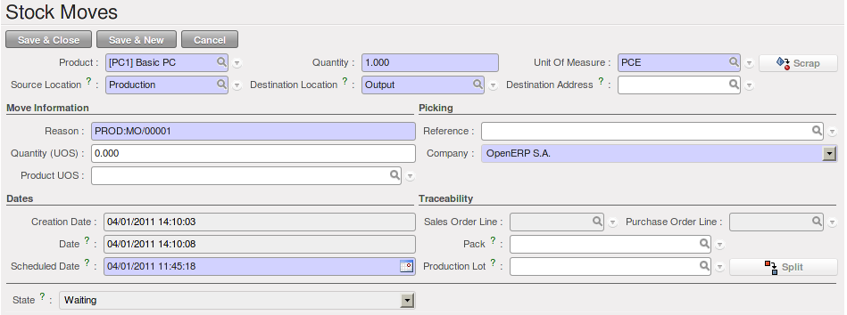
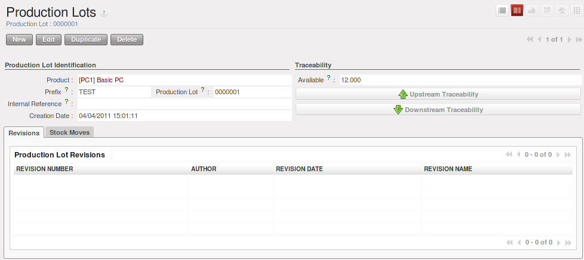
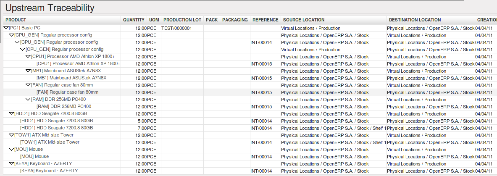
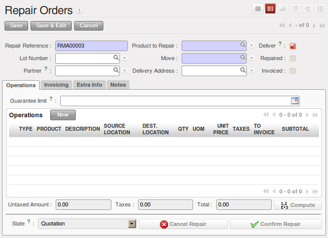
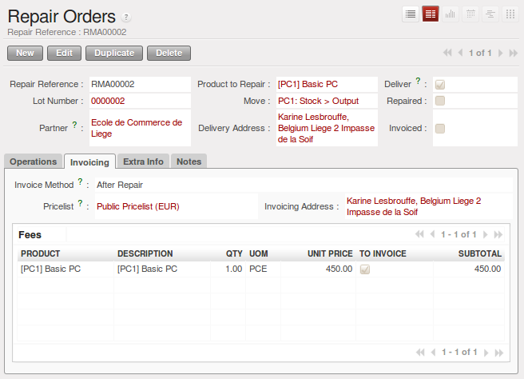
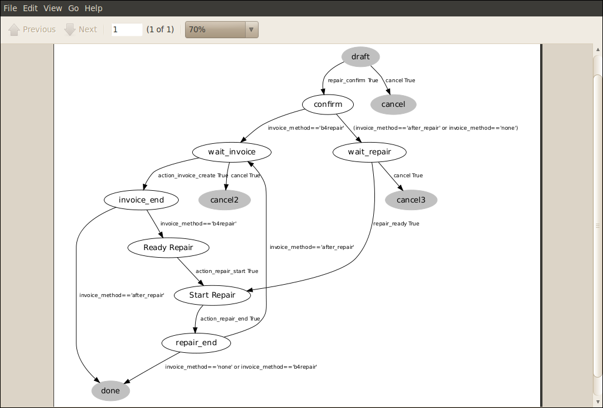

.. i18n: Logistics and Manufacturing
.. i18n: ===========================
..

物流和生产制造
===========================

.. i18n: Manufacturing Stock Locations
.. i18n: +++++++++++++++++++++++++++++
..

生产库位
+++++++++++++++++++++++++++++

.. i18n: OpenERP allows you to define a specific location to keep track of your manufacturing moves. 
..

OpenERP 中为了跟踪生产过程中的物料,你可以定义一种特殊的生产库位.

.. i18n: To get an overview of all stock moves, go to :menuselection:`Warehouse --> Traceability --> Stock Moves`. You can enter your Production location in the ``Location`` search field and then group by Source or Destination according to the moves you would like to check.
..

要查看所有的移库明细可以进菜单 :menuselection:`仓库(Warehouse) --> 可追溯的(Traceability) --> 库存调拨(Stock Moves)`. 在右上角的搜索框内输入 ``库位`` 名称可以按源库位
以及目标库位进行过滤及分组.

.. i18n: Traceability
.. i18n: ++++++++++++
..

可追溯性
++++++++++++

.. i18n: With traceability you can easily track your production lots in the software. With this functionality you can
.. i18n: quickly find where your products are in your warehouse. In counterpart, you will be forced to mention a
.. i18n: number of lot to each product to be able to track it in the system.
..

在OpenERP中可以很方便地追溯产品. 你只需要在追溯系统中为每一个产品批次指定一个批次号,便可以很容易地在仓库中追溯到某批次的产品.

.. i18n: To enable traceability in the manufacturing process, go to :menuselection:`Warehouse --> Product --> Products`. In the ``Product`` form, you have to select the box :guilabel:`Track Manufacturing Lots` in the :guilabel:`Lots` section on the ``Information`` tab.
..

要在生产中启用物料追踪, 点击菜单 :menuselection:`仓库(Warehouse) --> 产品(Product) --> 产品(Product)` 在 ``产品`` 界面的 ``信息(Information)``
页签的 :guilabel:`跟踪生产批次(Track Manufacturing Lots)` 选项中选择 :guilabel:`批次(Lots)` 选项.

.. i18n: In the manufacturing order, you have to mention a production lot number in order to continue the process.
.. i18n: You can select the production lot in the :guilabel:`Manufacturing Order` form on the second tab, called :guilabel:`Finished Products`. You have to click the Products to Finish you want to trace, a new window will open. In the :guilabel:`Production Lot` field, click to link the manufacturing order to a production lot.
..

In the manufacturing order, you have to mention a production lot number in order to continue the process.
You can select the production lot in the :guilabel:`Manufacturing Order` form on the second tab, called :guilabel:`Finished Products`. You have to click the Products to Finish you want to trace, a new window will open. In the :guilabel:`Production Lot` field, click to link the manufacturing order to a production lot.

.. i18n: .. figure:: images/prod_lot.png
.. i18n:     :scale: 75
.. i18n:     :align: center
.. i18n:     
.. i18n:     *Tracking a Manufacturing Order*
..

    
    *制程中的物料跟踪*

.. i18n: When you have linked some manufacturing orders to production lots, you can trace them from the menu :menuselection:`Warehouse --> Traceability --> Production Lots`. In this view, you see the different production lots linked to a product. If you select one lot, you will have the possibility to choose between :guilabel:`Upstream Traceability` or :guilabel:`Downstream Traceability`.
..

When you have linked some manufacturing orders to production lots, you can trace them from the menu :menuselection:`Warehouse --> Traceability --> Production Lots`. In this view, you see the different production lots linked to a product. If you select one lot, you will have the possibility to choose between :guilabel:`Upstream Traceability` or :guilabel:`Downstream Traceability`.

.. i18n: .. figure:: images/production_lots.png
.. i18n:     :scale: 75
.. i18n:     :align: center
.. i18n:     
.. i18n:     *Choosing between Upstream and Downstream Traceability*
.. i18n:     
.. i18n: .. tip:: Traceability
.. i18n:     
.. i18n:     **Upstream Traceability**: It starts from the raw materials received from the supplier and follows 
.. i18n:     the chain to the finished products delivered to customers. Note that the name is confusing - this 
.. i18n:     would often be considered a downstream direction. Think of it as **Where Used**.
.. i18n:     
.. i18n:     **Downstream Traceability**: It follows the product in the other direction, from customer to the different 
.. i18n:     suppliers of raw material. Note that the name is confusing - this would often be considered an upstream 
.. i18n:     direction. Think of it as **Where Supplied**.
.. i18n: 
.. i18n:         
.. i18n: .. figure:: images/upstream_trace.png
.. i18n:     :scale: 75
.. i18n:     :align: center
.. i18n:     
.. i18n:     *Upstream Traceability*
..

    
    *选择 推式/拉式物流追溯*
    
.. tip:: 物料追溯
    
    **推式物流追溯**: It starts from the raw materials received from the supplier and follows 
    the chain to the finished products delivered to customers. Note that the name is confusing - this 
    would often be considered a downstream direction. Think of it as **Where Used**.
    
    **拉式物流追溯**: It follows the product in the other direction, from customer to the different 
    suppliers of raw material. Note that the name is confusing - this would often be considered an upstream 
    direction. Think of it as **Where Supplied**.

        

    
    *推式物料跟踪*

.. i18n: The different lines show the stock moves attached to the production of the product. There are several
.. i18n: stock moves that are traced due to the Bill of Materials attached to the product *[PC1] Basic PC*.
.. i18n:     
.. i18n:         
.. i18n: .. figure:: images/downstream_trace.png
.. i18n:     :scale: 75
.. i18n:     :align: center
.. i18n:     
.. i18n:     *Downstream Traceability*        
..

The different lines show the stock moves attached to the production of the product. There are several
stock moves that are traced due to the Bill of Materials attached to the product *[PC1] Basic PC*.
    
        
.. figure:: images/downstream_trace.png
    :scale: 75
    :align: center
    
    *拉式物流跟踪*        

.. i18n: In this window, you only see the move for the finished product. This is related to the definition of the  concept of Downstream Traceability, which only shows the flow from the customer to the supplier of raw materials.
..

In this window, you only see the move for the finished product. This is related to the definition of the  concept of Downstream Traceability, which only shows the flow from the customer to the supplier of raw materials.

.. i18n: Managing Repairs: from Repair to Invoicing and Stock Movements
.. i18n: ==============================================================
..

管理维修：从维修到开票和库位移动
==============================================================

.. i18n: .. index::
.. i18n:    single: module; mrp_repair
..

.. index::
   single: module; mrp_repair

.. i18n: The management of repairs is carried out through the module :mod:`mrp_repair`. Once installed, this module adds a new :menuselection:`Manufacturing --> Manufacturing --> Repair Orders` menu under the ``Manufacturing`` menu to create repair jobs and review repairs in progress.
..

The management of repairs is carried out through the module :mod:`mrp_repair`. Once installed, this module adds a new :menuselection:`Manufacturing --> Manufacturing --> Repair Orders` menu under the ``Manufacturing`` menu to create repair jobs and review repairs in progress.

.. i18n: .. tip:: Repairs
.. i18n: 
.. i18n:         To install this module, you can also use the ``Reconfigure`` wizard. In the *MRP Application Configuration* screen, check the ``Repairs`` option.
..

.. tip:: 维修

        To install this module, you can also use the ``Reconfigure`` wizard. In the *MRP Application Configuration* screen, check the ``Repairs`` option.

.. i18n: In OpenERP, a repair will have the following effects:
..

在OpenERP中,维修会有如下的影响:

.. i18n: * Use of materials: items for replacement,
.. i18n: 
.. i18n: * Production of products: items replaced from reserved stock,
.. i18n: 
.. i18n: * Quality control: tracking the reasons for repair,
.. i18n: 
.. i18n: * Accounting entries: following stock moves,
.. i18n: 
.. i18n: * Receipt and delivery of product from and to the end user,
.. i18n: 
.. i18n: * Adding operations that can be seen in the product's traceability,
.. i18n: 
.. i18n: * Invoicing items used and/or free for repairs.
..

* 使用原材料: 维修更换的部件,

* 待产产品: items replaced from reserved stock,

* 质量管理: 跟踪物料故障原因,

* 会计分录: following stock moves,

* Receipt and delivery of product from and to the end user,

* Adding operations that can be seen in the product's traceability,

* Invoicing items used and/or free for repairs.

.. i18n: Entering Data for a New Repair
.. i18n: ++++++++++++++++++++++++++++++
..

为新的维修输入数据
++++++++++++++++++++++++++++++

.. i18n: Use the menu :menuselection:`Manufacturing --> Manufacturing --> Repair Orders` to enter a new repair into
.. i18n: the system. You will see a blank form for the repair data, as shown in the figure :ref:`fig-mrprepnew2` below.
..

Use the menu :menuselection:`Manufacturing --> Manufacturing --> Repair Orders` to enter a new repair into
the system. You will see a blank form for the repair data, as shown in the figure :ref:`fig-mrprepnew2` below.

.. i18n: .. _fig-mrprepnew2:
.. i18n: 
.. i18n: .. figure:: images/mrp_repair_new.png
.. i18n:    :scale: 75
.. i18n:    :align: center
.. i18n: 
.. i18n:    *Entering a New Repair*
..

.. _fig-mrprepnew2:

   *创建报修单*

.. i18n: First enter the product to repair, then identify the product that will be repaired using the *product lot number*. OpenERP then automatically completes fields from the selected lot – the partner fields, address, delivery location and stock move.
..

First enter the product to repair, then identify the product that will be repaired using the *product lot number*. OpenERP then automatically completes fields from the selected lot – the partner fields, address, delivery location and stock move.

.. i18n: If a warranty period has been defined in the product description, in months, OpenERP completes the field :guilabel:`Guarantee limit` with the correct warranty date.
..

If a warranty period has been defined in the product description, in months, OpenERP completes the field :guilabel:`Guarantee limit` with the correct warranty date.

.. i18n: Now you have to specify the components that you will be adding, replacing or removing in the *Operations* part. On each line, you should specify the following:
..

Now you have to specify the components that you will be adding, replacing or removing in the *Operations* part. On each line, you should specify the following:

.. i18n: Add or remove a component of the finished product:
..

Add or remove a component of the finished product:

.. i18n: * `Product`,
.. i18n: 
.. i18n: * `Qty`,
.. i18n: 
.. i18n: * `UoM`,
.. i18n: 
.. i18n: * `Unit Price`,
.. i18n: 
.. i18n: * `To Invoice` or not.
..

* `Product`,

* `Qty`,

* `UoM`,

* `Unit Price`,

* `To Invoice` or not.

.. i18n: Once the component has been selected, OpenERP automatically completes most of the fields:
..

Once the component has been selected, OpenERP automatically completes most of the fields:

.. i18n: * :guilabel:`Qty`: 1,
.. i18n: 
.. i18n: * :guilabel:`UoM`: unit for managing stock defined in the product form,
.. i18n: 
.. i18n: * :guilabel:`Unit Price`: calculated from the customer list price,
.. i18n: 
.. i18n: * :guilabel:`Source Location`: given by the stock management,
.. i18n: 
.. i18n: * :guilabel:`To Invoice`: depends on the actual date and the guarantee period.
..

* :guilabel:`Qty`: 1,

* :guilabel:`UoM`: unit for managing stock defined in the product form,

* :guilabel:`Unit Price`: calculated from the customer list price,

* :guilabel:`Source Location`: given by the stock management,

* :guilabel:`To Invoice`: depends on the actual date and the guarantee period.

.. i18n: This information is automatically proposed by the system, but you can modify it all yourself.
..

This information is automatically proposed by the system, but you can modify it all yourself.

.. i18n: On the second tab of the ``Repair`` form, ``Invoicing``, you can select whether the repair has to be invoiced or not, and if invoiced whether it should be before or after the repair. You can also select the applicable list price, a specific address and encode additional charges that need to be added to the repair invoice.
..

On the second tab of the ``Repair`` form, ``Invoicing``, you can select whether the repair has to be invoiced or not, and if invoiced whether it should be before or after the repair. You can also select the applicable list price, a specific address and encode additional charges that need to be added to the repair invoice.

.. i18n: .. figure:: images/mrp_repair_tab2.png
.. i18n:    :scale: 75
.. i18n:    :align: center
.. i18n: 
.. i18n:    *Repair Form, Invoicing Tab*
..

   *Repair Form, Invoicing Tab*

.. i18n: The third tab, ``Extra Info`` shows information about linked invoice and picking. You receive information about the current location, and you can change the ``Delivery Location``. The ``Notes`` tab allows you to register internal notes and information that should be written on the Quotation.
..

The third tab, ``Extra Info`` shows information about linked invoice and picking. You receive information about the current location, and you can change the ``Delivery Location``. The ``Notes`` tab allows you to register internal notes and information that should be written on the Quotation.

.. i18n: Repair Workflow
.. i18n: +++++++++++++++
..

维修工作流
+++++++++++++++

.. i18n: A defined process handles a repair order – both the repair itself and the customer invoicing. The figure :ref:`fig-mrprepflow2` shows this repair process.
..

A defined process handles a repair order – both the repair itself and the customer invoicing. The figure :ref:`fig-mrprepflow2` shows this repair process.

.. i18n: .. _fig-mrprepflow2:
.. i18n: 
.. i18n: .. figure:: images/mrp_repair_workflow.png
.. i18n:    :scale: 65
.. i18n:    :align: center
.. i18n: 
.. i18n:    *Process to Handle a Repair*
..

.. _fig-mrprepflow2:

   *Process to Handle a Repair*

.. i18n: Once a repair has been entered in the system, it is in the ``Quotation`` state. In this state, a repair order has no impact on the rest of the system. You can print a quotation through the action `Quotation / Order`.
..

Once a repair has been entered in the system, it is in the ``Quotation`` state. In this state, a repair order has no impact on the rest of the system. You can print a quotation through the action `Quotation / Order`.

.. i18n: On the second tab, you can specify the `Invoice Method`:
..

On the second tab, you can specify the `Invoice Method`:

.. i18n: * ``No Invoice``,
.. i18n: 
.. i18n: * ``Before Repair``,
.. i18n: 
.. i18n: * ``After Repair``.
..

* ``No Invoice``,

* ``Before Repair``,

* ``After Repair``.

.. i18n: You can then confirm the repair operation or create an invoice for the customer depending on the Invoice Method.
..

You can then confirm the repair operation or create an invoice for the customer depending on the Invoice Method.

.. i18n: The repair quotation can now be sent to the customer. Once the customer approves the repair, click the `Confirm Repair` button. From the menu :menuselection:`Manufacturing --> Manufacturing --> Repair Orders` you can easily find the confirmed repair orders by selecting the ``Confirmed`` button. Click `Start Repair` to indicate that you can start working on the repair. The Repair order will now be in the ``Under Repair`` state. When you finish the repair, click the ``End Repair`` button.
..

The repair quotation can now be sent to the customer. Once the customer approves the repair, click the `Confirm Repair` button. From the menu :menuselection:`Manufacturing --> Manufacturing --> Repair Orders` you can easily find the confirmed repair orders by selecting the ``Confirmed`` button. Click `Start Repair` to indicate that you can start working on the repair. The Repair order will now be in the ``Under Repair`` state. When you finish the repair, click the ``End Repair`` button.

.. i18n: .. index::
.. i18n:    pair: invoicing; repair
..

.. index::
   pair: invoicing; repair

.. i18n: Invoicing the Repair
.. i18n: ++++++++++++++++++++
..

维修开票
++++++++++++++++++++

.. i18n: When the repair is to be invoiced, a draft invoice is generated by the system. For an After Repair invoice, you can click the ``Make Invoice`` button. OpenERP will then show the draft invoice created at the top of the repair order (red text). You can easily go to that invoice simply by clicking the corresponding red text. This invoice contains the raw materials used (replaced components) and any other costs such as the time used for the repair. These other costs are entered on the second tab of the *Repair* form. Any information you entered for the quotation on the ``Notes`` tab will also be displayed on the invoice.
..

When the repair is to be invoiced, a draft invoice is generated by the system. For an After Repair invoice, you can click the ``Make Invoice`` button. OpenERP will then show the draft invoice created at the top of the repair order (red text). You can easily go to that invoice simply by clicking the corresponding red text. This invoice contains the raw materials used (replaced components) and any other costs such as the time used for the repair. These other costs are entered on the second tab of the *Repair* form. Any information you entered for the quotation on the ``Notes`` tab will also be displayed on the invoice.

.. i18n: If the product to be repaired is still under guarantee, OpenERP automatically suggests that the components themselves are not invoiced, but will still use any other defined costs. You can override any of these default values while entering the data.
..

If the product to be repaired is still under guarantee, OpenERP automatically suggests that the components themselves are not invoiced, but will still use any other defined costs. You can override any of these default values while entering the data.

.. i18n: .. note:: Extra Info
.. i18n: 
.. i18n:         The link to the generated invoice is shown on the ``Extra Info``tab of the repair document. To open the invoice, simply click the ``Invoice`` field.
..

.. note:: Extra Info

        The link to the generated invoice is shown on the ``Extra Info``tab of the repair document. To open the invoice, simply click the ``Invoice`` field.

.. i18n: Stock Movements and Repairs
.. i18n: +++++++++++++++++++++++++++
..

库存调拨和维修
+++++++++++++++++++++++++++

.. i18n: When the repair has been carried out, OpenERP automatically carries out stock movements for components that have been removed, added or replaced on the finished product. From the menu :menuselection:`Warehouse --> Traceability --> Stock Moves`, you can for instance enter the production lot to see all moves for the repaired product.
..

When the repair has been carried out, OpenERP automatically carries out stock movements for components that have been removed, added or replaced on the finished product. From the menu :menuselection:`Warehouse --> Traceability --> Stock Moves`, you can for instance enter the production lot to see all moves for the repaired product.

.. i18n: The move operations are carried out using the locations shown in the first tab of the ``Repair`` form. If a destination location has been specified, OpenERP automatically handles the final customer delivery order when the repair has been completed. This also lets you manage the delivery of the repaired products.
..

The move operations are carried out using the locations shown in the first tab of the ``Repair`` form. If a destination location has been specified, OpenERP automatically handles the final customer delivery order when the repair has been completed. This also lets you manage the delivery of the repaired products.

.. i18n: For example, take the case of the shelf that was produced at the start of this chapter. If you have to replace the shelf SIDEPAN, you should enter data for the repair as shown in figure :ref:`fig-mrpreppan2`.
..

For example, take the case of the shelf that was produced at the start of this chapter. If you have to replace the shelf SIDEPAN, you should enter data for the repair as shown in figure :ref:`fig-mrpreppan2`.

.. i18n: .. _fig-mrpreppan2:
.. i18n: 
.. i18n: .. figure:: images/mrp_repair_panlat.png
.. i18n:    :scale: 75
.. i18n:    :align: center
.. i18n: 
.. i18n:    *Repair for a Side Panel*
..

.. _fig-mrpreppan2:

.. figure:: images/mrp_repair_panlat.png
   :scale: 75
   :align: center

   *Repair for a Side Panel*

.. i18n: In this example, you would carry out the following operations:
..

In this example, you would carry out the following operations:

.. i18n: * Remove a SIDEPAN shelf in the cabinet and put the faulty shelf in the *Scrapped* location,
.. i18n: 
.. i18n: * Place a new SIDEPAN shelf that has been taken from stock.
..

* Remove a SIDEPAN shelf in the cabinet and put the faulty shelf in the *Scrapped* location,

* Place a new SIDEPAN shelf that has been taken from stock.

.. i18n: When the repair is ready to be confirmed, OpenERP will generate the following stock moves:
..

When the repair is ready to be confirmed, OpenERP will generate the following stock moves:

.. i18n: * Put faulty SIDEPAN into suitable stock location *Default Production > Scrapped*,
.. i18n: 
.. i18n: * Consume SIDEPAN: *Stock > Production*.
..

* Put faulty SIDEPAN into suitable stock location *Default Production > Scrapped*,

* Consume SIDEPAN: *Stock > Production*.

.. i18n: If you analyze the traceability of this lot number, you will see all the repair operations in the
.. i18n: upstream and downstream traceability lists of the products concerned.
..

If you analyze the traceability of this lot number, you will see all the repair operations in the
upstream and downstream traceability lists of the products concerned.

.. i18n: .. Copyright © Open Object Press. All rights reserved.
..

.. Copyright © Open Object Press. All rights reserved.

.. i18n: .. You may take electronic copy of this publication and distribute it if you don't
.. i18n: .. change the content. You can also print a copy to be read by yourself only.
..

.. You may take electronic copy of this publication and distribute it if you don't
.. change the content. You can also print a copy to be read by yourself only.

.. i18n: .. We have contracts with different publishers in different countries to sell and
.. i18n: .. distribute paper or electronic based versions of this book (translated or not)
.. i18n: .. in bookstores. This helps to distribute and promote the OpenERP product. It
.. i18n: .. also helps us to create incentives to pay contributors and authors using author
.. i18n: .. rights of these sales.
..

.. We have contracts with different publishers in different countries to sell and
.. distribute paper or electronic based versions of this book (translated or not)
.. in bookstores. This helps to distribute and promote the OpenERP product. It
.. also helps us to create incentives to pay contributors and authors using author
.. rights of these sales.

.. i18n: .. Due to this, grants to translate, modify or sell this book are strictly
.. i18n: .. forbidden, unless Tiny SPRL (representing Open Object Press) gives you a
.. i18n: .. written authorisation for this.
..

.. Due to this, grants to translate, modify or sell this book are strictly
.. forbidden, unless Tiny SPRL (representing Open Object Press) gives you a
.. written authorisation for this.

.. i18n: .. Many of the designations used by manufacturers and suppliers to distinguish their
.. i18n: .. products are claimed as trademarks. Where those designations appear in this book,
.. i18n: .. and Open Object Press was aware of a trademark claim, the designations have been
.. i18n: .. printed in initial capitals.
..

.. Many of the designations used by manufacturers and suppliers to distinguish their
.. products are claimed as trademarks. Where those designations appear in this book,
.. and Open Object Press was aware of a trademark claim, the designations have been
.. printed in initial capitals.

.. i18n: .. While every precaution has been taken in the preparation of this book, the publisher
.. i18n: .. and the authors assume no responsibility for errors or omissions, or for damages
.. i18n: .. resulting from the use of the information contained herein.
..

.. While every precaution has been taken in the preparation of this book, the publisher
.. and the authors assume no responsibility for errors or omissions, or for damages
.. resulting from the use of the information contained herein.

.. i18n: .. Published by Open Object Press, Grand Rosière, Belgium
..

.. Published by Open Object Press, Grand Rosière, Belgium
